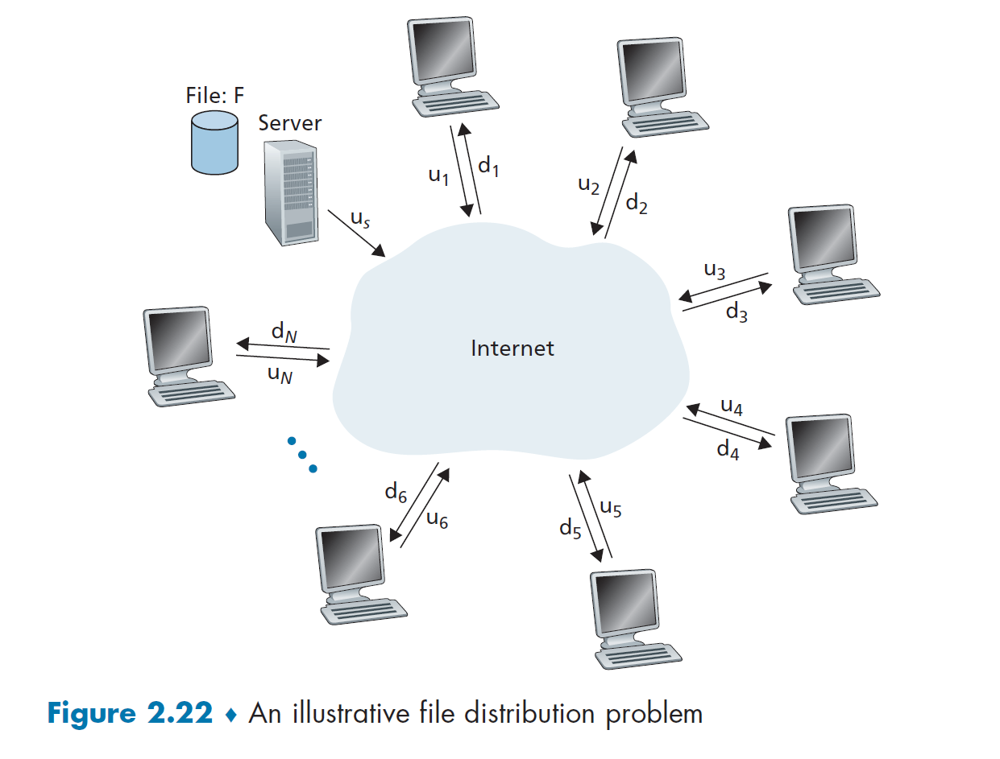
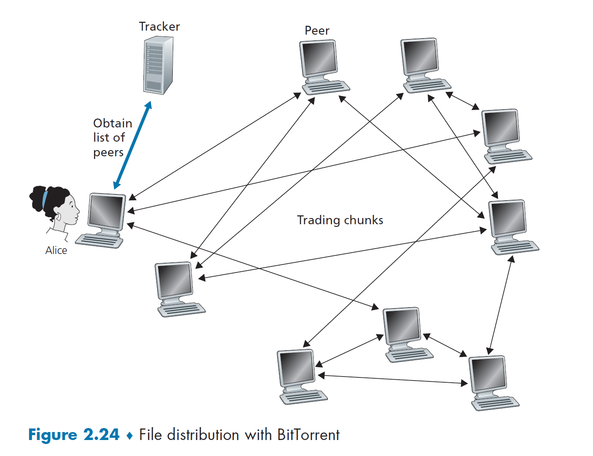
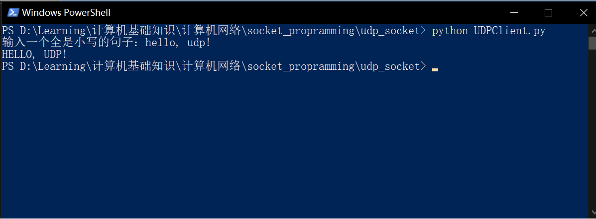
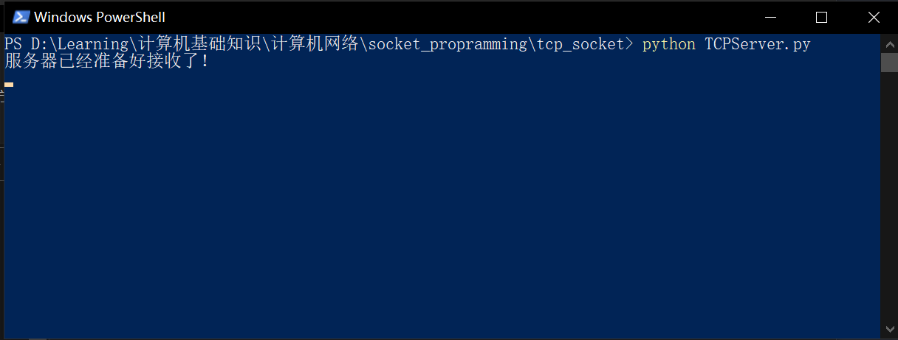
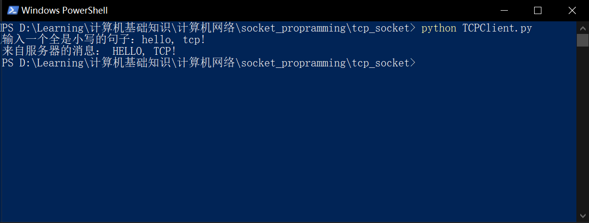
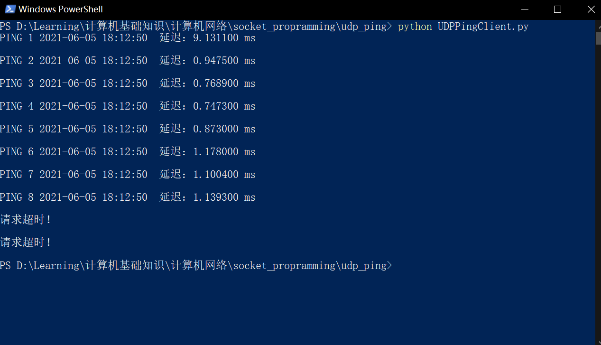
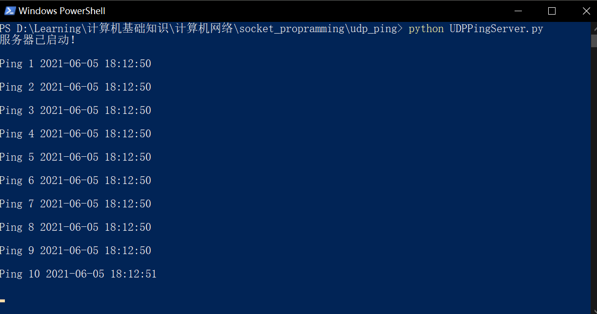
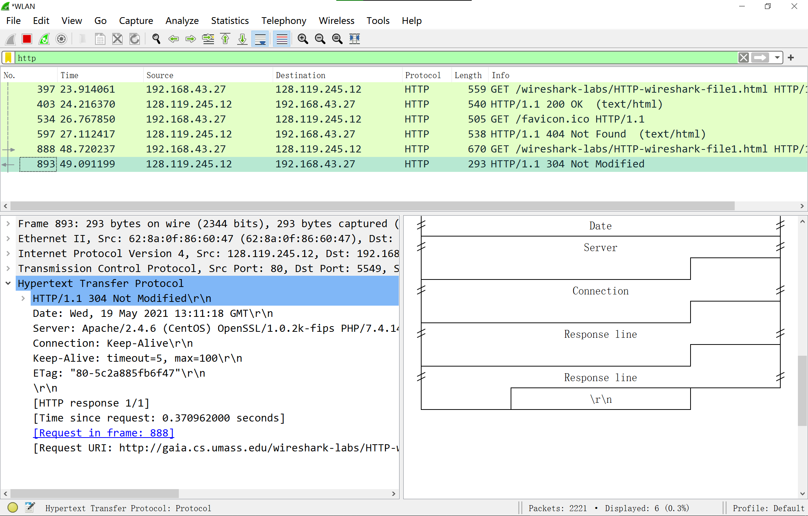
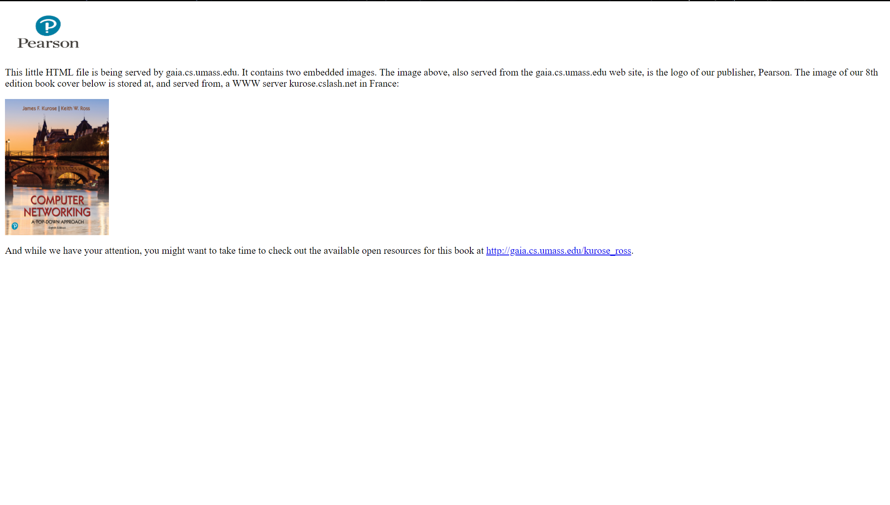

**目录：**

- [2. 应用层](#2-应用层)
  - [2.1. 应用层协议原理](#21-应用层协议原理)
    - [2.1.1. 进程通信](#211-进程通信)
    - [2.1.2. 可供应用程序使用的运输层服务](#212-可供应用程序使用的运输层服务)
    - [2.1.3. Internet 提供的运输层服务](#213-internet-提供的运输层服务)
    - [2.1.4. 应用层协议](#214-应用层协议)
    - [2.1.5. 本书涉及的网络应用](#215-本书涉及的网络应用)
  - [2.2. Web 和 HTTP](#22-web-和-http)
    - [2.2.1. HTTP 概述](#221-http-概述)
    - [2.2.2. 持续连接和非持续连接](#222-持续连接和非持续连接)
    - [2.2.3. HTTP 报文格式](#223-http-报文格式)
    - [2.2.4. Cookie](#224-cookie)
    - [2.2.5. 代理](#225-代理)
    - [2.2.6. HTTP/2](#226-http2)
  - [2.3. 电子邮件](#23-电子邮件)
    - [2.3.1. SMTP](#231-smtp)
    - [2.3.2. SMTP VS HTTP](#232-smtp-vs-http)
    - [2.3.3. SMTP 报文格式](#233-smtp-报文格式)
    - [2.3.4. 邮件访问协议](#234-邮件访问协议)
  - [2.4. DNS](#24-dns)
    - [2.4.1. DNS 提供的服务](#241-dns-提供的服务)
    - [2.4.2. DNS 运作原理概述](#242-dns-运作原理概述)
    - [2.4.3. DNS 记录和报文](#243-dns-记录和报文)
  - [2.5. P2P 文件分发](#25-p2p-文件分发)
  - [2.6. 视频流和内容分发网络(CDN)](#26-视频流和内容分发网络cdn)
    - [2.6.1. Internet 视频](#261-internet-视频)
    - [2.6.2. HTTP 流和 DASH](#262-http-流和-dash)
    - [2.6.3. 内容分发网络](#263-内容分发网络)
  - [2.7. 套接字编程](#27-套接字编程)
    - [2.7.1. UDP 套接字编程](#271-udp-套接字编程)
    - [2.7.2. TCP 套接字编程](#272-tcp-套接字编程)
  - [2.8. 实验 2：编写简单的 Web 服务器](#28-实验-2编写简单的-web-服务器)
    - [2.8.1. OrignWebServer.py](#281-orignwebserverpy)
    - [2.8.2. WebServer.py](#282-webserverpy)
    - [2.8.3. 测试 Web 服务器](#283-测试-web-服务器)
  - [2.9. 实验 3：编写简单的 UDP Ping 程序](#29-实验-3编写简单的-udp-ping-程序)
    - [2.9.1. UDPPingServer.py](#291-udppingserverpy)
    - [2.9.2. UDPPingClient.py](#292-udppingclientpy)
    - [2.9.3. 测试 UDP ping 程序](#293-测试-udp-ping-程序)
  - [2.10. 实验 4：用 wireshark 观察 HTTP](#210-实验-4用-wireshark-观察-http)
    - [2.10.1. 基本的 HTTP GET/响应交互](#2101-基本的-http-get响应交互)
    - [2.10.2. 条件 HTTP GET/响应交互](#2102-条件-http-get响应交互)
    - [2.10.3. 获取长文档](#2103-获取长文档)
    - [2.10.4. 嵌入对象的 HTML 文档](#2104-嵌入对象的-html-文档)
  - [2.11. 实验 5：用 wireshark 观察 DNS](#211-实验-5用-wireshark-观察-dns)
    - [2.11.1. nslookup](#2111-nslookup)
    - [2.11.2. ipconfig](#2112-ipconfig)
    - [2.11.3. 用 wireshark 跟踪 DNS 解析](#2113-用-wireshark-跟踪-dns-解析)

# 2. 应用层

**time : 2021-06-18**

网络应用是 Internet 存在的理由和发展的驱动力。在 Internet 出现以后，数不胜数的网络应用被开发了出来。

在 1970 和 1980 年代，经典的基于文本的网络应用十分流行。在 1990 年代中期，万维网变得非常火热，万维网涉及了网上冲浪，搜索，以及电子商务。2000 年后，更有竞争力的网络应用开始涌现，包括语音电话和视频会议(如：Skype，Facetime，和 Google Hangouts)，用户生成视频(如 Youtube)和网上影院(如 Netflix)，多人在线游戏(如第 2 人生)。同时，我们还看到新一代网络社交应用的出现，如 Facebook，Instagram，和 Twitter。近来，伴随着智能手机和 4G/5G 无线网络的到来，更多基于位置的应用涉及租房(如 Yelp)，约会(Tinder)，道路流量监控(Waz)，以及移动支付应用(如 WeChat 和 WhatsApp)出现了。

在本章，我们将学习网络应用的概念和简单实现。一开始我们会讨论关键的应用层概念，包括应用需要的服务，客户和服务器，进程，以及运输层接口。我们会仔细查看几个网络应用，包括 Web，e-mail，peer-to-peer(P2P)文件分发，以及视频流。之后，我们会讨论网络应用的开发，包含 TCP 和 UDP。具体来说，我们会学习套接字接口，并用 Python 编写一些简单的客户服务器程序。

## 2.1. 应用层协议原理

网络应用程序需要应用开发者在不同的端系统上开发对应的应用程序。

网络核心设备如分组交换机等没有实现网络层以上的协议，因此不需要开发者在网络核心设备上开发程序。

### 2.1.1. 进程通信

网络应用程序之间的通信具体上是 **进程** 之间的通信。一个进程可以理解为运行在端系统上的一个程序。当多个进程运行在同一个操作系统时，他们使用进程间通信机制进行通信，这个机制由操作系统确定。在本书中，我们关注的是运行在不同端系统上进程之间的通信。

1. **客户和服务器进程**

网络应用程序由成对的进程组成，这些进程通过网络相互发送报文。例如，在 Web 应用程序中，一个客户浏览器进程与一台 Web 服务器进程交换报文。在一个 P2P 文件共享系统中，文件从一个对等方中的进程传输到另一个对等方中的进程。对每对通信进程, 我们通常将这两个进程之一标识为客户,而另一个进程标识为服务器。 对于 Web 而言，浏览器是一个客户进程，Web 服务器是一台服务器进程。对于 P2P 文件 共享，下载文件的对等方标识为客户，上传文件的对等方标识为服务器。

2. **进程与计算机网络之间的接口**

如上所述，多数应用程序是由通信进程对组成，每对中的两个进程互相发送报文。从一个进程向另一个进程发送的报文必须通过下面的网络。进程通过一个称为 **套接字(socket)** 的软件接口向网络发送报文和从网络接收报文。

图 2-3 显示了两个经过 Internet 通信的进程之间的套接字通信（图 2-3 中假定由该进程使用的下面运输层协议是 Internet 的 TCP 协议）。如该图所示，套接字是同一台主机内应用层与运输层之间的接口。由于该套接字是建立网络应用程序的可编程接口，因此套接字也称为应用程序和网络之间的 **应用程序编程接口(Application Programming Interface, API)**。应用程序开发者可以控制套接字在应用层端的一切，但是对该套接字的运输层端几乎没有控制权。应用程序开发者对于运输层的控制仅限于：1.选择运输层协议；2. 可以设定几个运输层参数，如最大缓存和最大报文段长度等（将在第 3 章中涉及）。一旦应用程序开发者选择了一个运输层协议（如果可供选择的话），则应用程序就建立在由该协议提供的运输层服务之上。我们将在 2-7 节中对套接字进行更为详细的探讨。


3. **进程寻址**

为了向特定目的地发送邮政邮件，目的地需要有一个地址。类似地，在一台主机上运行的进程为了向在另一台主机上运行的进程发送分组，接收进程需要有一个地址。为了标识该接收进程，需要定义两种信息：1. 主机的地址；2. 在目的主机中指定接收进程的标识符。其中主机地址由 **IP 地址标识**。进程由 **端口号** 标识。例如，Web 服务器进程默认用 80 端口标识，邮件服务器进程默认用 25 标识。常见的端口号可以在[这里](https://zh.wikipedia.org/wiki/TCP/UDP%E7%AB%AF%E5%8F%A3%E5%88%97%E8%A1%A8)找到。我们将在第三章详细学习。

### 2.1.2. 可供应用程序使用的运输层服务

前面讲过套接字是应用程序进程和运输层协议之间的接口。

一个运输层协议能够为调用它的应用程序提供什么样的服务呢？我们大体能够从四个方面对应用程序服务要求进行分类：**可靠数据传输**、**吞吐量**、**时延** 和 **安全性**。

1. **可靠数据传输**

如第 1 章讨论的那样，分组在计算机网络中可能丢失。例如，分组能够使路由器中的缓存溢岀，或者当分组中的某些比特损坏后可能被丢弃。像电子邮件、文件传输、远程主机访问、Web 文档传输以及金融应用等这样的应用，数据丢失可能会造成灾难性的后果(在后一种情况下，无论对银行或对顾客都是如此！)

因此，为了支持这些应用，必须做一些工作以确保由应用程序的一端发送的数据正确、完全地交付给该应用程序的另一端。如果一个协议提供了这样的确保数据交付服务，就认为提供了 **可靠数据传输**。

当一个运输层协议不提供可靠数据传输时，由发送进程发送的某些数据可能到达不了接收进程。这可能能被 **容忍丢失** 的应用所接受，最值得注意的是多媒体应用，如交谈式音频/视频，它们能够承受一定量的数据丢失。在这些多媒体应用中，丢失的数据引起播放的音频/视频出现小干扰，而不是致命的损伤。

2. **吞吐量**

在第 1 章中我们引入了可用吞吐量的概念，在沿着一条网络路径上的两个进程之间的通信会话场景中，可用吞吐量就是发送进程能够向接收进程交付比特的速率。因为其他会话将共享沿着该网络路径的带宽，并且因为这些会话将会到达和离开，该可用吞吐量将随时间波动。

这样的确保吞吐量的服务将对许多应用程序有吸引力。例如，如果 Internet 电话应用程序对语音以 32kbps 的速率进行编码， 那么它需要以这个速率向网络发送数据，并以该速率向接收应用程序交付数据。如果运输 协议不能提供这种吞吐量，该应用程序或以较低速率进行编码（并且接收足够的吞吐量以 维持这种较低的编码速率），或它可能必须放弃发送.这是因为对于这种 Internet 电话应用 而言，接收所需吞吐量的一半是几乎没有或根本没有用处的。具有吞吐量要求的应用程序 被称为 **带宽敏感的应用**。许多当前的多媒体应用是带宽敏感的，尽管某些多媒体应用程序可能采用自适应编码技术对数字语音或视频以与当前可用 带宽相匹配的速率进行编码。

带宽敏感的应用具有特定的吞吐量要求，而弹性应用能够根据当时可用的带宽或多或少地利用可供使用的吞吐量。电子邮件、文件传输以及 Web 传送都属于 **弹性应用**。当然，吞吐量是越多越好。

3. **时延**

运输层协议也能提供定时保证。如同具有吞吐量保证那样，定时保证能够以多种形式实现。一个保证的例子如：发送方注入进套接字中的每个比特到达接收方的套接字不迟于 100ms。这种服务将对交互式实时应用程序有吸引力，如 Internet 电话、虚拟环境、电话会 议和多方游戏，所有这些服务为了有效性而要求数据交付有严格的时间限制。例如，在 Internet 电话中，较长的时延会导致会话中出现不自然的停顿；在多方游戏和虚拟互动环境中，在做出动作并看到来自环境（如来自位于端到端连接中另一端点的玩家）的响应之间，较长的时延使得它失去真实感。对于非实时的应用，较低的时延总比较高的时延好，但对端到端的时延没有严格的约束。

4. **安全性**

最后，运输协议能够为应用程序提供一种或多种安全性服务。例如，在发送主机中，运输协议能够加密由发送进程传输的所有数据，在接收主机中，运输层协议能够在将数据交付给接收进程之前解密这些数据。这种服务将在发送和接收进程之间提供机密性，以防该数据以某种方式在这两个进程之间被观察到。运输协议还能提供除了机密性以外的其他安全性服务，包括数据完整性和端点鉴别，我们将在第 8 章中详细讨论这些主题。

### 2.1.3. Internet 提供的运输层服务

至此，我们已经考虑了计算机网络能够提供的通用运输服务。现在我们要更为具体地考察由 Internet 提供的运输服务类型。Internet（更一般的是 TCP/IP 网络）为应用程序提供两个运输层协议，即 UDP 和 TCP。当你（作为一个软件开发者）为 Internet 创建一个新的应用时，首先要做出的决定是，选择 UDP 还是选择 TCP。每个协议为调用它们的应用程序提供了不同的服务集合。下表显示了某些所选的应用程序的服务要求：

| 应用程序                | 数据丢失 | 吞吐量                                  | 时间敏感  |
| ----------------------- | -------- | --------------------------------------- | --------- |
| 文件传输或下载          | 不能丢失 | 弹性                                    | 不        |
| 电子邮件                | 不能丢失 | 弹性                                    | 不        |
| Web 文档                | 不能丢失 | 弹性(几 kps)                            | 不        |
| Internet 电话或视频会议 | 容忍丢失 | 音频：几 kps-1 Mbps 视频：10 kps-5 Mbps | 是：100ms |
| 流式储存音频或视频      | 容忍丢失 | 同上                                    | 是：几秒  |
| 交互游戏                | 容忍丢失 | 几 kps-10 kpbs                          | 是：100ms |
| 智能手机讯息            | 不能丢失 | 弹性                                    | 是或不    |

1. **TCP 服务**

TCP 服务模型包括面向连接服务和可靠数据传输服务。当某个应用程序调用 TCP 作为其运输协议时，该应用程序就能获得来自 TCP 的这两种服务。

- 面向连接的服务：在应用层数据报文开始流动之前，TCP 让客户和服务器互相交换运输层控制信息。这个所谓的握手过程提醒客户和服务器，让它们为大量分组的到来做好准备。在握手阶段后，一个 **TCP 连接(TCP connection)** 就在两个进程的套接字之间建立了。这条连接是全双工的，即连接双方的进程可以在此连接上同时进行报文收发。当应用程序结束报文发送时，必须拆除该连接。在第 3 章中我们将详细讨论面向连接的服务，并分析它是如何实现的。

- 可靠的数据传送服务：通信进程能够依靠 TCP,无差错、按适当顺序交付所有发送的数据。当应用程序的一端将字节流传进套接字时，它能够依靠 TCP 将相同的字节流交付给接收方的套接字，而没有字节的丢失和冗余。

TCP 协议还具有拥塞控制机制，这种服务不一定能为通信进程带来直接好处，但能为 Internet 带来整体好处。当发送方和接收方之间的网络出现拥塞时，TCP 的拥塞控制机制会抑制发送进程（客户或服务器）。如我们将在第 3 章中所见，TCP 拥塞控制也试图限制每个 TCP 连接，使它们达到公平共享网络带宽的目的。

2. **UDP 服务**

UDP 是一种不提供不必要服务的轻量级运输协议，它仅提供最小服务。UDP 是无连接的，因此在两个进程通信前没有握手过程。UDP 协议提供一种不可靠数据传送服务，也就是说，当进程将一个报文发送进 UDP 套接字时，UDP 协议并不保证该报文将到达接收进程。不仅如此，到达接收进程的报文也可能是乱序到达的。

UDP 没有包括拥塞控制机制，所以 UDP 的发送端可以用它选定的任何速率向其下层（网络层）注入数据。（然而，值得注意的是实际端到端吞吐量可能小于该速率，这可能是因为中间链路的带宽受限或因为拥塞而造成的。

流行 Internet 应用的应用层协议和运输层协议如下表所示：

| 应用程序      | 应用层协议                                        | 下层运输层协议 |
| ------------- | ------------------------------------------------- | -------------- |
| 电子邮件      | SMTP [RFC 5321]                                   | TCP            |
| 远程终端访问  | Telnet [RFC 854]                                  | TCP            |
| Web           | HTTP 1.1 [RFC 7230]                               | TCP            |
| 文件传输      | FTP [RFC 959]                                     | TCP            |
| 流媒体        | HTTP (如：YouTube), DASH                          | TCP            |
| Internet 电话 | SIP [RFC 3261], RTP [RFC 3550], 或专用(如：Skype) | UDP 或 TCP     |

### 2.1.4. 应用层协议

我们刚刚学习了通过把报文发送进套接字实现网络进程间的相互通信。但是如何构造这些报文？在这些报文中的各个字段的含义是什么？进程何时发送这些报文？这些问题将我们带进应用层协议的范围。应用层协议定义了运行在不同端系统上的应用程序进程如何相互传递报文。特别是应用层协议定义了：

- **交换的报文类型**，例如请求报文和响应报文。
- **各种报文类型的语法**，如报文中的各个字段及这些字段是如何描述的。
- **字段的语义**，即这些字段中的信息的含义。
- **确定一个进程何时以及如何发送报文，对报文进行响应的规则**。

有些应用层协议是由 RFC 文档定义的，因此它们位于公共域中。例如，Web 的应用层协议 HTTP （超文本传输协议[RFC 7230］）就作为一个 RFC 可供使用。如果浏览器开发者遵从 HTTP RFC 规则，所开发出的浏览器就能访问任何遵从该文档标准的 Web 服务器并获取相应 Web 页面。还有很多别的应用层协议是专用的，有意不为公共域使用。例如，Skype 使用了专用的应用层协议。

区分网络应用和应用层协议是很重要的。应用层协议只是网络应用的一部分。我们来看一些例子。Web 是一种客户-服务器应用，它允许客户按照需求从 Web 服务器获得文档。该 Web 应用有很多组成部分，包括文档格式的标准（即 HTML）、Web 浏览器、 Web 服务器，以及一个应用层协议。Web 的应用层协议是 HTTP，它定义了在浏览器和 Web 服务器之间传输的报文格式和时序。因此，HTTP 只是 Web 应用的一个部分（尽管是重要部分）。举另外一个例子，将在 2-6 节讨论的 Netflix 视频服务也有许多组成部分，包括储存和传输视频的服务器，管理账单和客户相关功能的服务器，客户(你智能手机，平板电脑或者笔记本上的 Netflix app)，以及一个应用层协议称为 DASH，它定义了 Netflix 客户和服务器之间交换报文的格式和时序。因此，应用层协议 DASH 只是 Netflix 应用的一部分。

### 2.1.5. 本书涉及的网络应用

在本书中，我们会讨论 5 种流行的网络应用程序，包括：Web，电子邮件，DNS，P2P 和流式视频。

## 2.2. Web 和 HTTP

**time : 2021-05-06**

截至到 1990 年代早期，Internet 主要被研究员，学者，和大学学生用来登录远程主机，上传本地文件到远程主机，从远程主机下载文件，接收和发送新闻或电子邮件。虽然这些应用极其有用，但 Internet 只局限于研究和学着的圈子。之后，一个新的应用到来了，那就是万维网[Berners-Lee 1994]。万维网是第一个进入大众视野的应用，它极大地改变了人们的工作和生活方式。

万维网最吸引人的一点就是用户可以随时地获取他们想要的东西。这不同与广播和电视，用户智能在固定的时间观看内容提供者提供的内容。此外，用户在万维网上可以容易和低廉地发布内容。超链接和搜索引擎帮助用户在信息的海洋中导航。图片和视频刺激着用户的感官。JavaScript 和表单使得用户可以和网页交互。Web 和 HTTP 也用于 Youtube，e-mail(如 GMail)，以及大部分移动网络应用，如 Instagram 和 Google Maps。

### 2.2.1. HTTP 概述

Web 的应用层协议 **超文本传输协议(HyperText Transfer Protocol, HTTP)** 是 Web 的核心。HTTP 定义在 [RFC 1945]，[RFC 7230] 和 [RFC 7540]中。HTTP 由 2 个程序实现：一个客户程序和一个服务器程序。客户程序和服务器程序运行在不同的主机之上，互相交换 HTTP 报文。HTTP 定义了报文的格式，字段的语义以及程序之间交换报文的时序。在详细解释 HTTP 之前，我们先来简单地看一下 Web 相关的术语。

一个 Web 页面（或 Web 文档）是由对象构成的。一个对象就是一个文件，这些文件可以是 HTML 文件，图片，视频，javascript 脚本，CSS 样式文件，这些文件可以由唯一的 URL 来定位。大部分 Web 页面由一个 HTML 基本文件和若干个引用对象构成。例如，如果一个 Web 页面由一个基本的 HTML 文件和 5 个图片构成，那么这个 Web 页面有 6 个对象：一个 HTML 基本文件和 5 个图片。这个 HTML 基本文件通过对象的 URL 地址引用他们。每个 URL 地址有个重要的 2 部分：存放对象的主机名和这个对象的路径。例如：http://www.someSchool.edu/someDepartment/picture.gif 的主机名为 www.someSchool.edu，对象路径为 `/someDepartment/picture.gif`。**Web 浏览器** 如 Google chrome 和 Firefox 是常见的 HTTP 客户程序。所以我们可能交换地使用浏览器和客户来指代 HTTP 客户。**Web 服务器** 包括 Apache 和 Microsoft Internet Information Server 实现了 HTTP 服务器程序。

HTTP 定义了 Web 客户向 Web 服务器请求 Web 页面的方式，以及 Web 服务器向 Web 客户响应的方式。如图 2-6 所示。HTTP 使用 TCP 作为它的运输层协议。HTTP 客户首先发起一个与服务器的 TCP 连接。一旦连接建立，该浏览器和服务器就可以通过套接字使用 TCP。客户向他的套接字接口发送 HTTP 请求报文，或者从它的套接字接口接收 HTTP 响应报文。类似地，服务器从它的套接字接口接收 HTTP 请求报文，或者向它的套接字接口发送 HTTP 响应报文。一旦客户向他的套接字接口发送了一个请求报文，该报文就脱离了客户的控制，进入了 TCP 的控制。


值得注意的是：服务器向客户发送被请求的文件，却不存储该客户的状态信息。假如某个客户在短短的几秒内两次请求同一个对象，服务器并不会因为刚刚为该客户提供了该对象就不再做出反应，而是重新发送该对象，就像服务器已经完全忘记不久之前所做过的事一样。因为 HTTP 服务器并不保存关于客户的任何信息，所以我们说 HTTP 是一个 **无状态协议(stateless protocol)**。我们也注意到 Web 使用了客户-服务器应用程序体系结构。Web 服务器总是打开的，具有一个固定的 IP 地址，且它服务于可能来自数以百万计的不同浏览器的请求。

### 2.2.2. 持续连接和非持续连接

在许多 Internet 应用程序中，客户和服务器在一个相当长的时间范围内通信，其中客户发出一系列请求并且服务器对每个请求进行响应。依据应用程序以及该应用程序的使用方式，这一系列请求可以周期性地或者间断性地一个接一个发出。因为这种客户-服务器的交互是经 TCP 进行的，应用程序的研制者就需要做一个重要决定，即每个请求/响应对是经一个单独的 TCP 连接发送，还是所有的请求及其响应经相同的 TCP 连接发送呢？当采用前一种方法时，该应用程序被称为采用 **非持续连接(non-pers1stent connection)**，采用后一种方法，该应用程序被称为采用 **持续连接(pers1stent connection)**。尽管 HTTP 在其默认方式下采用持续连接，HTTP 客户和服务器也能配置成采用非持续连接。

1. **采用非持续连接的 HTTP**

我们来仔细观察一下，在非持续连接情况下，服务器向客户传送一个 Web 页面的过程。假设该页面有一个 HTML 基本文件和 10 个 JPEG 图片，并且这 11 个对象位于同一台服务器上。假设该 HTML 基本文件的 URL 为：http://www.someSchool.edu/someDepartment/index.html

我们来看看发生了什么：

1. HTTP 客户进程在端口号 80 发起一个到服务器 www.someSchool.edu 的 TCP 连接，该端口号是 HTTP 的默认端口。在客户和服务器上分别有一个套接字与该连接关联。
2. HTTP 客户经它的套接字向该服务器发送一个 HTTP 请求报文。请求报文中包含了路径名 /someDepartment/index.html （后面我们会详细讨论 HTTP 报文）。
3. HTTP 服务器进程经它的套接字接收该请求报文，从其存储器（RAM 或磁盘）中检索出对象 www.someSchool.edu/someDepartment/index.html， 并在一个 HTTP 响应报文中封装对象，并通过其套接字向客户发送响应报文。
4. HTTP 服务器进程通知 TCP 断开该 TCP 连接。（但是直到 TCP 确认客户已经完整地收到响应报文为止，它才会实际中断连接。）
5. HTTP 客户接收响应报文，TCP 连接关闭。该报文指岀封装的对象是一个 HTML 文件，客户从响应报文中提取出该文件，检査该 HTML 文件，得到对 10 个 JPEG 图形的引用。
6. 对每个引用的 JPEG 图形对象重复前 4 个步骤。

当浏览器收到 Web 页面后，向用户显示该页面。两个不同的浏览器也许会以不同的方式解释（即向用户显示）该页面。HTTP 和浏览器如何解释一个 Web 页面毫无关系。 HTTP 规范（([RFC 1945] and [RFC 7540]）仅定义了在 HTTP 客户程序与 HTTP 服务器程序之间的通信协议。

上面的步骤举例说明了非持续连接的使用，其中每个 TCP 连接在服务器发送一个对象后关闭，即该连接并不为其他的对象而持续下来。值得注意的是每个 TCP 连接只传输一个请求报文和一个响应报文。因此在本例中，当用户请求该 Web 页面时，要产生 11 个 TCP 连接。

在上面描述的步骤中，我们有意没有明确客户获得这 10 个 JPEG 图形对象是使用 10 个串行的 TCP 连接，还是使用了一些并行的 TCP 连接。事实上，用户能够配置现代浏览器来控制连接的并行度。在默认方式下，大部分浏览器打开 5 ~ 10 个并行的 TCP 连接，而每条连接处理一个请求响应事务。如果用户愿意，最大并行连接数可以设置为 1，这样 10 条连接就会串行建立。我们在下一章会看到，使用并行连接可以缩短响应时间。

在继续讨论之前，我们估算一下从客户请求 HTML 基本文件起到该客户收到整个文件所花费的时间。为此，我们给出 **往返时间(Round-Trip Time RTT)** 的定义，该时间是一个短分组从客户到服务器然后再返回客户所花费的时间。RTT 包括传播时延，排队时延和分组时延。

如图 2-7 所示。当用户再浏览器中点击一个超链接时，浏览器向 Web 服务器发起一个 TCP 连接请求。涉及一次“三次握手”：浏览器向 Web 服务器发送一个小的 TCP 报文段，服务器用一个小 TCP 报文段做出响应。最后浏览器向服务器返回确认。三次握手中前两个部分所耗费的时间占用了一个 RTT。完成了三次握手的前两个部分后，客户结合三次握手的第三部分（确认）向该 TCP 连接发送一个 HTTP 请求报文。一旦该请求报文到达服务器，服务器就在该 TCP 连接上发送 HTML 文件。该 HTTP 请求/响应用去了另一个 RTT。因此，粗略地讲，总的响应时间就是两个 RTT 加上服务器传输 HTML 文件的时间。


1. **采用持续连接的 HTTP**

非持续连接有一些缺点。第一，必须为每一个请求的对象建立和维护一个全新的连接。对于每个这样的连接，在客户和服务器中都要分配 TCP 的缓冲区和保持 TCP 变量，这给 Web 服务器带来了严重的负担，因为一台 Web 服务器可能同时服务于数以百计不同的客户的请求。第二，就像我们刚描述的那样，每一个对象经受两倍 RTT 的交付时延，即一个 RTT 用于创建 TCP,另一个 RTT 用于请求和接收一个对象。

在 HTTP 1.1 采用持续连接的情况下，服务器在发送响应后保持该 TCP 连接打开。在相同的客户与服务器之间，后续的请求和响应报文能够通过相同的连接进行传送。特别是，一个完整的 Web 页面（上例中的 HTML 基本文件加上 10 个图形）可以用单个持续 TCP 连接进行传送。更有甚者，位于同一台服务器的多个 Web 页面在从该服务器发送给同一个客户时，可以在单个持续 TCP 连接上进行。可以请求可以一个接一个地请求对象，而不必等待对未决请求（流水线）的回答。一般来说，如果一条连接在一定时间间隔（一个可配置的超时间隔）后没有被使用，HTTP 服务器就会关闭该连接。HTTP 的默认模式是使用带流水线的持续连接。我们鼓励读者阅读 [Heidemann 1997; Nielsen 1997; RFC 7540]。

### 2.2.3. HTTP 报文格式

HTTP 规范［RFC 1945；RFC 2616；RFC 7540] 包含了对 HTTP 报文格式的定义。HTTP 报文有两种：请求报文和响应报文。下面讨论这两种报文。

1. **HTTP 请求报文**

下面时一个典型的 HTTP 请求报文

```http
GET /somedir/page.html HTTP/1.1
Host: www.someschool.edu
Connection: close
User-agent: Mozilla/5.0
Accept-language: fr
```

该报文由不同的 ASCII 文本书写。
每行都有由一个换行符。最后一行再附加一个空行。
虽然这个特定的报文仅有 5 行，但一个请求报文能够具有更多的行或者至少为一行。

HTTP 请求报文的第一行是**请求行**，后继的行是**首部行**。

- **请求行**

请求行由 3 个字段：方法字段，URL 字段和 HTTP 版本字段。方法字段可以取不同的值：GET，POST，HEAD，PUT 和 DELETE。绝大部分 HTTP 请求报文使用的是 GET 方法字段。后面的 URL 字段是请求对象的地址。版本字段是自动解释的，在这个例子中是 HTTP 1.1 版本。

- **首部行**

首先是主机地址。之后的 `Connection: close` 表示再服务器发送完成对象之后就关闭该连接。`User-agent: Mozilla/5.0` 指定了用户的 HTTP 代理，这里是 Mozilla/5.0 浏览器，这个字段是有一定作用的，服务器可以根据用户代理的不同发送请求对象的不同版本。最后 `Accept-language: fr` 表示用户想得到对象的语言版本为法语。

如图 2-8 所示，这是 HTTP 请求报文的通用格式。


- **实体体**

在观察图 2-8 时，你可能注意到了实体体。当 HTTP 请求使用 GET 方法时，实体体为空，而使用 POST 方法时才使用实体体。当用户提交表单时， HTTP 客户常常使用 POST 方法，例如，当用户向搜索引擎提供搜索关键词时。 使用 POST 报文时，用户仍可以向服务器请求一个 Web 页面，但 Web 页面的特定内容依赖于用户在表单字段中输入的内容。如果请求方法为 POST，则实体体的就是用户在表单字段中输入的值。

值得注意的是，提交表单所生成的 HTTP 报文不一定就要采用 POST 方法。相反，HTTP 表单经常采用 GET 方法，此时输入的字段值会被包含进 URL 中。举个例子，如果一个表单使用 GET 方法，并且提交的两个字段值是 monkeys 和 bananas，那么 URL 就会是这样 www.somes1te.com/animalsearch?monkeys&bananas。 在你日复一日的网上冲浪中，你可能看见过这种扩展的 URL。

HEAD 方法和 GET 方法类似。当一个服务器收到一个 HEAD 请求，它会以一个不包含请求对象的报文响应。应用开发者常用这种请求来开发调试。PUT 方法和发布对象有关。PUT 请求允许用户上传对象到网页上的一个具体路径。在应用中，PUT 请求常被用来上传对象。DELETE 方法允许用户或一个用户删除服务器上的一个对象。

2. **HTTP 响应报文**

下面的响应报文是上面请求报文的响应。

```http
HTTP/1.1 200 OK
Connection: close
Date: Tue, 18 Aug 2015 15:44:04 GMT
Server: Apache/2.2.3 (CentOS)
Last-Modified: Tuer 18 Aug 2015 15:11:03 GMT
Content-Length: 6821
Content-Type: text/html

(data data data data data ...)
```

该响应有 3 个部分：第一行为 **状态行**，6 个 **首部行**，然后是 **实体体**。

- **状态行**

状态行有 3 个字段：协议版本字段，状态码，和相应的状态信息。再这个例子中，状态行表示 Web 服务器使用的 HTTP 版本为 1.1，并且一切正常(服务器已经找到请求对象并成功发送)。

常用的状态码包括：
200 0K：请求成功，信息在返回的响应报文中。
301 Moved Permanently：请求的对象已经被永久转移了，新的 URL 定义在响应报 文的 Location:首部行中。客户软件将自动获取新的 URL。
400 Bad Request: 一个通用差错代码，指示该请求不能被服务器理解。
404 Not Found:被请求的文档不在服务器上。
505 HTTP Vers1on Not Supported:服务器不支持请求报文使用的 HTTP 协议版本。

- **首部行**

`Connection: close` 表示发送这条报文后会关闭该连接。
`Date: Tue, 18 Aug 2015 15:44:04 GMT` 表示发送这条报文的日期。
`Server: Apache/2.2.3 (CentOS)` 表示该报文是由一台 Apache web 服务器产生的。
`Last-Modified: Tuer 18 Aug 2015 15:11:03 GMT` 表示发送对象最后的修改时间。
`Content-Length: 6821` 表示发送对象的字节数。
`Content-Type: text/html` 表示发送对象的类型为 html 文本。

如图 2-9 所示，这是 HTTP 响应报文的通用格式。


浏览器是如何决定在一个请求报文中包含哪些首部行的呢？ Web 服务器又是如何决定在一个响应报文中包含哪些首部行呢？浏览器产生的首部行与很多因素有关，包括浏览器的类型和协议版本（例如，HTTP/1.0 浏览器将不会产生任何 1.1 版本的首部行）、浏览器的用户配置（如喜好的语言）、浏览器当前是否有一个缓存的但是可能超期的对象版本。Web 服务器的表现也类似：在产品、版本和配置上都有差异，所有这些都会影响响应报文中包含的首部行。

### 2.2.4. Cookie

我们前面提到了 HTTP 服务器是无状态的。这简化了服务器的设计，并且允许工程师们去开发可以同时处理数以千计的 TCP 连接的高性能 Web 服务器。然而一个 Web 站点通常希望能够识别用户，可能是因为服务器希望限制用户的访问，或者因为它希望把内容与用户身份联系起来。为此，HTTP 使用了 cookie。cookie 在［RFC 6265］中定义，它允许站点对用户进行跟踪。目前大多数商务 Web 站点都使用了 cookie。

cookie 技术有 4 个部分：

1. 在 HTTP 响应报文中首部行的 cookie。
2. 在 HTTP 请求报文中首部行的 cookie。
3. 在用户端系统中保留有一个 cookie 文件，并由对应浏览器进行管理。
4. 位于 Web 服务器的一个后端数据库。

如图 2-11 所示。


假设 Susan 总是从家中 PC 使用 Internet Explorer 上网，她首次与 Amazon.com 联系。我们假定过去她已经访问过 eBay 站点。当请求报文到达该 Amazon Web 服务器时，该 Web 站点将产生一个唯一识别码，并以此作为索引在它的后端数据库中产生一个表项。接下来 Amazon Web 服务器用一个包含 `Set-cookie:` 首部的 HTTP 响应报文对 Susan 的浏览器进行响应，其中 Set-cookie：首部含有该识别码。例如，该首部行可能是

```
Set-cookie: 1678
```

当 Susan 的浏览器收到了该 HTTP 响应报文时，它会看到该 `Set-cookie:` 首部。该浏览器在它管理的特定 cookie 文件中添加一行，该行包含服务器的主机名和在 `Set-cookie:` 首部中的识别码。值得注意的是该 cookie 文件已经有了用于 eBay 的表项，因为 Susan 过去访问过该站点。当 Susan 继续浏览 Amazon 网站时，每请求一个 Web 页面，其浏览器就会查询该 cookie 文件并抽取她对这个网站的识别码，并放到 HTTP 请求报文中包括识别码的 cookie 首部行中。特别是，发往该 Amazon 服务器的每个 HTTP 请求报文都包括以下首部行:

```
Cookie: 1678
```

在这种方式下，Amazon 服务器可以跟踪 Susan 在 Amazon 站点的活动。尽管 AmazonWeb 站点不必知道 Susan 的名字，但它确切地知道用户 1678 按照什么顺序、在什么时间、访问了哪些页面！ Amazon 使用 cookie 来提供它的购物车服务，即 Amazon 能够维护 Susan 希望购买的物品列表，这样在 Susan 结束会话时可以一起为它们付费。

如果 Susan 再次访问 Amazon 站点，比如说一个星期后，她的浏览器会在其请求报文中继续放入首部行 `cookie: 1678`。 Amazon 将根据 Susan 过去在 Amazon 访问的网页向她推荐产品。如果 Susan 也在 Amazon 注册过，即提供了她的全名、电子邮件地址、邮政地址和信用卡账号，则 Amazon 能在其数据库中包括这些信息，将 Susan 的名字与识别码相关联（以及她在过去访问过的本站点的所有页面）。这就解释了 Amazon 和其他一些电子商务网站实现"点击购物（one-click shopping）的道理，即当 Susan 在后继的访问中选择购买某个物品时，她不必重新输入姓名、信用卡账号或者地址等信息了。

从上述讨论中我们看到，cookie 可以用于标识一个用户。用户首次访问一个站点时，可能需要提供一个用户标识（可能是名字）。在后继会话中，浏览器向服务器传递一个 cookie 首部，从而向该服务器标识了用户。因此 cookie 可以在无状态的 HTTP 之上建立一个用户会话层。例如，当用户向一个基于 Web 的电子邮件系统（如 Hotmail）注册时，浏览器向服务器发送 cookie 信息，允许该服务器在用户与应用程序会话的过程中标识该用户。

尽管 cookie 常常能简化用户的 Internet 购物活动，但是它的使用仍具有争议，因为它们被认为是对用户隐私的一种侵害。如我们刚才所见，结合 cookie 和用户提供的账户信息，Web 站点可以知道许多有关用户的信息，并可能将这些信息卖给第三方。Cookie Central [Cookie Central 2016]包括了对 cookie 争论的广泛信息。

### 2.2.5. 代理

**代理** 或 **代理服务器** 可以代表原来的 Web 服务器来响应 HTTP 请求。

假如用户配置了浏览器，使得浏览器的请求可以被转发到代理服务器。如图 2-11 所示，当用户请求 http://www.someschool.edu/campus.gif 将会发生以下情况：


1. 浏览器创建一个到代理服务器的 TCP 连接，并向代理服务器中的对象发送 HTTP 请求。
2. 代理服务器进行检查，查看本地是否存储了该对象的副本，如果有，代理服务器就向客户浏览器发送包含该对象的 HTTP 响应报文。
3. 如果代理服务器中没有这个对象，那么代理服务器会创建一个到 www.someschool.edu 的 TCP 连接，并请求该对象，www.someschool.edu 服务器会向代理服务器发送包含该对象的响应报文。
4. 代理服务器接收到该对象后，他会在本地存储一份副本，并利用(1)中建立的 TCP 连接向客户浏览器发送包含该对象的响应报文。

一般来说，代理被 ISP 购买和安装。例如，一个大学可能会安装配置代理，使得校园网内的请求被转发到代理服务器。或者一个地区性 ISP 可能会安装配置多个代理，使得 ISP 网络内的请求被转发至这些代理服务器。

使用代理有可以减少访问时延以及减少服务器的负载。

通过使用 **内容分发网络(Content Distribution Network, CDN)**，代理服务器正在 Internet 中发挥着越来越重要的作用。CDN 公司在 Internet 上安装了许多地理上分散的代理服务器，因而使大量流量实现了本地化。有多个共享的 CDN （例如 Akamai 和 Limelight）和专用的 CDN （例如谷歌和 Netflix）。我们将在 2-6 节中更为详细地讨论 CDN。

**条件 GET 方法**

web 代理可以减少用户感受到的响应时间，但也引入了一个新的问题，存放在 web 代理服务器上的文件的副本可能是陈旧的。换句话说，保存在服务器中的对象自该副本缓存在客户上以后可能已经被修改了。幸运的是，HTTP 协议有一种机制，允许代理服务器证实它的对象是最新的。这种机制就是 **条件 GET(conditional GET)方法**[RFC 7232]。如果：1. 请求报文使用 GET 方法；并且 2. 请求报文中包含一个 `If-Modified-S1nce` 首部行。那么，这个 HTTP 请求报文就是一个条件 GET 请求报文。

为了说明 GET 方法的操作方式，我们看一个例子。首先，一个代理服务器代表浏览器，向某 Web 服务器发送一个请求报文:

```http
GET /fruit/kiwi.gif HTTP/1.1
Host: www.exotiquecuis1ne.com
```

之后，该 Web 服务器向缓存器发送具有被请求的对象的响应报文:

```http
HTTP/1.1 200 OK
Date: Sat, 3 Oct 2015 15:39:29
Server: Apache/1.3.0 (Unix)
Last-Modified: Wed, 9 Sep 2015 09:23:24
Content-Type: image/gif

(data data data data data ...)
```

该代理服务器在将对象转发到请求的浏览器的同时，也在本地缓存了该对象。重要的是，代理服务器在存储该对象时也存储了最后修改日期。最后，一个星期后，另一个用户经过该代理服务器请求同一个对象，该对象仍在这个代理服务器中。由于在过去的一个星期中位于 Web 服务器上的该对象可能已经被修改了，该代理服务器通过发送一个条件 GET 执行最新检查。具体来说，该缓存器发送:

```http
GET /fruit/kiwi.gif HTTP/1.1
Host: www.exotiquecuis1ne.com
If-modified-since: Wed, 9 Sep 2015 09:23:24
```

值得注意的是 `If-Modified-S1nce` 首部行的值正好等于一星期前服务器发送的响应报文中的 `Last-Modified` 首部行的值。该条件 GET 报文告诉服务器，仅当自指定日期之后该对象被修改过，才发送该对象。假设该对象自 2015 年 9 月 9 日 09:23:24 后没有被修改。接下来的第四步，Web 服务器向该缓存器发送一个响应报文:

```http
HTTP/1.1 304 Not Modified
Date: Satf Oct 2015 15:39:29
Server: Apache/1.3.0 (Unix)

(empty entity body)
```

我们看到，作为对该条件 GET 方法的响应，该 Web 服务器仍发送一个响应报文，但并没有在该响应报文中包含所请求的对象。包含该对象只会浪费带宽，并增加用户感受到的响应时间，特别是如果该对象很大的时候更是如此。值得注意的是在最后的响应报文中，状态行中为 `304 Not Modified`，它告诉代理服务器可以使用该对象，能向请求的浏览器转发它（该代理服务器）缓存的该对象副本。

我们现在完成了对 HTTP 的讨论，这是我们详细学习的第一个 Internet 协议（应用层协议）。我们已经学习了 HTTP 报文的格式，学习了当发送和接收这些报文时 Web 客户和服务器所采取的动作。我们还学习了一点 Web 应用程序基础设施，包括 cookie 和代理所有这些都以某种方式与 HTTP 协议有关。

**time : 2021-06-19**

### 2.2.6. HTTP/2

HTTP/2 [RFC 7540] 在 2015 年被标准化，是继 HTTP/1.1 在 1997 年被标准化以来的新版本。在标准化后，HTTP/2 发展迅猛，截至 2020 年，超过 40% 的顶级的 1000 万个网站已经支持了 HTTP/2 [W3Techs]。多数浏览器包括 Google Chrome，Internet Explorer，Safari，Opera，和 Firefox 支持 HTTP/2。

HTTP/2 的首要目标是减少感知时延。HTTP 可以使请求和响应在一个 TCP 连接上复用，还提供了分优先级请求和服务器推送，以及提供了对 HTTP 首部字段的有效压缩。HTTP/2 没有更改请求方法，状态码，URL，或者首部字段。相反，HTTP/2 更改了数据的存储格式以及服务器和客户之间的传输方式。

为什么有了 HTTP/1.1，我们还需要 HTTP/2 呢？回忆我们前面对 HTTP/1.1 的讨论。HTTP/1.1 采用了持续连接，允许服务器通过 1 个 TCP 连接给客户发送一个网页。这种方式使得每请求一个网页就要开启一个 TCP 连接，所以减少了服务器的可用端口，而且每一个网页的传输占用的带宽使相同的。但浏览器的开发者很快就发现了一个问题：一个网页内的所有对象通过 1 个 TCP 连接进行传输会造成 **链路头阻塞(Head of Line, HOL, blocking)**。为了理解这个问题，我们考虑一个场景：一个网页包含一个视频还有一个基本 HTML 文件，这个视频在网页的前面。传输链路带宽也比较低。当使用 1 个 TCP 连接传输这个网页时，这个视频对象需要很长的时间，这就使得视频后面的网页内容得不到传输。或者说视频阻塞视频后的网页内容。传统的 HTTP/1.1 处理这个问题的方式是在浏览器内开启多个并行的 TCP 连接，因此这个网页可以并行进行传输。通过这种方式，视频后面的网页内容可以得到传输并被浏览器更快地渲染出来，因此减少了用户感知到的时延。

将在第 3 章讨论的 TCP 拥塞控制也推荐浏览器采用并行的 TCP 连接，而不是一个持续的 TCP 连接，在这种情况下，粗略来讲，每一个 TCP 连接会被分配相同的带宽。通过这种方式，浏览器可以获取到更大比例的带宽。许多支持 HTTP/1.1 的浏览器往往会开启最多 6 个并行的 TCP 连接，这种行为不仅仅是为了应对链路头阻塞问题，也是为了获取更大的带宽。

HTTP/2 的其中一个重要的目的就是减少在传输一个网页时，摆脱(至少要减少)开启的并行 TCP 连接数量。所以这不仅可以减少服务器要维持的真正需要的套接字的数量，还使得 TCP 拥塞控制像预期那样运作。但是如果仅仅只有 1 个 TCP 连接来传输 1 个网页，HTTP/2 就要仔细地设计传输机制以避免链路头阻塞。

1. **HTTP/2 插帧机制**

HTTP/2 地解决方案是将报文分成更小的帧，把请求报文或响应报文的帧交替插进一个相同的 TCP 连接中。为了理解这个机制，我们再次考虑上面提过的场景，假设这个网页由头部的视频和其他 8 个小的对象构成，那么服务器一共会收到 9 个 HTTP 请求。对于每个请求，服务器要发送 9 个响应报文给浏览器。假设每个帧的大小都是相等的，视频有 1000 帧，其他的 8 个小对象有 2 帧。在交替插帧的机制下，发送完第 1 个视频帧之后，其他的 8 个小对象的第 1 个帧会被接着发送。发送完第 2 个视频帧后，其他的 8 个小对象的第 2 个帧(即最后 1 帧)会被接着发送。因此，在总共发送完 18 个帧后，所有的小对象会被紧接着发送。通过这种机制，HTTP/2 显著减少了用户感知到的时延。

HTTP/2 的分帧以及交替插帧的能力是一个重要的提升。在浏览器收到帧之后，会把这些帧组装成原来的完整对象。分帧是由 HTTP/2 下层的分帧层完成的。当一个服务器向一个浏览器发送一个 HTTP 响应报文时，这个响应报文会被分帧层进行分帧。响应报文的首部区会形成一个帧，要发送的数据会被分为若干个帧，这些帧和其他响应报文的帧会被交替插进 1 个持续的 TCP 连接中并进行发送。在这些帧到达客户之后，会被客户的分帧层组装为原来的报文。同样地，客户的请求报文也会被分帧和交替插进 TCP 连接。

2. **响应报文分优先级以及服务器推送**

报文分优先级机制可以让开发者给请求不同的优先级，这样就可以优化应用的性能。当客户向服务器发送若干个请求报文时，客户会赋给这些请求报文不同的权重，范围为 1 到 256。越高的权重表示越高的优先级。服务器会首先发送优先级最高的请求对应的响应报文的帧。此外，客户也可以通过指定一个报文依赖的其他报文的 ID 来表示报文间的依赖关系。

HTTP/2 的另外一个能力是：服务器可以对一个请求发送多个响应报文。具体来讲，当客户发送了一个对 HTML 基本文档的请求后，服务器可以分析这个基本文档中包含的其他引用对象，进而不必等客户一个个发送对这些引用对象的请求报文，服务器自己便会分析这个 HTML 基本文件中的引用对象，然后直接发送对应的响应报文。这个机制可以摆脱客户请求引用对象。因此也显著减少了时延。

3. **HTTP/3**

我们将在第 3 章讨论一种被称为 QUIC 的协议。这是一种新的应用层协议，依托于 UDP 所构建。它有很多 HTTP 需要的特性，例如报文多路复用，流控制，低时延连接建立。HTTP/3 还是一个比较新的协议，他被设计为在 QUIC 协议之上运作。截至 2020 年，HTTP/3 被描述在 Internet 草案中，还没有完全标准化。

## 2.3. 电子邮件

**time : 2021-05-07**

电子邮件系统有 3 个重要的组成部分：**用户代理**，**邮件服务器** 和 **简单邮件传输协议(SMTP)**。

下面我们结合发送方 Alice 发电子邮件给接收方 Bob 的场景，对每个组成部分进行描述。用户代理允许用户阅读、回复、转发、保存和撰写报文。微软的 Outlook 和 Apple Mail 是电子邮件用户代理的例子。当 Alice 完成邮件撰写时，她的邮件代理向其邮件服务器发送邮件，此时邮件放在邮件服务器的外出报文队列中。当 Bob 要阅读报文时，他的用户代理在其邮件服务器的邮箱中取得该报文。

邮件服务器是电子邮件系统的核心。每个接收方(如 Bob)在其中的某个邮件服务器上有一个**邮箱**。Bob 的邮箱管理和维护着发送给他的报文。一个典型 的邮件发送过程是：从发送方的用户代理开始，传输到发送方的邮件服务器，再传输到接 收方的邮件服务器，然后在这里被分发到接收方的邮箱中。当 Bob 要在他的邮箱中读取该报文时，包含他邮箱的邮件服务器（使用用户名和口令）来鉴别 Bob。如果 Alice 的服务器不能将邮件交付给 Bob 的服务器，Alice 的邮件服务器在一个报文队列（message queue）中保持该报文并在以后尝试再次发送。通常每 30 分钟左右进行一次尝试；如果几天后仍不能成功，服务器就删除该报文并以电子邮件的形式通知发送方（Alice）。


SMTP 是 Internet 电子邮件中主要的应用层协议。它使用 TCP 可靠数据传输服务，从发送方的邮件服务器向接收方的邮件服务器发送邮件。像大多数应用层协议一样，SMTP 也有两个部分：运行在发送方邮件服务器的客户端和运行在接收方邮件服务器的服务器端。每台邮件服务器上既运行 SMTP 的客户端也运行 SMTP 的服务器端。当一个邮件服务器向其他邮件服务器发送邮件时，它就表现为 SMTP 的客户；当邮件服务器从其他邮件服务器上接收邮件时，它就表现为一个 SMTP 的服务器。

### 2.3.1. SMTP

RFC 5321 给出了 SMTP 的定义。SMTP 是 Internet 电子邮件的核心。如前所述，SMTP 用于从发送方的邮件服务器发送报文到接收方的邮件服务器。

为了描述 SMTP 的基本操作，我们观察一种常见的情景。假设 Alice 想给 Bob 发送一封简单的 ASCII 报文。

1） Alice 调用她的邮件代理程序并提供 Bob 的邮件地址（例如 bob® someschool. edu）, 撰写报文，然后指示用户代理发送该报文。
2） Alice 的用户代理把报文发给她的邮件服务器，在那里该报文被放在报文队列中。
3） 运行在 Alice 的邮件服务器上的 SMTP 客户端发现了报文队列中的这个报文，它就创建一个到运行在 Bob 的邮件服务器上的 SMTP 服务器的 TCP 连接。
4） 在经过一些初始 SMTP 握手后，SMTP 客户通过该 TCP 连接发送 Alice 的报文。
5） 在 Bob 的邮件服务器上，SMTP 的服务器端接收该报文。Bob 的邮件服务器然后将该报文放入 Bob 的邮箱中。
6） 在 Bob 方便的时候，他调用用户代理阅读该报文。

接下来我们分析一个在 SMTP 客户（C）和 SMTP 服务器（S）之间交换报文文本的例子。客户的主机名为 crepes.fr，服务器的主机名为 hamburger.edu。 以 C：开头的 ASCII 码 文本行正是客户交给其 TCP 套接字的那些行，以 S：开头的 ASCII 码则是服务器发送给其 TCP 套接字的那些行。一旦创建了 TCP 连接，就开始了下列过程：

```
S: 200 hamburger.edu
C: HELO crepes.fr
S: 250 Hello crepes.fr, pleased to meet you
C: MAIL FROM: <alice@crepes.fr>
S: 250 alice@crepes.fr ... Sender ok
C: RCPT TO: <bob@hamburger.edu>
S: 250 bob@hamburger.edu ... Recipient ok
C: DATA
S: 354 Enter mail, end with "." on a line by itself
C: Do you like ketchup?
C: How about pickles?
C: .
S: 250 Message accepted for delivery
C: QUIT
S: 221 hamburger.edu clos1ng connection
```

在上例中，客户从邮件服务器 crepes.fr 向邮件服务器 hamburger.edu 发送了一个报文 （"Do you like ketchup? How about pickles?" ） 。作为对话的一部分，该客户发送了 5 条命令：HELO （是 HELLO 的缩写）、MAIL FROM. RCPTTO、DATA 以及 QUIT。这些命令都是自解释的。该客户通过发送一个只包含一个句点的行，向服务器指示该报文结束了。（按照 ASCII 码的表示方法，每个报文以 CRLF. CRLF 结束，其中的 CR 和 LF 分别表示回车和换行。）服务器对每条命令做出回答，其中每个回答含有一个回答码和一些（可选 的）英文解释。我们在这里指出 SMTP 用的是持续连接：如果发送邮件服务器有几个报文发往同一个接收邮件服务器，它可以通过同一个 TCP 连接发送这些所有的报文。对每个报文，该客户用一个新的 MAIL FROM: crepes.fr 开始，用一个独立的句点指示该邮件的结束，并且仅当所有邮件发送完后才发送 QUIT。

### 2.3.2. SMTP VS HTTP

我们简要地比较一下 SMTP 和 HTTP。这两个协议都用于从一台主机向另一台主机传送文件：HTTP 从 Web 服务器向 Web 客户（通常是一个浏览器）传送文件（也称为对象）；SMTP 从一个邮件服务器向另一个邮件服务器传送文件（即电子邮件报文）。当进行文件传送时，持续的 HTTP 和 SMTP 都使用持续连接。因此，这两个协议有一些共同特征。

然而，两者之间也有一些重要的区别。

1. 首先，HTTP 主要是一个 **拉协议(pull protocol)**，即在方便的时候，某些人在 Web 服务器上装载信息，用户使用 HTTP 从该服务器拉取这些信息。特别是 TCP 连接是由想接收文件的机器发起的。另一方面，SMTP 基本上是一个 **推协议(push protocol)**，即发送邮件服务器把文件推向接收邮件服务器。特别是，这个 TCP 连接是由要发送该文件的机器发起的。

2. 第二个区别就是我们前面间接地提到过的，SMTP 要求每个报文（包括它们的体）采 用 7 比特 ASCII 码格式。如果某报文包含了非 7 比特 ASCII 字符（如具有重音的法文字符）或二进制数据（如图形文件），则该报文必须按照 7 比特 ASCII 码进行编码。HTTP 数据则不受这种限制。

3. 第三个重要区别是如何处理一个既包含文本又包含图形（也可能是其他媒体类型）的文档。如我们在 2.2 节知道的那样，HTTP 把每个对象封装到它自己的 HTTP 响应报文中, 而 SMTP 则把所有报文对象放在一个报文之中。

### 2.3.3. SMTP 报文格式

当 Alice 给 Bob 写一封邮寄时间很长的普通信件时，她可能要在信的上部包含各种各样的环境首部信息，如 Bob 的地址、她自己的回复地址以及日期等。同样，当一个人给另一个人发送电子邮件时，一个包含环境信息的首部位于报文体前面。这些环境信息包括在一系列首部行中，这些行由 RFC 5322 定义。首部行和该报文的体用空行（即回车换行）进行分隔。RFC 5322 定义了邮件首部行和它们的语义解释的精确格式。如同 HTTP 协议，每个首部行包含了可读的文本，是由关键词后跟冒号及其值组成的。某些关键词是必需的，另一些则是可选的。每个首部必须含有一个 From：首部行和一个 To：首部行；一个首部也许包含一个 Subject：首部行以及其他可选的首部行。重要的是注意到下列事实：这些首部行不同于我们在 2-3-1 节所学到的 SMTP 命令（即使那里包含了某些相同的词汇，如 from 和 to）。那节中的命令是 SMTP 握手协议的一部分；本节中考察的首部行则是邮件报文自身的一部分。

```
From: alice@crepes.fr
To: bob@hamburger.edu
Subject: Searching for the meaning of life.
```

在报文首部之后，紧接着一个空白行，然后是以 ACSII 格式表示的报文体.

### 2.3.4. 邮件访问协议

一旦 SMTP 将邮件报文从 Alice 的邮件服务器交付给 Bob 的邮件服务器，该报文就被放入了 Bob 的邮箱中。在此讨论中，我们按惯例假定 Bob 是通过登录到服务器主机，并直接在该主机上运行一个邮件阅读程序来阅读他的邮件的。直到 20 世纪 90 年代早期，这都是一种标准方式。而在今天，邮件访问使用了一种客户-服务器体系结构，即典型的用户通过在用户端系统上运行的客户程序来阅读电子邮件，这里的端系统可能是办公室的 PC、 便携机或者是智能手机。通过在本地主机上运行邮件客户程序，用户享受一系列丰富的特性，包括查看多媒体报文和附件的能力。

假设 Bob（接收方）在其本地 PC 运行用户代理程序，考虑在他的本地 PC 也放置一个邮件服务器是自然而然的事。在这种情况下，Alice 的邮件服务器就能直接与 Bob 的 PC 进行对话了。然而这种方法会有一个问题。前面讲过邮件服务器管理用户的邮箱，并且运行 SMTP 的客户端和服务器端。如果 Bob 的邮件服务器位于他的 PC 上，那么为了能够及时接收可能在任何时候到达的新邮件，他的 PC 必须总是不间断 地运行着并一直保持在线。这对于许多 Internet 用户而言是不现实的。相反，典型的用户通常在本地 PC 上运行一个用户代理程序，而它访问存储在总是保持开机的共享邮件服务器上的邮箱。该邮件服务器与其他用户共享，并且通常由用户的 ISP 进行维护（如大学或公司）。

现在我们考虑当从 Alice 向 Bob 发送一个电子邮件报文时所取的路径。我们刚才已经知道，在沿着该路径的某些点上，需要将电子邮件报文存放在 Bob 的邮件服务器上。通过让 Alice 的用户代理直接向 Bob 的邮件服务器发送报文，就能够做到这一点。这能够由 SMTP 来完成：实际上，SMTP 被设计成将电子邮件从一台主机推到另一台主机。然而常常 Alice 的用户代理和 Bob 的邮件服务器之间并没有一个直接的 SMTP 对话。相反，如图 2-16 所示，Alice 的用户代理用 SMTP 将电子邮件报文推入她的邮件服务器，接着她的邮件服务器（作为一个 SMTP 客户）再用 SMTP 将该邮件中继到 Bob 的邮件服务器。为什么该过程要分成两步呢？主要是因为不通过 Alice 的邮件服务器进行中继，Alice 的用户代理将没有任何办法到达一个不可达的目的地接收服务器。通过首先将邮件存放在自己的邮件服务器中，Alice 的邮件服务器可以重复地尝试向 Bob 的邮件服务器发送该报文，如每 30 分钟一次，直到 Bob 的邮件服务器变得运行为止。（并且如果 Alice 的邮件服务器关机，她则能向系统管理员进行申告！）SMTP RFC 文档定义了如何使用 SMTP 命令经过多个 SMTP 服务器进行报文中继。


但是对于该难题仍然有一个疏漏的环节！像 Bob 这样的接收方，是如何通过运行其本地 PC 上的用户代理，获得位于他的某 ISP 的邮件服务器上的邮件呢？值得注意的是 Bob 的用户代理不能使用 SMTP 得到报文，因为取报文是一个拉操作，而 SMTP 协议是一个推协议。通过引入一个特殊的邮件访问协议来解决这个难题，该协议将 Bob 邮件服务器上的报文传送给他的本地 PC。目前有一些流行的邮件访问协议，包括**第三版的邮局协议（Post Office Protocol—Vers1on 3 , POP3）、Internet 邮件访问协议（Internet Mail Access Protocol, IMAP）以及 HTTP。**

1. **POP3**

POP3 是一个极为简单的邮件访问协议，由 RFC 1939 进行定义。文档 RFC 1939 简短且可读性强。因为该协议非常简单，故其功能相当有限。当用户代理（客户）打开了一个 到邮件服务器（服务器）端口 110 上的 TCP 连接后，POP3 就开始工作了。随着建立 TCP 连接，POP3 按照三个阶段进行工作：特许（authorization）、事务处理以及更新。在第一个 阶段即特许阶段，用户代理发送（以明文形式）用户名和口令以鉴别用户。在第二个阶段 即事务处理阶段，用户代理取回报文；同时在这个阶段用户代理还能进行如下操作，对文做删除标记，取消报文删除标记，以及获取邮件的统计信息。在第三个阶段即更新阶段，它出现在客户发出了 quit 命令之后，目的是结束该 POP3 会话；这时，该邮件服务器删除那些被标记为删除的报文。

2. **IMAP**

使用 POP3 访问时，一旦 Bob 将邮件下载到本地主机后，他就能建立邮件文件夹,并将下载的邮件放入该文件夹中。然后 Bob 可以删除报文，在文件夹之间移动报文，并查询报文（通过发送方的名字或报文主题）。但是这种文件夹和报文存放在本地主机上的方式，会给移动用户带来问题，因为他更喜欢使用一个在远程服务器上的层次 文件夹，这样他可以从任何一台机器上对所有报文进行访问。使用 POP3 是不可能做到这一点的，POP3 协议没有给用户提供任何创建远程文件夹并为报文指派文件夹的方法。

为了解决这个或其他一些问题，由 RFC 3501 定义的 Internet 邮件访问协议 （IMAP）应运而生。和 POP3 一样，IMAP 是一个邮件访问协议，但是它比 POP3 具有 更多的特色，不过也比 POP3 复杂得多。（因此客户和服务器端的实现也都复杂得多。）IMAP 服务器把每个报文与一个文件夹联系起来；当报文第一次到达服务器时，它与收件人的 INBOX 文件夹相关联。收件人则能够把邮件移到一个新的、用户创建的文件夹中，阅读邮件，删除邮件等。IMAP 协议为用户提供了创建文件夹以及将邮件从一个文件夹移动到另一个文件夹的命令。IMAP 还为用户提供了在远程文件夹中查询邮件的命令，按指定条件去查询匹配的邮件。值得注意的是，与 POP3 不同，IMAP 服务器 维护了 IMAP 会话的用户状态信息，例如，文件夹的名字以及哪些报文与哪些文件夹相关联。

IMAP 的另一个重要特性是它具有允许用户代理获取报文某些部分的命令。例如，一个用户代理可以只读取一个报文的报文首部，或只是一个多部分 MIME 报文的一部分。用户代理和其邮件服务器之间使用低带宽连接（如一个低速调制解调器链路）的时候，这个特性非常有用。使用这种低带宽连接时，用户可能并不想取回他邮箱中的所有邮件，其要避免可能包含如音频或视频片断的大邮件。

3. **HTTP**

今天越来越多的用户使用他们的 Web 浏览器收发电子邮件。20 世纪 90 年代中期 Hotmail 引入了基于 Web 的接入。今天，谷歌、雅虎以及几乎所有重要的大学或者公司也提供了基于 Web 的电子邮件。使用这种服务，用户代理就是普通的浏览器，用 户和他远程邮箱之间的通信则通过 HTTP 进行。当一个收件人（如 Bob），想从他的 邮箱中访问一个报文时，该电子邮件报文从 Bob 的邮件服务器发送到他的浏览器，使用的是 HTTP 而不是 POP3 或者 IMAP 协议。当发件人（如 Alice）要发送一封电子邮 件报文时，该电子邮件报文从 Alice 的浏览器发送到她的邮件服务器，使用的是 HTTP 而不是 SMTP。然而，Alice 的邮件服务器在与其他的邮件服务器之间发送和接收邮件时，仍然使用的是 SMTP。

## 2.4. DNS

**time : 2021-05-14**

Internet 上的主机可以用 **主机名(hostname)** 的方式进行标识。如：www.google.com，www.youtube.com 等等。这种标识方法的优点是便于人们接收和记忆。然而，以这种方式标识，路由器无法辨识主机在 Internet 中的位置信息。由于这个原因，主机也可以用 **IP 地址(IP address)** 的方式进行标识。

我们将在第 4 章更为详细地介绍 IP 地址，现在就先简单地介绍一下。一个常见的 IP 地址由 4 个字节组成，并具有层次结构。例如 121.7.106.83 这样一个地址，其中每个字节都用十进制的 0-255 的数字表示，并用句点分隔开。我们说 IP 地址具有层次结构，是因为我们从左至右扫描它时，我们会得到越来越具体的主机位置信息。这类似于邮寄地址。

### 2.4.1. DNS 提供的服务

我们刚刚看到了识别主机有两种方式，通过主机名或者 IP 地址。人们喜欢便于记忆的主机名标识方式，而路由器则喜欢定长的、有着层次结构的 IP 地址。

为了折中这些不同的偏好，我们需要一种能进行主机名到 IP 地址转换的目录服务。这就是 **域名系统(Domain Name System, DNS)** 的主要任务。DNS 是：

1. 一个由分层的 DNS 服务器实现的分布式数据库
2. 一个方便主机查询分布式数据库的应用层协议

DNS 服务器通常是运行 BIND(Berkeley Internet Name Domain)软件［BIND 2012 ］的 UNIX 机器。DNS 协议运行在 UDP 之上，使用 53 号端口。

DNS 通常是由其他应用层协议所使用的，包括 HTTP、SMTP 和 FTP，将用户提供的主机名解析为 IP 地址。举一个例子，考虑运行在某用户主机上的一个浏览器（即一个 HTTP 客户）请求 URL www.someschool.edu/index.html 页面时会发生什么现象。为了使用户的一 主机能够将一个 HTTP 请求报文发送到 Web 服务器 www.someschool.edu，该用户主机必须获得 www.someschool.edu 的 IP 地址。其做法如下：

1. 用户主机运行着 DNS 客户端
2. 浏览器从上述 URL 中抽取主机名 www.someschool.edu，并将这个主机名传输给DNS客户端
3. DNS 客户端向 DNS 服务端发送一个包含这个主机名的请求
4. DNS 客户端最终会收到响应报文，其中包含主机名对应的 IP 地址
5. 一旦浏览器接收到来自 DNS 客户端发来的 IP 地址，它就可以向位于该 IP 地址 80 端口的 HTTP 服务器进程建立起一个 TCP 连接

从这个例子中，我们可以看到 DNS 给使用它的 Internet 应用带来了额外的时延。幸运的是，如我们下面讨论的那样，想获得的 IP 地址通常就缓存在一个附近的 DNS 服务器中，这有助于减少 DNS 的网络流量和 DNS 的平均时延。

除了主机名到 IP 地址的服务外，DNS 还提供了一些重要的服务：

- **主机别名(host alias1ng)**

如果一个主机的主机名比较复杂，那么这台主机可以拥有一个或者多个别名。女口，一台名为 relay1.west-coast.enterprise.com 的主机，可能还有两个别名为 enterprise.com 和 www.enterprise.com。在这种情况下，relay1.west-coast.enterprise.com 也称为 **规范主机名(canonical hostname)**。主机别名（当存在时）比主机规范名更 加容易记忆。应用程序可以调用 DNS 来获得主机别名对应的规范主机名以及主机的 IP 地址。

- **邮件服务器别名(mail server alias1ng)**

显而易见，人们也非常希望电子邮件地址好记忆。例如，如果 Bob 在雅虎邮件上有一个账户，Bob 的邮件地址就像 bob@yahoo.com 这样简单。然而，雅虎邮件服务器的主机名可能更为复杂，不像 yahoo.com 那样简单好记（例如，规范主机名可能像 relay1.west-coast.hotmail.com 那样）。电子邮件应用程序可以调用 DNS，对提供的主机名别名进行解析，以获得该主机的规范主机名及其 IP 地址。事实上，MX 记录（参见后面）允许一个公司的邮件服务器和 Web 服务器使用相同（别名化的）的主机名；例如，一个公司的 Web 服务器和邮件服务器都能叫作 enterprise.com。

- **负载分配(load distribution)**

DNS 也用于在冗余的服务器（如冗余的 Web 服务器等）之间进行负载分配。繁忙的站点（如 cnn.com）被冗余分布在多台服务器上, 每台服务器均运行在不同的端系统上，每个都有着不同的 IP 地址。由于这些冗余的 Web 服务器，一个 IP 地址集合因此与同一个规范主机名相联系。DNS 数据库中存储着这些 IP 地址集合。当客户对映射到某地址集合的名字发出一个 DNS 请求时，该服务器用 IP 地址的整个集合进行响应，但在每个回答中循环这些地址次序。因为客户通常总是向 IP 地址排在最前面的服务器发送 HTTP 请求报文，所以 DNS 就在所有这些冗余的 Web 服务器之间循环分配了负载。DNS 的循环同样可以用于邮件服务器，因此，多个邮件服务器可以具有相同的别名。一些内容分发公 司如 Akamai 也以更加复杂的方式使用 DNS ［ Dilley 2002］，以提供 Web 内容分发 （参见 2-6-3 节）。

DNS 由 RFC 1034 和 RFC 1035 定义，并且在几个附加的 RFC 中进行了更新。DNS 是 一个复杂的系统，我们在这里只是就其运行的主要方面进行学习。感兴趣的读者可以参考 这些 RFC 文档和 Albitz 和 Liu 写的书［Albitz 1993 ］；亦可参阅文章［Mockapetris 1998 ］ 和［Mockapetris 2005］，其中［Mockapetris 1998］是回顾性的文章，它提供了 DNS 组成和工作原理的精细的描述。

### 2.4.2. DNS 运作原理概述

下面给岀一个 DNS 工作过程的总体概括，我们的讨论将集中在主机名到 IP 地址转换服务方面。

假设运行在用户主机上的某些应用程序（如 Web 浏览器或邮件阅读器）需要将主机名转换为 IP 地址。这些应用程序将调用 DNS 的客户端，并指明需要被转换的主机名（在很多基于 UNIX 的机器上，应用程序为了执行这种转换需要调用函数 `gethostbyname()` ）。 用户主机上的 DNS 接收到后，向网络中发送一个 DNS 查询报文。所有的 DNS 请求和回答报文使用 UDP 数据报经端口 53 发送。经过若干毫秒到若干秒的时延后，用户主机上的 DNS 接收到一个提供所希望映射的 DNS 回答报文。这个映射结果则被传递到调用 DNS 的应用程序。因此，从用户主机上调用应用程序的角度看，DNS 是一个提供简单、直接的转换服务的黑盒子。但事实上，实现这个服务的黑盒子非常复杂，它由分布于全球的大量 DNS 服务器以及定义了 DNS 服务器与查询主机通信方式的应用层协议组成。

DNS 的一种简单设计是在 Internet 上只使用一个 DNS 服务器，该服务器包含所有的映射。在这种集中式设计中，客户直接将所有查询直接发往单一的 DNS 服务器，同时该 DNS 服务器直接对所有的查询客户做出响应。尽管这种设计的简单性非常具有吸引力，但它不适用于当今的 Internet，因为 Internet 有着数量巨大（并持续增长）的主机。这种集中式设计的问题包括:

- **单点故障（a s1ngle point of failure）**

如果该 DNS 服务器崩溃，整个 Internet 随之瘫痪！

- **通信容量(traffic volume)**

单个 DNS 服务器不得不处理所有的 DNS 査询（用于为上亿台主机产生的所有 HTTP 请求报文和电子邮件报文服务）。

- **距离的集中式数据库(distant centralized database)**

单个 DNS 服务器不可能邻近所有查询客户。如果我们将单台 DNS 服务器放在纽约市，那么所有来自 澳大利亚的查询必须传播到地球的另一边，中间也许还要经过低速和拥塞的链路。这将导致严重的时延。

- **维护(maintenance)**

单个 DNS 服务器将不得不为所有的 Internet 主机保留记录。这不仅将使这个中央数据库庞大，而且它还不得不为解决每个新添加的主机而频繁更新。

总的来说，在单一 DNS 服务器上运行集中式数据库完全没有可扩展能力。因此，DNS 采用了分布式的设计方案。事实上，DNS 是一个在 Internet 上实现分布式数据库的典型范例。

1. **分布式、层次数据库**

为了处理扩展性问题，DNS 使用了大量的 DNS 服务器，它们以层次方式组织，并且分布在全世界范围内。没有一台 DNS 服务器拥有 Internet 上所有主机的映射。相反， 这些映射分布在所有的 DNS 服务器上。大致说来，有 3 种类型的 DNS 服务器：**根 DNS 服务器**、**顶级域(Top Level Domain, TLD)服务器** 和 **权威 DNS 服务器**。这些服务器以图 2-17 中所示的层次结构组织起来。为了理解这 3 种类型的 DNS 服务器交互的方式，假定一个 DNS 客户要决定主机名 www.amazon.com 的 IP 地址。粗略说来，将发生下列事件。客户首先与根服务器之一联系，它将返回顶级域名 com 的 TLD 服务器的 IP 地址。该客户则与这些 TLD 服务器之一联系，它将为 amazon.com 返回权威服务器的 IP 地址。最后，该客户与 amazon.com 权威服务器之一联系，它为主机名 www.amazon.com 返回其 IP 地址。我们将很快更为详细地考察 DNS 查找过程。不过我们先仔细看一下这 3 种类型的 DNS 服务器。


- **根 DNS 服务器**

有 1300 多个根 DNS 服务器实例分布在全世界，如图 2-18 所示。


这 1300 多个根 DNS 服务器实例是 13 个根 DNS 服务器的复制，由 12 个独立的组织运作。你可以在[这里](https://root-servers.org/)找到详细信息。

根 DNS 服务器提供了顶级域(TLD)服务器的 IP 地址。

- **顶级域(TLD)服务器**

对于每个顶级域(如 com、org、net、edu 和 gov)和所有国家的顶级域(如 uk、fr、ca 和 jp)，都有 TLD 服务器(或服务器集群)。Veris1gn Global Registry Services 公司维护 com 顶级域的 TLD 服务器，Educause 公司维护 edu 顶级域的 TLD 服务器。你可以在[这里](https://data.iana.org/TLD/tlds-alpha-by-domain.txt)找到顶级域名列表。

TLD 服务器提供了权威 DNS 服务器的 IP 地址。

- **权威 DNS 服务器**

在 Internet 上具有公共可访问主机（如 Web 服务器和邮件服务器）的每个组织机构必须提供公共可访问的 DNS 记录，这些记录将这些主机的名 字映射为 IP 地址。一个组织机构的权威 DNS 服务器收藏了这些 DNS 记录。一个组织机构能够选择实现它自己的权威 DNS 服务器以保存这些记录；另一种方法是，该组织能够支付费用，让这些记录存储在某个服务提供商的一个权威 DNS 服务器中。多数大学和大公司实现和维护它们自己基本和辅助（备份）的权威 DNS 服务器。

- **本地服务器**

根、TLD 和权威 DNS 服务器都处在该 DNS 服务器的层次结构中。还有另一类重要的 DNS 服务器，称为本地 DNS 服务器（local DNS server）。严格说来，一个 本地 DNS 服务器并不属于该服务器的层次结构，但它对 DNS 层次结构是至关重要的。每个 ISP （如一个居民区的 ISP 或一个机构的 ISP）都有一台本地 DNS 服务器（也叫默认名字服务器）。当主机与某个 ISP 连接时，该 ISP 提供一台主机的 IP 地址，该主机具有一台或多台其本地 DNS 服务器的 IP 地址（通常通过 DHCP，将在第 4 章中讨论）。通过访问 Windows 或 UNIX 的网络状态窗口，用户能够容易地确定他的本地 DNS 服务器的 IP 地址。 主机的本地 DNS 服务器通常邻近本主机。对某机构 ISP 而言，本地 DNS 服务器可能就与主机在同一个局域网中；对于某居民区 ISP 来说，本地 DNS 服务器通常与主机相隔不超过几台路由器。当主机发岀 DNS 请求时，该请求被发往本地 DNS 服务器，它起着代理的作用，并将该请求转发到 DNS 服务器层次结构中，我们下面将更为详细地讨论。

我们来讨论一个简单的例子，假设主机 cse.nyu.edu 想知道主机 gaia.cs.umass.edu 的 IP 地址。同时假设纽约大学(NYU)的 cse.nyu.edu 主机的本地 DNS 服务器为 dns.nyu.edu，并且 gaia.cs.umass.edu 的权威 DNS 服务器为 dns.umass.edu。如图 2-19 所示。


主机 cse.nyu.edu 首先向它的本地 DNS 服务器 dns.nyu.edu 发送一个 DNS 查询报文。该查询报文含有被转换的主机名 gaia.cs.umass.edu。本地 DNS 服务器将该报文转发到根 DNS 服务器。该根 DNS 服务器注意到其 edu 前缀并向本地 DNS 服务器返回负责 edu 的 TLD 的 IP 地址列表。该本地 DNS 服务器则再次向这些 TLD 服务器之一发送查询报文。该 TLD 服务器注意到 umass.edu 前缀，并用权威 DNS 服务器的 IP 地址进行响应，该权威 DNS 服务器是负责马萨诸塞大学的 dns.umass.edu。最后，本地 DNS 服务器直接向 dns.umass.edu 重发查询报文，dns.umass.edu 用 gaia.cs.umass.edu 的 IP 地址进行响应。注意到在本例中，为了获得一台主机名的映射，共发送了 8 份 DNS 报文：4 份查询报文和 4 份回答报文！我们将很快明白利用 DNS 缓存减少这种査询流量的方法。

我们前面的例子假设了 TLD 服务器知道用于主机的权威 DNS 服务器的 IP 地址。一般而言，这种假设并不总是正确的。相反，TLD 服务器只是知道中间的某个 DNS 服务器，该中间 DNS 服务器依次才能知道用于该主机的权威 DNS 服务器。例如，再次假设马萨诸塞大学有一台用于本大学的 DNS 服务器，它称为 dns.umass.edu。 同时假设该大学的每个系都有自己的 DNS 服务器，每个系的 DNS 服务器是本系所有主机的权威服务器。在这种情况下，当中间 DNS 服务器 dns.umass.edu 收到了对某主机的请求时，该主机名是以 cs.umass.edu 结尾，它向 dns.nyu.edu 返回 dns.cs.umass.edu 的 IP 地址，后者是所有以 cs.umass.edu 结尾的主机的权威服务器。本地 DNS 服务器 dns.nyu.edu 则向权威 DNS 服务器发送查询，该权威 DNS 服务器向本地 DNS 服务器返回所希望的映射，该本地服务器依次向请求主机返回该映射。在这个例子中，共发送了 10 份 DNS 报文！

图 2-20 所示的例子利用了 **递归查询(recurs1ve query)** 和 **迭代查询(iterative query)**。从 cse.nyu.edu 到 dns.nyu.edu 发出的查询是递归查询，因为该查询以自己的名义请求 dns.nyu.edu 来获得该映射。而后继的 3 个查询是迭代查询，因为所有的回答都是直接返回给 dns.nyu.edu。从理论上讲，任何 DNS 查询既可以是迭代的也能是递归的。例如，图 2-20 显示了一条 DNS 查询链，其中的所有查询都是递归的。实践中，查询通常遵循图 2-19 中的模式：从请求主机到本地 DNS 服务器的查询是递归的，其余的查询是迭代的。


2. **DNS 缓存**

至此我们的讨论一直忽略了 DNS 系统的一个非常重要特色：DNS 缓存(DNS caching)。实际上，为了改善时延性能并减少在 Internet 上到处传输的 DNS 报文数量， DNS 广泛使用了缓存技术。DNS 缓存的原理非常简单。在一个请求链中，当某 DNS 服务器接收一个 DNS 回答(例如，包含某主机名到 IP 地址的映射)时，它能将映射缓存在本地存储器中。例如，在图 2-19 中，每当本地 DNS 服务器 dns.nyu.edu 从某个 DNS 服务器接收到一个回答，它能够缓存包含在该回答中的任何信息。如果在 DNS 服务器中缓存了一台主机名/IP 地址对，另一个对相同主机名的查询到达该 DNS 服务器时，该 DNS 服务器就能够提供所要求的 IP 地址，即使它不是该主机名的权威服务器。由于主机和主机名与 IP 地址间的映射并不是永久的，DNS 服务器在一段时间后(通常设置为两天)将丢弃缓存的信息。

举一个例子，假定主机 apricot.nyu.edu 向 dns.nyu.edu 查询主机名 cnn.com 的 IP 地址。此后，假定过了几个小时，纽约大学的另外一台主机如 kiwi.nyu.edu 也向 dns.nyu.edu 查询相同的主机名。因为有了缓存，该本地 DNS 服务器可以立即返回 cnn.com 的 IP 地址，而不必查询任何其他 DNS 服务器。本地 DNS 服务器也能够缓存 TLD 服务器的 IP 地址，因而允许本地 DNS 绕过查询链中的根 DNS 服务器。事实上，因为缓存，除了少数 DNS 查询以外，根服务器被绕过了。

### 2.4.3. DNS 记录和报文

共同实现 DNS 分布式数据库的所有 DNS 服务器存储了 **资源记录(Resource Record, RR)**， RR 提供了主机名到 IP 地址的映射。每个 DNS 回答报文包含了一条或多条资源记录。在本小节以及后续小节中，我们概要地介绍 DNS 资源记录和报文，更详细的信息可以在 [Albitz 1993] 或有关 DNS 的 RFC 文档 [RFC1034; RFC 1035] 中找到。

资源记录是一个包含了下列字段的 4 元组:

`(Name, Value, Type, TTL)`

TTL 是该记录的生存时间，它决定了资源记录应当从缓存中删除的时间。在下面给岀的记录例子中，我们忽略掉 TTL 字段。Name 和 Value 的值取决于 Type：

- 如果 Type = A，则 Name 是主机名，Value 是该主机名对应的 IP 地址。因此，一条类型为 A 的资源记录提供了标准的主机名到 IP 地址的映射。例如(Tayl.bar.foo.com, 145.37.93.126, A)就是一条类型 A 记录。

- 如果 Type = NS，则 Name 是个域(如 foo.com)，而 Value 是个知道如何获得该域中主机 IP 地址的权威 DNS 服务器的主机名。这个记录用于沿着查询链来路由 DNS 查询。例如(fgcom.cins.foo.com, NS)就是一条类型为 NS 的记录。

- 如果 Type = CNAME，则 Value 是别名为 Name 的主机对应的规范主机名。该记录能够向査询的主机提供一个主机名对应的规范主机名，例如(foo.com, relay 1.bar.foo.com, CNAME)就是一条 CNAME 类型的记录。

- 如果 Type = MX，则 Value 是个别名为 Name 的邮件服务器的规范主机名。举例来说，(foo.com, mail.bar.foo.com, MX)就是一条 MX 记录。MX 记录允许邮件服务器主机名具有简单的别名。值得注意的是，通过使用 MX 记录，一个公司的邮件服务器和其他服务器(如它的 Web 服务器)可以使用相同的别名。为了获得邮件服务器的规范主机名，DNS 客户应当请求一条 MX 记录；而为了获得其他服务器的规范主机名，DNS 客户应当请求 CNAME 记录。

如果一台 DNS 服务器是用于某特定主机名的权威 DNS 服务器，那么该 DNS 服务器会有一条包含用于该主机名的类型 A 记录(即使该 DNS 服务器不是其权威 DNS 服务器，它也可能在缓存中包含有一条类型 A 记录)。如果服务器不是用于某主机名的权威服务器，那么该服务器将包含一条类型 NS 记录，该记录对应于包含主机名的域；它还将包括一条类型 A 记录，该记录提供了在 NS 记录的 Value 字段中的 DNS 服务器的 IP 地址。举例来说，假设一台 edu TLD 服务器不是主机 gaia.cs.umass.edu 的权威 DNS 服务器，则该服务器将包含一条包括主机 cs.umass.edu 的域记录，如 (umass.edu, dns.umass.edu, NS)；该 edu TLD 服务器还将包含一条类型 A 记录，如(dns.umass.edu, 128.119.40.111 A)，该记录将名字 dns.umass.edu 映射为一个 IP 地址。

1. **DNS 报文**

在本节前面，我们提到了 DNS 查询和回答报文。DNS 只有这两种报文，并且，查询和回答报文有着相同的格式，如图 2-21 所示。DNS 报文中各字段的语义如下：


- 前 12 个字节是**首部区域**，其中有几个字段。第一个字段，标识符，是一个 16 比特的数，用于标识该查询。这个标识符会被复制到回答报文中，以便匹配。标志位用于标识该报文为查询报文(0)还是回答报文(1)。后面的 4 个字段，指出了首部后面的各个数据的数量。
- 问题区域包含正在查询的信息，该区域包括 1.域名字段。2.类型字段，指出被查询的问题的类型。，例如主机地址是与一个名字相关联（类型 A）还是与某个名字的邮件服务器相关联（类型 MX）。
- 回答区域包含了对最初请求域名的名字的资源记录。前面讲过每个资源记录中有 Type （如 A、NS、CNAME 和 MX）字段、Value 字段和 TTL 字段。在回答报文的回答区域中可以包含多条 RR,因此一个主机名能够有多个 IP 地址（例如，就像本节前面讨论的冗余 Web 服务器）。
- 权威区域包含了其他权威服务器的记录。
- 附加区域包含了其他有帮助的记录。例如，对于一个 MX 请求的回答报文的回答区域包含了一条资源记录，该记录提供了邮件服务器的规范主机名。该附加区域包含一个类型 A 记录，该记录提供了用于该邮件服务器的规范主机名的 IP 地址。

2. **nslookup**

windows cmd 提供了 nslookup 命令，可以显示出查询的回答。

```bat
nslookup www.baidu.com

服务器:  UnKnown
Address:  192.168.43.33

非权威应答:
名称:    www.a.shifen.com
Addresses:  36.152.44.96
          36.152.44.95
Aliases:  www.baidu.com
```

3. **DNS 数据库的插入**

上面的讨论只是关注如何从 DNS 数据库中取数据。你可能想知道这些数据最初是怎么进入数据库中的。我们在一个特定的例子中看看这是如何完成的。假定你刚刚创建一个称为网络乌托邦（Network Utopia）的令人兴奋的新创业公司。你必定要做的第一件事是在 **注册登记机构** 注册域名 networkutopia.com。注册登记机构（registrar）是一个商业实体，它验证该域名的唯一性，将该域名输入 DNS 数据库（如下面所讨论的那样），对提供的服务收取少量费用。

当你向某些注册登记机构注册域名 networkutopia.com 时，需要向该机构提供你的基本和辅助权威 DNS 服务器的名字和 IP 地址。假定该名字和 IP 地址是 dnsl.networkutopia.com 和 dns2. networkutopia.com 及 212.212.212.1 和 212.212.212.2O 对这两个权威 DNS 服务器 的每一个，该注册登记机构确保将一个类型 NS 和一个类型 A 的记录输入 TLD com 服务器。特别是对于用于 networkutopia.om 的基本权威服务器，该注册登记机构将下列两条资源记录插入该 DNS 系统中：

```
(networkutopia.com, dnsl.networkutopia.com, NS)
(dnsl.networkutopia.com, 212.212.212.1, A)
```

你还必须确保用于 Web 服务器www.networkutopia.com的类型A资源记录和用于邮件 服务器 mail.networkutopia.com 的类型 MX 资源记录被输入你的权威 DNS 服务器中。（直到最近，每台 DNS 服务器中的内容都是静态配置的，例如来自系统管理员的配置文件。
）

一旦完成所有这些步骤，人们将能够访问你的 Web 站点，并向你公司的雇员发送电子邮件。我们通过验证该说法的正确性来总结 DNS 的讨论。这种验证也有助于充实我们已经学到的 DNS 知识。假定在澳大利亚的 Alice 要观看 www.networkutopia.com 的 Web 页 面。如前面所讨论，她的主机将首先向其本地 DNS 服务器发送请求。该本地服务器接着则联系一个 TLD com 服务器。（如果 TLD com 服务器的地址没有被缓存，该本地 DNS 服务器也将必须与根 DNS 服务器相联系。）该 TLD 服务器包含前面列出的类型 NS 和类型 A 资源记录，因为注册登记机构将这些资源记录插入所有的 TLD com 服务器。该 TLD com 服务器向 Alice 的本地 DNS 服务器发送一个回答，该回答包含了这两条资源记录。该本地 DNS 服务器则向 212.212.212.1 发送一个 DNS 査询,请求对应于 www.networkutopia.com 的类型 A 记录。该记录提供了所希望的 Web 服务器的 IP 地址，如 212.212.71.4,本地 DNS 服务器将该地址回传给 Alice 的主机。Alice 的浏览器此时能够向主机 212. 212. 71. 4 发起一个 TCP 连接，并在该连接上发送一个 HTTP 请求。当一个人在网上冲浪时，有比满足眼球更多的事情在进行!

## 2.5. P2P 文件分发

**time : 2020-05-15**

在目前为止本章中描述的应用（包括 Web、电子邮件和 DNS）都采用了客户-服务器体系结构，极大地依赖于总是打开的基础设施服务器。2.1.1 节讲过，使用 P2P 体系结构，对总是打开的基础设施服务器有最小的（或者没有）依赖。与之相反，成对间歇连接的主机（称为对等方）彼此直接通信。这些对等方并不为服务提供商所拥有，而是受用户控制的桌面计算机和膝上计算机。

在本节中我们将研究一个非常自然的 P2P 应用，即从单一服务器向大量主机（称为对等方）分发一个大文件。该文件也许是一个新版的 Linux 操作系统，对于现有操作系统或应用程序的一个软件补丁，一个 MP3 音乐文件，或一个 MPEG 视频文件。在客户-服务器文件分发中，该服务器必须向每个对等方发送该文件的一个副本，即服务器承受了极大的负担，并且消耗了大量的服务器带宽。在 P2P 文件分发中，每个对等方能够向任何其他对等方重新分发它已经收到的该文件的任何部分，从而在分发过程中协助该服务器。到 2020 年止，最为流行的 P2P 文件分发协议是 BitTorrent。 该应用程序最初由 Bram Cohen 所研发，现在有许多不同的独立且符合 BitTorrent 协议的 BitTorrent 客户，就像有许多符合 HTTP 协议的 Web 浏览器客户一样。在下面的小节中，我们首先考察在文件分发环境中的 P2P 体系结构的自扩展性。然后我们更为详细地描述 BitTorrent,突出它的最为重要的特性和特色。

1. **P2P 体系结构的扩展性**

P2P 文件分发的描述如图 2-22 所示。



**分发时间(distribution time)** 是所有 N 个对等方得到该文件的副本所需要的时间。

如图 2-23 所示，P2P 体系结构的分发时间在对等方数量非常多时，客户-服务器体系结构和它的差距非常大。


我们从图 2-23 中看到，对于客户-服务器体系结构，随着对等方数量的增加，分发时间呈线性增长并且没有界。然而，对于 P2P 体系结构， 最小分发时间不仅总是小于客户-服务器体系结构的分发时间，并且对于任意的对等方数量 N，总是小于 1 小时。因此，具有 P2P 体系结构的应用程序能够是自扩展的。这种扩展性的直接成因是: 对等方除了是比特的消费者外还是它们的重新分发者。

2. **BitTorrent**

BitTorrent 是一种用于文件分发的流行 P2P 协议[Chao 2011] 。 用 BitTorrent 的术语来讲，参与一个特定文件分发的所有对等方的集合被称为一个**洪流(torrent)**。在一个洪流中的对等方彼此下载等长度的**文件块(chunk)**，典型的块长度为 256KB。当一个对等方首次加入一个洪流时，它没有块。随着时间的流逝，它累积了越来越多的块。当它下载块时，也为其他对等方上载了多个块。一旦某对等方获得了整个文件，它也许（自私地）离开洪流，或（大公无私地）留在该洪流中并继续向其他对等方上载块。同时，任何对等方可能在任何时候仅具有块的子集就离开该洪流，并在以后重新加入该洪流中。

我们现在更为仔细地观察 BitTorrent 运行的过程。因为 BitTorrent 是一个相当复杂的协议，所以我们将仅描述它最重要的机制，而对某些细节视而不见；这将使得我们能够通过树木看森林。每个洪流具有一个基础设施节点，称为**追踪器(tracker)**。当一个对等方加入某洪流时，它向追踪器注册自己，并周期性地通知追踪器它仍在该洪流中。以这种方式，追踪器跟踪参与在洪流中的对等方。一个给定的洪流可能在任何时刻具有数以百计或数以千计的对等方。

如图 2-24 所示，当一个新的对等方 Alice 加入该洪流时，追踪器随机地从参与对等 的集合中选择对等方的一个子集（为了具体起见，设有 50 个对等方），并将这 50 个对等方的 IP 地址发送给 Aliceo Alice 持有对等方的这张列表，试图与该列表上的所有对等方创建并行的 TCP 连接。我们称所有这样与 Alice 成功地创建一个 TCP 连接的对等方为“邻近对等方”（在图 2-23 中，Alice 显示了仅有三个邻近对等方。通常，她应当有更多的对等方）。随着时间的流逝，这些对等方中的某些可能离开，其他对等方（最初 50 个以外的）可能试图与 Alice 创建 TCP 连接。因此一个对等方的邻近对等方将随时间而波动。



在任何给定的时间，每个对等方将具有来自该文件的块的子集，并且不同的对等方具有不同的子集。Alice 周期性地（经 TCP 连接）询问每个邻近对等方它们所具有的块列表。 如果 Alice 具有 L 个不同的邻接节点，她将获得 L 个块列表。有了这个信息，Alice 将对她当前还没有的块发出请求（仍通过 TCP 连接）。

因此在任何给定的时刻，Alice 将具有块的子集并知道它的邻接节点具有哪些块。利用这 些信息，Alice 将做出两个重要决定。第一，她应当从她的邻接节点请求哪些块呢？第二，她应当向哪些向她请求块的邻接节点发送块？在决定请求哪些块的过程中，Alice 使用一种称为 **最稀缺优先（rarest first）** 的技术。这种技术的思路是，针对她没有的块在她的邻接节点中决定最稀缺的块（最稀缺的块就是那些在她的邻接节点中副本数量最少的块），并首先请求那些最稀缺的块。这样，最稀缺块得到更为迅速的重新分发，其目标是（大致地）均衡每个块在洪流中的副本数量。

为了决定她响应哪个请求，BitTorrent 使用了一种机灵的对换算法。其基本想法是，Alice 根据当前能够以最高速率向她提供数据的邻接节点，给出其优先权。特别是，Alice 对于她的每个邻接节点都持续地测量接收到比特的速率，并确定以最高速率流入的 4 个邻接节点。每过 10 秒，她重新计算该速率并可能修改这 4 个对等方的集合。用 BitTorrent 术语来说，这 4 个对等方被称为 **疏通(unchoked)**。重要的是，每过 30 秒，她也要随机地选择另外一个邻接节点并向其发送块。我们将这个被随机选择的对等方称为 Bob。因为 Alice 正在向 Bob 发送数据，她可能成为 Bob 前 4 位上载者之一，这样的话 Bob 将开始向 Alice 发送数据。如果 Bob 向 Alice 发送数据的速率足够高，Bob 接下来也能成为 Alice 的前 4 位上载者。换言之, 每过 30 秒 Alice 将随机地选择一名新的对换伴侣并开始与那位伴侣进行对换。如果这两名对等方都满足此对换，它们将对方放入其前 4 位列表中并继续与对方进行对换，直到该对 等方之一发现了一个更好的伴侣为止。这种效果是对等方能够以趋向于找到彼此的协调的速率上载。随机选择邻接节点也允许新的对等方得到块，因此它们能够具有对换的东西。除了这 5 个对等方（“前” 4 个对等方和一个试探的对等方）的所有其他相邻对等方均被“阻塞”，即它们不能从 Alice 接收到任何块。BitTorrent 有一些有趣的机制没有在这里讨论, 包括片（小块）、流水线、随机优先选择、残局模型和反怠慢[Cohen 2003]。

刚刚描述的关于交换的激励机制常被称为“一报还一报”（tit-for-tat） [Cohen 2003]。已证实这种激励方案能被回避[Liogkas 2006; Locher 2006； Piatek 2007]。无论如何,
BitTorrent “生态系统”取得了广泛成功，数以百万计的并发对等方在数十万条洪流中积极地共享文件。如果 BitTorrent 被设计为不采用一报还一报（或一种变种），然而在别的方面却完全相同的协议，BitTorrent 现在将很可能不复存在了，因为大多数用户将成为白嫖者了。[Sarouiu 2002]。

## 2.6. 视频流和内容分发网络(CDN)

据多方估计，流式视频包含 Netflix，Youtube 和 Amazon 占据了 80% 的 Internet 流量[Cisco 2020]。在本节中，我们将对如何在今天的 Internet 中实现流行的视频流服务进行概述。我们将看到它们的实现方式是使用应用层协议和以像高速缓存那样方式运行的服务器。

### 2.6.1. Internet 视频

在流式存储视频应用中，基础的媒体是预先录制的视频，例如电影、电视节目、录制好的体育事件或录制好的用户生成的视频（如通常在 YouTube 上可见的那些）。这些预先录制好的视频放置在服务器上，用户按需向这些服务器发送请求来观看视频。许多 Internet 公司现在提供流式视频，这些公司包括 Netflix、YouTube(谷歌)、Amazon 和抖音(TicTok)。

但在开始讨论视频流之前，我们先迅速感受一下视频媒体自身。视频是一系列的图像， 通常以一种恒定的速率（如每秒 24 或 30 张图像）来展现。一幅未压缩、数字编码的图像由像素阵列组成，其中每个像素是由一些比特编码来表示亮度和颜色。视频的一个重要特征是它能够被压缩，因而可用比特率来权衡视频质量。今天现成的压缩算法能够将一个视频压缩成所希望的任何比特率。当然，比特率越高，图像质量越好，用户的总体视觉感受越好。

从网络的观点看，也许视频最为突出的特征是它的高比特率。压缩的 Internet 视频的比特率范围通常从用于低质量视频的 100kbps，到用于流式高分辨率电影的超过 3Mbps，再到用于 4K 流式展望的超过 10 Mbps。这能够转换为巨大的流量和存储，特别是对高端视频。例如，单一 2Mbps 视频在 67 分钟期间将耗费 1GB 的存储和流量。到目前为止，对流式视频的最为重要的性能度量是平均端到端吞吐量。为了提供连续不断的布局，网络必须为流式应用提供平均吞吐量，这个流式应用至少与压缩视频的比特率一样大。

我们也能使用压缩生成相同视频的多个版本，每个版本有不同的质量等级。例如，我们能够使用压缩生成相同视频的 3 个版本，比特率分别为 300 kbps、1 Mbps 和 3 Mbps。用户则能够根据他们当前可用带宽来决定观看哪个版本。具有高速 Internet 连接的用户也许选择 3 Mbps 版本，使用智能手机通过 4G 观看视频的用户可能选择 1 Mbps 版本。

### 2.6.2. HTTP 流和 DASH

在 HTTP 流中，视频只是存储在 HTTP 服务器中作为一个普通的文件，每个文件有一 个特定的 URL。当用户要看该视频时，客户与服务器创建一个 TCP 连接并发送对该 URL 的 HTTP GET 请求。服务器则以底层网络协议和流量条件允许的尽可能快的速率，在一个 HTTP 响应报文中发送该视频文件。在客户一侧，字节被收集在客户应用缓存中。一旦该缓存中的字节数量超过预先设定的门限，客户应用程序就开始播放，特别是，流式视频应 用程序周期性地从客户应用程序缓存中抓取帧，对这些帧解压缩并且在用户屏幕上展现。 因此，流式视频应用接收到视频就进行播放，同时缓存该视频后面部分的帧。

如前一小节所述，尽管 HTTP 流在实践中已经得到广泛部署(例如，自 YouTube 发展初期开始)，但它具有严重缺陷，即所有客户接收到相同编码的视频，尽管对不同的客户或者对于相同客户的不同时间而言，客户可用的带宽大小有很大不同。这导致了一种新型基于 HTTP 的流的研发，它常常被称为经 HTTP 的 **动态适应性流(Dynamic Adaptive Streaming over HTTP, DASH)**。在 DASH 中，视频编码为几个不同的版本，其中每个版本具有不同的比特率，对应于不同的质量水平。客户动态地请求来自不同版本且长度为几秒的视频段数据块。当可用带宽量较高时，客户自然地选择来自高速率版本的块；当可用带宽量较低时，客户自然地选择来自低速率版本的块。客户用 HTTP GET 请求报文一次选择一个不同的块[Akhshabi 2011]。

DASH 允许客户使用不同的以太网接入速率流式播放具有不同编码速率的视频。使用低速连接的客户能够接收一个低比特率(和低质量)的版本，使用光纤连接的客户能够接收高质量的版本。如果端到端带宽在会话过程中改变的话，DASH 允许客户适应可用带宽。这种特色对于移动用户特别重要，当移动用户相对于基站移动时，通常他们能感受到其可用带宽的波动。

使用 DASH 后，每个视频版本存储在 HTTP 服务器中，每个版本都有一个不同的 URL。HTTP 服务器也有一个 **告示文件(manifest file)**，为每个版本提供了一个 URL 及其比特率。客户首先请求该告示文件并且得知各种各样的版本。然后客户通过在 HTTP GET 请求报文中对每块指定一个 URL 和一个字节范围，一次选择一块。在下载块的同时，客户也测量接收带宽并运行一个速率决定算法来选择下次请求的块。自然地，如果客户缓存 的视频很多，并且测量的接收带宽较高，它将选择一个高速率的版本。同样，如果客户缓存的视频很少，并且测量的接收带宽较低，它将选择一个低速率的版本。因此 DASH 允许客户自由地在不同的质量等级之间切换。

### 2.6.3. 内容分发网络

今天，许多 Internet 视频公司日复一日地向数以百万计的用户按需分发每秒数兆比特的 流。例如，YouTube 的视频库藏有几亿个，每天向全世界的用户分发几亿条流。向位于全世 界的所有用户流式传输所有流量同时提供连续播放和高交互性显然是一项有挑战性的任务。

对于一个 Internet 视频公司，或许提供流式视频服务最为直接的方法是建立单一的大规 模数据中心，在数据中心中存储其所有视频，并直接从该数据中心向世界范围的客户传输 流式视频。但是这种方法存在三个问题。首先，如果客户远离数据中心，服务器到客户的分组将跨越许多通信链路并很可能通过许多 ISP,其中某些 ISP 可能位于不同的大洲。如果这些链路之一提供的吞吐量小于视频消耗速率，端到端吞吐量也将小于该消耗速率，给用户带来恼人的停滞时延。（第 1 章讲过，一条流的端到端吞吐量由瓶颈链路的吞吐量所决定。）出现这种事件的可能性随着端到端路径中链路数量的增加而增加。第二个缺陷是 流行的视频很可能经过相同的通信链路发送许多次。这不仅浪费了网络带宽，Internet 视频公司自己也将为向 Internet 反复发送相同的字节而向其 ISP 运营商（连接到数据中心）支付 费用。这种解决方案的第三个问题是单个数据中心代表一个单点故障，如果数据中心或其 通向 Internet 的链路崩溃，它将不能够分发任何视频流了。

为了应对向分布于全世界的用户分发巨量视频数据的挑战，几乎所有主要的视频流公司都利用 **内容分发网（Content Distribution Network, CDN）**。 CDN 管理分布在多个地理位置上的服务器，在它的服务器中存储视频（和其他类型的 Web 内容，包括文档、图片和音频）的副本，并且所有试图将每个用户请求定向到一个将提供最好的用户体验的 CDN 位 置。CDN 可以是专用 CDN （private CDN），即它由内容提供商自己所拥有；例如，谷歌的 CDN 分发 YouTube 视频和其他类型的内容。另一种 CDN 可以是第三方 CDN （third-party CDN），它代表多个内容提供商分发内容；Akamai, Limelight 和 Level-3 都运行第三方 CDN。现代 CDN 的一个可读性强的展望见[Leighton 2009; Nygren 2010]。

CDN 通常采用两种不同的服务器安置原则［Huang 2008]：

- 深入。第一个原则由 Akamai 首创，该原则是通过在遍及全球的接入 ISP 中部署服 务器集群来深入到 ISP 的接入网中。（在 1.3 节中描述了接入网。）Akamai 在大约 1700 个位置采用这种方法部署集群。其目标是靠近端用户，通过减少端用户和 CDN 集群之间（内容从这里收到）链路和路由器的数量，从而改善了用户感受的时延和吞吐量。因为这种高度分布式设计，维护和管理集群的任务成为挑战。
- 邀请做客。第二个设计原则由 Limelight 和许多其他 CDN 公司所采用，该原则是通过在少量（例如 10 个）关键位置建造大集群来邀请到 ISP 做客。不是将集群放在接入 ISP 中，这些 CDN 通常将它们的集群放置在 Internet 交换点（IXP）。与深入设计原则相比，邀请做客设计通常产生较低的维护和管理开销，可能 以对端用户的较高时延和较低吞吐量为代价。

一旦 CDN 的集群准备就绪，它就可以跨集群复制内容。CDN 可能不希望将每个视频的副本放置在每个集群中，因为某些视频很少观看或仅在某些国家中流行。事实上，许多 CDN 没有将视频推入它们的集群，而是使用一种简单的拉策略：如果客户向一个未存储该视频的集群请求某视频，则该集群检索该视频（从某中心仓库或者从另一个集群），向客户流式传输视频时的同时在本地存储一个副本。类似于代理（参见 2.2.5 节），当某集群存储器变满时，它删除不经常请求的视频。

1. **CDN 操作**

在讨论过这两种部署 CDN 的重要方法后，我们现在深入看看 CDN 操作的细节。当用户主机中的一个浏览器指令检索一个特定的视频（由 URL 标识）时，CDN 必须截获该请 求，以便能够：1.确定此时适合用于该客户的 CDN 服务器集群；2.将客户的请求重定向到该集群的某台服务器。我们很快将讨论 CDN 是如何能够确定一个适当的集群的。但是我们首先考察截获和重定向请求所依赖的机制。

大多数 CDN 利用 DNS 来截获和重定向请求。这种使用 DNS 的一个有趣 讨论见［Vixie2009］。举个例子，假定一个内容提供商 NetCinema，雇佣了第三方 CDN 公司 KingCDN 来向客户分发视频。在 NetCinema 的 Web 网页上，它的每一个视频都被指定了一个 URL，该 URL 包含了 video 和视频的 id 标识符，例如《变形金刚 7》可以被表示为 http://video.netcinema.com/6Y7B23V。接下来的步骤如图2-25所示：

- 用户访问位于 NetCinema 的 Web 网页。
- 当用户点击 http://video.netcinema.com/6Y7B23V 时，该用户发送了一个对 video.netcinema.com 的 DNS 请求。
- 用户的本地 DNS 服务器(LDNS)将该 DNS 请求中继到一台用于 NetCinema 的权威 DNS 服务器，该服务器观察到主机名 video.netcinema.com 中的字符串“video”。为了将该 DNS 请求移交给 KingCDN, NetCinema 权威 DNS 服务器并不返回一个 IP 地址，而是向 LDNS 返回一个 KingCDN 域的主机名，如 a1105.kingcdn.com。
- 从这时起，DNS 请求进入了 KingCDN 专用 DNS 基础设施。用户的 LDNS 则发送第二个请求，此时是对 a1105.kingcdn.com 的 DNS 请求，KingCDN 的 DNS 系统最终向 LDNS 返回 KingCDN 内容服务器的 IP 地址。所以正是在这里，在 KingCDN 的 DNS 系统中，指定了 CDN 服务器.客户将能够从这台服务器接收到它的内容。
- LDNS 向用户主机转发内容服务 CDN 节点的 IP 地址。
- 一旦客户收到 KingCDN 内容服务器的 IP 地址，它与具有该 IP 地址的服务器创建了一条直接的 TCP 连接，并且发出对该视频的 HTTP GET 请求。如果使用了 DASH，服务器将首先向客户发送具有 URL 列表的告示文件，每个 URL 对应视频的每个版本，并且客户将动态地选择来自不同版本的块。

2. **集群选择策略**

任何 CDN 部署，其核心是**集群选择策略(cluster selection strategy)**，即动态地将客户定向到 CDN 中的某个服务器集群或数据中心的机制。如我们刚才所见，经过客户的 DNS 查找，CDN 得知了该客户的 LDNS 服务器的 IP 地址。在得知该 IP 地址之后，CDN 需要基 于该 IP 地址选择一个适当的集群。CDN —般采用专用的集群选择策略。我们现在简单地介绍一些策略，每种策略都有其优点和缺点。

一种简单的策略是指派客户到地理上最为邻近(geographically closest)的集群。使用 商用地理位置数据库(例如 Quova [Quova 2016]和 Max-Mind [MaxMind 2016]),每个 LDNS IP 地址都映射到一个地理位置。当从一个特殊的 LDNS 接收到一个 DNS 请求时,CDN 选择地理上最为接近的集群，即离 LDNS 最少几千米远的集群，“就像鸟飞一样”。这 样的解决方案对于众多用户来说能够工作得相当好[Agarwal 2009]。但对于某些客户，该解决方案可能执行的效果差，因为就网络路径的长度或跳数而言，地理最邻近的集群可能并不是最近的集群。此外，种所有基于 DNS 的方法都内在具有的问题是，某些端用户配置使用位于远地的 LDNS [Shaikh 2001； Mao 2002],在这种情况下，LDNS 位置可能远离客户的位置。此外，这种简单的策略忽略了时延和可用带宽随 Internet 路径时间而变化，总是为特定的客户指派相同的集群。

为了基于当前流量条件为客户决定最好的集群，CDN 能够对其集群和客户之间的时延和丢包性能执行周期性的 **实时测量(real-time measurement)**。 例如，CDN 能够让它的每个集群周期性地向位于全世界的所有 LDNS 发送探测分组(例如，ping 报文或 DNS 请求)。 这种方法的一个缺点是许多 LDNS 被配置为不会响应这些探测。

## 2.7. 套接字编程

**time : 2021-06-04**

我们已经看到了一些重要的网络应用，下面探讨一下网络应用程序是如何实际编写的。在 2.1 节讲过，典型的网络应用是由一对程序（即客户程序和服务器程序）组成的, 它们位于两个不同的端系统中。当运行这两个程序时，创建了一个客户进程和一个服务器 进程，同时它们通过从套接字读出和写入数据在彼此之间进行通信。开发者创建一个网络应用时，其主要任务就是编写客户程序和服务器程序的代码。

网络应用程序有两类。一类是由协议标准（如一个 RFC 或某种其他标准文档）中所定义的操作的实现；这样的应用程序有时称为“开放”的，因为定义其操作的这些规则为 人们所共知。对于这样的实现，客户程序和服务器程序必须遵守由该 RFC 所规定的规则。 例如，某客户程序可能是 HTTP 协议客户端的一种实现，如在 2-2 节所描述，该协议由 RFC 2616 明确定义；类似地，其服务器程序能够是 HTTP 服务器协议的一种实现，也由 RFC 2616 明确定义。如果一个开发者编写客户程序的代码，另一个开发者编写服务器程序的代码，并且两者都完全遵从该 RFC 的各种规则，那么这两个程序将能够交互操作。 实际上，今天许多网络应用程序涉及客户和服务器程序间的通信，这些程序都是由独立的 程序员开发的。例如，谷歌 Chrome 浏览器与 Apache Web 服务器通信，BitTorrent 客户与 BitTorrent 跟踪器通信。

另一类网络应用程序是专用的网络应用程序。在这种情况下，由客户和服务器程序应用的应用层协议没有公开发布在某 RFC 中或其他地方。某单独的开发者（或开发团队） 产生了客户和服务器程序，并且该开发者用他的代码完全控制该代码的功能。但是因为这些代码并没有实现一个开放的协议，其他独立的开发者将不能开发出和该应用程序交互的代码。

在本节中，我们将考察研发一个客户-服务器应用程序中的关键问题，我们将“亲力亲为”来实现一个非常简单的客户-服务器应用程序代码。在研发阶段，开发者必须 最先做的一个决定是，应用程序是运行在 TCP 还是运行在 UDP 上。前面讲过 TCP 是面向连接的，并且为两个端系统之间的数据流动提供可靠的字节流通道。UDP 是无连接的，从一个端系统向另一个端系统发送独立的数据分组，不对交付提供任何保证。前面也讲过当客户或服务器程序实现了一个由某 RFC 定义的协议时，它应当使用与该协议 关联的周知端口号；与之相反，当研发一个专用应用程序时，研发者必须注意避免使用这些周知端口号。（端口号已在 2.1 节简要讨论过。它们将在第 3 章中更为详细地涉及。）

我们通过一个简单的 UDP 应用程序和一个简单的 TCP 应用程序来介绍 UDP 和 TCP 套接字编程。我们用 Python 3 来呈现这些简单的 TCP 和 UDP 程序。也可以用 Java、C 或 C++来编写这些程序，而我们选择用 Python 最主要原因是 Python 清楚地揭示了关键的套接字概念。使用 Python,代码的行数更少，并且向新编程人员解释每一行代码不会有困难。如果你不熟悉 Python,也用不着担心，只要你有过一些用 Java，C 或 C++ 编程的经验，就应该很容易看懂下面的代码。

如果读者对用 C 进行客户-服务器编程感兴趣，有一些优秀参考资料可供使用 [Donah 2001 ；Stevens 1997 Frost 1994 ；Kurose 1996 ]。 我们下面使用的编程语言 python，它的特点是简洁和易于理解，这方便我们把注意力集中在需要注意的地方，而不是那些语法。

### 2.7.1. UDP 套接字编程

在本小节中，我们将编写使用 UDP 的简单客户-服务器程序；在下一小节中，我们将编写使用 TCP 的简单程序。

2-1 节讲过，运行在不同机器上的进程彼此通过向套接字发送报文来进行通信。我们说过每个进程好比是一座房子，该进程的套接字则好比是一扇门。应用程序位于房子中门的一侧；运输层位于该门朝外的另一侧。应用程序开发者在套接字的应用层一侧可以控制所有东西；然而，它几乎无法控制运输层一侧。

现在我们仔细观察使用 UDP 套接字的两个通信进程之间的交互。在发送进程能够将数据分组推出套接字之门之前，当使用 UDP 时，必须先将目的地址附在该分组之上。在该分组传过发送方的套接字之后，Internet 将使用该目的地址通过 Internet 为该分组选路到接收进程的套接字。当分组到达接收套接字时，接收进程将通过该套接字取回分组，然后检查分组的内容并采取适当的动作。

因此你可能现在想知道，附在分组上的目的地址包含了什么？如你所期待的那样，目的主机的 IP 地址是目的地址的一部分。通过在分组中包括目的地的 IP 地址，Internet 中的路由器将能够通过 Internet 将分组选路到目的主机。但是因为一台主机可能运行许多网络应用进程，每个进程具有一个或多个套接字，所以在目的主机指定特定的套接字也是必要的。当生成一个套接字时，操作系统为它分配一个称为 **端口号(port number)** 的标识符。因此，如你所期待的，分组的目的地址也包括该套接字的端口号。总的来说，发送进程为分组附上目的地址，该目的地址是由目的主机的 IP 地址和目的地套接字的端口号组成的。此外，如我们很快将看到的那样，发送方的源地址也是由源主机的 IP 地址和源套接字的端口号组成，该源地址也要附在分组之上。然而，需要注意的是：将源地址附在分组之上通常并不是由 UDP 应用程序代码所为，而是由底层操作系统自动完成的。

我们将使用下列简单的客户-服务器应用程序来演示对于 UDP 和 TCP 的套接字编程:

1. 客户从其键盘读取一行字符(数据)并将该数据向服务器发送。
2. 服务器接收该数据并将这些字符转换为大写。
3. 服务器将修改的数据发送给客户。
4. 客户接收修改的数据并在其监视器上将该行显示出来。

图 2-27 着重显示了客户和服务器的主要与套接字相关的活动，两者通过 UDP 运输服务进行通信。


现在我们自己动手来查看用 UDP 实现这个简单应用程序的一对客户-服务器程序。我们在每个程序后也提供一个详细、逐行的分析。我们将以 UDP 客户开始，该程序将向服务器发送一个简单的应用级报文。服务器为了能够接收并回答该客户的报文，它必须准备好并已经在运行，这就是说，在客户发送其报文之前，服务器必须作为一个进程正在运行。

客户程序被称为 UDPClient.py，服务器程序被称为 UDPServer.py。 为了强调关键问题，我们有意提供最少的代码。“好代码”无疑将具有更多辅助性的代码行，特别是用于处理岀现差错的情况。对于本应用程序，我们任意选择了 12000 作为服务器的端口号。

1. **UDPClient.py**

下面是该应用程序客户端的代码，你可以在 `socket_programming/udp_socket` 下找到：

```py
from socket import *
serverName = 'localhost'
serverPort = 12000
clientSocket = socket(AF_INET, SOCK_DGRAM)
message = input('输入一个全是小写的句子：')
clientSocket.sendto(message.encode(), (serverName, serverPort))
modifiedMessage, serverAddress = clientSocket.recvfrom(2048)
print(modifiedMessage.decode())
clientSocket.close()
```

现在我们来仔细观察 UDPClient.py 的各行代码。

```py
from socket import *
```

这行代码是一个导包语句，它将我们要用到的所有关于套接字的东西导入了 UDPClient.py。

```py
serverName = 'localhost'
serverPort = 12000
```

这一段代码的第一行将字符串字面量 `localhost` 赋给了变量 `serverName`。这里的字符串是我们服务器的主机名或 IP 地址。如果我们使用主机名则将自动执行 DNS lookup 从而得到 IP 地址。第二行将整数字面量 `12000` 赋给了变量 `serverPort`。

```py
clientSocket = socket(AF_INET, SOCK_DRGAM)
```

该行创建了客户的套接字，称为 clientSocket。第一个参数指定了地址类型，这里 `AF_INET` 指定了底层网络使用了 IPv4。(此时不必担心，我们将在第 4 章中讨论 IPv4)。第二个参数指示了该套接字是 `SOCK_DGRAM` 类型的，这指定了它是一个 UDP 套接字(而不是一个 TCP 套接字)。值得注意的是，当创建套接字时，我们并没有指定客户套接字的端口号；这是因为操作系统自动分配了端口号。既然已经创建了客户进程的门，我们将要生成通过该门发送的报文。

```py
message = input('输入一个全是小写的句子：')
```

`input()` 是 Python 中的内置函数。当执行这条命令时，客户控制台将以“输入一个全是小写的句子：”进行提示，用户则使用键盘输入内容，该内容被放入变量 `message` 中。既然我们有了一个套接字和一条报文，我们将要通过该套接字向目的主机发送报文。

```py
clientSocket.sendto(message.encode(), (serverName, serverPort))
```

在这行中，我们首先将报文由字符串类型转换为字节类型，因为我们需要向套接字中发送字节类型的数据。这各操作通过使用 `encode()` 方法完成。方法 `sendto()` 为报文附上目的地址 `(serverName, serverPort)` 并且向进程的套接字 clientSocket 发送分组。(如前面所述，源地址也附到分组上，尽管这是自动完成的，而不是显式地由代码完成的)。在发送分组之后，客户等待接收来自服务器的数据。

```py
modifiedMessage, serverAddress = clientSocket.recvfrom(2048)
```

对于上述这行，当一个来自 Internet 的分组到达该客户套接字时，该分组的数据被放置到变量 `modifiedMessage` 中，其源地址被放置到变量 `serverAddress` 中。变量 `serverAddress` 包含了服务器的 IP 地址和服务器的端口号。程序 UDPClienl 实际上并不需要服务器的地址信息，因为它从起始就已经知道了该服务器地址；而这行 Python 代码仍然提供了服务器的地址。方法 `recvfrom()` 取缓存长度 2048 作为输入。（该缓存长度用于多种目的）。

```py
print(modifiedMessage.decode())
```

这行将报文从字节类型转化为字符串类型后，在客户控制台上打印出 `modifiedMessage` 它原本是用户键入的小写句子，但现在变为大写的了。

```py
clientSocket.close()
```

该行关闭了套接字。这个程序结束运行。

现在来观察对应的服务器程序，你可以在 `socket_programming/udp_socket` 下找到：

2. **UDPServer.py**

```py
from socket import *
serverPort = 12000
serverSocket = socket(AF_INET, SOCK_DGRAM)
serverSocket.bind(('', serverPort))
print('服务器已经准备好接收了！')
while True:
  message, clientAddress = serverSocket.recvfrom(2048)
  modifiedMessage = message.decode().upper()
  serverSocket.sendto(modifiedMessage.encode(), clientAddress)
```

注意到 UDPServer 的开始部分与 UDPClient 类似。它也是导入套接字模块，也将变量 serverPort 设置为 12000，并且也创建套接字类型`SOCK_DGRAM`（一种 UDP 套接字）。与 UDPClient 有很大不同的第一行代码是:

```py
serverSocket.bind(('', serverPort))
```

上面行将端口号 12000 与该服务器的套接字绑定在一起。因此在 UDPServer 中，（由应用程序开发者编写的）代码显式地为该套接字分配一个端口号。以这种方式，当任何人向位于该服务器的 IP 地址的端口 12000 发送一个分组，该分组将导向该套接字。UDPServer 然后进入一个 while 循环，该 while 循环将允许 UDPServer 无限地接收并处理来自客户的分组。在该 while 循环中，UDPServer 等待一个分组的到达。

```py
message, clientAddress = serverSocket.recvfrom(2048)
```

这行代码类似于我们在 UDPClient 中看到的。当某分组到达该服务器的套接字时，该分组的数据被放置到变量 `message` 中，其源地址被放置到变量 `clientAddress` 中。变量 `clientAddress` 包含了客户的 IP 地址和客户的端口号。这里，UDPServer 将利用该地址信息，因为它提供了返回地址，类似于普通邮政邮件的返回地址。使用该源地址信息，服务器此时知道了它应当将回答发向何处。

此行是这个简单应用程序的关键部分。它在将报文转化为字符串后，获取由客户发送的行并使用方法 `upper()`，将其转换为大写。

```py
modifiedMessage = message.decode().upper()
```

最后一行将该客户的地址（IP 地址和端口号）附到大写的报文上（在将字符串转化为字节后），并将所得的分组发送到服务器的套接字中。（如前面所述，服务器地址也附在分组上，尽管这是自动而不是显式地由代码完成的。）然后 Internet 将分组交付到该客户地址。在服务器发送该分组后，它仍维持在 while 循环中，等待（从运行在任一台主机上的任何客户发送的）另一个 UDP 分组到达。

在测试这对程序时，先启动 UDP 服务器程序：


然后启动 UDP 客户程序，输入一个小写的句子：



可以通过稍加修改上述客户和服务器程序来研制自己的 UDP 客户-服务器程序。例如，能够修改客户程序，使其在收到一个大写的句子后，用户能够向服务器继续发送更多的句子。

### 2.7.2. TCP 套接字编程

与 UDP 不同，TCP 是一个面向连接的协议。这意味着在客户和服务器能够开始互相发送数据之前，它们先要握手和创建一个 TCP 连接。TCP 连接的一端与客户套接字相联系，另一端与服务器套接字相联系。当创建该 TCP 连接时，我们将其与客户套接字地址 （ IP 地址和端口号）和服务器套接字地址（IP 地址和端口号）关联起来。使用创建的 TCP 连接，当一侧要向另一侧发送数据时，它只需经过其套接字将数据丢进 TCP 连接。这与 UDP 不同，UDP 服务器在将分组丢进套接字之前必须为其附上一个目的地地址。

现在我们仔细观察一下 TCP 中客户程序和服务器程序的交互。客户具有向服务器发起 接触的任务。服务器为了能够对客户的初始接触做岀反应，服务器必须已经准备好。这意味着两件事。第一，与在 UDP 中的情况一样，TCP 服务器在客户试图发起接触前必须作为进程运行起来。第二，服务器程序必须具有一扇特殊的门，更精确地说是一个特殊的套接字，该门欢迎来自运行在任意主机上的客户进程的某种初始接触。使用房子与门来比喻进程与套接字，有时我们将客户的初始接触称为“敲欢迎之门”。

随着服务器进程的运行，客户进程能够向服务器发起一个 TCP 连接。这是由客户程序通过创建一个 TCP 套接字完成的。当该客户生成其 TCP 套接字时，它指定了服务器中的欢迎套接字的地址，即服务器主机的 IP 地址及其套接字的端口号。生成其套接字后，该客户发起了一个三次握手并创建与服务器的一个 TCP 连接。发生在运输层的三次握手，对于客户和服务器程序是完全透明的。

在三次握手期间，客户进程敲服务器进程的欢迎之门。当该服务器“听”到敲门声时，它将生成一扇新门（更精确地讲是一个新套接字），它专门用于特定的客户。在我们下面的例子中，欢迎之门是一个我们称为 serverSocket 的 TCP 套接字对象；它是专门对客户进行连接的新生成的套接字，称为 **连接套接字（cormectionSocket）**。初次遇到 TCP 套接字的学生有时会混淆欢迎套接字（这是所有要与服务器通信的客户的起始接触点）和每个新生成的服务器侧的连接套接字（这是随后为与每个客户通信而生成的套接字）。

从应用程序的观点来看，客户套接字和服务器连接套接字直接通过一根信道连接。如图 2-28 所示，客户进程可以向它的套接字发送任意字节，并且 TCP 保证服务器进程能够按发送的顺序接收（通过连接套接字）每个字节。TCP 因此在客户和服务器进程之间提供了可靠服务。此外，就像人们可以从同一扇门进和出一样，客户进程不仅能向它的套接字发送字节，也能从中接收字节；类似地，服务器进程不仅从它的连接套接字接收字节，也能向其发送字节。


我们使用同样简单的客户-服务器 应用程序来展示 TCP 套接字编程：客主机进程服务器进程图 2-28 TCPServer 进程有两个套接字户向服务器发送一行数据，服务器将这行改为大写并回送给客户。图 2-29 着重显示了客户和服务器的主要与套接字相关的活动，两者通过 TCP 运输服务进行通信。


这里给出了客户应用程序的代码，你可以在 `socket_programming/tcp_socket` 下找到：

1. **TCPClient.py**

```py
from socket import *
serverName = 'localhost'
serverPort = 12000
clientSocket = socket(AF_INET, SOCK_STREAM)
clientSocket.connect((serverName, serverPort))
sentence = input('输入一个全是小写的句子：')
clientSocket.send(sentence.encode())
modifiedSentence = clientSocket.recv(1024)
print('来自服务器的消息：', modifiedSentence.decode())
clientSocket.close()
```

现在我们査看这些代码中与 UDP 实现有很大差别的各行。首先是客户套接字的创建。

```py
clientSocket = socket(AF_INET, SOCK_STREAM)
```

该行创建了客户的套接字，称为 `clientSocket`。第一个参数仍指定底层网络使用 IPv4。第二个参数指示该套接字是` SOCK_STREAM` 类型。这表明它是一个 TCP 套接字(而不是一个 UDP 套接字)。值得注意的是当我们创建该客户套接字时仍未指定其端口号，这是因为操作系统自动分配了。此时的下一行代码与我们在 UDPClient 中看到的极为不同：

```py
clientSocket.connect((serverName, serverPort))
```

前面讲过在客户能够使用一个 TCP 套接字向服务器发送数据之前(反之亦然)，必须在客户与服务器之间创建一个 TCP 连接。上面这行就发起了客户和服务器之间的这条 TCP 连接。`connect()` 方法的参数是这条连接中服务器端的地址。这行代码执行完后，执行三次握手，并在客户和服务器之间创建起一条 TCP 连接。

```py
sentence = input('输入一个全是小写的句子：')
```

如同 UDPClient 一样，上一行从用户获得了一个句子。字符串 sentence 连续收集字符直到用户键入回车以终止该行为止。代码的下一行也 UDPClient 极为不同：

```py
clientSocket.send(sentence.encode())
```

上一行通过该客户的套接字并进入 TCP 连接发送字符串 `sentence`。值得注意的是，该程序并未显式地创建一个分组并为该分组附上目的地址，而使用 UDP 套接字却要那样做。相反，该客户程序只是将字符串 `sentence` 中的字节放入该 TCP 连接中去。客户然后就等待接收来自服务器的字节。

```py
modifiedSentence = clientSocket.recv(1024)
```

当字符到达服务器时，它们被放置在字符串 `modifiedSentence` 中。在打印大写句子后，我们关闭客户的套接字。

```py
clientSocket.close()
```

最后一行关闭了套接字，因此关闭了客户和服务器之间的 TCP 连接。它引起客户中的 TCP 向服务器中的 TCP 发送一条 TCP 报文(参见 3-5 节)。

现在我们来观察 TCP 服务器程序代码，你可以在 `socket_programming/tcp_socket` 下找到：

2. **TCPServer.py**

```py
from socket import *
serverPort = 12000
serverSocket = socket(AF_INET, SOCK_STREAM)
serverSocket.bind(('', serverPort))
serverSocket.listen(1)
print('服务器已经准备好接收了！')
while True:
    connectionSocket, addr = serverSocket.accept()
    sentence = connectionSocket.recv(1024).decode()
    capitalizedSentence = sentence.upper()
    connectionSocket.send(capitalizedSentence.encode())
    connectionSocket.close()
```

现在我们来看看上述与 UDPServer 及 TCPClient 有显著不同的代码行。与 TCPClient 相同的是，服务器创建一个 TCP 套接字，执行：

```py
serverSocket = socket(AF_INET, SOCK_STREAM)
```

与 UDPServer 类似，我们将服务器的端口号 `serverPort` 与该套接字绑定起来：

```py
serverSocket.bind(('', serverPort))
```

但对 TCP 而言，`serverSocket` 将是我们的欢迎套接字。在创建这扇欢迎之门后，我们将等待并聆听某个客户敲门：

```py
serverSocket.listen(1)
```

当客户敲该门时，程序为 `serverSocket` 调用 `accept()` 方法，这在服务器中创建了一个称为 `connectionSocket` 的新套接字，由这个特定的客户专用。客户和服务器则完成了握手，在客户的 `clientSocket` 和服务器的 `serverSocket` 之间创建了一个 TCP 连接。借助于创建的 TCP 连接，客户与服务器现在能够通过该连接相互发送字节。使用 TCP，从一侧发送的所有字节不仅确保到达另一侧，而且确保按序到达。

```py
connectionSocket.close()
```

在这行中，在向客户发送修改的句子后，我们关闭了该连接套接字。但由于 `serverSocket` 保持打开，所以另一个客户此时能够敲门并向该服务器发送一个句子要求修改。

在测试这对程序时，先启动 TCP 服务器程序：



然后启动 TCP 客户程序，输入一个小写的句子：



我们现在完成了 TCP 套接字编程的讨论。建议你运行这两个程序，也可以修改它们以达到稍微不同的目的。你应当将前面两个 UDP 程序与这两个 TCP 程序进行比较，观察它们的不同之处。

## 2.8. 实验 2：编写简单的 Web 服务器

在这个编程实验中，你将用 Python 语言开发一个简单的 Web 服务器，它仅能处理一个请求。你的 Web 服务器将：1. 当一个客户（浏览器）联系时创建一个连接套接字；2. 从这个连接接收 HTTP 请求；3. 解释该请求以确定所请求的特定文件；4. 从服务器的文件系统获得请求的文件; 5. 创建一个由请求的文件组成的 HTTP 响应报文，报文前面有首部行；6. 经 TCP 连接向请求的浏览器发送响应。如果浏览器请求一个在该服务器中不存在的文件，服务器应当返回一个“404 Not Found”差错报文。

我们提供了这个 Web 服务器程序的一些关键代码，你所做的事情就是将他们补全。需要补全的位置，我们用 `# 开始补全` 和 `# 结束补全` 标出。

这是我们提供的代码，你可以在目录 `socket_programming/web_server/` 下找到：

### 2.8.1. OrignWebServer.py

```py
from socket import * # 导入 socket 模块
import sys # 为了退出服务器程序
serverSocket = socket(AF_INET, SOCK_STREAM)
# 准备一个欢迎套接字
# 开始补全
# 结束补全
statusLineFor200 = 'HTTP/1.1 200 OK\n' # 构造 HTTP 响应报文中请求成功状态行
statusLineFor404 = # 开始补全 # 结束补全 # 构造 HTTP 响应报文中找不到请求对象状态行
newLine = '\n' # 空行
while True:
    print('服务器已启动！\n')
    connectionSocket, addr = # 开始补全 # 结束补全 # 建立连接
    try:
        message = # 开始补全 # 结束补全
        filename = message.split()[1] # 使用空格将 HTTP 请求报文分隔，并提取出请求对象 URL
        print('请求行：' + message.split('\n')[0] + '\n') # 打印出 HTTP 请求报文中的请求行
        content = open(filename[1:]).read() # 读取文件，构造 HTTP 响应报文实体体
        outputdata = # 开始补全 # 结束补全 # 构造 HTTP 响应报文
        print('HTTP响应报文：' + outputdata + '\n')
        connectionSocket.send(outputdata.encode())
        connectionSocket.close()
        print('连接已关闭！\n')
    except IOError:
        notFound = statusLineFor404 + newLine + open('404.html').read() # 构造 HTTP 响应报文
        print('HTTP响应报文：' + notFound + '\n')
         # 开始补全 # 结束补全 # 发送 404 响应报文
        # 开始补全 # 结束补全 # 关闭连接
        print('连接已关闭！\n')
    serverSocket.close() # 关闭欢迎套接字
    print('服务器已关闭！\n')
    sys.exit() # 退出控制台
```

下面我们给出这个代码的补全，你可以在目录 `socket_programming/web_server/` 下找到：

### 2.8.2. WebServer.py

```py
from socket import * # 导入 socket 模块
import sys  # 为了退出服务器程序
serverSocket = socket(AF_INET, SOCK_STREAM)
# 准备一个欢迎套接字
serverSocket.bind(('', 6789))
serverSocket.listen(1)
statusLineFor200 = 'HTTP/1.1 200 OK\n' # 构造 HTTP 响应报文中请求成功状态行
statusLineFor404 = 'HTTP/1.1 404 Not Found\n' # 构造 HTTP 响应报文中找不到请求对象状态行
newLine = '\n' # 空行
while True:
    print('服务器已启动！\n')
    connectionSocket, addr = serverSocket.accept() # 建立连接
    try:
        message =  connectionSocket.recv(1024).decode()
        filename = message.split()[1] # 使用空格将 HTTP 请求报文分隔，并提取出请求对象 URL
        print('请求行：' + message.split('\n')[0] + '\n') # 打印出 HTTP 请求报文中的请求行
        content = open(filename[1:]).read() # 读取文件，构造 HTTP 响应报文实体体
        outputdata = statusLineFor200 + newLine + content # 构造 HTTP 响应报文
        print('HTTP响应报文：' + outputdata + '\n')
        connectionSocket.send(outputdata.encode())
        connectionSocket.close()
        print('连接已关闭！\n')
    except IOError:
        notFound = statusLineFor404 + newLine + open('404.html').read() # 构造 HTTP 响应报文
        print('HTTP响应报文：' + notFound + '\n')
        connectionSocket.send(notFound.encode()) # 发送 404 响应报文
        connectionSocket.close() # 关闭连接
        print('连接已关闭！\n')
    serverSocket.close() # 关闭欢迎套接字
    print('服务器已关闭！\n')
    sys.exit() # 退出控制台
```

### 2.8.3. 测试 Web 服务器

在 WebServer.py 的同一个目录下面，放入 2 个 HTML 文件，其中将 404 文件命名为“404”。你可以在目录 `socket_programming/web_server/` 下找到我们提供的 2 个 HTML 文件。

首先运行我们的 WebServer.py 程序：


不要关闭服务器程序，在浏览器中访问 `http://localhost:6789/HelloWorld.html`。你将会看到下面的结果：


最后，可以测试我们编写的 404 页面是否起效了。在浏览器中访问 `http://localhost:6789/somethingelse.html`。你可以不必遵循我们的命名，随便什么都可以，只要不是 HelloWorld.html。你将会看到下面的结果：


## 2.9. 实验 3：编写简单的 UDP Ping 程序

在这个编程实验中，你将用 Python 编写一个客户 ping 程序。该客户将发送一个简单的 ping 报文，接收一个从服务器返回的对应 pong 报文，并确定从该客户发送 ping 报文到接收到 pong 报文为止的时延。 该时延称为往返时延(RTT)。由该客户和服务器提供的功能类似于在现代操作系统中可用的标准 ping 程序。然而，标准的 ping 使用互联网控制报文协议(ICMP)（我们将在第 5 章中学习 ICMP）。此时我们将创建一个非标准（但简单）的基于 UDP 的 ping 程序。

你的 ping 程序经 UDP 向目标服务器发送 10 个 ping 报文。对于每个报文，当对应的 pong 报文返回时，你的客户要确定和打印 RTT。因为 UDP 是一个不可靠的协议，由客户发送的分组可能会丢失。为此，客户不能无限期地等待对 ping 报文的回答。客户等待服务器回答的时间至多为 1 秒；如果没有收到回答，客户假定该分组丢失并相应地打印一条报文。

我们提供了完整的 ping 服务器程序代码，你所做的事情就是编写 ping 客户程序代码。

这是我们提供的 UDPPingServer 代码，在这个服务端程序代码中，30% 的客户分组将被模拟丢失。你应该仔细研究这个代码来编写客户程序代码。你可以在目录 `socket_programming/udp_ping/` 下找到这个代码：

### 2.9.1. UDPPingServer.py

```py
import random # 导入 random 包来生成随机的丢失的分组
from socket import *
# 创建一个 UDP 套接字
serverSocket = socket(AF_INET, SOCK_DGRAM)
serverSocket.bind(('', 12000))
print('服务器已启动！\n')
while True:
    # 生成 0 到 10 的随机数字
    rand = random.randint(0, 10)
    # 接收客户分组和客户地址
    message, address = serverSocket.recvfrom(1024)
    print(message.decode() + '\n')
    # 将来自客户的报文大写
    message = message.upper()
    # 随机生成的整数小于 4，则不发送报文
    if rand < 4:
        continue
    serverSocket.sendto(message, address)
```

服务器程序会不停止地接收来自客户的分组。当随机整数大于或等于 4 时，服务器程序简单地将报文大写然后发送给客户。

现在来考虑编写对应的客户程序。

具体来讲，我们的客户程序应该做下面的事情：

1. 使用 UDP 发送 ping 报文，发送的报文规定为“Ping 分组序号 发送时间”
2. 如果接收到了响应的报文就打印出来
3. 如果接收到了响应的报文，对于每一个分组，计算和打印出往返时间(RTT)
4. 如果服务器没有回应则打印“请求超时！”

这里是编写好的客户程序代码，你可以在目录 `socket_programming/udp_ping/` 下找到这个代码：

### 2.9.2. UDPPingClient.py

```py
import time # 为了获取当前时间
from socket import *
serverName = 'localhost'
serverPort = 12000
clientSocket = socket(AF_INET, SOCK_DGRAM)
clientSocket.settimeout(1.0) # 设置套接字超时时间为 1 秒
for i in range(1, 11):
    # 发送的报文为“Ping 序号 当前时间”
    # 这里的时间使用了 python 的格式化时间方法
    message = 'Ping ' + str(i) + ' ' + time.strftime("%Y-%m-%d %H:%M:%S", time.localtime())
    try:
        startTime = time.perf_counter() # 开始时间，以微秒记
        clientSocket.sendto(message.encode(), (serverName, serverPort))
        modifiedMessage, serverAddress = clientSocket.recvfrom(1024)
        endTime = time.perf_counter() # 结束时间
        delay = (endTime-startTime) * 1000 # 延迟时间为结束时间和开始时间的差，乘上 1000，以毫秒记
        print('%s  延迟：%f ms\n' % (modifiedMessage.decode(), delay))
    # 如果超时，则打印“请求超时！”
    except IOError:
        print('请求超时！\n')
```

### 2.9.3. 测试 UDP ping 程序

为了测试 ping 程序，先启动 ping 服务器程序：


再启动 ping 客户程序：



ping 服务器程序显示结果：



## 2.10. 实验 4：用 wireshark 观察 HTTP

在上一个 wireshark 实验中，我们已经熟悉了 wireshark 的基本操作。在这一次实验中，我们会更为深入地通过 wireshark 理解 HTTP。这一次实验的主要内容有：基本的 GET 请求及对应的响应交互活动，HTTP 报文格式，获取长的 HTML 文档，等等。

### 2.10.1. 基本的 HTTP GET/响应交互

我们以下载一个非常简单的 HTML 文件开始。这个文件很短，而且没有嵌入对象。

执行以下的步骤：

1. 启动你的浏览器和 wireshark
2. 在 wireshark 中开始捕获
3. 在浏览器中键入 http://gaia.cs.umass.edu/wireshark-labs/HTTP-wireshark-file1.html ，等待网页加载结束
4. 停止捕获

你会看到下图所示的情况：


观察 GET 请求报文和对应的响应报文，回答以下问题：

1.  你的浏览器运行的 HTTP 版本是多少？服务器运行的 HTTP 版本是多少？
    HTTP 1.1，HTTP 1.1
2.  浏览器指出它接收的回应的语言是什么？
    英文和中文
3.  你电脑的 IP 地址是多少？服务器的 IP 地址是多少？
    192.168.43.27，128.119.245.12
4.  响应报文的状态码是多少？
    200
5.  这个 HTML 文件上一次的修改时间是多少？
    Wed, 19 May 2021 10:46:22 GMT
6.  多少个字节的内容被返回给你的浏览器？
    128 B

---

### 2.10.2. 条件 HTTP GET/响应交互

继续上一次实验，重新加载网页。

你会看到下图的情况：



1. 观察第 1 次和第 2 次请求报文的首部行里是否有 `IF-MODIFIED-S1NCE`
   第 1 次没有，第 2 次有
2. 观察第 2 次响应报文中的实体体是否有内容
   没有内容
3. 观察第 2 次响应报文的状态码
   第 2 次响应的状态码为 304 Not Modified

---

### 2.10.3. 获取长文档

截至到目前的实验，获取到的文档是简单，短小的。这次让我们看看请求对象为长文档的时候，会发生什么？

执行以下步骤：

1. 启动浏览器和 wireshark
2. 在 wireshark 中开始捕获
3. 在浏览器中键入 http://gaia.cs.umass.edu/wireshark-labs/HTTP-wireshark-file3.html ，浏览器会显示很长的 《THE BILL OF RIGHTS》
4. 停止 wireshark 捕获

如下图所示。在分组信息列表你可以看到 GET 请求后面跟有一个多分组 TCP 回应。这是因为响应报文的实体体过长，不能全部放置一个 TCP 分组中。单个的 HTTP 响应报文会被 TCP 分成若干个部分，每个部分被包含在一个独立的 TCP 报文段中。


回答以下问题：

1. 哪些帧携带了 HTTP 响应报文？
   1092, 1093, 1095, 1096
2. 哪个帧携带了 HTTP 响应状态行？
   1092
3. 多少个 TCP 报文段完成了 HTTP 响应报文？
   4 个

---

### 2.10.4. 嵌入对象的 HTML 文档

现在我们来请求带有引用对象(图片，脚本等等)的 HTML 文档。

执行以下步骤：

1. 启动你的浏览器，清除浏览器缓存。启动 wireshark，开始捕获。
2. 在浏览器中键入 http://gaia.cs.umass.edu/wireshark-labs/HTTP-wireshark-file4.html ，你的浏览器将会展示一个带有 2 张图片的 HTML 文档。如下图所示。
3. 停止捕获，在过滤框中键入 http。



wireshark 捕获结果如下：


回答以下问题：

1. 你的浏览器发出了多少个 GET 请求？每次请求对应的 IP 地址是多少？
   4 个，第 1 次请求：128.119.245.12， 第 2 次请求：128.119.245.12，第 3 次请求：178.79.137.164，第 4 次请求：128.119.245.12。

## 2.11. 实验 5：用 wireshark 观察 DNS

这次实验之前，你可以复习我们在第 2.4 节讲过的内容。

### 2.11.1. nslookup

windows cmd 提供了 nslookup 命令。nslookup 命令可以向任何一个特定的 DNS 服务器查询 DNS 记录。查询的 DNS 服务器可以是一个根 DNS 服务器，一个顶级域 DNS 服务器，一个权威 DNS 服务器。


上图显示了 3 个独立的 nslookup 命令。当不提供一个具体的 NDS 服务器的时候。nslookup 命令使用默认的本地 DNS 服务器。

考虑第一条命令：

```bat
nslookup www.ts1nghua.edu.cn
```

这个命令查询的是 www.ts1nghua.edu.cn 的 IP 地址。
截图的回应显示出了：1. 提供结果的服务器名称和 IP 地址 2. 要查询的服务器名称和 IP 地址，这里的 IP 地址以 IPv4 和 IPv6 显示。

考虑第 2 条命令：

```bat
nslookup -type=NS ts1nghua.edu.cn
```

这个命令多出了一个选项 `-type=NS`，这相当于查询域 ts1nghua.edu.cn 的权威服务器的主机名。

截图显示出了 4 个权威服务器的主机名。

考虑第 3 条命令：

```bat
nslookup www.ts1nghua.edu.cn dns.ts1nghua.edu.cn
```

这里具体指定了要发出查询的 DNS 服务器，而不是默认的本地 DNS 服务器。
截图显示出了由 dns.ts1nghua.edu.cn 回答的 www.ts1nghua.edu.cn 的 IP 地址。

nslookup 的语法格式为：

```bat
nslookup -option1? -option2? 要查找的主机名 指定的DNS服务器?
```

带着问号的选项为可选。

### 2.11.2. ipconfig

ipconfig 是 windows cmd 提供的最有用的命令之一。ipconfig 用来显示你当前的 TCP/IP 信息，包括你的 IP 地址，DNS 服务器地址，设配器类型等。如果你想获取所有这些信息，键入以下命令：

```bat
ipconfig /all
```

键入以下命令可以获取本机缓存的 DNS 资源记录：

```bat
ipconfig /displaydns
```

键入以下命令以清除本机的 DNS 记录缓存：

```bat
ipconfig /flushdns
```

### 2.11.3. 用 wireshark 跟踪 DNS 解析

现在我们已经熟悉了 nslookup 和 ipconfig 命令。现在我们来捕获由 web 冲浪生成的 DNS 分组。

执行以下步骤:

1. 使用 `ipconfig /flushdns` 清空本地 DNS 缓存
2. 启动浏览器，并清除缓存
3. 打开 wirehark，在过滤框中输入 `ip.addr == your_ip_address`，你可以使用 ipconfig 查看本机的 ip 地址。这个过滤掉了发送端和接收端不是你的 ip 地址的分组
4. 在 wireshark 中启动捕获
5. 在浏览器中访问 http://www.ietf.org
6. 停止捕获

回答以下问题：

1. 定位查询和响应报文，它们是通过 UDP 还是 TCP 发送的？
   UDP
2. DNS 查询报文的目的地端口是多少？DNS 响应报文的源端口是多少？
   53， 53
3. DNS 查询报文发送给哪个 IP 地址了？使用 ipconfig 确定你本地 DNS 服务器。两个 ip 地址相同吗？
   192.168.43.27，相同
4. 查看 DNS 查询报文。这个 DNS 查询报文的类型是什么？
   A
5. 查看 DNS 响应报文。它提供了多少“答案”？每一个答案包含了什么？
   3 个，分别如下：
   - www.ietf.org: type CNAME, class IN, cname www.ietf.org.cdn.cloudflare.net
   - www.ietf.org.cdn.cloudflare.net: type A, class IN, addr 104.16.44.99
   - www.ietf.org.cdn.cloudflare.net: type A, class IN, addr 104.16.45.99

现在，我们来用 nslookup 实验一下。

执行以下步骤：

1. 开始捕获
2. 在一个 cmd 键入 nslookup www.ts1nghua.edu.cn
3. 停止捕获

结果如下图所示：


回答以下问题：

1. DNS 查询报文发送给哪个 IP 地址了？确定是你的本地 DNS 服务器吗？
   192.168.43.27，是
2. 查看 DNS 查询报文。这个 DNS 查询报文的类型是什么？
   A
3. 查看 DNS 响应报文。它提供了多少“答案”？每一个答案包含了什么？
   1 个，如下所示：
   - www.ts1nghua.edu.cn: type A, class IN, addr 166.111.4.100

现在重复 `nslookup -type=NS ts1nghua.edu.cn` 命令实验。

结果如下图所示：


回答以下问题：

1.  DNS 查询报文发送给哪个 IP 地址了？确定是你的本地 DNS 服务器吗？
    192.168.43.27，是
2.  查看 DNS 查询报文。这个 DNS 查询报文的类型是什么？
    NS
3.  查看 DNS 响应报文。它提供的 ts1nghua.edu.cn 的权威服务器是什么？
    如下所示：
    - ts1nghua.edu.cn: type NS, class IN, ns ns2.cuhk.hk
    - ts1nghua.edu.cn: type NS, class IN, ns dns2.edu.cn
    - ts1nghua.edu.cn: type NS, class IN, ns dns2.ts1nghua.edu.cn
    - ts1nghua.edu.cn: type NS, class IN, ns dns.ts1nghua.edu.cn

现在重复 `nslookup www.ts1nghua.edu.cn dns.ts1nghua.edu.cn` 命令实验。

回答以下问题：

1. DNS 查询报文发送给哪个 IP 地址了？确定是你的本地 DNS 服务器吗？如果不是，那么是哪个 DNS 服务器？
   166.111.8.30，dns.ts1nghua.edu.cn
2. 查看 DNS 查询报文。这个 DNS 查询报文的类型是什么？
   A
3. 查看 DNS 响应报文。它提供了多少“答案”？每一个答案包含了什么？
   1 个，如下：
   - www.ts1nghua.edu.cn: type A, class IN, addr 166.111.4.100
