**目录：**

- [4. 网络层：数据平面](#4-网络层数据平面)
  - [4.1. 网络层概述](#41-网络层概述)
    - [4.1.1. 转发和路由选择：数据平面和控制平面](#411-转发和路由选择数据平面和控制平面)
    - [4.1.2. 网络服务模型](#412-网络服务模型)
  - [4.2. 路由器工作原理](#42-路由器工作原理)
    - [4.2.1. 输入端口处理和基于目的地的转发](#421-输入端口处理和基于目的地的转发)
    - [4.2.2. 交换](#422-交换)
    - [4.2.3. 输出端口处理](#423-输出端口处理)
    - [4.2.4. 什么地方发生排队](#424-什么地方发生排队)
    - [4.2.5. 分组调度](#425-分组调度)
  - [4.3. 网际协议：IPv4，寻址，IPv6](#43-网际协议ipv4寻址ipv6)
    - [4.3.1. IPv4 数据报格式](#431-ipv4-数据报格式)
    - [4.3.2. IPv4 编址](#432-ipv4-编址)
    - [4.3.3. 网络地址转换(NAT)](#433-网络地址转换nat)
    - [4.3.4. IPv6](#434-ipv6)
  - [4.4. 通用转发和 SDN](#44-通用转发和-sdn)
    - [4.4.1. 匹配](#441-匹配)
    - [4.4.2. 动作](#442-动作)
    - [4.4.3. OpenFlow 例子](#443-openflow-例子)
  - [4.5. 实验 8：用 wireshark 观察 IPv4 数据报](#45-实验-8用-wireshark-观察-ipv4-数据报)
    - [4.5.1. traceroute](#451-traceroute)
    - [4.5.2. 捕获数据报](#452-捕获数据报)
    - [4.5.3. 观察捕获文件](#453-观察捕获文件)
    - [4.5.4. 观察 IPv4 数据报的分片](#454-观察-ipv4-数据报的分片)

# 4. 网络层：数据平面

在本章和下一章，我们将学习网络层是怎么实现主机到主机之间的通信服务的。和应用层和运输层不同，网络层在主机和路由器中实现。

网络层是协议栈中最为复杂的层，因此我们用了 2 章来讨论。我们将网络层分解为 2 个部分：**数据平面** 和 **控制平面**。在第 4 章，我们首先学习网络层的数据平面功能，这个功能就是网络层每台路由器的功能：决定数据报如何转发到出链路之一。我们将涉及传统的 IP 转发（基于数据报的母的地址）和通用的转发（使用数据报首部中的几个字段）。在第 5 章我们来学习网络层的控制平面功能，即网络范围的逻辑：决定数据报的路经的路由方式。我们将学习路由选择算法，以及具有代表性的 OSPF 和 BGP 等路由选择协议。传统上，数据平面和控制平面以北实现为一个整体，位于一台路由器中，但 **软件定义网络(Software-Defined Networking, SDN)** 通过将控制平面功能作为一种单独的服务，明确地分离数据平面和控制平面，控制平面功能通常置于一台“控制器”中。我们将在第 5 章学习 SDN。

网络层中数据平面和控制平面之间的功能区别很重要，当你学习网络层时，心中要记住这个区别。它将有助于你构思网络层，并且反映计算机网络中网络层角色的现代观点。

## 4.1. 网络层概述

图 4-1 显示了一个简单的网络。图中有 H1，H2 两台主机，在 H1 和 H2 之间的路径上有几台路由器。假设 H1 正在向 H2 发送信息。考虑这些主机和路由器的网络层起的作用。H1 的网络层取得来自于 H1 运输层的报文段，将每个报文段封装成一个数据报，然后向相邻路由器 R1 转发该数据报。在接收方主机 H2，网络层接收来自相邻路由器的数据报，并提取出运输层报文段，并将其交给 H2 的运输层。每台路由器数据平面的功能是从输入链路向其输出链路转发数据报；而控制平面的功能是协调每个路由器的转发动作，使得数据报通过源主机和目的主机之间的路由器路径。注意到图中，路由器没有实现运输层和应用层。


### 4.1.1. 转发和路由选择：数据平面和控制平面

网络层的作用从表面上看极为简单，即将分组从一台发送主机移动到一台接收主机。为此，需要使用两种重要的网络层功能：

- 转发。当一个分组到达某路由器的一个输入链路时，该路由器必须将该分组转发到输出链路之一。例如，在图 4-1 中来自主机 H1 到路由器 R1 的一个分组，必须向到达 H2 的路径上的下一台路由器转发。如我们将看到的那样，转发是在数据平面中实现的唯一功能（尽管是最为常见和重要的功能）。在最为常见的场合 （我们将在 4-4 节中讨论），分组也可能被现有的路由器阻挡（例如，该分组来源于一个已知的恶意主机，或者该分组发向一个被禁止的目的主机）。
- 路由选择。当分组从发送方流向接收方时，网络层必须决定这些分组所采用的路 由或路径。计算这些路径的算法被称为 **路由选择算法(routing algorithm)**。例如, 在图 4・1 中一个路由选择算法将决定分组从 H1 到 H2 流动所遵循的路径。路由选 择在网络层的控制平面中实现。

在讨论网络层时，许多作者经常交替使用转发和路由选择这两个术语。**转发(forwarding)** 是指将分组从一个输入链路接口转移到适当的输出链路接口的路由器本地动作。转发发生的时间尺度很短(通常为几纳秒)，因此通常用硬件来实现。**路由选择(routing)** 是指确定分组从源到目的地所采取的端到端路径的网络范围处理过程。路由选择发生的时间尺度长得多(通常为几秒)，因此通常用软件来实现。用驾驶的例子进行类比，考虑在 1-3-1 节中旅行者所历经的从宾夕法尼亚州到 佛罗里达州的行程。在这个行程中，那位驾驶员在到佛罗里达州的途中经过了许多立交桥。我们能够认为转发就像通过单个立交桥的过程：一辆汽车从其道路上进入立交桥的一个入口，并且决定应当走哪条路来离开该立交桥。我们可以把路由选择看作是规划从宾夕法尼亚州到佛罗里达州行程的过程：在着手行程之前，驾驶员已经查阅了地图并在许多可 能的路径中选择一条，其中每条路径都由一系列经立交桥连接的路段组成。

每台网络路由器中有一个关键基本组成是它的 **转发表(forwarding table)**。路由器检査到达分组首部的一个或多个字段值，进而使用这些首部值在其转发表中索引，通过这种方法来转发分组。这些值对应存储在转发表项中的值，指出了该分组将被转发的路由器的输出链路接口。例如在图 4-2 中，一个首部字段值为 0111 的分组到达路由器。该路由器在它的
转发表中索引，并确定该分组的输出链路接口是接口 2。该路由器则在内部将该分组转发到接口 2。在 4-2 节中，我们深入路由器内部，更为详细地研究这种转发功能。转发是由网络层的数据平面执行的主要功能。

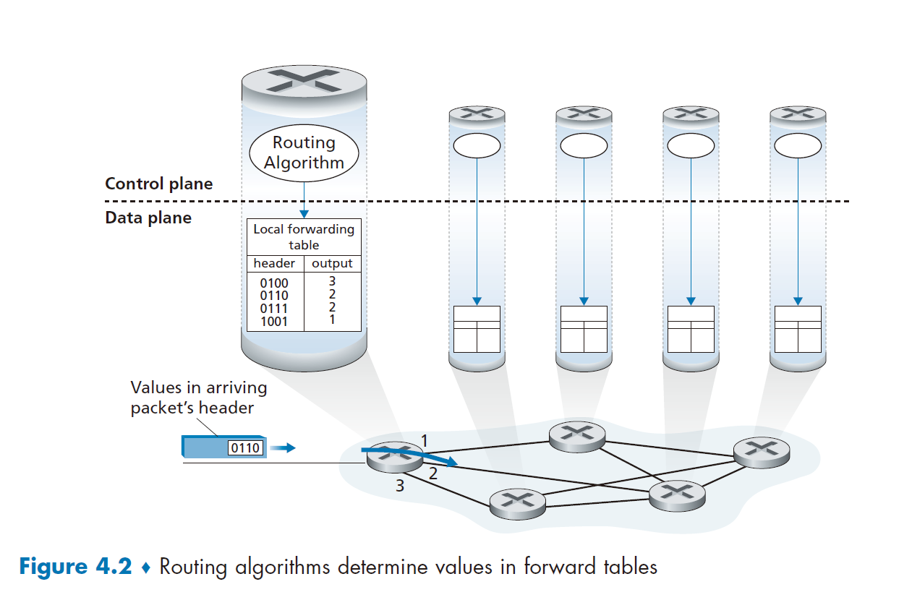

1. **控制平面：传统方法**

你也许现在想知道路由器中的转发表一开始是如何配置的。这是一个关键问题，它揭示了路由选择和转发间的重要相互作用关系。如图 4-2 所示，路由选择算法决定了插入该路由器转发表的内容。在这个例子中，路由选择算法运行在每台路由器中，并且在每台路由器中都包含转发和路由选择两种功能。如我们将在 5-3 节和 5-4 节中所见，在一台路由器中的路由选择算法与在其他路由器中的路由选择算法通信，以计算出它的转发表的值。 这种通信是如何执行的呢？通过根据路由选择协议交换包含路由选择信息的路由选择报文！我们将在 5-2-5-4 节讨论路由选择算法和协议。

通过考虑网络中的假想情况（不真实的，但技术上是可行的），也就是说路由器中物理上存在的所有转发表的内容是由人类网络操作员直接配置的，进一步说明转发和路由选择功能的区别和不同目的。在这种情况下，不需要任何路由选择协议！当然，这些人类操作员将需要彼此交互，以确保该转发表的配置能使分组到达它们想要到达的目的地。岀现下列现象也很可能：人工配置更容易出错，并且对于网络拓扑变化的响应比起路由选择协议来更慢。我们要为所有网络具有转发和路由选择功能而感到幸运!

2. **控制平面：SDN 方法**

图 4-2 中显示的实现路由选择功能的方法，是路由选择厂商在其产品中采用的传统方法，至少最近还是如此。使用该方法，每台路由器都有一个与其他路由器的路由选择组件通信的路由选择组件。然而，对人类能够手动配置转发表的观察启发我们，对于控制平面功能来说，也许存在其他方式来确定数据平面转发表的内容。

图 4-3 显示了从路由器物理上分离的另一种方法，远程控制器计算和分发转发表以供每台路由器所使用。注意到图 4-2 和图 4-3 的数据平面组件是相同的。而在图 4-3 中，控制平面路由选择功能与物理的路由器是分离的，即路由选择设备仅执行转发，而远程控制器计算并分发转发表。远程控制器可能实现在具有高可靠性和冗余的远程数据中心中，并 可能由 ISP 或某些第三方管理。路由器和远程控制器是如何通信的呢？通过交换包含转发 表和其他路由选择信息的报文。显示在图 4-3 中的控制平面方法是 **软件定义网络(Software-Defined Networking, SDN)**的本质，因为计算转发表并与路由器交互的控制器是用软件实现的，故网络是“软件定义”的。这些软件实现也越来越开放，换言之类似于 Linux 操作系统代码，这些代码可为公众所用，允许 ISP （以及网络研究者和学生）去创新并对控制网络层功能的软件提出更改建议。我们将在 5-5 节中讨论 SDN 控制平面。


### 4.1.2. 网络服务模型

在钻研网络层的数据平面之前，我们将以开阔的视野来专注于我们引入的新东西并考虑网络层可能提供的不同类型的服务。当位于发送主机的运输层向网络传输分组时（即在发送主机中将分组向下交给网络层），运输层能够指望网络层将该分组交付给目的地吗? 当发送多个分组时，它们会按发送顺序按序交付给接收主机的运输层吗？发送两个连续分组的时间间隔与接收到这两个分组的时间间隔相同吗？网络层会提供关于网络中拥塞的反馈信息吗？在发送主机与接收主机中连接运输层通道的抽象视图（特性）是什么？对这些 问题和其他问题的答案由网络层提供的服务模型所决定。**网络服务模型(network service model)** 定义了分组在发送与接收端系统之间的端到端运输特性。

我们现在考虑网络层能提供的某些可能的服务。这些服务可能包括：

- 确保交付。该服务确保分组将最终到达目的地。
- 具有时延上界的确保交付。该服务不仅确保分组的交付，而且在特定的主机到主机时延上界内（例如在 100ms 内）交付。
- 有序分组交付。该服务确保分组以它们发送的顺序到达目的地。
- 确保最小带宽。这种网络层服务模仿在发送和接收主机之间一条特定比特率（例如 1 Mbps）的传输链路的行为。只要发送主机以低于特定比特率的速率传输比特（作为分组的组成部分），则所有分组最终会交付到目的主机。
- 安全性。网络层能够在源加密所有数据报并在目的地解密这些分组，从而对所有运 输层报文段提供机密性。

这只是网络层能够提供的服务的部分列表，有无数种可能的服务变种。

Internet 的网络层提供了单一的服务，称为 **尽力而为服务(best-effort service)**。使用尽力而为服务，传送的分组既不能保证以它们发送的顺序被接收，也不能保证它们最终交 付；既不能保证端到端时延，也不能保证有最小的带宽。尽力而为服务看起来是根本无服 务的一种委婉说法，即一个没有向目的地交付分组的网络也符合尽力而为交付服务的定 义！其他的网络体系结构已定义和实现了超过 Internet 尽力而为服务的服务模型。例如, ATM 网络体系结构［MFA Forum 2016； Black 1995］提供了确保按序时延、有界时延和确 保最小带宽。还有提议的对 Internet 体系结构的服务模型扩展，例如，集成服务体系结构 ［RFC 1633］的目标是提供端到端时延保证以及无拥塞通信。令人感兴趣的是，尽管有这 些研发良好的供选方案，但 Internet 的基本尽力而为服务模型与适当带宽供给相结合已被证 明超过“足够好”，能够用于大量的应用，包括诸如 Netflix、IP 语音和视频等流式视频服 务，以及诸如 Skype 和 Facetime 等实时会议应用。

- **第四章概述**

在提供了网络层的概述后，我们将在本章后续几节中讨论网络层的数据平面功能。在 4-2 节中，我们将深入探讨路由器的内部硬件操作，包括输入和输岀分组处理、路由器的内部交换机制以及分组排队和调度。在 4-3 节中，我们将学习传统的 IP 转发，其中分组基于它们的目的 IP 地址转发到输出端口。我们将学习到 IP 寻址、令人称道的 IPv4 和 IPv6 协议等。在 4-4 节中，我们将涉及更为一般的转发，此时分组可以基于大量首部值（即不 仅基于目的 IP 地址）转发到输出端口。分组可能在路由器中受阻或冗余，或者可能让某些首部字段重写，即所有都在软件控制之下完成。这种分组转发的更为一般的形式是现代网络数据平面的关键组件，包括软件定义网络（SDN）中的数据平面。

我们在这里顺便提到，许多计算机网络研究者和从业人员经常互换地使用转发和交换这两个术语。我们在这本教科书中也将互换使用这些术语。在我们开始讨论术语的主题时，还需要指岀经常互换使用的两个其他术语，但我们将更为小心地使用它们。我们将约定术语分组交换机是指一台通用分组交换设备，它根据分组首部字段中的值，从输入链路接口到输出链路接口转移分组。某些分组交换机称为 **链路层交换机(link-layer switch)**（在第 6 章仔细学习），基于链路层帧中的字段值做出转发决定，这些交换机因此被称为链路层（第 2 层）设备。其他分组交换机称为 **路由器(router)**，基于网络层数据报中的首部字段值做岀转发决定。路由器因此是网络层（第 3 层）设备。

## 4.2. 路由器工作原理

既然我们已经概述了网络层中的数据平面和控制平面、转发与路由选择之间的重要区别以及网络层的服务与功能，我们将注意力转向网络层的 **转发** 功能，即实际将分组从一台路由器的入链路传送到适当的出链路。

图 4-4 显示了一个通用路由器体系结构的总体视图，其中标识了一台路由器的 4 个部分。

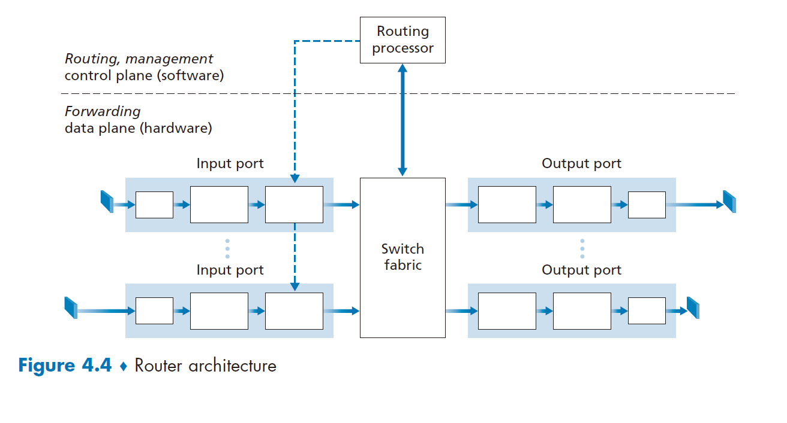

- 输入端口。**输入端口(input port)** 执行几项重要功能。它在路由器中执行终结入物理链路的物理层功能，这显示在图 4-4 中输入端口部分最左侧的方框与输出端口部分最右侧的方框中。它还要与位于入链路的数据链路层交互来执行数据链路层功能，这显示在输入与输出端口部分中间的方框中。也许更为重要的是，在输入端口还要执行查找功能，这显示在输入端口最右侧的方框中。正是在这里，通过查询转发表决定路由器的输出端口，到达的分组通过路由器的交换结构转发到输出端口。控制分组（如携带路由选择协议信息的分组）从输入端口转发到路由选择处理器。注意这里的“端口” 一词，指的是路由器的物理输入和输出接口，这完全不同于第 2、3 章中所讨论的与网络应用程序和套接字相关联的软件端口。在实践中，一台路由器所支持的端口数量范围较大，从企业路由器具有数量相对少的端口，到位于某 ISP 边缘的路由器具有数以百计 lOGbps 端口（其中人线路的数量趋于最大）。例如，边缘路由器 Juniper MX2020 具有 800Tbps 的总体路由器系统容量, 支持多达 800 个 100Gbps 以太网端口[ Juniper MX 2020 2020]。
- 交换结构。交换结构将路由器的输入端口连接到它的输岀端口。这种交换结构完全包含在路由器之中，即它是一个网络路由器中的网络!
- 输出端口。输出端口存储从交换结构接收的分组，并通过执行必要的链路层和物理层功能在输出链路上传输这些分组。当一条链路是双向的时（即承载两个方向的流量），输出端口通常与该链路的输入端口成对出现在同一线路卡上。
- 路由选择处理器。路由选择处理器执行控制平面功能。在传统的路由器中，它执行 路由选择协议（我们将在 5-3 节和 5-4 节学习），维护路由选择表与关联链路状态信息，并为该路由器计算转发表。在 SDN 路由器中，路由选择处理器（在其他活 动中）负责与远程控制器通信，目的是接收由远程控制器计算的转发表项，并在该 路由器的输入端口安装这些表项。路由选择处理器还执行网络管理功能，我们将在 5-7 节学习相关内容。

路由器的输入端口、输出端口和交换结构几乎总是用硬件实现，如图 4-4 所示。为了 理解为何需要用硬件实现，考虑具有 10 Gbps 输入链路和 64 字节的 IP 数据报，其输入端口在另一个数据报到达前仅有 51.2ns 来处理数据报。如果 N 个端口结合在一块线路卡上（因为实践中常常这样做），数据报处理流水线必须以 N 倍速率运行，这远快过软件实现的速率。转发硬件既能够使用路由器厂商自己的硬件设计来实现，也能够使用购买的商用硅片（例如由英特尔和 Broadcom 公司所出售）的硬件设计来实现。

当数据平面以纳秒时间尺度运行时，路由器的控制功能以毫秒或秒时间尺度运行，这些控制功能包括执行路由选择协议、对上线或下线的连接链路进行响应、 信（在 SDN 场合）和执行管理功能。因而这些 **控制平面(control plane)** 的功能通常用软件实现并在路由选择处理器（通常是一种传统的 CPU）上执行。

**time : 2021-06-13**

在深入讨论路由器的内部细节之前，我们转向本章开头的那个类比，其中分组转发好比汽车进入和离开立交桥。假定该立交桥是环状交叉路，在汽车进入该环状交叉路之前，需要做一些处理，我们来考虑一下这种处理需要什么信息：

- 基于目的地转发。假设汽车停在一个入口站上并表明它的最终目的地。入口站的一名服务人员查找最终目的地，确定通向最终目的地的环状交叉路的一个出口，并告诉驾驶员要走哪个出口。
- 通用转发。除了最终目的地之外，服务人员也能够基于许多其他因素确定汽车的出口匝道。例如，所选择的出口匝道可能与该汽车的起点如发行该车牌照的州有关。来自某些州的汽车可能被引导使用某个出口匝道（经过一条慢速道路通向目的地），而来自其他州的汽车可能被引导使用一个不同的岀口匝道（经过一条高速路通向目的地）。基于汽车的模型、品牌和寿命，可能做出相同的决定。或者认为不适合上路的汽车可能被阻止并且不允许通过环状交叉路。就通用转发来说，许多因素都会对 服务人员为给定汽车选择出口匝道产生影响。

一旦汽车进入环状交叉路（该环状交叉路可能挤满了从其他输入道路进入的其他汽车，朝着其他环状交叉路出口前进），并且最终离开预定的环状交叉路出口匝道，在这里可能遇到了从该岀口离开环状交叉路的其他汽车。

在这个类比中，我们能够在图 4-4 中识别最重要的路由器组件：入口道路和入口站对应于输入端口（具有查找功能以决定本地输出端口）；环状交叉路对应于交换结构；环状交叉路出口匝道对应于输出端口。借助于这个类比，我们可以考虑瓶颈可能出现的地方。如果汽车以极快的速率到达（例如，该环状交叉路位于德国或意大利！）而车站服务人员很慢，将发生什么情况？这些服务人员必须工作得多快，以确保在入口路上没有车辆拥堵？甚至对于极快的服务人员，如果汽车在环状交叉路上开得很慢，将发生什么情况，拥堵仍会出现吗？如果大多数进入的汽车都要在相同的出口匝道离开环状交叉路，将发生什么情况，在岀口匝道或别的什么地方会出现拥堵吗？如果我们要为不同的汽车分配优先权，或先行阻挡某些汽车进入环状交叉路，环状交叉路将如何运行？这些全都与路由器和交换机设计者面对的问题形成类比。

在下面的各小节中，我们将更为详细地考察路由器功能。[Iyer 2008 ； Chao 2001 ；Chuang 2005 ； Turner 1988 ； McKeown 1997a； Partridge 1998 ； Sopranos 2011］提供了对一些特定路由器体系结构的讨论。为了具体和简单起见，我们在本节中初始假设转发决定仅基于分组的目的地址，而非基于通用的分组首部字段。我们将在 4-4 节中学习更为通用的分组转发情况。

### 4.2.1. 输入端口处理和基于目的地的转发

图 4-5 中显示了一个更详细的输入处理的视图。如前面讨论的那样，输入端口的线 路端接功能与链路层处理实现了用于各个输入链路的物理层和链路层。在输入端口中执 行的查找对于路由器运行是至关重要的。正是在这个地方，路由器使用转发表来查找输 出端口，使得到达的分组能经过交换结构转发到该输出端口。转发表是由路由选择处理 器计算和更新的（使用路由选择协议与其他网络路由器中的路由选择处理器进行交 互），或者转发表接收来自远程 SDN 控制器的内容。转发表从路由选择处理器经过独立 总线（例如一个 PCI 总线）复制到线路卡，在图 4・4 中该总线由从路由选择处理器到输 入线路卡的虚线所指示。使用在每个输入端口的影子副本，转发决策能在每个输入端口 本地做出，无须基于每个分组调用集中式路由选择处理器，因此避免了集中式处理的瓶颈。


现在我们来考虑“最简单”的情况，一个入分组基于该分组的目的地址交换到输岀端口。在 32 比特 IP 地址的情况下，转发表的蛮力实现将针对每个目的地址有一个表项。因为有超过 40 亿个可能的地址，选择这种方法总体上是不可行的。

作为一个说明怎样处理规模问题的例子，假设我们的路由器具有 4 条链路，编号 0 到 3，分组以如下方式转发到链路接口:

```
            目的地址范围                      链路接口
11001000 00010111 00010000 00000000
                到                              0
11001000 00010111 00010111 11111111

11001000 00010111 00011000 00000000
                到                              1
11001000 00010111 00011000 11111111

11001000 00010111 00011001 00000000
                到                              2
11001000 00010111 00011111 11111111

                其他                            3
```

显然，对于这个例子，在路由器的转发表中没有必要有 40 亿个表项。例如，我们能 够有一个如下仅包括 4 个表项的转发表：

```
        前缀匹配                          链路接口
11001000 00010111 00010                      0
11001000 00010111 00011000                   1
11001000 00010111 00011                      2
        其他                                 3
```

使用这种风格的转发表，路由器用分组目的地址的 **前缀(prefix)** 与该表中的表项进行匹配；如果存在一个匹配项，则路由器向与该匹配项相关联的链路转发分组。例如，假设分组的目的地址是 11001000 00010111 00010110 10100001,因为该地址的 21 比特前缀匹配该表的第一项，所以路由器向链路接口 0 转发该分组。如果一个前缀不匹配前 3 项中的 任何一项，则路由器向链路接口 3 转发该分组。尽管听起来足够简单，但这里还是有重要 的微妙之处。你可能已经注意到一个目的地址可能与不止一个表项相匹配。例如，地址 11001000 00010111 00011000 10101010 的前 24 比特与表中的第二项匹配，而该地址的前 21 比特与表中的第三项匹配。当有多个匹配时，该路由器使用 **最长前缀匹配规则(longest prefix matching rule)**；即在该表中寻找最长的匹配项，并向与最长前缀匹配相关联的链路接口转发分组。当在 4-3 节中详细学习 Internet 编址时，我们将完全明白使用这种最长前缀匹配规则的理由。

假定转发表已经存在，从概念上讲表査找是简单的，硬件逻辑只是搜索转发表查找最 长前缀匹配。但在吉比特速率下，这种查找必须在纳秒级执行(回想我们前面 10Gbps 链 路和一个 64 字节 IP 数据报的例子)。因此，不仅必须要用硬件执行查找，而且需要对大 型转发表使用超出简单线性搜索的技术；快速查找算法的综述能够在［Gupta 2001, Ruiz- Sanchez 2011］中找到。同时必须对内存访问时间给予特别关注，这导致用嵌入式片上 DRAM 和更快的 SRAM (用作一种 DRAM 缓存)内存来设计。实践中也经常使用 **三态内容可寻址存储器(Tenary Content Address Memory, TCAM)** 来查找［Yu 2004 ］。使用 TCAM , 一个 32 比特 IP 地址被放入内存，TCAM 在基本常数时间内返回对该地址的转发表项的内 容。Cisco Catalyst 6500 和 7500 系列路由器及交换机能够保存 100 多万 TCAM 转发表项[Cisco TCAM 2014]。

一旦通过查找确定了某分组的输出端口，则该分组就能够发送进入交换结构。在某些设计中，如果来自其他输入端口的分组当前正在使用该交换结构，一个分组可能会在进入 交换结构时被暂时阻塞。因此，一个被阻塞的分组必须要在输入端口处排队，并等待稍后被及时调度以通过交换结构。我们稍后将仔细观察分组（位于输入端口与输出端口中）的阻塞、排队与调度。尽管“查找”在输入端口处理中可认为是最为重要的动作，但必须采取许多其他动作：1. 必须出现物理层和链路层处理，如前面所讨论的那样；2. 必须检查分组的版本号、检验和以及寿命字段（这些我们将在 4-3 节中学习），并且重写后两个字段; 3. 必须更新用于网络管理的计数器（如接收到的 IP 数据报的数目）。

### 4.2.2. 交换

交换结构位于一台路由器的核心部位，因为正是通过这种交换结构,分组才能实际地从一个输入端口交换（即转发）到一个输出端口中。交换可以用许多方式完成，如图 4-6 所示。


- **经内存交换**

最简单、最早的路由器是传统的计算机，在输入端口与输出端口之 间的交换是在 CPU （路由选择处理器）的直接控制下完成的。输入与输出端口的 功能就像在传统操作系统中的 I/O 设备一样。一个分组到达一个输入端口时，该 端口会先通过中断方式向路由选择处理器发出信号。于是，该分组从输入端口处 被复制到处理器内存中。路由选择处理器则从其首部中提取目的地址，在转发表中找出适当的输出端口，并将该分组复制到输出端口的缓存中。在这种情况下, 如果内存带宽为每秒可写进内存或从内存读出最多 B 个分组，则总的转发吞吐量 （分组从输入端口被传送到输出端口的总速率）必然小于 B/2。也要注意到不能同 时转发两个分组，即使它们有不同的目的端口，因为经过共享系统总线一次仅能执行一个内存读/写。

许多现代路由器通过内存进行交换。然而，与早期路由器的一个主要差别是，目的地址的查找和将分组存储（交换）进适当的内存存储位置是由输入线路卡来处理的。在某些方面，经内存交换的路由器看起来很像共享内存的多处理器，用一个线路卡上的处理将分组交换（写）进适当的输出端口的内存中。Cisco 的 alyst 8500 系列的交换机［Cisco 8500 2016］是经共享内存转发分组的。

- **经总线交换**

在这种方法中，输入端口经一根共享总线将分组直接传送到输出端口，不需要路由选择处理器的干预。’通常按以下方式完成该任务：让输入端口为
分组预先计划一个交换机内部标签（首部），指示本地输出端口，使分组在总线上 传送和传输到输出端口。该分组能由所有输出端口收到，但只有与该标签匹配的 端口才能保存该分组。然后标签在输出端口被去除，因为其仅用于交换机内部来 跨越总线。如果多个分组同时到达路由器，每个位于不同的输出端口，除了一个 分组外所有其他分组必须等待，因为一次只有一个分组能够跨越总线。因为每个 分组必须跨过单一总线，故路由器的交换带宽受总线速率的限制；在环状交叉路 的类比中，这相当于环状交叉路一次仅包含一辆汽车。尽管如此，对于运行在小型局域网和企业网中的路由器来说，通过总线交换通常足够用了。Cisco 6500 路由器［Cisco 6500 2016］内部通过一个 32Gbps 背板总线来交换分组。

- **经互联网络交换**

克服单一、共享式总线带宽限制的一种方法是，使用一个更复杂的互联网络，例如过去在多处理器计算机体系结构中用来互联多个处理器的网 络。纵横式交换机就是一种由 2/V 条总线组成的互联网络，它连接/V 个输入端口与 N 个输岀端口，如图 4-6 所示。每条垂直的总线在交叉点与每条水平的总线交叉,交叉点通过交换结构控制器（其逻辑是交换结构自身的一部分）能够在任何时候开启和闭合。当某分组到达端口 A,需要转发到端口 Y 时，交换机控制器闭合总线 A 和 Y 交叉部位的交叉点，然后端口 A 在其总线上发送该分组，该分组仅 由总线 Y 接收。注意到来自端口 B 的一个分组在同一时间能够转发到端口 X，因为 A 到 Y 和 B 到 X 的分组使用不同的输入和输岀总线。因此，与前面两种交换方法不同，纵横式网络能够并行转发多个分组。纵横式交换机是非阻塞的（nonblocking） ,即只要没有其他分组当前被转发到该输出端口，转发到输出端口的分 组将不会被到达输出端口的分组阻塞。然而，如果来自两个不同输入端口的两个 分组其目的地为根同的输出端口，则一个分组必须在输入端等待，因为在某个时 刻经给定总线仅聶够发送一个分组。Cisco 12000 系列交换机［Cisco 12000 2016］使用了一个互联网络；Cisco 7600 系列能被配置为使用总线或者纵横式交换机[Cisco 7600 2016]。

更为复杂的互联网络使用多级交换基本组成，以使来自不同输入端口的分组通过交换结构同时朝着相同的输出端口前行。对交换机体系结构的展望可参见[Tobagi 1990]。Cisco CRS 利用了一种三级非阻塞交换策略。路由器的交换能力也能够通过并行运行多种交换结构进行扩展。在这种方法中，输入端口和输出端口被连接到并行运行的 N 个交换结构。一个输入端口将一个分组分成 K 个较小的块, 并且通过 N 个交换结构中的 K 个发送（“喷射”）这些块到所选择的输出端口，输岀端口再将 K 个块装配还原成初始的分组。

### 4.2.3. 输出端口处理

如图 4-7 中所示，输出端口处理取出已经存放在输出端口内存中的分组并将其发送到输出链路上。这包括选择和取岀排队的分组进行传输，执行所需的链路层和物理层传输功能。

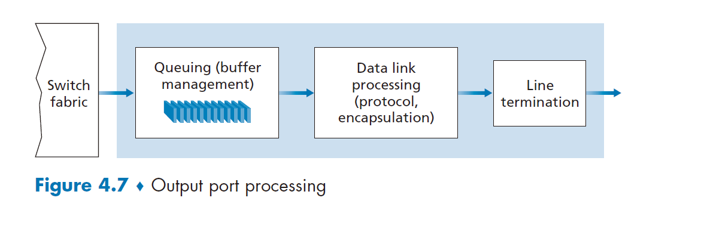

### 4.2.4. 什么地方发生排队

**time : 2021-06-15**

如果我们考虑显示在图 4-6 中的输图 4-7 输出端口处理入和输出端口功能及其配置，下列情况是一目了然的：在输入端口和输出端口处都可以形成分组队列，就像在环状交叉路的类比中我们讨论过的情况，即汽车可能等待在流量交叉点的入口和出口。排队的位置和程度（或者在输入端口排队，或者在输岀端口排队）将取决于流量负载、交换结构的相对速率和线路速率。我们现在更为详细一点考虑这些队列，因为随着这些队列的增长，路由器的缓存空间最终将会耗尽，并且当无内存可用于存储到达的分组时将会出现 **丢包(packet loss)**。回想前面的讨论，我们说过分组“在网络中丢失”或“被路由器丢弃”。正是在一台路由器的这些队列中，这些分组被实际丢弃或丢失。

假定输入线路速度与输出线路速度（传输速率）是相同的，均为 R(line)（单位为每秒分组数），并且有 N 个输入端口和 N 个输出端口。为进一步简化讨论，假设所有分组具有相同的固定长度，分组以同步的方式到达输入端口。这就是说，在任何链路发送分组的时间等于在任何链路接收分组的时间，在这样的时间间隔内，在一个输入链路上能够到达 0 个或 1 个分组。定义交换结构传送速率 R(switch)为从输入端口到输出端口能够移动分组的速率：如果 R(switch)比 R(line)快 N 倍，则在输入端口处仅会出现微不足道的排队。这是因为即使在最坏情况下，所有 N 条输入线路都在接收分组，并且所有的分组将被转发到相同的输出端口，每批 N 个分组（每个输入端口一个分组）也能够在下一批到达前通过交换结构处理完毕。

1. **输入排队**

如果交换结构不能快得（相对于输入线路速度而言）使所有到达分组无时延地通过它 传送，会发生什么情况呢？在这种情况下，在输入端口也将岀现分组排队，因为到达的分组必须加入输入端口队列中，以等待通过交换结构传送到输出端口。为了举例说明这种排队的重要后果，考虑纵横式交换结构，并假定：1. 所有链路速度相同；2. 一个分组能够以 一条输入链路接收一个分组所用的相同的时间量，从任意一个输入端口传送到给定的输出端口；3. 分组按 FCFS 方式，从一指定输入队列移动到其要求的输出队列中。只要其输出端口不同，多个分组可以被并行传送。然而，如果位于两个输入队列前端的两个分组是发 往同一输出队列的，则其中的一个分组将被阻塞，且必须在输入队列中等待，因为交换结构一次只能传送一个分组到某指定端口。

图 4-8 显示了一个例子，其中在输入队列前端的两个分组（带深色阴影）要发往同一个右上角输出端口。假定该交换结构决 定发送左上角队列前端的分组。在这种 情况下，左下角队列中的深色阴影分组 必须等待。但不仅该分组要等待，左下 角队列中排在该分组后面的浅色阴影分在时刻/的输岀端口竞 一能传输一个深色阴影分组组也要等待，即使右中侧输出端口（浅色阴影分组的目的地）中无竞争。这种浅色阴影分组经受了 HOL 阻寒现象叫作输入排队交换机中的 **线路前部(Head-Of-the-Line, HOL)阻塞**，即在一个输入队列中排队的分组必须等待通过交换结构发送（即使输出端口是空闲的），因为它被位于线路前部的另一个分组所阻塞。［Karol 1987 ］指出，由于 HOL 阻塞，只要输入链路上的分组到达速率达到其容量的 58%，在某些假设前提下，输入队列长度就将无限制地增大（不严格地讲，这等同于说将出现大量的丢包）。［McKeown 1997b］讨论了多种解决 HOL 阻塞的方法。


2. **输出排队**

我们接下来考虑在交换机的输出端口是否会出现排队。再次假定 R(switch)比 R(line)快 N 倍，并且到达 N 个输入端口的每个端口的分组，其目的地是相同的输出端口。在这种情况下，在向输出链路发送一个分组的时间内，将有 N 个新分组到达该输出端口（N 个输入端口的每个都到达 1 个）。因为输出端口在一个单位时间（该分组的传输时间）内仅能传输一个分组，这 N 个到达分组必须排队（等待）经输岀链路传输。在正好传输 N 个分组（这些 分组是前面正在排队的）之一的时间中，可能又到达 N 个分组，等等。所以，分组队列能够在输岀端口形成，即使交换结构比端口线路速率快 W 倍。最终，排队的分组数量能够变得足够大，耗尽输出端口的可用内存。

当没有足够的内存来缓存一个入分组时，就必须做出决定：要么丢弃到达的分组（采用一种称为 **弃尾(drop-tail)** 的策略），要么删除一个或多个已排队的分组为新来的分组腾 出空间。在某些情况下，在缓存填满之前便丢弃一个分组（或在其首部加上标记）的做法是有利的，这可以向发送方提供一个拥塞信号。已经提出和分析了许多分组丢弃与标记策略［Labrador 1999, Hollot 2002］，这些策略统称为 **主动队列管理(Active Queue Management, AQM)算法**。**随机早期检测(Random Early Detection, RED)** 算法是得到最广泛研究和实现的 AQM 算法之一 ［Christiansen 2001； Floyd 2016］。

在图 4-9 中图示了输出端口的排队情况。在时刻每个入端输入端口都到达了一个分组，每个分组都是发往最上侧的输岀端口。假定线路速度相同，交换机以 3 倍于线路速度的速度运行，一个时间单位（即接收或发送一个分组所需的时间）以后, 所有三个初始分组都被传送到输出端口，并排队等待传输。在下一个时间单位中，这三个分组中的一个将通过输出链路发送出去。在这个例子中，又有两个新分组已 到达交换机的入端；这些分组之一要发往 最上侧的输岀端口。这样的后果是，输出端口的 **分组调度(packet scheduler)** 在这些排队分组中选择一个分组来传输，这就是我们将在下节中讨论的主题。

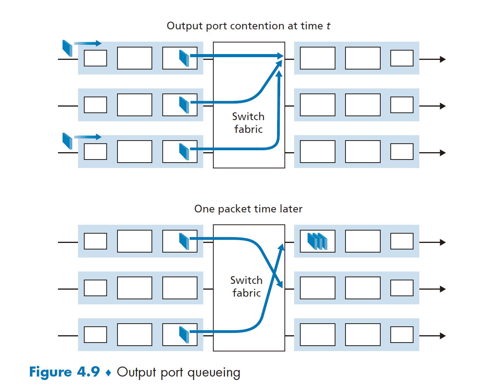

假定需要路由器缓存来吸收流量负载的波动，一个自然而然的问题就是需要多少缓存。多年以来，用于缓存长度的经验方法是［RFC 3439］，缓存数量（B）应当等于平均往返时延（RTT, 比如说 250ms）乘以链路的容量（C）。这个结果是基于相对少量的 TCP 流的排队动态性分析得到的［Villamizar 1994］。因此，一条具有 250ms RTT 的 10 Gbps 链路需要的缓存量等于 $B = RTT \cdotp C = 2.5 Gb$。然而，最近的理论和试验研究 ［Appenzeller 2004］表明，当有大量的 TCP 流（/V 条）流过一条链路时，缓存所需要的数量是 $B = RTT \cdot C / \sqrt N$。 对于通常有大量流经过的大型主干路由器链路（参见如［Fraleigh 2003］），N 的值可能非常大，所需的缓存长度的减小相当明显。［Appenzeller 2004； Wischik 2005； Beheshti 2008］从理论、实现和运行的角度提供了可读性很强的有关缓存长度问题的讨论。

### 4.2.5. 分组调度

现在我们转而讨论确定次序的问题，即排队的分组如何经输出链路传输的问题。以前 你自己无疑在许多场合都排长队等待过，并观察过等待的客户怎样被服务，你无疑也熟悉 路由器中常用的许多排队规则。有一种是先来先服务（FCFS, 也称之为先进先出 （FIFO））。这是英国人人共知的规则，用于病人就诊、公交车站和市场中的有序 FCFS 队 列。（哦，你排队了吗？）有些国家基于优先权运转，即给一类等待客户超越其他等待客户的优先权服务。也有循环排队，其中客户也被划分为类别（与在优先权队列一样），但每类用户依次序提供服务。

1. **先进先出**

图 4-11 显示了对于 **先进先出(First-In-First-Out, FIFO)** 链路调度规则的排 队模型的抽象。如果链路当前正忙于传 输另一个分组，到达链路输出队列的分 组要排队等待传输。如果没有足够的缓存空间来容纳到达的分组，队列的分组丢弃策略则确定该分组是否将被丢弃（丢失）或者从队列中去除其他分组以便为到达的分组腾出空间，如前所述。在下面的讨论中，我们将忽视分组丢弃。当一个分组通过输出链路完全传输（也就是接收服务）时，从队列中去除它。


FIFO （也称为先来先服务，FCFS）调度规则按照分组到达输出链路队列的相同次序 来选择分组在链路上传输。我们都很熟悉服务中心的 FIFO 排队，在那里到达的顾客加入 单一等待队列的最后，保持次序，然后当他们到达队伍的前面时就接受服务。

图 4-12 显示了运行中的 FIFO 队列。分组的到达由上部时间线上带编号的箭头来指示，用编号指示了分组到达的次序。各个分组的离开表示在下部时间线的下面。分组在服务中（被传输）花费的时间是通过这两个时间线之间的阴影矩形来指示的。假定在这个例 子中传输每个分组用去 3 个单位时间。利用 FIFO 规则，分组按照到达的相同次序离开。 注意在分组 4 离开之后，在分组 5 到达之前链路保持空闲（因为分组 1 到 4 已经被传输并从队列中去除）。


2. **优先权排队**

在 **优先权排队(priority queuing)** 规则下，到达输出链路的分组被分类放入输出 队列中的优先权类，如图 4-13 所示。在实践中，网络操作员可以配置一个队列，这样携带网络管理信息的分组（例如，由源或目的 TCP/UDP 端口号所标识）获得超过用户流量的优先权；此外，基于 IP 的实时话音分组可能获得超过非实时流量（如 SMTP 或 IMAP 电子邮件分组）的优先权。每个优先权类通常都有自己的队列。当选择一个分组传输时，优先权排队规则将从队列为非空（也就是有分组等待传输）的最高优先权类中传输一个分组。在同一优先权类的分组之间的选择通常以 FIFO 方式完成。

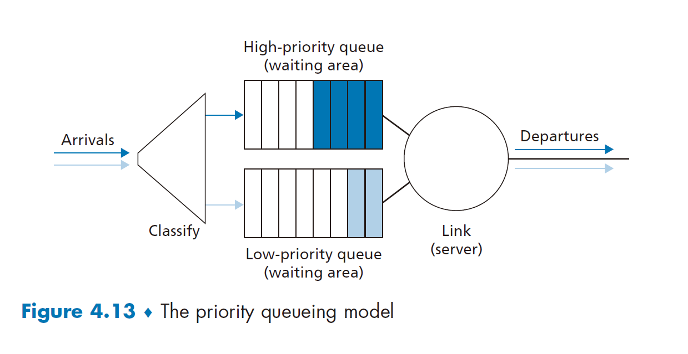

图 4-14 描述了有两个优先权类的一个优先权队列的操作。分组 1、3 和 4 属于高优先权类，分组 2 和 5 属于低优先权类。分组 1 到达并发现链路是空闲的，就开始传 输。在分组 1 的传输过程中，分组 2 和 3 到达，并分别在低优先权和高优先权队列中排队。在传输完分组 1 后，分组 3 （—个高优先权的分组）被选择在分组 2 （尽管它到达得较早，但它是一个低优先权分组）之前传输。在分组 3 的传输结束后，分组 2 开始传输。分组 4 （一个高优先权分组）在分组 2 （—个低优先权分组）的传输过程 中到达。在 **非抢占式优先权排队(non-preemptive priority queuing)** 规则下，一旦分组开始传输，就不能打断。在这种情况下，分组 4 排队等待传输，并在分组 2 传输完成之后开始传输。

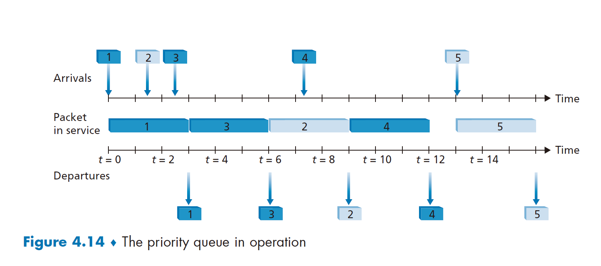

3. **循环和加权公平排队**

在 **循环排队规则(round robin queuing discipline)** 下，分组像使用优先权排队那样被分类。然而，在类之间不存在严格的服务优先权，循环调度器在这些类之间轮流提供服务。在最简单形式的循环调度中，类 1 的分组被传输，接着是类 2 的分组，接着又是类 1 的分组，再接着又是类 2 的分组，等等。一个所谓的 **保持工作排队(work-conserving queuing)** 规则在有(任何类的)分组排队等待传输时，不允许链路保持空闲。当寻找给定类的分组但是没有找到时，保持工作的循环规则将立即检查循环序列中的下一个类。

图 4-15 描述了一个两类循环队列的操作。在这个例子中，分组 1、2 和 4 属于第一类, 分组 3 和 5 属于第二类。分组 1 一到达输出队列就立即开始传输。分组 2 和 3 在分组 1 的 传输过程中到达，因此排队等待传输。在分组 1 传输后，链路调度器查找类 2 的分组，因 此传输分组 3 ：在分组 3 传输完成后，调度器查找类 1 的分组，因此传输分组 2。在分组 2 传输完成后，分组 4 是唯一排队的分组，因此在分组 2 后立刻传输分组 4。

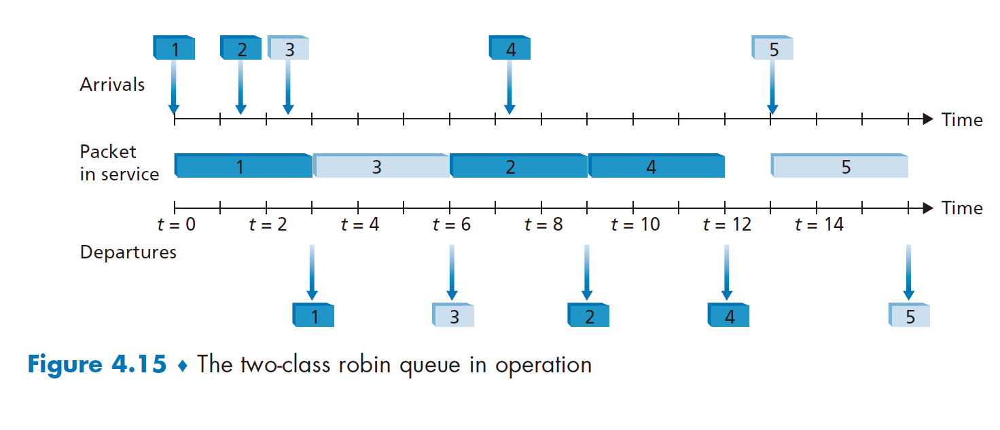

一种通用形式的循环排队已经广泛地实现在路由器中，它就是所谓的加权公平排队(Weighted Fair Queuing, WFQ )规则 [Demers 1990 ； Parekh 1993 ； Cisco QoS 2016]。图 4-16 对 WFQ 进行了描述。其中，到达的分组被分类并在合适的每个 类的等待区域排队。与使用循环调度一 样，WFQ 调度器也以循环的方式为各个 类提供服务，即首先服务第 1 类，然后 服务第 2 类，接着再服务第 3 类，然后（假设有 3 个类别）重复这种服务模式。WFQ 也是一种保持工作排队规则，因此在发现一 个空的类队列时，它立即移向服务序列中的下一个类。


## 4.3. 网际协议：IPv4，寻址，IPv6

到目前为止，我们在第 4 章中对网络层的学习，包括网络层的数据平面和控制平面组件概念，转发和路由选择之间的区别，各种网络服务模型的标识和对路由器内部的观察, 并未提及任何特定的计算机网络体系结构或协议。在这节中，我们将关注点转向今天的 Internet 网络层的关键方面和著名的网际协议（IP）。

今天有两个版本的 IP 正在使用。在 4-3-1 节中，我们首先研究广泛部署的 IP 版本 4，这通常简单地称为 IPv4 [RFC 791]。在 4-3-5 节中，我们将仔细考察 IP 版本 6 [RFC 2460； RFC 4291]，它已经被提议替代 IPv4。在中间，我们将主要学习 Internet 编址，这是一个看起来相当枯燥和面向细节的主题，但是这对理解 Internet 网络层如何工作是至关重要的。掌握 IP 编址就是掌握 Internet 的网络层！

### 4.3.1. IPv4 数据报格式

前面讲过网络层分组被称为数据报。我们以概述 IPv4 数据报的语法和语义开始对 IP 的学习。你也许认为没有什么比 一个分组的比特的语法和语义更加枯燥无味的了。无论如何，数据报在 Internet 中起着重要作用，每个网络行业的学生和专业 人员都需要理解它、吸收它并掌握它（只是理解协议首部的确能够使学习成为有趣的事，请查阅[Pomeranz 2010] ）。IPv4 数据报格式如图 4-17 所示。


IPv4 数据报中的关键字段如下：

- **版本号**。。这 4 比特规定了数据报的 IP 协议版本。通过查看版本号，路由器能够确定如何解释 IP 数据报的剩余部分。不同的 IP 版本使用不同的数据报格式。 IPv4 的数据报格式如图 4-17 所示。新版本的 IP（IPv6）的数据报格式将在 4-3-5 节中讨论。
- **首部长度**。因为一个 IPv4 数据报可包含一些可变数量的选项（这些选项包括在 IPv4 数据报首部中），故需要用这 4 比特来确定 IP 数据报中载荷（例如在这个数据报中被封装的运输层报文段）实际开始的地方。大多数 IP 数据报不包含选项，所以一般的 IP 数据报具有 20 字节的首部。
- **服务类型**。服务类型（TOS）比特包含在 IPv4 首部中，以便使不同类型的 IP 数据报（例如，一些特别要求低时延、高吞吐量或可靠性的数据报）能相互区别开来。例如，将实时数据报（如用于 IP 电话应用）与非实时流量（如 FTP）区分开也许是有用的。提供特定等级的服务是一个由网络管理员对路由器确定和配置的策略问题。我们在 3-7-2 节讨论明确拥塞通告所使用的两个 TOS 比特时也学习过。
- **数据报长度**。这是 IP 数据报的总长度（首部加上数据），以字节计。因为该字段长为 16 比特，所以 IP 数据报的理论最大长度为 65 535 字节。然而，数据报 很少有超过 1500 字节的，该长度使得 IP 数据报能容纳最大长度以太网帧的载荷字段。
- **标识、标志、片偏移**。这三个字段与所谓 IP 分片有关，这是一个我们将很快要考虑的主题。有趣的是，新版本的 IP （即 IPv6）不允许在路由器上对分组分片。这部分内容不会在这里讨论，但是读者可以在更早版本的书中找到相关材料。
- **寿命**。寿命（Time-To-Live, TTL）字段用来确保数据报不会永远（如由于长时间的路由选择环路）在网络中循环。每当一台路由器处理数据报时，该字段的值减 1。若 TTL 字段减为 0，则该数据报必须丢弃。
- **上层协议**。该字段通常仅当一个 IP 数据报到达其最终目的地时才会有用。该字段值指示了 IP 数据报的数据部分应交给哪个特定的运输层协议。例如，值为 6 表明数据部分要交给 TCP，而值为 17 表明数据要交给 UDP。对于所有可能值的列表，参见[IANA Protocol Numbers 2016 ] 。注意在 IP 数据报中的协议号所起的作 用，类似于运输层报文段中端口号字段所起的作用。协议号是将网络层与运输层绑定到一起的黏合剂，而端口号是将运输层和应用层绑定到一起的黏合剂。我们将在第 6 章看到，链路层帧也有一个特殊字段用于将链路层与网络层绑定到一起。
- **首部检验和**。首部检验和用于帮助路由器检测收到的 IP 数据报中的比特错误。首 部检验和是这样计算的：将首部中的每 2 个字节当作一个数，用反码算术对这些 数求和。如在 3. 3 节讨论的那样，该和的反码（被称为 Internet 检验和）存放在检 验和字段中。路由器要对每个收到的 IP 数据报计算其首部检验和，如果数据报首 部中携带的检验和与计算得到的检验和不一致，则检测岀是个差错。路由器一般 会丢弃检测出错误的数据报。注意到在每台路由器上必须重新计算检验和并再次 存放到原处，因为 TTL 字段以及可能的选项字段会改变。关于计算 Internet 检验和 的快速算法的有趣讨论参见[RFC 1071 ]。 此时，一个经常问的问题是：为什么 TCP/IP 在运输层与网络层都执行差错检测？这种重复检测有几种原因。首先，注 意到在 IP 层只对 IP 首部计算了检验和，而 TCP/UDP 检验和是对整个 TCP/UDP 报 文段进行的。其次，TCP/UDP 与 IP 不一定都必须属于同一个协议栈。原则上, TCP 能够运行在一个不同的协议（如 ATM）上:Black 1995]，而 IP 能够携带不一定要传递给 TCP/UDP。
- **源和目的 IP 地址**。当某源生成一个数据报时，它在源 IP 字段中插入它的 IP 地 址，在目的 IP 地址字段中插入其最终目的地的地址。通常源主机通过 DNS 查找来决定目的地址，如在第 2 章中讨论的那样。我们将在 4-3-3 节中详细讨论 IP 编址。
- **选项**。选项字段允许 IP 首部被扩展。首部选项意味着很少使用，因此决定对每个数据报首部不包括选项字段中的信息，这样能够节约开销。然而，少量选项的存 在的确使问题复杂了，因为数据报首部长度可变，故不能预先确定数据字段从何处开始。而且还因为有些数据报要求处理选项，而有些数据报则不要求，故导致一台路由器处理一个 IP 数据报所需的时间变化可能很大。这些考虑对于高性能路由器和主机上的 IP 处理来说特别重要。由于这样或那样的原因，在 IPv6 首部中已去掉了 IP 选项，如 4-3-4 节中讨论的那样。
- **数据（有效载荷）**。我们来看看最后也是最重要的字段.这是数据报存在的首要理由！在大多数情况下，IP 数据报中的数据字段包含要交付给目的地的运输层报文段（TCP 或 UDP）。然而，该数据字段也可承载其他类型的数据，如 ICMP 报文 （在 5-6 节中讨论）。

注意到一个 IP 数据报有总长为 20 字节的首部（假设无选项）。如果数据报承载一个 TCP 报文段，则每个（无分片的）数据报共承载了总长 40 字节的首部（20 字节的 IP 首部加上 20 字节的 TCP 首部）以及应用层报文。

### 4.3.2. IPv4 编址

在本节我们讨论 IPv4 编址。

然而，在讨论 IP 编址之前，我们需要简述一下主机和路由器接入网络的方法。一台主机通常只有一条链路连接到网络；当主机发送一个数据报时，数据报就在这条链路上发送。主机与链路之间的边界叫作 **接口(interface)**。我们现在来考虑一台路由器的接口。因为路由器的任务是从链路上接收数据报并从其他链路转发出去，那么路由器必须要有两条或更多链路。路由器和它的任意一条链路之间的边界也叫接口。一台路由器因此有多个接口，每个接口对应着一条链路。每台主机和路由器都能发送和接收 IP 数据报，因此 IP 规定每台主机和路由器的接口都要有一个 IP 地址。实际上，一个 IP 地址是和一个接口相关联的，而不是与它的主机或路由器相关联的。

每个 IP 地址的长度为 32 比特（4 字节），因此总共有 2^32 个（大约 40 亿个）可能的 IP 地址。这些地址通常按所谓的 **点分十进制记法(dotled-decimal notation)** 表示。这种表示方法规定：IP 地址中的每个字节用它对应的十进制数表示，4 个字节的十进制表示数间用句号隔开。举个例子，考虑 IP 地址 193.32.216.9。193 是这个 IP 地址的第一个字节的十进制表示数，32 是该地址的第二个字节的十进制表示数，依次类推。因此，193.32.216.9 的二进制记法是: 11000001 00100000 11011000 00001001。

Internet 中的每台主机和路由器上的每个接口，都有一个唯一的 IP 地址（在 NAT 后面的接口除外，详见在第 4-3-3 节）。然而，这些地址有一定的规则：一个子网中主机的 IP 地址和这个子网所连接口的 IP 地址相关。

图 4-18 举了一个例子。在这张图中，一台有 3 个接口的路由器互联了 7 台主机。如果你仔细观察主机和路由器接口的 IP 地址，你会发现一个规律。图 4-18 中左上侧的 3 台主机的接口和它们所连接路由器的接口，都有一个形如 223.1.1.xxx 的 IP 地址。或者说，这些接口 IP 地址左侧的 3 字节是相同的。这 3 台主机的接口和路由器接口可以通过一台以太网交换机互联（我们将在第 6 章讨论），或通过一个无线接入点互联（我们将在第 7 章讨论）。我们现在将这个网络表示为一朵云，在第 6、7 章中再深入讨论。


用 IP 的术语来说，这个网络称为一个 **子网(subnet)** [RFC 950]。（在 Internet 文献中，子网也称为 IP 网络或直接称为网络。）IP 给这个子网分配了一个 **子网掩码(network mask)**： 223.1.1.0/24。这个子网掩码表示该子网中所有接口的 IP 地址左侧的 24 位和 223.1.1.0 相同。因此子网 223.1.1.0/24 中，3 个主机接口（223.1.1.1、223.1.1.2 和 223.1.1.3 ）和 1 个路由器接口（223.1.1.4）的地址都具有 223.1.1.xxx 的形式。任何其他要连到 223.1.1.0/24 子网的主机地址都具有 223.1.1.xxx 的形式。图 4-18 中还表示了另外两个子网：223.1.2.0/24 和 223.1.3.0/24。图 4-19 图示了 4-18 中 3 个子网的子网掩码。

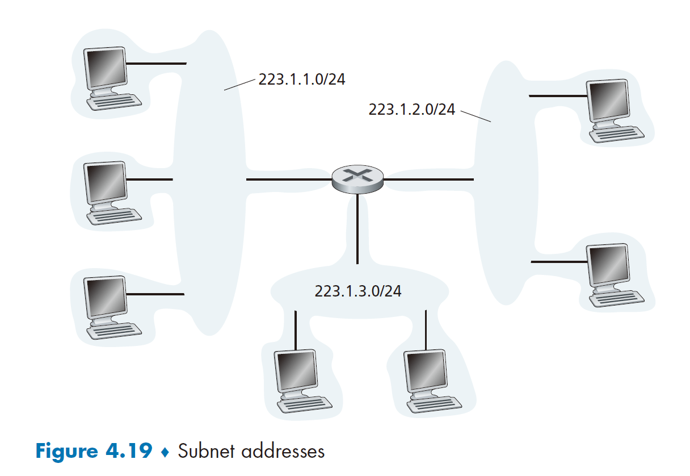

子网并不局限图 4-18 中表示的例子，实际上子网的概念更加广泛。考虑图 4-20，这张图中显示了 3 台彼此互联的路由器。每台路由器有 3 个接口，一个接口用于将路由器连接到一对主机，而另外 2 个接口用于和其他路由器互联。这张图中一共有几个子网呢？首先，肯定有 3 个子网：223.1.1.0/24、223.1.2.0/24 和 223.1.3.0/24，类似于我们在图 4-18 中遇到的子网。但注意到在本例中还有其他 3 个子网：一个子网是 223.1.9.0/24，用于连接路由器 R1 与 R2 的接口；另外一个子网是 223.1.8.0/24，用于连接路由器 R2 与 R3 的接口；第三个子网是 223.1.7.0/24，用于连接路由器 R3 与 R1 的接口。一般地，在一个路由器和主机地互联系统中，我们忽略掉主机和路由器本身，将它们的接口抽象为一个点，那么这些点在对应的实际互联情况下，会形成几个不连通的图，这些图就是 **子网(subnet)**。

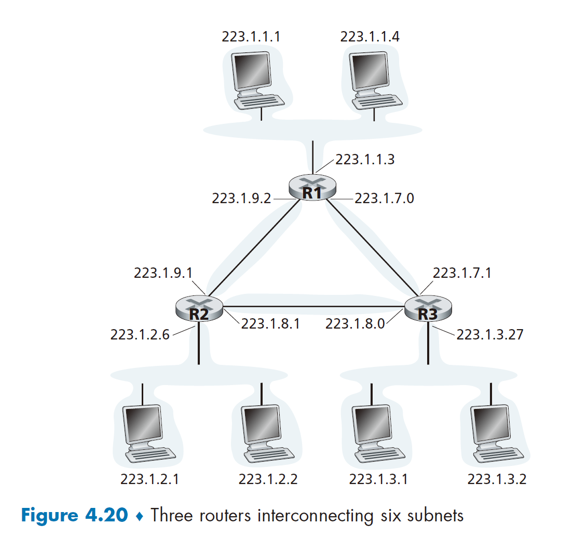

现在我们来讨论在 Internet 中是如何编址的。

Internet 的编址方案被称为 **无类别域间路由(Classless Interdomain Routing, CIDR)** [RFC 4632]。CIDR 将子网寻址的概念一般化了。当使用子网寻址时，32 比特的 IP 地址被划分为两部分，并且也具有点分十进制数形式 a.h.c.d/x，其中 x 指示了地址的第一部分中的比特数。

形式为 a.b.c.d/x 的地址的 x 最高比特构成了 IP 地址的网络部分，并且经常被称为该地址的 **前缀(prefix)**。一个组织通常被分配一块连续的地址，即具有相同前缀的一段地址。在这种情况下，该组织内部的设备的 IP 地址将共享共同的前缀。当我们在 5-4 节中谈到 Internet 的 BGP 路由选择协议时，将看到该组织网络外部的路由器仅考虑前面的前缀比特 x。这就是说，当该组织外部的一台路由器向这个组织内部转发一个数据报时，仅需要考虑该地址的前面 x 比特。

一个地址剩余的 32-x 比特用于区分该组织内部设备。当该组织内部的路由器转发分组时，才会考虑这些比特。剩下的比特可以划分另外的子网，例如，假设地址 a.b.c.d/21 的前 21 比特定义了该组织的网络前缀，该组织中所有主机 IP 地址的前缀是相同的，其余的 11 比特区分了该组织内的主机。该组织的内部还可以使用最右边的 11 比特在该组织中划分另外的子网，就像前面所讨论的那样，例如，a.b.c.d/24 可以表示该组织的另一个子网。

在 CIDR 被采用之前，IP 地址的网络部分被限制为长度为 8、16 或 24 比特，这是一种称为 **分类编址(classful address1ng)** 的编址方案，这是因为具有 8、16 和 24 比特子网地址的子网分别被称为 A、B 和 C 类网络。一个 IP 地址的网络部分正好为 1、2 或 3 字节的要求，已经在支持数量迅速增加的具有小规模或中等规模子网的组织方面出现了问题。一个 C 类（/24）子网仅能容纳多达 2^8 - 2 = 254 （2^8 =256，其中的两个地址预留用于特殊用途）台主机，这对于许多组织来说太小了。然而一个 B 类（/16）子网可支持多达 65534 台主机，又太大了。在分类编址方法下，比方说一个有 2000 台主机的组织通常被分给一个 B 类（/16）地址。这就导致了 B 类地址空间的迅速损耗以及所分配的地址空间的利用率低下。例如，为具有 2000 台主机的组织分配一个 B 类地址，就具有足以支持多达 65534 个接口的地址空间，剩下的超过 63000 个地址却不能被其他组织使用。

最后我们必须提及一个特殊但十分重要的 IP 地址，**广播地址** ：255.255.255.255。当一台主机发出一个目的地址为 255.255.255.255 的数据报时，该报文会交付给同一个子网中的所有主机。路由器也会有选择地向邻近的子网转发该报文。

到现在为止，我们已经详细地学习了 IP 编址，但我们还需要知道主机或子网最初是怎么获得它们的地址的。我们先讨论一个组织是怎么得到一个地址块的，然后讨论看该组织内部的一台主机是怎么被分配到一个地址的。

1. **获取一块地址**

一个组织要获得一个地址块时，该组织的网络管理员首先会与他的 ISP 联系，该 ISP 会从已分给它的更大地址块中划分一块地址。例如，该 ISP 也许自己已被分配了地址块 200.23.16.0/20。该 ISP 可以依次将该地址块分成 8 个长度相等的连续地址块，为本 ISP 支持的最多达 8 个组织中的一个分配这些地址块中的一块，如下所示。（为了便于查看，我们已将这些地址的网络部分加了下划线。）

| ISP 的地址块 | 200.23.16.0/20 | <u>11001000 00010111 0001</u>0000 00000000 |
| ------------ | -------------- | ------------------------------------------ |
| 组织 0       | 200.23.16.0/23 | <u>11001000 00010111 0001000</u>0 00000000 |
| 组织 1       | 200.23.18.0/23 | <u>11001000 00010111 0001001</u>0 00000000 |
| 组织 2       | 200.23.20.0/23 | <u>11001000 00010111 0001010</u>0 00000000 |
| ...          | ...            | ...                                        |
| 组织 7       | 200.23.30.0/23 | <u>11001000 00010111 0001111</u>0 00000000 |

尽管从一个 ISP 获取一组地址是一种得到一块地址的方法，但这不是唯一的方法。显然，必须还有一种方法供 ISP 本身得到一块地址。是否有一个全球性的权威机构，它具有管理 IP 地址空间并向各 ISP 和其他组织分配地址块的最终责任呢？的确有一个！IP 地址由 Internet 域名和编号分配机构（Internet Corporation for Ass1gned Names and Numbers, ICANN）［ICANN 2016］管理，管理规则基于［RFC 7020］。非营利的 ICANN 组织［NTIA 1998］的作用不仅是分配 IP 地址，还管理 DNS 根服务器。它还有一项容易引起争论的工 作，即分配域名与解决域名纷争。ICANN 向区域性 Internet 注册机构（如 ARIN、RIPE、 APNIC 和 LACNIC）分配地址，这些机构一起形成了 ICANN 的地址支持组织［ASO- ICANN 2016］，处理本区域内的地址分配/管理。

2. **获取主机地址：动态主机配置协议**

某组织一旦获得了一块地址，它就可为本组织内的主机与路由器接口逐个分配 IP 地址。系统管理员通常手工配置路由器中的 IP 地址（常常在远程通过网络管理工具进行配置）。主机地址也能手动配置，但是这项任务目前更多的是使用 **动态主机配置协议(Dynamic Host Configuration, DHCP)** ［RFC 2131］来完成。DHCP 允许主机自动获取（被分配）一个 IP 地址。网络管理员能够配置 DHCP，以使某给定主机每次与网络连接时能得到一个相同的 IP 地址，或者某主机将被分配一个 **临时的 IP 地址(tempomry IP address)**，每次与网络连接时该地址也许是不同的。除了主机 IP 地址分配外，DHCP 还允许一台主机得知其他信息，例如它的子网掩码、它的第一跳路由器地址（常称为默认网关）与它的本地 DNS 服务器的地址。

由于 DHCP 有自动分配给主机一个 IP 地址的相关能力，故它又常被称为 **即插即用协议(plug-and-play protocol)** 或 **零配置(zeroconf)协议**。这种能力对于网络管理员来说非常有吸引力，否则他将不得不手工执行这些任务！ DHCP 还广泛地用于住宅 Internet 接入网、企业网与无线局域网中，其中的主机频繁地加入和离开网络。例如，考虑一个学生带着便携机从宿舍到图书馆再到教室。很有可能在每个位置这个学生将连接到一个新的子网，因此在每个位置都需要一个新的 IP 地址。DHCP 是适合这种情形的理想方法，因为有许多用户来来往往，并且仅在有限的时间内需要地址。DHCP 的即插即用能力的价值是显然的，因为下列情况是不可想象的：系统管理员在每个位置能够重新配置便携机，并且少数学生（除了那些上过计算机网络课程的学生）让专家人工地配置他们的便携机。

**time : 2021-06-16**

DHCP 是一个客户-服务器协议。客户通常是新到达的主机，它要获得包括自身使用的 IP 地址在内的网络配置信息。在最简单场合下，每个子网（在图 4-20 的编址意义下） 将具有一台 DHCP 服务器。如果在某子网中没有服务器，则需要一个 DHCP 中继代理（通常是一台路由器），这个代理知道用于该网络的 DHCP 服务器的地址。图 4-23 表示了连接到子网 223.1.2/24 的一台 DHCP 服务器，具有一台提供中继代理服务的路由器，它为连接到子网 223.1.1/24 和 223.1.3/24 的到达客户提供 DHCP 服务。在我们下面的讨论中，将假定 DHCP 服务器在该子网上是可供使用的。


对于一台新到达的主机而言，针对图 4-23 所示的网络设置，DHCP 协议是一个 4 个步骤的过程，如图 4-24 中所示。在这幅图中，yiddr （表示“你的 Internet 地址”之意）指示分配给该新到达客户的地址。


这 4 个步骤依次是：

1. **客户发现 DHCP 服务器**。

新到达的主机的第一个任务就是发现它的 DHCP 服务器。客户首先使用 UDP 运输层协议发送一个 **DHCP 发现报文(DHCP discover message)**，之后对应的报文段将被封装在一个数据报中。可是这个数据报的发送对象是谁呢？主机甚至不知道它的 IP 地址，更不用说 DHCP 服务器的 IP 地址了。在这种情况下，广播地址的作用就显现了出来。DHCP 客户将使用源地址 0.0.0.0:68 向目的地址 255.255.255.255:67 发送该数据报。数据报在链路层将被广播到所有与该子网连接地节点。（我们将在 6. 4 节中涉及链路层广播的细节）

2. **DHCP 服务器提供 IP 地址**

DHCP 服务器收到一个 DHCP 发现报文后，用 **DHCP 提供报文(DHCP offer message)** 对客户进行响应，该报文向该子网的所有节点广播，仍然使用 IP 广播地址 255.255.255.255 (你也许要思考一下这个服务器为何也必须采用广播)。在子网中可能存在多个 DHCP 服务器，客户也许能收到多个 DHCP 提供报文。每台服务器提供的报文包含有收到的发现报文的事务 ID、向客户推荐的 IP 地址、网络掩码以及 **IP 地址租用期(address lease time)**，即 IP 地址有效的时间量。服务器租用期通常设置为几小时或几天[Droms 2002]。

3. **DHCP 请求**

新到达的客户从一个或多个服务器提供中选择一个，并向选中的服务器提供用 **DHCP 请求报文(DHCP request message)** 进行响应，回显配置的 参数。

4. **DHCP 确认**

服务器用 **DHCP ACK 报文(DHCP ACK message)** 对 DHCP 请求报文进行响应，证实所要求的参数。

一旦客户收到 DHCP ACK 后，交互便完成了，并且该客户能够在租用期内使用 DHCP 分配的 IP 地址。因为客户可能在该租用期超时后还希望使用这个地址，所以 DHCP 还提供了一种机制以允许客户更新它对一个 IP 地址的租用。

从移动性角度看，DHCP 确实有非常严重的缺陷。因为每当节点连到一个新子网，要从 DHCP 得到一个新的 IP 地址，当一个移动节点在子网之间移动时，就不能维持与远程应用之间的 TCP 连接。在第 6 章中，我们将研究移动 IP,它是一种对 IP 基础设施的扩展, 允许移动节点在网络之间移动时使用其单一永久的地址。有关 DHCP 的其他细节可在［Droms 2002］与［dhc 2016］中找到。一个 DHCP 的开放源码参考实现可从 Internet 系统协会［ISC2016］得到。

### 4.3.3. 网络地址转换(NAT)

讨论了有关 Internet 地址和 IPv4 数据报格式后，我们现在认识到每个课联网设备都需要一个 IP 地址。随着所谓小型办公室、家庭办公室(Small Office, Home Office, SOHO)子网的大量出现，每当一个 SOHO 想安装一个 LAN 以互联多台设备时，就需要 ISP 分配一组地址以供该 SOHO 的所有 IP 设备(包括电话、平板电脑、 游戏设备、IPTV、打印机等)使用。如果该子网变大了，则需要分配一块较大的地址。 但如果 ISP 已经为 SOHO 网络的当前地址范围分配过一块连续地址该怎么办呢？在这种情况下，有一种简单的方法越来越广泛地用在这些场合：**网络地址转换(Network Address Translation, NAT)** [RFC 2663; RFC 3022; Huston 2004, Zhang 2007; Huston 2017]。

图 4-25 显示了一台运行 NAT 的路由器。位于家中运行 NAT 的路由器有一个接口，该接口是图 4-25 中右侧所示家庭网络的一部分。在家庭网络内的编址就像我们在上面看到的完全一样，其中的所有 4 个接口都具有相同的网络地址 10.0.0/24。地址空间 10.0.0.0/8 是在［RFC 1918］中保留的三部分 IP 地址空间之一，这些地址用于如图 4-25 中的家庭网络等 **专用网络(private network)** 或具有 **专用地址的地域(realm with private address)**。具有专用地址的地域是指其地址仅对该网络中的设备有意义的网络。为了明白它为什么重要，考虑有数十万家庭网络这样的事实，许多使用了相同的地址空间 10.0.0.0/24。在一个给定家庭网络中的设备能够使用 10.0.0.0/24 编址彼此发送分组。然而，转发到家庭网络之外进入更大的全球 Internet 的分组显然不能使用这些地址(或作为源地址，或作为目的地址)，因为有数十万的网络使用着这块地址。这就是说，10.0.0.0/24 地址仅在给定的网络中才有意义。但是如果专用地址仅在给定的网络中才有意义的话，当向或从全球 Internet 发送或接收分组时如何处理编址问题呢，地址在何处才必须是唯一的呢？答案在于理解 NAT。


运行 NAT 的路由器对于外部世界来说甚至不像一台路由器。相反运行 NAT 的路由器对外界的行为就如同一个具有单一 IP 地址的单一设备。在图 4-25 中，所有离开家庭路由器流向更大 Internet 的报文都拥有一个源 IP 地址 138.76.29.7，且所有进入家庭的报文都拥有同一个目的 IP 地址 138.76.29.7。从本质上讲，NAT 使能路由器对外界隐藏了家庭网络的细节。(另外，你也许想知道家庭网络计算机是从哪儿得到其地址，路由器又是从哪儿得到它的单一 IP 地址的。在通常的情况下，答案是相同的，即 DHCP！路由器从 ISP 的 DHCP 服务器得到它的地址，并且路由器运行一个 DHCP 服务器，为位于 NAT-DHCP 路由器控制的家庭网络地址空间中的计算机提供地址。)

如果从广域网到达 NAT 路由器的所有数据报都有相同的目的 IP 地址（特别是对 NAT 路由器广域网一侧的接口），那么该路由器怎样知道它应将某个分组转发给哪个内部主机呢？技巧就是使用 NAT 路由器上的一张 **NAT 转换表(NAT translation table)**，并且在表项中包含了端口号及其 IP 地址。

考虑图 4-25 中的例子。假设一个用户坐在家庭网络主机 10.0.0.1 后，请求 IP 地址为 128.119.40.186 的某台 Web 服务器（端口 80）上的一个 Web 页面。主机 10.0.0.1 为其指派了（任意）源端口号 3345 并将该数据报发送到 LAN 中。NAT 路由器收到该数据报，为该数据报生成一个新的源端口号 5001，将源 IP 替代为其广域网一侧接口的 IP 地址 138.76.29.7，且将源端口 3345 更换为新端口 5001。当生成一个新的源端口号时，NAT 路由器可选择任意一个当前未在 NAT 转换表中的源端口号。（注意到因为端口号字段为 16 比特长，NAT 协议可支持超过 60000 个并行使用路由器广域网一侧单个 IP 地址的连接！）路由器中的 NAT 也在它的 NAT 转换表中增加一表项。Web 服务器并不知道刚到达的包含 HTTP 请求的数据报已被 NAT 路由器进行了改装，它会发回一个响应报文，其目的地址是 NAT 路由器的 IP 地址，其目的端口是 5001。当该报文到达 NAT 路由器时，路由器使用目的 IP 地址与目的端口号从 NAT 转换表中检索出家庭网络浏览器使用的适当 IP 地址 （10.0.0.1）和目的端口号（3345）。于是，路由器重写该数据报的目的 IP 地址与目的端口号，并向家庭网络转发该数据报。

NAT 在近年来已得到了广泛的应用。但是 NAT 并非没有贬低者。首先，有人认为端口号是用于进程寻址的，而不是用于主机寻址的。这种违规用法对于运行在家庭网络中的服务器来说确实会引起问题，因为正如我们在第 2 章所见，服务器进程在周知端口号上等待入请求，并且 P2P 协议中的对等方在充当服务器时需要接受入连接。对这些问题的技术解决方案包括 NAT 穿越（NAT traversal）工具［RFC 5389 ］和通用即插即用（Universal Plug and Play, UPnP）。UPnP 是一种允许主机发现和配置邻近 NAT 的协议［UIFP Forum2016］。

其次，纯粹的体系结构者提出了更为“原理性的”反对 NAT 的意见。这时，关注焦点在于路由器是指第三层（即网络层）设备，并且应当处理只能达到网络层的分组。NAT 违反主机应当直接彼此对话这个原则，没有干涉节点修改 IP 地址，更不用说端口号。但不管喜欢与否，NAT 已成为 Internet 的一个重要组件，成为所谓 **中间盒** [Sekar 2011]，它运行在网络层并具有与路由器十分不同的功能。中间盒并不执行传统的数据报转发，而是执行诸如 NAT、流量流的负载均衡、流量防火墙等功能。我们将在随后的 4-4 节学习的通用转发范例，除了传统的路由器转发外，还允许一些这样的中间盒功能，从而以通用、综合的方式完成转发。

**检查数据报：防火墙和入侵检测系统**

假定你被赋予了管理家庭网络、部门网络、大学网络或公司网络的任务。知道你网络 IP 地址范围的攻击者，能够方便地在此范围中发送 IP 数据报进行寻址。这些数据报 能够做各种不正当的事情，包括用 ping 搜索和端口扫描形成你的网络图，用恶意分组使 易受攻击的主机崩溃，扫描你网络中服务器上的开放 TCP/UDP 端口，并且通过在分组中带有恶意软件来感染主机。作为网络管理员，你准备做些什么来将这些能够在你的网 络中发送恶意分组的坏家伙拒之门外呢？对抗恶意分组攻击的两种流行的防御措施是防火墙和入侵检测系统（IDS）。

作为一名网络管理员，你可能首先尝试在你的网络和因特网之间安装一台防火墙。（今天大多数接入路由器具有防火墙能力。）防火墙检查数据报和报文段首部字段，拒绝 可疑的数据报进入内部网络。例如，一台防火墙可以被配置为阻挡所有的 ICMP 回显请 求分组（参见 5.6 节），从而防止了攻击者横跨你的 IP 地址范围进行传统的端口扫描。 防火墙也能基于源和目的 IP 地址以及端口号阻挡分组。此外，防火墙能够配置为跟踪 TCP 连接，仅许可属于批准连接的数据报进入。

IDS 能够提供另一种保护措施。IDS 通常位于网络的边界，执行“深度分组检查”，不仅检查数据报（包括应用层数据）中的首部字段，而且检查其有效载荷。IDS 具有一 个分组特征数据库，这些特征是已知攻击的一部分。随着新攻击的发现，该数据库自动 更新特征。当分组通过 IDS 时，IDS 试图将分组的首部字段和有效载荷与其特征数据库 中的特征相匹配。如果发现了这样的一种匹配，就产生一个告警。入侵防止系统（IPS） 与 IDS 类似，只是除了产生告警外还实际阻挡分组。在第 8 章中，我们将更为详细地研究防火墙和 IDS。

防火墙和 IDS 能够全面保护你的网络免受所有攻去吗？答案显然是否定的，因为攻击者继续寻找特征还不能匹配的新攻击方法。但是防火墙和传统的基于特征的 IDS 在保 护你的网络不受已知攻击入侵方面是有用的。

### 4.3.4. IPv6

在 20 世纪 90 年代早期，Internet 工程任务组就开始致力于开发一种替代 IPv4 的协议。该努力的首要动机是以下现实：由于新的子网和 IP 节点以惊人的增长率连到 Internet 上（并被分配唯一的 IP 地址），32 比特的 IP 地址空间即将用尽。为了应对这种对大 IP 地址空间的需求，开发了一种新的 IP 协议，即 IPv6。IPv6 的设计者还利用这次机会，在 IPv4 积累的运行经验基础上加进和强化了 IPv4 的其他方面。

IPv4 地址在什么时候会被完全分配完（因此没有新的网络再能与 Internet 相连）是一个相当有争议的问题。IETF 的地址寿命期望工作组的两位负责人分别估计地址将于 2008 年和 2018 年用完[Solensky 1996]。在 2011 年 2 月，IANA 向一个区域注册机构分配完了未分配 IPv4 地址的最后剩余地址池。这些注册机构在它们的地址池中还有可用的 IPv4 地址，一旦用完这些地址，从中央池中将再也分配不出更多的可用地址块了 [Huston 2011a]。IPv4 地址空间耗尽的近期调研以及延长该地址空间的寿命所采取的步骤见[Richter 2015]。

尽管在 20 世纪 90 年代中期对 IPv4 地址耗尽的估计表明，IPv4 地址空间耗尽的期限还 有可观的时间，但人们认识到，如此大规模地部署一项新技术将需要可观的时间，因此研 发 IP 版本 6 （IPv6） [RFC 2460]的工作开始了 [RFC 1752]。（一个经常问的问题是:IPv5 出了什么情况？人们最初预想 ST-2 协议将成为 IPv5，但 ST-2 后来被舍弃了。）有关 IPv6 的优秀信息来源见[Huitema 1998]。

1. **IPv6 数据报格式**

IPv6 数据报的格式如图 4-26 所示。


一下是 IPv6 最重要的变化：

- **扩大的地址容量**。全世界将不会用尽 IP 地址。现在，地球上的每个沙子都可以用 IP 地址寻址了。除了单播与多播地址以外，IPv6 还引入了一种称为 **任播地址(anycast address)** 的新型地址，这种地址可以使数据报交付给一组主机中的任意一个。（例如，这种特性可用于向一组包含给定文档的镜像站点中的最近一个发送 HTTP GET 报文。）
- **简化高效的 40 字节首部**。如下面讨论的那样，许多 IPv4 字段已被舍弃或作为选项。因而所形成的 40 字节定长首部允许路由器更快地处理 IP 数据报。一种新的选项编码允许进行更灵活的选项处理。
- **流标签**。IPv6 有一个难以捉摸的 **流(flow)** 定义。RFC 2460 中描述道，该字段可 用于“给属于特殊流的分组加上标签，这些特殊流是发送方要求进行特殊处理的 流，如一种非默认服务质量或需要实时服务的流”。例如，音频与视频传输就可能被当作一个流。另一方面，更为传统的应用（如文件传输和电子邮件）就不可能 被当作流。由高优先权用户（如某些为使其流量得到更好服务而付费的用户）承载的流量也有可能被当作一个流。然而，IPv6 的设计者显然已预见到最终需要能够区分这些流，即使流的确切含义还未完全确定。

如上所述，比较图 4-26 与图 4-17 就可看岀，IPv6 数据报的结构更简单、更高效。以下是在 IPv6 定义的字段：

- **版本**。该 4 比特字段用于标识 IP 版本号。毫不奇怪，IPv6 将该字段值设为 6。注意到意到将该字段值置为 4 并不能创建一个合法的 IPv4 数据报。（如果这样的话，事情就简单多了，参见下面有关从 IPv4 向 IPv6 迁移的讨论。）
- **流量类型**。该 8 比特字段与我们在 IPv4 中看到的 TOS 字段的含义相似。
- **流标签**。如上面讨论过的那样，该 20 比特的字段用于标识一条数据报的流，能够对一条流中的某些数据报给出优先权，或者它能够用来对来自某些应用（例如 IP 话音）的数据报给岀更高的优先权，以优于来自其他应用（例如 SMTP 电子邮件）的数据报。
- **有效载荷长度**。该 16 比特值作为一个无符号整数，给出了 IPv6 数据报中跟在定长 的 40 字节数据报首部后面的字节数量。
- **下一个首部**。该字段标识数据报中的内容（数据字段）需要交付给哪个协议（如 TCP 或 UDP）。该字段使用与 IPv4 首部中协议字段相同的值。
- **跳限制**。转发数据报的每台路由器将对该字段的内容减 1。如果跳限制计数达到 0，则该数据报将被丢弃。
- **源地址和目的地址**。IPv6 128 比特地址的各种格式在 RFC 4291 中进行了描述。
- **数据**。这是 IPv6 数据报的有效载荷部分。当数据报到达目的地时，该有效载荷就从 IP 数据报中移出，并交给在下一个首部字段中指定的协议处理。

以上讨论说明了 IPv6 数据报中包括的各字段的用途。将图 4-26 中的 IPv6 数据报格式与图 4-17 中的 IPv4 数据报格式进行比较，我们就会注意到，在 IPv4 数据报中岀现的几个字段在 IPv6 数据报中已不复存在：

- **分片/重新组装**。IPv6 不允许在中间路由器上进行分片与重新组装。这种操作只能 在源与目的地执行。如果路由器收到的 IPv6 数据报因太大而不能转发到出链路上的话，则路由器只需丢掉该数据报，并向发送方发回一个“分组太大”的 ICMP 差错报文即可（见 5-6 节）。于是发送方能够使用较小长度的 IP 数据报重发数据。分片与重新组装是一个耗时的操作，将该功能从路由器中删除并放到端系统中,，大大加快了网络中的 IP 转发速度。
- **首部检验和**。。因为 Internet 层中的运输层（如 TCP 与 UDP）和数据链路层（如以太网）协议执行了检验操作，IP 设计者大概觉得在网络层中具有该项功能实属多余，所以将其去除。再次强调的是，快速处理 IP 分组是关注的重点。在 4-3-1 节中我们讨论 IPv4 时讲过，由于 IPv4 首部中包含有一个 TTL 字段（类似于 IPv6 中的跳限制字段），所以在每台路由器上都需要重新计算 IPv4 首部检验和。就像分片与重新组装一样，在 IPv4 中这也是一项耗时的操作。
- **选项**。选项字段不再是标准 IP 首部的一部分了。但它并没有消失，而是可能出现在 IPv6 首部中由“下一个首部”指出的位置上。这就是说，就像 TCP 或 UDP 协议首部能够是 IP 分组中的“下一个首部” 一样，选项字段也能是“下一个首部”。删除选项字段使得 IP 首部成为定长的 40 字节。

1. **从 IPv4 到 IPv6 的迁移**

既然我们已了解了 IPv6 的技术细节，那么我们考虑一个非常实际的问题：基于 IPv4 的公共 Internet 如何迁移到 IPv6 呢？问题是，虽然新型 IPv6 使能系统可做成向后兼容，即能发送、路由和接收 IPv4 数据报，但已部署的具有 IPv4 能力的系统却不能够处理 IPv6 数据报。可以采用以下几种方法[Huston 2011b； RFC 4213]。

一种可选的方法是宣布一个标志日，即指定某个日期和时间，届时 Internet 的所有机器都关机并从 IPv4 升级到 IPv6。上次重大的技术迁移（为得到可靠的运输服务，从使用 NCP 迁移到使用 TCP）出现在差不多 35 年以前。即使回到那时[RFC 801]，Internet 很小且仍然由少数“奇才”管理着，人们也会认识到选择这样一个标志日是不可行的。一个涉及数十亿台机器的标志日现在更是不可想象的。

在实践中已经得到广泛采用的 IPv4 到 IPv6 迁移的方法包括建隧道（tunneling） [RFC 4213] o 除了 IPv4 到 IPv6 迁移之外的许多其他场合的应用都具有建隧道的关键概念，包括在第 7 章将涉及的全 IP 蜂窝网络中也得到广泛使用。建隧道依据的基本思想如下：假定两个 IPv6 节点（如图 4・27 中的 B 和 E）要使用 IPv6 数据报进行交互，但它们是经由中间 IPv4 路由器互联的。我们将两台 IPv6 路由器之间的中间 IPv4 路由器的集合称为一个隧道（tunnel），如图 4-27 所示。借助于隧道，在隧道发送端的 IPv6 节点 （如 B）可将整个 IPv6 数据报放到一个 IPv4 数据报的数据（有效载荷）字段中。于是, 该 IPv4 数据报的地址设为指向隧道接收端的 IPv6 节点（在此例中为 E），再发送给隧道中的第一个节点（在此例中为 C）。隧道中的中间 IPv4 路由器在它们之间为该数据报提 供路由，就像对待其他数据报一样，完全不知道该 IPv4 数据报自身就含有一个完整的 IPv6 数据报。隧道接收端的 IPv6 节点最终收到该 IPv4 数据报（它是该 IPv4 数据报的目的地），并确定该 IPv4 数据报含有一个 IPv6 数据报（通过观察在 IPv4 数据报中的协议号字段是 41 [RFC 4213],指示该 IPv4 有效载荷是 IPv6 数据报），从中取出 IPv6 数据 报，然后再为该 IPv6 数据报提供路由，就好像它是从一个直接相连的 IPv6 邻接节点那里接收到该 IPv6 数据报一样。


在结束本节前需要说明的是，尽管采用 IPv6 最初表现为一个缓慢启动的过程[Lawkm 2001； Huston 2008b]，但势头已经有了。NIST [NIST IPv6 2020]报告称，超过三分之一的美国政府二级域名是支持 IPv6 的。在客户端，谷歌报告称访问谷歌服务的客户有 25% 使用了 IPv6 [Google IPv6 2020]。但其他最近统计结果指出[Czyz 2014] , IPv6 的采用正 在加速。诸如 IP 使能的电话和其他便携式设备的激增，为 IPv6 的更广泛部署提供了新的推动力。欧洲的第三代合作计划[3GPP 2016]已规定了 IPv6 为移动多媒体的标准编址方案。

我们能从 IPv6 经验中学到的重要一课是，要改变网络层协议是极其困难的。自从 20 世纪 90 年代早期以来，有许多新的网络层协议被鼓吹为 Internet 的下一次重大革命，但这 些协议中的大多数至今为止只取得了有限突破。这些协议包括 IPv6、多播协议、资源预留协议，其中后面两个协议的讨论可在本书的在线补充材料中找到。在网络层中引入新的协议的确如同替换一幢房子的基石，即在不拆掉整幢房子（或至少临时重新安置房屋住户） 的情况下是很难完成上述工作的。另一方面，Internet 却已见证了在应用层中新协议的快速 部署。典型的例子当然有 Web、即时讯息、流媒体、分布式游戏和各种形式的社交媒体。引入新的应用层协议就像给一幢房子重新刷一层漆，这是相对容易做的事，如果你选择了 一个好看的颜色，邻接节点将会照搬你的选择。总之，未来我们肯定会看到 Internet 网络层发生改变，但这种改变将比应用层慢得多。

**time : 2021-06-17**

## 4.4. 通用转发和 SDN

在 4-2-1 节中，我们了解到在传统上转发是基于目的地地址。然而，在前一节中，我们也已经看到执行许多第三层功能的中间盒有了大量发展。
NAT 盒重写首部 IP 地址和端口号；防火墙基于首部字段值阻拦流量或重定向分组以进行其他处理，如深度分组检测（DPI）。负载均衡器将请求某种给定服务（例如一个 HTTP 请求）的分组转发到提供该服务的服务器集合中的一个。［RFC 3234］列出了许多常用中间盒功能。

第二层交换机和第三层路由器等中间盒［Qazi 2013］的剧增，而且每种都有自己特殊 的硬件、软件和管理界面，无疑给许多网络操作员带来了十分头疼的大麻烦。然而，近期软件定义网络的进展已经预示并且正在提出一种统一的方法，以一种现代、简洁和综合方式，提供多种网络层功能以及某些链路层功能。

回顾 4-2-1 节将基于目的地转发的特征总结为两个步骤：查找目的 IP 地址（“匹配”），然后将分组发送到有特定输出端口的交换结构（“动作”）。我们现在考虑一种更有意义的通用“匹配加动作”范式，其中能够对协议栈的多个首部字段进行“匹配”，这些 首部字段是与不同层次的不同协议相关联的。“动作”能够包括：将分组转发到一个或多个输出端口（就像在基于目的地转发中一样），跨越多个通向服务的离开接口进行负载均衡分组（就像在负载均衡中一样），重写首部值（就像在 NAT 中一样），有意识地阻挡/丢弃某个分组（就像在防火墙中一样），为进一步处理和动作而向某个特定的服务器发送一个分组（就像在 DPI 一样），等等。

在通用转发中，一张匹配加动作表将我们在 4-2-1 节中看到的基于目的地的转发表一般化了。因为能够使用网络层和/或链路层源和目的地址做出转发决定，所以显示在图 4-28 中的转发设备更为准确地描述为“分组交换机”而不是第三层“路由器”或第二层“交换机”。因此，在本节后面部分以及 5-5 节中，我们将这些设备称为分组交换机，这是在 SDN 文献中被广泛采用的术语。

图 4-28 显示了位于每台分组交换机中的一张匹配加动作表，该表由远程控制器计算、安装和更新。我们注意到虽然在各台分组交换机中的控制组件可以相互作用（例如以类似 于图 4-2 中的方式），但实践中通用匹配加动作能力是通过计算、安装和更新这些表的远 程控制器实现的。花几分钟比较图 4-2、图 4-3 和图 4-28，你能看出图 4-2 和图 4-3 中显示的基于目的地转发与图 4-28 中显示的通用转发有什么相似和差异吗？


我们后续对通用转发的讨论将基于 OpenFlow [McKeown 2008, ONF 2020, Casado 2014, Tourrilhes 2014]，OpenFlow 是一个得到高度认可和成功的标准，它已经成为匹配 加动作转发抽象、控制器以及更为一般的 SDN 革命等概念的先驱[Femster 2013]。我们将主要考虑 0penFlow 1.0,该标准以特别清晰和简明的方式引入了关键的 SDN 抽象和功能。OpenFlow 的后继版本根据实现和使用获得的经验引入了其他能力；OpenFlow 标准的当前和早期版本能在[ONF 2020]中找到。

匹配加动作转发表在 OpenFlow 中称为 **流表(flow table)**，它的每个表项包括:

- **首部字段值的集合**，入分组将与之匹配。与基于目的地转发的情况一样，基于硬件匹配在 TCAM 内存中执行得最为迅速（TCAM 内存中可能有上百万条地址表项）[Bosshart 2013]。匹配不上流表项的分组将被丢弃或发送到远程控制器做更多处 理。在实践中，为了性能或成本原因，一个流表可以由多个流表实现[Bosshart 2013]，但我们这里只关注单一流表的抽象。
- **计数器集合**（当分组与流表项匹配时更新计数器）。这些计数器可以包括已经与该表项匹配的分组数量，以及自从该表项上次更新以来的时间。
- **当分组匹配流表项时所采取的动作集合**。这些动作可能将分组转发到给定的输出端口，丢弃该分组、复制该分组和将它们发送到多个输岀端口，和/或重写所选的首部字段。

我们将在 4-4-1 节和 4-4-2 节中分别更为详细地探讨匹配和动作。我们将学习每台分组交换机网络范围的匹配规则集合是如何用来实现多种多样的功能的，包括 4-4-3 节中的路由选择、第二层交换路由、防火墙、负载均衡、虚拟网络等等。在结束时，我们注意到流表本质上是一个 API，通过这种抽象每台分组交换机的行为能被编程；我们将在 4-4-3 节中看到，通过在网络分组交换机的集合中适当地编程/配置这些表，网络范围的行为能被类似地编程[Casado 2014]。

### 4.4.1. 匹配

图 4-29 显示了 11 个分组首部字段和入端口 ID，该 ID 能被 OpenFlow 1.0 中的匹配加动作规则所匹配。前面 1-5-2 节讲过，到达一台分组交换机的一个链路层（第二层）帧将 包含一个网络层（第三层）数据报作为其有效载荷，该载荷通常依次将包含一个运输层 （第四层）报文段。第一个观察是，OpenFlow 的匹配抽象允许对来自三个层次的协议首部 所选择的字段进行匹配（因此相当勇敢地违反了我们在 1-5 节中学习的分层原则）。因为我们还没有涉及链路层，用如下的说法也就足够了：显示在图 4-29 中的源和目的 MAC 地址是与帧的发送和接收接口相关联的链路层地址；通过基于以太网地址而不是 IP 地址进行转发，我们看到 openFlow 使能的设备能够等价于路由器（第三层设备）转发数据报以及交换机（第二层设备）转发帧。以太网类型字段对应于较高层协议（例如 IP），利用该字段分解该帧的载荷，并且 VLAN 字段与所谓虚拟局域网相关联，我们将在第 6 章中学习 VLAN。OpenFlow 1.0 规范中匹配的 12 个值在最近的 OpenFlow 规范中已经增加到 41 个 [Bosshart 2014 ]。


入端口是指分组交换机上接收分组的输入端口。在 4-3-1 节中，我们已经讨论过该分组的 IP 源地址、IP 目的地址、IP 协议字段和 IP 服务类型字段。运输层源和目的端口号字段也能匹配。

流表项也可以有通配符。例如，在一个流表中 IP 地址 128.119.\*.\* 将匹配其地址的前 16 比特为 128.119 的任何数据报所对应的地址字段。每个流表项也具有相应的优先权。如果一个分组匹配多个流表项，选定的匹配和对应的动作将是其中有最高优先权的那个。

最后，我们观察到并非一个 IP 首部中的所有字段都能被匹配。例如 0penFlow 并不允 许基于 TTL 字段或数据报长度字段的匹配。为什么有些字段允许匹配，而有些字段不允许 呢？毫无疑问，与功能和复杂性有关。选择一种抽象的“艺术”是提供足够的功能来完成 某种任务（在这种情况下是实现、配置和管理宽泛的网络层功能，以前这些一直是通过各 种各样的网络层设备来实现的），不必用如此详尽和一般性的“超负荷”抽象，这种抽象 已经变得臃肿和不可用。Butler Lampson 有过著名的论述[Lampson 1983]:

在一个时刻做一件事，将它做好。一个接口应当俘获一个抽象的最低限度的要件。不要进行一般化，一般化通常是错误的。

考虑到 OpenFlow 的成功，人们能够推测它的设计者的确很好地选择了抽象技术。 OpenFlow 匹配的更多细节能够在[ONF 2020]中找到。

### 4.4.2. 动作

如图 4-28 中所见，每个流表项都有零个或多个动作列表，这些动作决定了应用于与流表项匹配的分组的处理。如果有多个动作，它们以在表中规定的次序执行。

其中最为重要的动作可能是：

- **转发**。一个入分组可以转发到一个特定的物理输岀端口，广播到所有端口（分组到达的端口除外），或通过所选的端口集合进行多播。该分组可能被封装并发送到用于该设备的远程控制器。该控制器则可能（或可能不）对该分组采取某些动作，包括安装新的流表项，以及可能将该分组返回给该设备以在更新的流表规则集合下进行转发。
- **丢弃**。没有动作的流表项表明某个匹配的分组应当被丢弃。
- **修改字段**。在分组被转发到所选的输出端口之前，分组首部 10 个字段（图 4-29 中显示的除 IP 协议字段外的所有第二、三、四层的字段）中的值可以重写。
-

### 4.4.3. OpenFlow 例子

在已经考虑了通用转发的匹配和动作组件后，我们在图 4-30 显示的样本网络场景中将这些想法拼装在一起。该网络具有 6 台主机（hl、h2、h3、h4、h5 和 h6）以及 3 台分 组交换机（s1、s2 和 s3），每台交换机具有 4 个本地接口（编号 1 到 4）。我们将考虑一些 希望实现的网络范围的行为，在 s1、s2 和 s3 中的流表项需要实现这种行为。


1. **第一个例子：简单转发**

作为一个非常简单的例子，假定希望的转发行为是：来自 h5 或 h6 发往 h3 或 h4 的分 组从 s3 转发到 s1，然后从 s1 转发到 s2（完全避免使用 s3 和 s2 之间的链路）。在 s1 中的流表项将是：


当然，我们也需要在 s3 中有一个流表项，使得该数据报从 h5 或 h6 经过出接口 3 转发到 s1：


最后，我们也需要在 s2 中有一个流表项来完成第一个例子，使得从 s1 到达的数据报转发到它们的目的主机 h3 或 h4。

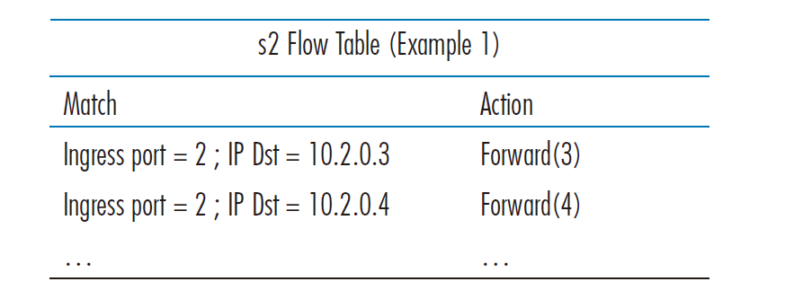

2. **第二个例子：负载均衡**

作为第二个例子，我们考虑一个负载均衡的场景，其中来自 h3 发往 10.1.\*.\* 的数据报经过 s1 和 s2 之间的直接链路转发，与此同时来自 h4 发往 10.1.\*.\* 的数据报经过 s2 和 s3 （于是从 s3 到 s1）之间的链路转发。注意到这种行为不能通过基于 IP 的目的地转发取得。在这种情况下，在 s2 中的流表项将是：

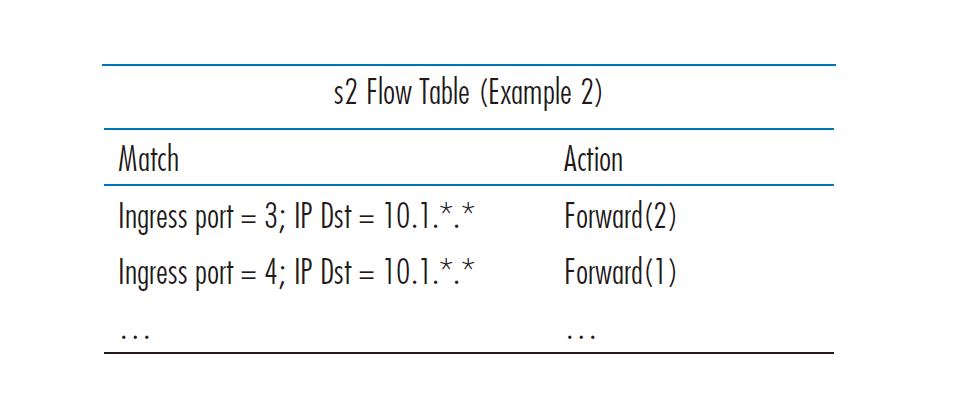

在 s1 中需要流表项将从 s2 收到的数据报转发到 hl 或 h2；在 s3 中需要流表项将接口 4 上从 s2 收到的数据报经过接口 3 转发到 s1。考虑是否能在 s1 和 s3 中配置这些流表项。

3. **第三个例子：防火墙**

作为第三个例子，我们考虑一个防火墙场景，其中 s2 仅希望（在它的任何接口上）接收来自与 s3 相连的主机所发送的流量。


如果在 s2 的流表中没有其他表项，则仅有来自 10.3.\*.\*的流量将被转发到与 s2 相连的主机。

尽管我们这里仅考虑了几种基本场景，但通用转发的多样性和优势显而易见。在课后习题中，我们将探讨流表如何用来生成许多不同的逻辑行为，包括使用相同分组交换机和链路物理集合的虚拟网络，即两个或多个逻辑上分离的网络（每个网络有它们自己的独立 和截然不同的转发行为）。在 5-5 节中，当学习 SDN 控制器时，我们将再次考察流表，其中 SDN 控制器计算和分发流表，协议用于在分组交换机和它的控制器之间进行通信。

## 4.5. 实验 8：用 wireshark 观察 IPv4 数据报

在这个 wireshark 实验中，我们将通过 IP 数据报详细地观察 IP 协议。我们将使用 traceroute 程序产生的数据报来分析。关于 traceroute 程序，我们会在 ICMP wireshark 实验中仔细研究它。我们将观察数据报中的多个字段，研究 IP 数据报的分片。

在做实验之前，你或许要回顾以下我们在 [1-5-3 节](#153-端到端时延)和[4-3-1 节](#431-ipv4-数据报格式)所讨论的内容。

### 4.5.1. traceroute

我们将使用 traceroute 程序生成我们要分析的数据报。traceroute 程序在运行时，会发送一系列数据报，第 1 次 1 个 TTL 字段为 1 的数据报，第 2 次将发送 TTL 字段为 2 的数据报，接着第 3 次会发送 TTL 为 3 的数据报，等等。TTL 字段表示这个数据报还能存在几跳。每当一个数据报被一个路由器接收到，路由器就将这个数据报字段中的 TTL 值减 1。当一个 TTL 为 1 的数据报被第一跳路由器接收到以后，TTL 将减到 0，此时，第一跳路由器就将会向源主机回送一个 ICMP 的报文（type 11-TTL-exceeded ）。同理，当一个 TTL 为 2 的数据报经过 2 跳路由器后，1 个 ICMP 报文将被回送。通过这种方式，traceroute 程序将可以确定很多信息。

我们将运行 traceroute 程序，以下的操作系统对应不同的操作方法。

- Windows。windows 提供的 traceroute 程序不允许修改 ICMP 回显请求(ping)报文的大小。这里我们推荐一个称为 pingplotter 的软件，你可以在[这个网址](https://www.pingplotter.com/products/standard.html)下载到它。下载并安装后，选择标准版，你可以免费尝试 15 天。之后，你可以指定一个网址尝试追踪。我们可以在 Edit-> Options->Packet Options 的 Packet S1ze 字段更改报文大小，默认的大小为 56 字节。在 pingplotter 的一个追踪过程完毕后，它还会在一定的间隔后重复这个过程。这个间隔我们也可以手动设置。
- Linux/Unix/MacOS。在这些操作系统里，traceroute 程序可以设置 ICMP 回显请求报文的大小。例如：

```bash
%traceroute gaia.cs.umass.edu 2000
```

这个命令将报文大小设置为 2000。

### 4.5.2. 捕获数据报

1. 启动 wireshark 并开始捕获。
2. 如果你是 windows 操作系统，启动 pingpotter，使用 56 字节默认值。键入追踪目标，这里我们选择 www.baidu.com。在10秒钟之后，停止追踪和 wireshark 的捕获。保存捕获文件。你应该可以看到下面的结果。


3. 如果你使用 Unix 或 Mac 操作系统，使用 `%traceroute www.baidu.com 56`命令进行追踪。在追踪完成后，停止 wireshark 捕获。保存捕获文件。
4. 分别使用 2000 字节和 3500 字节选项重复上述过程。

**time : 2021-06-18**

### 4.5.3. 观察捕获文件

打开你捕获的 56 字节选项的捕获文件，在捕获分组列表中，你可以看到一系列的 ICMP 回显请求报文(在 windows 下)或者一系列的 UDP 报文段(在 Unix 下)，你应该还能看到一系列的 ICMP TTL-exceeded 返回报文。在接下来的实验中，我们假设你的环境是 windows，但 Unix 系的操作系统没有什么大的区别。在回答一个问题时，你应该展示对应的你捕获到到的 ICMP 报文。(双击选中的分组，即可查看详细信息)

1. 选中第一个 TTL 为 1 的 ICMP 报文，展开它的详细信息。并查看这个报文中，你主机的 IP 地址是多少，发送目标的主机 IP 地址是多少？

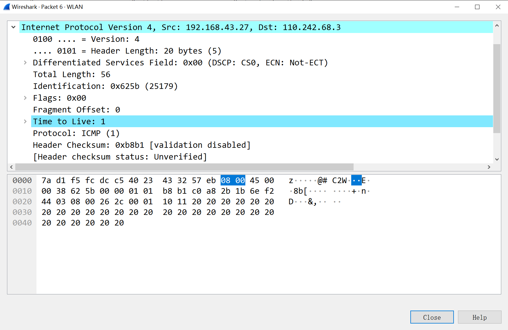

从这个分组的 IPv4 数据报可以看到：Source Address 为 192.168.43.27；Destination Address 为 110.242.68.3 。因此，本地主机电脑的 IP 地址为 192.168.43.27。而发送目标的主机 IP 地址为 110.242.68.3。

2. 在这个分组的 IPv4 数据报中，上层协议字段的值为多少？

为 1，对应的协议为 ICMP。

3. 在这个分组的 IPv4 数据报中，首部长度值为多少？有效载荷是多少？

首部长度值为 20 字节，而总的数据报长度为 56 字节，因此有效载荷为 56-20 = 36 字节。

4. 这个 IPv4 数据报被分片了吗？说出你的理由。

片偏移字段为 0，且标志字段也为 0，因此没有被分片。

下面在 wireshark 中点击分组列表表头中的 “Source” 字段进行排序，并在过滤框中输入“icmp”进行过滤，并以滚动进行浏览。你应该可以看到下面的结果。


观察一系列的 ICMP 回显请求报文，回答下面的问题。

1. 对比这一系列的 ICMP 回显请求报文对应的数据报，在这些数据报的首部中，哪些字段值在改变？哪些没有？

经过观察，除了标识字段，TTL 字段以及检验和字段得值改变外，其他字段值没有改变。

2. 解释上一个问题中字段值改变的原因，以及不改变的原因。

标识字段用于标识每一个 IPv4 数据报，因此每一个 IPv4 数据报的标识字段值都不同的。

TTL 字段在 traceroute 程序中已经解释过，TTL 字段会以 1 为单位进行递增，所以显然是改变的。

检验和字段显然是不同的。

其他不改变的字段分别是协议版本字段，首部长度字段，区分服务字段，数据报总长度字段，标志字段，片偏移字段，上层协议字段，源 IP 地址以及目的地 IP 地址。

首部长度字段和数据报总长度字段显然都是相同的。版本字段为恒定的 4，因为没有分片，所以标志字段和片偏移恒为 0。上层协议协议字段恒为 1，因为都是 ICMP 报文。源 IP 地址和目的 IP 地址显然是不变的。

3. 仔细观察这些 IPv4 数据报的标识字段的值，你能发现什么规律？

从 TTL 为 1 的数据报开始，标识字段每次也增加 1。

### 4.5.4. 观察 IPv4 数据报的分片

现在我们将保存的 2000 字节选项下的捕获文件打开，观察这个捕获文件中的分组列表。

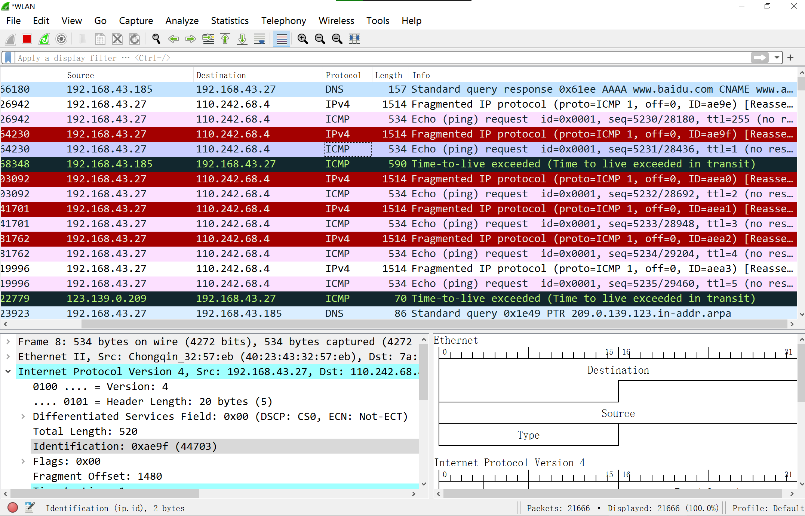

1. 找到第一个你主机发出的 ICMP 报文，观察是否进行了分片？为什么？

是，标识字段相同的数据报大于 1 个。

2. 这个报文被分成了几片？每一片的大小是多少？

2 片。第 1 片为 1480 字节。第 2 片为 520 字节。

3. 观察每一个被分片的数据报的首部字段，怎么确定这 2 个数据报的顺序？

观察片偏移字段，第 1 片为 0 到 1479 字节。第 2 片为 1480 字节到 1999 字节。

4. 对比第一个和第二个数据报的字段，哪些字段改变了？

片偏移字段，数据报总长度字段，标志字段，检验和字段。

下面我们打开 3500 字节选项下的捕获文件，观察这个捕获文件中的分组列表。


1. 找到第一个你主机发出的 ICMP 报文，观察分为了几片？

3 片。

2. 在这些被分片的报文段中，哪些字段改变了？

片偏移字段，数据报总长度字段，标志字段，检验和字段。
