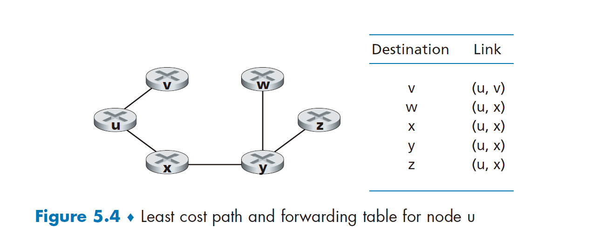
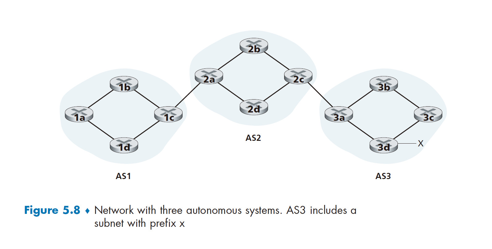
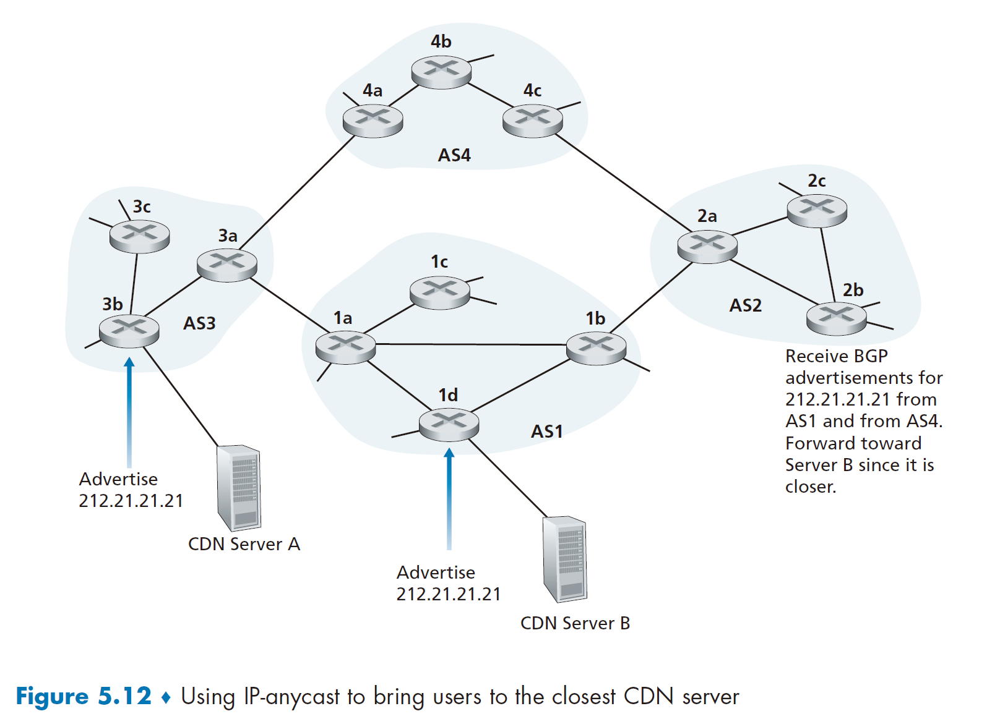
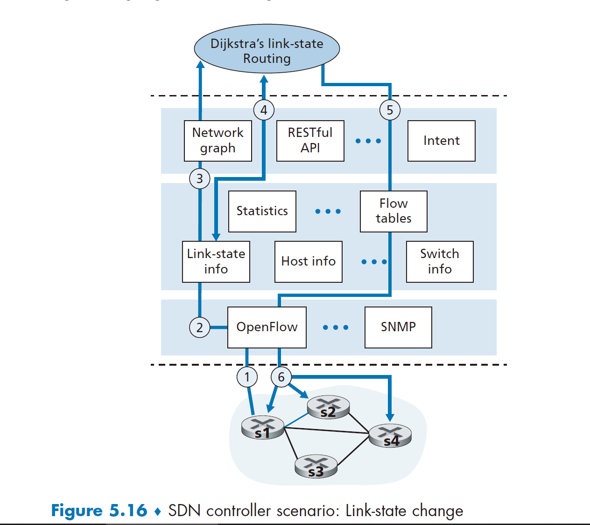

**目录：**

- [5. 网络层：控制平面](#5-网络层控制平面)
  - [5.1. 概述](#51-概述)
  - [5.2. 路由算法](#52-路由算法)
    - [5.2.1. 链路状态(LS)路由算法](#521-链路状态ls路由算法)
    - [5.2.2. 距离向量(DV)路由算法](#522-距离向量dv路由算法)
  - [5.3. 因特网中自治系统内部的路由选择：OSPF](#53-因特网中自治系统内部的路由选择ospf)
  - [5.4. ISP 之间的路由选择：BGP](#54-isp-之间的路由选择bgp)
    - [5.4.1. BGP 的职责](#541-bgp-的职责)
    - [5.4.2. 通告 BGP 路由信息](#542-通告-bgp-路由信息)
    - [5.4.3. 确定最好的路由](#543-确定最好的路由)
    - [5.4.4. IP 任播](#544-ip-任播)
    - [5.4.5. 路由策略](#545-路由策略)
    - [5.4.6. 拼装在一起：在因特网中呈现](#546-拼装在一起在因特网中呈现)
  - [5.5. SDN 控制平面](#55-sdn-控制平面)
    - [5.5.1. SDN 控制平面：SDN 控制器和 SDN 网络控制应用程序](#551-sdn-控制平面sdn-控制器和-sdn-网络控制应用程序)
    - [5.5.2. OpenFlow 协议](#552-openflow-协议)
    - [5.5.3. 数据平面和控制平面交互的例子](#553-数据平面和控制平面交互的例子)
    - [5.5.4. SDN 的过去与未来](#554-sdn-的过去与未来)
  - [5.6. ICMP：因特网控制报文协议](#56-icmp因特网控制报文协议)
  - [5.7. 网络管理和 SNMP](#57-网络管理和-snmp)
    - [5.7.1. 网络管理框架](#571-网络管理框架)
    - [5.7.2. 简单网络管理协议(SNMP)](#572-简单网络管理协议snmp)
  - [5.8. 实验 9：编写 ICMP Ping 程序](#58-实验-9编写-icmp-ping-程序)
  - [5.9. 实验 10：通过 wireshark 观察 ICMP 报文](#59-实验-10通过-wireshark-观察-icmp-报文)

# 5. 网络层：控制平面

**time : 2021-06-20**

在这一章中，我们讨论网络层剩余的部分内容：**控制平面**。控制平面不仅控制着一个数据报是怎么沿着源主机到目的地主机的路径进行路由，还控制着网络层的组成部分和服务是怎么配置和管理的。在 5-2 节我们会讨论在一些传统的路由算法，这些算法类似于图论中的最短路算法。这些算法是 Internet 中被广泛使用的路由协议：OSPF 和 BGP 的基础。这两个协议我们将在 5-3 节和 5-4 节中分别讨论。我们将了解到，OSPF 协议适用于一个单独的 ISP 网络，而 BGP 协议适用于 Internet 中的所有网络。BGP 经常被称为 Internet 的粘合剂。传统上，控制平面的路由协议和数据平面的转发功能被一起实现在一个路由器中。我们在第 4 章了解到 SDN 可以使得控制面板和数据面板分开，控制面板被实现在一个远程的控制器中，而转发功能依然实现在路由器中。我们将在 5-5 节讨论 SDN。

在第 5-6 和 5-7 章节，我们将会讨论管理 IP 的 2 个协议：Internet 控制报文协议(Internet Control Message Protocol, ICMP)和简单网络管理协议(S1mple Network Management Protocol, SNMP)。

## 5.1. 概述

通过回顾图 4-2 和 4-3 我们可以快速地进入这一章讨论的背景。在上一章中，我们可以看到转发表(基于目的地的转发)和流表
(通用转发)将网络层的数据和控制面板联系了起来。我们了解到这些表指定了一个路由的本地转发行为。我们看到在通用转发的情况下，流表不仅可以转发分组到一个指定的输出端口，还可以丢弃分组，复制分组，以及重写 2，3，4 层的分组首部。

在这一章，我们将学习这些表是怎么生成，维护和安装的，在 4-1 节的介绍中，我们了解到有 2 种方法：

- **路由器控制**。图 5-1 演示了一个路由算法运行在每个路由器中。转发和路由功能被实现在每一个路由器中。每个路由器都有一个转发部件，这个转发部件和其他路由器中的转发部件通信来计算生成转发表。这种路由器控制的方法在 Internet 中被使用了几十年，我们将在 5-3 和 5-4 节学习的 OSPF 和 BGP 算法就是基于路由器控制。


- **逻辑中心控制**。图 5-2 演示了逻辑中心控制的情况。在这种情况下，一个逻辑中心控制器计算并分发转发表到每一个路由器。我们在 4-4 和 4-5 节了解到通用转发不仅可以起到转发功能，而且还具有其他一些的丰富功能，例如防火墙和 NAT。


这个控制器和每一个路由器中的 **控制代理(Control Agent, CA)** 交互，具体来讲，控制器通过一种被定义好的协议来配置和管理路由器中的流表。一般来说，控制代理只起到最基本的功能，即和控制器通信。和图 5-1 中的路由算法不同，控制代理不和其他路由器的控制代理交互，也不参与计算转发表。这是路由器控制和逻辑中心控制的关键区别。

“逻辑集中式”控制的意思是，中心的控制器可能由很多个服务器实现，但从他们提供的路由服务来看，逻辑上就是一个中心。我们将在 5-5 节看到，SDN 采用了这种逻辑中心控制，这种方法得到越来越多的应用。谷歌在它的内部 B4 全球广域网中使用了 SDN 控制路由器，该广域网互联了它的数据中心［Jain 2013］。来自微软研究院的 SWAN［Hong 2013］，使用了一个逻辑集中式控制器来管理广域网和数据中心网络之间的路由选择和转发。大部分 ISP 提供商在积极地采用和部署 SDN。我们将在第 8 章看到，4G 和 5G 蜂窝网络采用了 SDN 控制。中国电信和中国联通在它们的数据中心内以及数据中心之间使用 SDN［Li 2015]。

## 5.2. 路由算法

在本节中，我们学习 **路由算法(routing algorithm)**，路由算法是从发送方到接收方的众多路径中确定一条通过路由器网络的好的路径（等价于路由）。通常，一条好路径指的是最低开销路径。然而我们将看到，实践中现实世界还关心诸如策略之类的问题（例如，有一个规则是“属于组织 Y 的路由器 X 不应转发任何来源于组织 Z 所属网络的分组”）。我们注意到无论网络控制平面采用每路由器控制方法，还是采用逻辑集中式控制方法，必定总是存在一条定义良好的一连串路由器，使得分组从发送主机到接收主机跨越网络“旅行”。因此，计算这些路径的路由选择算法是十分重要的，是 10 个十分重要的网络问题之一。

我们可以用“图”这一概念来抽象路由问题。我们知道 **图(Graph)**：G = (N, E) 是一个 N 个节点和 E 条边的集合。其中每条边是取自 N 的一对节点。在网络层路由问题中，路由器被抽象为节点，这是做出分组转发决定的点，中间的物理链路被抽象为边，你可以看 5-3 所示的一个例子。若要查看某些表示实际网络的图，参见［Dodge 2016； Cheswick 2000］；对于基于不同的图模型建模因特网的好坏的讨论，参见［Zegura 1997 ； Faloutsos 1999 ； Li 2004］。

如图 5-3 所示，一条边还有一个值表示它的开销。显然，这是一个有权图。通常，一条边的开销可反映出对应链路的物
理长度（例如一条越洋链路的开销可能比一条短途陆地链路的开销高），它的链路速度，或与该链 路相关的金钱上的开销。为了我们的目的，我们只将这些链路开销看成是给定的，而不必操心这些值是如何确定的。对于 E 中的任一条边 `(x, y)`，我们用 `c(x, y)` 表示节点 x 和 y 间边的开销。如果节点对 (x, y）不属于 E，则 `c(x, y) = 正无穷`。 此外，我们在这里考虑的都是无向图（即图的边没有方向），因此边 (x, y) 与边(y, x)是相同的并且 c(x, y) = c(y, x)。然而，我们将学习的算法能够很容易地扩展到在每个方向有不同开销的有向图。如果(x, y) 属于 E，节点 y 也被称为节点 x 的 **邻接节点(neighbor)**。


在图抽象中为各条边指定了开销后，路由选择算法的目标就是找岀从源到目的地间的最低开销路径。为了使问题更为精确，回想在图 `G = (N, E)`中的一条 **路径(path)** 是一个节点序列 `(x1, x2, ..., xp)`，这样每一个对 `(x1, x2)，(x2, x3), ..., (x p-1, xp)` 是 E 中的边。路径 (x1, x2, ..., xp) 的开销就是沿着路径所有边的开销的总和，即 `c(x1, X2) + c(x2, x3) + ... + c(x p-1, xp)`。给定任何两个节点 x 和 y，一般在这两个节点之间有许多条路径，每条路径都有一个开销。这些路径中的一条(或多条)为最低开销路径(least-cost path)。因此最低开销路径问题很显然是：找出源和目的地之间具有最低开销的一条路经。例如，在图 5-3 中，源节点 u 和目的节点 w 之间的最低开销路径是(u, x, y, w)，具有的路径开销是 3。注意到若在图中的所有边具有相同的开销，则最低开销路径也就是 **最短路径(shortest path)**，即在源和目的地之间的具有最少链路数量的路径。

作为一个简单练习，试找出图 5-3 中从节点 u 到节点 z 的最低开销路径，并要反映出你是如何算出该路径的。如果你像大多数人一样，通过考察图 5-3，跟踪几条从 u 到 z 的路由，你就能找出从 u 到 z 的路径，然后以某种方式来确信你所选择的路径就是所有可能的路径中具有最低开销的路径。（你考察过 u 到 z 之间的所有 17 条可能的路径吗？很可能没有！）这种计算就是一种集中式路由选择算法的例子，即路由选择算法在一个位置（你的大脑中）运行，该位置具有网络的完整信息。一般而言，路由选择算法的一种分类方式是根据该算法是集中式还是分散式来划分。

- **集中式路由选择算法(centralized routing algorithm)** 用完整的、全局性的网络信息计算岀从源到目的地之间的最低开销路径。也就是说，该算法以所有节点之间的连通性及所有链路的开销为输入。这就要求该算法在真正开始计算以前，要以某 种方式获得这些信息。计算本身可在某个场点（例如，图 5-2 中所示的逻辑集中式控制器）进行，或在每台路由器的路由选择组件中重复进行（例如在图 5-1 中）。然而，这里的主要区别在于，集中式算法具有关于连通性和链路开销方面的完整信息。具有全局状态信息的算法常被称作 **链路状态(Link State, LS)算法**，因为该算法必须知道网络中每条链路的开销。我们将在 5-2-1 节中学习 LS 算法。
- 在 **分散式路由选择算法(decentralized routing algorithm)** 中，路由器以迭代、分布式的方式计算出最低开销路径。没有节点拥有关于所有网络链路开销的完整信息。相反，每个节点仅有与其直接相连链路的开销知识即可开始工作。然后，通过迭代计算过程以及与相邻节点的信息交换，一个节点逐渐计算出到达某目的节点或一组目的节点的最低开销路径。我们将在后面的 5-2-2 节学习一个称为 **距离向量(Distance-Vector, DV)算法** 的分散式路由选择算法。之所以叫作 DV 算法，是因为每个节点维护到网络中所有其他节点的开销（距离）估计的向量。这种分散式算法，通过相邻路由器之间的交互式报文交换，更为适合路由器直接交互的控制平面，就像在图 5-1 中那样。

路由选择算法的第二种广义分类方式是根据算法是静态的还是动态的进行分类。在 **静态路由选择算法(static routing algorithm)** 中，路由随时间的变化非常缓慢，通常是人为进行调整（如人为手工编辑一条链路开销）。**动态路由选择算法(dynamic routing algorithm)** 随着网络流量负载或拓扑发生变化而改变路由选择路径。一个动态算法可周期性地运行或直接响应拓扑或链路开销的变化而运行。虽然动态算法易于对网络的变化做岀反应，但也更容易受诸如路由选择循环、路由振荡之类问题的影响。

路由选择算法的第三种分类方式是根据它是负载敏感的还是负载迟钝的进行划分。在 **负载敏感算法(load-sens1tive algorithm)** 中，链路开销会动态地变化以反映出底层链路的当前拥塞水平。如果当前拥塞的一条链路与高开销相联系，则路由选择算法趋向于绕开该拥塞链路来选择路由。而早期的 ARPAnet 路由选择算法就是负载敏感的[McQuillan 1980]，所以遇到了许多难题[Huitema 1998]。当今的因特网路由选择算法（如 RIP、OSPF 和 BGP）都是 **负载迟钝的(load-insens1tive)**，因为某条链路的开销不明确地反映其当前（或最近）的拥塞水平。

### 5.2.1. 链路状态(LS)路由算法

前面讲过，在链路状态算法中，网络拓扑和所有的链路开销都是已知的，也就是说可用作 LS 算法的输入。实践中这是通过让每个节点向网络中所有其他节点广播链路状态分 组来完成的，其中每个链路状态分组包含它所连接的链路的标识和开销。在实践中（例如 使用因特网的 OSPF 路由选择协议，讨论见 5-3 节），这经常由 **链路状态广播(link state broadcast)算法**［Perhnan 1999］来完成。节点广播的结果是所有节点都具有该网络的 一、完整的视图。于是每个节点都能够像其他节点一样，运行 LS 算法并计算出相同的最低开销路径集合。

我们下面给出的链路状态路由选择算法叫作 Dijkstra 算法，该算法以其发明者命名。一个密切相关的算法是 Prim 算法，有关图算法的一般性讨论参见［Cormen 2001］。Dijkstra 算法计算从某节点（源节点，我们称之为 u）到网络中所有其他节点的最低开销路径。Dijkstra 算法是迭代算法，其特点是经算法的第 k 次迭代后，可以计算出 k 个目的节点的最低开销路径，我们定义下列记号。

- D(v)：这次迭代中从源节点到目的节点 v 的最低开销。
- p(v)：在源节点到 v 的最低开销路径上，v 的前一个邻接节点。
- N'：图中所有节点的子集。如果源节点到 v 为最低开销路径，则 N' 包含 v。

该集中式路由选择算法由一个初始化步骤和其后的循环组成。循环执行的次数与图的节点数相等。一旦终止，该算法就得出了从源节点 u 到图中其他每个节点的最短低开销路径。

**源节点 u 的链路状态(LS)算法**

```py
1 初始化
2 N' = {u}
3 for 所有节点 v:
4  if v 是 u 的邻接节点:
5    D(v) = c(u, v)
6  else D(v) = 正无穷
7
8 循环
9    寻找一个不在 N' 中的，且 D(w) 为最小的节点 w
10   将 w 添加到 N' 中
11   对所有不在 N' 中的 w 的邻接节点 v 更新 D(v):
12     D(v) = min(D(v), D(w) + c(w, v))
13   /* 到 v 的新的开销要么是原来的 D(v)，要么是已知的到 w 的最小开销加上 w 到 v 的开销 */
14 直到 N' = N
```

举一个例子，考虑图 5-3 中的网络，计算从 u 到所有可能目的地的最低开销路径。该算法的计算过程以表格方式总结于下表中，表中的每一行给岀了迭代结束时该算法的变量的值。我们详细地考虑前几个步骤。

| 步骤 | N'     | D(v), p(v) | D(w), p(w) | D(x), p(x) | D(y), p(y) | D(z), p(z) |
| ---- | ------ | ---------- | ---------- | ---------- | ---------- | ---------- |
| 0    | u      | 2, u       | 5, u       | 1, u       | 正无穷     | 正无穷     |
| 1    | ux     | 2, u       | 4, x       |            | 2, x       | 正无穷     |
| 2    | uxy    | 2, u       | 3, y       |            |            | 4, y       |
| 3    | uxyv   |            | 3, y       |            |            | 4, y       |
| 4    | uxyvw  |            |            |            |            | 4, y       |
| 5    | uxyvwz |            |            |            |            |            |

- 在初始化步骤，从 u 到它的邻接节点 v，x，w 的最低开销路径分别初始化为 2、1 和 5。特别值得注意的是，到 w 的开销被设为 5（尽管我们很快就会看见确实存在一条开销更小的路径），因为这是从 u 到 w 的直接（一跳）链路开销。到 y 与 z 的开销被设为无穷大，因为它们不直接与 u 连接。
- 在第一次迭代中，我们观察那些还未加到集合 N' 中的节点，并且找岀在前一次迭代结束时具有最低开销的节点。那个节点便是 x，其开销是 1，因此 x 被加到集合 N' 中。于是 LS 算法更新所有节点 v 的 D(v)），产生上面的表中第 2 行（步骤 1）所示的结果。到 v 的路径开销未变。经过节点 x 到 w（在初始化结束时其开销为 5）的路径开销被发现为 4。因此这条具有更低开销的路径被选中，且沿从"开始的最短路径上"的前一节点被设为 x。类似地，到 y（经过 x）的开销被计算为 2，且该表也被相应地更新。
- 在第二次迭代时，节点 v 与 y 被发现具有最低开销路径（2），并且我们任意改变次序将 y 加到集合 N' 中，使得 N' 中含有 u、x 和 y。到仍不在 N' 中的其余节点（即节点 v， w 和 z）的开销通过 LS 算法中的第 12 行进行更新，产生如表 5-1 中第 3 行所示的结果。
- 如此等等。

当 LS 算法终止时，对于每个节点，我们都得到从源节点沿着它的最低开销路径的前一节点。对于每个前一节点，我们又有它的前一节点，以此方式我们可以构建从源节点到所有目的节点的完整路径。通过对每个目的节点存放从 u 到目的地的最低开销路径上的下一跳节点，在一个节点（如节点 u）中的转发表则能够根据此信息而构建。图 5-4 显示了对于图 5-3 中 的网络产生的最低开销路径和 u 中的转发表。



该算法的计算复杂度是多少？即给定 n 个节点（不算源节点），在最坏情况下要经过多少次计算，才能找到从源节点到所有目的节点的最低开销路径？在第一次迭代中，我们需要搜索所有的 n 个节点以确定出不在 N'中且具有最低开销的节点 w。在第二次迭代时，我们需要检查 n-1 个节点以确定最低开销。第三次对 n-2 个节点迭代，依次类推。总之，我们在所有迭代中需要搜寻的节点总数为 `n*(n + 1)/2`，因此我们说前面实现的链路状态算法在最差情况下复杂性为 O(n^2)。（该算法的一种更复杂的实现是使用一种称为堆的数据结构，能用对数时间而不是线性时间得到第 9 行的最小值，因而减少其复杂性。）

**time : 2021-06-23**

在完成 LS 算法的讨论之前，我们考虑一下可能出现的问题。图 5-5 显示了一个简单的网络拓扑，图中的链路开销等于链路上承载的负载，例如反映要历经的时延。在该例中，链路开销是非对称的，即仅当在链路 c(u, v) 两个方向所承载的负载相同时 c(u, v) 与 c(v, u) 才相等。在该例中节点 z 产生发往 m 的一个单元的流量，节点 x 也产生发往 w 的一个单元的流量，并且节点 y 也产生发往 w 的一个数量为 e 的流量。初始路由选择情况如图 5-5a 所示，其链路开销对应于承载的流量。


当 LS 算法再次运行时，节点 y 确定（基于图 5-5a 所示的链路开销）顺时针到 w 的路径开销为 1，而逆时针到 w 的路径开销（一直使用的）是 1+e。因此 y 到 w 的最低开销路径现在是顺时针的。类似地，x 确定其到 w 的新的最低开销路径也是顺时针的，产生如图 5-5b 中所示的开销。当 LS 算法下次运行时，节点 x、y 和 z 都检测到一条至 w 的逆时针方向零开销路径，它们都将其流量引导到逆时针方向的路由上。下次 LS 算法运行时，x、y 和 z 都将其流量引导到顺时针方向的路由上。

如何才能防止这样的振荡（它不只是出现在链路状态算法中，而且也可能出现在任何使用拥塞或基于时延的链路测度的算法中）。一种解决方案可能强制链路开销不依赖于所承载的流量，但那是一种不可接受的解决方案，因为路由选择的目标之一就是要避开高度拥塞（如高时延）的链路。另一种解决方案就是确保并非所有的路由器都同时运行 LS 算法。这似乎是一个更合理的方案，因为我们希望即使路由器以相同周期运行 LS 算法，在每个节点上算法执行的时机也将是不同的。有趣的是，研究人员近来已注意到了因特网上的路由器能在它们之间进行自同步［Floyd Synchronization 1994］。这就是说，即使它们初始时以同一周期但在不同时刻执行算法，算法执行时机最终会在路由器上变为同步并保持之。避免这种自同步的一种方法是，让每台路由器发送链路通告的时间随机化。

学习过 LS 算法之后，我们接下来考虑目前在实践中使用的其他重要的路由选择算法，即距离向量路由选择算法。

### 5.2.2. 距离向量(DV)路由算法

**距离向量(Distance-Vector, DV)** 算法是一种迭代的、异步的和分布式的算法，而 LS 算法是一种使用全局信息的算法。说它是分布式的，是因为每个节点都要从一个或多个邻接节点接收某些信息，执行计算，然后将其计算结果分发给邻接节点。说它是迭代的，是因为此过程一直要持续到邻接节点之间无更多信息要交换为止。（有趣的是，此算法是自我终止的，即没有计算应该停止的信号，它就停止了。）说它是异步的，是因为它不要求所有 节点相互之间步伐一致地操作。我们将看到一个异步的、迭代的、自我终止的、分布式的算法比一个集中式的算法要有趣得多！

在我们给岀 DV 算法之前，有必要讨论一下存在于最低开销路径的开销之间的一种重要关系。令 d(x, y) 是从节点 x 到节点 y 的最低开销路径的开销。则该最低开销与著名的 Bellman-Ford 方程相关，即：

```
d(x, y) = min(v) { c(x, v) + d(v, y) }
```

方程中的 min(v) 是对于 x 的所有邻接节点的。Bellman-Ford 方程是相当直观的。实际上，从 x 到 v 遍历之后，如果我们接下来取从 v 到 y 的最低开销路径，则该路径开销将是 c(x, v) + d(v, y)。因此我们必须通过遍历某些邻接节点 v 开始，从 x 到 y 的最低开销是对所有邻接节点 v 的 c(x, v) + d(v, y) 的最小值。

我们验证在图 5-3 中的源节点 u 和目的节点 z。源节点 u 有 3 个邻接节点：v，x 和 w。通过遍历该图中的各条路径，容易看出 d(v, z) = 5，d(x, z) = 3，d(w, z) = 3。将这些值连同开销 c(u, v) = 2，c(u, x) = 1 和 c(u, w) = 5 代入上面的方程中，得出 d(u, z) = min {2+5, 5+3, 1+3} = 4，这显然是正确的，并且对同一个网络来说，这正是 Dijkstra 算法为我们提供的结果。这种快速验证应当有助于消除你可能具有的任何怀疑。

Bellman-Ford 方程实际上具有重大的实践重要性。具体来说，Bellman-Ford 方程的解为节点 x 的转发表提供了表项。为了理解这一点，令 v* 是取得该方程中最小值的任何邻接节点。接下来，如果节点 x 要沿着最低开销路径向节点 y 发送一个分组，它应当首先向节点 v* 转发该分组。因此，节点 x 的转发表将指定节点 v\* 作为最终目的地 y 的下一跳路由器。Bellman-Ford 方程的另一个重要实际贡献是，它提出了在 DV 算法中邻接节点之间的通信方式。

其基本思想如下。每个节点 x 以 D(x, y) 开始，对在 N 中的所有节点 y，估计从 x 到 y 的最低开销路径的开销。令 `D(x) = [D(x, y) | y 属于 N]` 是节点 x 的距离向量，该向量是从 x 到在 N 中的所有其他节点 y 的开销估计向量。使用 DV 算法，每个节点 x 持有下列路由选择信息：

- 对于每个邻接节点 v，从 x 到邻接节点 v 的开销为 c(x, v)。
- 节点 x 的距离向量，即 `D(x) = [D(x, y) | y 属于 N]`，包含了 x 到 N 中所有目的地 y 的开销估计值。
- 它的每个邻接节点的距离向量，即对 x 的每个邻接节点有 `D(v) = [D(v, y) | y 属于 N]`。

在该分布式、异步算法中，每个节点不时地向它的每个邻接发送它的距离向量副本。 当节点 x 从它的任何一个邻接节点 v 接收到一个新距离向量，它保存 v 的距离向量，然后使用 Bellman-Ford 方程更新它自己的距离向量如下：

```
D(x, y) = min(v){c(x, v), D(v, y)} 对 N 中的每个节点
```

如果节点 x 的距离向量因这个更新步骤而改变，节点 x 接下来将向它的每个邻接节点发送其更新后的距离向量，这继而让所有邻接节点更新它们自己的距离向量。令人惊奇的是，只要所有的节点继续以异步方式交换它们的距离向量，每个开销估计 D(x, y) 收敛到 d(x, y)，d(x, y) 为从节点 x 到节点 y 的实际最低开销路径的开销［Bersekas 1991］!

**距离向量(DV)算法**

在每个节点 x:

```py
1 初始化
2 for (y in N):
3   D(x, y) = c(x, y) /* 如果 y 不是邻接节点，则 c(x, y) = 正无穷 */
4 for 每一个 w:
5   D(w, y) = ? 对于所有在 N 中的目的节点 y
6 for 每一个 w:
7   向 w 发送距离向量 D(x) = [D(x, y), y 属于 N]
8
9 循环
10   等待直至 到邻接节点 w 的链路的开销改变
11   或 收到邻接节点 w 的距离向量
12
13   for (y in N):
14     D(x, y) = min(v) { c(x, v), D(v ,y)}
15
16 if (对于任何的目的节点 y，D(x, y) 改变了):
17   向所有邻接节点发送距离向量 D(x) = [D(x, y), y 属于 N]
18
19 永远循环
```

在该 DV 算法中，当节点 x 发现它的直接相连的链路开销变化或从某个邻接节点接收到一个距离向量的更新时，它就更新其距离向量估计值。但是为了一个给定的目的地 y 而更新它的转发表，节点 x 真正需要知道的不是到 y 的最短路径距离，而是沿着最短路径到 y 的下一跳路由器邻接节点 v*(y)。如你可能期望的那样，下一跳路由器 v*(y)是在 DV 算法第 14 行中取得最小值的邻接节点 v(如果有多个取得最小值的邻接节点以则 v*(y)能够是其中任何一个有最小值的邻接节点。)因此，对于每个目的地 y，第 13-14 行中，节点 x 也决定 v*(y)并更新它对目的地 y 的转发表。

前面讲过 LS 算法是一种全局算法，在于它要求每个节点在运行 Dijkstra 算法之前，首先获得该网络的完整信息。DV 算法是分布式的，它不使用这样的全局信息。实际上，节点具有的唯一信息是它到直接相连邻接节点的链路开销和它从这些邻接节点接收到的信息。每个节点等待来自任何邻接节点的更新(第 10〜11 行)，当接收到一个更新时计算它的新距离向量 (第 14 行)并向它的邻接节点分布其新距离向量(第 16-17 行)。在实践中许多类似 DV 的算法被用于多种路由选择协议中，包括因特网的 RIP 和 BGP、ISO IDRP、Novell IPX 和早期的 ARPAnet。

图 5-6 举例说明了 DV 算法的运行，应用场合是该图顶部有三个节点的简单网络。算法的运行以同步的方式显示出来，其中所有节点同时从其邻接节点接收报文，计算其新距离向量，如果距离向量发生了变化则通知其邻接节点。学习完这个例子后，你应当确信该算法以异步方式也能正确运行，异步方式中可在任意时刻出现节点计算与更新的产生/接收。

该图最左边一列显示了这 3 个节点各自的初始 **路由表(routing table)**。例如，位于左上角的表是节点 x 的初始路由表。在一张特定的路由表中，每行是一个距离特别是每个节点的路由表包括了它的距离向量和它的每个邻接节点的距离向量。因此，在节点 x 的初始路由表中的第一行是 D(x) = [D(x, x), D(x, y), D(x, z)] = [0, 2, 7]。在该表的第二和第三行是最近分别从节点 y 和 z 收到的距离向量。因为在初始化时节点 x 还没有从节点 y 和 z 收到任何东西，所以第二行和第三行表项中被初始化为无穷大。

初始化后，每个节点向它的两个邻接节点发送其距离向量。图 5-6 中用从表的第一列到表 的第二列的箭头说明了这一情况。例如，节点 x 向两个节点 y 和 z 发送了它的距离向量 D(x) = [0, 2, 7]。在接收到该更新后，每个节点重新计算它自己的距离向量。例如，节点 x 计算

```
D(x, x) = 0
D(x, y) = min {c(x, y) + D(y, y), c(x, z) + D(z, y)} = min {2+0, 7+1} = 2
D(x, z) = min {c(x, y) + D(y, z), c(x, z) + D(z, z)} = min {2+1, 7+0} = 3
```

第二列因此为每个节点显示了节点的新距离向量连同刚从它的邻接节点接收到的距离向量。注意到，例如节点 x 到节点 z 的最低开销估计 D(x, z) 已经从 7 变成了 3。还应注意到，对于节点 x，节点 y 在该 DV 算法的第 14 行中取得了最小值；因此在该算法的这个阶段，我们在节点 x 得到了 v*(y) = y，v*(z) = y。


在节点重新计算它们的距离向量之后，它们再次向其邻接节点发送它们的更新距离向量（如果它们已经改变的话）。图 5-6 中由从表第二列到表第三列的箭头说明了这一情况。注意到仅有节点 x 和节点 z 发送了更新：节点 y 的距离向量没有发生变化，因此节点 y 没有发送更新。在接收到这些更新后，这些节点则重新计算它们的距离向量并更新它们的路由选择表，这些显示在第三列中。

从邻接节点接收更新距离向量、重新计算路由选择表项和通知邻接节点到目的地的最低开销路径的开销已经变化的过程继续下去，直到无更新报文发送为止。在这个时候，因为无更新报文发送，将不会出现进一步的路由选择表计算，该算法将进入静止状态，即所有的节点 将执行 DV 算法的第 10〜11 行中的等待。该算法停留在静止状态，直到一条链路开销发生改变，如下面所讨论的那样。

**time : 2021-06-24**

1. **距离向量算法：链路开销改变与链路故障**

当一个运行 DV 算法的节点检测到从它自己到邻接节点的链路开销发生变化时（第 10〜11 行），它就更新其距离向量（第 13 ~ 14 行），并且如果最低开销路径的开销发生了变化，向邻接节点通知其新的距离向量（第 16-17 行）。图 5-7a 图示了从 y 到 x 的链路开销从 4 变为 1 的情况。我们在此只关注了与 z 到目的地 x 的距离表中的有关表项。该 DV 算法导致下列事件序列的出现：


- 在 t(0)时刻，y 检测到链路开销变化（开销从 4 变为 1），更新其距离向量，并通知其邻接节点这个变化，因为最低开销路径的开销已改变。
- 在 t(1)时刻，z 收到来自 y 的更新报文并更新了其距离表。它计算出到 x 的新最低开销（从开销 5 减为开销 2），它向其邻接节点发送了它的新距离向量。
- 在 t(2)时刻，y 收到来自 z 的更新并更新其距离表。y 的最低开销未变，因此 y 不发送任何报文给 z。该算法进入静止状态。

因此，对于该 DV 算法只需两次迭代就到达了静止状态。在 x 与 y 之间开销减少的好消息通过网络得到了迅速传播。

我们现在考虑一下当某链路开销增加时发生的情况。假设 x 与 y 之间的链路开销从 4 增加到 60，如图 5-7b 所示。

(1) 在链路开销变化之前，D(y, x) =4, D(y, z)=l, D(z, y) = 1 和 D(z, x) =5。在心时刻, y 检测到链路开销变化（开销从 4 变为 60）。y 计算它到兀的新的最低开销路径的开销，其值为

```
D(y, x) = min {c(y, x) + D(x, x), c(y, z)+ D(z, x)} = min {60+0, 1+5} = 6
```

当然，从网络全局的视角来看，我们能够看出经过 z 的这个新开销是错误的。但节点 y 仅有的信息是：它到 x 的直接开销是 60，且 Z 上次已告诉 y, z 能以开销 5 到 x。因此, 为了到达 x，y 将通过 z 路由，完全期望 z 能以开销 5 到达 x。到了 t(1)时刻，我们遇到 **路由选择环路(routing loop)**，即为到达 x，y 通过 z 路由，z 又通过 y 路由。路由选择环路就像一个黑洞，即目的地为 x 的分组在 t(1)时刻到达 y 或 Z 后，将在这两个节点之间不停地（或直到转发表发生改变为止）来回反复。

(2) 因为节点 y 已算出到 x 的新的最低开销，它在 t(1)时刻将该新距离向量通知 z。

(3) 在 t(1)后某个时间，z 收到 y 的新距离向量，它指示了 y 到久的最低开销是 6。z 知道它能以开销 1 到达 y，因此计算岀到 x 的新最低开销 D(z, x) =min{50+0, 1+6} = 7。因为 z 到 x 的最低开销已增加了，于是它便在 t(2)时刻通知 7 其新开销。

(4) 以类似方式，在收到 z 的新距离向量后，y 决定 D(y, x) =8 并向 z 发送其距离向量。 接下来 z 确定 D(z, x)=9 并向 y 发送其距离向量，等等。

该过程将要继续多久呢？你应认识到该循环将持续 44 次迭代（在 y 与 z 之间交换报文），即直到 z 最终算出它经由 y 的路径开销大于 50 为止。此时,的最低开销路径是经过它到 x 的直接连接。y 将经由 z 路由选择到 z 将（最终）确定它到 x
x。关于链路开销增加的坏消息的确传播得很慢！如果链路开销 c(y, x)从 4 变为 10 000 且开销 c(z, x)为 9999 时将发生什么样的现象呢？由于这种情况，我们所见的问题有时被称为无穷计数(count-to- infinity)问题。

2. **距离向量算法：增加毒性逆转**

刚才描述的特定循环的场景可以通过使用一种称为 **毒性逆转(poisoned reverse)** 的技术而加以避免。其思想较为简单：如果 z 通过 y 路由选择到目的地 x，则 z 将通告 y，它（即 z）到 x 的距离是无穷大，也就是 z 将向 y 通告 D(x, x) = 正无穷（即使 z 实际上知道 D(z, x) = 5）。只要 z 经 y 路由选择到 x，z 就持续地向 y 讲述这个善意的小谎言。因为 y 相信 z 没有 到 x 的路径，故只要 z 继续经 y 路由选择到 x（并这样去撒谎），y 将永远不会试图经由 z 路由选择到 x。

我们现在看一下毒性逆转如何解决我们前面在图 5-7b 中遇到的特定环路问题。作为毒性逆转的结果，y 的距离表指示了 D(z, x) = 正无穷。当(x, y)链路的开销在 5 时刻从 4 变为 60 时，y 更新其表，虽然开销高达 60，仍继续直接路由选择到 x，并将到 x 的新开销通知 z,即 D(y, z) =60。z 在 t(1)时刻收到更新后，便立即将其到先的路由切换到经过开销为 50 的直接(z, x)链路。因为这是一条新的到 x 的最低开销路径，且因为路径不再经过 y,就在 t(2)时刻通知 y 现在 D(z, x) = 50。在收到来自 z 的更新后，y 便用 D(y, x)= 51 更新其距离表。另外，因为 z 此时位于 y 到兀的最低开销路径上，所以 y 通过在 t(3) 时刻通知 z 其 D(y, x) = 8 （即使 y 实际上知道 D(y, x) =51）毒化从 z 到先的逆向路径。

毒性逆转解决了一般的无穷计数问题吗？没有。你应认识到涉及 3 个或更多节点（而不只是两个直接相连的邻接节点节点）的环路将无法用毒性逆转技术检测到。

3. **LS 与 DV 路由选择算法的比较**

DV 和 LS 算法采用互补的方法来解决路由选择计算问题。在 DV 算法中，每个节点仅 与它的直接相连的邻接节点交谈，但它为其邻接节点提供了从它自己到网络中（它所知道的）所有 其他节点的最低开销估计。LS 算法需要全局信息。因此，当在每台路由器中实现时，例 如像在图 4-2 和图 5-1 中那样，每个节点（经广播）与所有其他节点通信，但仅告诉它们 与它直接相连链路的开销。我们通过快速比较它们各自的属性来总结所学的链路状态与距 离向量算法。记住 N 是节点（路由器）的集合，而 E 是边（链路）的集合。

- 报文复杂性。我们已经看到 LS 算法要求每个节点都知道网络中每条链路的开销。 这就要求要发送 O(|N|\*|E|) 个报文。而且无论何时一条链路的开销改变时，必须向所有节点发送新的链路开销。DV 算法要求在每次迭代时，在两个直接相连邻接节点之间交换报文。我们已经看到，算法收敛所需时间依赖于许多因素。当链路开销改变时，DV 算法仅当在新的链路开销导致与该链路相连节点的最低开销路径发生变时，才传播已改变的链路开销。
- 收敛速度。我们已经看到 LS 算法的实现是一个要求 O(|N|\*|E|)个报文的 O(|N|^2)算法。DV 算法收敛较慢，且在收敛时会遇到路由选择环路。DV 算法还会遭遇无穷计数的问题。
- 健壮性。如果一台路由器发生故障、行为错乱或受到蓄意破坏时情况会怎样呢？对于 LS 算法，路由器能够向其连接的链路（而不是其他链路）广播不正确的开销。 作为 LS 广播的一部分，一个节点也可损坏或丢弃它收到的任何 LS 广播分组。但是一个 LS 节点仅计算自己的转发表；其他节点也自行执行类似的计算。这就意味着在 LS 算法下，路由计算在某种程度上是分离的，提供了一定程度的健壮性。在 DV 算法下，一个节点可向任意或所有目的节点通告其不正确的最低开销路径。更一般地，我们会注意到每次迭代时，在 DV 算法中一个节点的计算会传递给它的邻接节点，然后在下次迭代时再间接 地传递给邻接节点的邻接节点。在此情况下，DV 算法中一个不正确的节点计算值会扩散到整个网络。

总之，两个算法没有一个是明显的赢家，它们都在因特网中得到了应用。

## 5.3. 因特网中自治系统内部的路由选择：OSPF

在我们至今为止的算法研究中，我们将网络只看作一个互联路由器的集合。从所有路由器执行相同的路由选择算法以计算穿越整个网络的路由选择路径的意义上来说，一台路由器很难同另一台路由器区别开来。在实践中，该模型和这种一组执行同样路由选择算法的同质路由器集合的观点有一点简单化，有以下两个重要原因：

- 规模。随着路由器数目变得很大，涉及路由选择信息的通信、计算和存储的开销将 高得不可实现。当今的因特网由数亿台主机组成。在这些主机中存储的路由选择信 息显然需要巨大容量的内存。在所有路由器之间广播连通性和链路开销更新所要求的负担将是巨大的！在如此大量的路由器中迭代的距离向量算法将肯定永远无法收敛！显然，必须采取一些措施以减少像因特网这种大型网络中的路由计算的复杂性。
- 管理自治。因特网是 ISP 的网络，其中每个 ISP 都有它自己的路由器网络。ISP 通常希望按自己的意愿运行路由器（如在自己的网络中运行 它所选择的某种路由选择算法），或对外部隐藏其网络的内部组织面貌。在理想情况下，一个组织应当能够按自己的愿望运行和管理其网络，还要能将其网络与其他外部网络连接起来。

这两个问题都可以通过将路由器组织进 **自治系统(Autonomous System, AS)** 来解决，其中每个 AS 由一组通常处在相同管理控制下的路由器组成。通常在一个 ISP 中的路由器以及互联它们的链路构成一个 AS。然而，某些 ISP 将它们的网络划分为多个 AS。特别是，某些一级 ISP 在其整个网络中使用一个庞大的 AS，而其他 ISP 则将它们的 ISP 拆分为数十个互联的 AS。一个自治系统由唯一的 AS 号（ASN）所标识［RFC 1930］。和 IP 地址相同，AS 号由 ICANN 区域注册机构所分配［ICANN 2020］。

在相同 AS 中的路由器都运行相同的路由选择算法并且有彼此的信息。在一个自治系统内运行的路由选择算法叫作 **自治系统内部路由选择协议(intra-autonomous system routing protocol)**。

**开放最短路优先(OSPF)**

OSPF 路由选择及其关系密切的协议 IS-IS 都被广泛用于因特网的 AS 内部路由选择。OSPF 中的开放（open）一词是指路由选择协议规范是公众可用的（与之相反的是 Cisco 的 EIGRP 协议，该协议在最近才成为开放的［Savage 2015]，它作为 Cisco 专用协议大约有 20 年时间）。OSPF 版本 2 由 [RFC 2328] 所定义。

OSPF 是一种链路状态协议，它使用泛洪链路状态信息和 Dijkstra 最低开销路径算法。使用 OSPF，一台路由器构建了一幅关于整个自治系统的完整拓扑图。每台路由器在本地运行 Dijkstra 的最短路径算法，以确定一个以自身为根节点到所有子网的最短路径树。链路开销是由网络管理员配置的（参见 设置 OSPF 链路权值）。管理员可以将所有链路的开销设为 1，这样就实现了最少跳数路由，或者可能会选择将链路权值按与链路容量成反比来设置，从而不防止流量使用低带宽链路。OSPF 不强制规定设置链路权值的策略（这是网络管理员的任务），而是提供了一种机制（协议），为给定链路权值的集合确定最低开销路径路由。

使用 OSPF 时，路由器向自治系统内所有其他路由器广播路由信息，而不仅仅是向邻接路由器广播。每当一条链路的状态发生变化时，路由器就会广播链路状态信息。即使链路状态未发生变化，路由器也会周期性地（至少每隔 30 min 一次）广播链路状态。RFC 2328 中有这样的说明：“链路状态通告的这种周期性更新增加了链路状态算法的健壮性。” OSPF 通告包含在 OSPF 报文中，该 OSPF 报文直接由 IP 承载，对 OSPF 其上层协议的值为 89。因此 OSPF 协议必须自己实现诸如可靠报文传输、链路状态广播等功能。OSPF 协议还要检查链路正在运行（通过向相连的邻接节点发送 HELLO 报文），并允许 OSPF 路由器获得邻接路由器的网络范围链路状态的数据库。

OSPF 的优点包括下列几方面：

- 安全。能够鉴别 OSPF 路由器之间的交换 C 如链路状态更新）。使用鉴别，仅有受信任的路由器能参与一个 AS 内的 OSPF 协议，因此可防止恶意入侵者 （或正在利用新学的知识到处试探的网络专业的学生）将不正确的信息注入路 由器表内。在默认状态下，路由器间的 OSPF 报文是未被鉴别的并能被伪造。能够配置两类鉴别，即简单的和 MD5 的（参见第 8 章有关 MD5 和鉴别的一般性讨论）。使用简单的鉴别，每台路由器配置相同的口令。当一台路由器发送一个 OSPF 分组，它以明文方式包括了口令。显然，简单鉴别并不是非常安全。MD5 鉴别基于配置在所有路由器上的共享秘密密钥。对发送的每个 OSPF 分组，路由器对附加了秘密密钥的 OSPF 分组内容计算 MD5 散列值（参见第 8 章中报文鉴别码的讨论）。然后路由器将所得的散列值包括在该 OSPF 分组中。 接收路由器使用预配置的秘密密钥计算出该分组的 MD5 散列值，并与该分组 携带的散列值进行比较，从而验证了该分组的真实性。在 MD5 鉴别中也使用了序号对重放攻击进行保护。
- 多条相同开销的路径。当到达某目的地的多条路径具有相同的开销时，OSPF 允许使用多条路径（这就是说，当存在多条相等开销的路径时，无须仅选择单一的路径来承载所有的流量）。
- 对单播与多播路由选择的综合支持。多播 OSPF（MOSPF）［RFC 1584］提供对 0SPF 的简单扩展，以便提供多播路由选择。MOSPF 使用现有的 OSPF 链路数据库，并为现有的 OSPF 链路状态广播机制增加了一种新型的链路状态通告。
- 支持在单个 AS 中的层次结构。一个 OSPF 自治系统能够层次化地配置多个区域。每个区域都运行自己的 OSPF 链路状态路由选择算法，区域内的每台路由器都向该 区域内的所有其他路由器广播其链路状态。在每个区域内，一台或多台区域边界路 由器负责为流向该区域以外的分组提供路由选择。最后，在 AS 中只有一个 OSPF 区域配置成主干区域。主干区域的主要作用是为该 AS 中其他区域之间的流量提供路由选择。该主干总是包含本 AS 中的所有区域边界路由器，并且可能还包含了一些非边界路由器。在 AS 中的区域间的路由选择要求分组先路由到一个区域边界路由器（区域内路由选择），然后通过主干路由到位于目的区域的区域边界路由器，进而再路由到最终目的地。

OSPF 是一个相当复杂的协议，而我们这里的讨论是十分简要的，[Huitema 1998； Moy 1998； RFC 2328]提供了更多的细节。

**设置 OSPF 链路权值**

讨论链路状态路由时，我们假定链路开销已经设置好了，运行诸如 OSPF 这样的路由选择算法，流量根据由 LS 算法计算所得的路由选择表流动。就因果而言，给定链路权重（即它们先发生），结果得到（经 Dijkstra 算法）最小 化总体开销的路由选择路径。从这个角度看，链路权重反映了使用一条链路的开销（例 如，如果链路权重与容量成反比，则使用高容量链路将具有较小的权重并因此从路由选 择的角度更有吸引力），并且使用 Dijkstra 算法使得总开销为最小。

在实践中，链路权重和路由选择路径之间的因果关系也许是相反的，网络操作员配置链路权重，以获取某些流量工程目标的路由选择路径 [Fortz 2000；Fortz 2002]。例如，假设某网络操作员具有在每个入口点进入和发向每个出口点的该网络的流量估计。该操作员接下来可能要设置特定入口到出口的流路由选择，以最小化经所有网络链路的 最大利用率。但使用如 OSPF 这样的路由选择算法，操作员调节网络流的路由选择的主要手段就是链路权重。因此，为了取得最小化最大链路利用率的目标，操作员必须找出 取得该目标的链路权重集合。这是一种相反的因果关系，即所希望的流路由选择已知, 必须找到 OSPF 链路权重，使得该 OSPF 路由选择算法导致这种希望的流路由选择。

## 5.4. ISP 之间的路由选择：BGP

我们刚才学习了 OSPF 是一个 AS 内部路由选择协议。当在相同 AS 内的源和目的地之间进行分组选路时，分组遵循的路径完全由 AS 内路由选择协议所决定。然而，当分组跨越多个 AS 进行路由时，比如说从位于马里廷巴克图的智能手机到位于美国硅谷数据中心的一台服务器，我们需要一个 **自治系统间路由选择协议(inter-autonomous system routing protocol)**。因为 AS 间路由选择协议涉及多个 AS 之间的协调，所以 AS 通信必须运行相同的 AS 间路由选择协议。在因特网中，所有的 AS 运行相同的 AS 间路由选择协议，称为 **边界网关协议(Broder Gateway Protocol, BGP)** [RFC 4271; Stewart 1999]。

BGP 无疑是所有因特网协议中最为重要的（唯一竞争者可能是我们已经在 4-3 节中学习的 IP 协议），因为正是这个协议将因特网中数以千计的 ISP 黏合起来。如我们将看到的那样，BGP 是一种分布式和异步的协议，与 5-2-2 节中描述的距离向量路由选择协议一脉相承。尽管 BGP 是一种复杂和富有挑战性的协议，但为了深层次理解因特网，我们需要熟悉它的基础结构和操作。我们专注于学习 BGP 的时间将是物有所值的。

### 5.4.1. BGP 的职责

为了理解 BGP 的职责所在，考虑一个 AS 和在该 AS 中的任意一个路由器。前面讲过，每台路由器具有一张转发表，该转发表在将到达分组转发到出路由器链路的过程中起着主要作用。如我们已经学习过的那样，对于位于相同 AS 中的目的地而言，在路由器转发表中的表项由 AS 内部路由选择协议所决定。而对于位于该 AS 外部的目的地而言情况如何呢？这正是 BGP 用武之地。

在 BGP 中，分组并不是路由到一个特定的目的地址，相反是路由到 CIDR 化的前缀，其中每个前缀表示一个子网或一个子网的集合。在 BGP 的世界中，一个目的地可以采用 138.16.68/22 的形式，对于这个例子来说包括 1024 个 IP 地址。因此，一台路由器的转发表将具有形式为 (x, I) 的表项，其中 x 是一个前缀（例如 138.16.68/22），I 是该路由器的接口之一的接口号。

作为一种 AS 间的路由选择协议，BGP 为每台路由器提供了一种完成以下任务的手段:

- 从邻接 AS 获得前缀的可达性信息。特别是，BGP 允许每个子网向因特网的其余部分通告它的存在。如果没有 BGP 的话，每个子网将是隔离的孤岛，即它们孤独地存在，不被因特网其余部分获知。
- 确定到该前缀的“最好的”路由。一台路由器可能知道两条或更多条到特定前缀的不同路由。为了确定最好的路由，该路由器将本地运行一个 BGP 路由过程（使用它经过相邻的路由器获得的前缀可达性信息）。该最好的路由将基于策略以及可达性信息来确定。

我们现在来看 BGP 如何执行这两个任务。

**time : 2021-06-26**

### 5.4.2. 通告 BGP 路由信息

考虑图 5-8 中显示的网络。如我们看到的那样，这个简单的网络具有 3 个自治系统: AS1、AS2 和 AS3。AS3 包括一个具有前缀为 x 的子网。对于每个 AS，每台路由器要么是一台 **网关路由器(gateway router)**，要么是一台 **内部路由器(internal router)**。网关路由器是一台位于 AS 边缘的路由器，它直接连接到在其他 AS 中的一台或多台路由器。内部路由器仅连接在它自己 AS 中的主机和路由器。例如，在 AS1 中路由器 1c 是网关路由器，路由器 1b 和 1d 是内部路由器。



我们考虑这样一个任务：向图 5-8 中显示的所有路由器通告对于前缀 x 的可达性信息。大致来说，首先，AS3 向 AS2 发送一个 BGP 报文，告知 x 存在并且位于 AS3 中；我们将该报文表示为“AS3 x”。然后 AS2 向 AS1 发送一个 BGP 报文，告知 x 存在并且能够先通过 AS2 然后进入 AS3 进而到达，我们将该报文表示为“AS2 AS3 x”。以这种方式，每个自治系统不仅知道 x 的存在，而且知道通向 x 的自治系统的路径。

具体来说，这个过程是路由器在发送报文。为了理解这一点，我们再来看图 5-8。在 BGP 中，每对路由器通过使用 179 端口的半永久 TCP 连接交换路由选择信息。每条直接连接以及所有通过该连接发送的 BGP 报文，称为 **BGP 连接(BGP cormection)**。此外，跨越两个 AS 的 BGP 连接称为 **外部 BGP(eBGP)** 连接，而在相同 AS 中的两台路由器之间的 BGP 会话称为 **内部 BGP(iBGP)** 连接。图 5-8 所示网络的 BGP 连接的例子显示在图 5-9 中。对于直接连接在不同 AS 中的网关路由器的每条链路而言，通常有一条 eBGP 连接；因此，在图 5-9 中，在网关路由器 1c 和 2a 之间有一条 eBGP 连接，而在网关路由器 2c 和 3a 之间也有一条 eBGP 连接。

在每个 AS 中的路由器之间还有多条 iBGP 连接。特别是，图 5-9 显示了一个 AS 内部 的每对路由器之间的一条 BGP 连接的通常配置，在每个 AS 内部产生了网状的 TCP 连接 在图 5-9 中，eBGP 会话显示为长虚线，iBGP 显示为短虚线。注意到 iBGP 连接并不总是与物理链路对应。


传播可达性信息使用了 iBGP 和 eBGP 会话。考虑向 AS1 和 AS2 中的所有路由器通告前缀 x 的可达性信息。在这个过程中，网关路由器 3a 先向网关路由器 2c 发送一个 eBGP 报文“AS3 x”。网关路由器 2c 然后向 AS2 中的所有其他路由器(包括网关路由器 2a)发送 iBGP 报文“AS3 x”。网关路由器 2a 接下来向网关路由器 1c 发送一个 eBGP 报文“AS2 AS3 x”。最后，网关路由器 1c 使用 iBGP 向 AS1 中的所有路由器发送报文 “AS2 AS3 x"。在这个过程完成后，在 AS1 和 AS2 中的每个路由器都知道了 x 的存在并且也都知道了通往 x 的 AS 路径。

当然，在真实的网络中，从某个给定的路由器到某个给定的目的地可能有多条不同的路径，每条通过了不同的 AS 序列。例如，考虑图 5-10 所示的网络，它是在图 5-8 那个初始网 络基础上，从路由器 1d 到路由器 3d 附加了一条物理链路。在这种情况下，从 AS1 到 x 有两条路径：经过路由器 1c 的路径“AS2 AS3 x”；以及经过路由器 1d 的新路径“AS3 x”。


### 5.4.3. 确定最好的路由

如我们刚才学习到的那样，从一个给定的路由器到一个目的子网可能有多条路径。事实上，因特网中的路由器常常接收到很多不同的可能路径的可达性信息。一台路由器如何在这些路径之间进行选择(并且再相应地配置它的转发表)呢？

在应对这个问题之前，还需要介绍几个 BGP 术语。当路由器通过一个 BGP 连接通告前缀时，它还会在前缀外包含一些 **BGP 属性(BGP attribute)**。用 BGP 术语来说，前缀及其属性称为 **路由(route)**。其中两个重要的属性是 AS-PATH 和 NEXT-HOP。AS-PATH 属性包含了通过的 AS 的列表，如我们在前面的例子中所见。为了生成 AS-PATH 的值，当一个前缀通过某 AS 时，该 AS 将其 ASN 加入 AS-PATH 中的现有列表。例如，在图 5-10 中，从 AS1 到子网 x 有两条路：其中一条使用 AS-PATH “AS2 AS3”；而另一条使用 AS-PATH “AS3”。BGP 路由器还使用 AS-PATH 属性来检测和防止通告环路：如果一台路由器在路径列表中看到包含了它自己的 AS，它将拒绝该通告。

NEXT-HOP 属性则具有微妙的作用。NEXT-HOP 是 AS-PATH 起始的路由器接口的 IP 地址。为了深入理解该属性，我们再次参考图 5-10。如图 5-10 中所指示的那样，对于从 AS1 通过 AS2 到 x 的路由 “AS2 AS3 x”，其属性 NEXT-HOP 是路由器 2a 左边接口的 IP 地址。对于从 AS1 绕过 AS2 到 x 的路由“AS3”，其 NEXT-HOP 属性是路由器 3d 最左边接口的 IP 地址。总的说来，在这个假想的例子中，AS1 中的每台路由器都知道了到前缀 x 的两台 BGP 路由：

路由器 2a 的最左侧接口的 IP 地址：AS2 AS3； x
路由器 3d 的最左侧接口的 IP 地址：AS3； x

这里，每条 BGP 路由包含 3 个组件：NEXT-HOP； AS-PATH；目的前缀。在实践中, 一条 BGP 路由还包括其他属性，眼下我们将暂且忽略它。注意到 NEXT-HOP 属性是不属于 AS1 的某路由器的 IP 地址；然而，包含该 IP 地址的子网直接连接到 AS1。

这里，每条 BGP 路由包含 3 个组成部分：NEXT- HOP； ASPATH；目的前缀。在实践中，一条 BGP 路由还包括其他属性，眼下我们将暂且忽略它。注意到 NEXT-HOP 属性不属于 AS1 的某路由器的 IP 地址；然而，包含该 IP 地址的子网直接连接到 AS1。

1. **热土豆路由**

终于到了以精确的方式来讨论 BGP 路由选择算法的时刻了。我们将以一个最简单的路由选择算法开始，即 **热土豆路由选择(hot potato routing)**。

考虑在图 5-10 网络中的路由器 1b。如同刚才所述，这台路由器将学习到达前缀 x 的两条 BGP 路由。使用热土豆路由算法，（从所有可能的路由中）选择的路由到开始该路由的 NEXT-HOP 路由器具有最小开销。在这个例子中，路由器 1b 将査阅它的 AS 内部路由选择信息，以找到通往 NEXT-HOP 路由器 2a 的最低开销 AS 内部路径以及通往 NEXT-HOP 路由器 3d 的最低开销 AS 间路径，进而选择这些最低开销路径中具有最低开销的那条。例如，假设开销定义为穿越的链路数。则从路由器 1b 到路由器 2a 的最低开销是 2，从路由器 1b 到路由器 2d 的最低开销是 3，因此将选择路由器 2a。路由器 1b 则将査阅它的转发表 （由它的 AS 内部算法所配置），并且找到通往路由器 2a 的位于最低开销路径上的接口 I。1b 则把(x，I)加到它的转发表中。

图 5-11 中总结了在一台路由器转发表中对于热土豆路由选择增加 AS 向外前缀的步骤。注意到下列问题是重要的：当在转发表中增加 AS 向外前缀时，AS 间路由选择协议（BGP）和 AS 内部路由选择协议（如 OSPF）都要用到。


热土豆路由选择依据的思想是：对于路由器 1b，尽可能快地将分组送出其 AS （更明确地说，用可能的最低开销），而不担心其 AS 外部到目的地的余下部分的开销。就“热土豆路由选择”名称而言，分组被类比为烫手的热土豆。因为它烫手，你要尽可能快地将它传给另一个人（另一个 AS）。热土豆路由选择因而是自私的算法，即它试图减小在它自己 AS 中的开销，而忽略在其 AS 之外的端到端开销的其他部分。注意到使用热土豆路由选择，对于在相同 AS 中的两台路由器，可能对相同的前缀选择两条不同的 AS 路径。例如，我们刚才看到路由器 1b 到达 x 将通过 AS2 发送分组。而路由器 1d 将绕过 AS2 并直接向 AS3 发送分组到达 x。

2. **实际的路由算法**

在实践中，BGP 使用了一种比热土豆路由选择更为复杂但却结合了其特点的算法。对于任何给定的目的地前缀，进入 BGP 的路由选择算法的输入是到某前缀的所有路由的集合，该前缀是已被路由器学习和接受的。如果仅有一条这样的路由，BGP 则显然选择该路由。如果到相同的前缀有两条或多条路由，则顺序地调用下列消除规则直到余下一条路由：

1）路由被指派一个 **本地偏好(local preference)** 值作为其属性之一（除了 AS-PATH 和 NEXT-HOP 以外）。一条路由的本地偏好可能由该路由器设置或可能由在相同 AS 中的另一台路由器学习到。本地偏好属性的值是一种策略决定，它完全取决于该 AS 的网络管理员（我们随后将更为详细地讨论 BGP 策略问题）。具有最高本地偏好值的路由将被选择。
2）从余下的路由中（所有都具有相同的最高本地偏好值），将选择具有最短 AS-PATH 的路由。如果该规则是路由选择的唯一规则，则 BGP 将使用距离向量算法决定路径，其中距离测度使用 AS 跳的跳数而不是路由器跳的跳数。
3）从余下的路由中（所有都具有相同的最高本地偏好值和相同的 AS-PATH 长度），使用热土豆路由选择，即选择具有最靠近 NEXT-HOP 路由器的路由。
4）如果仍留下多条路由，该路由器使用 BGP 标识符来选择路由，参见[Stewart 1999] 。举一个例子，我们再次考虑图 5・10 中的路由器 lb。前面讲过到前缀 x 确切地有两条 BGP 路由，一条通过 AS2 而另一条绕过 AS2。前面也讲过如果它使用自己的热土豆路由选择，则 BGP 将通过 AS2 向前缀 x 路由分组。但在上面的路由选择算法中，在规则 3 之前应用了规则 2，导致 BGP 选择绕过 AS2 的那条路由，因为该路由具有更短的 AS-PATH。因此 我们看到使用上述路由选择算法，BGP 不再是一种自私的算法，即它先查找具有短 AS 路径的路由（因而很可能减小端到端时延）。

如上所述，BGP 是因特网 AS 间路由选择事实上的标准。要查看从第 1 层 ISP 中提取的各种 BGP 路由选择表（庞大！），可参见 http://www.routeviews.org。BGP 路由选择表通常包含超过 50 万条路由（即前缀和相应的属性）。BGP 路由选择表的规模和特征的统计可在[Potaroo 2016]中找到。

### 5.4.4. IP 任播

除了作为因特网的 AS 间路由选择协议外，BGP 还常被用于实现 IP **任播(anycast)** 服务[RFC 1546, RFC 7094]，该服务通常用于 DNS 中。为了说明 IP 任播的动机，考虑在许多应用中，我们对下列情况感兴趣：1. 在许多分散的不同地理位置，替换不同服务器上的相同内容；2. 让每个用户从最靠近的服务器访问内容。例如，一个 CDN 能够更换位于不同国家、 不同服务器上的视频和其他对象。类似地，DNS 系统能够在遍及全世界的 DNS 服务器上复制 DNS 记录。当一个用户要访问该复制的内容，可以将用户指向具有该复制内容的“最近的”服务器。BGP 的路由选择算法为做这件事提供了一种最为容易和自然的机制。

为使我们的讨论具体，我们描述 CDN 可能使用 IP 任播的方式。如图 5-12 所示，在 IP 任播配置阶段，CDN 公司为它的多台服务器指派相同的 IP 地址，并且使用标准的 BGP 从这些服务器的每台来通告该 IP 地址。当某台 BGP 路由器收到对于该 IP 地址的多个路由通告，它将这些通告处理为对相同的物理位置提供不同的路径（事实上，这时这些通告对不同的物理位置是有不同路径的）。当配置其路由选择表时，每台路由器将本地化地使用 BGP 路由选择算法来挑选到该 IP 地址的“最好的”（例如，由 AS 跳计数确定的最近的）路由。例如，如果一个 BGP 路由（对应于一个位置）离该路由器仅一 AS 跳的距离，并且所有其他 BGP 路由（对应于其他位置）是两 AS 跳和更多 AS 跳，则该 BGP 路由器将选择把分组路由到一跳远的那个位置。在这个初始 BGP 地址通告阶段后，CDN 能够进行其分发内容的主要任务。当某客户请求视频时，CDN 向该客户返回由地理上分散的服务器所使用的共同 IP 地址，而无论该客户位于何处。当该客户想向那个 IP 地址发送一个请求时，因特网路由器则向那个“最近的”服务器转发该请求分组，最近的服务器是由 BGP 路由选择算法所定义的。



尽管上述 CDN 的例子很好地诠释了能够如何使用 IP 任播，但实践中 CDN 通常选择不使用 IP 任播，因为 BGP 路由选择变化能够导致相同的 TCP 连接的不同分组到达 Web 服务器的不同实例。但 IP 任播被 DNS 系统广泛用于将 DNS 请求指向最近的根 DNS 服务器。 2-4 节讲过，当前根 DNS 服务器有 13 个 IP 地址。但对应于这些地址的每一个，有多个 DNS 根服务器，其中有些地址具有 100 多个 DNS 根服务器分散在世界的各个角落。当一个 DNS 请求向这 13 个 1P 地址发送时，使用 IP 任播将该请求路由到负责该地址的最近的那个 DNS 根服务器。

### 5.4.5. 路由策略

当某路由器选择到目的地的一条路由时，AS 路由选择策略能够胜过所有其他考虑，例如最短 AS 路径或热土豆路由选择。在路由选择算法中，实际上首先根据本地偏好属性选择路由，本地偏好值由本地 AS 的策略所确定。

我们用一个简单的例子说明 BGP 路由选择策略的某些基本概念。图 5-13 显示了 6 个 互联的自治系统：A、B、C、W、X 和 Yo 重要的是注意到 A、B、C、W、X 和 Y 是 AS,而不是路由器。假设自治系统 w W、X 和 Y 是接入 ISP,而 A、B 和 C 是 主干提供商网络。我们还要假设 A、B 和 C 直接向彼此发送流量，并向它们的 客户网络提供全部的 BGP 信息。所有进入一个接入 ISP 网络的流量必定是以该网络为目的 地，所有离开一个接入 ISP 网络的流量必定源于该网络。W 和 Y 显然是接入 ISP。X 是一 个多宿接入 ISP （multi-homed stub network）,因为它是经由两个不同的提供商连到网络的 其余部分（这种方法在实践中变得越来越普遍）。然而，就像 W 和 Y—样，X 自身必定是 进入/离开 X 的所有流量的源/目的地。但这种桩网络的行为是如何实现和强制实现的呢? X 如何防止转发 B 与 C 之间的流量呢？这能够通过控制 BGP 路由的通告方式容易地实现。 特别是，X 如果（向其邻接 B 和 C）通告它没有通向（除自身以外）任何其他目的地的路 径，那么它将起到一个接入 ISP 的作用。这就是说，即使 X 可能知道一条路径（比如说 XCY）能到达网络 Y,它也将不把该条路径通告给 B。由于 B 不知道 X 有一条路径到 Y, B 绝不会经由 X 转发目的为 Y （或 C）的流量。这个简单的例子说明了如何使用一条选择 的路由通告策略来实现客户/提供商路由选择关系。


我们接下来关注一个提供商网络，比如自治系统 B。假定 B 已经（从 A 处）知道了 A 有一条到 W 的路径 AW。B 因此能将路由 AW 安装到其路由信息库中。显然，B 也想向它 的客户 X 通告路径 BAW,这样 X 知道它能够通过 B 路由到 W。但是，B 应该将路径 BAW 通告给 C 吗？如果它这样做，则 C 可以经由 BAW 将流量引导到 W。如果 A、B 和 C 都是 主干提供商，而 B 也许正好觉得它不应该承担在 A 与 C 之间传送流量的负担（和开销）。 B 可能有理由认为，确保 C 能经过 A 和 C 之间的直接连接引导 A 客户的来去流量是 A 和 C 的工作（和开销）。目前还没有强制主干 ISP 之间如何路由选择的官方标准。然而，商业运行的 ISP 们都遵从的一个经验法则是：任何穿越某 ISP 主干网的流量必须是其源或目的
（或两者）位于该 ISP 的某个客户网络中；不然的话这些流量将会免费搭车通过该 ISP 的 网络。各个对等协定（用于解决前面提到的问题）通常都是 ISP 双方进行协商，而且经常是对外保密的；［Huston 1999a］提供了关于对等协定的有趣讨论。路由选择策略如何反映 ISP 之间的商业关系的详细描述参见［Gao 2001； Dmitiropoulos 2007］。从 ISP 的立场出发, 有关 BGP 路由选择策略的讨论参见［Caesar 2005b］。

我们完成了对 BGP 的简要介绍。理解 BGP 是重要的，因为它在因特网中起着重要作用。我们鼓励你阅读参考文献[Stewart 1999; Huston 2019a; Labovitz 1997; Halabi 2000; Huitema 1998; Gao 2001; Feamster 2004; Caesar 2005b; Li 2007]，以学习更多的 BGP 知识。

### 5.4.6. 拼装在一起：在因特网中呈现

尽管本小节不是有关 BGP 本身的，但它将我们到此为止看到的许多协议和概念结合到一起，包括 IP 地址、DNS 和 BGP。假定你只是创建了一个具有若干服务器的小型公司网络，包括一台描述公司产品和服务的公共 Web 服务器，一台从你的雇员获得他们的电子邮件报文的电子邮件服务器和一台 DNS 服务器。你当然乐意整个世界能够访问你的 Web 站点，以得知你的现有产品和服务。此外，你将乐意你的雇员能够向遍及世界的潜在客户发送和接收电子邮件。

为了满足这些目标，你首先需要获得因特网连接，要做到这一点，需要与本地 ISP 签订合同并进行连接。你的公司将有一台网关路由器，该路由器将与本地 ISP 的一台路由器相连。该连接可以是一条通过现有电话基础设施的 DSL 连接、一条到 ISP 路由器的租用线，或者是第 1 章描述的许多其他接入解决方案之一。你的本地 ISP 也将为你提供一个 IP 地址范围，例如由 256 个地址组成的一个/24 地址范围。一旦你有了自己的物理连接和 IP 地址范围，你将在该地址范围内分配 IP 地址：一个给你的 Web 服务器，一个给你的电子 邮件服务器，一个给你的 DNS 服务器，一个给你的网关路由器，并将其他 IP 地址分配给公司网络中的其他服务器和联网设备。

除了与一个 ISP 签订合同外，你还需要与一个因特网注册机构签订合同，以便为你的公司获得一个域名，如在第 2 章中所描述的那样。例如，如果你的公司名称比如说是 Xacomnadu Inc,你自然希望获得域名 xanadu.com。你的公司还必须呈现在 DNS 系统中。具体 而言，因为外部世界将要联系你的 DNS 服务器以获得该服务器的 IP 地址，所以你还需要 为注册机构提供你的 DNS 服务器的 IP 地址。该注册机构则在顶级域名服务器中为你的 DNS 服务器设置一个表项（域名和对应的 IP 地址），如第 2 章所述。在这个步骤完成后，任何知道你的域名（例如 xanadu.com）的用户将能够经过 DNS 系统获得你 DNS 服务器的 IP 地址。

为了使人们能够发现你的 Web 服务器的 1P 地址，你需要在你的 DNS 服务器中包括一个将你的 Web 服务器的主机名（例如 www.xanadu.com）映射到它的 IP 地址的表项。你还要为公司中其他公共可用的服务器设置类似的表项，包括你的电子邮件服务器。如此一来，如果 Alice 要浏览你的 Web 服务器，DNS 系统将联系你的 DNS 服务器，找到你的 Web 服务器的 IP 地址，并将其给 Alice。Alice 则能与你的 Web 服务器创建一个直接的 TCP 连接。

然而，允许来自世界各地的外部人员访问你的 Web 服务器，仍然还有一个必要的、 决定性的步骤。考虑当 Alice 做下列事情发生的状况：Alice 知道你的 Web 服务器的 IP 地址，她向该 IP 地址发送一个 IP 数据报（例如一个 TCP SYN 报文段）。该数据报将通过因 特网进行路由，经历了在许多不同的自治系统中的一系列路由器，最终到达你的 Web 服 务器。当任何一个路由器收到该数据报时，将去它的转发表中寻找一个表项来确定转发该数据报的外出端口。因此，每台路由器需要知道你公司的/24 前缀（或者某些聚合项）。

一台路由器如何知道你公司的前缀呢？如我们刚才看到的那样，它从 BGP 知道了该前缀。具体而言，当你的公司与本地 ISP 签订合同并且获得了分配的前缀（即一个地址范围），你的本地 ISP 将使用 BGP 向与之连接的 ISP 通告你的前缀。这些 ISP 将依次使用 BGP 来传播该通告。最终，所有的因特网路由器将得知了你的前缀（或者包括你的前缀的某个聚合项），因而能够将数据报适当地转发到适当的 Web 和电子邮件服务器。

**time : 2021-06-27**

## 5.5. SDN 控制平面

在本节中，我们将深入 SDN 控制平面，即控制分组在网络的 SDN 使能设备中转发的 网络范围逻辑，以及这些设备和它们的服务的配置与管理。这里的学习建立在前面 4-4 节 中一般化 SDN 转发讨论的基础上，因此你在继续学习前需要先回顾一下那一节，以及本章的 5-1 节。如同 4-4 节中一样，我们将再次采用在 SDN 文献中所使用的术语，将网络的 转发设备称之为“分组交换机”（或直接称为交换机，理解时带上“分组”二字），因为 能够根据网络层源/目的地址、链路层源/目的地址以及运输层、网络层和链路层中分组首部字段做出转发决定。

SDN 体系结构具有 4 个关键特征[Kreutz 2015]:

- **基于流的转发**。SDN 控制的交换机的分组转发工作，能够基于运输层、网络层或链路层首部中任意数量的首部字段值进行。在 4-4 节中，我们看到了 OpenFlow 1.0 抽象允许基于 11 个不同的首部字段值进行转发。这与我们 5-2 到 5-4 节中学习的基于路由器转发的传统方法形成了鲜明的对照，传统方法中 IP 数据报的转发仅依据数 据报的目的 IP 地址进行。回顾图 5-2，分组转发规则被精确规定在交换机的流表中；SDN 控制平面的工作是计算、管理和安装所有网络交换机中的流表项。
- **数据平面与控制平面分离**。这种分离明显地显示在图 5-2 和图 5-14 中。数据平面由网络交换机组成，交换机是相对简单（但快速）的设备，该设备在它们的流表中 执行“匹配加动作”的规则。控制平面由服务器以及决定和管理交换机流表的软件组成。
- **网络控制功能：位于数据平面交换机外部**。考虑到 SDN 中的“S”表示“软件”，也许 SDN 控制平面由软件实现并不令人惊讶。然而，与传统的路由器不同，这个软件在服务器上执行，该服务器与网络交换机截然分开且与之远离。如在图 5-14 中所示，控制平面自身由两个组件组成:一个 SDN 控制器（或网络操作系统[Gude 2008 ]）,以及若干网络控制 应用程序。控制器维护准确的网络状态信息（例如，远程链路、交换 机和主机的状态）；为运行在控制平 面中的网络控制应用程序提供这些 信息；提供方法，这些应用程序通 过这些方法能够监视、编程和控制 下面的网络设备。尽管在图 5-14 中 的控制器显示为一台单一的服务器, 但实践中控制器仅是逻辑上集中的, 通常在几台服务器上实现，这些服 务器提供协调的、可扩展的性能和高可用性。
- **可编程的网络**。通过运行在控制平面中的网络控制应用程序，该网络是可编程的。这些应用程序代表了 SDN 控制平面的“智力”，使用了由 SDN 控制器提供的 API 来定义和控制网络设备中的数据平面。例如，一个路由选择网络控制应用程序可以决定源和目的地之间的 端到端路径（例如，通过使用由 SDN 控制器维护的节点状态和链路状态信息，执行 Dijkstra 算法）。另一个网络应用程序可以执行访问控制，即决定交换机阻挡哪个分组，如 4-4-3 节中的第三个例子那样。还有一个应用程序可以用执行服务器负载均衡的方式转发分组（4-4-3 节中我们考虑的第二个例子）。


从讨论中我们可见，SDN 表示了一种意义重大的网络功能的“分类”，即数据平面交换机、SDN 控制器和网络控制应用程序是分离的实体，该实体可以由不同的厂商和组织机 构所提供。这与 SDN 之前模式形成了鲜明对照，在 SDN 之前模式中，交换机/路由器（连 同其嵌入的控制平面软件和协议实现）是一个整体，它是垂直、综合的，并且由单一的厂 商所销售。在 SDN 中的这种网络功能分类，可以与大型计算机到个人计算机的早期演化相比拟，前者的硬件、系统软件和应用程序是由单一厂商所提供的，而后者具有各自的硬件、操作系统和应用程序。计算硬件、系统软件和应用程序的分类，无疑已经在所有这三个领域的创新驱动下导致了丰富、开放的生态系统。对 SDN 的希望是，它也将导致如此丰富的创新。

给出了我们对图 5-14 的 SDN 体系结构的理解，自然会产生许多问题。流表是如何实际计算的，以及在哪里进行的？响应 SDN 控制的设备产生的事件时（例如，一条附属链路的激活/关闭），这些流表是如何更新的呢？在协作的多台交换机中，流表项是如何以一种导致和谐、一致的网络范围功能的方式进行协作的呢（例如，用于转发分组的从源到目 的地的端到端路径，或与分布式防火墙协作）？提供这些以及许多其他能力是 SDN 控制平面的作用。

### 5.5.1. SDN 控制平面：SDN 控制器和 SDN 网络控制应用程序

我们通过考虑控制平面必须提供的一般能力开始抽象地讨论 SDN 控制平面。如我们所见，这种抽象即“基本原理”方法将我们引向一个总体的体系结构，该体系结构反映了 SDN 控制平面如何在实际中实现。

如上所述，SDN 控制平面大体划分为两个部分，即 SDN 控制器和 SDN 网络控制应用程序。我们先来仔细考察控制器。自从最早的 SDN 控制器［Gude 2008］开发以来，已经研制了多种 SDN 控制器，文献［Kreutz2015］极其全面地综述了最新进展。图 5-15 提供了一个通用 SDN 控制器的更为详尽的视图。控制器的功能可大体组织为 3 个层次。我们以一种非典型的自底向上方式考虑这些层次:

- 通信层：SDN 控制器和受控网络设备之间的通信。显然，如果 SDN 控制器要控制远程 SDN 使能的交换机、主机或其他设备的运行，需要一个协议来传送控制器与这些设备之间的信息。此外，设备必须能够向控制器传递本地观察到的事件（例 如，一个报文指示一条附属链路已经激活或停止，一个设备刚刚加入了网络，或一个心跳指示某设备已经启动和运行）。这些事件向 SDN 控制器提供该网络状态的最 新视图。这个协议构成了控制器体系结构的最底层，如图 5-15 中所示。控制器和受控设备之间的通信跨越了一个接口，它现在被称为控制器的“南向”接口。在 5-5-2 节中，我们将学习 OpenFlow,它是一种提供这种通信功能的特定协议。OpenFlow 在大多数 SDN 控制器中得到了实现（即使不是全部）。
- 网络范围状态管理层。由 SDN 控制平面所做出的最终控制决定（例如配置所有交换机的流表以取得所希望的端到端转发，实现负载均衡，或实现一种特定的防火墙能力），将要求控制器具有有关网络的主机、链路、交换机和其他 SDN 控制设备的最新状态信息少交换机的流表包含计数器，其值也可以由网络控制应用程序很好地使用；因此这些值应当为应用程序所用。既然控制平面的终极目标是决定用于各种受控设备的流表，控制器也就可以维护这些表的拷贝。这些信息都构成了由 SDN 控制器维护的网络范围“状态”的例子。
- 对于网络控制应用程序层的接口。控制器通过它的“北向”接口与网络控制应用程序交互。该 API 允许网络控制应用程序在状态管理层之间读/写网络状态和流表。当状态改变事件出现时，应用程序能够注册进行通告。可以提供不同类型的 API, 我们将看到两种流行 SDN 控制器使用 REST ［ Fielding 2000］请求响应接口与它们的应用程序进行通信。

我们已经提到过几次，SDN 控制器被认为是“逻辑上集中”的，即该控制器可以被外部视为一个单一、整体的服务（例如，从 SDN 控制设备和外部的网络控制应用程序的角度看）。然而，出于故障容忍、高可用性或性能等方面的考虑，在实践中这些服务和用 于保持状态信息的数据库一般通过分布式服务器集合实现。在服务器集合实现控制器功能时，必须考虑控制器的内部操作（例如维护事件的逻辑时间顺序、一致性、意见一致等）的语义［Panda 2013］。这些关注点在许 多不同的分布式系统中都是共同的，这些挑战的简洁解决方案可参见［Lamport 1989 ； Lampson 1996 ］。诸如 OpenDay- light 和 ONOS 这样的现代控制器已经将 很大的注意力放在构建一种逻辑上集中但物理上分布的控制器平台上，该平台提供可扩展的服务和对受控设备以及网络控制应用程序的高可用性。


在图 5-15 中描述的体系结构与 2008 年最初提出的 NOX 控制器［Gude 2008］以及今天的 OpenDaylight [OpenDaylightLithium 2020]和 ONOS [ONOS 2020] SDN 控制器（参见插入材料）的体系结构极为相似。我们将在 5-5-3 节介绍一个控制器操作的例子。然而，我们先来仔细审视 OpenFlow 协议，该协议位于控制器的通信层中。

### 5.5.2. OpenFlow 协议

OpenFlow 协议［OpenFlow 2009； ONF 2016］运行在 SDN 控制器和 SDN 控制的交换机或其他实现 OpenFlow API 的设备之间（OpenFlow API 我们在 4-4 节学习过）。OpenFlow 协议运行在 TCP 之上，使用 6653 的默认端口号。从控制器到受控交换机流动的重要报文有下列这些：

- 配置。该报文允许控制器查询并设置交换机的配置参数。
- 修改状态。该报文由控制器所使用，以增加/删除或修改交换机流表中的表项，并且设置交换机端口特性。
- 读状态。该报文被控制器用于从交换机的流表和端口收集统计数据和计数器值。
- 发送分组。该报文被控制器用于在受控交换机从特定的端口发送出一个特定的报文。

从受控交换机到控制器流动的重要报文有下列这些：

- 流删除。该报文通知控制器已删除一个流表项，例如由于超时，或作为收到“修改 状态”报文的结果。
- 端口状态。交换机用该报文向控制器通知端口状态的变化。
- 分组入。4-4 节讲过，一个分组到达交换机端口，并且不能与任何流表项匹配，那 么这个分组将被发送给控制器进行额外处理。匹配的分组也被发送给控制器，作为匹配时所采取的一个动作。“分组入”报文被用于将分组发送给控制器。另外的 OpenFlow 报文定义在［OpenFlow 2009 ；ONF 2016 ］中。

### 5.5.3. 数据平面和控制平面交互的例子

为了具体地理解 SDN 控制的交换机与 SDN 控制器之间的交互，我们考虑图 5-16 中所示的例子，其中使用了 Dijkstra 算法（该算法我们已在 5-2 节中学习过）来决定最短路径路由。图 5-16 中的 SDN 场景与前面 5-2-1 节和 5-3 节中描述的每路由器控制场景有两个重要差异，Dijkstra 算法是实现在每台 路由器中并且在所有网络路由器中泛洪链路状态更新:

- Dijkstra 算法作为一个单独的程序来执行，位于分组交换机的外部。
- 分组交换机向 SDN 控制器发送链路更新并且不互相发送。



在这个例子中，我们假设交换机 s1 和 s2 之间的链路断开；实现了最短路径路由选择，因此，除了 s2 操作未改变外，s1、s3 和 s4 的入和出流转发规则都受到影响。我们也假定 OpenFlow 被用作通信层协议，控制平面只执行链路状态路由选择而不执行其他功能。

1） 交换机 s1 经历了自己与 s2 之间的链路故障，使用 OpenFlow "端口状态”报文向 SDN 控制器通报该链路状态的更新。
2） SDN 控制器接收指示链路状态更新的 OpenFlow 报文，并且通告链路状态管理器，由管理器更新链路状态库。
3）实现 Dijkstra 链路状态路由选择的网络控制应用程序先前进行了注册，当链路状态 更新时将得到通告。应用程序接收该链路状态更新的通告。
4）链路状态路由选择应用程序与链路状态管理器相互作用，以得到更新的链路状态; 它也会参考状态管理层中的其他组件。然后它计算新的最低开销路径。
5）链路状态路由选择应用则与流表管理器交互，流表管理器决定更新的流表。
6）流表管理器则使用 OpenFlow 协议更新位于受影响的交换机 s1、s2 和 s4 的流表项, 其中 s1 此时将经 s4 将分组的目的地指向 s2, s2 此时将经中间交换机 s4 开始接收来自 s1 的分组，S 此时必须转发来自 s1 且目的地为 s2 的分组。

这个例子虽简单，但图示了 SDN 控制平面如何提供控制平面服务（此时为网络层路 由选择），而该服务以前是以每路由器控制在每台路由器中实现的。我们现在能够容易地 体会到，SDN 使能的 ISP 能够容易地将最低开销路径的路由选择转变为更加定制的路由选 择方法。因为控制器的确能够随心所欲地定制流表，因此能够实现它喜欢的任何形式的转发，即只是通过改变它的应用控制软件。这种改变的便利性与传统的每路由器控制平面的情况形成对照，传统的情况必须要改变所有路由器中的软件，而这些路由器可能是由多个不同厂商提供给 ISP 的。

### 5.5.4. SDN 的过去与未来

尽管对 SDN 的强烈兴趣是相对近期的现象，但 SDN 的技术根源，特别是数据平面和 控制平面的分离，可追溯到相当久远。在 2004 年，文献［Feamster 2004 ； Lakshman 2004 ； RFC 3746］中都赞成网络数据平面与控制平面分离。［vander Merwe 1998］描述了用于具 有多个控制器的 ATM 网络［Black 1995］的控制框架，每台控制器控制若干 ATM 交换机。 Ethane 项目开拓了简单基于流的多台以太网交换机和一台集中式控制器的网络概念，其中 以太网交换机具有匹配加动作流表，控制器管理流准入和路由选择，而未匹配的分组将从 交换机转发到控制器。在 2007 年，超过 300 台 Ethane 交换机的网络投入运行。Ethane 迅速演化为 OpenFlow 项目，而其他的成为历史！

很多研究工作以研发未来 SDN 体系结构和能力为目标。如我们所见，SDN 革命正在 导致颠覆性地替代专用的整体交换机和路由器（它们同时具有数据平面和控制平面）。类 似地，称之为网络功能虚拟化（NFV）的通用 SDN 的目标是用简单的商用服务器、交换 机和存储器［Gember・Jacobson 2014］来颠覆性地替代复杂的中间盒（例如用于媒体高速 缓存/服务的具有专用硬件和专有软件的中间盒）。第二个重要研究领域是寻求将 SDN 概 念从 AS 内部设置扩展到 AS 之间设置［Gupta 2014］。

## 5.6. ICMP：因特网控制报文协议

由［RFC 792］定义的因特网控制报文协议（ICMP），被主机和路由器用来彼此沟通网络层的信息。ICMP 最典型的用途是差错报告。例如，当运行一个 HTTP 会话时，你也 许会遇到一些诸如“目的网络不可达”之类的错误报文。这种报文就来源于 ICMP。在某个位置，IP 路由器不能找到一条通往 HTTP 请求中所指定的主机的路径，该路由器就会向你的主机生成并发出一个 ICMP 报文以指示该错误。

ICMP 通常被认为是 IP 的一部分，但从体系结构上讲它位于 IP 之上，因为 ICMP 报文 是承载在 IP 分组中的。这就是说，ICMP 报文是作为 IP 有效载荷承载的，就像 TCP 与 UDP 报文段作为 IP 有效载荷被承载那样。类似地，当一台主机收到一个指明上层协议为 ICMP 的 IP 数据报时（上层协议编码为 1），它分解出该数据报的内容给 ICMP，就像分解岀一个数据报的内容给 TCP 或 UDP 一样。

ICMP 报文有一个类型字段和一个编码字段，并且包含引起该 ICMP 报文首次生成的 IP 数据报的首部和前 8 个字节（以便发送方能确定引发该差错的数据报）。在下表中显示了所选的 ICMP 报文类型。注意到 ICMP 报文并不仅是用于通知差错情况。

| ICMP 类型 | 编码 | 描述                |
| --------- | ---- | ------------------- |
| 0         | 0    | 回显回答（对 ping） |
| 3         | 0    | 目的网络不可达      |
| 3         | 1    | 目的主机不可达      |
| 3         | 2    | 目的协议不可达      |
| 3         | 3    | 目的端口不可达      |
| 3         | 6    | 目的网络未知        |
| 3         | 7    | 目的主机未知        |
| 4         | 0    | 源抑制（拥塞控制）  |
| 8         | 0    | 回显请求            |
| 9         | 0    | 路由器通告          |
| 10        | 0    | 路由器发现          |
| 11        | 0    | TTL 超出            |
| 12        | 0    | IP 首部损坏         |

众所周知的 ping 程序发送一个 ICMP 类型 8 编码 0 的报文到指定主机。看到回显（echo）请求，目的主机发回一个类型 0 编码 0 的 ICMP 回显回答。大多数 TCP/IP 实现直接在操作系统中支持 ping 服务器，即该服务器不是一个进程。［Stevens 1990］的第 11 章 提供了有关 ping 客户程序的源码。注意到客户程序需要能够指示操作系统产生一个类型 8 编码 0 的 ICMP 报文。

另一个有趣的 ICMP 报文是源抑制报文。这种报文在实践中很少使用。其最初目的是执行拥塞控制，即使得拥塞的路由器向一台主机发送一个 ICMP 源抑制报文，以强制该主 机减小其发送速率。我们在第 3 章已看到，TCP 在运输层有自己的拥塞控制机制，不需要利用网络层中的反馈信息，如 ICMP 源抑制报文。

在第 1 章中我们介绍了 Traceroute 程序，该程序允许我们跟踪从一台主机到世界上 任意一台主机之间的路由。有趣的是，Traceroute 是用 ICMP 报文来实现的。为了判断源和目的地之间所有路由器的名字和地址，源主机中的 Traceroute 向目的地主机发送一系列普通的 IP 数据报。这些数据报的每个携带了一个具有不可达 UDP 端口号的 UDP 报文段。第一个数据报的 TTL 为 1，第二个的 TTL 为 2，第三个的 TTL 为 3，依次类推。该源主机也为每个数据报启动定时器。当第 n 个数据报到达第 n 台路由器时，第 n 台路由器观察到这个数据报的 TTL 正好超出。根据 IP 协议规则，路由器丢弃该数据报并发送一个 ICMP 警告报文给源主机（类型 11 编码 0）。该警告报文包含了路由器的名字和它的 IP 地址。当该 ICMP 报文返回源主机时，源主机从定时器得到往返时延，从 ICMP 报文中得到第 n 台路由器的名字与 IP 地址。

Traceroute 源主机是怎样知道何时停止发送 UDP 报文段的呢？前面讲过源主机为它发 送的每个报文段的 TTL 字段加 1。因此，这些数据报之一将最终沿着这条路到达目的主 机。因为该数据报包含了一个具有不可达端口号的 UDP 报文段，该目的主机将向源发送一个端口不可达的 ICMP 报文（类型 3 编码 3）。当源主机收到这个特别的 ICMP 报文时，知道它不需要再发送另外的探测分组。（标准的 Traceroute 程序实际上用相同的 TTL 发送 3 个一组的分组，因此 Traceroute 输出对每个 TTL 提供了 3 个结果。）

以这种方式，源主机知道了位于它与目的主机之间的路由器数量和标识，以及两台主机之间的往返时延。注意到 Traceroute 客户程序必须能够指令操作系统产生具有特定 TTL 值的 UDP 数据报，当 ICMP 报文到达时，也必须能够由它的操作系统进行通知。既然你已明白了 Traceroute 的工作原理，你也许想返回去更多地使用它。

在 RFC 4443 中为 IPv6 定义了 ICMP 的新版本。除了重新组织现有的 ICMP 类型和编码定义外，ICMPv6 还增加了新型 IPv6 功能所需的新类型和编码。这些包括“分组太大”类型和一个“未被承认的 IPv6 选项”差错编码。

## 5.7. 网络管理和 SNMP

此时我们的网络层学习已经走到了结尾，我们前面仅有链路层了，我们都熟知网络是由许多复杂、交互的硬件和软件部件组成的，既包括构成网络的物理部件的链路、交换机、路 由器、主机和其他设备，也包括控制和协调这些设备的许多协议。当一个机构将数以百计或数以千计的这种部件拼装在一起形成一个网络时，保持该网络“运行良好”对网络管理员无 疑是一种挑战。我们在 5-5 节中看到，SDN 环境中逻辑上集中的控制器能够有助于这种过程。但是网络管理的挑战在 SDN 出现前很久就已如影相随了，网络管理员使用丰富的网络管理工具和方法来监视、管理和控制该网络。在本节中我们将学习这些工具和技术。

一个经常被问到的问题是：什么是网络管理？我们用一个构思缜密的单句(虽然它相当冗长)来概括网络管理的定义［Saydam 1996］：

“网络管理包括了硬件、软件和人类元素的设置、综合和协调，以监视、测试、轮询、配置、分析、评价和控制网络及网元资源，用合理的成本满足实时性、运营性能和服务质量的要求。”

给定了这个宽泛的定义，本节我们将仅涉及网络管理的入门知识，即网络管理员在执 行其任务中所使用的体系结构、协议和信息库。我们将不涉及网络管理员的决策过程，其 中故障标识［Labovitz 1997 ； Steinder 2002； Feamster 2005 ； Wu 2005 ； Teixeira 2006 ］异常检测［Lakh ina 2005 ； Barford 2009 ］ 满足约定的服务等级约定(Service Level Agreements ,SLA)的网络设计/工程［Huston 1999a］等主题会加以考虑。因此我们有意识地 收窄关注点，有兴趣的读者应当参考这些文献：由 Subramanian 撰写的优秀的网络管理教 科书［Subramanian 2000］,以及本书 Web 网站上可用的详尽的网络管理材料。

### 5.7.1. 网络管理框架

图 5-20 显示了网络管理的关键组件。


- **管理服务器(managing server)** 是一个应用程序，通常有人的参与，并运行在网络 运营中心（NOC）的集中式网络管理工作站上。管理服务器是执行网络管理活动的 地方，它控制网络管理信息的收集、处理、分析和/或显示。正是在这里，发起控 制网络行为的动作，人类网络管理员与网络设备打交道。
- **被管设备(managed device)** 是网络设备的一部分（包括它的软件），位于被管理的网络中。被管设备可以是一台主机、路由器、交换机、中间盒、调制解调器、温度 计或其他联网的设备。在一个被管设备中，有几个所谓 **被管对象(managed object)**。这些被管对象是被管设备中硬件的实际部分（例如，一块网络接口卡只是一 台主机或路由器的一个组件）和用于这些硬件及软件组件的配置参数（例如，像 OSPF 这样的 AS 内部路由选择协议）。
- 一个被管设备中的每个被管对象的关联信息收集在 **管理信息库(Management Information Base, MIB)** 中，我们将看到这些信息的值可供管理服务器所用（并且在许多场合下能够被设置）。一个 MIB 对象可以是：一个计数器，例如由于 1P 数据报首 部差错而由路由器丢弃的 IP 数据报的数量，或一台主机接收到的 UDP 报文段的数 量；运行在一台 DNS 服务器上的软件版本的描述性信息；诸如一个特定设备功能 是否正确的状态信息；或诸如到一个目的地的路由选择路径的特定协议的信息。 MIB 对象由称为 SMI （ Structure of Management Information） [ RFC 2578 ； RFC 2579 ； RFC 2580]的数据描述语言所定义。使用形式化定义语言可以确保网络管理数据的 语法和语义是定义良好的和无二义性的。相关的 MIB 对象被收集在 MIB 模块 （module）中。到 2015 年年中，RFC 定义了大约 400 个 MIB 模块，还有大量厂商特定的（专用的）MIB 模块。
- 在每个被管设备中还驻留有 **网络管理代理(network management agent)**，它是运行 在被管设备中的一个进程，该进程与管理服务器通信，在管理服务器的命令和控制 下在被管设备中采取本地动作。网络管理代理类似于我们在图 5・2 中看到的路由选择代理。
- 网络管理框架的最后组成部分是 **网络管理协议(network management protocol)**。该协议 运行在管理服务器和被管设备之间，允许管理服务器查询被管设备的状态，并经过 其代理间接地在这些设备上采取行动。代理能够使用网络管理协议向管理服务器通 知异常事件（如组件故障或超过了性能阈值）。重要的是注意到网络管理协议自己 不能管理网络。恰恰相反，它为网络管理员提供了一种能力，使他们能够管理 （“监视、测试、轮询、配置、分析、评价和控制”）网络。这是一种细微但却重要的区别。在下节中，我们将讨论因特网的 SNMP 协议。

### 5.7.2. 简单网络管理协议(SNMP)

**简单网络管理协议(Simple Network Management Protocol)** 版本 2（SNMPv2） [RFC 3416]是一个应用层协议，用于在管理服务器和代表管理服务器执行的代理之间传递网络管理控制和信息报文。SNMP 最常使用的是请求响应模式，其中 SNMP 管理服务器向 SNMP 代理发送一个请求，代理接收到该请求后，执行某些动作，然后对该请求发送一个
回答。请求通常用于查询（检索）或修改（设置）与某被管设备关联的 MIB 对象值。SNMP 第二个常被使用的是代理向管理服务器发送的一种非请求报文，该报文称为 **陷阱报文(trap message)**。陷阱报文用于通知管理服务器，一个异常情况（例如一个链路接口启动或关闭)已经导致了 MIB 对象值的改变。

下表中显示了 SNMPv2 定义的 7 种类型的报文，这些报文一般称为协议数据单元 (PDU)。图 5-21 显示了这些 PDU 的格式。

| SNMPv2 PDU 类型 | 发送方-接收方                | 描述                                                                                           |
| --------------- | ---------------------------- | ---------------------------------------------------------------------------------------------- |
| GetRequest      | 管理者到代理                 | 获取一个或多个 MIB 对象实例值                                                                  |
| GetNextRequest  | 管理者到代理                 | 获取表中下一个 MIB 对象实例值                                                                  |
| GetBulkRequest  | 管理者到代理                 | 以大数据块方式取得值，例如大表中的值                                                           |
| InformRequest   | 管理者到代理                 | 向不能访问的远程管理实体通知 MIB 值                                                            |
| SetRequest      | 管理者到代理                 | 设置一个或多个 MIB 对象实例的值                                                                |
| Response        | 代理到管理者或管理者到管理者 | 对 Get Request, Get Next Request. GetBulkRequest, Set Request PDU，或 InformRequest 产生的响应 |
| SNMPv2 Trap     | 代理到管理者                 | 向管理者通知一个异常事件                                                                       |


- GetRequest、GetNextRequest 和 GetBulkRequest PDU 都是管理服务器向代理发送的，以请求位于该代理所在的被管设备中的一个或多个 MIB 对象值。其值被请求的 M1B 对象的对象标识符定义在该 PDU 的变量绑定部分。GetRequest、GetNextRequest 和 GetBulkRequest 的差异在于它们的数据请求粒度。GetRequest 能够请求 M1B 值的任 意集合；多个 GetNextRequest 能用于顺序地读取 MIB 对象的列表或表格；GetBulkRequest 允许读取大块数据，能够避免因发送多个 GetRequest 或 GetNextRequest 报文可能导致的额外开销。在所有这三种情况下，代理用包括该对象标识符和它们
  相关值的 Response PDU 进行响应。
- 管理服务器使用 SetRequest PDU 来设置位于被管设备中的一个或多个 MIB 对象的值。代理用带有“rwError”差错状态的 Response PDU 进行应答，以证实该值的确已被设置。
- 管理服务器使用 InformRequest PDU 来通知另一个 MIB 信息管理服务器，后者对于接收服务器是远程的。
- Response PDU 通常从被管设备发送给管理服务器，以响应来自该服务器的请求报文，返回所请求的信息。
- SNMPv2 PDU 的最后一种类型是陷阱报文。陷阱报文是异步产生的，即它们不是为了响应接收到的请求而产生的，而是为了响应管理服务器要求通知的事件而产生的。RFC 3418 定义了周知的陷阱类型，其中包括设备的冷启动或热启动、链路就 绪或故障、找不到相邻设备，或鉴别失效事件。接收到的陷阱请求不要求从管理服务器得到响应。

考虑到 SNMPv2 请求响应性质，这时需要注意到尽管 SNMP PDU 能够通过许多不同的 运输协议传输，但 SNMP PDU 通常是作为 UDP 数据报的载荷进行传输的。RFC 3417 的确 表明 UDP 是“首选的运输映射”。然而，由于 UDP 是一种不可靠的运输协议，因而不能 确保一个请求或它的响应能够被它希望的目的地接收到。管理服务器用该 PDU 的请求 ID 字段为它向代理发送的请求编号；该代理的响应从接收到的请求中获取它的请求 ID。因此，该请求 ID 字段能被管理服务器用来检测丢失的请求或回答。如果在一定时间后还没有收到对应的响应，由管理服务器来决定是否重传一个请求。特别是，SNMP 标准没有强 制任何特殊的重传过程，即使初始进行重传。它只是要求管理服务器“需要根据重传的频 率和周期做岀负责任的动作”。当然，这使人想知道一个“负责任的”协议应当如何动作！

SNMP 经历了 3 个版本的演变。SNMPv3 的设计者说过“SNMPv3 能被认为是具有附加 安全性和管理能力的 SNMPv2” [ RFC 3410]。SNMPv3 无疑在 SNMPv2 基础上有改变，而 没有什么比在管理和安全领域的变化更为明显。在 SNMPv3 中，安全性的中心地位特别重要，因为缺乏适当的安全性导致 SNMP 主要用于监视而不是控制（例如，在 SNMPv1 中很少使用 SetRequest）。我们再一次看到安全性是重要的关注点（安全性是第 8 章详细学习的主题），尽管认识到它的重要性也许有些迟了，但“亡羊补牢，犹未为晚”。

## 5.8. 实验 9：编写 ICMP Ping 程序

## 5.9. 实验 10：通过 wireshark 观察 ICMP 报文
