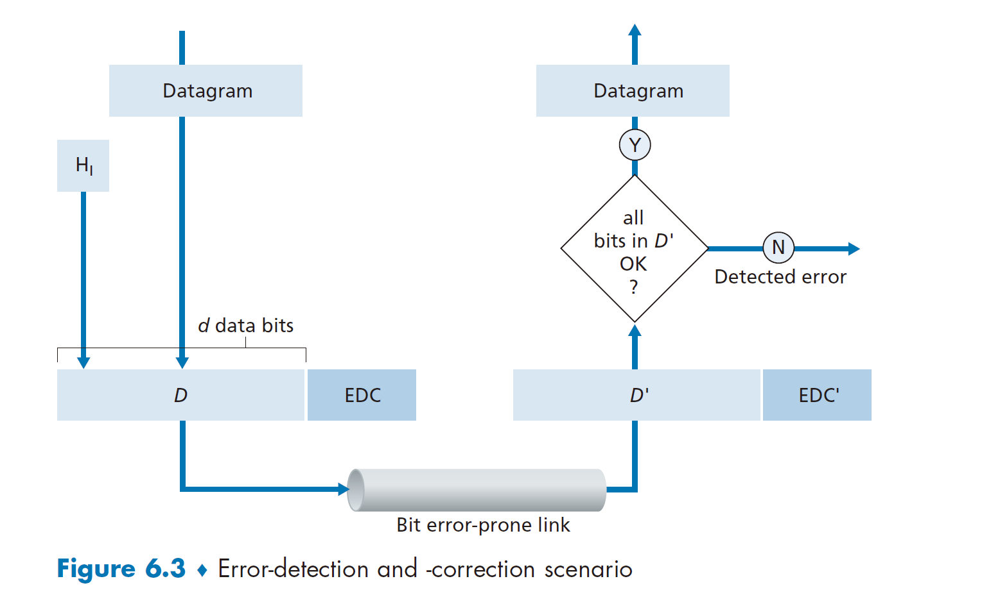
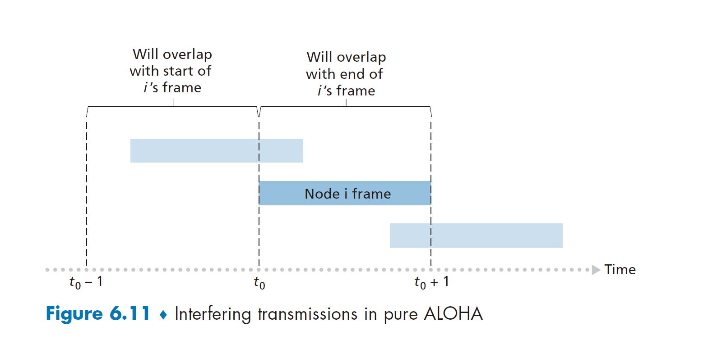
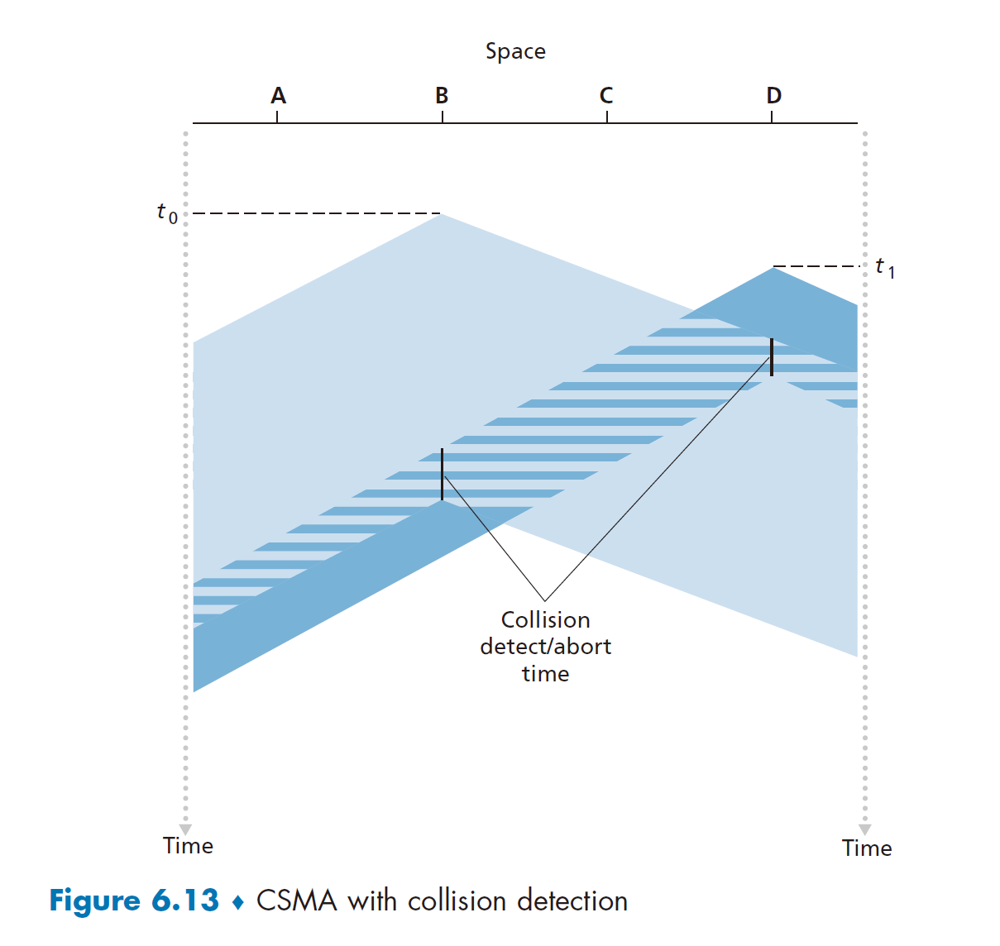

**目录：**

- [6. 链路层和局域网](#6-链路层和局域网)
  - [6.1. 链路层介绍](#61-链路层介绍)
    - [6.1.1. 链路层提供的服务](#611-链路层提供的服务)
    - [6.1.2. 链路层实现位置](#612-链路层实现位置)
  - [6.2. 差错检测和修正技术](#62-差错检测和修正技术)
    - [6.2.1. 奇偶校验](#621-奇偶校验)
    - [6.2.2. 检验和方法](#622-检验和方法)
    - [6.2.3. 循环冗余检测](#623-循环冗余检测)
  - [6.3. 多路访问链路和协议](#63-多路访问链路和协议)
    - [6.3.1. 信道划分协议](#631-信道划分协议)
    - [6.3.2. 随机接入协议](#632-随机接入协议)
    - [6.3.3. 轮流协议](#633-轮流协议)
    - [6.3.4. DOCSIS：用于电缆因特网接入的链路层协议](#634-docsis用于电缆因特网接入的链路层协议)

**time : 2021-06-29**

# 6. 链路层和局域网

在前 2 章我们学习了网络层提供了主机到主机的通信服务。数据报从源主机开始，穿过一系列的通信链路（有线的和无线的）和分组交换机（交换机和路由器），最终到达目的主机。随着我们的学习顺着协议栈往下，我们自然想搞清楚组成主机到主机路径上的单一链路上，分组是怎么传递的。数据报怎么封装为链路层中的分组：帧？不同媒体的链路会使用不同的协议吗？广播链路上的传输冲突是怎么解决的？链路层上是否有编址呢，如果有，链路层编址怎么和网络层编址协作？交换机和路由器的区别准确来讲，到底是什么？在本章，我们将会回答这些问题。

在讨论链路层之前，我们先来介绍在链路层中，有 2 种不同的信道。一种是广播信道，广播信道连接多个主机，广播信道存在于无线局域网(WLAN)，卫星网络，以及混合光纤同轴(HFC)接入网。在广播信道中，由于多个主机使用单一的信道传输帧，那么就需要一种所谓的媒体访问协议来协同这些主机。有些情况，一个中心控制器用来协作传输，在另一些情况，主机自身来协作传输。第二种信道为点到点信道，这种信道存在于两台长距离连接的路由器或者主机和以太网交换机连接。点到点信道的协作比较简单，配套网站上有关于 **点到点协议(Point-to-Point, PPP)** 的详细讨论，这种协议被使用在拨号连接服务和高速点到点光纤链路。

在本章，我们将会探索许多链路层概念和技术。我们将会详细研究错误检测和修正。我们我们会学习多访问网络和交换机网络包括以太网，以太网是目前最流行的有线局域网技术。我们会了解到虚拟局域网和数据中心网络。在下一章，我们再学习无线局域网。

## 6.1. 链路层介绍

让我们以一些重要的术语开始。我们把在链路层运行的设备称为 **节点(node)**。节点涉及主机，路由器，交换机，和 WiFi 接入点（将在第 7 章讨论）。我们也把连接相邻节点的通信信道称为 **链路(links)**。一个数据报要从源主机传输到目的主机，要经历一系列的 **单一链路**。举个例子，考虑图 6-1 中的网络，一个使用无线接入的主机要发送数据报到一个服务器。这个数据报实际上经历了 6 个单一链路：WiFi 接入点和主机之间的无线链路，无线接入点和交换机之间的以太网链路，交换机和路由器之间的链路，两个路由器之间的链路，路由器和交换机之间的以太网链路，最终，交换机和服务器之间的以太网链路。在一个给定的链路上，一个传输节点将数据报封装为 **链路层帧** 并将该帧传输进链路中。


为了透彻理解链路层以及它是如何与网络层关联的，我们考虑一个交通运输的类比例子。假如一个旅行社计划为游客开辟从美国新泽西州的普林斯顿到瑞士洛桑的旅游路线。假定该旅行社认为对于游客而言最为便利的方案是：从普林斯顿乘豪华大轿车到 JFK 机场，然后乘飞机从 JFK 机场去日内瓦机场，最后乘火车从日内瓦机场到洛桑火车站。一旦 该旅行社作了这 3 项预定，普林斯顿豪华大轿车公司将负责将游客从普林斯顿带到 JFK, 航空公司将负责将游客从 JFK 带到日内瓦，瑞士火车服务将负责将游客从日内瓦带到洛桑。该旅程中 3 段中的每一段都在两个“相邻”地点之间是“直达的”。注意到这 3 段运输是由不同的公司管理，使用了完全不同的运输方式（豪华大轿车、飞机和火车）。尽管运输方式不同，但它们都提供了将旅客从一个地点运输到相邻地点的基本服务。在这个运输类比中，一个游客好比一个数据报，每个运输区段好比一条链路，每种运输方式好比一种链路层协议，而该旅行社好比一个路由选择协议。

### 6.1.1. 链路层提供的服务

尽管任一链路层的基本服务都是将数据报通过单一通信链路从一个节点移动到相邻节点，但所提供的服务细节能够随着链路层协议的不同而变化。链路层协议能够提供的可能服务包括:

- **成帧(framing)**。在每个网络层数据报经链路传送之前，几乎所有的链路层协议都要将其用链路层帧封装起来。一个帧由一个数据字段和若干首部字段组成，其中网络层数据报就插在数据字段中。帧的结构由链路层协议规定。当我们在本章的后半部分研究具体的链路层协议时，将看到几种不同的帧格式。
- **链路接入**。**媒体访问控制(Medium Access Control, MAC)** 协议规定了帧在链路上传输的规则。对于在链路的一端仅有一个发送方、链路的另一端仅有一个接收方的点对点链路，MAC 协议比较简单（或者不存在），即无论何吋链路空闲，发送方都能够发送帧。更有趣的情况是当多个节点共享单个广播链路时，即所谓多路访问问题。这里，MAC 协议用于协调多个节点的帧传输。
- **可靠交付**。当链路层协议提供可靠交付服务时，它保证无差错地经链路层移动每个网络层数据报。前面讲过，某些运输层协议（例如 TCP）也提供可靠交付服务。与运输层可靠交付服务类似，链路层的可靠交付服务通常是通过确认和重传取得的（参见 3-4 节）。链路层可靠交付服务通常用于易于产生高差错率的链路，例如无线 链路，其目的是本地（也就是在差错发生的链路上）纠正一个差错，而不是通过运 输层或应用层协议迫使进行端到端的数据重传。然而，对于低比特差错的链路，包括光纤、同轴电缆和许多双绞铜线链路,链路层可靠交付可能会被认为是一种不必要的开销。由于这个原因，许多有线的链路层协议不提供可靠交付服务。
- **差错检测和修正**。当帧中的一个比特作为 1 传输时，接收方节点中的链路层硬件可能不正确地将其判断为 0，反之亦然。这种比特差错是由信号衰减和电磁噪声导致的。因为没有必要转发一个有差错的数据报，所以许多链路层协议提供一种机制来检测这样的比特差错。通过让发送节点在帧中包括差错检测比特，让接收节点进行差错检查，以此来完成这项工作。第 3 章和第 4 章讲过，因特网的运输层和网络层也提供了有限形式的差错检测，即因特网检验和。链路层的差错检测通 常更复杂，并且用硬件实现。差错修正类似于差错检测，区别在于接收方不仅能检测帧中出现的比特差错，而且能够准确地确定帧中的差错出现的位置（并因此修正这些差错）。

### 6.1.2. 链路层实现位置

在深入学习链路层的细节之前，本概述的最后一节考虑一下在何处实现链路层的问 题。我们将关注一个端系统，因为我们在第 4 章中知道链路层是实现在路由器的线路卡中的。主机的链路层是用硬件还是用软件实现的呢？它是实现在一块单独的卡上还是一个芯片上？它是怎样与主机的硬件和操作系统组件的其他部分接口的呢？

图 6-2 显示了一个典型的主机体系结构“链路层的主体部分是在 **网络适配器(network adapter)** 中实现的，网络适配器有时也称为 **网络接口卡(Network Interface Card, NIC)**。位于网络适配器核心的是链路层控制器，该控制器通常是一个实现了许多链路层服务（成帧、链路接入、差错检测等）的专用芯片。因此，链路层控制器的许多功能是用硬件实现的。例如，Intel 的 700 系列设配器［Intel 2020］实现了以太网协议，我们将在 6-5 节中学习该协议；Atheros AR5006 ［Atheros 2020］适配器实现 802.11 WiFi 协议，我们将在第 7 章学习该协议。

在发送端，控制器取得了由协议栈较高层生成并存储在主机内存中的数据报，在链路层帧中封装该数据报（填写该帧的各个字段），然后遵循链路接入协议将该帧传进通信链路中。在接收端，控制器接收了整个帧，抽取出网络层数据报。如果链路层执行差错检测，则需要发送控制器在该帧的首部设置差错检测比特，由接收控制器执行差错检测。


图 6-2 显示了与主机总线（例如一条 PCI 或 PCI-X 总线）连接的网络适配器，这里它看起来非常像与其他主机组件连接的任何其他 I/O 设备。图 6-2 还显示了尽管大部分链路层是在硬件中实现的，但部分链路层是在运行于主机 CPU 上的软件中实现的。链路层的软件组件实现了高层链路层功能，如组装链路层寻址信息和激活控制器硬件。在接收端，链路层软件响应控制器中断（例如，由于一个或多个帧的到达），处理差错条件和将数据报向上传递给网络层。所以，链路层是硬件和软件的结合体，即此处是协议栈中软件与硬件交接的地方。［Intel 2020］从软件编程的角度提供了有关 XL 710 控制器的可读性很强的概述（以及详细的描述）。

## 6.2. 差错检测和修正技术

在上一节中，我们提到了 **比特级差错检测和修正(bit-level error detection and correction)**，即对从一个节点发送到另一个物理上连接的邻近节点的链路层帧中的比特损伤进行检测和修正，它们通常是链路层提供的两种服务。我们在第 3 章中看到差错检测和修正服务通常也由运输层提供。在本节中，我们将研究几种最简单的技术，它们能够用于检测比特差错，而且在某些情况下，能够修正这样的比特差错。对该主题理论和实现的全面描述是许多教科书的主题（例如［Schwartz 1980］或［Bertsekas 1991］），而我们这里仅讨论必要内容。我们此时的目的是对差错检测和纠正技术提供的能力有一种直观的认识，并看看一些简单技术在链路层中的工作原理及其如何实际应用。

图 6-3 图示说明了我们研究的环境。在发送节点，为了保护比特免受差错，使用 **差错检测和修正比特(Error- Detection and-Correction, EDC)** 来增强数据 D。通常，要保护的数据不仅包括从网络层传递下来需要通过链路传输的数据报，而且包括链路帧首部中的链路级的寻址信息、序号和其他字段。链路级帧中的 D 和 EDC 都被发送到接收节点。在接收节点，接收到比特序列 D'和 EDC'。注意到因传输中的比特翻转所致，D'和 EDC'可能与初始的 D 和 EDC 不同。



接收方的挑战是在它只收到 D'和 EDC'的情况下，确定 D'是否和初始的 D 相同。在图 6-3 中的接收方判定的准确措辞（我们问是否检测到一个差错，而非是否出现了差错！） 是重要的。差错检测和纠正技术使接收方有时但并总是检测出已经出现的比特差错。即使采用差错检测比特，也还是可能有 ；**未检出比特差错(undetected bit error)**，这就是说，接收方可能无法知道接收的信息中包含着比特差错。因此，接收方可能向网路层交付一个损伤的数据报，或者不知道该帧首部的某个其他字段的内容已经损伤。我们因此要选择一个差错检测方案，使得这种事件发生的概率很小。一般而言，差错检测和纠错技术越复杂（即那些具有未检测出比特差错概率较小的技术），导致的开销就越大，这就是意味着需要更多的计算量及更多的差错检测和纠错比特。

我们现在来研究在传输数据中检测差错的 3 种技术：奇偶校验（它用来描述差错检测和修正背后隐含的基本思想）、检验和方法（它通常更多地应用于运输层）和循环冗余检测（它通常更多地应用在适配器中的链路层）。

### 6.2.1. 奇偶校验

也许差错检测最简单的方式就是用单个 **奇偶校验位(parity bit)**。假设在图 6-4 中要发送的信息 D 有 d 比特。在偶校验方案中，发送方只需包含一个附加的比特，选择它的值，使得这 d + 1 比特（初始信息加上一个校验比特）中 1 的总数是偶数。对于奇校验方案，选择校验比特值使得有奇数个。图 6-4 描述了一个偶校验的方案，单个校验比特被存放在一个单独的字段中。


采用单个奇偶校验位方式，接收方的操作也很简单。接收方只需要数一数接收的 d + 1 比特中 1 的数目即可。如果在采用偶校验方案中发现了奇数个值为 1 的比特，接收方知道至少出现了一个比特差错。更精确的说法是，出现了奇数个比特差错。

但是如果出现了偶数个比特差错，那会发生什么现象呢？你应该认识到这将导致一个未检出的差错。如果比特差错的概率小，而且比特之间的差错可以被看作是独立发生的，在一个分组中多个比特同时出错的概率将是极小的。在这种情况下，单个奇偶校验位可能是足够的了。然而，测量已经表明了差错经常以“突发”方式聚集在一起，而不是独立地发生。在突发差错的情况下，使用单比特奇偶校验保护的一帧中未检测出差错的概率能够达到 50% [Spragins 1991]。显然，需要一个更健壮的差错检测方案（幸运的是实践中正在使用这样的方式！）。但是在研究实践中使用的差错检测方案之前，我们考虑对单比特奇偶校验的一种简单一般化方案，这将使我们深入地理解纠错技术。

图 6-5 显示了单比特奇偶校验方案的二维一般化方案。这里 D 中的 d 个比特被划分为：i 行 j 列。对每行和每列计算奇偶值。产生的 i+j+1 奇偶比特构成了链路层帧的差错检测比特。


现在假设在初始 d 比特信息中出现了 单个比特差错。使用这种 **二维奇偶校验(two-dimensional parity)** 方案，包含比特值改变的列和行的校验值都将会岀现差错。 因此接收方不仅可以检测到出现了单个比 特差错的事实，而且还可以利用存在奇偶 校验差错的列和行的索引来实际识别发生 差错的比特并纠正它！图 6-5 显示了一个例子，其中位于（2, 2）的值为 1 的比特损坏了，变成了 0，该差错就是一个在接收方可检测并可纠正的差错。尽管我们的讨论 是针对初始 d 比特信息的，但校验比特本 身的单个比特差错也是可检测和可纠正的。 二维奇偶校验也能够检测（但不能纠正！）一个分组中两个比特差错的任何组合。二维奇偶校验方案的其他特性将在本章后面的习题中进行探讨。

接收方检测和纠正差错的能力被称为 **前向纠错(Forward Error Correction, FEC)**。这些技术通常用于如音频 CD 这样的音频存储和回放设备中。在网络环境中，FEC 技术可以单独应用，或与链路层 ARQ 技术一起应用，ARQ 技术与我们在第 3 章研究的协议类似。 FEC 技术很有价值，因为它们可以减少所需的发送方重发的次数。也许更为重要的是，它 们允许在接收方立即纠正差错。FEC 避免了不得不等待的往返时延，而这些时延是发送方收 到 NAK 分组并向接收方重传分组所需要的，这对于实时网络应用[Rubenstein 1998]或者具有长传播时延的链路（如深空间链路）可能是一种非常重要的优点。研究差错控制协议中 FEC 的使用的资料包括 f Biersack 1992；Nonnenmacher 1998 ；Byers 1998 ；Shacham 1990]。

### 6.2.2. 检验和方法

在检验和技术中，图 6-4 中的 d 比特数据被作为一个 k 比特整数的序列处理。一个简单检验和方法就是将这丘比特整数加起来，并且用得到的和作为差错检测比特。**因特网检验和(Internet checksum)** 就基于这种方法，即数据的字节作为 16 比特的整数对待并求和。这个和的反码形成了携带在报文段首部的因特网检验和。如在 3-3 节讨论的那样，接收方通过对接收的数据（包括检验和）的和取反码，并且检测其结果是否为全 1 比特来检测检验和。如果这些比特中有任何比特是 0，就可以指示出差错。RFC 1071 详细地讨论因特网检验和算法和它的实现。在 TCP 和 UDP 协议中，对所有字段（包括首部和数据字段）都计算因特网检验和。在其他协议中，例如 XTP [Strayer 1992]，对首部计算一个检验和，对整个分组计算另一个检验和。

检验和方法需要相对小的分组开销。例如，TCP 和 UDP 中的检验和只用了 16 比特。 然而，与后面要讨论的常用于链路层的 CRC 相比，它们提供相对弱的差错保护。这时，一个很自然的问题是：为什么运输层使用检验和而链路层使用 CRC 呢？前面讲过运输层 通常是在主机中作为用户操作系统的一部分用软件实现的。因为运输层差错检测用软件实现，采用简单而快速如检验和这样的差错检测方案是重要的。在另一方面，链路层的差错 检测在适配器中用专用的硬件实现，它能够快速执行更复杂的 CRC 操作。Feldmeier： Feld- meier 1995]描述的快速软件实现技术不仅可用于加权检验和编码，而且可用于 CRC（见后面）和其他编码。

### 6.2.3. 循环冗余检测

现今的计算机网络中广泛应用的差错检测技术基于 **循环冗余检测(Cyclic Redundancy Check, CRC)** 编码。CRC 编码也称为 **多项式编码(polynomial code)**，因为该编码能够将要发送的比特串看作为系数是 0 和 1 一个多项式，对比特串的操作被解释为多项式算术。

CRC 编码操作如下。考虑 d 比特的数据 D，发送节点要将它发送给接收节点。发送方和接收方首先必须协商一个 r + 1 比特模式，称为 **生成多项式(generator)**，我们将其表示为 G。我们将要求 G 的最高有效位的比特（最左边）是 1。CRC 编码的关键思想如图 6-6 所示。对于一个给定的数据段 D,发送方要选择 r 个附加比特 R，并将它们附加到 D 上，使得得到的 d + r 比特模式（被解释为一个二进制数）用模 2 算术恰好能被 G 整除（即没有余数）。用 CRC 进行差错检测的过程因此很简单：接收方用 G 去除接收到的 d+r 比特。如果余数为非零，接收方知道出现了差错；否则认为数据正确而被接收。


所有 CRC 计算采用模 2 算术来做，在加法中不进位，在减法中不借位。这意味着加法和减法是相同的，而且这两种操作等价于操作数的按位异或（XOR）。因此，举例来说:

```
1011 XOR 0101 = 1110
1001 XOR 1101 = 0100
```

类似地，我们还会有:

```
1011 - 0101 = 1110
1001 - 1101 = 0100
```

除了所需的加法或减法操作没有进位或借位外，乘法和除法与在二进制算术中是相同的。如在通常的二进制算术中那样，乘以 2^k 就是以一种比特模式左移 k 个位置。这样，给定 D 和 R, D\*2^r XOR R 产生如图 6-6 所示的 d+r 比特模式。在下面的讨论中，我们将利用图 6-6 中这种 d+r 比特模式的代数特性。

现在我们回到发送方怎样计算 R 这个关键问题上来。前面讲过，我们要求出 R 使得对于 n 有: `D*2^r XOR R = n * G`。

也就是说，我们要选择 R 使得 G 能够除以 `2^r XOR R` 而没有余数。如果我们对上述等式的两边都用 R 异或(即用模 2 加，而没有进位)，我们得到 `D*2^r = n*G XOR R`。

这个等式告诉我们，如果我们用 G 来除 `D*2^r`，余数值刚好是 R。换句话说，我们可以这样计算 R：`R = (D*2^r) % G` (% 表示取余)。

图 6-7 举例说明了在 D = 101110, d=6, G = 1001 和 r=3 的情况下的计算过程。在这种情况下传输的 9 个比特是 101110011。你应该自行检查一下这些计算，并核对一下 D*2^r = 101011 * G XOR R 的确成立。


国际标准已经定义了 8、12、16 和 32 比特生成多项式 G。CRC-32 32 比特的标准被多种链路级 IEEE 协议采用，使用的一个生成多项式是：`G(CRC-32) = 100000100110000010001110110110111`。

每个 CRC 标准都能检测小于 r + 1 比特的突发差错。(这意味着所有连续的厂比特或者更少的差错都可以检测到。)此外，在适当的假设下，长度大于厂+ 1 比特的突发差错以概率 `1 - 0.5^r` 被检测到。每个 CRC 标准也都能检测任何奇数个比特差错。有关 CRC 检测实现的讨论可参见 [WiUiams 1993]。CRC 编码甚至更强的编码所依据的理论超出了本书的范围。教科书[Schwartz 1980]对这个主题提供了很好的介绍。

## 6.3. 多路访问链路和协议

在本章概述中，我们提到了有两种类型的网络链路：点对点链路和广播链路。**点对点链路(point-to-point link)** 由链路一端的单个发送方和链路另一端的单个接收方组成。许多链路层协议都是为点对点链路设计的，如 **点对点协议(point-to-point protocol, PPP)** 和 **高级数据链路控制(high-level data link control, HDLC)** 就是两种这样的协议，我们将在本章后面涉及它们。第二种类型的链路是 **广播链路(broadcast link)**，它能够让多个发送和接收节点都连接到相同的、单一的、共享的广播信道上。这里使用术语“广播”是因为 当任何一个节点传输一个帧时，信道广播该帧，每个其他节点都收到一个副本。以太网和无线局域网是广播链路层技术的例子。在本节，我们暂缓讨论特定的链路层协议，而先研究一个对链路层很重要的问题：如何协调多个发送和接收节点对一个共享广播信道的访问，这就是 **多路访问问题(multiple access problem)**。广播信道通常用于局域网中，局域网是一个地理上集中在一座建筑物中(或者在一个公司，或者在大学校园)的网络。因此我们还将在本节后面考察一下多路访问信道是如何在局域网中使用的。

我们都很熟悉广播的概念，因为自电视发明以来就使用了这种通信方式。但是传统的电视是一种一个方向的广播(即一个固定的节点向许多接收节点传输)，而计算机网络广播信道上的节点既能够发送也能够接收。也许对广播信道的一个更有人情味的类比是鸡尾酒会，在那里许多人聚集在一个大房间里(空气为提供广播的媒体)谈论和倾听。第二个切题的类比是许多读者都很熟悉的地方，即一间教室，在那里老师们和同学们同样共享相同的、单一的广播媒体。在这两种场景下，一个中心问题是确定谁以及在什么时候获得说话权力（也就是向信道传输）。作为人类，为了共享这种广播信道，我们已经演化得到了一个精心设计的协议集了:

```
“给每个人一个讲话的机会。”
“该你讲话时你才说话。”
“不要一个人独占整个谈话。”
“如果有问题请举手。”
“当有人讲话时不要打断。”
“当其他人讲话时不要睡觉。”
```

计算机网络有类似的协议，也就是所谓的 **多路访问协议(multiple access protocol)**，即节点通过这些协议来规范它们在共享的广播信道上的传输行为。如图 6-8 所示，在各种各样的网络环境下需要多路访问协议，包括有线和无线接入网，以及卫星网络。尽管从技术 上讲每个节点通过它的适配器访问广播信道，但在本节中我们将把节点作为发送和接收设备。在实践中，数以百计或者甚至数以千计个节点能够通过一个广播信道直接通信。


**time : 2021-07-01**

因为所有的节点都能够传输帧，所以多个节点可能会同时传输帧。当发生这种情况时，所有节点同时接到多个帧；这就是说，传输的帧在所有的接收方处 **碰撞(collide)**。通常，当碰撞发生时，没有一个接收节点能够有效地获得任何传输的帧；在某种意义下，碰撞帧的信号纠缠在一起。因此，涉及此次碰撞的所有帧都丢失了，在碰撞时间间隔中的广播信道被浪费了。显然，如果许多节点要频繁地传输帧，许多传输将导致碰撞，广播信道的大量带宽将被浪费掉。

当多个节点处于活跃状态时，为了确保广播信道执行有用的工作，以某种方式协调活 跃节点的传输是必要的。这种协调工作由多路访问协议负责。在过去的 40 年中，已经有上千篇文章和上百篇博士论文研究过多路访问协议；有关这部分工作前 20 年来的一个内容丰富的综述见［Rom 1990］。此外，由于新类型链路尤其是新的无线链路不断出现，在多路访问协议方面研究的活跃状况仍在继续。

这些年来，在大量的链路层技术中已经实现了几十种多路访问协议。尽管如此，我们能够将任何多路访问协议划分为 3 种类型之一：**信道划分协议(channel partitioning protocol)**，**随机接入协议(random access protocol)** 和 **轮流协议(taking-turns protocol)**。我们将 在后续的 3 个小节中讨论这几类多路访问协议。

在结束概述之前，我们给出下列条件。在理想情况下，对于速率为 R bps 的广播信道，多路访问协议应该具有以下所希望的特性：

- 当仅有一个节点发送数据时，该节点具有 R bps 的吞吐量；
- 当有 M 个节点发送数据时，每个节点吞吐量为 R/M bpso 这不必要求 M 个节点中 的每一个节点总是有 R/M 的瞬间速率，而是每个节点在一些适当定义的时间间隔内应该 有 R/M 的平均传输速率。
- 协议是分散的；这就是说不会因某主节点故障而使整个系统崩溃。
- 协议是简单的，使实现不昂贵。

### 6.3.1. 信道划分协议

时分多路复用（TDM）和频分多路复用（FDM）是两种能够用于在所有共享信道节点之间划分广播信道带宽的技术。举例来说，假设一个支持 N 个节点的信道且信道的传输速率为 Rbps。TDM 将时间划分为 **时间帧(time frame)**，并进一步划分每个时间帧为 N 个 **时隙(slot)**。（不应当把 TDM 时间帧与在发送和接收适配器之间交换的链路层数据单元相混淆，后者也被称为帧。为了减少混乱，在本小节中我们将链路层交换的数据单元称为分组。）然后把每个 时隙分配给 N 个节点中的一个。无论何时某个节点在有分组要发送的时候，它在循环的 TDM 帧中指派给它的时隙内传输分组比特。通常，选择的时隙长度应使一个时隙内能够传输单个分组。图 6-9 表示一个简单的 4 个节点的 TDM 例子。标有的所有时隙专用于一个特定的发送方-接收方对。图 6-9 一个 4 节点的 TDM 与 FDM 的例子再回到我们的鸡尾酒会类比中，一个采用 TDM 规则的鸡尾酒会将允许每个聚会客人在固定的时间段发言，然后再允许另一个聚会客人发言同样时长，以此类推。一旦每个人都有了说话机会，将不断重复着这种模式。


TDM 是有吸引力的，因为它消除了碰撞而且非常公平：每个节点在每个帧时间内得到了专用的传输速率砂 Nbps。然而它有两个主要缺陷。首先，节点被限制于 R/N bps 的平均速率，即使当它是唯一有分组要发送的节点时。其次，节点必须总是等待它在传输序列中的轮次，即我们再次看到，即使它是唯一一个有帧要发送的节点。想象一下某聚会客人是唯一一个有话要说的人的情形（并且想象一下这种十分罕见的情况，即酒会上所有的人都想听某一个人说话）。显然，一种多路访问协议用于这个特殊聚会时，TDM 是一种很糟的选择。

TDM 在时间上共享广播信道，而 FDM 将 R bps 信道划分为不同的频段（每个频段具有 R/N 带宽），并把每个频率分配给/V 个节点中的一个。因此 FDM 在单个较大的 R bps 信道中创建了 N 个较小的 R/N bps 信道。FDM 也有 TDM 同样的优点和缺点。它避 免了碰撞，在 N 个节点之间公平地划分了带宽。然而，FDM 也有 TDM 所具有的主要缺点，也就是限制一个节点只能使用 R/7V 的带宽，即使当它是唯一一个有分组要发送的节点时。

第三种信道划分协议是 **码分多址(Code Division Multiple Access, CDMA)**。TDM 和 FDM 分別为节点分配时隙和频率，而 CDMA 对每个节点分配一种不同的编码。然后每个节点用它唯一的编码来对它发送的数据进行编码。如果精心选择这些编码，CDMA 网络具有一种奇妙的特性，即不同的节点能够同时传输，并且它们各自相应的接收方仍能正确接收发送方编码的数据比特（假设接收方知道发送方的编码），而不在乎其他节点的干扰传输。CDMA 已经在军用系统中使用了一段时间（由于它的抗干扰特性），目前已经广泛地用于民用，尤其是蜂窝电话中。因为 CDMA 的使用与无线信道紧密相关，所以我们将把有关 CDMA 技术细节的讨论留到第 7 章。此时，我们知道 CDMA 编码类似于 TDM 中的时隙和 FDM 中的频率，能分配给多路访问信道的用户就可以了。

### 6.3.2. 随机接入协议

第二大类多访问协议是随机接入协议。在随机接入协议中，一个传输节点总是以信道的全部速率（即 R bps）进行发送。当有碰撞时，涉及碰撞的每个节点反复地重发它 的帧（也就是分组），到该帧无碰撞地通过为止。但是当一个节点经历一次碰撞时，它不必立刻重发该帧。相反，它在重发该帧之前等待一个随机时延。涉及碰撞的每个节点独立地选择随机时延。因为该随机时延是独立地选择的，所以下述现象是有可能的：这些节点之一所选择的时延充分小于其他碰撞节点的时延，并因此能够无碰撞地将它的帧在信道中发出。

文献中描述的随机接入协议即使没有上百种也有几十种［Rom 1990； Bertsekas 1991］。在本节中，我们将描述一些最常用的随机接入协议，即 ALOHA 协议［Abramson 1970 ； Abramson 1985 ； Abramson 2009］和载波侦听多路访问（CSMA）协议［Kleinrock 1975b］。以太网［Metcalfe 1976］是一种流行并广泛部署的 CSMA 协议。

1. **时隙 ALOHA**

我们以最简单的随机接入协议之：时隙 ALOHA 协议，开始我们对随机接入协议的学习。在对时隙 ALOHA 的描述中，我们做下列假设：

- 所有帧由 L 比特组成。
- 时间被划分成长度为 L/R 秒的时隙（这就是说，一个时隙等于传输一帧的时间）。
- 节点只在时隙起点开始传输帧。
- 节点是同步的，每个节点都知道时隙何时开始。
- 如果在一个时隙中有两个或者更多个帧碰撞，则所有节点在该时隙结束之前检测到该碰撞事件。

令 P 是一个概率，即一个在 0 和 1 之间的数。在每个节点中，时隙 ALOHA 的操作是简单的:

- 当节点有一个新帧要发送时，它等到下一个时隙开始并在该时隙传输整个帧。
- 如果没有碰撞，该节点成功地传输它的帧，从而不需要考虑重传该帧。（如果该节点有新帧，它能够为传输准备一个新帧。）
- 如果有碰撞，该节点在时隙结束之前检测到这次碰撞。该节点以概率 p 在后续的每个时隙中重传它的帧，直到该帧被无碰撞地传输出去。

我们说以概率 p 重传，是指某节点有效地投掷一个有偏倚的硬币；硬币正面事件对应着重传，而重传出现的概率为 p。硬币反面事件对应着跳过这个时隙，在下个时隙再掷硬币；这个事件以概率 (1-p) 出现。所有涉及碰撞的节点独立地投掷它们的硬币。

时隙 ALOHA 看起来有很多优点。与信道划分不同，当某节点是唯一活跃的节点时（一个节点如果有帧要发送就认为它是活跃的），时隙 ALOHA 允许该节点以全速 R 连续传输。时隙 ALOHA 也是高度分散的，因为每个节点检测碰撞并独立地决定什么时候重传。（然而，时隙 ALOHA 的确需要在节点中对时隙同步；我们很快将讨论 ALOHA 协议的一个不分时隙的版本以及 CSMA 协议，这两种协议都不需要这种同步。）时隙 ALOHA 也是一个极为简单的协议。

当只有一个活跃节点时，时隙 ALOHA 工作出色，但是当有多个活跃节点时效率又将如何呢？这里有两个可能要考虑的效率问题。首先，如在图 6-10 中所示，当有多个活跃节点时，一部分时隙将有碰撞，因此将被“浪费”掉了。第二个考虑是，时隙的另一部分将是空闲的，因为所有活跃节点由于概率传输策略会节制传输。唯一“未浪费的”时隙是那些刚好有一个节点传输的时隙。刚好有一个节点传输的时隙称为一个 **成功时隙(successful slot)**。时隙多路访问协议的 **效率(efficiency)** 定义为：当有大量的活跃节点且每个节点总有大量的帧要发送时，长期运行中成功时隙的份额。注意到如果不使用某种形式的访问控制，而且每个节点都在每次碰撞之后立即重传，这个效率将为零。时隙 ALOHA 显然增加了它的效率，使之大于零，但是效率增加了多少呢？


现在我们继续概要讨论时隙 ALOHA 最大效率的推导过程。为了保持该推导简单，我们对协议做了一点修改，假设每个节点试图在每个时隙以概率 p 传输一帧。（这就是说，我们假设每个节点总有帧要发送，而且节点对新帧和已经经历一次碰撞的帧都以概率 p 传输。）假设有 N 个节点。则一个给定时隙是成功时隙的概率为节点之一传输而余下的 N-1 个节点不传输的概率。一个给定节点传输的概率是 p；剩余节点不传输的概率是 `(1-p)^(N-1)`。因此，一个给定节点成功传送的概率是 `p(1-p)^(N-1)`。因为有 N 个节点，任意一个节点成功传送的概率是 `Np(1-p)^(N-1)`。

因此，当有 N 个活跃节点时，时隙 ALOHA 的效率是 `Np(1-p)^(N-1)`。为了获得 N 个活跃节点的最大效率，我们必须求出使这个表达式最大化的 p\*。而且对于大量活跃节点，为了获得最大效率，当 N 趋于无穷时，我们取 `Np(1-p)^(N-1)` 的极限。在完成这些计算之后，我们会发现这个协议的最大效率为 1/e = 0.37。这就是说，当有大量节点有很多帧要传输时，则（最多）仅有 37%的时隙做有用的工作。因此该信道有效传输速率不是 R bps,而仅为 0.37R bps！相似的分析还表明 37%的时隙是空闲的，26%的时隙有碰撞。试想一个蹩脚的网络管理员购买了一个 100Mbps 的时隙 ALOHA 系统，希望能够使用网络在大量的用户之间以总计速率如 80Mbps 来传输数据。尽管这个信道能够以信道的全速 100Mbps 传输一个给定的帧，但从长时间范围看，该信道的成功吞吐量将小于 37Mbps。

2. **ALOHA**

时隙 ALOHA 协议要求所有的节点同步它们的传输，以在每个时隙开始时开始传输。 第一个 ALOHA 协议［Abramson 1970］实际上是一个非时隙、完全分散的协议。在纯 ALOHA 中，当一帧首次到达（即一个网络层数据报在发送节点从网络层传递下来），节点 立刻将该帧完整地传输进广播信道。如果一个传输的帧与一个或多个传输经历了碰撞，这个节点将立即（在完全传输完它的碰撞帧之后）以概率 p 重传该帧。否则，该节点等待一个帧传输时间。在此等待之后，它则以概率 p 传输该帧，或者以概率 1-p 在另一个帧时间等待（保持空闲）。

为了确定纯 ALOHA 的最大效率，我们关注某个单独的节点。我们的假设与在时隙 ALOHA 分析中所做的相同，取帧传输时间为时间单元。在任何给定时间，某节点传输一个帧的概率是 p。假设该帧在时刻 t(0)开始传输。如图 6-11 中所示，为了使该帧能成功地传输，在时间间隔 [t(0)-1, t(0)] 中不能有其他节点开始传输。这种传输将与节点 i 的帧传输起始部分相重叠。所有其他节点在这个时间间隔不开始传输的概率是 `(1-p)^(N-1)`。类似地，当节点 i 在传输时，其他节点不能开始传输，因为这种传输将与节点 i 传输的后面部分相重叠。所有其他节点在这个时间间隔不开始传输的概率也是 `(1-p)^(N-1)` 。因此，一个 给定的节点成功传输一次的概率是 `p(1-p)^2(N-1)`。通过与时隙 ALOHA 情况一样来取极限，我们求得纯 ALOHA 协议的最大效率仅为 1/(2e)。这刚好是时隙 ALOHA 的一半。这就是完全分散的 ALOHA 协议所要付出的代价。



3. **载波侦听多路访问(CSMA)**

在时隙和纯 ALOHA 中，一个节点传输的决定独立于连接到这个广播信道上的其他节点的活动。特别是，一个节点不关心在它开始传输时是否有其他节点碰巧在传输，而且即使有另一个节点开始干扰它的传输也不会停止传输。在我们的鸡尾酒会类比中，ALOHA 协议非常像一个粗野的聚会客人，他喋喋不休地讲话而不顾是否其他人在说话。作为人类，我们有人类的协议，它要求我们不仅要更为礼貌，而且在谈话中要减少与他人“碰撞”的时间，从而增加我们谈话中交流的数据量。具体而言，有礼貌的人类谈话有两个重要的规则：

- 说话之前先听。如果其他人正在说话，等到他们说完话为止。在网络领域中，这被称为 **载波侦听(carrier sensing)**，即一个节点在传输前先听信道。如果来自另一 个节点的帧正向信道上发送，节点则等待直到检测到一小段时间没有传输，然后开始传输。
- 如果与其他人同时开始说话，停止说话。在网络领域中，这被称为 **碰撞检测(collision detection)**，即当一个传输节点在传输时一直在侦听此信道。如果它检测到另 一个节点正在传输干扰帧，它就停止传输，在重复“侦听-当空闲时传输”循环之前等待一段随机时间。

这两个规则包含在 **载波侦听多路访问(Carrier Sense Multiple Access, CSMA)** 和 **具有碰撞检测的 CSMA (CSMA with Collision Detection, CSMA/CD )** 协议族中 [Kleinrock1975b； Metcalfe 1976； Lam 1980； Rom 1990] 。人们已经提出了 CSMA 和 CSMA/CD 的许多变种。这里，我们将考虑一些 CSMA 和 CSMA/CD 最重要的和基本的特性

关于 CSMA 你可能要问的第一个问题是，如果所有的节点都进行载波侦听了，为什么 当初会发生碰撞？毕竟，某节点无论何时侦听到另一个节点在传输，它都会停止传输。对于这个问题的答案最好能够用时空图来说明［MoUel987］。图 6-12 显示了连接到一个线状广播总线的 4 个节点（A、B、C、D）的时空图。横轴表示每个节点在空间的位置；纵轴表示时间。

在时刻 t(0)，节点 B 侦听到信道是空闲的，因为当前没有其他节点在传输。因此节点 B 开始传输，沿着广播媒体在两个方向上传播它的比特。图 6-12 中 B 的比特随着时间的增加向下传播，这表明 B 的比特沿着广播媒体传播所实际需要的时间不是零（虽然以接近光的速度）。在时刻 t(1) (t(1)>t(0))，节点 D 有一个帧要发送。尽管节点 B 在时刻 t(1)正在传输，但 B 传输的比特还没有到达 D，因此 D 在 w 侦听到信道空闲。根据 CSMA 协议，从而 D 开始传输它的帧。一个短暂的时间之后，B 的传输开始在 D 干扰 D 的传输。从图 6-12 中可以看出，显然广播信道的端到端 **信道传播时延(channel propagation delay)**（信号从一个节点传播到另一个节点所花费的时间）在决定其性能方面起着关键的作用。该传播时延越长，载波侦听节点不能侦听到网络中另一个节点已经开始传输的机会就越大。


4. **具有碰撞检测的载波侦听多路访问(CSMA/CD)**

在图 6-12 中，节点没有进行碰撞检测；即使已经出现了碰撞，B 和 D 都将继续完整 地传输它们的帧。当某节点执行碰撞检测时，一旦它检测到碰撞将立即停止传输。图 6-13 表示了和图 6-12 相同的情况，只是这两个节点在检测到碰撞后很短的时间内都放弃了它们的传输。显然，在多路访问协议中加入碰撞检测，通过不传输一个无用的、（由来自另一个节点的帧干扰）损坏的帧，将有助于改善协议的性能。



在分析 CSMA/CD 协议之前，我们现在从与广播信道相连的适配器（在节点中）的角度总结它的运行：

(1) 适配器从网络层一条获得数据报，准备链路层帧，并将其放入帧适配器缓存中。
(2) 如果适配器侦听到信道空闲（即无信号能量从信道进入适配器），它开始传输帧。在另一方面，如果适配器侦听到信道正在忙，它将等待，直到侦听到没有信号能量时才开始传输帧。
(3) 在传输过程中，适配器监视来自其他使用该广播信道的适配器的信号能量的存在。
(4) 如果适配器传输整个帧而未检测到来自其他适配器的信号能量，该适配器就完成了该帧。在另一方面，如果适配器在传输时检测到来自其他适配器的信号能量，它中止传输（即它停止了传输帧）。
(5) 中止传输后，适配器等待一个随机时间量，然后返回步骤 2。

等待一个随机（而不是固定）的时间量的需求是明确的——如果两个节点同时传输帧，然后这两个节点等待相同固定的时间量，它们将持续碰撞下去。但选择随机回退时间 的时间间隔多大为好呢？如果时间间隔大而碰撞节点数量小，在重复“侦听-当空闲时传输”的步骤前，节点很可能等待较长的时间（使信道保持空闲）。在另一方面，如果时间间隔小而碰撞节点数量大，很可能选择的随机值将几乎相同，传输节点将再次碰撞。我们希望时间间隔应该这样：当碰撞节点数量较少时，时间间隔较短；当碰撞节点数量较大时，时间间隔较长。

用于以太网以及 DOCSIS 电缆网络多路访问协议［DOCSIS 2011］中的 **二进制指数后退(binary exponential backoff)** 算法，简练地解决了这个问题。特别是，当传输一个给定帧时，在该帧经历了一连串的 n 次碰撞后，节点随机地从｛0, 1, 2,...,2^n - 1｝中选择一个 K 值。因此，一个帧经历的碰撞越多，K 选择的间隔越大。对于以太网，一个节点等待的实际时间量是 K\*512 比特时间（即发送 512 比特进入以太网所需时间量的 K 倍），能够取的最大值在 10 以内。

我们看一个例子。假设一个适配器首次尝试传输一个帧，并在传输中它检测到碰撞。然后该节点以概率 0.5 选择 K=0，以概率 0.5 选择 K = 1。如果该节点选择 K=0，则它立即开始侦听信道。如果这个适配器选择 K = 1，它在开始“侦听-当空闲时传输”。周期前等待 512 比特时间（例如对于 100 Mbps 以太网来说为 5.12 ms）。在第 2 次碰撞之后，从 { 0, 1, 2, 3}中等概率地选择 K。在第 3 次碰撞之后，从 {0, 1, 2, 3, 4, 5, 6, 7}中等概率地选择 K。在 10 次或更多次碰撞之后，从｛0, 1, 2, ..., 1023}中等概率地选择 K。因此从中选择 K 的集合长度随着碰撞次数呈指数增长；正是由于这个原因，该算法被称为二进制指数后退。

这里我们还要注意到，每次适配器准备传输一个新的帧时，它要运行 CSMA/CD 算法。不考虑近期过去的时间内可能已经发生的任何碰撞。因此，当几个其他适配器处于指数后退状态时，有可能一个具有新帧的节点能够立刻插入一次成功的传输。

5. **CSMA/CD 效率**

当只有一个节点有一个帧发送时，该节点能够以信道全速率进行传输（例如 10Mbps，100Mbps 或者 1 Gbps）。然而，如果很多节点都有帧要发送，信道的有效传输速率可能会小得多。我们将 **CSMA/CD 效率(efficiency of CSMA/CD)** 定义为：当有大量的活跃节点，且每个节点有大量的帧要发送时，帧在信道中无碰撞地传输的那部分时间在长期运行时间中所占的份额。为了给出效率的一个闭式的近似表示，令 d(prop)表示信号能量在任意两个适配器之间传播所需的最大时间。令 d(trans)表示传输一个最大长度的以太网帧的时间（对于 10Mbps 的以太网，该时间近似为 1.2 毫秒）。CSMA/CD 效率的推导超岀了本书的范围（见［Lam 1980］和［Bertsekas 1991 ］）。这里我们只是列出下面的近似式：

`效率 = 1/(1 + 5d(prop)/d(trans))`

从这个公式我们看到，当 d(prop)接近 0 时，效率接近 1。这和我们的直觉相符，如果传播时延是 0，碰撞的节点将立即中止而不会浪费信道。同时，当 d(trans)变得很大时，效率也接近于 1。这也和直觉相符，因为当一个帧取得了信道时，它将占有信道很长时间；因此信道在大多数时间都会有效地工作。

### 6.3.3. 轮流协议

前面讲过多路访问协议的两个理想特性是：1. 当只有一个节点活跃吋，该活跃节点具有 R bps 的吞吐量；2. 当有 M 个节点活跃时，每个活跃节点的吞吐量接近 R/M bps。ALOHA 和 CSMA 协议具备第一个特性，但不具备第二个特性。这激发研究人员创造另一类协议，也就是 **轮流协议(taking-turns protocol)**。和随机接入协议一样，有几十种轮流协议，其中每一个协议又都有很多变种。这里我们要讨论两种比较重要的协议。第一种是 **轮询协议(polling protocol)**。轮询协议要求这些节点之一要被指定为主节点。主节点以循环的方式 **轮询(poll)** 每个节点。特别是，主节点首先向节点 1 发送一个报文，告诉它（节点 1）能够传输的帧的最多数量。在节点 1 传输了某些帧后，主节点告诉节点 2 它（节点 2）能够传输的帧的最多数量。（主节点能够通过观察在信道上是否缺乏信号，来决定一个节点何时完成了帧的发送。）上述过程以这种方式继续进行，主节点以循环的方式轮询了每个节点。

轮询协议消除了困扰随机接入协议的碰撞和空时隙，这使得轮询取得高得多的效率。但是它也有一些缺点。第一个缺点是该协议引入了轮询时延，即通知一个节点“它可以传 输”所需的时间。例如，如果只有一个节点是活跃的，那么这个节点将以小于 R bps 的速率传输，因为每次活跃节点发送了它最多数量的帧时，主节点必须依次轮询每一个非活跃的节点。第二个缺点可能更为严重，就是如果主节点有故障，整个信道都变得不可操作。 我们在本节学习的 802.15 协议和蓝牙协议就是轮询协议的例子。

第二种轮流协议是 **令牌传递协议(token-passing protocol)**。在这种协议中没有主节点。 一个称为 **令牌(token)** 的小的特殊帧在节点之间以某种固定的次序进行交换。例如，节点 1 可能总是把令牌发送给节点 2，节点 2 可能总是把令牌发送给节点 3，而节点 N 可能总是把令牌发送给节点 1。当一个节点收到令牌时，仅当它有一些帧要发送时，它才持有这个令牌；否则，它立即向下一个节点转发该令牌。当一个节点收到令牌时，如果它确实 有帧要传输，它发送最大数目的帧数，然后把令牌转发给下一个节点。令牌传递是分散的，并有很高的效率。但是它也有自己的一些问题。例如，一个节点的故障可能会使整个 信道崩溃。或者如果一个节点偶然忘记了释放令牌，则必须调用某些恢复步骤使令牌返回 到循环中来。经过多年，人们已经开发了许多令牌传递协议，包括光纤分布式数据接口(FDDI)协议［Jain 1994］和 IEEE 802.5 令牌环协议［IEEE 802.5 2012］，每一种都必须解决这些和其他一些棘手的问题。

### 6.3.4. DOCSIS：用于电缆因特网接入的链路层协议

在前面 3 小节中，我们已经学习了 3 大类多路访问协议：信道划分协议、随机接入协 议和轮流协议。这里的电缆接入网将作为一种很好的学习案例，因为在电缆接入网中我们 将看到这三类多路访问协议中的每一种！

