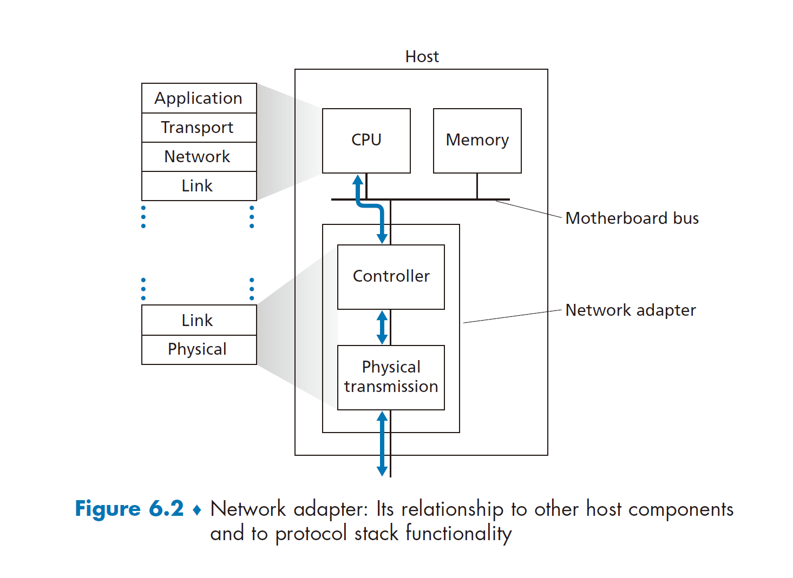
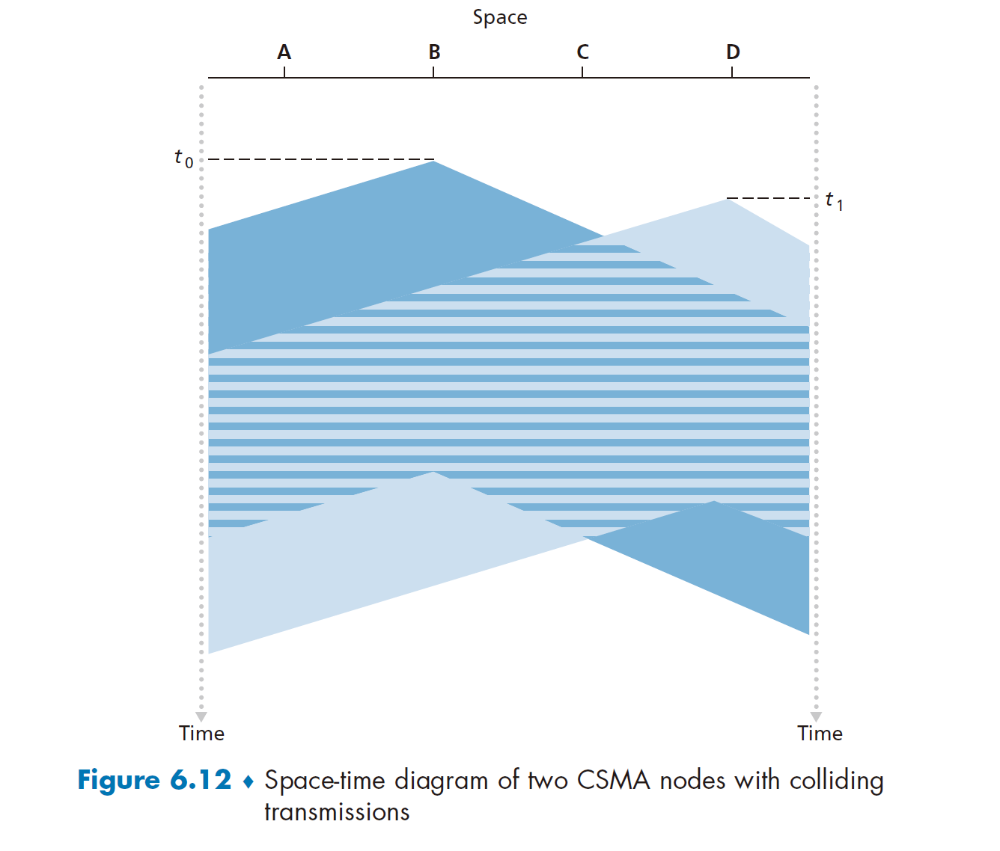
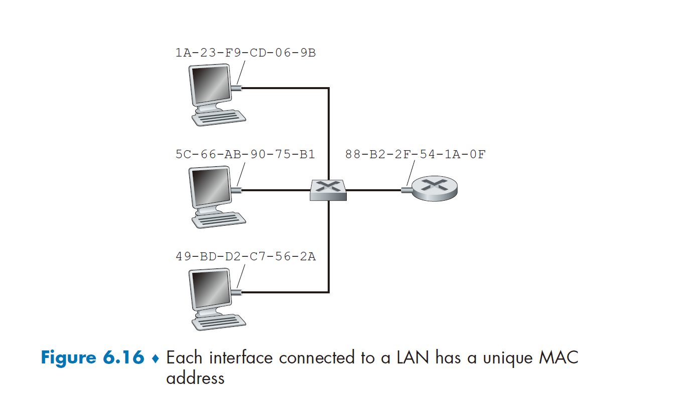
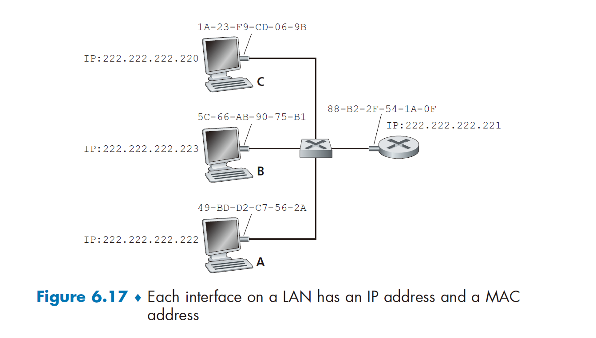
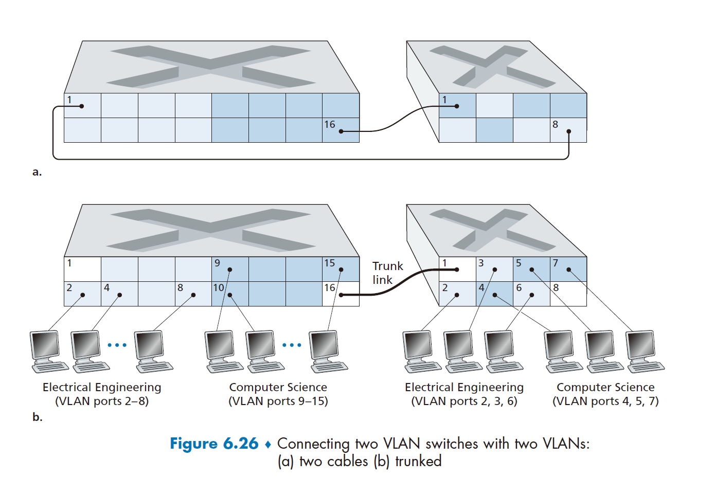
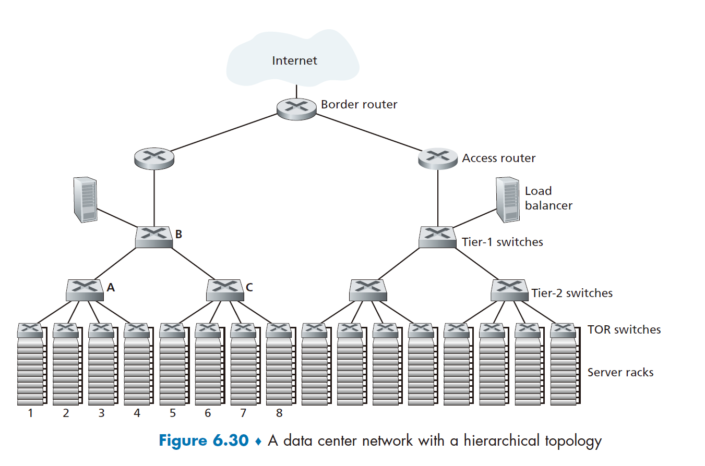
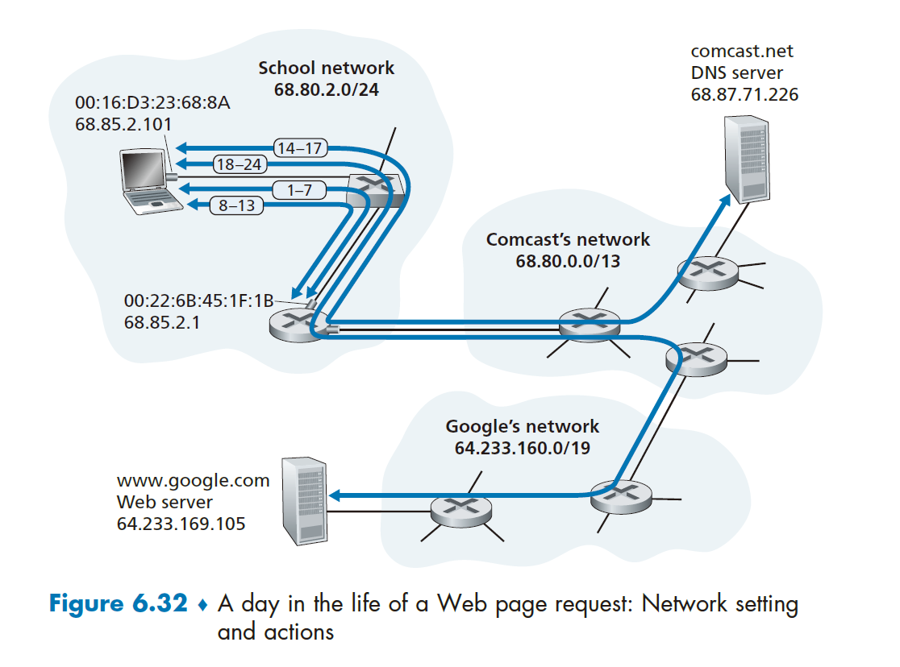
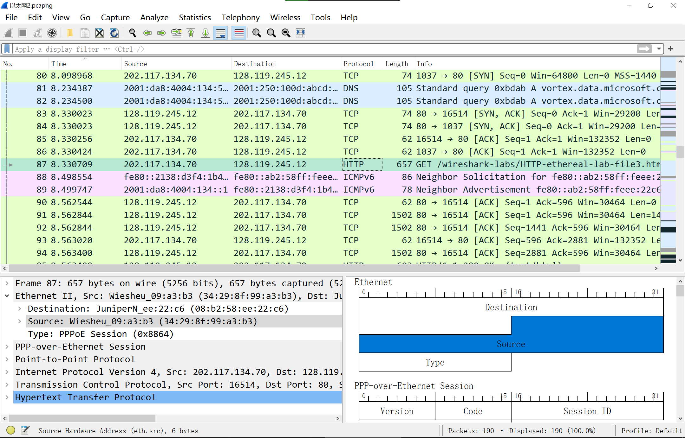

**目录：**

- [6. 链路层和局域网](#6-链路层和局域网)
  - [6.1. 链路层介绍](#61-链路层介绍)
    - [6.1.1. 链路层提供的服务](#611-链路层提供的服务)
    - [6.1.2. 链路层实现位置](#612-链路层实现位置)
  - [6.2. 差错检测和修正技术](#62-差错检测和修正技术)
    - [6.2.1. 奇偶校验](#621-奇偶校验)
    - [6.2.2. 检验和方法](#622-检验和方法)
    - [6.2.3. 循环冗余检测](#623-循环冗余检测)
  - [6.3. 多路访问链路和协议](#63-多路访问链路和协议)
    - [6.3.1. 信道划分协议](#631-信道划分协议)
    - [6.3.2. 随机接入协议](#632-随机接入协议)
    - [6.3.3. 轮流协议](#633-轮流协议)
    - [6.3.4. DOCSIS：用于电缆因特网接入的链路层协议](#634-docsis用于电缆因特网接入的链路层协议)
  - [6.4. 交换局域网](#64-交换局域网)
    - [6.4.1. 链路层寻址和 ARP](#641-链路层寻址和-arp)
    - [6.4.2. 以太网](#642-以太网)
    - [6.4.3. 链路层交换机](#643-链路层交换机)
    - [6.4.4. 虚拟局域网](#644-虚拟局域网)
  - [6.5. 链路虚拟化：网络作为链路层](#65-链路虚拟化网络作为链路层)
    - [6.5.1. 多协议标签交换(MPL)](#651-多协议标签交换mpl)
  - [6.6. 数据中心网络](#66-数据中心网络)
  - [6.7. 回顾：Web 页面请求的历程](#67-回顾web-页面请求的历程)
    - [6.7.1. 准备：DHCP. UDP、IP 和以太网](#671-准备dhcp-udpip-和以太网)
    - [6.7.2. 仍在准备：DNS 和 ARP](#672-仍在准备dns-和-arp)
    - [6.7.3. 仍在准备：域内路由选择到 DNS 服务器](#673-仍在准备域内路由选择到-dns-服务器)
    - [6.7.4. Web 客户-服务器交互:TCP 和 HTTP](#674-web-客户-服务器交互tcp-和-http)
  - [6.8. 实验 10：通过 wireshark 观察以太网协议和 ARP](#68-实验-10通过-wireshark-观察以太网协议和-arp)
    - [6.8.1. 以太网协议](#681-以太网协议)
    - [6.8.2. ARP](#682-arp)

**time : 2021-06-29**

# 6. 链路层和局域网

在前 2 章我们学习了网络层提供了主机到主机的通信服务。数据报从源主机开始，穿过一系列的通信链路（有线的和无线的）和分组交换机（交换机和路由器），最终到达目的主机。随着我们的学习顺着协议栈往下，我们自然想搞清楚组成主机到主机路径上的单一链路上，分组是怎么传递的。数据报怎么封装为链路层中的分组：帧？不同媒体的链路会使用不同的协议吗？广播链路上的传输冲突是怎么解决的？链路层上是否有编址呢，如果有，链路层编址怎么和网络层编址协作？交换机和路由器的区别准确来讲，到底是什么？在本章，我们将会回答这些问题。

在讨论链路层之前，我们先来介绍在链路层中，有 2 种不同的信道。一种是广播信道，广播信道连接多个主机，广播信道存在于无线局域网(WLAN)，卫星网络，以及混合光纤同轴(HFC)接入网。在广播信道中，由于多个主机使用单一的信道传输帧，那么就需要一种所谓的媒体访问协议来协同这些主机。有些情况，一个中心控制器用来协作传输，在另一些情况，主机自身来协作传输。第二种信道为点到点信道，这种信道存在于两台长距离连接的路由器或者主机和以太网交换机连接。点到点信道的协作比较简单，配套网站上有关于 **点到点协议(Point-to-Point, PPP)** 的详细讨论，这种协议被使用在拨号连接服务和高速点到点光纤链路。

在本章，我们将会探索许多链路层概念和技术。我们将会详细研究错误检测和修正。我们我们会学习多访问网络和交换机网络包括以太网，以太网是目前最流行的有线局域网技术。我们会了解到虚拟局域网和数据中心网络。在下一章，我们再学习无线局域网。

## 6.1. 链路层介绍

让我们以一些重要的术语开始。我们把在链路层运行的设备称为 **节点(node)**。节点涉及主机，路由器，交换机，和 WiFi 接入点（将在第 7 章讨论）。我们也把连接相邻节点的通信信道称为 **链路(links)**。一个数据报要从源主机传输到目的主机，要经历一系列的 **单一链路**。举个例子，考虑图 6-1 中的网络，一个使用无线接入的主机要发送数据报到一个服务器。这个数据报实际上经历了 6 个单一链路：WiFi 接入点和主机之间的无线链路，无线接入点和交换机之间的以太网链路，交换机和路由器之间的链路，两个路由器之间的链路，路由器和交换机之间的以太网链路，最终，交换机和服务器之间的以太网链路。在一个给定的链路上，一个传输节点将数据报封装为 **链路层帧** 并将该帧传输进链路中。


为了透彻理解链路层以及它是如何与网络层关联的，我们考虑一个交通运输的类比例子。假如一个旅行社计划为游客开辟从美国新泽西州的普林斯顿到瑞士洛桑的旅游路线。假定该旅行社认为对于游客而言最为便利的方案是：从普林斯顿乘豪华大轿车到 JFK 机场，然后乘飞机从 JFK 机场去日内瓦机场，最后乘火车从日内瓦机场到洛桑火车站。一旦 该旅行社作了这 3 项预定，普林斯顿豪华大轿车公司将负责将游客从普林斯顿带到 JFK, 航空公司将负责将游客从 JFK 带到日内瓦，瑞士火车服务将负责将游客从日内瓦带到洛桑。该旅程中 3 段中的每一段都在两个“相邻”地点之间是“直达的”。注意到这 3 段运输是由不同的公司管理，使用了完全不同的运输方式（豪华大轿车、飞机和火车）。尽管运输方式不同，但它们都提供了将旅客从一个地点运输到相邻地点的基本服务。在这个运输类比中，一个游客好比一个数据报，每个运输区段好比一条链路，每种运输方式好比一种链路层协议，而该旅行社好比一个路由选择协议。

### 6.1.1. 链路层提供的服务

尽管任一链路层的基本服务都是将数据报通过单一通信链路从一个节点移动到相邻节点，但所提供的服务细节能够随着链路层协议的不同而变化。链路层协议能够提供的可能服务包括:

- **成帧(framing)**。在每个网络层数据报经链路传送之前，几乎所有的链路层协议都要将其用链路层帧封装起来。一个帧由一个数据字段和若干首部字段组成，其中网络层数据报就插在数据字段中。帧的结构由链路层协议规定。当我们在本章的后半部分研究具体的链路层协议时，将看到几种不同的帧格式。
- **链路接入**。**媒体访问控制(Medium Access Control, MAC)** 协议规定了帧在链路上传输的规则。对于在链路的一端仅有一个发送方、链路的另一端仅有一个接收方的点对点链路，MAC 协议比较简单（或者不存在），即无论何吋链路空闲，发送方都能够发送帧。更有趣的情况是当多个节点共享单个广播链路时，即所谓多路访问问题。这里，MAC 协议用于协调多个节点的帧传输。
- **可靠交付**。当链路层协议提供可靠交付服务时，它保证无差错地经链路层移动每个网络层数据报。前面讲过，某些运输层协议（例如 TCP）也提供可靠交付服务。与运输层可靠交付服务类似，链路层的可靠交付服务通常是通过确认和重传取得的（参见 3-4 节）。链路层可靠交付服务通常用于易于产生高差错率的链路，例如无线 链路，其目的是本地（也就是在差错发生的链路上）纠正一个差错，而不是通过运 输层或应用层协议迫使进行端到端的数据重传。然而，对于低比特差错的链路，包括光纤、同轴电缆和许多双绞铜线链路,链路层可靠交付可能会被认为是一种不必要的开销。由于这个原因，许多有线的链路层协议不提供可靠交付服务。
- **差错检测和修正**。当帧中的一个比特作为 1 传输时，接收方节点中的链路层硬件可能不正确地将其判断为 0，反之亦然。这种比特差错是由信号衰减和电磁噪声导致的。因为没有必要转发一个有差错的数据报，所以许多链路层协议提供一种机制来检测这样的比特差错。通过让发送节点在帧中包括差错检测比特，让接收节点进行差错检查，以此来完成这项工作。第 3 章和第 4 章讲过，因特网的运输层和网络层也提供了有限形式的差错检测，即因特网检验和。链路层的差错检测通 常更复杂，并且用硬件实现。差错修正类似于差错检测，区别在于接收方不仅能检测帧中出现的比特差错，而且能够准确地确定帧中的差错出现的位置（并因此修正这些差错）。

### 6.1.2. 链路层实现位置

在深入学习链路层的细节之前，本概述的最后一节考虑一下在何处实现链路层的问 题。我们将关注一个端系统，因为我们在第 4 章中知道链路层是实现在路由器的线路卡中的。主机的链路层是用硬件还是用软件实现的呢？它是实现在一块单独的卡上还是一个芯片上？它是怎样与主机的硬件和操作系统组件的其他部分接口的呢？

图 6-2 显示了一个典型的主机体系结构“链路层的主体部分是在 **网络适配器(network adapter)** 中实现的，网络适配器有时也称为 **网络接口卡(Network Interface Card, NIC)**。位于网络适配器核心的是链路层控制器，该控制器通常是一个实现了许多链路层服务（成帧、链路接入、差错检测等）的专用芯片。因此，链路层控制器的许多功能是用硬件实现的。例如，Intel 的 700 系列设配器［Intel 2020］实现了以太网协议，我们将在 6-5 节中学习该协议；Atheros AR5006 ［Atheros 2020］适配器实现 802.11 WiFi 协议，我们将在第 7 章学习该协议。

在发送端，控制器取得了由协议栈较高层生成并存储在主机内存中的数据报，在链路层帧中封装该数据报（填写该帧的各个字段），然后遵循链路接入协议将该帧传进通信链路中。在接收端，控制器接收了整个帧，抽取出网络层数据报。如果链路层执行差错检测，则需要发送控制器在该帧的首部设置差错检测比特，由接收控制器执行差错检测。



图 6-2 显示了与主机总线（例如一条 PCI 或 PCI-X 总线）连接的网络适配器，这里它看起来非常像与其他主机组件连接的任何其他 I/O 设备。图 6-2 还显示了尽管大部分链路层是在硬件中实现的，但部分链路层是在运行于主机 CPU 上的软件中实现的。链路层的软件组件实现了高层链路层功能，如组装链路层寻址信息和激活控制器硬件。在接收端，链路层软件响应控制器中断（例如，由于一个或多个帧的到达），处理差错条件和将数据报向上传递给网络层。所以，链路层是硬件和软件的结合体，即此处是协议栈中软件与硬件交接的地方。［Intel 2020］从软件编程的角度提供了有关 XL 710 控制器的可读性很强的概述（以及详细的描述）。

## 6.2. 差错检测和修正技术

在上一节中，我们提到了 **比特级差错检测和修正(bit-level error detection and correction)**，即对从一个节点发送到另一个物理上连接的邻近节点的链路层帧中的比特损伤进行检测和修正，它们通常是链路层提供的两种服务。我们在第 3 章中看到差错检测和修正服务通常也由运输层提供。在本节中，我们将研究几种最简单的技术，它们能够用于检测比特差错，而且在某些情况下，能够修正这样的比特差错。对该主题理论和实现的全面描述是许多教科书的主题（例如［Schwartz 1980］或［Bertsekas 1991］），而我们这里仅讨论必要内容。我们此时的目的是对差错检测和纠正技术提供的能力有一种直观的认识，并看看一些简单技术在链路层中的工作原理及其如何实际应用。

图 6-3 图示说明了我们研究的环境。在发送节点，为了保护比特免受差错，使用 **差错检测和修正比特(Error- Detection and-Correction, EDC)** 来增强数据 D。通常，要保护的数据不仅包括从网络层传递下来需要通过链路传输的数据报，而且包括链路帧首部中的链路级的寻址信息、序号和其他字段。链路级帧中的 D 和 EDC 都被发送到接收节点。在接收节点，接收到比特序列 D'和 EDC'。注意到因传输中的比特翻转所致，D'和 EDC'可能与初始的 D 和 EDC 不同。


接收方的挑战是在它只收到 D'和 EDC'的情况下，确定 D'是否和初始的 D 相同。在图 6-3 中的接收方判定的准确措辞（我们问是否检测到一个差错，而非是否出现了差错！） 是重要的。差错检测和纠正技术使接收方有时但并总是检测出已经出现的比特差错。即使采用差错检测比特，也还是可能有 ；**未检出比特差错(undetected bit error)**，这就是说，接收方可能无法知道接收的信息中包含着比特差错。因此，接收方可能向网路层交付一个损伤的数据报，或者不知道该帧首部的某个其他字段的内容已经损伤。我们因此要选择一个差错检测方案，使得这种事件发生的概率很小。一般而言，差错检测和纠错技术越复杂（即那些具有未检测出比特差错概率较小的技术），导致的开销就越大，这就是意味着需要更多的计算量及更多的差错检测和纠错比特。

我们现在来研究在传输数据中检测差错的 3 种技术：奇偶校验（它用来描述差错检测和修正背后隐含的基本思想）、检验和方法（它通常更多地应用于运输层）和循环冗余检测（它通常更多地应用在适配器中的链路层）。

### 6.2.1. 奇偶校验

也许差错检测最简单的方式就是用单个 **奇偶校验位(parity bit)**。假设在图 6-4 中要发送的信息 D 有 d 比特。在偶校验方案中，发送方只需包含一个附加的比特，选择它的值，使得这 d + 1 比特（初始信息加上一个校验比特）中 1 的总数是偶数。对于奇校验方案，选择校验比特值使得有奇数个。图 6-4 描述了一个偶校验的方案，单个校验比特被存放在一个单独的字段中。


采用单个奇偶校验位方式，接收方的操作也很简单。接收方只需要数一数接收的 d + 1 比特中 1 的数目即可。如果在采用偶校验方案中发现了奇数个值为 1 的比特，接收方知道至少出现了一个比特差错。更精确的说法是，出现了奇数个比特差错。

但是如果出现了偶数个比特差错，那会发生什么现象呢？你应该认识到这将导致一个未检出的差错。如果比特差错的概率小，而且比特之间的差错可以被看作是独立发生的，在一个分组中多个比特同时出错的概率将是极小的。在这种情况下，单个奇偶校验位可能是足够的了。然而，测量已经表明了差错经常以“突发”方式聚集在一起，而不是独立地发生。在突发差错的情况下，使用单比特奇偶校验保护的一帧中未检测出差错的概率能够达到 50% [Spragins 1991]。显然，需要一个更健壮的差错检测方案（幸运的是实践中正在使用这样的方式！）。但是在研究实践中使用的差错检测方案之前，我们考虑对单比特奇偶校验的一种简单一般化方案，这将使我们深入地理解纠错技术。

图 6-5 显示了单比特奇偶校验方案的二维一般化方案。这里 D 中的 d 个比特被划分为：i 行 j 列。对每行和每列计算奇偶值。产生的 i+j+1 奇偶比特构成了链路层帧的差错检测比特。


现在假设在初始 d 比特信息中出现了 单个比特差错。使用这种 **二维奇偶校验(two-dimensional parity)** 方案，包含比特值改变的列和行的校验值都将会岀现差错。 因此接收方不仅可以检测到出现了单个比 特差错的事实，而且还可以利用存在奇偶 校验差错的列和行的索引来实际识别发生 差错的比特并纠正它！图 6-5 显示了一个例子，其中位于（2, 2）的值为 1 的比特损坏了，变成了 0，该差错就是一个在接收方可检测并可纠正的差错。尽管我们的讨论 是针对初始 d 比特信息的，但校验比特本 身的单个比特差错也是可检测和可纠正的。 二维奇偶校验也能够检测（但不能纠正！）一个分组中两个比特差错的任何组合。二维奇偶校验方案的其他特性将在本章后面的习题中进行探讨。

接收方检测和纠正差错的能力被称为 **前向纠错(Forward Error Correction, FEC)**。这些技术通常用于如音频 CD 这样的音频存储和回放设备中。在网络环境中，FEC 技术可以单独应用，或与链路层 ARQ 技术一起应用，ARQ 技术与我们在第 3 章研究的协议类似。 FEC 技术很有价值，因为它们可以减少所需的发送方重发的次数。也许更为重要的是，它 们允许在接收方立即纠正差错。FEC 避免了不得不等待的往返时延，而这些时延是发送方收 到 NAK 分组并向接收方重传分组所需要的，这对于实时网络应用[Rubenstein 1998]或者具有长传播时延的链路（如深空间链路）可能是一种非常重要的优点。研究差错控制协议中 FEC 的使用的资料包括 f Biersack 1992；Nonnenmacher 1998 ；Byers 1998 ；Shacham 1990]。

### 6.2.2. 检验和方法

在检验和技术中，图 6-4 中的 d 比特数据被作为一个 k 比特整数的序列处理。一个简单检验和方法就是将这丘比特整数加起来，并且用得到的和作为差错检测比特。**因特网检验和(Internet checksum)** 就基于这种方法，即数据的字节作为 16 比特的整数对待并求和。这个和的反码形成了携带在报文段首部的因特网检验和。如在 3-3 节讨论的那样，接收方通过对接收的数据（包括检验和）的和取反码，并且检测其结果是否为全 1 比特来检测检验和。如果这些比特中有任何比特是 0，就可以指示出差错。RFC 1071 详细地讨论因特网检验和算法和它的实现。在 TCP 和 UDP 协议中，对所有字段（包括首部和数据字段）都计算因特网检验和。在其他协议中，例如 XTP [Strayer 1992]，对首部计算一个检验和，对整个分组计算另一个检验和。

检验和方法需要相对小的分组开销。例如，TCP 和 UDP 中的检验和只用了 16 比特。 然而，与后面要讨论的常用于链路层的 CRC 相比，它们提供相对弱的差错保护。这时，一个很自然的问题是：为什么运输层使用检验和而链路层使用 CRC 呢？前面讲过运输层 通常是在主机中作为用户操作系统的一部分用软件实现的。因为运输层差错检测用软件实现，采用简单而快速如检验和这样的差错检测方案是重要的。在另一方面，链路层的差错 检测在适配器中用专用的硬件实现，它能够快速执行更复杂的 CRC 操作。Feldmeier： Feld- meier 1995]描述的快速软件实现技术不仅可用于加权检验和编码，而且可用于 CRC（见后面）和其他编码。

### 6.2.3. 循环冗余检测

现今的计算机网络中广泛应用的差错检测技术基于 **循环冗余检测(Cyclic Redundancy Check, CRC)** 编码。CRC 编码也称为 **多项式编码(polynomial code)**，因为该编码能够将要发送的比特串看作为系数是 0 和 1 一个多项式，对比特串的操作被解释为多项式算术。

CRC 编码操作如下。考虑 d 比特的数据 D，发送节点要将它发送给接收节点。发送方和接收方首先必须协商一个 r + 1 比特模式，称为 **生成多项式(generator)**，我们将其表示为 G。我们将要求 G 的最高有效位的比特（最左边）是 1。CRC 编码的关键思想如图 6-6 所示。对于一个给定的数据段 D,发送方要选择 r 个附加比特 R，并将它们附加到 D 上，使得得到的 d + r 比特模式（被解释为一个二进制数）用模 2 算术恰好能被 G 整除（即没有余数）。用 CRC 进行差错检测的过程因此很简单：接收方用 G 去除接收到的 d+r 比特。如果余数为非零，接收方知道出现了差错；否则认为数据正确而被接收。


所有 CRC 计算采用模 2 算术来做，在加法中不进位，在减法中不借位。这意味着加法和减法是相同的，而且这两种操作等价于操作数的按位异或（XOR）。因此，举例来说:

```
1011 XOR 0101 = 1110
1001 XOR 1101 = 0100
```

类似地，我们还会有:

```
1011 - 0101 = 1110
1001 - 1101 = 0100
```

除了所需的加法或减法操作没有进位或借位外，乘法和除法与在二进制算术中是相同的。如在通常的二进制算术中那样，乘以 $2^k$ 就是以一种比特模式左移 k 个位置。这样，给定 D 和 R, $D \cdot 2^r \, XOR \, R$ 产生如图 6-6 所示的 d+r 比特模式。在下面的讨论中，我们将利用图 6-6 中这种 d+r 比特模式的代数特性。

现在我们回到发送方怎样计算 R 这个关键问题上来。前面讲过，我们要求出 R 使得对于 n 有: 

$$D \cdot 2^r \, XOR \, R = {nG}$$

也就是说，我们要选择 R 使得 G 能够除以 $D \cdot 2^r \, XOR \, R$ 而没有余数。如果我们对上述等式的两边都用 R 异或(即用模 2 加，而没有进位)，我们得到

$$D \cdot 2^r = nG \, XOR \, R$$

这个等式告诉我们，如果我们用 G 来除 $D \cdot 2^r$，余数值刚好是 R。换句话说，我们可以这样计算 R：

$$R = {remainder}{{D \cdot 2^r} \over G}$$

图 6-7 举例说明了在 D = 101110, d = 6, G = 1001 和 r = 3 的情况下的计算过程。在这种情况下传输的 9 个比特是 101110011。你应该自行检查一下这些计算，并核对一下 $D \cdot 2^r = {101011 \cdot G \, XOR \,R}$ 的确成立。


国际标准已经定义了 8、12、16 和 32 比特生成多项式 G。CRC-32 32 比特的标准被多种链路级 IEEE 协议采用，使用的一个生成多项式是：

$$G_{CRC-32} = {100000100110000010001110110110111}$$

每个 CRC 标准都能检测小于 r+1 比特的突发差错。(这意味着所有连续的厂比特或者更少的差错都可以检测到。)此外，在适当的假设下，长度大于 r+1 比特的突发差错以概率 $1 - 0.5^r$ 被检测到。每个 CRC 标准也都能检测任何奇数个比特差错。有关 CRC 检测实现的讨论可参见 [WiUiams 1993]。CRC 编码甚至更强的编码所依据的理论超出了本书的范围。教科书[Schwartz 1980]对这个主题提供了很好的介绍。

## 6.3. 多路访问链路和协议

在本章概述中，我们提到了有两种类型的网络链路：点对点链路和广播链路。**点对点链路(point-to-point link)** 由链路一端的单个发送方和链路另一端的单个接收方组成。许多链路层协议都是为点对点链路设计的，如 **点对点协议(point-to-point protocol, PPP)** 和 **高级数据链路控制(high-level data link control, HDLC)** 就是两种这样的协议，我们将在本章后面涉及它们。第二种类型的链路是 **广播链路(broadcast link)**，它能够让多个发送和接收节点都连接到相同的、单一的、共享的广播信道上。这里使用术语“广播”是因为 当任何一个节点传输一个帧时，信道广播该帧，每个其他节点都收到一个副本。以太网和无线局域网是广播链路层技术的例子。在本节，我们暂缓讨论特定的链路层协议，而先研究一个对链路层很重要的问题：如何协调多个发送和接收节点对一个共享广播信道的访问，这就是 **多路访问问题(multiple access problem)**。广播信道通常用于局域网中，局域网是一个地理上集中在一座建筑物中(或者在一个公司，或者在大学校园)的网络。因此我们还将在本节后面考察一下多路访问信道是如何在局域网中使用的。

我们都很熟悉广播的概念，因为自电视发明以来就使用了这种通信方式。但是传统的电视是一种一个方向的广播(即一个固定的节点向许多接收节点传输)，而计算机网络广播信道上的节点既能够发送也能够接收。也许对广播信道的一个更有人情味的类比是鸡尾酒会，在那里许多人聚集在一个大房间里(空气为提供广播的媒体)谈论和倾听。第二个切题的类比是许多读者都很熟悉的地方，即一间教室，在那里老师们和同学们同样共享相同的、单一的广播媒体。在这两种场景下，一个中心问题是确定谁以及在什么时候获得说话权力（也就是向信道传输）。作为人类，为了共享这种广播信道，我们已经演化得到了一个精心设计的协议集了:

```
“给每个人一个讲话的机会。”
“该你讲话时你才说话。”
“不要一个人独占整个谈话。”
“如果有问题请举手。”
“当有人讲话时不要打断。”
“当其他人讲话时不要睡觉。”
```

计算机网络有类似的协议，也就是所谓的 **多路访问协议(multiple access protocol)**，即节点通过这些协议来规范它们在共享的广播信道上的传输行为。如图 6-8 所示，在各种各样的网络环境下需要多路访问协议，包括有线和无线接入网，以及卫星网络。尽管从技术 上讲每个节点通过它的适配器访问广播信道，但在本节中我们将把节点作为发送和接收设备。在实践中，数以百计或者甚至数以千计个节点能够通过一个广播信道直接通信。


**time : 2021-07-01**

因为所有的节点都能够传输帧，所以多个节点可能会同时传输帧。当发生这种情况时，所有节点同时接到多个帧；这就是说，传输的帧在所有的接收方处 **碰撞(collide)**。通常，当碰撞发生时，没有一个接收节点能够有效地获得任何传输的帧；在某种意义下，碰撞帧的信号纠缠在一起。因此，涉及此次碰撞的所有帧都丢失了，在碰撞时间间隔中的广播信道被浪费了。显然，如果许多节点要频繁地传输帧，许多传输将导致碰撞，广播信道的大量带宽将被浪费掉。

当多个节点处于活跃状态时，为了确保广播信道执行有用的工作，以某种方式协调活 跃节点的传输是必要的。这种协调工作由多路访问协议负责。在过去的 40 年中，已经有上千篇文章和上百篇博士论文研究过多路访问协议；有关这部分工作前 20 年来的一个内容丰富的综述见［Rom 1990］。此外，由于新类型链路尤其是新的无线链路不断出现，在多路访问协议方面研究的活跃状况仍在继续。

这些年来，在大量的链路层技术中已经实现了几十种多路访问协议。尽管如此，我们能够将任何多路访问协议划分为 3 种类型之一：**信道划分协议(channel partitioning protocol)**，**随机接入协议(random access protocol)** 和 **轮流协议(taking-turns protocol)**。我们将 在后续的 3 个小节中讨论这几类多路访问协议。

在结束概述之前，我们给出下列条件。在理想情况下，对于速率为 R bps 的广播信道，多路访问协议应该具有以下所希望的特性：

- 当仅有一个节点发送数据时，该节点具有 R bps 的吞吐量；
- 当有 M 个节点发送数据时，每个节点吞吐量为 R/M bpso 这不必要求 M 个节点中 的每一个节点总是有 R/M 的瞬间速率，而是每个节点在一些适当定义的时间间隔内应该 有 R/M 的平均传输速率。
- 协议是分散的；这就是说不会因某主节点故障而使整个系统崩溃。
- 协议是简单的，使实现不昂贵。

### 6.3.1. 信道划分协议

时分多路复用（TDM）和频分多路复用（FDM）是两种能够用于在所有共享信道节点之间划分广播信道带宽的技术。举例来说，假设一个支持 N 个节点的信道且信道的传输速率为 Rbps。TDM 将时间划分为 **时间帧(time frame)**，并进一步划分每个时间帧为 N 个 **时隙(slot)**。（不应当把 TDM 时间帧与在发送和接收适配器之间交换的链路层数据单元相混淆，后者也被称为帧。为了减少混乱，在本小节中我们将链路层交换的数据单元称为分组。）然后把每个 时隙分配给 N 个节点中的一个。无论何时某个节点在有分组要发送的时候，它在循环的 TDM 帧中指派给它的时隙内传输分组比特。通常，选择的时隙长度应使一个时隙内能够传输单个分组。图 6-9 表示一个简单的 4 个节点的 TDM 例子。标有的所有时隙专用于一个特定的发送方-接收方对。图 6-9 一个 4 节点的 TDM 与 FDM 的例子再回到我们的鸡尾酒会类比中，一个采用 TDM 规则的鸡尾酒会将允许每个聚会客人在固定的时间段发言，然后再允许另一个聚会客人发言同样时长，以此类推。一旦每个人都有了说话机会，将不断重复着这种模式。


TDM 是有吸引力的，因为它消除了碰撞而且非常公平：每个节点在每个帧时间内得到了专用的传输速率砂 Nbps。然而它有两个主要缺陷。首先，节点被限制于 R/N bps 的平均速率，即使当它是唯一有分组要发送的节点时。其次，节点必须总是等待它在传输序列中的轮次，即我们再次看到，即使它是唯一一个有帧要发送的节点。想象一下某聚会客人是唯一一个有话要说的人的情形（并且想象一下这种十分罕见的情况，即酒会上所有的人都想听某一个人说话）。显然，一种多路访问协议用于这个特殊聚会时，TDM 是一种很糟的选择。

TDM 在时间上共享广播信道，而 FDM 将 R bps 信道划分为不同的频段（每个频段具有 R/N 带宽），并把每个频率分配给/V 个节点中的一个。因此 FDM 在单个较大的 R bps 信道中创建了 N 个较小的 R/N bps 信道。FDM 也有 TDM 同样的优点和缺点。它避 免了碰撞，在 N 个节点之间公平地划分了带宽。然而，FDM 也有 TDM 所具有的主要缺点，也就是限制一个节点只能使用 R/7V 的带宽，即使当它是唯一一个有分组要发送的节点时。

第三种信道划分协议是 **码分多址(Code Division Multiple Access, CDMA)**。TDM 和 FDM 分別为节点分配时隙和频率，而 CDMA 对每个节点分配一种不同的编码。然后每个节点用它唯一的编码来对它发送的数据进行编码。如果精心选择这些编码，CDMA 网络具有一种奇妙的特性，即不同的节点能够同时传输，并且它们各自相应的接收方仍能正确接收发送方编码的数据比特（假设接收方知道发送方的编码），而不在乎其他节点的干扰传输。CDMA 已经在军用系统中使用了一段时间（由于它的抗干扰特性），目前已经广泛地用于民用，尤其是蜂窝电话中。因为 CDMA 的使用与无线信道紧密相关，所以我们将把有关 CDMA 技术细节的讨论留到第 7 章。此时，我们知道 CDMA 编码类似于 TDM 中的时隙和 FDM 中的频率，能分配给多路访问信道的用户就可以了。

### 6.3.2. 随机接入协议

第二大类多访问协议是随机接入协议。在随机接入协议中，一个传输节点总是以信道的全部速率（即 R bps）进行发送。当有碰撞时，涉及碰撞的每个节点反复地重发它 的帧（也就是分组），到该帧无碰撞地通过为止。但是当一个节点经历一次碰撞时，它不必立刻重发该帧。相反，它在重发该帧之前等待一个随机时延。涉及碰撞的每个节点独立地选择随机时延。因为该随机时延是独立地选择的，所以下述现象是有可能的：这些节点之一所选择的时延充分小于其他碰撞节点的时延，并因此能够无碰撞地将它的帧在信道中发出。

文献中描述的随机接入协议即使没有上百种也有几十种［Rom 1990； Bertsekas 1991］。在本节中，我们将描述一些最常用的随机接入协议，即 ALOHA 协议［Abramson 1970 ； Abramson 1985 ； Abramson 2009］和载波侦听多路访问（CSMA）协议［Kleinrock 1975b］。以太网［Metcalfe 1976］是一种流行并广泛部署的 CSMA 协议。

1. **时隙 ALOHA**

我们以最简单的随机接入协议之：时隙 ALOHA 协议，开始我们对随机接入协议的学习。在对时隙 ALOHA 的描述中，我们做下列假设：

- 所有帧由 L 比特组成。
- 时间被划分成长度为 L/R 秒的时隙（这就是说，一个时隙等于传输一帧的时间）。
- 节点只在时隙起点开始传输帧。
- 节点是同步的，每个节点都知道时隙何时开始。
- 如果在一个时隙中有两个或者更多个帧碰撞，则所有节点在该时隙结束之前检测到该碰撞事件。

令 P 是一个概率，即一个在 0 和 1 之间的数。在每个节点中，时隙 ALOHA 的操作是简单的:

- 当节点有一个新帧要发送时，它等到下一个时隙开始并在该时隙传输整个帧。
- 如果没有碰撞，该节点成功地传输它的帧，从而不需要考虑重传该帧。（如果该节点有新帧，它能够为传输准备一个新帧。）
- 如果有碰撞，该节点在时隙结束之前检测到这次碰撞。该节点以概率 p 在后续的每个时隙中重传它的帧，直到该帧被无碰撞地传输出去。

我们说以概率 p 重传，是指某节点有效地投掷一个有偏倚的硬币；硬币正面事件对应着重传，而重传出现的概率为 p。硬币反面事件对应着跳过这个时隙，在下个时隙再掷硬币；这个事件以概率 (1-p) 出现。所有涉及碰撞的节点独立地投掷它们的硬币。

时隙 ALOHA 看起来有很多优点。与信道划分不同，当某节点是唯一活跃的节点时（一个节点如果有帧要发送就认为它是活跃的），时隙 ALOHA 允许该节点以全速 R 连续传输。时隙 ALOHA 也是高度分散的，因为每个节点检测碰撞并独立地决定什么时候重传。（然而，时隙 ALOHA 的确需要在节点中对时隙同步；我们很快将讨论 ALOHA 协议的一个不分时隙的版本以及 CSMA 协议，这两种协议都不需要这种同步。）时隙 ALOHA 也是一个极为简单的协议。

当只有一个活跃节点时，时隙 ALOHA 工作出色，但是当有多个活跃节点时效率又将如何呢？这里有两个可能要考虑的效率问题。首先，如在图 6-10 中所示，当有多个活跃节点时，一部分时隙将有碰撞，因此将被“浪费”掉了。第二个考虑是，时隙的另一部分将是空闲的，因为所有活跃节点由于概率传输策略会节制传输。唯一“未浪费的”时隙是那些刚好有一个节点传输的时隙。刚好有一个节点传输的时隙称为一个 **成功时隙(successful slot)**。时隙多路访问协议的 **效率(efficiency)** 定义为：当有大量的活跃节点且每个节点总有大量的帧要发送时，长期运行中成功时隙的份额。注意到如果不使用某种形式的访问控制，而且每个节点都在每次碰撞之后立即重传，这个效率将为零。时隙 ALOHA 显然增加了它的效率，使之大于零，但是效率增加了多少呢？


现在我们继续概要讨论时隙 ALOHA 最大效率的推导过程。为了保持该推导简单，我们对协议做了一点修改，假设每个节点试图在每个时隙以概率 p 传输一帧。（这就是说，我们假设每个节点总有帧要发送，而且节点对新帧和已经经历一次碰撞的帧都以概率 p 传输。）假设有 N 个节点。则一个给定时隙是成功时隙的概率为节点之一传输而余下的 N-1 个节点不传输的概率。一个给定节点传输的概率是 p；剩余节点不传输的概率是 ${(1-p)}^{N-1}$。因此，一个给定节点成功传送的概率是 ${p{(1-p)}^{N-1}}$。因为有 N 个节点，任意一个节点成功传送的概率是 ${Np{(1-p)}^{N-1}}$。

因此，当有 N 个活跃节点时，时隙 ALOHA 的效率是 ${Np{(1-p)}^{N-1}}$。为了获得 N 个活跃节点的最大效率，我们必须求出使这个表达式最大化的 $p^*$。而且对于大量活跃节点，为了获得最大效率，当 N 趋于无穷时，我们取 ${Np^*{(1-p^*)}^{N-1}}$ 的极限。在完成这些计算之后，我们会发现这个协议的最大效率为 1/e = 0.37。这就是说，当有大量节点有很多帧要传输时，则（最多）仅有 37%的时隙做有用的工作。因此该信道有效传输速率不是 R bps,而仅为 0.37R bps！相似的分析还表明 37%的时隙是空闲的，26%的时隙有碰撞。试想一个蹩脚的网络管理员购买了一个 100Mbps 的时隙 ALOHA 系统，希望能够使用网络在大量的用户之间以总计速率如 80Mbps 来传输数据。尽管这个信道能够以信道的全速 100Mbps 传输一个给定的帧，但从长时间范围看，该信道的成功吞吐量将小于 37Mbps。

2. **ALOHA**

时隙 ALOHA 协议要求所有的节点同步它们的传输，以在每个时隙开始时开始传输。 第一个 ALOHA 协议［Abramson 1970］实际上是一个非时隙、完全分散的协议。在纯 ALOHA 中，当一帧首次到达（即一个网络层数据报在发送节点从网络层传递下来），节点 立刻将该帧完整地传输进广播信道。如果一个传输的帧与一个或多个传输经历了碰撞，这个节点将立即（在完全传输完它的碰撞帧之后）以概率 p 重传该帧。否则，该节点等待一个帧传输时间。在此等待之后，它则以概率 p 传输该帧，或者以概率 1-p 在另一个帧时间等待（保持空闲）。

为了确定纯 ALOHA 的最大效率，我们关注某个单独的节点。我们的假设与在时隙 ALOHA 分析中所做的相同，取帧传输时间为时间单元。在任何给定时间，某节点传输一个帧的概率是 p。假设该帧在时刻 t(0)开始传输。如图 6-11 中所示，为了使该帧能成功地传输，在时间间隔 [t(0)-1, t(0)] 中不能有其他节点开始传输。这种传输将与节点 i 的帧传输起始部分相重叠。所有其他节点在这个时间间隔不开始传输的概率是 `(1-p)^(N-1)`。类似地，当节点 i 在传输时，其他节点不能开始传输，因为这种传输将与节点 i 传输的后面部分相重叠。所有其他节点在这个时间间隔不开始传输的概率也是 `(1-p)^(N-1)` 。因此，一个 给定的节点成功传输一次的概率是 `p(1-p)^2(N-1)`。通过与时隙 ALOHA 情况一样来取极限，我们求得纯 ALOHA 协议的最大效率仅为 1/(2e)。这刚好是时隙 ALOHA 的一半。这就是完全分散的 ALOHA 协议所要付出的代价。


3. **载波侦听多路访问(CSMA)**

在时隙和纯 ALOHA 中，一个节点传输的决定独立于连接到这个广播信道上的其他节点的活动。特别是，一个节点不关心在它开始传输时是否有其他节点碰巧在传输，而且即使有另一个节点开始干扰它的传输也不会停止传输。在我们的鸡尾酒会类比中，ALOHA 协议非常像一个粗野的聚会客人，他喋喋不休地讲话而不顾是否其他人在说话。作为人类，我们有人类的协议，它要求我们不仅要更为礼貌，而且在谈话中要减少与他人“碰撞”的时间，从而增加我们谈话中交流的数据量。具体而言，有礼貌的人类谈话有两个重要的规则：

- 说话之前先听。如果其他人正在说话，等到他们说完话为止。在网络领域中，这被称为 **载波侦听(carrier sensing)**，即一个节点在传输前先听信道。如果来自另一 个节点的帧正向信道上发送，节点则等待直到检测到一小段时间没有传输，然后开始传输。
- 如果与其他人同时开始说话，停止说话。在网络领域中，这被称为 **碰撞检测(collision detection)**，即当一个传输节点在传输时一直在侦听此信道。如果它检测到另 一个节点正在传输干扰帧，它就停止传输，在重复“侦听-当空闲时传输”循环之前等待一段随机时间。

这两个规则包含在 **载波侦听多路访问(Carrier Sense Multiple Access, CSMA)** 和 **具有碰撞检测的 CSMA (CSMA with Collision Detection, CSMA/CD )** 协议族中 [Kleinrock1975b； Metcalfe 1976； Lam 1980； Rom 1990] 。人们已经提出了 CSMA 和 CSMA/CD 的许多变种。这里，我们将考虑一些 CSMA 和 CSMA/CD 最重要的和基本的特性

关于 CSMA 你可能要问的第一个问题是，如果所有的节点都进行载波侦听了，为什么 当初会发生碰撞？毕竟，某节点无论何时侦听到另一个节点在传输，它都会停止传输。对于这个问题的答案最好能够用时空图来说明［MoUel987］。图 6-12 显示了连接到一个线状广播总线的 4 个节点（A、B、C、D）的时空图。横轴表示每个节点在空间的位置；纵轴表示时间。

在时刻 t(0)，节点 B 侦听到信道是空闲的，因为当前没有其他节点在传输。因此节点 B 开始传输，沿着广播媒体在两个方向上传播它的比特。图 6-12 中 B 的比特随着时间的增加向下传播，这表明 B 的比特沿着广播媒体传播所实际需要的时间不是零（虽然以接近光的速度）。在时刻 t(1) (t(1)>t(0))，节点 D 有一个帧要发送。尽管节点 B 在时刻 t(1)正在传输，但 B 传输的比特还没有到达 D，因此 D 在 w 侦听到信道空闲。根据 CSMA 协议，从而 D 开始传输它的帧。一个短暂的时间之后，B 的传输开始在 D 干扰 D 的传输。从图 6-12 中可以看出，显然广播信道的端到端 **信道传播时延(channel propagation delay)**（信号从一个节点传播到另一个节点所花费的时间）在决定其性能方面起着关键的作用。该传播时延越长，载波侦听节点不能侦听到网络中另一个节点已经开始传输的机会就越大。



4. **具有碰撞检测的载波侦听多路访问(CSMA/CD)**

在图 6-12 中，节点没有进行碰撞检测；即使已经出现了碰撞，B 和 D 都将继续完整 地传输它们的帧。当某节点执行碰撞检测时，一旦它检测到碰撞将立即停止传输。图 6-13 表示了和图 6-12 相同的情况，只是这两个节点在检测到碰撞后很短的时间内都放弃了它们的传输。显然，在多路访问协议中加入碰撞检测，通过不传输一个无用的、（由来自另一个节点的帧干扰）损坏的帧，将有助于改善协议的性能。


在分析 CSMA/CD 协议之前，我们现在从与广播信道相连的适配器（在节点中）的角度总结它的运行：

(1) 适配器从网络层一条获得数据报，准备链路层帧，并将其放入帧适配器缓存中。
(2) 如果适配器侦听到信道空闲（即无信号能量从信道进入适配器），它开始传输帧。在另一方面，如果适配器侦听到信道正在忙，它将等待，直到侦听到没有信号能量时才开始传输帧。
(3) 在传输过程中，适配器监视来自其他使用该广播信道的适配器的信号能量的存在。
(4) 如果适配器传输整个帧而未检测到来自其他适配器的信号能量，该适配器就完成了该帧。在另一方面，如果适配器在传输时检测到来自其他适配器的信号能量，它中止传输（即它停止了传输帧）。
(5) 中止传输后，适配器等待一个随机时间量，然后返回步骤 2。

等待一个随机（而不是固定）的时间量的需求是明确的——如果两个节点同时传输帧，然后这两个节点等待相同固定的时间量，它们将持续碰撞下去。但选择随机回退时间 的时间间隔多大为好呢？如果时间间隔大而碰撞节点数量小，在重复“侦听-当空闲时传输”的步骤前，节点很可能等待较长的时间（使信道保持空闲）。在另一方面，如果时间间隔小而碰撞节点数量大，很可能选择的随机值将几乎相同，传输节点将再次碰撞。我们希望时间间隔应该这样：当碰撞节点数量较少时，时间间隔较短；当碰撞节点数量较大时，时间间隔较长。

用于以太网以及 DOCSIS 电缆网络多路访问协议［DOCSIS 2011］中的 **二进制指数后退(binary exponential backoff)** 算法，简练地解决了这个问题。特别是，当传输一个给定帧时，在该帧经历了一连串的 n 次碰撞后，节点随机地从 $\{0, 1, 2,...,2^{n - 1}\}$中选择一个 K 值。因此，一个帧经历的碰撞越多，K 选择的间隔越大。对于以太网，一个节点等待的实际时间量是 K512 比特时间（即发送 512 比特进入以太网所需时间量的 K 倍），能够取的最大值在 10 以内。

我们看一个例子。假设一个适配器首次尝试传输一个帧，并在传输中它检测到碰撞。然后该节点以概率 0.5 选择 K=0，以概率 0.5 选择 K = 1。如果该节点选择 K = 0，则它立即开始侦听信道。如果这个适配器选择 K = 1，它在开始“侦听-当空闲时传输”。周期前等待 512 比特时间（例如对于 100 Mbps 以太网来说为 5.12 ms）。在第 2 次碰撞之后，从 { 0, 1, 2, 3} 中等概率地选择 K。在第 3 次碰撞之后，从 {0, 1, 2, 3, 4, 5, 6, 7} 中等概率地选择 K。在 10 次或更多次碰撞之后，从｛0, 1, 2, ..., 1023} 中等概率地选择 K。因此从中选择 K 的集合长度随着碰撞次数呈指数增长；正是由于这个原因，该算法被称为二进制指数后退。

这里我们还要注意到，每次适配器准备传输一个新的帧时，它要运行 CSMA/CD 算法。不考虑近期过去的时间内可能已经发生的任何碰撞。因此，当几个其他适配器处于指数后退状态时，有可能一个具有新帧的节点能够立刻插入一次成功的传输。

1. **CSMA/CD 效率**

当只有一个节点有一个帧发送时，该节点能够以信道全速率进行传输（例如 10Mbps，100Mbps 或者 1 Gbps）。然而，如果很多节点都有帧要发送，信道的有效传输速率可能会小得多。我们将 **CSMA/CD 效率(efficiency of CSMA/CD)** 定义为：当有大量的活跃节点，且每个节点有大量的帧要发送时，帧在信道中无碰撞地传输的那部分时间在长期运行时间中所占的份额。为了给出效率的一个闭式的近似表示，令 $d_{prop}$ 表示信号能量在任意两个适配器之间传播所需的最大时间。令 $d_{trans}$ 表示传输一个最大长度的以太网帧的时间（对于 10Mbps 的以太网，该时间近似为 1.2 毫秒）。CSMA/CD 效率的推导超岀了本书的范围（见［Lam 1980］和［Bertsekas 1991 ］）。这里我们只是列出下面的近似式：

$$效率 = {1 \over {1 + 5d_{prop}/d_{trans}}}$$

从这个公式我们看到，当 $d_{prop}$ 接近 0 时，效率接近 1。这和我们的直觉相符，如果传播时延是 0，碰撞的节点将立即中止而不会浪费信道。同时，当$d_{trans}$ 变得很大时，效率也接近于 1。这也和直觉相符，因为当一个帧取得了信道时，它将占有信道很长时间；因此信道在大多数时间都会有效地工作。

### 6.3.3. 轮流协议

前面讲过多路访问协议的两个理想特性是：1. 当只有一个节点活跃吋，该活跃节点具有 R bps 的吞吐量；2. 当有 M 个节点活跃时，每个活跃节点的吞吐量接近 R/M bps。ALOHA 和 CSMA 协议具备第一个特性，但不具备第二个特性。这激发研究人员创造另一类协议，也就是 **轮流协议(taking-turns protocol)**。和随机接入协议一样，有几十种轮流协议，其中每一个协议又都有很多变种。这里我们要讨论两种比较重要的协议。第一种是 **轮询协议(polling protocol)**。轮询协议要求这些节点之一要被指定为主节点。主节点以循环的方式 **轮询(poll)** 每个节点。特别是，主节点首先向节点 1 发送一个报文，告诉它（节点 1）能够传输的帧的最多数量。在节点 1 传输了某些帧后，主节点告诉节点 2 它（节点 2）能够传输的帧的最多数量。（主节点能够通过观察在信道上是否缺乏信号，来决定一个节点何时完成了帧的发送。）上述过程以这种方式继续进行，主节点以循环的方式轮询了每个节点。

轮询协议消除了困扰随机接入协议的碰撞和空时隙，这使得轮询取得高得多的效率。但是它也有一些缺点。第一个缺点是该协议引入了轮询时延，即通知一个节点“它可以传 输”所需的时间。例如，如果只有一个节点是活跃的，那么这个节点将以小于 R bps 的速率传输，因为每次活跃节点发送了它最多数量的帧时，主节点必须依次轮询每一个非活跃的节点。第二个缺点可能更为严重，就是如果主节点有故障，整个信道都变得不可操作。 我们在本节学习的 802.15 协议和蓝牙协议就是轮询协议的例子。

第二种轮流协议是 **令牌传递协议(token-passing protocol)**。在这种协议中没有主节点。一个称为 **令牌(token)** 的小的特殊帧在节点之间以某种固定的次序进行交换。例如，节点 1 可能总是把令牌发送给节点 2，节点 2 可能总是把令牌发送给节点 3，而节点 N 可能总是把令牌发送给节点 1。当一个节点收到令牌时，仅当它有一些帧要发送时，它才持有这个令牌；否则，它立即向下一个节点转发该令牌。当一个节点收到令牌时，如果它确实 有帧要传输，它发送最大数目的帧数，然后把令牌转发给下一个节点。令牌传递是分散的，并有很高的效率。但是它也有自己的一些问题。例如，一个节点的故障可能会使整个信道崩溃。或者如果一个节点偶然忘记了释放令牌，则必须调用某些恢复步骤使令牌返回到循环中来。经过多年，人们已经开发了许多令牌传递协议，包括光纤分布式数据接口(FDDI)协议［Jain 1994］和 IEEE 802.5 令牌环协议［IEEE 802.5 2012］，每一种都必须解决这些和其他一些棘手的问题。

### 6.3.4. DOCSIS：用于电缆因特网接入的链路层协议

在前面 3 小节中，我们已经学习了 3 大类多路访问协议：信道划分协议、随机接入协议和轮流协议。这里的电缆接入网将作为一种很好的学习案例，因为在电缆接入网中我们将看到这三类多路访问协议中的每一种！

1-3-1 节讲过，一个电缆接入网通常在电缆网头端将几千个住宅电缆调制解调器与一个 **电缆调制解调器端接系统(Cable Modem Termination System, CMTS)** 连接。**数据经电缆服务接口(Data-Over-Cable Service Interface, CMTS)** 规范（DOCSIS） [DOCSIS 2011] 定义了电缆数据网络体系结构及其协议。DOCSIS 使用 FDM 将下行（CMTS 到调制解调器）和上行（调制解调器到 CMTS）网络段划分为多个频率信道。每个下行信道宽 6 MHz,每 个信道具有大约 40 Mbps 吞吐量（尽管这种数据率在实践中很少在电缆调制解调器中见 到）；每个上行信道具有 6.4 MHz 的最大信道带宽，并且最大的上行吞吐量约为 30 Mbps。每个上行和下行信道均为广播信道。CMTS 在下行信道中传输的帧被所有在信道上做接收 的电缆调制解调器接收到；然而因为仅有单一的 CMTS 在下行信道上传输，不存在多路访 问问题。但在上行方向，存在着多个有趣的技术挑战，因为多个电缆调制解调器共享到 CMTS 的相同上行信道（频率），因此能够潜在地出现碰撞。

如图 6-14 所示，每条上行信道被划分为时间间隔（类似于 TDM），每个时间间隔包含一个微时隙序列，电缆调制解调器可在该微时隙中向 CMTS 传输。CMTS 显式地准许各个 电缆调制解调器在特定的微时隙中进行传输。CMTS 在下行信道上通过发送称为 MAP 报文的控制报文，指定哪个电缆调制解调器（带有要发送的数据）能够在微时隙中传输由控制 报文指定的时间间隔。由于微时隙明确分配给电缆调制解调器，故 CMTS 能够确保在微时隙中没有碰撞传输。


但是 CMTS 一开始是如何知道哪个电缆调制解调器有数据要发送呢？通过让电缆调 制解调器在专用于此目的的一组特殊的微时隙间隔内向 CMTS 发送微时隙请求帧来完成该任务，如图 6-14 所示。这些微时隙请求帧以随机接入方式传输，故可能相互碰撞。 电缆调制解调器既不能侦听上行信道是否忙，也不能检测碰撞。相反，该电缆调制解调 器如果没有在下一个下行控制报文中收到对请求分配的响应的话，就推断出它的微时隙 请求帧经历了一次碰撞。当推断出一次碰撞，电缆调制解调器使用二进制指数回退将其 微时隙请求帧延缓到以后的时隙重新发送。当在上行信道上有很少的流量，电缆调制解调器可能在名义上分配给微时隙请求帧的时隙内实际传输数据帧（因此避免不得不等待微时隙分配）。

因此，电缆接入网可作为应用多路访问协议（即 FDM，TDM，随机接入和集中分配时隙都用于一个网络中）的一个极好例子。

**time : 2020-07-03**

## 6.4. 交换局域网

前面一节涉及了广播网络和多路访问协议，我们现在将注意力转向交换局域网。

图 6-15 显示了一个交换局域网连接了 3 个部门，两台服务器和一台与 4 台交换机连接的路由器。因为这些交换机运行在链路层，所以它们交换链路层帧（而不是网络层数据报），不识别网络层地址，不使用如 RIP 或 OSPF 这样的路由选择算法来确定通过第二层交换机网络的路径。我们马上就会看到，它们使用链路层地址而不是 IP 地址来转发链路层帧通过交换机网络。我们首先以讨论链路层寻址（6-4-1 节）来开始对交换机局域网的学习。然后仔细学习著名的以太网协议（6-4-2 节）。在仔细学习链路层寻址和以太网后，我们将考察链路层交换机的工作方式（6-4-3 节），并随后考察通常是如何用这些交换机构建大规模局域网的（6-4-4 节）。


### 6.4.1. 链路层寻址和 ARP

主机和路由器具有链路层地址。现在你也许会感到惊讶，第 4 章中不是讲过主机和路由器也具有网络层地址吗？你也许会问：为什么我们在网络层和链路层都需要地址呢？除 了描述链路层地址的语法和功能，在本节中我们希望明明白白地搞清楚两层地址都有用的原因，事实上这些地址是必不可少的。我们还将学习地址解析协议（ARP），该协议提供了将 IP 地址转换为链路层地址的机制。

1. **MAC 地址**

事实上，并不是主机或路由器具有链路层地址，而是它们的适配器（即网络接口）具有链路层地址。因此，具有多个网络接口的主机或路由器将具有与之相关联的多个链路层地址，就像它也具有与之相关联的多个 IP 地址一样。然而，重要的是注意到链路层交换机并不具有与它们的接口（这些接口是与主机和路由器相连的）相关联的链路层地址。这是因为链路层交换机的任务是在主机与路由器之间承载数据报；交换机透明地执行该项任务，这就是说，主机或路由器不必明确地将帧寻址到其间的交换机。图 6-16 中说明了这种情况。链路层地址有各种不同的称呼：LAN 地址（LAN address）、物理地址（physical address）或 MAC 地址（MAC address）。因为 MAC 地址似乎是最为流行的术语，所以我们此后就将链路层地址称为 MAC 地址。对于大多数局域网（包括以太网和 802.11 无线局域网）而言，MAC 地址长度为 6 字节，共有 2^48 个可能的 MAC 地址。如图 6-16 所示，这些 6 个字节地址通常用十六进制表示法，地址的每个字节被表示为一对十六进制数。尽管 MAC 地址被设计为永久的，但用软件改变一块适配器的 MAC 地址现在是可能的。然而，对于本节的后面部分而言，我们将假设某适配器的 MAC 地址是固定的。



MAC 地址的一个有趣性质是没有两块适配器具有相同的地址。考虑到适配器是由许多不同国家和地区的不同公司生产的，这看起来似乎是件神奇之事。中国台湾生产适配器的公司如何能够保证与比利时生产适配器的公司使用不同的地址呢？答案是 IEEE 在管理着该 MAC 地址空间。特别是，当一个公司要生产适配器时，它支付象征性的费用购买组成 2^24 个地址的一块地址空间。IEEE 分配这块个地址的方式是: 固定一个 MAC 地址的前 24 比特，让公司自己为每个适配器生成后 24 比特的唯一组合。

适配器的 MAC 地址具有扁平结构（这与层次图 6-16 与局域网相连的每个接口都 有一个唯一的 MAC 地址结构相反），而且不论适配器到哪里用都不会变化。带有以太网接口的便携机总具有同样的 MAC 地址，无论该计算机位于何方。具有 802.11 接口的一台智能手机总是具有相同的 MAC 地址，无论该智能手机到哪里。与之形成对照的是，前面说过的 IP 地址具有 层次结构（即一个网络部分和一个主机部分），而且当主机移动时，主机的 IP 地址需要 改变，即改变它所连接到的网络。适配器的 MAC 地址与人的身份证号相似，后者也具有扁平寻址结构，而且无论人到哪里该号码都不会变化。IP 地址则与一个人的邮政地址相似，它是有层次的，无论何时当人搬家时，该地址都必须改变。就像一个人可能发现邮政地址和身份证号都有用那样，一台主机具有一个网络层地址和一个 MAC 地址是有用的。

当某适配器要向某些目的适配器发送一个帧时，发送适配器将目的适配器的 MAC 地址插入到该帧中，并将该帧发送到局域网上。如我们马上要看到的那样，一台交换机偶尔将一个入帧广播到它的所有接口。我们将在第 7 章中看到 802.11 也广播帧。因此一块适配器可以接收一个并非向它寻址的帧。这样，当适配器接收到一个帧时，将检查该帧中的目的 MAC 地址是否与它自己的 MAC 地址匹配。如果匹配，该适配器提取出封装的数据 报，并将该数据报沿协议栈向上传递。如果不匹配，该适配器丢弃该帧，而不会向上传递该网络层数据报。所以，仅当收到该帧时，才会中断目的地。

然而，有时某发送适配器的确要让局域网上所有其他适配器来接收并处理它打算发送的帧。在这种情况下，发送适配器在该帧的目的地址字段中插入一个特殊的 **MAC 广播地址(broadcast address)**。对于使用 6 字节地址的局域网（例如以太网和 802.11）来说，广播地址是 48 个连续的 1 组成的字符串（即以十六进制表示法表示的 FF-FF-FF-FF-FF-FF)。

2. **地址解析协议(ARP)**

因为存在网络层地址（例如，因特网的 IP 地址）和链路层地址（即 MAC 地址），所以需要在它们之间进行转换。对于因特网而言，这是 **地址解析协议(Address Resolution Protocol, ARP)** [RFC 826]的任务。

为了理解对于诸如 ARP 这样协议的需求，考虑如图 6-17 所示的网络。在这个简单的例子中，每台主机和路由器有一个单一的 IP 地址和单一的 MAC 地址与以往一样，IP 地址以点分十进制表示法表示，MAC 地址以十六进制表示法表示。为了便于讨论，我们在本节中将假设交换机广播所有帧；这就是说，无论何时交换机在一个接口接收一个帧，它将在其所有其他接口上转发该帧。在下一节中，我们将更为准确地解释交换机操作的过程。



现在假设 1P 地址为 222.222.222.220 的主机要向主机 222.222.222.222 发送 IP 数据报。在本例中，源和目的均位于相同的子网中（在 4-3-3 节中的寻址意义下）。为了发送数据报，该源必须要向它的适配器不仅提供 IP 数据报，而且要提供目的主机 222.222.222.222 的 MAC 地址。然后发送适配器将构造一个包含目的地的 MAC 地址的链路层帧，并把该帧发送进局域网。

在本节中要处理的重要问题是，发送主机如何确定 IP 地址为 222.222.222.222 的目的 主机的 MAC 地址呢？正如你也许已经猜想的那样，它使用 ARP。在发送主机中的 ARP 模块将取在相同局域网上的任何 IP 地址作为输入，然后返回相应的 MAC 地址。在眼下的这个例子中，发送主机 222.222.222.220 向它的 ARP 模块提供了 IP 地址 222.222.222.222，并且其 ARP 模块返回了相应的 MAC 地址 49-BD-D2-C7-56-2A。

因此我们看到了 ARP 将一个 IP 地址解析为一个 MAC 地址。在很多方面它和 DNS （在 2-4 节中学习过）类似，DNS 将主机名解析为 IP 地址。然而，这两种解析器之间的一个重要区别是，DNS 为在因特网中任何地方的主机解析主机名，而 ARP 只为在同一个子 网上的主机和路由器接口解析 IP 地址。如果美国加利福尼亚州的一个节点试图用 ARP 为美国密西西比州的一个节点解析 IP 地址，ARP 将返回一个错误。

既然已经解释了 ARP 的用途，我们再来看看它是如何工作的。每台主机或路由器在其内存中具有一个 **ARP 表(ARP table)**，这张表包含 IP 地址到 MAC 地址的映射关系。下表显示了在主机 222.222.222.220 中可能看到的 ARP 表中的内容。该 ARP 表也包含一个寿命（TTL）值，它指示了从表中删除每个映射的时间。注意到这张表不必为该子网上的每台主机和路由器都包含一个表项；某些可能从来没有进入到该表中，某些可能已经过期。从一个表项放置到某 ARP 表中开始，一个表项通常的过期时间是 20 分钟。

| IP 地址         | MAC 地址          | TTL      |
| --------------- | ----------------- | -------- |
| 222.222.222.221 | 88-B2-2F-54-1A-0F | 13:45:00 |
| 222.222.222.223 | 5C-66-AB-90-75-B1 | 13:52:00 |

现在假设主机 222.222.222.220 要发送一个数据报，该数据报要 IP 寻址到本子网上另 一台主机或路由器。发送主机需要获得给定 IP 地址的目的主机的 MAC 地址。如果发送方的 ARP 表具有该目的节点的表项，这个任务是很容易完成的。但如果 ARP 表中当前没有该目的主机的表项，又该怎么办呢？特别是假设 222.222.222.220 要向 222.222.222.222 发送数据报。在这种情况下，发送方用 ARP 协议来解析这个地址。首先，发送方构造一个称为 **ARP 分组(ARP packet)** 的特殊分组。一个 ARP 分组有几个字段，包括发送和接收 IP 地址及 MAC 地址。ARP 查询分组和响应分组都具有相同的格式。ARP 查询分组的目的是询问子网上所有其他主机和路由器，以确定对应于要解析的 IP 地址的那个 MAC 地址。

回到我们的例子上来，222.222.222.220 向它的适配器传递一个 ARP 查询分组，并且指示适配器应该用 MAC 广播地址（即 FF-FF-FF-FF-FF-FF）来发送这个分组。适配器在链路层帧中封装这个 ARP 分组，用广播地址作为帧的目的地址，并将该帧传输进子网中。包含该 ARP 查询的帧能被子网上的所有其他适配器接收到，并且（由于广播地址）每个适配器都把在该帧中的 ARP 分组向上传递给 ARP 模块。这些 ARP 模块中的每个都检查它的 IP 地址是否与 ARP 分组中的目的 IP 地址相匹配。与之匹配的一个给査询主机发送回一个带有所希望映射的响应 ARP 分组。然后查询主机 222.222.222.220 能够更新它的 ARP 表，并发送它的 IP 数据报，该数据报封装在一个链路层帧中，并且该帧的目的 MAC 就是对先前 ARP 请求进行响应的主机或路由器的 MAC 地址。

关于 ARP 协议有两件有趣的事情需要注意。首先，查询 ARP 报文是在广播帧中发送的，而响应 ARP 报文在一个标准帧中发送。在继续阅读之前，你应该思考一下为什么这 样。其次，ARP 是即插即用的，这就是说，一个 ARP 表是自动建立的，即它不需要系统 管理员来配置。并且如果某主机与子网断开连接，它的表项最终会从留在子网中的节点的表中删除掉。

学生们常常想知道 ARP 是一个链路层协议还是一个网络层协议。如我们所看到的那 样，一个 ARP 分组封装在链路层帧中，因而在体系结构上位于链路层之上。然而，一个 ARP 分组具有包含链路层地址的字段，因而可认为是链路层协议，但它也包含网络层地址，因而也可认为是为网络层协议。所以，可能最好把 ARP 看成是跨越链路层和网络层边界两边的协议，即不完全符合我们在第 1 章中学习的简单的分层协议栈。现实世界协议就是这样复杂！

3. **发送数据报到子网以外**

但是现在我们来看更复杂的情况，即当子网中的某主机要向子网之外（也就是跨越路由器的另一个子网）的主机发送网络层数据报的情况。我们在图 6-19 的环境中来讨论这个问题，该图显示了一个由一台路由器互联两个子网所组成的简单网络。


有关图 6-19 需要注意几件有趣的事情。每台主机仅有一个 IP 地址和一个适配器。但是，如第 4 章所讨论，一台路由器对它的每个接口都有一个 IP 地址。对路由器的每个接口，（在路由器中）也有一个 ARP 模块和一个适配器。在图 6-19 中的路由器有两个接口，所以它有两个 IP 地址、两个 ARP 模块和两个适配器。当然，网络中的每个适配器都有自己的 MAC 地址。

还要注意到子网 1 的网络地址为 111.111.111/24，子网 2 的网络地址为 222.222.222/24。因此，与子网 1 相连的所有接口都有格式为 111.111.111.xxx 的地址，与子网 2 相连的所有接口都有格式为 222.222.222.xxx 的地址。

现在我们考察子网 1 上的一台主机将向子网 2 上的一台主机发送数据报。特别是，假设主机 111.111.111.111 要向主机 222.222.222.222 发送一个 IP 数据报。和往常一样，发送主机向它的适配器传递数据报。但是，发送主机还必须向它的适配器指示一个适当的目的 MAC 地址。该适配器应该使用什么 MAC 地址呢？有人也许大胆猜测，这个适当的 MAC 地址就是主机 222.222.222.222 的适配器地址，即 49-BD-D2-C7-56-2A。然而，这个猜测是错误的！如果发送适配器要用那个 MAC 地址，那么子网 1 上所有的适配器都不会费心将该 IP 数据报传递到它的网络层，因为该帧的目的地址与子网 1 上所有适配器的 MAC 地址都将不匹配。这个数据报将只有死亡，到达数据报天国。

如果我们仔细地观察图 6-19,我们发现为了使一个数据报从 111.111.111.111 到子网 2 上的主机，该数据报必须首先发送给路由器接口 111.111.111.110，它是通往最终目的地路径上的第一跳路由器的 IP 地址。因此，对于该帧来说，适当的 MAC 地址是路由器接口 111.111.111.110 的适配器地址，即 E6-E9-00-17-BB-4B。但发送主机怎样获得 111.111.111.110 的 MAC 地址呢？当然是通过使用 ARP! 一旦发送适配器有了这个 MAC 地址，它创建一个帧（包含了寻址到 222.222.222.222 的数据报），并把该帧发送到子网 1 中。在子网 1 上的路由器适配器看到该链路层帧是向它寻址的，因此把这个帧传递给路由器的网络层。万岁！该 IP 数据报终于被成功地从源主机移动到这台路由器了！但是我们的任务还没有结束。我们仍然要将该数据报从路由器移动到目的地。路由器现在必须决定该数据报要被转发的正确接口。如在第 4 章中所讨论的，这是通过查询路由器中的转发表来完成的。转发表告诉这台路由器该数据报要通过路由器接口 222.222.222.220 转发。然后该接口把这个数据报传递给它的适配器，适配器把该数据报封装到一个新的帧中，并且将帧发送进子网 2 中。这时，该帧的目的 MAC 地址确实是最终目的地 MAC 地址。路由器又是怎样获得这个目的地 MAC 地址的呢？当然是用 ARP 获得的！

用于以太网的 ARP 定义在 RFC 826 中。在 TCP/IP 指南 RFC 1180 中对 ARP 进行了很好的介绍。

### 6.4.2. 以太网

以太网几乎占领着现有的有线局域网市场。在 20 世纪 80 年代和 90 年代早期，以太网面临着来自其他局域网技术包括令牌环、FDDI 和 ATM 的挑战。多年来，这些其他技术中的一些成功地抓住了部分局域网市场份额。但是自从 20 世纪 70 年代中期发明以太网以 来，它就不断演化和发展，并保持了它的支配地位。今天，以太网是到目前为止最流行的有线局域网技术，而且到可能预见的将来它可能仍保持这一位置。可以这么说，以太网对本地区域联网的重要性就像因特网对全球联网所具有的地位那样。

以太网的成功有很多原因。首先，以太网是第一个广泛部署的高速局域网。因为它部署得早，网络管理员非常熟悉以太网（它的奇迹和它的奇思妙想），并当其他局域网技术 问世时，他们不愿意转而用之。其次，令牌环、FDDI 和 ATM 比以太网更加复杂、更加昂贵，这就进一步阻碍了网络管理员改用其他技术。第三，改用其他局域网技术（例如 FDDI 和 ATM）的最引人注目的原因通常是这些新技术具有更高数据速率；然而以太网总 是奋起抗争，产生了运行在相同或更高数据速率下的版本。20 世纪 90 年代初期引入了交换以太网，这就进一步增加了它的有效数据速率。最后，由于以太网已经很流行了，所以 以太网硬件（尤其是适配器和交换机）成了一个普通商品，而且极为便宜。

Bob Metcalfe 和 David Boggs 在 20 世纪 70 年代中期发明初始的以太局域网。初始的以 太局域网使用同轴电缆总线来互联节点。以太网的总线拓扑实际上从 20 世纪 80 年代到 90 年代中期一直保持不变。使用总线拓扑的以太网是一种广播局域网，即所有传输的帧传送 到与该总线连接的所有适配器并被其处理。回忆一下，我们在 6-3-2 节中讨论了以太网的 具有二进制指数回退的 CSMA/CD 多路访问协议。

到了 20 世纪 90 年代后期，大多数公司和大学使用一种基于集线器的星形拓扑以太网安装替代了它们的局域网。在这种安装中，主机（和路由器）直接用双绞对铜线与一台集线器相连。集线器（hub）是一种物理层设备，它作用于各个比特而不是作用于帧。当表示一个 0 或一个 1 的比特到达一个接口时，集线器只是重新生成这个比特，将其能量强度放大，并将该比特向其他所有接口传输出去。因此，采用基于集线器的星形拓扑的以太网 也是一个广播局域网，即无论何时集线器从它的一个接口接收到一个比特，它向其所有其他接口发送该比特的副本。特别是，如果某集线器同时从两个不同的接口接收到帧，将出现一次碰撞，生成该帧的节点必须重新传输该帧。

在 21 世纪初，以太网又经历了一次重要的革命性变化。以太网安装继续使用星形拓扑，但是位于中心的集线器被交换机（switch）所替代。在本章后面我们将深入学习交换以太网。眼下我们仅知道交换机不仅是“无碰撞的”，而且也是名副其实的存储转发分组交换机就可以了；但是与运行在高至第三层的路由器不同，交换机仅运行在第二层。

1. **以太网帧结构**

以太网帧如图 6-20 所示。通过仔细研究以太网的帧，我们能够学到许多有关以太网的知识。


为了将对以太网帧的讨论放到切实的环境中，考虑从一台主机向另一台主机发送一个 IP 数据报，且这两台主机在相同的以太局域网上（例如，如图 6-17 所示的以太局域网）。（尽管以太网帧的负载是一个 IP 数据报，但我们注意到以太网帧也能够承载其他网络层分组。）设发送适配器（即适配器 A）的 MAC 地址是 AA-AA-AA-AA-AA-AA,接收适配器（即适配器 B）的 MAC 地址是 BB-BB-BB-BB-BB-BB。发送适配器在一个以太网帧中封装了一个 IP 数据报，并把该帧传递到物理层。接收适配器从物理层收到这个帧，提取岀 IP 数据报，并将该 IP 数据报传递给网络层。我们现在在这种情况下考察如图 6-20 所示的以太网帧的 6 个字段：

- **数据字段（46 ~ 1500 字节）**。这个字段承载了 IP 数据报。以太网的最大传输单元（MTU）是 1500 字节。这意味着如果 IP 数据报超过了 1500 字节，则主机必须将 该数据报分片，如 4-3-2 节所讨论。数据字段的最小长度是 46 字节。这意味着如果 IP 数据报小于 46 字节，数据报必须被填充到 46 字节。当采用填充时，传递到网络层的数据包括 IP 数据报和填充部分。网络层使用 IP 数据报首部中的长度字段来去除填充部分。
- **目的地址（6 字节）**。这个字段包含目的适配器的 MAC 地址，即 BB-BB-BB-BB-BB-BB。当适配器 B 收到一个以太网帧，帧的目的地址无论是 BB-BB-BB-BB-BB-BB，还是 MAC 广播地址，它都将该帧的数据字段的内容传递给网络层；如果它收到了具有任何其他 MAC 地址的帧，则丢弃之。
- **源地址（6 字节）**。这个字段包含了传输该帧到局域网上的适配器的 MAC 地址，在本例中为 AA-AA-AA-AA-AA-AA。
- **类型字段（2 字节）**。类型字段允许以太网复用多种网络层协议。为了理解这点, 我们需要记住主机能够使用除了 IP 以外的其他网络层协议。事实上，一台给定的主机可以支持多种网络层协议，以对不同的应用采用不同的协议。因此，当以太网帧到达适配器 B，适配器 B 需要知道它应该将数据字段的内容传递给哪个网络层协议（即分解）。IP 和其他链路层协议（例如，Novell IPX 或 AppleTalk）都有 它们各自的、标准化的类型编号。此外，ARP 协议（在上一节讨论过）有自己的类型编号，并且如果到达的帧包含 ARP 分组（即类型字段的值为十六进制的 0806），则该 ARP 分组将被多路分解给 ARP 协议。注意到该类型字段和网络层数据报中的协议字段、运输层报文段的端口号字段相类似；所有这些字段都是为了把一层中的某协议与上一层的某协议结合起来。
- **CRC（4 字节）**。如 6-2-3 节中讨论的那样，CRC （循环冗余检测）字段的目的是使得接收适配器（适配器 B）检测帧中是否引入了差错。
- **前同步码（8 字节）**。以太网帧以一个 8 字节的前同步码（Preamble）字段开始。该前同步码的前 7 字节的值都是 10101010；最后一个字节是 101010110 前同步码字段的前 7 字节用于“唤醒”接收适配器，并且将它们的时钟和发送方的时钟同 步。为什么这些时钟会不同步呢？记住适配器 A 的目的是根据以太局域网类型的不同，分别以 10 Mbps、100 Mbps 或者 1 Gbps 的速率传输帧。然而，没有什么是完美无缺的，因此适配器 A 不会以精确的额定速率传输帧；相对于额定速率总有一些漂移，局域网上的其他适配器不会预先知道这种漂移的。接收适配器只需通过 锁定前同步码的前 7 字节的比特，就能够锁定适配器 A 的时钟。前同步码的第 8 个字节的最后两个比特（第一个出现的两个连续的 1）警告适配器 B, “重要的内容”就要到来了。

所有的以太网技术都向网络层提供无连接服务。这就是说，当适配器 A 要向适配器 B 发送一个数据报时，适配器 A 在一个以太网帧中封装该数据报，并且把该帧发送到局域网 上，没有先与适配器 B 握手。这种第二层的无连接服务类似于 IP 的第三层数据报服务和 UDP 的第四层无连接服务。

以太网技术都向网络层提供不可靠服务。特别是，当适配器 B 收到一个来自适配器 A 的帧，它对该帧执行 CRC 校验，但是当该帧通过 CRC 校验时它既不发送确认帧；而当该帧没有通过 CRC 校验时它也不发送否定确认帧。当某帧没有通过 CRC 校验，适配器 B 只是丢弃该帧。因此，适配器 A 根本不知道它传输的帧是否到达了 B 并通过了 CRC 校验。 （在链路层）缺乏可靠的传输有助于使得以太网简单和便宜。但是它也意味着传递到网络层的数据报流能够有间隙。

如果由于丢弃了以太网帧而存在间隙，主机 B 上的应用也会看见这个间隙吗？如我们在第 3 章中学习的那样，这只取决于该应用是使用 UDP 还是使用 TCP。如果应用使用的是 UDP，则主机 B 中的应用的确会看到数据中的间隙。另一方面，如果应用使用的是 TCP, 则主机 B 中的 TCP 将不会确认包含在丢弃帧中的数据，从而引起主机 A 的 TCP 重传。注意到当 TCP 重传数据时，数据最终将回到曾经丢弃它的以太网适配器。因此，从这种意义 上来说，以太网的确重传了数据，尽管以太网并不知道它是正在传输一个具有全新数据的 全新数据报，还是一个包含已经被传输过至少一次的数据的数据报。

2. **以太网技术**

在以上的讨论中我们已经提到以太网，仿佛它有单一的协议标准似的。但事实上，以 太网具有许多不同的特色，具有某种令人眼花缭乱的首字母缩写词，如 10BASE-T、 10BASE-2. 100BASE-T、1000BASE-LX 和 10GBASE-T。这些以及许多其他的以太网技术在多年中已经被 IEEE 802.3 CSMA/CD（ Ethernet）工作组标准化了 [ IEEE 802. 3 2012]。 尽管这些首字母缩写词看起来眼花缭乱，实际上其中非常有规律性。首字母缩写词的第一 部分指该标准的速率：10、100、1000 或 10G，分别代表 10Mbps、100Mbps、1000Mbps （或 1 Gbps）和 10 Gbps 以太网。“BASE''指基带以太网，这意味着该物理媒体仅承载以太网流量；几乎所有的 802.3 标准都适用于基带以太网。该首字母缩写词的最后一部分指物 理媒体本身；以太网是链路层也是物理层的规范，并且能够经各种物理媒体（包括同轴电缆、铜线和光纤）承载。一般而言，“T”指双绞铜线。

从历史上讲，以太网最初被构想为一段同轴电缆。早期的 10BASE-2 和 10BASE-5 标准规定了在两种类型的同轴电缆之上的 10Mbps 以太网，每种标准都限制在 500 米长度之内。通过使用转发器（repeateC 能够得到更长的运行距离，而转发器是一种物理层设备, 它能在输入端接收信号并在输出端再生该信号。同轴电缆很好地对应于我们将作为一种广播媒体的以太网视图，即由一个接口传输的所有帧可在其他接口收到，并且以太网的 CSMA/CD 协议很好地解决了多路访问问题。节点直接附着在电缆上，万事大吉，我们有了一个局域网了!

多年来以太网已经经历了一系列演化步骤，今天的以太网非常不同于使用同轴电缆的初始总线拓扑的设计。在今天大多数的安装中，节点经点对点的由双绞铜线或光纤线缆构成的线段与一台交换机相连，如图 6-15 至图 6-17 所示。

在 20 世纪 90 年代中期，以太网被标准化为 100Mbps,比 10Mbps 以太网快 10 倍。初始的以太网 MAC 协议和帧格式保留了下来，但更高速率的物理层被定义为用铜线(100BASE-T)和用光纤(100BASE-FX. 100BASE-SX. 100BASE-BX)。图 6-21 显示了这 些不同的标准和共同的以太网 MAC 协议和帧格式。100 Mbps 以太网用双绞线距离限制为 100 米，用光纤距离限制为几千米，允许把不同建筑物中的以太网交换机连接起来。


吉比特以太网是对极为成功的 10 Mbps 和 100 Mbps 以太网标准的扩展。40Gbps 以太网提供 40 000Mbps 的总数据速率，与大量已经安装的以太网设备基础保持完全兼容。吉比 特以太网的标准称为 IEEE 802.3z,它完成以下工作：

使用标准以太网帧格式(参见图 6-20),并且后向兼容 10BASE-T 与 100BASE-T 技术。这使得吉比特以太网和现已安装的以太网设备基础很容易集成。

- 允许点对点链路以及共享的广播信道。如前所述，点对点链路使用交换机，而广 播信道使用集线器。在吉比特以太网术语中，集线器被称为“带缓存的分配器”。
- 使用 CSMA/CD 来共享广播信道。为了得到可接受的效率，节点之间的最大距离必须严格限制。
- 对于点对点信道，允许在两个方向上都以 40 Gbps 全双工操作。

吉比特以太网最初工作于光纤之上，现在能够工作在 5 类 UTP 线缆上。

我们通过提岀一个问题来结束有关以太网技术的讨论，这个问题开始可能会难倒你。在总线拓扑和基于集线器的星形拓扑技术时代，以太网很显然是一种广播链路(如 6-3 节所定义)，其中多个节点同时传输时会出现帧碰撞。为了处理这些碰撞，以太网标准包括 T CSMA/CD 协议，该协议对于跨越一个小的地理半径的有线广播局域网特别有效。但是对于今天广为使用的以太网是基于交换机的星形拓扑，采用的是存储转发分组交换，是否还真正需要一种以太网 MAC 协议呢？如我们很快所见，交换机协调其传输，在任何时候决不会向相同的接口转发超过一个帧。此外，现代交换机是全双工的，这使得一台交换机和一个节点能够在同时向对方发送帧而没有干扰。换句话说，在基于交换机的以太局域网中，不会有碰撞，因此没有必要使用 MAC 协议了!

如我们所见，今天的以太网与 Metcalfe 和 Boggs 在 30 多年前构想的初始以太网有非常大的不同，即速度已经增加了 3 个数量级，以太网帧承载在各种各样的媒体之上，交换以太网已经成为主流，此时甚至连 MAC 协议也经常是不必要的了！所有这些还真正是以太 网吗？答案当然是：“是的，根据定义如此。”然而，注意到下列事实是有趣的：通过所有这些改变，的确还有一个历经 30 年保持未变的持久不变量，即以太网帧格式。也许这才是以太网标准的一个真正重要的特征。

### 6.4.3. 链路层交换机

到目前为止，我们有意对交换机实际要做的工作以及它是怎样工作的含糊其辞。交换机的任务是接收入链路层帧并将它们转发到出链路；我们将在这一节中详细学习这种转发功能。我们将看到交换机自身对子网中的主机和路由器是 **透明的(transparent)**；这就是说，某主机/路由器向另一个主机/路由器寻址一个帧（而不是向交换机寻址该帧），顺利地将该帧发送进局域网，并不知道某交换机将会接收该帧并将它转发到另一个节点。这些
帧到达该交换机的任何输岀接口之一的速率可能暂时会超过该接口的链路容量。为了解决这个问题，交换机输出接口设有缓存，这非常类似于路由器接口为数据报设有缓存。现在我们来仔细考察交换机运行的原理。

1. **交换机转发和过滤**

过滤（filtering）是决定一个帧应该转发到某个接口还是应当将其丢弃的交换机功能。**转发(forwarding)** 是决定一个帧应该被导向哪个接口，并把该帧移动到那些接口的交换机功能。交换机的过滤和转发借助于 **交换机表(switch table)** 完成。该交换机表包含某局域网上某些主机和路由器的但不必是全部的表项。交换机表中的一个表项包含：1. 一个 MAC 地址；2. 通向该 MAC 地址的交换机接口；3. 表项放置在表中的时间。下表中显示了图 6-15 中最上方交换机的一个交换机表的例子。尽管帧转发的描述听起来类似于第 4 章讨论的数据转发，但我们将很快看到它们之间有重要的差异。确实在 4-4 节中一般化转发的讨论中我们学习过，许多现代分组交换机能够被配置，以基于第二层目的 MAC 地址（即起着第二层交换机的功能）或者第三层 IP 目的地址（即起着第三层交换机的功能）进行转发。无论如何，我们将对交换机基于 MAC 地址而不是基于 IP 地址转发分组进行明确区分。我们也将看到传统的（即处于非 SDN 环境）交换机表的构造方式与路由器转发表的构造方式有很大不同。

| MAC 地址          | 接口 | 时间 |
| ----------------- | ---- | ---- |
| 62-FE-F7-11-89-A3 | 1    | 9:32 |
| 7C-BA-B2-B4-91-10 | 3    | 9:36 |

为了理解交换机过滤和转发的工作过程，假定目的地址为 DD-DD-DD-DD-DD-DD 的帧从交换机接口x到达。交换机用 MAC 地址 DD-DD-DD-DD-DD-DD 索引它的表。有 3 种可能的情况：

- 表中没有对于 DD-DD-DD-DD-DD-DD 的表项。在这种情况下，交换机向除接口先外的所有接口前面的输岀缓存转发该帧的副本。换言之，如果没有对于目的地址的表项，交换机广播该帧。
- 表中有一个表项将 DD-DD-DD-DD-DD-DD 与接口 x 联系起来。在这种情况下，该帧从包括适配器 DD-DD-DD-DD-DD-DD 的局域网网段到来。无须将该帧转发到任何其他接口，交换机通过丢弃该帧执行过滤功能即可。
- 表中有一个表项将 DD-DD-DD-DD-DD-DD 与接口 y != x 联系起来。在这种情况下, 该帧需要被转发到与接口 y 相连的局域网网段。交换机通过将该帧放到接口 y 前面的输出缓存完成转发功能。

我们大致地看一下用于图 6-15 中最上面交换机的这些规则以及图 6-22 中所示的它的交换机表。假设目的地址为 62-FE-F7-11-89-A3 的一个帧从接口 1 到达该交换机。交换机检查它的表并且发现其目的地是在与接口 1 相连的局域网网段上（即电气工程系的局域网）。这意味着该帧已经在包含目的地的局域网网段广播过了。因此该交换机过滤（即丢弃）了该帧。现在假设有同样目的地址的帧从接口 2 到达。交换机再次检查它的表并且发现其目的地址在接口 1 的方向上；因此它向接口 1 前面的输出缓存转发该帧。这个例子清楚地 表明，只要交换机的表是完整和准确的，该交换机无须任何广播就向着目的地转发帧。

在这种意义上，交换机比集线器更为“聪明”。但是一开始这个交换机表是如何配置起来的呢？链路层有与网络层路由选择协议等价的协议吗？或者必须要一名超负荷工作的管理员人工地配置交换机表吗?

2. **自学习**

交换机具有令人惊奇的特性（特别是对于早已超负荷工作的网络管理员），那就是它的表是自动、动态和自治地建立的，即没有来自网络管理员或来自配置协议的任何干预。换句话说，交换机是 **自学习(self-learning)** 的。这种能力是以如下方式实现的:

(1) 交换机表初始为空。
(2) 对于在每个接口接收到的每个入帧，该交换机在其表中存储：1. 在该帧源地址字段中的 MAC 地址；2. 该帧到达的接口；3. 当前时间。交换机以这种方式在它的表中记录了发送节点所在的局域网网段。如果在局域网上的每个主机最终都发送了一个帧，则每个 主机最终将在这张表中留有记录。
(3) 如果在一段时间后，交换机没有接收到以该地址作为源地址的帧，就在表中删除这个地址。以这种方式，如果一台 PC 被另一台 PC（具有不同的适配器）代替，原来 PC 的 MAC 地址将最终从该交换机表中被清除掉。

我们粗略地看一下用于图 6-15 中最上面交换机的自学习性质以及在上面表中它对应的交换机表。假设在时刻 9:39，源地址为 01-12-23-34-45-56 的一个帧从接口 2 到达。假设这个地址不在交换机表中。于是交换机在其表中增加一个新的表项，如下表中所示。

| 地址              | 接口 | 时间 |
| ----------------- | ---- | ---- |
| 01-12-23-34-45-56 | 2    | 9:39 |
| 62-FE-F7-11-89-A3 | 1    | 9:32 |
| 7C-BA-B2-B4-9M-10 | 3    | 9:36 |
| ...               | ...  | ...  |

继续这个例子，假设该交换机的老化期是 60 min，在 9：32 到 10：32 期间源地址是 62-FE-F7-11-89-A3 的帧没有到达该交换机。那么在时刻 10:32，这台交换机将从它的表中删除该地址。

交换机是 **即插即用设备(plug-and-play device)**，因为它们不需要网络管理员或用户的干预。要安装交换机的网络管理员除了将局域网网段与交换机的接口相连外，不需要做其他任何事。管理员在安装交换机或者当某主机从局域网网段之一被去除时，他没有必要配 置交换机表。交换机也是双工的，这意味着任何交换机接口能够同时发送和接收。

3. **链路层交换机的性质**

在描述了链路层交换机的基本操作之后，我们现在来考虑交换机的特色和性质。我们能够指出使用交换机的几个优点，它们不同于如总线或基于集线器的星形拓扑那样的广播链路:

- 消除碰撞。在使用交换机（不使用集线器）构建的局域网中，没有因碰撞而浪费的带宽！交换机缓存帧并且决不会在网段上同时传输多于一个帧。就像使用路由器一样，交换机的最大聚合带宽是该交换机所有接口速率之和。因此，交换机提 供了比使用广播链路的局域网高得多的性能改善。
- 异质的链路。交换机将链路彼此隔离，因此局域网中的不同链路能够以不同的速率运行并且能够在不同的媒体上运行。例如，图 6・22 中最上面的交换机有 3 条 1 Gbps 1000BASE-T 铜缆链路、2 条 100Mbps 10BASE- FX 光缆链路和 1 条 100 BASE-T 铜缆链路。' 因此，对于原有的设备与新设备混用，交换机是理想的。
- 管理。除了提供强化的安全性（参见插入材料“关注安全性”），交换机也易于进行网络管理。例如，如果一个适配器工作异常并持续发送以太网帧（称为快而含糊的（jabbering）适配器），交换机能够检测到该问题，并在内部断开异常适配器。有了这种特色，网络管理员不用起床并开车到工作场所去解决这个问题。类似地，一条割断的缆线仅使得使用该条缆线连接到交换机的主机断开连接。在使用同轴电缆的时代，许多网络管理员花费几个小时“沿线巡检”（或者更准确地说“在天花板上爬行”），以找到使整个网络瘫痪的电缆断开之处。交换机也收集带宽使用的统计数据、碰撞率和流量类型，并使这些信息为网络管理者使用。这些信息能够用于调试和解决问题，并规划该局域网在未来应当演化的方式。研究人员还在原型系统部署中探讨在以太局域网中增加更多的管理功能［Casado 2007；Koponen 2011]

4. **交换机和路由器比较**

如我们在第 4 章学习的那样，路由器是使用网络层地址转发分组的存储转发分组交换机。尽管交换机也是一个存储转发分组交换机，但它和路由器是根本不同的，因为它用 MAC 地址转发分组。交换机是第二层的分组交换机，而路由器是第三层的分组交换机。然而，回顾我们在 4-4 节中所学习的内容，使用“匹配加动作”的现代交换机能够转发基于帧的目的 MAC 地址的第二层帧，也能转发使用数据报目的 IP 地址的第三层数据报。我们的确看到了使用 OpenFlow 标准的交换机能够基于 11 个不同的帧、数据报和运输层首部字段，执行通用的分组转发。

即使交换机和路由器从根本上是不同的，网络管理员在安装互联设备时也经常必须在 它们之间进行选择。例如，对于图 6-15 中的网络，网络管理员本来可以很容易地使用路由器而不是交换机来互联各个系的局域网、服务器和互联网网关路由器。路由器的确使得各系之间通信而不产生碰撞。既然交换机和路由器都是候选的互联设备，那么这两种方式的优点和缺点各是什么呢?

首先考虑交换机的优点和缺点。如上面提到的那样，交换机是即插即用的，这是世界 上所有超负荷工作的网络管理员都喜爱的特性。交换机还能够具有相对高的分组过滤和转发速率，就像图 6-24 中所示的那样，交换机必须处理高至第二层的帧.而路由器必须处理高至第三层的数据报。在另一方面，为了防止广播帧的循环，交换网络的活跃拓扑限制为一棵生成树。另外，一个大型交换网络将要求在主机和路由器中有大的 ARP 表，这将生成可观的 ARP 流量和处理量。而且，交换机对于广播风暴并不提供任何保护措施，即如果某主机出了故障并传输出没完没了的以太网广播帧流，该交换机将转发所有这些帧，使得整个以太网的崩溃。


现在考虑路由器的优点和缺点。因为网络寻址通常是分层次的（不像 MAC 寻址那样是扁平的），即使当网络中存在冗余路径时，分组通常也不会通过路由器循环。（然而，当 路由器表被误配置时，分组可能循环；但是如我们在第 4 章所知，IP 用一个特殊的报文首 部字段来限制循环。）所以，分组就不会被限制到一棵生成树上，并可以使用源和目的地之间的最佳路径。因为路由器没有生成树限制，所以它们允许以丰富的拓扑结构构建因特网，例如包括欧洲和北美之间的多条活跃链路。路由器的另一个特色是它们对第二层的广 播风暴提供了防火墙保护。尽管也许路由器最重要的缺点就是它们不是即插即用的，即路由器和连接到它们的主机都需要人为地配置 IP 地址。而且路由器对每个分组的处理时间通常比交换机更长，因为它们必须处理高达第三层的字段。最后，路由器一词有两种不同的发音方法，或者发音为“rootor”或发音为“rowter”，人们浪费了许多时间争论正确的发音[Perlman 1999]。

给出了交换机和路由器各自具有的优点和缺点后（总结在下表中），一个机构的网络（例如，大学校园网或者公司园区网） 什么时候应该使用交换机，什么时候用路由器呢？通常，由几百台主机组成的小网络通常有几个局域网网段。对于这些小网络，交换机就足够了，因为它们不要求 IP 地址的任何配置就能使流量局部化并增加总计吞吐量。但是在由几千台主机组成的更大网络中，通常在网络中（除了交换机之外）还包括路由器。路由器提供了更健壮的流量隔离方式和对广播风暴的控制，并在网络的主机之间使用更“智能的”路由。

|          | 集线器 | 路由器 | 交换机 |
| -------- | ------ | ------ | ------ |
| 流量隔离 | 无     | 有     | 有     |
| 即插即用 | 有     | 无     | 有     |
| 优化路由 | 无     | 有     | 无     |

对于交换网络和路由网络的优缺点的进一步讨论，以及如何能够将交换局域网技术扩展为比今天的以太网容纳多两个数量级以上的主机，参见[Meyers 2004； Kim 2008]。

**to-do : 2021-07-04**

### 6.4.4. 虚拟局域网

在我们前面对图 6-15 的讨论中，我们注意到现代的机构 LAN 常常被配置为具有等级结构，每个工作组（部门）有自己的交换局域网，经过一个交换机等级结构与其他工作组的交换 局域网互联。虽然这样的配置在理想世界中能够很好地工作，但在现实世界常常不尽如人意。在图 6-15 中的配置中，能够发现 3 个缺点：

- 缺乏流量隔离。尽管该等级结构把组流量局域化到一个单一交换机中，但广播流量（例如携带 ARP 和 DHCP 报文或那些目的地还没有被自学习交换机学习到的帧）仍然必须跨越整个机构网络。限制这些广播流量的范围将改善局域网的性能。也许更为重要的是，为了安全/隐私的目的也可能希望限制局域网广播流量。例如，如果一个组包括公司的行政管理团队，另一个组包括运行着 Wireshark 分组嗅探器的心怀不满的雇员，网络管理员也许非常希望行政流量无法到达该雇员的主机。通过用路由器代替图 6-15 中的中心交换机，能够提供这种类型的隔离。我们很快看到这种隔离也能够经过一种交换（第二层）解决方案来取得。
- 交换机的无效使用。如果该机构不止有 3 个组，而是有 10 个组，则将要求有 10 个第一级交换机。如果每个组都较小,比如说少于 10 个人，则单台 96 端口的交换机将足以容纳每个人，但这台单一的交换机将不能提供流量隔离。
- 管理用户。如果一个雇员在不同组间移动，必须改变物理布线，以将该雇员连接 到图 6・15 中的不同的交换机上。属于两个组的雇员将使问题更为困难。

幸运的是，这些难题中的每个都能够通过支持 **虚拟局域网(Virtula Local Network, VLAN)** 的交换机来处理。顾名思义，支持 VLAN 的交换机允许经一个单一的物理局域网基础设施定义多个虚拟局域网。在一个 VLAN 内的主机彼此通信，仿佛它们（并且没有其他主机）与交换机连接。在一个基于端口的 VLAN 中，交换机的端口（接口）由网络管理员划分为组。每个组构成一个 VLAN，在每个 VLAN 中的端口形成一个广播域（即来自一个端口的广播流量仅能到达该组中的其他 端口）。图 6-25 显示了具有 16 个端口的单 一交换机。端口 2 ~ 8 属于电气工程系（EE） VLAN，而端口 9 ~ 15 属于计算机科学系（CS）VLAN （端口 1 和 16 未分配）。这个 VLAN 解决了上面提到的所有困难，即 EE VLAN 帧和 CS VLAN 帧彼此隔离，图 6- 15 中的两台交换机已由一台交换机替代，并 且在交换机端口 8 的用户加入计算机科学系时，网络操作员只需重新配置 VLAN 软件，使得端口 8 与 CS VLAN 相关联即可。人们容易想象到 VLAN 交换机配置和操作的方法，即网络管理员使用交换机管理软件声明一个端口属于某个给定的 VLAN（其中未声明的端 口属于一个默认的 VLAN），在交换机中维护一张端口到 VLAN 的映射表；交换机软件仅 在属于相同 VLAN 的端口之间交付帧。


但完全隔离两个 VLAN 带来了新的困难！来自电子工程系的流量怎样才能发送到计算 机科学系呢？解决这个问题的一种方式是将 VLAN 交换机的一个端口（例如在图 6-25 中的端口 1）与一台外部的路由器相连，并且将该端口配置为属于 EE VLAN 和 CS VLAN0 在此情况下，即使电子工程系和计算机科学系共享相同的物理交换机，其逻辑配置看起来也仿佛是电子工程系和计算机科学系具有分离的经路由器连接的交换机。从电子工程系发往计算机科学系的数据报将首先跨越 EE VLAN 到达路由器，然后由该路由器转发跨越 CS VLAN 到达 CS 主机。幸运的是交换机厂商使这种配置变得容易，网络管理员通过构建包含一台 VLAN 交换机和一台路由器的单一设备，这样就不再需要分离的外部路由器了。本章后面的课后习题中更为详细地探讨了这种情况。

再次返回到图 6-15,我们现在假设计算机工程系没有分离开来，某些电子工程和计算机科学教职员工位于一座建筑物中，他们当然需要网络接入，并且他们希望成为他们系 VLAN 的一部分。图 6・26 显示了第二台 8 端口交换机，其中交换机端口已经根据需要定义为属于 EE VLAN 或 CSVLAN。但是这两台交换机应当如何互联呢？ 一种容易的解决方案是在每台交换机上定义一个属于 CS VALN 的端口（对 EE VLAN 也类似处理），并且如 图 6-26a 所示将这两个端口彼此互联起来。然而，这种解决方案不具有扩展性，因为在每台交换机上 N 个 VLAN 将要求 N 个端口直接互联这两台交换机。



一种更具扩展性互联 VLAN 交换机的方法称为 VLAN 干线连接（VLAN trunking）。在图 6-26b 所示的 VLAN 干线方法中，每台交换机上的一个特殊端口（左侧交换机上的端口 16,右侧交换机上的端口 1）被配置为干线端口，以互联这两台 VLAN 交换机。该干线端 口属于所有 VLAN,发送到任何 VLAN 的帧经过干线链路转发到其他交换机。但这会引起另外的问题：一个交换机怎样知道到达干线端口的帧属于某个特定的 VLAN 呢？ IEEE 定义了一种扩展的以太网帧格式——802. 1Q,用于跨越 VLAN 干线的帧。如图 6-27 中所示,802.1Q 帧由标准以太网帧与加进首部的 4 字节 VLAN 标签（VLAN tag）组成，而 VLAN 标签承载着该帧所属的 VLAN 标识符。VLAN 标签由在 VLAN 干线发送侧的交换机加进帧中，解析后并由在 VLAN 干线接收侧的交换机删除。VLAN 标签自身由一个 2 字节的标签协议标识符（Tag Protocol Identifier, TPID）字段（具有固定的十六进制值 81-00）. 一个 2 字节的标签控制信息字段（包含一个 12 比特的 VLAN 标识符字段）和一个 3 比特优先权 字段（具有类似于 IP 数据报 TOS 字段的目的）组成。


在这部分讨论中，我们仅仅简要地涉及了 VLAN，关注了基于端口的 VLAN。我们也 应当提及 VLAN 能够以几种其他方式定义。在基于 MAC 的 VLAN 中，网络管理员指定属 于每个 VLAN 的 MAC 地址的集合；无论何时一个设备与一个端口连接时，端口基于设备 的 MAC 地址将其连接进适当的 VLAN。VLAN 也能基于网络层协议（例如 IPv4、IPv6 或 Appletalk）和其他准则进行定义。VLAN 跨越 IP 路由器扩展也是可能的，这使得多个 LAN 孤岛能被连接在一起，以形成能够跨越全局的单一 LAN [Yu 2011]。详情请参见 802.1Q 标准[IEEE 802.1 Q 2005]。

## 6.5. 链路虚拟化：网络作为链路层

因为本章关注链路层协议，所以在我们临近该章结束的时候，让我们反思一下对已经 演化的词汇链路的理解。在本章开始时，我们将链路视为连接两台通信主机的物理线路。 在学习多路访问协议时，我们看到了多台主机能够通过一条共享的线路连接起来，并且连 接主机的这种“线路”能够是无线电频谱或其他媒体。这使我们将该链路更多地抽象为一条信道，而不是作为一条线路。在我们学习以太局域网时（图 6-15）,我们看到互联媒体实际上能够是一种相当复杂的交换基础设施。然而，经过这种演化，主机本身维持着这样的视图，即互联媒体只是连接两台或多台主机的链路层信道。我们看到，例如一台以太网主机不知道它是通过单一短局域网网段（图 6-17）还是通过地理上分布的交换局域网（图 6-15）或通过 VLAN 与其他局域网主机进行连接，这是很幸福的事。

在两台主机之间由拨号调制解调器连接的场合，连接这两台主机的链路实际上是电话网，这是一个逻辑上分离的、全球性的电信网络，它有自己的用于数据传输和信令的交换 机、链路和协议栈。然而，从因特网链路层的观点看，通过电话网的拨号连接被看作一根简单的“线路”。在这个意义上，因特网虚拟化了电话网，将电话网看成为两台因特网主 机之间提供链路层连接的链路层技术。你可能回想起在第 2 章中对于覆盖网络的讨论，类似地，一个覆盖网络将因特网视为为覆盖节点之间提供连接性的一种手段，寻求以因特网覆盖电话网的相同方式来覆盖因特网。

在本节中，我们将考虑多协议标签交换（MPLS）网络。与电路交换的电话网不同, MPLS 客观上讲是一种分组交换的虚电路网络。它们有自己的分组格式和转发行为。因此, 从教学法的观点看，有关 MPLS 的讨论既适合放在网络层的学习中，也适合放在链路层的 学习中。然而，从因特网的观点看，我们能够认为 MPy 像电话网和交换以太网一样，作 为为 IP 设备提供互联服务的链路层技术。因此，我们将在链路层讨论中考虑 MPLS。帧中继和 ATM 网络也能用于互联 IP 设备，虽然这些技术看上去有些过时（但仍在部署），这里将不再讨论；详情请参见一本可读性强的书［Goralski 1999］。我们对 MPLS 的讨论将是简明扼要的，因为有关这些网络每个都能够写（并且已经写了）整本书。有关 MPLS 详情我们推荐［Davie 2000］。我们这里主要关注这些网络怎样为互联 IP 设备提供服务，尽管我们也将更深入一些探讨支撑基础技术。

### 6.5.1. 多协议标签交换(MPL)

**多协议标签交换（Multiprotocol Label Switching, MPLS）** 自 20 世纪 90 年代中后期在一些产业界的努力下进行演化，以改善 IP 路由器的转发速度。它采用来自虚电路网络领域 的一个关键概念：固定长度标签。其目标是：对于基于固定长度标签和虚电路的技术，在 不放弃基于目的地 IP 数据报转发的基础设施的前提下，当可能时通过选择性地标识数据 报并允许路由器基于固定长度的标签（而不是目的地 IP 地址）转发数据报来增强其功能。 重要的是，这些技术与 IP 协同工作，使用 IP 寻址和路由选择。IETF 在 MPLS 协议中统一 了这些努力［RFC 3031； RFC 3032］,有效地将虚电路（VC）技术综合进了路由选择的数据报网络。

首先考虑由 MPLS 使能的路由器处理的链路层帧格式，以此开始学习 MPLS0 图 6・28 显示了在 MPLS 使能的路由器之间传输的一个链路层帧，该帧具有一个小的 MPLS 首部, 该首部增加到第二层（如以太网）首部和第三层（即 IP）首部之间。RFC 3032 定义了用于这种链路的 MPLS 首部的格式；用于 ATM 和帧中继网络的首部也定义在其他的 RFC 文档中。包括在 MPLS 首部中的字段是：标签；预留的 3 比特实验字段；1 比特 S 字段，用 于指示一系列“成栈”的 MPLS 首部的结束（我们这里不讨论这个高级主题）；寿命字段。


从图 6-28 立即能够看出，一个 MPLS 加强的帧仅能在两个均为 MPLS 使能的路由器之间发送。（因为一个非 MPLS 使能的路由器，当它在期望发现 IP 首部的地方发现了一个 MPLS 首部时会相当混淆！）一个 MPLS 使能的路由器常被称为 **标签交换路由器（label-switched router）**,因为它通过在其转发表中查找 MPLS 标签，然后立即将数据报传递给适 当的输岀接口来转发 MPLS 帧。因此，MPLS 使能的路由器不需要提取目的 IP 地址和在转 发表中执行最长前缀匹配的查找。但是路由器怎样才能知道它的邻居是否的确是 MPLS 使能的呢？路由器如何知道哪个标签与给定 IP 目的地相联系呢？为了回答这些问题，我们需要看看一组 MPLS 使能路由器之间的交互过程。

在图 6-29 所示的例子中，路由器 R1 到 R4 都是 MPLS 使能的，R5 和 R6 是标准的 IP 链路层和局域网路由器。R1 向 R2 和 R3 通告了它（R1）能够路由到目的地 A,并且具有 MPLS 标签 6 的 接收帧将要转发到目的地 Ao 路由器 R3 已经向路由器 R4 通告了它能够路由到目的地 A 和 D,分别具有 MPLS 标签 10 和 12 的入帧将朝着这些目的地交换。路由器 R2 也向路由器 R4 通告了它（R2）能够到达目的地 A,具有 MPLS 标签 8 的接收帧将朝着 A 交换。注意 到路由器 K4 现在处于一个到达 A 且有两个 MPLS 路径的令人感兴趣的位置上，经接口 0 具有出 MPLS 标签 10,经接口 1 具有出 MPLS 标签 8。在图 6-29 中画出的外围部分是 IP 设 备 R5、R6、A 和 D,它们经过一个 MPLS 基础设施（MPLS 使能路由器 Rl、R2、R3 和 R4）连接在一起，这与一个交换局域网或 ATM 网络能够将 IP 设备连接到一起的方式十分 相似。并且与交换局域网或 ATM 网络相似，MPLS 使能路由器 R1 到 R4 完成这些工作时 从没有接触分组的 IP 首部。


在我们上面的讨论中，我们并没有指定在 MPLS 使能路由器之间分布标签的特定协 议，因为该信令的细节已经超出了本书的范围。然而，我们注意到，IETF 的 MPLS 工作组 已经在[RFC 3468]中定义了 RSVP 协议的一种扩展，称之为 RSVP-TE[ RFC 3209],它 将关注对 MPLS 信令所做的工作。我们也不讨论 MPLS 实际上是如何计算在 MPLS 使能路 由器之间分组的路径的，也不讨论它如何收集链路状态信息（例如，未由 MPLS 预留的链路带宽量）以用于这些路径计算中。现有的链路状态路由选择算法（例如 OSPF）已经扩展为向 MP 口使能路由器“洪泛”。令人感兴趣的是，实际路径计算算法没有标准化，它们当前是厂商特定的算法。

至今为止，我们关于 MPLS 的讨论重点基于这样的事实，MPLS 基于标签执行交换, 而不必考虑分组的 IP 地址。然而，MPLS 的真正优点和当前对 MPLS 感兴趣的原因并不在于交换速度的潜在增加，而在于 MPLS 使能的新的流量管理能力。如前面所述，R4 到 A 具有两条 MPLS 路径。如果转发在 IP 层基于 IP 地址执行，我们在第 4 章中学习的 IP 路由 选择协议将只指定到 A 的单一最小费用的路径。所以，MPLS 提供了沿着多条路由转发分 组的能力，使用标准 IP 路由选择协议这些路由将是不可能的。这是使用 MPLS 的一种简单形式的流量工程(traffic engineering) [RFC 3346； RFC3272； RFC 2702； Xiao 2000],其中网络运行者能够超越普通的 IP 路由选择，迫使某些流量沿着一条路径朝着某给定的目的地引导，并且朝着相同目的地的其他流量沿着另一条路径流动（无论是由于策略、性能或某些其他原因）。

将 MPLS 用于其他目的也是可能的。能用于执行 MPLS 转发路径的快速恢复，例如，经过一条预计算的无故障路径重路由流量来对链路故障做出反应[Kar2000； Huang 2002； RFC 3469]。最后，我们注意到 MPLS 能够并且已经被用于实现所谓虚拟专用网（Virtual Private Network, VPN）。在为用户实现一个 VPNR 的过程中，ISP 使用它的 MPLS 使能网络 将用户的各种网络连接在一起。MPLS 能被用于将资源和由用户的 VPN 使用的寻址方式相隔离，其他用户利用该 VPN 跨越该 ISP 网络，详情参见[DeClercq 2002]。

这里有关 MPLS 的讨论是简要的，我们鼓励读者查阅我们提到的这些文献。我们注意到对 MPLS 有许多可能的用途，看起来它将迅速成为因特网流量工程的瑞士军刀!

## 6.6. 数据中心网络

近年来，因特网公司如谷歌、微软、脸书（Facebook）和亚马逊（以及它们在亚洲和欧洲的同行）已经构建了大量的数据中心。每个数据中心都容纳了数万至数十万台主机，并且同时支持着很多不同的云应用（例如搜索、电子邮件、社交网络和电子商务）。每个数据中心都有自己的 **数据中心网络(data center network)**，这些数据中心网络将其内部主 机彼此互联并与因特网中的数据中心互联。在本节中，我们简要介绍用于云应用的数据中心网络。

大型数据中心的投资巨大，一个有 100 000 台主机的数据中心每个月的费用超过 1200 万美元[Greenberg 2009a ] 。
在该费用中,用于主机自身的开销占 45%（每 3〜4 年需要更新一次）；变压器、不间断电源系统、长时间断电时使用的发电机以及冷却系统等基础设施的开销占 25%；用于功耗的电力设施的开销占 15%；用于联网的开销占 15%，这包括了网络设备（交换机、路由器和负载均衡设备）、外部链路以及传输流量的开销。（在这些比例中，设备费用是分期偿还的，因此费用通常是由一次性购买和持续开销（如能耗）构成的。）尽管联网不是最大的费用，但是网络创新是减少整体成本和性能最大化的关键 [Greenberg 2009a] 。

主机就像是数据中心的工蜂：它们负责提供内容（例如，网页和视频），存储邮件和 文档，并共同执行大规模分布式计算（例如，为搜索引擎提供分布式索引计算）。数据中心中的主机称为 **刀片(blade)**，与比萨饼盒类似，一般是包括 CPU、内存和磁盘存储的商 用主机。主机被堆叠在机架上，每个机架一般堆放 20-40 台刀片。在每一个机架顶部有一台交换机，这台交换机被形象地称为 **机架顶部(Top of Rack, TOR)交换机**，它们与机 架上的主机互联，并与数据中心中的其他交换机互联。具体来说，机架上的每台主机都有一块与 TOR 交换机连接的网卡，每台 TOR 交换机有额外的端口能够与其他 TOR 交换机连接。目前主机通常用 40Gbps 的以太网连接到它们的 TOR 交换机〔Greenberg 2015]。每台 主机也会分配一个自己的数据中心内部的 IP 地址。

数据中心网络支持两种类型的流量：在外部客户与内部主机之间流动的流量，以及内部主机之间流动的流量。为了处理外部客户与内部主机之间流动的流量，数据中心网络包括了一台或者多台 **边界路由器(border router)**，它们将数据中心网络与公共因特网相连。数据中心网络因此需要将所有机架彼此互联，并将机架与边界路由器连接。图 6-30 显示 了一个数据中心网络的例子。**数据中心网络设计(data center network design)** 是互联网络和协议设计的艺术，该艺术专注于机架彼此连接和与边界路由器相连。近年来，数据中心网络的设计已经成为计算机网络研究的重要分支[AlFares 2008 ； Greenberg 2009a； Greenberg 2009b ； Mysore 2009 ； Guo 2009 ； Wang 2010 ]。



1. **负载均衡**

一个云数据中心，如一个谷歌或者微软的数据中心，能够同时提供诸如搜索、电子邮 件和视频应用等许多应用。为了支持来自外部客户的请求，每一个应用都与一个公开可见 的 IP 地址关联，外部用户向该地址发送其请求并从该地址接收响应。在数据中心内部，外部请求首先被定向到一个负载均衡器（load balancer）。负载均衡器的任务是向主机分发 请求，以主机当前的负载作为函数来在主机之间均衡负载。一个大型的数据中心通常会有几台负载均衡器，每台服务于一组特定的云应用。由于负载均衡器基于分组的目的端口号（第四层）以及目的 IP 地址做决策，因此它们常被称为“第四层交换机”。一旦接收到一个对于特定应用程序的请求，负载均衡器将该请求分发到处理该应用的某一台主机上（该 主机可能再调用其他主机的服务来协助处理该请求）。当主机处理完该请求后，向负载均衡器回送响应，再由负载均衡器将其中继发回给外部客户。负载均衡器不仅平衡主机间的工作负载，而且还提供类似 NAT 的功能，将外部 IP 地址转换为内部适当主机的 IP 地址，然后将反方向流向客户的分组按照相反的转换进行处理。这防止客户直接接触主机，从而具有隐藏网络内部结构和防止客户直接与主机交互等安全性益处。

2. **等级体系结构**

对于仅有数千台主机的小型数据中心，一个简单的网络也许就足够了。这种简单网络 由一台边界路由器、一台负载均衡器和几十个机架组成，这些机架由单一以太网交换机进 行互联。但是当主机规模扩展到几万至几十万的时候，数据中心通常应用 **路由器和交换机等级结构（hierarchy of router and switch）**，图 6-30 显示了这样的拓扑。在该等级结构的顶 端，边界路由器与接入路由器相连（在图 6・30 中仅仅显示了两台，但是能够有更多）。在 每台接入路由器下面，有 3 层交换机。每台接入路由器与一台第一层交换机相连，每台第 一层交换机与多台第二层交换机以及一台负载均衡器相连。每台第二层交换机又通过机架 的 TOR 交换机（第三层交换机）与多个机架相连。所有链路通常使用以太网作为链路层和物理层协议，并混合使用铜缆和光缆。通过这种等级式设计，可以将数据中心扩展到几 十万台主机的规模。

因为云应用提供商持续地提供高可用性的应用是至关重要的，所以数据中心在它们的 设计中也包含了冗余网络设备和冗余链路（在图 6-30 中没有显示出来）。例如，每台 TOR 交换机能够与两台第二层交换机相连，每台接入路由器、第一层交换机和第二层交换机可 以冗余并集成到设计中[Cisco 2012； Greenberg 2009b] 。在图 6-30 中的等级设计可以看 到，每台接入路由器下的这些主机构成了单一子网。为了使 ARP 广播流量本地化，这些 子网的每个都被进一步划分为更小的 VLAN 子网，每个由数百台主机组成[Greenberg 2009a]。

尽管刚才描述的传统的等级体系结构解决了扩展性问题，但是依然存在主机到主机容 量受限的问题[Greenberg 2009b] o 为了理解这种限制，重新考虑图 6-30,并且假设每台 主机用 1 Gbps 链路连接到它的 TOR 交换机，而交换机间的链路是 lOGbps 的以太网链路, 在相同机架中的两台主机总是能够以 lGbps 全速通信，而只受限于主机网络接口卡的速 率。然而，如果在数据中心网络中同时存在多条并发流，则不同机架上的两台主机间的最 大速率会小得多。为了深入理解这个问题，考虑不同机架上的 40 对不同主机间的 40 条并 发流的情况。具体来说，假设图 6・30 中机架 1 上 10 台主机都向机架 5 上对应的主机发送 一条流。类似地，在机架 2 和机架 6 的主机对上有 10 条并发流，机架 3 和机架 7 间有 10 条并发流，机架 4 和机架 8 间也有 10 条并发流。如果每一条流和其他流经同一条链路的 流平均地共享链路容量，则经过 lOGbps 的 A 到 B 链路（以及 lOGbps 的 B 到 C 链路）的 40 条流中每条流获得的速率为 10Gbps/40 = 250Mbps,显著小于 lGbps 的网络接口卡速率。 如果主机间的流量需要穿过该等级结构的更高层，这个问题会变得更加严重。对这个限制 的一种可行的解决方案是部署更高速率的交换机和路由器。但是这会大大增加数据中心的 费用，因为具有高接口速率的交换机和路由器是非常昂贵的。

因为数据中心的一个关键需求是放置计算和服务的灵活性，所以支持主机到主机的高 带宽通信十分重要[Gieenberg 200b； Farrington 2010] 。例如，一个大规模的因特网搜索 引擎可能运行在跨越多个机架的上千台主机上，在所有主机对之间具有极高的带宽要求。 类似地，像 EC2 这样的云计算服务可能希望将构成用户服务的多台虚拟机运行在具有最大 容量的物理主机上，而无须考虑它们在数据中心的位置。如果这些物理主机跨越了多个机 架，前面描述的网络瓶颈可能会导致性能不佳。

3. **数据中心网络的发展趋势**

为了降低数据中心的费用，同时提高其在时延和吞吐量上的性能，因特网云服务巨头如谷歌、脸书、亚马逊和微软都在不断地部署新的数据中心网络设计方案。尽管这些设计方案都是专有的，但是许多重要的趋势是一样的。

其中的一个趋势是部署能够克服传统等级设计缺陷的新型互联体系结构和网络协议。 一种方法是采用全连接拓扑（fully connected topology）来替代交换机和路由器的等级结构 [Facebook 2014； Al-Fares 2008 ； Greenberg 2009b； Guo 2009],图 6-31 中显示了这种拓 扑。在这种设计中，每台第一层交换机都与所有第二层交换机相连，因此：① 主机到主机 的流量绝不会超过该交换机层次；② 对于x台第一层交换机，在任意两台二层交换机间有 几条不相交的路径。这种设计可以显著地改善主机到主机的容量。为了理解该问题，重新 考虑 40 条流的例子。图 6・31 中的拓扑能够处理这种流模式，因为在第 1 台第二层交换机和第 2 台第二层交换机间存在 4 条不相交的路径，可以一起为前两台第二层交换机之间提供总和为 40 Gbps 的聚合容量。这种设计不仅减轻了主机到主机的容量限制，同时创建了一种更加灵活的计算和服务环境。在这种环境中，任何未连接到同一台交换机的两个机架之间的通信在逻辑上是等价的，而不论其在数据中心的位置如何。


另外一个主要的趋势就是采用基于船运集装箱的 **模块化数据中心（ Modular Data Center, MDC）** ［You Tube 2009； Waldrop 2007 ］。在一个 MDC 中，在一个标准的 12 米船 运集装箱内，工厂构建一个“迷你数据中心”并将该集装箱运送到数据中心的位置。每一个集装箱都有多达数千台主机，堆放在数十台机架上，并且紧密地排列在一起。在数 据中心位置，多个集装箱彼此互联，同时也和因特网连接。一旦预制的集装箱部署在数 据中心，通常难以检修。因此，每一个集装箱都得体地设计为性能下降：当组件（服务 器和交换机）随着时间的推移出现故障时，集装箱继续运行但是性能下降。当许多组件 岀现故障并且性能已经下降到低于某个阈值时，整个集装箱将会被移除，并用新的来 替换。

创建由集装箱构成的数据中心提出了新的联网挑战。对于 MDC,有两种类型的网络： 每一个集装箱中的内部网络和互联每个集装箱的核心网络［Guo 2009； FaiTington 2010］ o 在每个集装箱内部，在规模上升到数千台主机的时候，通过廉价的商用吉比特以太网交换 机创建全连接的网络（如前面所描述）是可行的。然而，核心网络的设计仍然是一个带有 挑战性的问题，这需要能互联成百上千的集装箱，同时能够为典型工作负载提供跨多个集 装箱的主机到主机间的高带宽。［Farrington 2010］中提出了一种互联集装箱的混合电/光 交换机体系结构。

当采用高度互联拓扑的时候，一个主要的问题是设计交换机之间的路由选择算法。一 种可能是采用随机路由选择方式［Greenberg 2009b］。另一种可能是在每台主机中部署多 块网络接口卡［Guo 2009］,将每台主机连接到多台低成本的商用交换机上，并且允许主 机自己在交换机间智能地为流量选路。这些方案的变种和扩展正被部署在当前的数据中
心中。

另一种重要趋势是，大型云提供商正在其数据中心越来越多地建造或定制几乎所有东西，包括网络适配器、交换机路由器、TOR、软件和网络协议［Greenberg 2015 ； Singh 2015]。由亚马逊开创的另一个趋势是，用“可用性区域”来改善可靠性，这种技术在不同的邻近建筑物中基本上复制不同的数据中心。通过让建筑物邻近（几千米远），互相交互的数据能够跨越位于相同可用性区域的数据中心进行同步，与此同时提供容错性［Anazon 2014］。数据中心设计会不断出现更多的创新，感兴趣的读者可以查看近期的论文和有关数据中心设计的视频。

## 6.7. 回顾：Web 页面请求的历程

既然我们已经在本章中学过了链路层，并且在前面几章中学过了网络层、运输层和应用层，那么我们沿协议栈向下的旅程就完成了！在本书的一开始（1-1 节），我们说过 “本书的大部分内容与计算机网络协议有关”，在本章中，我们无疑已经看到了情况的确如此！在继续学习本书第二部分中时下关注的章节之前，通过对已经学过的协议做一个综合的、全面的展望，我们希望总结一下沿协议栈向下的旅程。而做这个“全面的”展望的一种方法是识别许多（许多！）协议，这些协议涉及满足甚至最简单的请求：下载一个 Web 页面。图 6-32 图示了我们的场景：一名学生 Bob 将他的便携机与学校的以太网交换机相 连，下载一个 Web 页面（比如说www.google.com主页）。如我们所知，为满足这个看起来简单的请求，背后隐藏了许多细节。本章后面的Wireshark实验仔细检查了包含一些分组的踪迹文件，这些分组更为详细地涉及类似的场景。



### 6.7.1. 准备：DHCP. UDP、IP 和以太网

我们假定 Bob 启动他的便携机，然后将其用一根以太网电缆连接到学校的以太网交换机，交换机又与学校的路由器相连，如图 6-32 所示。学校的这台路由器与一个 ISP 连接, 本例中 ISP 为 comcast.net。在本例中，comcast.net 为学校提供了 DNS 服务；所以，DNS 服务器驻留在 Comcast 网络中而不是学校网络中。我们将假设 DHCP 服务器运行在路由器中，就像常见情况那样。

当 Bob 首先将其便携机与网络连接时，没有 IP 地址他就不能做任何事情（例如下载一个 Web 网页）。所以，Bob 的便携机所采取的一个网络相关的动作是运行 DHCP 协议, 以从本地 DHCP 服务器获得一个 IP 地址以及其他信息。

1. Bob 便携机上的操作系统生成一个 DHCP 请求报文（4-3-3 节），并将这个报文放入具有目的端口 67 （DHCP 服务器）和源端口 68 （DHCP 客户）的 UDP 报文段（3-3 节）该 UDP 报文段则被放置在一个具有广播 IP 目的地址（255.255.255.255）和源 IP 地址 0.0.0.0 的 IP 数据报中（4-3-1 节），因为 Bob 的便携机还没有一个 IP 地址。
2. 包含 DHCP 请求报文的 IP 数据报则被放置在以太网帧中（6-4-2 节）。该以太网 帧具有目的 MAC 地址 FF-FF-FF-FF-FF-FF，使该帧将广播到与交换机连接的所有设备 （如果顺利的话也包括 DHCP 服务器）；该帧的源 MAC 地址是 Boh 便携机的 MAC 地址 00-16-D3-23-68-8A。
3. 包含 DHCP 请求的广播以太网帧是第一个由 Bob 便携机发送到以太网交换机的帧。该交换机在所有的出端口广播入帧，包括连接到路由器的端口。
4. 路由器在它的具有 MAC 地址 00-22-64-45-1F 的接口接收到该广播以太网帧，该帧中包含 DHCP 请求，并且从该以太网帧中抽取出 IP 数据报。该数据报的广播 IP 目的地址指示了这个 IP 数据报应当由在该节点的高层协议处理，因此该数据报的载荷（一个 UDP 报文段）被分解（3-2 节）向上到达 UDP，DHCP 请求报文从此 UDP 报文段中抽取出来。此时 DHCP 服务器有了 DHCP 请求报文。
5. 我们假设运行在路由器中的 DHCP 服务器能够以 CIDR（4-3-3 节）块 68.85.2.0/24 分配 IP 地址。所以本例中，在学校内使用的所有 IP 地址都在 Comcast 的地址块中。我们假设 DHCP 服务器分配地址 68.85.2.101 给 Bob 的便携机。DHCP 服务器生成包含这个 IP 地址以及 DNS 服务器的 1P 地址（68.87.71.226）、默认网关路由器的 IP 地址（68.85.2.1）和子网块（68.85.2.0/24）（等价为“网络掩码”）的一个 DHCP ACK 报文（4-3-3 节）。该 DHCP 报文被放入一个 UDP 报文段中，UDP 报文段被放入一个 IP 数据报中，IP 数据报再被放入一个以太网帧中。这个以太网帧的源 MAC 地址是路由器连到归属网络时接口的 MAC 地址（00-22-6B-45-1F-1B）,目的 MAC 地址是 Bob 便携机的 MAC 地址（00-16-D3-23-68-8A）。
6. 包含 DHCP ACK 的以太网帧由路由器发送给交换机。因为交换机是自学习的（6-4-3 节），并且先前从 Bob 便携机收到（包含 DHCP 请求的）以太网帧，所以该交换机 知道寻址到 00-16-D3-23-68-8A 的帧仅从通向 Bob 便携机的输岀端口转发。
7. Bob 便携机接收到包含 DHCP ACK 的以太网帧，从该以太网帧中抽取 IP 数据报, 从 IP 数据报中抽取 UDP 报文段，从 UDP 报文段抽取 DHCP ACK 报文。Bob 的 DHCP 客户 则记录下它的 IP 地址和它的 DNS 服务器的 IP 地址。它还在其 IP 转发表中安装默认网关的地址（4-1 节）。Bob 便携机将向该默认网关发送目的地址为其子网 68.85.2.0/24 以外的所有数据报。此时，Bob 便携机已经初始化好它的网络组件，并准备开始处理 Web 网页获取。（注意到在第 4 章给出的四个步骤中仅有最后两个 DHCP 步骤是实际必要的。）

### 6.7.2. 仍在准备：DNS 和 ARP

当 Bob 将www.google.com的URL键入其Web浏览器时，他开启了一长串事件，这将 导致谷歌主页最终显示在其 Web 浏览器上。Bob 的 Web 浏览器通过生成一个 TCP 套接字（2-7 节）开始了该过程，套接字用于向www.google.com发送HTTP请求（2-2节）。为了生成该套接字，Bob便携机将需要知道www.google.com的IP地址。我们在2-4节中学过，使用DNS协议提供这种名字到IP地址的转换服务。

8. Bob 便携机上的操作系统因此生成一个 DNS 查询报文（2-4-3 节），将字符串 www.google.com放入DNS报文的问题段中。该DNS报文则放置在一个具有53号（DNS服务器）目的端口的UDP报文段中。该UDP报文段则被放入具有IP目的地址68.87.71.226 （在第 5 步中 DHCP ACK 返回的 DNS 服务器地址）和源 IP 地址 68.85.2.101 的 IP 数据报中。
9. Bob 便携机则将包含 DNS 请求报文的数据报放入一个以太网帧中。该帧将发送（在链路层寻址）到 Bob 学校网络中的网关路由器。然而，即使 Bob 便携机经过上述第 5 步中的 DHCP ACK 报文知道了学校网关路由器的 IP 地址（68.85.2.1），但仍不知道该网关路由器的 MAC 地址。为了获得该网关路由器的 MAC 地址，Bob 便携机将需要使用 ARP 协议（6-4-1 节）。
10. Bob 便携机生成一个具有目的 IP 地址 68.85.2.1（默认网关）的 ARP 查询报文，将该 ARP 报文放置在一个具有广播目的地址（FF-FF-FF-FF-FF-FF）的以太网帧中，并向交换机发送该以太网帧，交换机将该帧交付给所有连接的设备，包括网关路由器。
11. 网关路由器在通往学校网络的接口上接收到包含该 ARP 查询报文的帧，发现在 ARP 报文中目标 IP 地址 68.85.2.1 匹配其接口的 IP 地址。网关路由器因此准备一个 ARP 回答，指示它的 MAC 地址 00-22-6B-45-1F-1B 对应 IP 地址 68.85.2.1 。它将 ARP 回答放在一个以太网帧中，其目的地址为 00-16-D3-23-68-8A （Bob 便携机），并向交换机发送该帧，再由交换机将帧交付给 Bob 便携机。
12. Bob 便携机接收包含 ARP 回答报文的帧，并从 ARP 回答报文中抽取网关路由器的 MAC 地址（00-22-6B-45-1F-1B）。
13. Boh 便携机现在（最终！）能够使包含 DNS 查询的以太网帧寻址到网关路由器的 MAC 地址。注意到在该帧中的 IP 数据报具有 IP 目的地址 68.87.71.226（DNS 服务器），而该帧具有目的地址 00-22-6B-45-1F-1B（网关路由器）。Bob 便携机向交换机发送该帧，交换机将该帧交付给网关路由器。

### 6.7.3. 仍在准备：域内路由选择到 DNS 服务器

14. 网关路由器接收该帧并抽取包含 DNS 查询的 IP 数据报。路由器查找该数据报的 目的地址（68.87.71.226）,并根据其转发表决定该数据报应当发送到图 6-32 的 comcast 网络中最左边的路由器。IP 数据报放置在链路层帧中，该链路适合将学校路由器连接到最左边 Comcast 路由器，并且该帧经这条链路发送。
15. 在 Comcast 网络中最左边的路由器接收到该帧，抽取 IP 数据报，检查该数据报的目的地址（68.87.71.226），并根据其转发表确定出接口，经过该接口朝着 DNS 服务器转发数据报，而转发表已根据 comcast 的域内协议（如 RIP、OSPF 或 IS-IS, 5-3 节）以及因 特网的域间协议 BGP（5-4 节）所填写。
16. 最终包含 DNS 查询的 IP 数据报到达了 DNS 服务器。DNS 服务器抽取出 DNS 查询报文，在它的 DNS 数据库中查找名字 www.google.com（ 2-4 节），找到包含对应 www.google.com 的 IP 地址（64.233.169.105）的 DNS 源记录。（假设它当前缓存在 DNS 服务器中。）前面讲过这种缓存数据源于 google.com 的权威 DNS 服务器（2-4-2 节）。该 DNS 服务器形成了一个包含这种主机名到 IP 地址映射的 DNS 回答报文，将该 DNS 回答报文放入 UDP 报文段中，该报文段放入寻址到 Bob 便携机（68.85.2.101）的 IP 数据报中。该数据报将通过 Comcast 网络反向转发到学校的路由器，并从这里经过以太网交换机到 Bob 便携机。
17. Bob 便携机从 DNS 报文抽取出服务器 www.google.com 的IP地址。最终，在大量工作后，Bob便携机此时准备接触 www.google.com 服务器！

### 6.7.4. Web 客户-服务器交互:TCP 和 HTTP

18. 既然 Bob 便携机有了 www.google.com的IP地址，它能够生成TCP套接字（2-7 节），该套接字将用于向www.google.com发送HTTP GET 报文（2-2-3 节）。当 Bob 生成 TCP 套接字时，在 Bob 便携机中的 TCP 必须首先与www.google.com中的TCP执行三次握手（3-5-6节）。Bob便携机因此首先生成一个具有目的端口 80 （针对 HTTP 的）的 TCP SYN 报文段，将该 TCP 报文段放置在具有目的 IP 地址 64.233.169.105（www.google.com）的IP 数据报中，将该数据报放置在 MAC 地址为 00-22-6B-45-1F-1B（网关路由器）的帧中，并向交换机发送该帧。
19. 在学校网络、Comcast 网络和谷歌网络中的路由器朝着 www.google.com 转发包含 TCP SYN 的数据报，使用每台路由器中的转发表，如前面步骤 14-16 那样。前面讲过支配分组经 Comcast 和谷歌网络之间域间链路转发的路由器转发表项，是由 BGP 协议决定的（第 5 章）。
20. 最终，包含 TCP SYN 的数据报到达 www.googole.com。从数据报抽取出TCP SYN 报文并分解到与端口 80 相联系的欢迎套接字。对于谷歌 HTTP 服务器和 Bob 便携机之间 的 TCP 连接生成一个连接套接字（2-7 节）。产生一个 TCP SYNACK （3-5-6 节）报文段, 将其放入向 Bob 便携机寻址的一个数据报中，最后放入链路层帧中，该链路适合将 www.google.com 连接到其第一跳路由器。
21. 包含 TCP SYNACK 报文段的数据报通过谷歌、Comcast 和学校网络，最终到达 Bob 便携机的以太网卡。数据报在操作系统中分解到步骤 18 生成的 TCP 套接字，从而进入连接状态。
22. 借助于 Bob 便携机上的套接字，现在（终于！）准备向 www.google.com 发送字节。Bob 的浏览器生成包含要获取的 URL 的 HTTP GET 报文（2-2-3 节）。HTTP GET 报文则写入套接字，其中 GET 报文成为一个 TCP 报文段的载荷。该 TCP 报文段放置进一个数据报中，并交付到 www.google.com，如前面步骤18-20所述。
23. 在www.google.com的HTTP服务器从TCP套接字读取HTTP GET 报文，生成一个 HTTP 响应报文（2-2 节），将请求的 Web 页内容放入 HTTP 响应体中，并将报文发送进 TCP 套接字中。
24. 包含 HTTP 回答报文的数据报通过谷歌、Comcast 和学校网络转发，到达 Bob 便携机。Bob 的 Web 浏览器程序从套接字读取 HTTP 响应，从 HTTP 响应体中抽取 Web 网页的 html，并最终（终于！）显示了 Web 网页。

上面的场景已经涉及许多网络基础！如果你已经理解上面例子中的大多数或全部，则你也已经涵盖了许多基础知识，因为前面已经学过 1-1 节，其中我们谈道“本书的大部分内容与计算机网络协议有关”，并且你也许想知道一个协议实际是什么样子！上述例子看起来是尽可能详尽，我们已经忽略了一些可能的附加协议（例如，运行在学校网关路由器中的 NAT，到学校网络的无线接入，接入学校网络或对报文段或数据报加密的安全协议，网络管理协议），以及人们将会在公共因特网中遇到的一些考虑（Web 缓存，DNS 等级体系）。我们将在本书的第二部分涉及一些这类主题和更多内容。

最后，我们注意到上述例子是一个综合、完整的例子，还观察了本书第一部分所学习过的许多协议的十分“具体的细节”。该例子更多地关注“怎样做”而不是“为什么做”。

对于想开阔视野的读者来说，有关网络协议设计更为深思熟虑的一般观点可参见[Clark1988；RFC 5218］。

## 6.8. 实验 10：通过 wireshark 观察以太网协议和 ARP

在这次实验中，我们将观察以太网协议和 ARP 协议。在开始实验之前，你可能要回顾一下[第 6-4-1 节](#641-链路层寻址和-arp)和[第 6-4-2 节](#642-以太网)。[RFC 826](https://datatracker.ietf.org/doc/html/rfc826) 提供了对 ARP 的细节。

### 6.8.1. 以太网协议

我们先捕获一些以太网帧用于学习，首先你要确保你的电脑通过以太网获得 Internet 连接。执行以下步骤：

1. 清空你选择的浏览器的缓存。chrome 浏览器可以通过快捷键 ctrl+shift+del，在弹出的对话框中点击“clear data”。打开 wireshark 选择以太网接口开启捕获。
2. 在浏览器内键入 http://gaia.cs.umass.edu/wireshark-labs/HTTP-ethereal-lab-file3.html ，你的浏览器应该显示的是 “THE BILL OF RIGHTS”。
3. 停止捕获。找到 HTTP GET 的那条分组，结果如下图所示。



在下方的分组详情框中，展开“Ethernet II”，即可查看对应的以太网帧。

回答以下问题：

1. 你电脑的 48 位以太网地址是多少？

34:29:8f:99:a3:b3

2. 这个以太网帧的目的地址是多少？是 gaia.cs.umass.edu 的以太网地址吗？如果不是，那么这个是什么设备的以太网地址？

08:b2:58:ee:22:c6，不是，是网关路由器的接口的以太网地址。

3. 这个以太网帧的类型字段的值是多少？对应的上层协议是什么？

0x8864，PPPoE

现在，找到这个 HHTP GET 的响应报文，回答问题：

1. 这个分组以太网帧中的源地址为多少？是 gaia.cs.umass.edu 的以太网地址吗？如果不是，那么这个是什么设备的以太网地址？

08:b2:58:ee:22:c6，不是，是网关路由器的接口的以太网地址。

2. 这个以太网帧的目的地址是多少？是你电脑的地址吗？

34:29:8f:99:a3:b3，是

3. 这个以太网帧的类型字段的值是多少？对应的上层协议是什么？

0x8864，PPPoE

### 6.8.2. ARP

我们现在来观察一下 ARP。我们推荐你回顾一下[6-4-1 节](#641-链路层寻址和-arp)。

我们知道 ARP 一般会缓存 IP-MAC 地址对。`arp` 系列命令用于查看和操作这些个映射表。

我们先来查看一下你电脑中缓存的表，使用 `arp -a` 命令。
