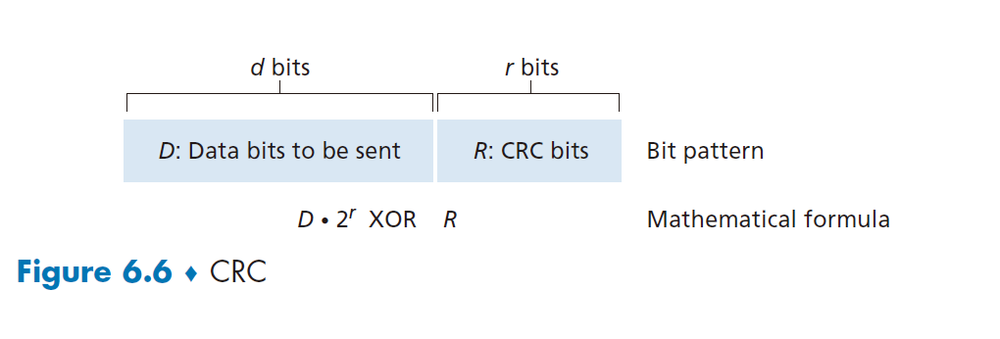
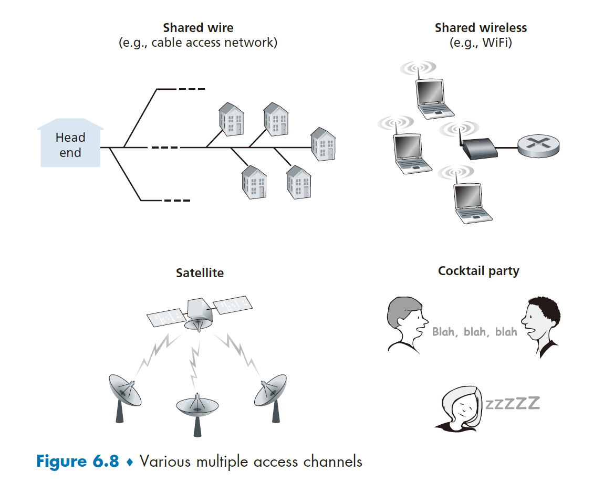

**目录：**

- [6. 链路层和局域网](#6-链路层和局域网)
  - [6.1. 链路层介绍](#61-链路层介绍)
    - [6.1.1. 链路层提供的服务](#611-链路层提供的服务)
    - [6.1.2. 链路层实现位置](#612-链路层实现位置)
  - [6.2. 差错检测和修正技术](#62-差错检测和修正技术)
    - [6.2.1. 奇偶校验](#621-奇偶校验)
    - [6.2.2. 检验和方法](#622-检验和方法)
    - [6.2.3. 循环冗余检测](#623-循环冗余检测)
  - [6.3. 多路访问链路和协议](#63-多路访问链路和协议)

**time : 2021-06-29**

# 6. 链路层和局域网

在前 2 章我们学习了网络层提供了主机到主机的通信服务。数据报从源主机开始，穿过一系列的通信链路（有线的和无线的）和分组交换机（交换机和路由器），最终到达目的主机。随着我们的学习顺着协议栈往下，我们自然想搞清楚组成主机到主机路径上的单一链路上，分组是怎么传递的。数据报怎么封装为链路层中的分组：帧？不同媒体的链路会使用不同的协议吗？广播链路上的传输冲突是怎么解决的？链路层上是否有编址呢，如果有，链路层编址怎么和网络层编址协作？交换机和路由器的区别准确来讲，到底是什么？在本章，我们将会回答这些问题。

在讨论链路层之前，我们先来介绍在链路层中，有 2 种不同的信道。一种是广播信道，广播信道连接多个主机，广播信道存在于无线局域网(WLAN)，卫星网络，以及混合光纤同轴(HFC)接入网。在广播信道中，由于多个主机使用单一的信道传输帧，那么就需要一种所谓的媒体访问协议来协同这些主机。有些情况，一个中心控制器用来协作传输，在另一些情况，主机自身来协作传输。第二种信道为点到点信道，这种信道存在于两台长距离连接的路由器或者主机和以太网交换机连接。点到点信道的协作比较简单，配套网站上有关于 **点到点协议(Point-to-Point, PPP)** 的详细讨论，这种协议被使用在拨号连接服务和高速点到点光纤链路。

在本章，我们将会探索许多链路层概念和技术。我们将会详细研究错误检测和修正。我们我们会学习多访问网络和交换机网络包括以太网，以太网是目前最流行的有线局域网技术。我们会了解到虚拟局域网和数据中心网络。在下一章，我们再学习无线局域网。

## 6.1. 链路层介绍

让我们以一些重要的术语开始。我们把在链路层运行的设备称为 **节点(node)**。节点涉及主机，路由器，交换机，和 WiFi 接入点（将在第 7 章讨论）。我们也把连接相邻节点的通信信道称为 **链路(links)**。一个数据报要从源主机传输到目的主机，要经历一系列的 **单一链路**。举个例子，考虑图 6-1 中的网络，一个使用无线接入的主机要发送数据报到一个服务器。这个数据报实际上经历了 6 个单一链路：WiFi 接入点和主机之间的无线链路，无线接入点和交换机之间的以太网链路，交换机和路由器之间的链路，两个路由器之间的链路，路由器和交换机之间的以太网链路，最终，交换机和服务器之间的以太网链路。在一个给定的链路上，一个传输节点将数据报封装为 **链路层帧** 并将该帧传输进链路中。


为了透彻理解链路层以及它是如何与网络层关联的，我们考虑一个交通运输的类比例子。假如一个旅行社计划为游客开辟从美国新泽西州的普林斯顿到瑞士洛桑的旅游路线。假定该旅行社认为对于游客而言最为便利的方案是：从普林斯顿乘豪华大轿车到 JFK 机场，然后乘飞机从 JFK 机场去日内瓦机场，最后乘火车从日内瓦机场到洛桑火车站。一旦 该旅行社作了这 3 项预定，普林斯顿豪华大轿车公司将负责将游客从普林斯顿带到 JFK, 航空公司将负责将游客从 JFK 带到日内瓦，瑞士火车服务将负责将游客从日内瓦带到洛桑。该旅程中 3 段中的每一段都在两个“相邻”地点之间是“直达的”。注意到这 3 段运输是由不同的公司管理，使用了完全不同的运输方式（豪华大轿车、飞机和火车）。尽管运输方式不同，但它们都提供了将旅客从一个地点运输到相邻地点的基本服务。在这个运输类比中，一个游客好比一个数据报，每个运输区段好比一条链路，每种运输方式好比一种链路层协议，而该旅行社好比一个路由选择协议。

### 6.1.1. 链路层提供的服务

尽管任一链路层的基本服务都是将数据报通过单一通信链路从一个节点移动到相邻节点，但所提供的服务细节能够随着链路层协议的不同而变化。链路层协议能够提供的可能服务包括:

- **成帧(framing)**。在每个网络层数据报经链路传送之前，几乎所有的链路层协议都要将其用链路层帧封装起来。一个帧由一个数据字段和若干首部字段组成，其中网络层数据报就插在数据字段中。帧的结构由链路层协议规定。当我们在本章的后半部分研究具体的链路层协议时，将看到几种不同的帧格式。
- **链路接入**。**媒体访问控制(Medium Access Control, MAC)** 协议规定了帧在链路上传输的规则。对于在链路的一端仅有一个发送方、链路的另一端仅有一个接收方的点对点链路，MAC 协议比较简单（或者不存在），即无论何吋链路空闲，发送方都能够发送帧。更有趣的情况是当多个节点共享单个广播链路时，即所谓多路访问问题。这里，MAC 协议用于协调多个节点的帧传输。
- **可靠交付**。当链路层协议提供可靠交付服务时，它保证无差错地经链路层移动每个网络层数据报。前面讲过，某些运输层协议（例如 TCP）也提供可靠交付服务。与运输层可靠交付服务类似，链路层的可靠交付服务通常是通过确认和重传取得的（参见 3-4 节）。链路层可靠交付服务通常用于易于产生高差错率的链路，例如无线 链路，其目的是本地（也就是在差错发生的链路上）纠正一个差错，而不是通过运 输层或应用层协议迫使进行端到端的数据重传。然而，对于低比特差错的链路，包括光纤、同轴电缆和许多双绞铜线链路,链路层可靠交付可能会被认为是一种不必要的开销。由于这个原因，许多有线的链路层协议不提供可靠交付服务。
- **差错检测和修正**。当帧中的一个比特作为 1 传输时，接收方节点中的链路层硬件可能不正确地将其判断为 0，反之亦然。这种比特差错是由信号衰减和电磁噪声导致的。因为没有必要转发一个有差错的数据报，所以许多链路层协议提供一种机制来检测这样的比特差错。通过让发送节点在帧中包括差错检测比特，让接收节点进行差错检查，以此来完成这项工作。第 3 章和第 4 章讲过，因特网的运输层和网络层也提供了有限形式的差错检测，即因特网检验和。链路层的差错检测通 常更复杂，并且用硬件实现。差错修正类似于差错检测，区别在于接收方不仅能检测帧中出现的比特差错，而且能够准确地确定帧中的差错出现的位置（并因此修正这些差错）。

### 6.1.2. 链路层实现位置

在深入学习链路层的细节之前，本概述的最后一节考虑一下在何处实现链路层的问 题。我们将关注一个端系统，因为我们在第 4 章中知道链路层是实现在路由器的线路卡中的。主机的链路层是用硬件还是用软件实现的呢？它是实现在一块单独的卡上还是一个芯片上？它是怎样与主机的硬件和操作系统组件的其他部分接口的呢？

图 6-2 显示了一个典型的主机体系结构“链路层的主体部分是在 **网络适配器(network adapter)** 中实现的，网络适配器有时也称为 **网络接口卡(Network Interface Card, NIC)**。位于网络适配器核心的是链路层控制器，该控制器通常是一个实现了许多链路层服务（成帧、链路接入、差错检测等）的专用芯片。因此，链路层控制器的许多功能是用硬件实现的。例如，Intel 的 700 系列设配器［Intel 2020］实现了以太网协议，我们将在 6-5 节中学习该协议；Atheros AR5006 ［Atheros 2020］适配器实现 802.11 WiFi 协议，我们将在第 7 章学习该协议。

在发送端，控制器取得了由协议栈较高层生成并存储在主机内存中的数据报，在链路层帧中封装该数据报（填写该帧的各个字段），然后遵循链路接入协议将该帧传进通信链路中。在接收端，控制器接收了整个帧，抽取出网络层数据报。如果链路层执行差错检测，则需要发送控制器在该帧的首部设置差错检测比特，由接收控制器执行差错检测。


图 6-2 显示了与主机总线（例如一条 PCI 或 PCI-X 总线）连接的网络适配器，这里它看起来非常像与其他主机组件连接的任何其他 I/O 设备。图 6-2 还显示了尽管大部分链路层是在硬件中实现的，但部分链路层是在运行于主机 CPU 上的软件中实现的。链路层的软件组件实现了高层链路层功能，如组装链路层寻址信息和激活控制器硬件。在接收端，链路层软件响应控制器中断（例如，由于一个或多个帧的到达），处理差错条件和将数据报向上传递给网络层。所以，链路层是硬件和软件的结合体，即此处是协议栈中软件与硬件交接的地方。［Intel 2020］从软件编程的角度提供了有关 XL 710 控制器的可读性很强的概述（以及详细的描述）。

## 6.2. 差错检测和修正技术

在上一节中，我们提到了 **比特级差错检测和修正(bit-level error detection and correction)**，即对从一个节点发送到另一个物理上连接的邻近节点的链路层帧中的比特损伤进行检测和修正，它们通常是链路层提供的两种服务。我们在第 3 章中看到差错检测和修正服务通常也由运输层提供。在本节中，我们将研究几种最简单的技术，它们能够用于检测比特差错，而且在某些情况下，能够修正这样的比特差错。对该主题理论和实现的全面描述是许多教科书的主题（例如［Schwartz 1980］或［Bertsekas 1991］），而我们这里仅讨论必要内容。我们此时的目的是对差错检测和纠正技术提供的能力有一种直观的认识，并看看一些简单技术在链路层中的工作原理及其如何实际应用。

图 6-3 图示说明了我们研究的环境。在发送节点，为了保护比特免受差错，使用 **差错检测和修正比特(Error- Detection and-Correction, EDC)** 来增强数据 D。通常，要保护的数据不仅包括从网络层传递下来需要通过链路传输的数据报，而且包括链路帧首部中的链路级的寻址信息、序号和其他字段。链路级帧中的 D 和 EDC 都被发送到接收节点。在接收节点，接收到比特序列 D'和 EDC'。注意到因传输中的比特翻转所致，D'和 EDC'可能与初始的 D 和 EDC 不同。


接收方的挑战是在它只收到 D'和 EDC'的情况下，确定 D'是否和初始的 D 相同。在图 6-3 中的接收方判定的准确措辞（我们问是否检测到一个差错，而非是否出现了差错！） 是重要的。差错检测和纠正技术使接收方有时但并总是检测出已经出现的比特差错。即使采用差错检测比特，也还是可能有 ；**未检出比特差错(undetected bit error)**，这就是说，接收方可能无法知道接收的信息中包含着比特差错。因此，接收方可能向网路层交付一个损伤的数据报，或者不知道该帧首部的某个其他字段的内容已经损伤。我们因此要选择一个差错检测方案，使得这种事件发生的概率很小。一般而言，差错检测和纠错技术越复杂（即那些具有未检测出比特差错概率较小的技术），导致的开销就越大，这就是意味着需要更多的计算量及更多的差错检测和纠错比特。

我们现在来研究在传输数据中检测差错的 3 种技术：奇偶校验（它用来描述差错检测和修正背后隐含的基本思想）、检验和方法（它通常更多地应用于运输层）和循环冗余检测（它通常更多地应用在适配器中的链路层）。

### 6.2.1. 奇偶校验

也许差错检测最简单的方式就是用单个 **奇偶校验位(parity bit)**。假设在图 6-4 中要发送的信息 D 有 d 比特。在偶校验方案中，发送方只需包含一个附加的比特，选择它的值，使得这 d + 1 比特（初始信息加上一个校验比特）中 1 的总数是偶数。对于奇校验方案，选择校验比特值使得有奇数个。图 6-4 描述了一个偶校验的方案，单个校验比特被存放在一个单独的字段中。


采用单个奇偶校验位方式，接收方的操作也很简单。接收方只需要数一数接收的 d + 1 比特中 1 的数目即可。如果在采用偶校验方案中发现了奇数个值为 1 的比特，接收方知道至少出现了一个比特差错。更精确的说法是，出现了奇数个比特差错。

但是如果出现了偶数个比特差错，那会发生什么现象呢？你应该认识到这将导致一个未检出的差错。如果比特差错的概率小，而且比特之间的差错可以被看作是独立发生的，在一个分组中多个比特同时出错的概率将是极小的。在这种情况下，单个奇偶校验位可能是足够的了。然而，测量已经表明了差错经常以“突发”方式聚集在一起，而不是独立地发生。在突发差错的情况下，使用单比特奇偶校验保护的一帧中未检测出差错的概率能够达到 50% [Spragins 1991]。显然，需要一个更健壮的差错检测方案（幸运的是实践中正在使用这样的方式！）。但是在研究实践中使用的差错检测方案之前，我们考虑对单比特奇偶校验的一种简单一般化方案，这将使我们深入地理解纠错技术。

图 6-5 显示了单比特奇偶校验方案的二维一般化方案。这里 D 中的 d 个比特被划分为：i 行 j 列。对每行和每列计算奇偶值。产生的 i+j+1 奇偶比特构成了链路层帧的差错检测比特。


现在假设在初始 d 比特信息中出现了 单个比特差错。使用这种 **二维奇偶校验(two-dimensional parity)** 方案，包含比特值改变的列和行的校验值都将会岀现差错。 因此接收方不仅可以检测到出现了单个比 特差错的事实，而且还可以利用存在奇偶 校验差错的列和行的索引来实际识别发生 差错的比特并纠正它！图 6-5 显示了一个例子，其中位于（2, 2）的值为 1 的比特损坏了，变成了 0，该差错就是一个在接收方可检测并可纠正的差错。尽管我们的讨论 是针对初始 d 比特信息的，但校验比特本 身的单个比特差错也是可检测和可纠正的。 二维奇偶校验也能够检测（但不能纠正！）一个分组中两个比特差错的任何组合。二维奇偶校验方案的其他特性将在本章后面的习题中进行探讨。

接收方检测和纠正差错的能力被称为 **前向纠错(Forward Error Correction, FEC)**。这些技术通常用于如音频 CD 这样的音频存储和回放设备中。在网络环境中，FEC 技术可以单独应用，或与链路层 ARQ 技术一起应用，ARQ 技术与我们在第 3 章研究的协议类似。 FEC 技术很有价值，因为它们可以减少所需的发送方重发的次数。也许更为重要的是，它 们允许在接收方立即纠正差错。FEC 避免了不得不等待的往返时延，而这些时延是发送方收 到 NAK 分组并向接收方重传分组所需要的，这对于实时网络应用[Rubenstein 1998]或者具有长传播时延的链路（如深空间链路）可能是一种非常重要的优点。研究差错控制协议中 FEC 的使用的资料包括 f Biersack 1992；Nonnenmacher 1998 ；Byers 1998 ；Shacham 1990]。

### 6.2.2. 检验和方法

在检验和技术中，图 6-4 中的 d 比特数据被作为一个 k 比特整数的序列处理。一个简单检验和方法就是将这丘比特整数加起来，并且用得到的和作为差错检测比特。**因特网检验和(Internet checksum)** 就基于这种方法，即数据的字节作为 16 比特的整数对待并求和。这个和的反码形成了携带在报文段首部的因特网检验和。如在 3-3 节讨论的那样，接收方通过对接收的数据（包括检验和）的和取反码，并且检测其结果是否为全 1 比特来检测检验和。如果这些比特中有任何比特是 0，就可以指示出差错。RFC 1071 详细地讨论因特网检验和算法和它的实现。在 TCP 和 UDP 协议中，对所有字段（包括首部和数据字段）都计算因特网检验和。在其他协议中，例如 XTP [Strayer 1992]，对首部计算一个检验和，对整个分组计算另一个检验和。

检验和方法需要相对小的分组开销。例如，TCP 和 UDP 中的检验和只用了 16 比特。 然而，与后面要讨论的常用于链路层的 CRC 相比，它们提供相对弱的差错保护。这时，一个很自然的问题是：为什么运输层使用检验和而链路层使用 CRC 呢？前面讲过运输层 通常是在主机中作为用户操作系统的一部分用软件实现的。因为运输层差错检测用软件实现，采用简单而快速如检验和这样的差错检测方案是重要的。在另一方面，链路层的差错 检测在适配器中用专用的硬件实现，它能够快速执行更复杂的 CRC 操作。Feldmeier： Feld- meier 1995]描述的快速软件实现技术不仅可用于加权检验和编码，而且可用于 CRC（见后面）和其他编码。

### 6.2.3. 循环冗余检测

现今的计算机网络中广泛应用的差错检测技术基于 **循环冗余检测(Cyclic Redundancy Check, CRC)** 编码。CRC 编码也称为 **多项式编码(polynomial code)**，因为该编码能够将要发送的比特串看作为系数是 0 和 1 一个多项式，对比特串的操作被解释为多项式算术。

CRC 编码操作如下。考虑 d 比特的数据 D，发送节点要将它发送给接收节点。发送方和接收方首先必须协商一个 r + 1 比特模式，称为 **生成多项式(generator)**，我们将其表示为 G。我们将要求 G 的最高有效位的比特（最左边）是 1。CRC 编码的关键思想如图 6-6 所示。对于一个给定的数据段 D,发送方要选择 r 个附加比特 R，并将它们附加到 D 上，使得得到的 d + r 比特模式（被解释为一个二进制数）用模 2 算术恰好能被 G 整除（即没有余数）。用 CRC 进行差错检测的过程因此很简单：接收方用 G 去除接收到的 d+r 比特。如果余数为非零，接收方知道出现了差错；否则认为数据正确而被接收。



所有CRC计算采用模2算术来做，在加法中不进位，在减法中不借位。这意味着加法和减法是相同的，而且这两种操作等价于操作数的按位异或（XOR）。因此，举例来说:

```
1011 XOR 0101 = 1110
1001 XOR 1101 = 0100
```

类似地，我们还会有:

```
1011 - 0101 = 1110
1001 - 1101 = 0100
```

除了所需的加法或减法操作没有进位或借位外，乘法和除法与在二进制算术中是相同的。如在通常的二进制算术中那样，乘以 2^k 就是以一种比特模式左移 k 个位置。这样，给定D和R, D*2^r XOR R产生如图6-6所示的 d+r 比特模式。在下面的讨论中，我们将利用图6-6中这种 d+r比特模式的代数特性。

现在我们回到发送方怎样计算R这个关键问题上来。前面讲过，我们要求出R使得对于n有: `D*2^r XOR R = n * G`。

也就是说，我们要选择R使得G能够除以 `2^r XOR R` 而没有余数。如果我们对上述等式的两边都用R异或(即用模2加，而没有进位)，我们得到 `D*2^r = n*G XOR R`。

这个等式告诉我们，如果我们用G来除 `D*2^r`，余数值刚好是R。换句话说，我们可以这样计算R：`R = (D*2^r) % G` (% 表示取余)。


图6-7举例说明了在 D = 101110, d=6, G = 1001和r=3的情况下的计算过程。在这种情况下传输的9个比特是101110011。你应该自行检查一下这些计算，并核对一下 D*2^r = 101011 * G XOR R 的确成立。


国际标准已经定义了 8、12、16和32比特生成多项式 G。CRC-32 32比特的标准被多种链路级IEEE协议采用，使用的一个生成多项式是：`G(CRC-32) = 100000100110000010001110110110111`。

每个CRC标准都能检测小于 r + 1比特的突发差错。(这意味着所有连续的厂比特或者更少的差错都可以检测到。)此外，在适当的假设下，长度大于厂+ 1比特的突发差错以概率 `1 - 0.5^r` 被检测到。每个CRC标准也都能检测任何奇数个比特差错。有关CRC检测实现的讨论可参见 [WiUiams 1993]。CRC编码甚至更强的编码所依据的理论超出了本书的范围。教科书[Schwartz 1980]对这个主题提供了很好的介绍。

## 6.3. 多路访问链路和协议

在本章概述中，我们提到了有两种类型的网络链路：点对点链路和广播链路。**点对点链路(point-to-point link)** 由链路一端的单个发送方和链路另一端的单个接收方组成。许多链路层协议都是为点对点链路设计的，如 **点对点协议(point-to-point protocol, PPP)** 和 **高级数据链路控制(high-level data link control, HDLC)** 就是两种这样的协议，我们将在本章后面涉及它们。第二种类型的链路是 **广播链路(broadcast link)**，它能够让多个发送和接收节点都连接到相同的、单一的、共享的广播信道上。这里使用术语“广播”是因为 当任何一个节点传输一个帧时，信道广播该帧，每个其他节点都收到一个副本。以太网和无线局域网是广播链路层技术的例子。在本节，我们暂缓讨论特定的链路层协议，而先研究一个对链路层很重要的问题：如何协调多个发送和接收节点对一个共享广播信道的访问，这就是 **多路访问问题(muhiple access problem)**。广播信道通常用于局域网中，局域网是一个地理上集中在一座建筑物中(或者在一个公司，或者在大学校园)的网络。因此我们还将在本节后面考察一下多路访问信道是如何在局域网中使用的。

我们都很熟悉广播的概念，因为自电视发明以来就使用了这种通信方式。但是传统的电视是一种一个方向的广播(即一个固定的节点向许多接收节点传输)，而计算机网络广播信道上的节点既能够发送也能够接收。也许对广播信道的一个更有人情味的类比是鸡尾酒会，在那里许多人聚集在一个大房间里(空气为提供广播的媒体)谈论和倾听。第二个切题的类比是许多读者都很熟悉的地方，即一间教室，在那里老师们和同学们同样共享相同的、单一的广播媒体。在这两种场景下，一个中心问题是确定谁以及在什么时候获得说话权力（也就是向信道传输）。作为人类，为了共享这种广播信道，我们已经演化得到了一个精心设计的协议集了:

```
“给每个人一个讲话的机会。”
“该你讲话时你才说话。”
“不要一个人独占整个谈话。”
“如果有问题请举手。”
“当有人讲话时不要打断。”
“当其他人讲话时不要睡觉。”
```

计算机网络有类似的协议，也就是所谓的 **多路访问协议(multiple access protocol)**，即节点通过这些协议来规范它们在共享的广播信道上的传输行为。如图6-8所示，在各种各样的网络环境下需要多路访问协议，包括有线和无线接入网，以及卫星网络。尽管从技术 上讲每个节点通过它的适配器访问广播信道，但在本节中我们将把节点作为发送和接收设 备。在实践中，数以百计或者甚至数以千计个节点能够通过一个广播信道直接通信。



