**目录：**

- [7. 无线和移动网络](#7-无线和移动网络)
  - [7.1. 介绍](#71-介绍)
  - [7.2. 无线链路和网络特征](#72-无线链路和网络特征)
    - [7.2.1. 码分多址(CDMA)](#721-码分多址cdma)
  - [7.3. 无线局域网](#73-无线局域网)
    - [7.3.1. 802.11 架构](#731-80211-架构)
    - [7.3.2. 802.11 MAC 协议](#732-80211-mac-协议)
    - [7.3.3. IEEE 802.11 帧](#733-ieee-80211-帧)
    - [7.3.4. 在相同的 IP 子网中的移动性](#734-在相同的-ip-子网中的移动性)
    - [7.3.5. 802.11 中的高级特色](#735-80211-中的高级特色)
    - [7.3.6. 个人域网络：蓝牙](#736-个人域网络蓝牙)
  - [7.4. 蜂窝网络：4G 和 5G](#74-蜂窝网络4g-和-5g)
    - [7.4.1. 4G LTE 蜂窝网络：架构和基本组成](#741-4g-lte-蜂窝网络架构和基本组成)
    - [7.4.2. LTE 协议栈](#742-lte-协议栈)
    - [7.4.3. LTE 无线电接入网络](#743-lte-无线电接入网络)
    - [7.4.4. 额外的 LTE 功能：网络附件和电源管理](#744-额外的-lte-功能网络附件和电源管理)
    - [7.4.5. 全球蜂窝网络：网络的网络](#745-全球蜂窝网络网络的网络)
    - [7.4.6. 5G 蜂窝网络](#746-5g-蜂窝网络)
  - [7.5. 移动性管理：原则](#75-移动性管理原则)
    - [7.5.1. 设备移动性：网络层的视角](#751-设备移动性网络层的视角)
    - [7.5.2. 家庭网络和在被访问网络上的漫游](#752-家庭网络和在被访问网络上的漫游)
    - [7.5.3. 直接和间接路由至/自移动设备](#753-直接和间接路由至自移动设备)
  - [7.6. 移动性管理：实践](#76-移动性管理实践)
    - [7.6.1. 4G/5G 网络中的移动性管理](#761-4g5g-网络中的移动性管理)
    - [7.6.2. 移动 IP](#762-移动-ip)
  - [7.7. 无线和移动性：对高层协议的冲击](#77-无线和移动性对高层协议的冲击)
  - [7.8. 通过 wireshark 观察 802.11(WiFi)](#78-通过-wireshark-观察-80211wifi)

# 7. 无线和移动网络

在电话通讯的世界，过去的 25 年是蜂窝电话通讯的黄金时代。在世界范围上，使用移动蜂窝网络的用户从 1993 的 240 万增加到 2019 年的 83 亿。这个数字甚至超过了世界总人口数（2019 年为 76.74 亿）。移动电话的优势是显而易见的：任何地点，任何时间，不受约束地通过一个高度轻便的设备接入全球电话网。近来，智能手机，平板电脑，和笔记本已经通过蜂窝网络或 WiFi 网络无线地接入 Internet。并且，类似于游戏手柄，温度控制器，家庭安保系统，家用智能电器，智能手表，智能眼睛，汽车，交通控制系统等正逐渐无线接入 Internet。

从计算机网络的观点来看，这些无线和移动设备引发的挑战，特别是在数据链路层和网络层，与传统的有线网络的差别非常大，适合用单独一章（即本章）的篇幅来专门讨论无线网络和移动网络。

我们这章将以讨论移动用户，无线链路及网络和他们所连接的更大的有线网络之间的关系开始。我们将明确区分无线网络的无线性和移动性。分清这两个特性将有助于我们隔离，识别，和掌握在这两个区域的关键概念。

我们将以对无线基础设施和相关术语的概览开始。之后，我们将考虑 7-2 节中无线链路的特征。我们在这一节涉及一个简短的对 **码分多址接入技术(Code Division Multiple Access, CDMA)** 的介绍，这是一种常被用于无线网络的共享媒体的接入技术。在 7-3 节，我们深度学习 IEEE 802.11(WiFi) 无线局域网标准的链路层的一些方面。同时我们还将对蓝牙和其他无线个人域网络做简要描述。在 7-4 节，我们提供一个对蜂窝网络接入，包扩 4G 和兴起的 5G 蜂窝网络技术的一个概览，5G 蜂窝网络技术同时提供语音和高速的 Internet 接入。在 7-5 节，我们将注意力转向移动性，关注于移动用户的定位问题、对移动用户的路由选择以及“切换”（handing over）移动用户（即在网络中从一个接入点动态地移动到另一点的用户）等问题。在 7-6 节和 7-7 节中，我们将分别考察如何在企业 802.11 网络和 LTE 蜂窝网络中用移动 IP 标准实现这些移动服务。最后，我们将在 7-8 节中考虑无线链路和移动性对运输层协议和网络应用程序的影响。

## 7.1. 介绍

图 7-1 显示了我们将要讨论无线数据通信和移动性主题的环境。为使讨论具有一般性以覆盖各种各样的网络，将包括像 IEEE 802.11 这样的无线局域网和像 4G，5G 网络这样的蜂窝网络来开始我们的讨论；然后在后续各节中，我们将对特定的无线体系结构进行更加详细的讨论。我们能够看到无线网络的下列要素：

- **无线主机**。如同在有线网络中一样，主机是运行应用程序的端系统设备。**无线主机(wireless host)** 可以是智能手机，平板电脑，或笔记本，或者它可能是类似于传感器，智能家电，自动驾驶汽车，或者其他接入互联网的混合设备。 主机本身可能移动，也可能不移动。
- **无线链路**。主机通过 **无线通信链路(wireless communication link)** 连接到一个基站（定义见下文）或者另一台无线主机。不同的无线链路技术具有不同的传输速率和能够传输不同的距离。图 7-2 显示了较为流行的无线链路标准的两种主要特性（覆盖区域和链路速率）。（该图仅表示了提供这些特性的大致概念。例如，这些类型中的某些网络现在只是在部署，某些链路速率取决于距离、信道条件和在无线网络中的用户数量，能够比显 示的值更高或更低些。）我们将在本章的前半部分讨论这些标准。在 7-2 节中，我们也考虑其他无线链路特性（如它们的比特差错率及其原因）。


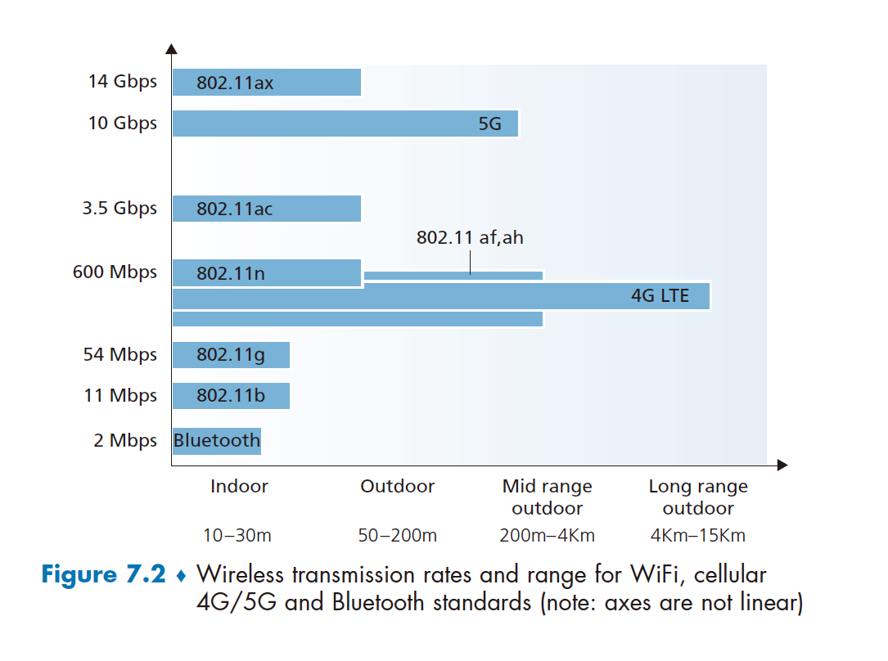

在图 7-1 中，无线链路将位于网络边缘的主机连接到更大的网络基础设施中。我们要马上补充的是，无线链路有时同样应用在一个网络中以连接路由器、交换机和其他网络设备。然而，在本章中我们关注的焦点是无线通信在网络边缘的应用，因为许多最为振奋人心的技术挑战和多数增长就发生在这里。

- **基站**。**基站(base station)** 是无线网络基础设施的一个关键部分。与无线主机和无线链路不同，基站在有线网络中没有明确的对应设备。它负责向与之关联的无线主机发送数据和从主机那里接收数据（例如分组）。基站通常负责协调与之相关联的多个无线主机的传输。当我们说一台无线主机与某基站“相关联”时，则是指：1. 该主机位于该基站的无线通信覆盖范围内；2. 该主机使用该基站中继它（该主机）和更大网络之间的数据。蜂窝网络中的 **蜂窝塔(cell tower)** 和 802.11 无线 LAN 中的 **接入点(access point)** 都是基站的例子。

在图 7-1 中，基站与更大网络相连（如因特网、公司或家庭网、电话网），因此这种连接在无线主机和与之通信的其他部分之间起着链路层中继的作用。

与基站关联的主机通常被称为以 **基础设施模式(infrastructure mode)** 运行，因为所有传统的网络服务（如地址分配和路由选择）都由网络向通过基站相连的主机提供。在 **自组织网络(ad hoc network)** 中，无线主机没有这样的基础设施与之相连。在没有这样的基础设施的情况下，主机本身必须提供诸如路由选择、地址分配、类似于 DNS 的名字转换等服务。

当一台移动主机的移动超出一个基站的覆盖范围而到达另一个基站的覆盖范围后，它将改变其接入到更大网络的连接点（即改变与之相关联的基站），这一过程称作 **切换(handoff，或 handover)**。这种移动性引发了许多具有挑战性的问题。如果一台主机可以移动，那么如何找到它在网络中的当前位置，从而使得数据可以向该移动主机转发？如果一台主机可以位于许多可能位置中的一个，那么如何进行编址？如果主机在一个 TCP 连接或者电话呼叫期间移动，数据如何路由选择而使连接保持不中断？这些以及许多（许多！）其他问题使得 无线网络和移动网络成为一个让人振奋的网络研究领域。

- **网络基础设施**。这是无线主机希望与之进行通信的更大网络。

在讨论完无线网络的构件以后，我们注意到这些构件能够以多种不同方式组合以形成不同类型的无线网络。当阅读本章，或阅读/学习本书之外的更多有关无线网络的内容时, 你可能发现对这些无线网络类型进行分类的方法是有用的。在最高层次，我们能够根据两个准则来对无线网络分类：1. 在该无线网络中的分组是否跨越了一个无线跳或多个无线跳；2. 网络中是否有诸如基站这样的基础设施。

- **单跳，基于基础设施**。这些网络具有与较大的有线网络（如因特网）连接的基站。此外，该基站与无线主机之间的所有通信都经过一个无线跳。你在教室、咖啡屋 或图书馆中所使用的 802.11 网络，以及我们将很快学习的 4G LTE 数据网络都属于这种类型。我们日常的绝大部分时间是在与单跳、基于基础设施的无线网络打交道。
- **单跳，无基础设施**。在这些网络中，不存在与无线网络相连的基站。然而，如我们将要见到的那样，在这种单跳网络中的一个节点可以协调其他节点的传输。蓝牙网络（该网络连接诸如键盘、扬声器和戴在头上的耳机等小型无线设备，我们将在 7-3-6 节中学习）和具有自组织模式的 802.11 网络是单跳、无基础设施的网络。
- **多跳，基于基础设施**。在这些网络中，一个基站表现为以有线方式与较大网络相连。然而，某种无线节点为了经该基站通信，可能不得不通过其他无线节点中继它们的通信。某些无线传感网络和所谓 **无线网状网络(wireless mesh network)** 就属于这种类型。
- **多跳，无基础设施**。在这些网络中没有基站，并且节点为了到达目的地可能必须在几个其他无线节点之间中继报文。节点也可能是移动的，在多个节点中改变连接关系，一类网络被称为 **移动自组织网络(mobile ad hoc network, MANET)**。如果该移动节点是车载的，该网络是 **车载自组织网络(vehicular ad hoc network, VANET)**。如你可能想象的那样，为这种网络开发协议是一种挑战，这是许多进行中的研究主题。

在本章中，我们将把主要学习内容限制在单跳网络，并且大多数是基于基础设施的网络。

现在我们更深一步地研究无线网络和移动网络面对的挑战。我们将首先讨论单独的无线链路，而在本章稍后部分讨论移动性。

## 7.2. 无线链路和网络特征

无线链路在多个方面不同于有线链路：

- **递减的信号强度**。电磁波在穿过物体（如无线电信号穿过墙壁）时强度将减弱。即使在自由空间中，信号仍将扩散，这使得信号强度随着发送方和接收方距离的增加而减弱（有时称其为 **路径损耗(path loss)** ）。
- **来自其他源的干扰**。在同一个频段发送信号的电波源将相互干扰。例如，2.4GHz 无线电话和 802.11b 无线 LAN 在相同的频段中传输。因此，802.11b 无线 LAN 用户若同时利用 2.4GHz 无线电话通信，将会导致网络和电话都不会工作得特别好。除了来自发送源的干扰，环境中的电磁噪声（如附近的电动机、微波）也能形成干扰。
- **多径传播**。当电磁波的一部分受物体和地面反射，在发送方和接收方之间走了不同长度的路径，则会出现 **多径传播(multipath propagation)**。这使得接收方收到的信号变得模糊。位于发送方和接收方之间的移动物体可导致多径传播随时间而改变。

对于无线信道特征、模型和测量的详细讨论请参见[Anderson 1995; Almers 2007]。

上述讨论表明，无线链路中的比特差错将比有线链路中更为常见。因此，无线链路协议（如我们将在下面一节中讨论的 802.11 协议）不仅采用有效的 CRC 错误检测码，还采用了链路层 ARQ 协议来重传受损的帧。

考虑了在无线信道上可能出现的损伤后，我们将注意力转向接收无线信号的主机。该主机接收到一个电磁信号，而该信号是发送方传输的初始信号的退化形式和环境中的背景噪声的结合，其中的信号退化是由于衰减和我们前面讨论过的多路径传播以及其他一些因素所引起的。**信噪比(Signal-to-Noise Ratio, SNR)** 是所收到的信号（如被传输的信息）和噪声强度的相对测量。SNR 的度量单位通常是分贝（dB），有人认为这个主要由电气工程师所使用的度量单位会使计算机科学家迷惑不解。以 dB 度量的 SNR 是下列比值的 20 倍，即接收到的信号的振幅与噪声的振幅的以 10 为底的对数的比值。就我 们的讨论目的而言，我们仅需要知道较大的 SNR 使接收方更容易从背景噪声中提取传输的信号。

图 7-3（该图选自［Holland 2001］）显示了三种不同的调制技术的 **比特差错率(BER)**（大致说来，BER 是在接收方收到的有错传输比特的概率）与 SNR 之比，这些调制技术用于 对信息进行编码以在理想信道上传输。调制和 编码理论以及信号提取和 BER 都超出了本书的范围（对这些主题的讨论参见［Schwar 1980］）。尽管如此，图 7-3 显示了几种物理层的特征，这些特征对于理解较高层无线通信协议是重要的:


- 对于给定的调制方案，SNR 越高，BER 越低。由于发送方通过增加它的传输功率就能够增加 SNR，因此发送方能够通过增加它的传输功率来降低接收到差错帧的概率。然而，注意到当该功率超过某个阈值时，如 BER 从 10^-12 降低到 10^-13，可证明几乎不会有实际增益。增加传输功率也会伴随着一些缺点：发送方必须消耗更多的能量（对于用电池供电的移动用户，这一点非常重要），并且发送方的传输更可能干扰另一个发送方的传输（参见图 7-4b）。
- 对于给定的 SNR，图 7-4 隐藏终端问题和衰减具有较高比特传输率的调制技术（无论差错与否）将具有较高的 BER。例如在图 7-3 中，对于 10dB 的 SNR,具有 1Mbps 传输速率的 BPSK 调制具有小于 10^-7 的 BER，而具有 4Mbps 传输速率的 QAM 16 调制，BER 是 10^-1，该值太高而没有实际用处。然而，具有 20dB 的 SNR, QAM 16 调制具有 4Mbps 的传输速率和 10^-7 的 BER，而 BPSK 调制具有仅 1Mbps 的传输速率和一个低得“无法在图上表示”的 BER。如果人们能够容忍 10^-7 的 BER，在这种情况下由 QAM 16 提供的较高的传输速率将使它成为首选的调制技术。这些考虑引出了我们下面描述的最后一个特征。
- 物理层调制技术的动态选择能用于适配对信道条件的调制技术。SNR （因此 BER）可能因移动性或由于环境中的改变而变化。在蜂窝数据系统中以及在 802.11 WiFi，4G，5G 蜂窝数据网络中（我们将在 7-3 节和 7-4 节中学习）使用了自适应调制和编码。例如，这使得对于给定的信道特征选择一种调制技术，在受制于 BER 约束的前提下提供最高的可能传输速率。

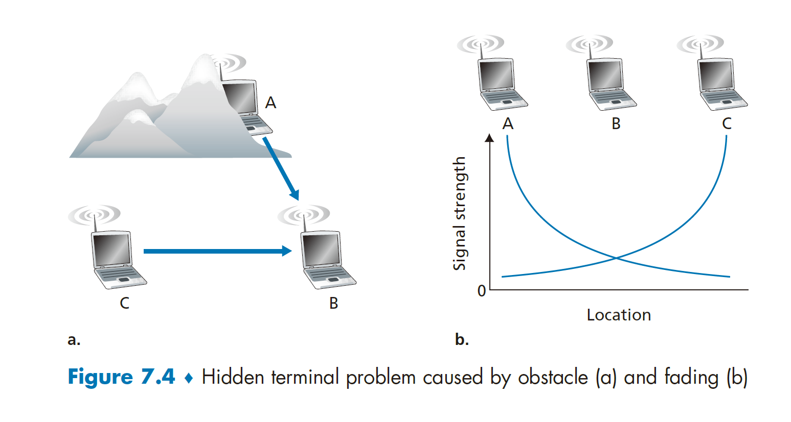

有线和无线链路之间的差异并非仅仅只有较高的、时变的误比特率这一项。前面讲 过在有线广播链路中所有节点能够接收到所有其他节点的传输。而在无线链路中，情况 并非如此简单。如图 7-4 所示，假设站点 A 正在向站点 B 发送，同时假定站点 C 也在向站点 B 传输。由于所谓的 **隐藏终端问题(hidden terminal problem)**，即使 A 和 C 的传输确实是在目的地 B 发生干扰，环境的物理阻挡（例如，一座大山或者一座建筑）也可能会妨碍 A 和 C 互相听到对方的传输。这种情况如图 7-4a 所示。第二种导致在接收方无法检测的碰撞情况是，当通过无线媒体传播时信号强度的 **衰减(fading)**。图 7-4b 图 示了这种情况，A 和 C 所处的位置使得它们的信号强度不足以使它们相互检测到对方的传输，然而它们的传输足以强到在站点 B 处相互干扰。正如我们将在 7-3 节看到的那样，隐藏终端问题和衰减使得多路访问在无线网络中的复杂性远高于在有线网络中的情况。

### 7.2.1. 码分多址(CDMA)

在第 6 章讲过，当不同主机使用一个共享媒体通信时，需要有一个协议来保证多个发送方发送的信号不在接收方互相干扰。在第 6 章中，我们描述了 3 类媒体访问协议：信道划分、随机访问和轮流。**码分多址(Code Division Multiple Access, CDMA)** 属于信道划分 协议族。它在无线 LAN 和蜂窝技术中应用很广泛。由于 CDMA 对无线领域十分重要，在后面小节中对具体的无线接入技术进行探讨以前，我们首先对其快速地浏览一下。

在 CDMA 协议中，要发送的每个比特都通过乘以一个信号(编码)的比特来进行编码，这个信号的变化速率(通常称为 **码片速率**，chipping rate)比初始数据比特序列的变化速率快得多。图 7-5 表示一个简单的、理想化的 CDMA 编码/解码情形。假设初始数据比特到达 CDMA 编码器的速率定义了时间单元；也就是说，每个要发送的初始数据比特需要 1 比特时隙时间。设第 $d_i$ 为第 i 个比特时隙中的数据比特值。为了数学上便利，我们把具有 0 值的数据比特表示为-1。每个比特时隙又进一步细分为 M 个微时隙；在图 7-5 中，M = 8，不过在实际中 M 的值要大得多。发送方使用的 CDMA 编码由 M 个值的一个序列 c(m) 组成，m = 1, ..., M, 每个取值为+1 或者-1。在图 7-5 的例子中，被发送方使用的 M 比特的 CDMA 码是 (1, 1, 1, -1, 1, -1, -1, -1)。


为了说明 CDMA 的工作原理，我们关注第 i 个数据比特 $d_i$。对于 $d_i$ 比特传输时间的第 m 个微时隙，CDMA 编码器的输出 $Z_{i,m}$ 是 $d_i$ 乘以分配的 CDMA 编码的第 m 比特 $c_m$：

$$Z_{i,m} = {d_i \cdot c_m} \tag{7-1式}$$

简单地说，对没有干扰的发送方，接收方将收到编码的比特 $Z_{i,m}$，并且恢复初始的数据比特 $d_i$，计算如下：

$$d_i = {{1 \over M} {\displaystyle \sum_{m=1}^{M} Z_{i,m}} \cdot c_m} \tag{7-2式}$$

读者可能想通过推敲图 7-5 所示例子的细节，来明白使用(7-2 式)在接收方确实正确恢复了初始数据比特。

然而，这个世界远不是理想化的，如上面所述，CDMA 必须在存在干扰发送方的情况下工作，这些发送方用分配的不同编码来编码和传输它们的数据。但是当一个发送方的数据比特和其他发送方发送的比特混在一起时，一个 CDMA 接收方怎样恢复该发送方的初始数据比特呢？ CDMA 的工作有一种假设，即对干扰的传输比特信号是加性的，这意味着, 例如在同一个微时隙中，如果 3 个发送端都发送 1，第 4 个发送端发送 -1，那么在那个微时隙中所有的接收方接收的信号都是 2 (因为 1+1+1-1 = 2)。在存在多个发送方时，发送方 s 计算它编码后的传输 $Z_{i,m}^s$ ，计算方式与上面式子中的第一个完全相同。然而在第 i 个比特时隙的第 m 个微时隙期间，接收方现在收到的值是在那个微时隙中从所有 N 个发送方传输的比特的总和：

$$Z_{i,m}^* = {\displaystyle \sum_{s=1}^{N} Z_{i,m}^s}$$

令人吃惊的是，如果仔细地选择发送方的编码，每个接收方只通过(7-2 式)中的同样的方式使用发送方的编码，就能够从聚合的信号中恢复一个给定的发送方发送的数据：

$$d_i = {{1 \over M} {\displaystyle \sum_{m=1}^M {Z_{i,m}^*} \cdot c_m}} \tag{7-3式}$$

如在图 7-6 中所示，描述了两个发送方的 CDMA 例子。上部的发送方使用的 M 比特 CDMA 编码是(1, 1, 1, -1, 1, -1, -1, -1)，而下部的发送方使用的 CDMA 编码是(1, -1, 1, 1, 1, -1, 1, 1)。图 7-6 描述了一个接收方恢复从上部发送方发送的初始数据比特的情况。注意到这个接收方能够提取来自发送方 1 的数据，而不管来自发送方 2 的干扰传输。

再回到我们第 6 章中鸡尾酒会的类比，一个 CDMA 协议类似于让聚会客人使用多种语言来谈论；在这种情况下，人们实际上非常善于锁定他们能听懂的语言的谈话，而过滤了其余的谈话。我们这里看到 CDMA 是一个划分协议，因为它划分编码空间(与时间或频率相对)，并且给每个节点分配一段专用的代码空间。

我们这里对 CDMA 的讨论是简要的；实践中还必须处理大量的困难问题。首先，为了使 CDMA 接收方能够提取一个特定的发送方的信号，必须仔细地选择 CDMA 编码。其次，我们的讨论假设在接收方接收到的来自从不同发送方的信号强度是相同的；这可能在实际中很难获得。有大量的文章讨论了有关 CDMA 的这些和其他问题；详细内容见[Pickholtz 1982； Viterbi 1995] 。


**time : 2021-07-07**

## 7.3. 无线局域网

当前，无线 LAN 在工作场所、家庭、教育机构、咖啡屋、机场以及街头无所不在, 它已经成为因特网中的一种十分重要的接入网技术。尽管在 20 世纪 90 年代研发了许多有关无线 LAN 的标准和技术，但其中有一类标准已经明显成为赢家：**IEEE 802.11 无线 LAN** (也称为 **WiFi**)。在本节中，我们将详细研究 802.11 无线 LAN，分析它的帧结构、它的媒体访问协议以及 802.11 LAN 与有线以太网 LAN 的互联。

在 IEEE 802.11 协议族中有几套有关无线 LAN 的 802.11 标准[IEEE 802.11 2020]，下表对它们进行了总结。802.11 b，g，n，ac，ax 是 802.11 无线局域网技术的紧接着的一代，他们的工作范围通常小于 70m，常常用于家庭办公，工作区和商业环境。802.11 n，ac 和 ax 标准最近分别被打上了 WiFi 4、5 和 6 的牌子：无疑是在与 4G 和 5G 蜂窝网络的品牌竞争。802.11af，ah 标准在更远的距离上运行，主要针对物联网、传感器网络和计量系统。标准可以在更远的距离上运行，主要针对物联网、传感器网络和计量应用。

不同的 802.11 b，g，n，ac，ax 标准都有一些共同特点。包括我们不久将研究的 802.11 帧格式，并且向后兼容。兼容，这意味着，例如，一个只能够使用 802.11 g 的移动设备仍然可以与较新的 802.11 ac 或 802.11 ax 基站互动。它们也都使用相同的媒体访问协议，即 CSMA/CA，我们很快就会讨论这个问题。同时 802.11 ax 也支持基站对相关无线设备的传输进行集中调度。而 802.11 ax 也支持基站集中调度来自相关无线设备的传输。

然而，如下表所示，这些标准在物理层有一些主要的区别。802.11 设备工作在两个不同的频率范围：2.4-2.485 GHz（称为 2.4 GHz 范围）和 5.1-5.8 GHz（称为 5 GHz 范围）。2.4GHz 范围是一个未经许可的频段，802.11 设备可能与 2.4GHz 电话和微波炉等设备竞争频谱。在 5GHz，802.11 局域网在给定的功率水平下有较短的传输距离，并受到更多的多径传播的影响。802.11n、802.11ac 和 802.11ax 标准使用多输入多输出（MIMO）天线；也就是说，发送端有两根或多根天线，接收端有两根或多根天线在发送/接收不同的信号[Diggavi 2004]。802.11ac 和 802.11 ax 基站可以同时向多个站点发送信号，并使用 "智能 "天线自适应波束格式，以接收器的方向为目标进行传输。这减少了干扰，并增加了在给定数据率下达到的距离。下表中显示的数据速率是在一个理想化的环境中，例如，接收器靠近基站，没有干扰：这是我们在实践中不太可能遇到的情况。因此，正如俗话所说，YMMV：你的里程（或在这种情况下你的无线数据速率）可能会有所不同。

| IEEE 802.11 标准   | 年份            | 最高传输速率 | 范围 | 频率                         |
| ------------------ | --------------- | ------------ | ---- | ---------------------------- |
| 802.11 b           | 1999            | 11 Mbps      | 30 m | 2.4 Ghz                      |
| 802.11 g           | 2003            | 54 Mbps      | 30 m | 2.4 Ghz                      |
| 802.11 n (WiFi 4)  | 2009            | 600 Mbps     | 70 m | 2.4, 5 Ghz                   |
| 802.11 ac (WiFi 5) | 2013            | 3.47 Gpbs    | 70 m | 5 Ghz                        |
| 802.11 ax (WiFi 6) | 2020 (expected) | 14 Gbps      | 70 m | 2.4, 5 Ghz                   |
| 802.11 af          | 2014            | 35–560 Mbps  | 1 Km | unused TV bands (54–790 MHz) |
| 802.11 ah          | 2017            | 347 Mbps     | 1 Km | 900 Mhz                      |

### 7.3.1. 802.11 架构

图 7-7 显示了 802. 11 无线 LAN 体系结构的基本构件。802.11 体系结构的基本构件模块是 **基本服务集(Basic Service Set, BSS)**。一个 BSS 包含一个或多个无线站点和一个在 802.11 术语中称为 **接入点(Access Point, AP)** 的 **中央基站(base station)** 。图 7-7 展示了两个 BSS 中的 AP，它们连接到一个互联设备上（如交换机或者路由器），互联设备又连接到因特网中。在一个典型的家庭网络中，有一个 AP 和一台将该 BSS 连接到因特网中的路由器（通常综合成为一个单元）。

与以太网设备类似，每个 802.11 无线站点都具有一个 6 字节的 MAC 地址，该地址存储在该站适配器（即 802.11 网络接口卡）的固件中。每个 AP 的无线接口也具有一个 MAC 地址。与以太网类似，这些 MAC 地址由 IEEE 管理，理论上是全球唯一的。

如 7-1 节所述，配置 AP 的无线 LAN 经常被称作 **基础设施无线 LAN(infrastructure wireless LAN)**，其中的“基础设施”是指 AP 连同互联 AP 和一台路由器的有线以太网。图 7-8 显示了 IEEE 802.11 站点也能将它们自己组合在一起形成一个自组织网络，即一个无中心控制和与“外部世界”无连接的网络。这里，该网络是由彼此已经发现相互接近且 有通信需求的移动设备“动态”形成，并且在它们所处环境中没有预先存在的网络基础设施。当携带便携机的人们聚集在一起时（例如，在一个会议室、一列火车或者一辆汽车中），并且要在没有中央化的 AP 的情况下交换数据，一个自组织网络就可能形成了。随着要通信的便携设备的继续激增，人们对自组织网络产生巨大的兴趣。然而在本节中，我们只关注基础设施无线 LAN。

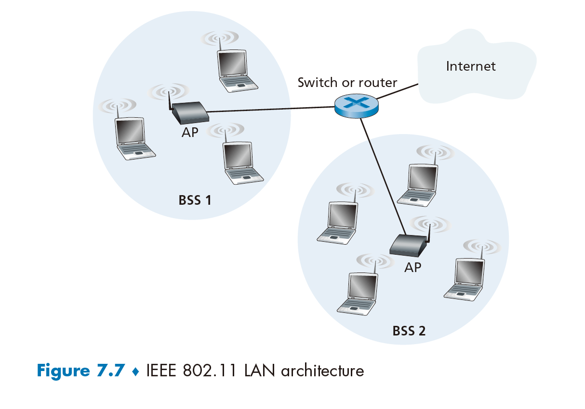

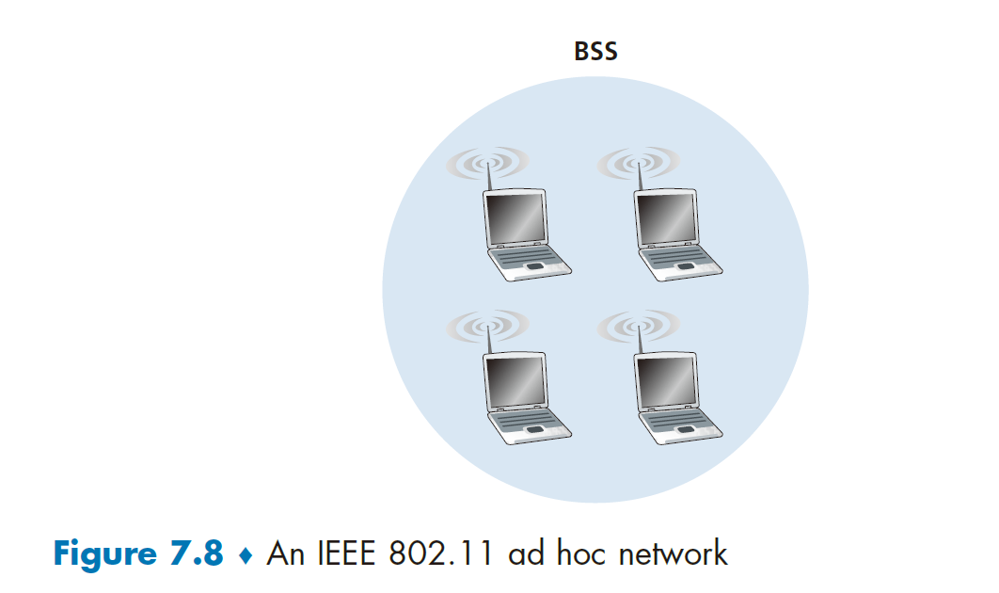

**信道与关联**

在 802.11 中，每个无线站点在能够发送或者接收网络层数据之前，必须与一个 AP 相关联。尽管所有 802.11 标准都使用了关联，但我们将专门在 IEEE 802.11 b/g 环境中讨论这一主题。

当网络管理员安装一个 AP 时，管理员为该接入点分配一个单字或双字的 **服务集标识符(Service Set Identifier, SSID)**。(例如，当你在 iPhone 上选择设置 WiFi 时，将显示某范围内每个 AP 的 SSID)管理员还必须为该 AP 分配一个信道号。为了理解信道号，回想前面讲过的 802.11 运行在 2.4-2.4835GHz 的频段中。在这个 85MHz 的频段内，802. 11 定义了 11 个部分重叠的信道。当且仅当两个信道由 4 个或更多信道隔开时它们才无重叠。特别是信道 1、6 和 11 的集合是唯一的 3 个非重叠信道的集合。这意味着管理员可以在同一个物理网络中安装 3 个 802.lib AP,为这些 AP 分配信道 1、6 和 11，然后将每个 AP 都连接到一台交换机上。

既然已经对 802. 11 信道有了基本了解，我们则可以描述一个有趣(且并非完全不寻常)的情况，即有关 WiFi 丛林。**WiFi 丛林(WiFi jungle)** 是一个任意物理位置，在这里无线站点能从两个或多个 AP 中收到很强的信号。例如，在纽约城的许多咖啡馆中，无线站点可以从附近许多 AP 中选取一个信号。其中一个 AP 可能由该咖啡馆管理，而其他 AP 可能位于咖啡馆附近的住宅区内。这些 AP 中的每一个都可能位于不同的子网中，并被独立分配一个信道。

现在假定你带着自己的手机、平板电脑或便携机进入这样一个 WiFi 丛林，寻求无线因特网接入和一个蓝莓松饼。设在这个丛林中有 5 个 AP。为了获得因特网接入，你的无线站点需要加入其中一个子网并因此需要与其中的一个 AP 相 **关联(associate)**。关联意味着这一无线站点在自身和该 AP 之间创建一个虚拟线路。特别是，仅有关联的 AP 才向你 的无线站点发送数据帧，并且你的无线站点也仅仅通过该关联 AP 向因特网发送数据帧。然而，你的无线站点是如何与某个特定的 AP 相关联的？更为根本的问题是，你的无线站点是如何知道哪个 AP 位于该丛林呢？

802.11 标准要求每个 AP 周期性地发送 **信标帧(beacon frame)**，每个信标帧包括该 AP 的 SSID 和 MAC 地址。你的无线站点为了得知正在发送信标帧的 AP,扫描 11 个信道，找出来自可能位于该区域的 AP 所发出的信标帧(其中一些 AP 可能在相同的信道中传输, 即这里有一个丛林！)。通过信标帧了解到可用 AP 后，你(或者你的无线主机)选择一个 AP 用于关联。

802.11 标准没有指定选择哪个可用的 AP 进行关联的算法；该算法被遗留给 802.11 固件和无线主机的软件设计者。通常，主机选择接收到的具有最高信号强度的信标帧。虽然高信号强度好（例如可参见图 7-3）,信号强度将不是唯一决定主机接收性能的 AP 特性。特别是，所选择的 AP 可能具有强信号，但可能被其他附属的主机（将需要共享该 AP 的无线带宽）所过载，而某未过载的 AP 由于稍弱的信号而未被选择。选择 AP 的一些可替代的方法近来已被提出[Vasudevan 2005 ； Nicholson 2006； Sudaresan 2006 ]。有关信号强度如何测量的有趣而朴实的讨论参见[Bardwell 2004]。

扫描信道和监听信标帧的过程被称为 **被动扫描(passive scanning)**（参见图 7-9a）。无线主机也能够执行 **主动扫描(active scanning)**，这是通过向位于无线主机范围内的所有 AP 广播探测帧完成的，如图 7-9b 所示。AP 用一个探测响应帧应答探测请求帧。无线主机则能够在响应的 AP 中选择某 AP 与之相关联。


选定与之关联的 AP 后，无线主机向 AP 发送一个关联请求帧，并且该 AP 以一个关联响应帧进行响应。注意到对于主动扫描需要这种第二次请求/响应握手，因为一个对初始探测请求帧进行响应的 AP 并不知道主机选择哪个（可能多个）响应的 AP 进行关联，这与 DHCP 客户能够从多个 DHCP 服务器进行选择有诸多相同之处（参见图 4-24）。一旦与 一个 AP 关联，该主机希望加入该 AP 所属的子网中（以 4-3-3 节中的 IP 寻址的意义）。 因此。该主机通常将通过关联的 AP 向该子网发送一个 DHCP 发现报文（参见图 4-24），以获取在该 AP 子网中的一个 IP 地址。一旦获得地址，网络的其他部分将直接视你的主机 为该子网中的另一台主机。

为了与特定的 AP 创建一个关联，某无线站点可能要向该 AP 鉴别它自身。802.11 无线 LAN 提供了几种不同的鉴别和接入方法。一种被许多公司采用的方法是，基于一 个站点的 MAC 地址允许其接入一个无线网络。第二种被许多因特网咖啡屋采用的方法 是，应用用户名和口令。在两种情况下，AP 通常与一个鉴别服务器进行通信，使用一 种诸如 RADIUS [RFC 2865]或 DIAMETER [RFC 6733]的协议，在无线终端站和鉴别 服务器之间中继信息。分离鉴别服务器和 AP，使得一个鉴别服务器可以服务于多个 AP，将（经常是敏感的）鉴别和接入的决定集中到单一服务器中，使 AP 费用和复杂性较低。我们将在第 8 章看到，定义 802.11 协议族安全性的新 IEEE 802.11 i 协议就恰好采用了这一方法。

### 7.3.2. 802.11 MAC 协议

一旦某无线站点与一个 AP 相关联，它就可以经该接入点开始发送和接收数据帧。然而因为许多无线设备或 AP 自身可能希望同时经过相同信道传输数据帧，因此需要一 个多路访问协议来协调传输。下面，我们将无线设备或 AP 称为 **站点(station)**，它们共享多个接入信道。正如在第 6 章和 7-2-1 节中讨论的那样，宽泛地讲有三类多路访问协 议：信道划分（包括 CDMA）、随机访问和轮流。受以太网及其随机访问协议巨大成功的激励，802.11 的设计者为 802.11 无线 LAN 选择了一种随机访问协议。这个随机访问协议称作 **带碰撞避免的 CSMA(CSMA with collision avoidance)**，或简称为 CSMA/CA。与以太网的 CSMA/CD 相似，CSMA/CA 中的“CSMA”代表“载波侦听多路访问”，意味着每个站点在传输之前侦听信道，并且一旦侦听到该信道忙则抑制传输。尽管以太网和 802. 11 都使用载波侦听随机接入，但这两种 MAC 协议有重要的区别。首先，802.11 使用碰撞避免而非碰撞检测。其次，由于无线信道相对较高的误比特率，802.11（不同于以太网）使用链路层确认/重传（ARQ）方案。我们将在下面讨论 802.11 的碰撞避免和链路层确认机制。

在 6-3-2 节和 6-4-2 节曾讲过，使用以太网的碰撞检测算法，以太网节点在发送过程 中监听信道。在发送过程中如果检测到另一节点也在发送，则放弃自己的发送，并且在等 待一个小的随机时间后再次发送。与 802.3 以太网协议不同，802.11 MAC 协议并未实现碰撞检测。这主要由两个重要的原因所致:

- 检测碰撞的能力要求站点具有同时发送（站点自己的信号）和接收（检测其他站 点是否也在发送）的能力。因为在 802.11 适配器上，接收信号的强度通常远远小于发送信号的强度，制造具有检测碰撞能力的硬件代价较大。
- 更重要的是，即使适配器可以同时发送和监听信号（并且假设它一旦侦听到信道 忙就放弃发送），适配器也会由于隐藏终端问题和衰减问题而无法检测到所有的碰撞，参见 7-2 节的讨论。

由于 802.11 无线局域网不使用碰撞检测，一旦站点开始发送一个帧，它就完全地发送该帧；也就是说，一旦站点开始发送，就不会返回。正如人们可能猜想的那样，碰撞存在时仍发送整个数据帧（尤其是长数据帧）将严重降低多路访问协议的性能。为了降低碰撞的可能性，802.11 采用几种碰撞避免技术，我们稍后讨论它们。

然而，在考虑碰撞避免之前，我们首先需要分析 802.11 的 **链路层确认(link-layer acknowledgment)** 方案。7-2 节讲过，当无线 LAN 中某站点发送一个帧时，该帧会由于多种原因不能无损地到达目的站点。为了处理这种不可忽视的故障情况，802.11 MAC 使用链路层确认。如图 7-10 所示，目的站点收到一个通过 CRC 校验的帧后，它等待一个被称作 **短帧间间隔(Short Inter-Frame Spacing, SIFS)** 的一小段时间，然后发回一个确认帧。 如果发送站点在给定的时间内未收到确认帧，它假定出现了错误并重传该帧，使用 CS-MA/CA 协议访问该信道。如果在若干固定次重传后仍未收到确认，发送站点将放弃发送并丢弃该帧。

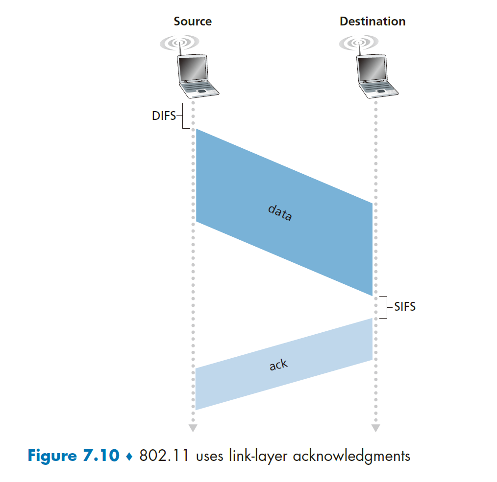

讨论过 802.11 如何使用链路层确认后，我们可以描述 802.11 的 CSMA/CA 协议了。 假设一个站点（无线站点或者 AP）有一个帧要发送。

(1) 如果某站点最初监听到信道空闲，它将在一个被称作 **分布式帧间间隔(DistributeInter-Frame Space, DIFS)** 的短时间段后发送该帧，
(2) 否则，该站点选取一个随机回退值（如我们在 6-3-2 节中遇到的那样）并且在侦听信道空闲时递减该值。当侦听到信道忙时，计数值保持不变。
(3) 当计数值减为 0 时（注意到这只可能发生在信道被侦听为空闲时），该站点发送整个数据帧并等待确认。
(4) 如果收到确认，发送站点知道它的帧已被目的站正确接收了。如果该站点要发送另一帧，它将从第二步开始 CSMA/CA 协议。如果未收到确认，发送站点将重新进入第二步中的回退阶段，并从一个更大的范围内选取随机值。

前面讲过，在以太网的 CSMA/CD 的多路访问 协议（6-3-2 节）下，一旦侦听到信道空闲，站点开始发送。然而，使用 CSMA/CA，该站点在倒计数时抑制传输，即使它侦听到该信道空闲也是如此。为什么 CSMA/CD 和 CSMA/CA 采用了不同的方法呢？

为了回答这一问题，我们首先考虑这样一种情形：两个站点分别有一个数据帧要发送，但是，由于侦听到第三个站点已经在传输，双方都未立即发送。使用以太网的 CSMA/CD 协议中, 两个站点将会在检测到第三方发送完毕后立即开始发送。这将导致一个碰撞，在 CSMA/CD 协议中碰撞并非是一个严重的问题，因为两个站点检测到碰撞后都会放弃它们的发送, 从而避免了由于碰撞而造成的该帧剩余部分的无用发送。而在 802.11 中情况却十分不同，因为 802.11 并不检测碰撞和放弃发送，遭受碰撞的帧仍将被完全传输。因此 802.11 的目标是无论如何尽可能避免碰撞。在 802.11 中，如果两个站点侦听到信道忙，它们都将立即进入随机回退，希望选择一个不同的回退值。如果这些值的确不同，一旦信道空闲，其中的一个站点将在另一个之前发送，并且（如果两个站点均未对对方隐藏）“失败站点”将会听到“胜利站点”的信号，冻结它的计数器，并在胜利站点完成传输之前一直抑制传输。通过这种方式，避免了髙代价的碰撞。当然，在以下情况下使用 802.11 仍可能出现碰撞：两个站点可能互相是隐藏的，或者两者可能选择了非常靠近的随机回退值，使来自先开始站点的传输也必须到达第二个站点。回想前面我们在图 6-12 的环境中讨论随机访问算法时遇到过这个问题。

1. **处理隐藏终端：RTS 和 CTS**

802.11 MAC 协议也包括了一个极好（但为可选项）的预约方案，以帮助在出现隐藏终端的情况下避免碰撞。我们在图 7-11 的环境下研究这种方案，其中显示了两个无线站点和一个接入点。

这两个无线站点都在该 AP 的覆盖范围内(其覆盖范围显示为阴影圆环)，并且两者都与该 AP 相关联。然而，由于衰减，无线节点的信号范围局限在图 7-11 所示的阴影圆环内部。因此，尽管每个无线站点对 AP 都不隐藏，两者彼此却是隐藏的。


现在我们考虑为什么隐藏终端会导致出现问题。假设站点 H1 正在传输一个帧，并且在 H1 传输的中途，站点 H2 要向 AP 发送一个帧。由于 H2 未听到来自 H1 的传输，它将首先等待一个 DIFS 间隔，然后发送该帧，导致产生了一个碰撞。从而在 H1 和 H2 的整个发送阶段，信道都被浪费了。

为了避免这一问题，IEEE 802.11 协议允许站点使用一个 **短请求发送(Request to Send, RTS)** 控制帧和一个 **短允许发送(Clear to Send, CTS)** 控制帧来预约对信道的访问。当发送方要发送一个 data 帧时，它能够首先向 AP 发送一个 RTS 帧，指示传输 DATA 帧和确认(ACK)帧需要 的总时间。当 AP 收到 RTS 帧后，它广播一个 CTS 帧作为响应。该 CTS 帧有两个目的：给发送方明确的发送许可，也指示其他站点在预约期内不要发送。

因此，在图 7-12 中，在传输 DATA 帧前，H1 首先广播一个 RTS 帧，该帧能被 其范围内包括 AP 在内的所有站点听到。 AP 然后用一个 CTS 帧响应，该帧也被其范围内包括 H1 和 H2 在内的所有站点听到。站点 H2 听到 CTS 后，在 CTS 帧中指明的时间内将抑制发送。RTS、CTS、 DATA 和 ACK 帧如图 7-12 所示。RTS 和 CTS 帧的使用能够在两个重要方面提高性能：


- 隐藏终端问题被缓解了，因为长 DATA 帧只有在信道预约后才被传输。
- 因为 RTS 和 CTS 帧较短，涉及 RTS 和 CTS 帧的碰撞将仅持续短 RTS 和 CTS 帧的持续期。一旦 RTS 和 CTS 帧被正确传输，后续的 DATA 和 ACK 帧应当能无碰撞地发送。

尽管 RTS/CTS 交换有助于降低碰撞，但它同样引入了时延以及消耗了信道资源。因此，RTS/CTS 交换仅仅用于为长数据帧预约信道。在实际中，每个无线站点可以设置一个 RTS 门限值，仅当帧长超过门限值时，才使用 RTS/CTS 序列。对许多无线站点而言，默认的 RTS 门限值大于最大帧长值，因此对所有发送的 DATA 帧，RTS/CTS 序列都被跳过。

2. **使用 802.11 作为一个点对点链路**

到目前为止我们的讨论关注在多路访问环境中使用 802.11。应该指出，如果两个节点每个都具有一个定向天线，它们可以将其定向天线指向对方，并基本上是在一个点对点的 链路上运行 802.11 协议。如果商用 802.11 硬件产品价格低廉，那么使用定向天线以及增 加传输功率使得 802.11 成为一个在数十公里距离中提供无线点对点连接的廉价手段。 [Raman 2007]描述了这样一个运行于印度恒河郊区平原上的多跳无线网络，其中包含了 点对点 802.11 链路。

### 7.3.3. IEEE 802.11 帧

尽管 802.11 帧与以太网帧有许多共同特点，但它也包括了许多特定用于无线链路的 字段。802.11 帧如图 7-13 所示，在该帧上的每个字段上面的数字代表该字段以字节计的长度；在该帧控制字段中，每个子字段上面的数字代表该子字段以比特计的长度。现在我们查看该帧中各字段以及帧控制字段中一些重要的子字段。


1. **有效载荷与 CRC 字段**

帧的核心是有效载荷，它通常是由一个 IP 数据报或者 ARP 分组组成。尽管这一字段允许的最大长度为 2312 字节，但它通常小于 1500 字节，放置一个 IP 数据报或一个 ARP 分组。如同以太网帧一样，802.11 帧包括一个循环冗余校验（CRC）,从而接收方可以检 测所收到帧中的比特错误。如我们所看到的那样，比特错误在无线局域网中比在有线局域网中更加普遍，因此 CRC 在这里更加有用。

2. **地址字段**

也许 802.11 帧中最引人注意的不同之处是它具有 4 个地址字段，其中每个都可以包含一个 6 字节的 MAC 地址。但为什么要 4 个地址字段呢？如以太网中那样，一个源 MAC 地址字段和一个目的 MAC 地址字段不就足够了？事实表明，出于互联目的需要 3 个地址字段，特别是将网络层数据报从一个无线站点通过一个 AP 送到一台路由器接口。当 AP 在自组织模式中互相转发时使用第四个地址。由于我们这里仅仅考虑基础设施网络，所以只关注前 3 个地址字段。802.11 标准定义这些字段如下：

- 地址 2 是传输该帧的站点的 MAC 地址。因此，如果一个无线站点传输该帧，该站 点的 MAC 地址就被插入在地址 2 字段中。类似地，如果一个 AP 传输该帧，该 AP 的 MAC 地址也被插入在地址 2 字段中。
- 地址 1 是要接收该帧的无线站点的 MAC 地址。因此，如果一个移动无线站点传输 该帧，地址 1 包含了该目的 AP 的 MAC 地址。类似地，如果一个 AP 传输该帧, 地址 1 包含该目的无线站点的 MAC 地址。
- 为了理解地址 3，回想 BSS （由 AP 和无线站点组成）是个子网的一部分，并且这个子网经一些路由器接口与其他子网相连。地址 3 包含这个路由器接口的 MAC 地址。

为了对地址 3 的目的有更深入的理解，我们观察在图 7-14 环境中的网络互联的例子。在这幅图中，有两个 AP，每个 AP 负责一些无线站点。每个 AP 到路由器有一个直接连接，路由器依次又连接到全球因 特网。我们应当记住 AP 是链路层设备，它既不能“说” IP 又不理解 IP 地址。现在考虑将一个数据报从路由器接口 R1 移到无线站点 H1。路由器并不清楚在它和 H1 之间有一个 AP；从路由器的观点来说，H1 仅仅是路由器所连接的子网中的一台主机。


- 路由器知道 H1 的 IP 地址（从数据报的目的地址中得到），它使用 ARP 来确定 H1 的 MAC 地址，这与在普通的以太网 LAN 中相同。获取 H1 的 MAC 地址后，路由器接口 R1 将该数据报封装在一 个以太网帧中。该帧的源地址字段包含了 R1 的 MAC 地址，目的地址字段包含 H1 的 MAC 地址。
- 当该以太网帧到达 AP 后，该 AP 在将其传输到无线信道前，先将该 802.3 以太网 帧转换为一个 802.11 帧。如前所述，AP 将地址 1 和地址 2 分别填上 H1 的 MAC 地址和其自身的 MAC 地址。对于地址 3，AP 插入 R1 的 MAC 地址。通过这种方式，H1 可以确定（从地址 3）将数据报发送到子网中的路由器接口的 MAC 地址。

现在考虑在从 H1 移动一个数据报到 R1 的过程中无线站点 H1 进行响应时发生的情况。

- H1 生成一个 802.11 帧，如上所述，分别用 AP 的 MAC 地址和 H1 的 MAC 地址填 充地址 1 和地址 2 字段。对于地址 3，H1 插入 R1 的 MAC 地址。
- 当 AP 接收该 802.11 帧后，将其转换为以太网帧。该帧的源地址字段是 H1 的 MAC 地址，目的地址字段是 R1 的 MAC 地址。因此，地址 3 允许 AP 在构建以太网帧时能够确定目的 MAC 地址。

总之，地址 3 在 BSS 和有线局域网互联中起着关键作用。

3. **序号、持续期和帧控制字段**

前面讲过在 802.11 网络中，无论何时一个站点正确地收到一个来自于其他站点的帧, 它就回发一个确认。因为确认可能会丢失，发送站点可能会发送一个给定帧的多个副本。 正如我们在 rdt 2.1 协议讨论中所见（3-4-1 节），使用序号可以使接收方区分新传输的帧和以前帧的重传。因此在 802.11 帧中的序号字段在链路层与在第 3 章中运输层中的该字段有着完全相同的目的。

前面讲过 802.11 协议允许传输节点预约信道一段时间，包括传输其数据帧的时间和传输确认的时间。这个持续期值被包括在该帧的持续期字段中（在数据帧和 RTS 及 CTS 帧中均存在）。

如图 7-13 所示，帧控制字段包括许多子字段，我们将提一下其中比较重要的子字段，更加完整的讨论请参见 802.11 规范［Held 2001 ； Crow 1997； IEEE 802.11 1999］。类型和子类型字段用于区分关联、RTS、CTS、ACK 和数据帧。To（到）和 From（从）字段用于定义不同地址字段的含义。（这些含义随着使用自组织模式或者基础设施模式而改变，而且在使用基础设施模式时，也随着是无线站点还是 AP 在发送帧而变化。）最后，WEP 字段指示了是否使用加密（WEP 将在第 8 章中讨论。）

### 7.3.4. 在相同的 IP 子网中的移动性

为了增加无线 LAN 的物理范围，公司或大学经常会在同一个 IP 子网中部署多个 BSS。这自然就引出了在多个 BSS 之间的移动性问题，即无线站点如何在维持进行中的 TCP 会话的情况下，无缝地从一个 BSS 移动到另一个 BSS？正如我们将在本小节中所见，当这些 BSS 属于同一子网时，移动性可以用一种相对直接的方式解决。当站点在不同子网间移动时，就需要更为复杂的移动性管理协议了，我们将在 7-5 节和 7-6 节中学习这些协议。

我们现在看一个同一子网中的不同 BSS 之间的移动性的特定例子。图 7-15 显示了具有一台主机 H1 的两个互联的 BSS,该主机从 BSS1 移动到 BSS2O 因为在这个例子中连接两个 BSS 的互联设备不是一台路由器，故在两个 BSS 中的所有站点（包括 AP）都属于同一个 IP 子网。因此，当 H1 从 BSS1 移动到 BSS2 时，它 可以保持自己的 IP 地址和所有正在进行的 TCP 连接。如果互联设备是一台路由器，则 H1 必须在它移动进入的子网中获得一个新地址。这种地址的变化将打断（并且最终终止）在 H1 的任何 进行中的 TCP 连接。在 7-6 节中，我们将能看到 一种网络层移动性协议如移动 IP 能被用于避免该问题。

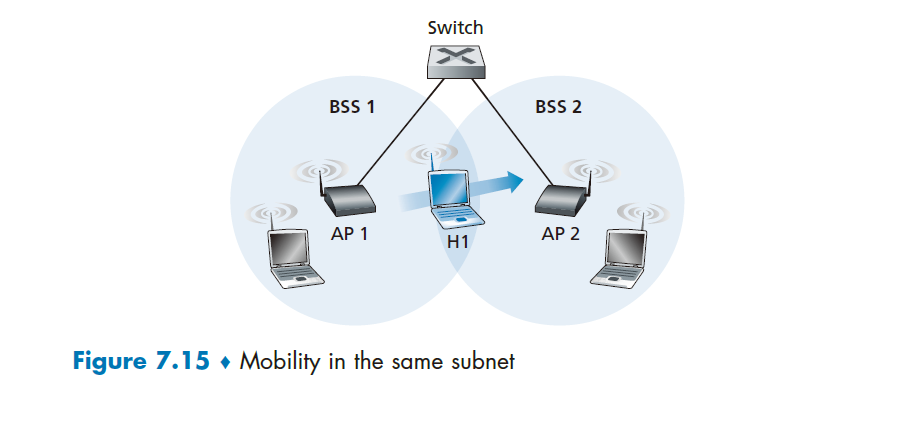

但是 H1 从 BSS1 移动到 BSS2 时具体会发生哪些事呢？随着 H1 逐步远离 AP1，H1 检测到来自 AP1 的信号逐渐减弱并开始扫描一个更强的信号。H1 收到来自 AP2 的信标帧（在许多公司和大学的设置中它与 API 有相同的 SSID）。H1 然后与 AP1 解除关联，并与 AP2 关联起来，同时保持其 IP 地址和维持正在进行的 TCP 会话。

从主机和 AP 的角度，这就处理了切换问题。但对图 7-15 中的交换机又会发生什么样 的情况呢？交换机如何知道主机已经从一个 AP 移动到另一个 AP 呢？回想第 6 章所述，交换机是“自学习”的，并且自动构建它们的转发表。这种自学习的特征很好地处理了偶尔的移动（例如，一个雇员从一个部门调转到另一个部门）。然而，交换机没有被设计用 来支持用户在不同 BSS 间高度移动，同时又希望保持 TCP 连接。为理解这一问题，回想在移动之前，交换机在其转发表中有一个表项，对应 H1 的 MAC 地址与到达 H1 所通过的出交换机端口。如果 H1 初始在 BSS1 中，则发往 H1 的数据报将经 AP1 导向 H1。然而，一旦 H1 与 BSS2 关联，它的帧应当被导向 AP2O 一种解决方法（真有点不规范）是在新的关联形成后，让 AP2 以 H1 的源地址向交换机发送一以太网广播帧。当交换机收到该帧后，更新其转发表，使得 H1 可以通过 AP2 到达。802.11 f 标准小组正在开发一个 AP 间的协议来处理这些以及相关的问题。

我们以上的讨论关注了在相同 LAN 子网中的移动性。前面我们在 6-4-4 节学习过 VLAN, 它能够用来将若干 LAN 孤岛连接成为一个大虚拟 LAN，该虚拟 LAN 能够跨越很大的地理范围。在这种 VALN 中的基站之间的移动性能够以上述完全相同的方式来处理［Yu 2011］。

### 7.3.5. 802.11 中的高级特色

我们将简要地讨论 802.11 网络中具有的两种高级能力，以此来完成我们学习 802.11 的内容。如我们所见，这些能力并不是完全特定于 802.11 标准的，而是在该标准中可能由特定机制产生的。这使得不同的厂商可使用他们自己（专用）的方法来实现这些能力，这也许能让他们增强竞争能力。

1. **802.11 速率适应**

我们在前面图 7-3 中看到，不同的调制技术（提供了不同的传输速率）适合于不同的 SNR 情况。考虑这样一个例子，一个 802. 11 用户最初离基站 20 米远，这里信噪比高。在此高信噪比的情况下，该用户能够与基站使用可提供高传输速率的物理层调制技术进行通 信，同时维持低 BER。这个用户多么幸福啊！假定该用户开始移动，向离开基站的方向走去，随着与基站距离的增加，SNR 一直在下降。在这种情况下，如果在用户和基站之间运行的 802.11 协议所使用的调制技术没有改变的话，随着 SNR 减小，BER 将高得不可接受，最终，传输的帧将不能正确收到。

由于这个原因，某些 802.11 实现具有一种速率自适应能力，该能力自适应地根据当前和近期信道特点来选择下面的物理层调制技术。如果一个节点连续发送两个帧而没有收- 到确认（信道上一个比特差错的隐式指示），该传输速率降低到前一个较低的速率。如果 10 个帧连续得到确认，或如果用来跟踪自上次降速以来时间的定时器超时，该传输速率 提高到上一个较高的速率。这种速率适应机制与 TCP 的拥塞控制机制具有相同的“探测” 原理，即当条件好时（反映为收到 ACK），增加传输速率，除非某个“坏事”发生了（ACK 没有收到）；当某个“坏事”发生了，减小传输速率。因此，802.11 的速率适应和 TCP 的拥塞控制类似于年幼的孩子，他们不断地向父母要求越来越多（如幼儿要糖果，青少年要求推迟睡觉），直到父母亲最后说“够了！”，孩子们不再要求了（仅当以后情况已 经变好了才会再次尝试）。已经提出了一些其他方案以改善这个基本的自动速率调整方案 ［Kamerman 1997 ； Holland 2001 ； Lac age 2004]。

2. **功率管理**

功率是移动设备的宝贵资源，因此 802.11 标准提供了功率管理能力，以使 802.11 节点的侦听、传输和接收功能以及其他需要“打开”电路的时间量最小化。802.11 功率管理按下列方式运行。一个节点能够明显地在睡眠和唤醒状态之间交替（像在课堂上睡觉的学生！）。通过将 802.11 帧首部的功率管理比特设置为 1，某节点向接入点指示它将打算睡眠。设置节点中的一个定时器，使得正好在 AP 计划发送它的信标帧前唤醒节点（前面讲过 AP 通常每 100ms 发送一个信标帧）。因为 AP 从设置的功率传输比特知道哪个节点打算睡眠，所以该 AP 知道它不应当向这个节点发送任何帧，先缓存目的地为睡眠主机的任何帧，待以后再传输。

在 AP 发送信标帧前，恰好唤醒节点，并迅速进入全面活动状态（与睡觉的学生不同，这种唤醒仅需要 250 微秒［Kamerman 1997］）。由 AP 发送的信标帧包含了帧被缓存在 AP 中的节点的列表。如果某节点没有缓存的帧，它能够返回睡眠状态。否则，该节点能够通过向 AP 发送一个探询报文明确地请求发送缓存的帧。对于信标之间的 100ms 时间来说，250 微秒的唤醒时间以及类似的接收信标帧及检查以确保不存在缓存帧的短小时间，没有帧要发送和接收的节点能够睡眠 99%的时间，从而大大节省了能源。

### 7.3.6. 个人域网络：蓝牙

蓝牙网络似乎已经很快成为日常生活的一部分。也许你曾使用蓝牙网络替代网线来连接你的电脑和一个无线键盘，无线鼠标，或其他外设。也或许，你曾使用蓝牙网络来连接你的无线耳机，扬声器，手表，或者健康监测手环到你的智能手机，或者连接智能手机到汽车的音频系统。在所有这些使用场景中，蓝牙以低功率运作一个短距离（小于 10m）之上。由于这个原因，蓝牙网络有时被称为 **无线个人域网络(wireless personal area networks, WPAN)** 或 **piconet**。

尽管蓝牙在设计上是相对简单的，但蓝牙也应用到了我们以前讨论过的很多链路层技术，包括时分复用，频分复用(6-3-1 节)，随机回撤(6-3-2 节)，轮询(6-3-3 节)，错误检测和修正(6-2 节)，通过肯定确认和否定确认的可靠数据传输(3-4-1 节)。而且这仅仅考虑了蓝牙的链路层。

蓝牙网络在无许可证的 2.4GHz 工业、科学和医疗（ISM）无线电频段内运行，和其他家用电器如微波炉、车库门开启器和无绳电话一样。因此，蓝牙网络的设计明确考虑到了噪音和干扰。蓝牙无线通道以 TDM 方式运行，时隙为 625 微秒。在每个时隙中，发送者在 79 个信道中的一个进行传输，信道（频率）以已知但伪随机的方式从一个时隙变化到另一个时隙。这种跳信道的形式，被称为 **跳频扩展频(Frequency-Hopping Spread Spectrum, FHSS)**，是为了让在 ISM 频段工作的另一个设备或电器的干扰只在最多一个子集的时隙中干扰蓝牙通信。蓝牙的数据速率可以达到 3Mbps。

蓝牙网络是自组织网络：不需要网络基础设施（如一个接入点）来互连设备。相反，蓝牙设备将他们组织进一个最多可支持 8 个设备 piconet，如图 7-16 所示。其中一个设备被设计为主设备，其他设备为客户。

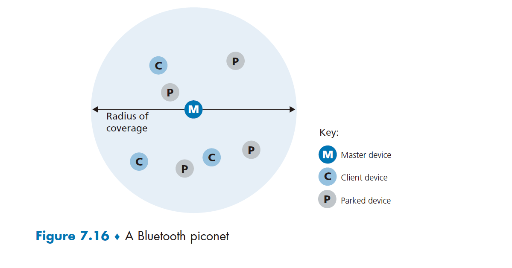

主节点真正控制着 piconet：它的时钟决定了 piconet 中的时间（例如，决定 TDM 时隙的边界），它决定时隙与时隙之间的跳频序列，它控制客户设备进入 piconet，它控制客户设备传输的功率（100 毫瓦、2.5 毫瓦或 1 毫瓦），并使用轮询来授予客户在进入网络后进行传输的许可。除了活动设备，在 piconet 中还可以有多达 255 个 "停放 "设备。这些停放的设备通常处于某种形式的 "睡眠模式"，以节约能源（正如我们在 802.11 电源管理中看到的那样），并将根据主站的时间表定期唤醒，以接收主站的信标信息。在主节点将其状态从停放变为激活之前，停放的设备不能进行通信。

因为蓝牙网络必须是自组织的，所以值得研究它们是如何引导其网络结构的。当一个主节点想形成一个蓝牙网络时，它必须首先确定哪些其他蓝牙设备在范围内；这就是邻居发现问题。主节点通过广播一系列的 32 个询问信息来完成这个任务，每个信息都在不同的频率通道上，并且重复传输序列多达 128 次。客户端设备在其选择的频率上进行监听，希望能在这个频率上听到主设备的一个询问信息。当它听到一个询问信息时，它会在 0 到 0.3 秒之间随机退后一段时间（以避免与其他响应节点发生碰撞，让人想起以太网的二进制回撤），然后用一个包含其设备 ID 的信息回应主设备。

一旦蓝牙主控器发现了范围内的所有潜在客户，它就会邀请那些它希望加入 piconet 的客户。这第二阶段被称为蓝牙寻呼，让人想起 802.11 客户与基站的联系。通过寻呼过程，主控方将告知客户要使用的跳频模式，以及发送方的时钟。主站通过再次发送 32 个相同的寻呼邀请信息开始寻呼过程，每个信息现在都是针对一个特定的客户，但再次使用不同的频率，因为该客户还没有学会跳频模式。一旦客户对寻呼邀请信息作出 ACK 回复，主站就会向客户发送跳频信息、时钟同步信息和活动成员地址，然后最后使用跳频模式对客户进行轮询，以确保客户连接到网络。

在我们上面的讨论中，我们只涉及了蓝牙的无线网络。更高层次的协议提供了可靠的数据包传输，类似电路的音频和视频流，改变传输功率水平，改变活动/停放状态（和其他状态），等等。更多最新版本的蓝牙已经解决了低能量和安全方面的考虑。关于蓝牙的更多信息，感兴趣的读者应该参考[Bisdikian 2001, Colbach 2017, and Bluetooth 2020]。

## 7.4. 蜂窝网络：4G 和 5G

在上一节中，我们研究了当主机在 802.11 WiFi 接入点（AP）附近时如何访问互联网。但正如我们所看到的，接入点的覆盖范围很小，主机当然不可能与它遇到的每一个接入点联系。因此，对于移动中的用户来说，WiFi 接入几乎是无处不在的。

相比之下，4G 蜂窝网络接入已迅速成为普遍现象。最近对 100 多万美国移动蜂窝网络用户的测量研究发现，他们在 90%以上的时间可以找到 4G 信号，下载速度达到 20Mbps 以上。韩国三大手机运营商的用户能够在 95-99.5%的时间内找到 4G 信号[Open Signal 2019]。因此，现在在汽车、公共汽车或高速列车上移动时，流式传输高清视频或参加视频会议是很常见的。4G 互联网接入的普遍性也使无数新的物联网应用成为可能，如与互联网连接的共享单车和滑板车系统，以及智能手机应用，如移动支付（自 2018 年以来在中国很普遍）和基于互联网的信息传递（微信、WhatsApp 等）。

蜂窝指的是，蜂窝网络覆盖的区域被划分为若干地理覆盖区域，称为 **小区(cell)**。每个小区包含一个 **基站(base station)**，向目前在其小区的 **移动设备(mobile device)** 发射信号，并接收信号。一个小区的覆盖范围取决于许多因素，包括基站的发射功率，设备的发射功率，小区中的障碍物，以及基站天线的高度和类型。

在这一节中，我们对当前的 4G 和新兴的 5G 蜂窝网络进行了概述。我们将考虑移动设备和基站之间的无线第一跳，以及蜂窝运营商的全 IP 核心网络，该网络将无线第一跳连接到运营商的网络、其他运营商的网络，以及更大的互联网。也许令人惊讶的是（考虑到移动蜂窝网络起源于电话世界，它的网络架构与互联网非常不同），我们将在 4G 网络中遇到许多我们在第 1-6 章中以互联网为重点的研究中遇到的架构原则，包括协议分层、边缘/核心的区别、多个供应商网络的互连以形成一个全球 "网络的网络"，以及数据和控制平面的明确分离与逻辑上的集中控制。我们现在将通过移动蜂窝网络的视角（而不是通过互联网的视角）来看待这些原则，从而看到这些原则以不同的方式得到体现。当然，由于运营商的网络有一个全 IP 的核心，我们也会遇到许多我们现在熟悉的互联网协议。在制定了这些主题所需的基本原则之后，我们将在第 7-6 节中介绍其他的 4G 主题：移动性管理，并在第 8-8 节中介绍 4G 安全。

我们在这里对 4G 和 5G 网络的讨论将相对简短。移动蜂窝网络是一个具有很大广度和深度的领域，许多大学都开设了关于该主题的若干课程。鼓励寻求更深入了解的读者参阅[Goodman 1997; Kaaranen 2001; Lin 2001; Korhonen 2003; Schiller 2003; Palat 2009; Scourias 2012; Turner 2012; Akyildiz 2010]，以及特别出色和详尽的书籍[Mouly 1992; Sauter 2014]。正如互联网 RFC 定义了互联网标准架构和协议一样，4G 和 5G 网络也由被称为技术规范的标准文件来定义。这些文件可在网上免费获取[3GPP 2020]。就像 RFC 一样，技术规范读起来相当密集和详细。但是，当你有问题时，它们是答案的最终来源！

### 7.4.1. 4G LTE 蜂窝网络：架构和基本组成

截至本文撰写时，2020 年普遍存在的 4G 网络实施的是 **4G 长期演进标准(Long-Term Evolution standard)**，或者更简洁的说是 **4G LTE**。在本节中，我们将介绍 4G LTE 网络。图 7-17 显示了 4G LTE 网络架构的基本组成。该网络大致分为蜂窝网络边缘的无线网络和核心网络。所有的网络基本组成都使用我们在第四章学习的 IP 协议相互通信。与早期的 2G 和 3G 网络一样，4G LTE 充满了相当晦涩的首字母缩写和基本组成名称。我们将尝试通过这种混乱的方式，首先关注网络基本组成的功能，以及 4G LTE 网络的各种网络基本组成如何在数据和控制平面上相互作用。


- **移动设备(Mobile Device)**。这是一个智能手机、平板电脑、笔记本电脑或物联网设备，连接到蜂窝运营商的网络。这是运行网络浏览器、地图应用、语音和视频会议应用、移动支付应用等应用的地方。移动设备通常实现了完整的 5 层互联网协议栈，包括传输层和应用层，正如我们在互联网网络边缘看到的主机。移动设备是一个网络端点，有一个 IP 地址（通过 NAT 获得，我们会看到）。移动设备也有一个全球唯一的 64 位标识符，称为 **国际移动用户身份(International Mobile Subscriber Identity, IMSI)**，它存储在其 SIM（用户身份模块）卡上。IMSI 在全球蜂窝运营商网络系统中识别用户，包括用户所属的国家和家庭蜂窝运营商网络。在某些方面，IMSI 类似于一个 MAC 地址。SIM 卡还存储了用户能够获得的服务信息和该用户的加密密钥信息。在 4G LTE 的官方行话中，移动设备被称为 **用户设备(User Equipment ,UE)**。然而，在这本教科书中，我们将始终使用更方便读者的术语“移动设备”。我们还注意到，移动设备并不总是移动的；例如，该设备可能是一个固定的温度传感器或一个监控摄像头。

- **基站(Base Station)**。基站位于运营商网络的“边缘”，负责管理无线射频资源和其覆盖区域内的移动设备。正如我们将看到的，移动设备将与基站互动，以连接到运营商的网络。基站协调设备认证和无线电接入网络中的资源分配（信道接入）。在这个意义上，蜂窝基站的功能与无线局域网中的接入点相类似（但绝非完全相同）。但是，蜂窝基站还有其他一些无线局域网中所没有的重要作用。特别是，基站创建了从移动设备到网关的设备专用 IP 隧道，并在它们之间进行互动，以处理设备在小区之间的移动。附近的基站还相互协调，管理无线电频谱，以减少小区之间的干扰。

- **家庭用户服务器(Home Subscriber Server, HSS)**。如图 7-18 所示，HSS 是一个控制平面板上的基本组成。HSS 是一个数据库，存储有关移动设备的信息，HSS 的网络是其家庭网络。它与 MME（下文讨论）一起用于设备认证。


- **服务网关(Serving Gateway, S-GW)、分组数据网络网关(Packet Data Network Gateway, P-GW)和其他网络路由器**。如图 7-18 所示，服务网关和分组数据网络网关是位于移动设备和互联网之间的数据路径上的两个路由器（在实践中通常是合在一起的）。PDN 网关还为移动设备提供 NAT IP 地址，并执行 NAT 功能（见 4-3-4 节）。PDN 网关是来自移动设备的数据报在进入大互联网之前遇到的最后一个 LTE 基本组成。在外界看来，P-GW 与其他网关路由器一样；蜂窝运营商 LTE 网络内的移动节点的移动性隐藏在 P-GW 后面，不为外界所知。除了这些网关路由器，蜂窝运营商的全 IP 核心将有额外的路由器，其作用类似于传统的 IP 路由器:沿着通常终止于 LTE 核心网络基本组成的路径在它们之间转发 IP 数据报。

- **移动性管理实体(Mobility Management Entity, MME)**。如图 7-18 所示，MME 也是一个控制平面板基本组成。与 HSS 一起，它在验证想要连接到其网络的设备方面起着重要作用。它还在设备和 PDN 互联网网关路由器之间的数据路径上设置隧道，并维护运营商蜂窝网络中活动移动设备的小区位置信息。但是，如图 7-18 所示，它不在移动设备与互联网之间的数据报的转发路径上。

  - **认证**。对于网络和连接到网络的移动设备来说，相互认证是很重要的：网络要知道连接的设备确实是与给定的 IMSI 相关的设备，而移动设备要知道它所连接的网络也是合法的蜂窝运营商网络。我们将在第 8 章介绍认证，并在第 8-8 节介绍 4G 认证。在这里，我们只需注意到 MME 在移动设备和移动设备家庭网络中的家庭用户服务（HSS）之间扮演了一个中间人的角色。具体来说，在收到来自移动设备的附加请求后，本地 MME 会联系移动家庭网络中的 HSS。然后，移动设备的主网 HSS 向本地 MME 返回足够的加密信息，以向移动设备证明主网 HSS 正在通过该 MME 进行认证，并让移动设备向 MME 证明它确实是与该 IMSI 相关的移动。当移动设备连接到其家庭网络时，在认证期间要联系的 HSS 位于同一家庭网络内。然而，当移动设备在一个由不同蜂窝网络运营商运营的访问网络上漫游时，该漫游网络中的 MME 将需要联系移动设备主网络中的 HSS。

  - **路径设置**。如图 7-18 下半部分所示，从移动设备到运营商的网关路由器的数据路径包括移动设备和基站之间的无线第一跳，以及基站和服务网关、服务网关和 PDN 网关之间的串联 IP 隧道。隧道在 MME 的控制下设置，用于数据转发（而不是在网络路由器之间直接转发），以促进设备的移动性--当设备移动时，只有终止于基站的隧道端点需要改变，而其他隧道端点以及与隧道相关的服务质量则保持不变。

  - **小区位置跟踪**。当设备在小区之间移动时，基站将更新 MME 的设备位置。如果移动设备处于睡眠模式，但仍在小区之间移动，基站就不能再跟踪设备的位置。在这种情况下，将由 MME 负责通过一个被称为 **寻呼(paging)** 的过程来定位设备以便唤醒。

下表总结了我们在上面讨论的关键 LTE 架构要素，并将这些功能与我们在研究 WiFi 无线局域网（WLAN）时遇到的功能进行了比较。

| LTE 基本组成                   | 描述                                                                        | 类似的 WLAN 功能                                      |
| ------------------------------ | --------------------------------------------------------------------------- | ----------------------------------------------------- |
| 移动设备(UE)                   | 终端用户的具有 IP 功能的无线/移动设备(例如，智能手机、平板电脑、笔记本电脑) | 主机，端系统                                          |
| 基站(eNode-B)                  | 进入 LTE 网络的无线接入链路的网络端                                         | 接入点（AP），尽管 LTE 基站执行许多 WLAN 中没有的功能 |
| 移动性管理实体(MME)            | 移动设备服务的协调者：认证、移动性管理                                      | 接入点（AP），尽管 MME 执行了许多 WLAN 中没有的功能   |
| 家庭用户服务器(HSS)            | 位于移动设备的家庭网络中，提供认证、家庭和访问网络中的访问权限              | 没有等价的事物                                        |
| 服务网关(S-GW)，PDN 网关(P-GW) | 蜂窝运营商网络中的路由器，协调转发到运营商网络以外的地方                    | 接入 ISP 网络中的 iBGP 和 eBGP 路由器                 |
| 无线电接入网                   | 移动设备和基站之间的无线链接                                                | 手机和 AP 之间的 802.11 无线链接                      |

### 7.4.2. LTE 协议栈

由于 4G LTE 架构是一个全 IP 架构，我们在第二章到第五章的学习中已经非常熟悉 LTE 协议栈中的高层协议，尤其是 IP、TCP、UDP 和各种应用层协议。因此，我们在这里要关注的新的 LTE 协议主要是在链路和物理层，以及移动性管理方面。

图 7-21 显示了 LTE 移动节点、基站和服务网关的用户面协议栈。以后我们在研究 LTE 移动性管理（第 7-6 节）和安全（第 8-8 节）时，会涉及 LTE 的几个控制平面协议。从图 7-21 可以看出，大部分新的、有趣的用户面协议活动都发生在移动设备和基站之间的无线链路上。

LTE 将移动设备的链路层分为了 3 个子层：

- **分组数据汇聚(Packet Data Convergence, PDC)**。这个链路层的最上层子层就在 IP 下面。分组数据汇聚协议（PDCP）[3GPP PDCP 2019]执行 IP 头/压缩，以减少通过无线链路发送的比特数，并使用密钥对 IP 数据报进行加密/解密，这些密钥是在移动设备首次连接到网络时通过 LTE 移动设备和移动管理实体（MME）之间的信令信息建立的；我们将在第 8-8-2 节介绍 LTE 安全方面。

- **无线电链路控制(Radio Link Control, RLC)**。无线电链路控制协议[3GPP RLCP 2018]执行两个重要功能。(i) 对太大而无法装入底层链路层帧的 IP 数据报进行分片（在发送方）和重新组装（在接收方），以及(ii) 通过使用基于 ACK/NAK 的 ARQ 协议，在链路层进行可靠的数据传输。回顾我们在第 3-4-1 节研究了 ARQ 协议的基本要素。

- **媒体访问控制(Medium Access Control, MAC)**。MAC 层执行传输调度，即请求和使用第 7-4-4 节中描述的无线电传输时隙。MAC 子层还执行额外的错误检测/纠正功能，包括使用冗余位传输作为前向错误纠正技术。冗余量可以根据信道条件进行调整。

图 7-21 还显示了在用户数据路径中使用隧道的情况。如上所述，这些隧道是在 MME 的控制下，在移动设备第一次连接到网络时建立的。两个端点之间的每个隧道都有一个唯一的 **隧道端点标识(tunnel endpoint identifier, TEID)**。当基站收到来自移动设备的数据报时，它会使用 GPRS 隧道协议[3GPP GTPv1-U 2019]对其进行封装，包括 TEID，并将其以 UDP 段发送至隧道另一端的服务网关。在接收端，基站解压缩隧道中的 UDP 数据报，提取以移动设备为目的地的封装的 IP 数据报，并将该 IP 数据报通过无线跳转转发给移动设备。

### 7.4.3. LTE 无线电接入网络

LTE 在下行信道上使用频分复用和时分复用的组合，被称为 **正交频分复用(Orthogonal Frequency Division Multiplexing, OFDM)**[Hwang 2009]。术语“正交”是指在不同频率的信道上发送的信号，即使信道频率间隔很近，它们之间的干扰也很小）。在 LTE 中，每个活动的移动设备在一个或多个信道频率中被分配一个或多个 0.5 毫秒的时隙。图 7-22 显示了在四个频率上分配的八个时隙。通过分配越来越多的时隙（无论是在同一频率还是在不同频率），移动设备能够实现越来越高的传输速率。移动设备之间的时隙（重新）分配可以经常进行，甚至每毫秒一次。不同的调制方案也可用于改变传输速率；见我们先前对图 7-3 和 WiFi 网络中调制方案的动态选择的讨论。


LTE 标准没有强制规定移动设备的特定时隙分配。相反，哪些移动设备将被允许在特定频率上的特定时隙中进行传输的决定是由 LTE 设备供应商和/或网络运营商提供的调度算法决定的。通过机会主义调度[Bender 2000; Kolding 2003; Kulkarni 2005]，将物理层协议与发送方和接收方之间的信道条件相匹配，并根据信道条件选择发送数据包的接收方，使基站能够充分利用无线媒介。此外，用户优先权和合同规定的服务等级（如银级、金级或白金级）可用于调度下行数据包的传输。除了上述的 LTE 功能外，LTE-Advanced 通过为移动设备分配聚合信道，可以实现数百 Mbps 的下行带 [Akyildiz 2010]。

### 7.4.4. 额外的 LTE 功能：网络附件和电源管理

在这里，让我们通过考虑另外两个重要的 LTE 功能来结束对 4G LTE 的研究：(i) 移动设备首次接入网络的过程，以及(ii) 移动设备与核心网络基本组成共同使用的技术，以管理其电力使用。

**网络附件**

移动设备连接到蜂窝运营商网络的过程大致分为三个阶段：

- **基站附件**。设备附件的第一阶段在目的上与我们在第 7.31 节中研究的 802.11 关联协议相似，但在实践中却大不相同。一个希望连接到蜂窝运营商网络的移动设备将开始一个自举过程，以了解并与附近的基站联系。移动设备最初会在所有频段的所有频道中搜索一个主要的同步信号，该信号由基站每 5 毫秒周期性地广播。一旦找到这个信号，移动设备就保持在这个频率上，并找到第二同步信号。通过在这个第二信号中发现的信息，该设备可以找到（经过几个进一步的步骤）额外的信息，如信道带宽，信道配置，以及该基站的蜂窝运营商信息。有了这些信息，移动设备可以选择一个基站与之联系（如果有的话，最好是连接到其家庭网络），并与该基站建立一个跨无线跳的控制平面信令连接。这个移动设备到基站的信道将在剩下的网络连接过程中使用。

- **相互认证**。在前面 7-4-1 节对移动性管理实体（MME）的描述中，我们注意到基站与本地 MME 联系以进行相互认证：我们将在 8-8-2 节中进一步研究这一过程。这是网络连接的第二阶段，允许网络知道连接的设备确实是与给定 IMSI 相关的设备，而移动设备知道它所连接的网络也是合法的蜂窝运营商网络。一旦这个网络连接的第二阶段完成，MME 和移动设备已经相互验证了对方，MME 也知道移动设备所连接的基站的身份。有了这些信息，MME 就可以准备配置移动设备到 PDN 网关的数据路径了。

- **移动设备到 PDN 网关的数据路径配置**。MME 与 PDN 网关（它也为移动设备提供一个 NAT 地址）、服务网关和基站联系，建立图 7-21 所示的两个隧道。一旦这个阶段完成，移动设备就能通过基站发送/接收 IP 数据报，并通过这些隧道进出互联网！（图 7-21）。

**电源管理：睡眠模式**

回顾我们之前对 802.11（第 7-3-5 节）和蓝牙（第 7-3-6 节）高级功能的讨论，无线设备中的无线电可以进入睡眠状态，以便在不发送或接收时节省电力，以尽量减少移动设备的电路需要 "打开 "发送/接收数据的时间，并用于信道感应。在 4G LTE 中，睡眠中的移动设备可以处于两种不同的睡眠状态之一。在不连续接收状态下，通常在几百毫秒的不活动后进入[Sauter 2014]，移动设备和基站将提前安排定期时间（通常相隔几百毫秒），在这些时间里，移动设备将被唤醒并积极监测下行（基站到移动设备）传输的信道；然而，除了这些预定时间外，移动设备的无线电将处于睡眠状态。

如果不连续的接收状态可以被认为是 "轻度睡眠"，那么第二个睡眠状态：空闲状态，在更长时间的 5 到 10 秒的不活动之后，可以被认为是 "深度睡眠"。在这种深度睡眠状态下，移动设备的无线电被唤醒，监测频道的频率更低。事实上，这种睡眠是如此之深，以至于如果移动设备在睡眠中移动到运营商网络中的一个新小区，它不需要通知它之前与之相关的基站。因此，当从这种深度睡眠中定期醒来时，移动设备将需要与一个（可能是新的）基站重新建立联系，以便检查由 MME 向移动设备最后联系的基站附近的基站广播的寻呼消息。这些控制平面寻呼信息是由这些基站向其所在小区的所有移动设备广播的，指示哪些移动设备应该完全唤醒并重新建立与基站的新数据平面连接（见图 7-18），以便接收传入的数据包。

### 7.4.5. 全球蜂窝网络：网络的网络

在研究了 4G 蜂窝网络架构之后，让我们退一步看看全球蜂窝网络：它本身就是一个像互联网一样的 "网络的网络"，是如何组织的。

图 7-23 显示了一个用户的移动智能手机通过一个 4G 基站连接到其家庭网络。用户的家庭移动网络由蜂窝运营商运营，如美国的 Verizon、AT&T、T-Mobile 或 Sprint；法国的 Orange；或韩国的 SK 电信。如图 7.23 所示，用户的家庭网络又通过家庭网络中的一个或多个网关路由器，与其他蜂窝运营商的网络和全球互联网相连。移动网络本身通过公共互联网或通过互联网协议包交换（IPX）网络相互连接[GSMA 2018a]。IPX 是一个专门用于蜂窝运营商互连的管理网络，类似于互联网交换点，用于互联网服务供应商之间的对接。从图 7-23 中，我们可以看到，全球蜂窝网络确实是一个 "网络的网络"：就像互联网一样。4G 网络也可以与 3G 蜂窝电话的语音/数据网络和早期的纯语音网络对等。


在制定了这些主题所需的基本原则后，我们很快就会回到其他 4G LTE 主题：第 7-6 节的移动性管理和第 8-8-2 节的 4G 安全。现在让我们快速了解一下新兴的 5G 网络。

### 7.4.6. 5G 蜂窝网络

最终的广域数据服务将是一种具有无处不在的千兆级连接速度、极低的延迟，以及对任何地区可支持的用户和设备数量不受限制的服务。这种服务将为各种新的应用打开大门，包括普遍的增强现实和虚拟现实，通过无线连接控制自动驾驶汽车，通过无线连接控制工厂里的机器人，以及用固定无线互联网服务（即从基站到家里的调制解调器的住宅无线连接）取代 DSL 和电缆等住宅接入技术。

预计 5G，其逐步改进的版本可能在 2020 年的十年中推出，将朝着实现最终广域数据服务的目标迈出一大步。据预测，与 4G 相比，5G 将提供大约 10 倍的峰值比特率，10 倍的延迟，以及 100 倍的流量容量[Qualcomm 2019]。

主要而言，5G 是指 "5G NR（新无线电）"，这是 3GPP 采用的标准。然而，除了 NR 之外，确实存在其他 5G 技术。例如，Verizon 专有的 5G TF 网络在 28 和 39GHz 的频率上运行，只用于固定无线互联网服务，不用于智能手机。

5G 标准将频率分为两组。FR1（450MHz-6GHz）和 FR2（24GHz-52GHz）。大多数早期部署将在 FR1 空间，尽管如上所述，截至 2020 年，在 FR2 空间有早期部署，用于固定互联网住宅接入。重要的是，5G 的物理层（即无线）方面不能向后兼容 4G 移动通信系统，如 LTE：特别是，它不能通过部署基站升级或软件更新提供给现有的智能手机。因此，在向 5G 过渡的过程中，无线运营商将需要对物理基础设施进行大量投资。

FR2 频率也被称为毫米波频率。虽然毫米波频率允许更快的数据速度，但它们也有两个主要缺点：

- 毫米波频率从基站到接收机的距离要短得多。这使得毫米波技术不适合在农村地区使用，在城市地区需要更密集地部署基站。
- 毫米波通信极易受到大气干扰。附近的树叶和雨水会给户外使用带来问题。

5G 不是一个凝聚力强的标准，而是由三个共存的标准组成[Dahlman 2018]：

- **eMBB(Enhanced Mobile Broadband)，增强型移动宽带**。5G NR 的最初部署集中在 eMBB 上，它为更高的下载和上传速度提供了更大的带宽，并且与 4G LTE 相比，适度降低了延迟。增强现实和虚拟现实，以及移动 4K 分辨率和 360° 视频流。
- **URLLC(Ultra Reliable Low-Latency Communications)**，超可靠的低延迟通信。URLLC 针对对延迟高度敏感的应用，如工厂自动化和自动驾驶。URLLC 的目标是 1 毫秒的延迟。截至本文撰写之时，实现 URLLC 的技术仍在标准化中。
- **mMTC(Massive Machine Type Communications)，大规模机器类型通信**。mMTC 是一种用于传感、计量和监测应用的窄带接入类型。5G 网络设计的一个重点是降低物联网设备的网络连接障碍。除了降低延迟外，5G 网络的新兴技术正专注于降低功率要求，使物联网设备的使用比 4G LTE 的使用更普遍。

**5G 和毫米波频率**

许多 5G 创新将是在 24GHz-52GHz 频段的毫米波频率下工作的直接结果。例如，这些频率有可能实现比 4G 增加 100 倍的容量。为了深入了解这一点，容量可以被定义为三个术语的乘积[Björnson 2017]：

```
容量 = 小区密度 * 可用频谱 * 频谱效率
```

其中小区密度以小区/km2 为单位，可用频谱以赫兹为单位，频谱效率是衡量每个基站与用户通信的效率，以 bps/Hz/小区为单位。将这些单位相乘，很容易看出容量的单位是 bps/km2。对于这三个术语中的每一个，5G 的值都会比 4G 的大。
因为毫米频率的范围比 4G LTE 频率短得多，需要更多的基站，这反过来又增加了小区密度。

- 因为 5G FR2 的工作频段比 4G LTE 大得多（最高约 2 GHz），它有更多的可用频谱。
- 关于频谱效率，信息理论说，如果你想把频谱效率提高一倍，需要增加 17 倍的功率[Björnson 2017]。5G 没有增加功率，而是使用 MIMO 技术（与我们在第 7-3 节研究 802.11 网络时遇到的技术相同），在每个基站使用多个天线。每个 MIMO 天线不是向所有方向广播信号，而是采用波束形成，将信号指向用户。MIMO 技术允许一个基站在同一频段内同时向 10-20 个用户发送信号。

通过增加容量等式中的所有三个项，5G 预计将在城市地区提供 100 倍的容量增长。同样，由于频带更宽，5G 有望提供 1Gbps 或更高的峰值下载速率。然而，毫米波信号很容易被建筑物和树木阻挡。

需要小型基站来填补基站和用户之间的覆盖空白。在一个人口众多的地区，两个小型基站之间的距离可能从 10 米到 100 米不等[Dahlman 2018]。

**5G 核心网络**

**5G 核心网络(5G Core Ntework)** 是管理所有 5G 移动语音、数据和互联网连接的数据网络。5G 核心网络正在被重新设计，以更好地与互联网和基于云的服务整合，还包括整个网络的分布式服务器和缓存，从而减少延迟。网络功能虚拟化（如第 4 章和第 5 章所讨论的），以及针对不同应用和服务的网络切片，将在核心区进行管理。

新的 5G 核心规范对移动网络支持各种不同性能的服务的方式带来了重大变化。与 4G 核心网的情况一样（回顾图 7.17 和 7.18），5G 核心网转发来自终端设备的数据流量，认证设备，并管理设备移动性。5G 核心网还包含我们在第 7.4.2 节中遇到的所有网元--移动设备、小区、基站和移动性管理实体（现在分为两个子基本组成，如下所述）、HSS 以及服务和 PDN 网关。

虽然 4G 和 5G 核心网络执行类似的功能，但在该新的 5G 核心架构中存在一些重大差异。5G 核心网是为完全控制和用户平面分离而设计的（见第五章）。5G 核心网纯粹由基于软件的虚拟化网络功能组成。这种新的架构将为运营商提供灵活性，以满足不同 5G 应用的不同要求。一些新的 5G 核心网络功能包括[Rommer 2019]。

- **用户平面功能(User-Plane Function, UPF)**。控制平面和用户面的分离（见第 5 章）允许数据包处理被分布并推送到网络边缘。
- **接入和移动管理功能(Access and Mobility Management Function, AMF)**。5G 核心基本上将 4G 移动性管理实体（MME）分解为两个功能基本组成。AMF 和 SMF。AMF 接收来自终端用户设备的所有连接和会话信息，但只处理连接和移动性管理任务。
- **会话管理功能(Session Management Function, SMF)**。会话管理由会话管理功能（SMF）处理。SMF 负责与解耦的数据平面进行交互。SMF 还执行 IP 地址管理并扮演 DHCP 的角色。

截至目前（2020 年），5G 正处于早期部署阶段，许多 5G 标准还没有最终确定。只有时间能证明 5G 是否会成为一种普遍的宽带无线服务，是否会成功地与 WiFi 竞争室内无线服务，是否会成为工厂自动化和自动驾驶汽车基础设施的重要组成部分，以及是否会使我们向终极广域无线服务迈进一大步。

## 7.5. 移动性管理：原则

在介绍了无线网络中通信链路的无线性质之后，现在我们应该把注意力转向这些无线链路所带来的移动性。在最广泛的意义上，移动设备是指随着时间的推移改变其在网络中的附着点。因为移动性这个词在计算机和电话领域都有很多含义，所以我们首先要仔细考虑移动性的形式，这对我们有好处。

### 7.5.1. 设备移动性：网络层的视角

从网络层的角度来看，物理移动设备将给网络层带来一系列非常不同的挑战，这取决于设备在网络连接点之间移动时的活跃程度。在光谱的一端，图 7-24 中的情况（a）是移动用户自己在网络之间进行物理移动，但移动时关闭移动设备的电源。例如，一个学生可能从无线教室网络断开，并关闭他/她的设备，前往餐厅，在吃饭时连接到那里的无线接入网络，然后从餐厅网络断开并关闭电源，走到图书馆，在学习时连接到图书馆的无线网络。从网络的角度来看，这个设备不是移动的--它附着在一个接入网络上，并且在开启时保持在该接入网络中。在这种情况下，设备连续地与所遇到的每个无线接入网络联系，然后又与之断开联系。这种设备（非）移动性的情况完全可以用我们在第 7-3 和 7-4 节已经研究过的网络机制来处理。

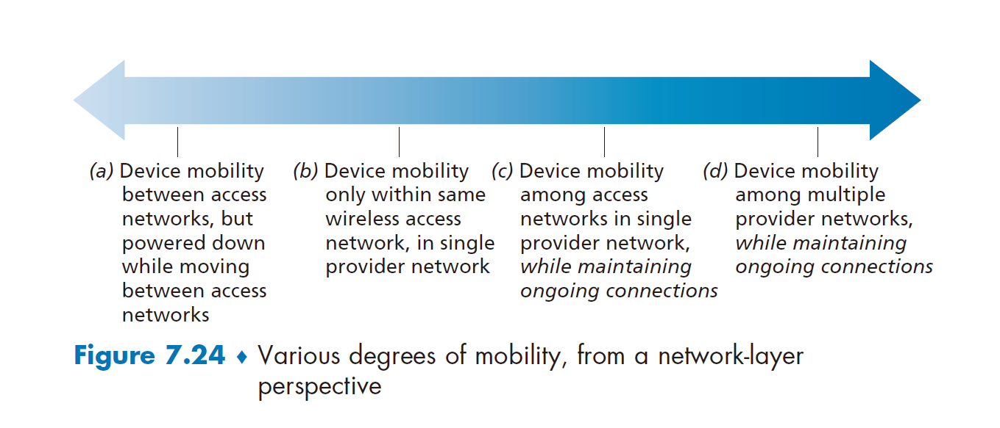

在图 7-24 中的情况（b）中，设备是物理移动的，但仍然连接到同一个接入网络。从网络层的角度来看，这个设备也是不移动的。此外，如果设备仍然与同一个 802.11 接入点或 LTE 基站相关联，从链路层的角度来看，该设备甚至不是移动的。

从网络的角度来看，我们对设备移动性的兴趣实际上是从情况（c）开始的，即设备在继续发送和接收 IP 数据报，并保持更高级别的（如 TCP）连接的同时，改变其接入网络（如 802.11 WLAN 或 LTE 小区）。在这里，网络将需要提供 **交接(handover)**：当设备在 WLAN 或 LTE 小区之间移动时，将转发数据报的责任转移到/从一个 AP 或基站到移动设备。我们将在第 7-6 节中详细介绍交接问题。如果交接发生在属于一个网络提供商的接入网络内，该提供商可以自行协调交接。当移动设备在多个供应商网络之间漫游时，如情况(d)，供应商必须共同协调交接，这使交接过程相当复杂。

### 7.5.2. 家庭网络和在被访问网络上的漫游

正如我们在第 7-4-1 节对蜂窝式 4G LTE 网络的讨论中所了解到的，每个用户都在某个蜂窝运营商那里有一个 "家"。我们了解到，**家庭用户服务(Home Subscriber Service, HSS)** 存储了每个用户的信息，包括全球唯一的设备 ID（嵌入在用户的 SIM 卡中）、用户可以访问的服务信息、用于通信的加密密钥以及账单/收费信息。当一个设备连接到其家庭网络以外的蜂窝网络时，该设备被称为在被访网络上 **漫游(roaming)**。当一个移动设备连接到一个被访网络并在该网络上漫游时，将需要在家庭网络和被访网络之间进行协调。

互联网没有类似于家庭网络或被访网络的强大概念。在实践中，一个学生的家庭网络可能是由他/她的学校运营的网络；对于移动专业人士来说，他们的家庭网络可能是他们的公司网络。被访问的网络可能是他们正在访问的学校或公司的网络。但是，在互联网的结构中并没有深深嵌入家庭/访问网络的概念。我们将在第 7-6 节简要介绍的移动 IP 协议[Perkins 1998, RFC 5944]，是一个强烈包含家庭/访问网络概念的提案。但移动 IP 在实践中的部署/使用有限。还有一些正在进行的活动是建立在现有的 IP 基础设施之上的，以提供跨访问 IP 网络的认证网络访问。Eduroam[Eduroam 2020]就是这样一项活动。

一个移动设备拥有一个家庭网络的概念提供了两个重要的优势：家庭网络提供了一个可以找到该设备信息的单一位置，并且（正如我们将看到的）它可以作为漫游移动设备的通信协调点。

为了理解信息和协调中心点的潜在价值，考虑一下人类的比喻：一个 20 多岁的成年人 Bob 搬出了家庭住宅。鲍勃开始流动，住在一系列的宿舍和公寓里，并经常改变地址。如果一个老朋友爱丽丝想要联系，爱丽丝如何才能找到鲍勃的当前地址？一个常见的方法是与家人联系，因为一个流动的 20 多岁的成年人往往会在家里登记他或她目前的地址（如果没有其他原因，那么父母可以寄钱来帮助支付租金！）。家庭住宅成为那个独特的地点，其他人可以去那里作为与鲍勃沟通的第一步。此外，后来来自 Alice 的邮政通信可能是间接的（例如，邮件首先被发送到 Bob 的家庭住宅，然后转发给 Bob）或直接的（例如，Alice 使用从 Bob 的父母那里获得的地址，直接将邮件发送给 Bob）。

### 7.5.3. 直接和间接路由至/自移动设备

现在让我们考虑一下图 7-25 中连接互联网的主机（我们将其称为通讯员）所面临的难题，该主机希望与移动设备进行通信，该设备可能位于该移动设备的蜂窝主网络内，也可能在被访问的网络中漫游。在我们下面的开发中，我们将采用 4G/5G 蜂窝网络的观点，因为这些网络在支持设备移动性方面有很长的历史。但正如我们将看到的，支持设备移动性的基本挑战和基本解决方法在蜂窝网络和互联网中都同样适用。


如图 7-25 所示，我们将假设移动设备有一个与之相关的全球唯一标识符。在 4G、LTE 蜂窝网络中（见第 7-4 节），这将是国际移动用户身份（IMSI）和一个相关的电话号码，存储在移动设备的 SIM 卡上。对于移动互联网用户来说，这将是其家庭网络 IP 地址范围内的一个永久的 IP 地址，正如移动 IP 架构的情况一样。

在移动网络架构中可能使用哪些方法，使通信者发送的数据报能够到达该移动设备？可以确定三种基本方法，并在下面进行讨论。正如我们将看到的，其中后两种在实践中被采用。

**充分利用现有的 IP 地址基础设施**

也许在一个被访问的网络中，向移动设备路由的最简单的方法是简单地使用现有的 IP 寻址基础设施--不给架构增加任何新的内容。还有什么比这更简单的呢？

回顾我们对图 4-21 的讨论，ISP 使用 BGP 通过列举可达网络的 CIDR 化地址范围来宣传到目的网络的路由。因此，一个被访问的网络可以向所有其他网络公布一个特定的移动设备驻留在其网络中，只需公布一个高度具体的地址--移动设备的完整的 32 位 IP 永久地址：基本上通知其他网络，它有一个路径可以用来转发数据报给该移动设备。然后，这些邻近的网络将在整个网络中传播这一路由信息，作为更新路由信息和转发表的正常 BGP 程序的一部分。由于数据报将总是被转发到为该地址宣传最具体目的地的路由器（见第 4-3 节），所有发给该移动设备的数据报将被转发到被访问的网络。如果移动设备离开一个被访网络并加入另一个被访网络，新的被访网络可以向移动设备公布一个新的、高度具体的路由，而旧的被访网络可以撤回其关于移动设备的路由信息。

这就同时解决了两个问题，而且不需要改变网络层的基础设施。其他网络知道移动设备的位置，而且很容易将数据报路由到移动设备，因为转发表会将数据报导向被访问的网络。然而，致命的缺点是可扩展性--网络路由器必须为潜在的数十亿移动设备维护转发表条目，并在设备漫游到不同网络时更新其条目。显然，这种方法在实践中是行不通的。本章末尾的问题中还探讨了一些其他的缺点。

另一种更实用的方法（也是在实践中被采用的方法）是将移动性功能从网络核心推到网络边缘--这是我们在研究互联网架构时反复出现的主题。做到这一点的一个自然方法是通过移动设备的家庭网络。就像 20 多岁的成年人的父母追踪他们孩子的位置一样，移动设备的家庭网络中的移动管理实体（MME）可以追踪移动设备所在的访问网络。这一信息可能存在于一个数据库中，如图 7.25 中的 HSS 数据库。将需要一个在被访问网络和家庭网络之间运行的协议来更新移动设备所在的网络。你可能记得，我们在研究 4G LTE 时遇到过 MME 和 HSS 元素。我们将在这里重新使用它们的元素名称，因为它们的描述性很强，同时也因为它们普遍部署在 4G 网络中。

接下来，让我们更详细地考虑图 7.25 所示的被访网络元素。移动设备显然需要一个被访问网络的 IP 地址。这里的可能性包括使用与移动设备的家庭网络相关的永久地址，在被访网络的地址范围内分配一个新的地址，或者通过 NAT 提供一个 IP 地址（见 4-3-4 节）。在后两种情况下，移动设备除了在其母网的 HSS 中存储的永久标识符外，还有一个暂时的标识符（新分配的 IP 地址）。这些情况类似于作家把信寄给我们 20 多岁的移动成年人目前居住的房子的地址。在 NAT 地址的情况下，以移动设备为目的地的数据报将最终到达被访问网络中的 NAT 网关路由器，然后它将执行 NAT 地址转换，并将数据报转发给移动设备。

在图 7-24 中，我们已经看到了解决通信者困境的一些要素：家乡和被访网络、MME 和 HSS 以及移动设备寻址。但是，数据报应该如何寻址并转发到移动设备？由于只有 HSS（而不是全网的路由器）知道移动设备的位置，通信者不能简单地将数据报寻址到移动设备的永久地址并将其送入网络。必须做更多的事情。可以确定两种方法：间接和直接路由。

**间接路由到移动设备**

让我们再次考虑想要向移动设备发送数据报的通信者。在 **间接路由(indirect routing)** 方法中，通信者只需将数据报定位到移动设备的永久地址，并将数据报发送到网络中，完全不知道移动设备是在其家庭网络中还是在被访问的网络中；因此移动性对通信者是完全透明的。这样的数据报首先像往常一样，被路由到移动设备的家庭网络。这在图 7-26 的第 1 步中有所说明。

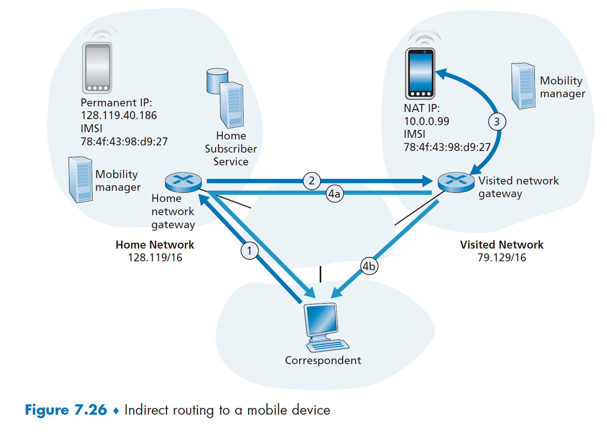

现在让我们把注意力转向 HSS，它负责与被访网络互动以跟踪移动设备的位置，以及家庭网络的网关路由器。这个网关路由器的一项工作是留意到达的数据报，这些数据报的地址是一个设备的家在该网络中，但目前居住在一个被访网络中。母网网关拦截这个数据报，与 HSS 协商，以确定移动设备所在的被访网络，并将数据报转发给被访网络网关路由器：图 7-26 中的步骤 2。被访网络网关路由器然后将数据报转发给移动设备--图 7-26 中的步骤 3。如果使用 NAT 转换，如图 7-26 所示，被访网络网关路由器执行 NAT 转换。

更详细地考虑家庭网络的重新路由是有意义的。显然，家庭网络网关将需要把到达的数据报转发到被访网络的网关路由器。另一方面，最好是让通信者的数据报保持完整，因为接收数据报的应用程序应该不知道数据报是通过家庭网络转发的。这两个目标都可以通过让家庭网关将通信者的原始完整数据报封装在一个新的（更大的）数据报中来实现。然后，这个较大的数据报被寻址并交付给被访网络的网关路由器，它将解封装数据报，即从较大的封装数据报中移除通信者的原始数据报，并将原始数据报转发（图 7-26 中的步骤 3）到移动设备。敏锐的读者会注意到，这里描述的封装/解封装正是第 4-3 节在 IPv6 背景下讨论的隧道概念；事实上，我们在图 7-18 的背景下也讨论了隧道的使用，当时我们介绍了 4G LTE 数据平面。

最后，让我们考虑一下移动设备如何将数据报发送到对应方。在图 7-26 中，移动设备显然需要通过被访网关路由器转发数据报，以执行 NAT 转换。但是，被访问的网关路由器应如何将数据报转发到对应方？如图 7.26 所示，这里有两个选择。(4a)数据报可以通过隧道返回到本地网关路由器，并从那里发送给通信者。或(4b)数据报可以从被访网络直接传送到通信方，这种方法在 LTE 中被称为 **本地突破(local breakout)** [GSMA 2019a]。

让我们通过回顾支持移动性所需的新网络层功能来总结我们对间接路由的讨论。

- 一个移动设备到被访网络的关联协议。移动设备将需要与被访网络关联，并且在离开被访网络时也同样需要解除关联。
- 被访网络到家庭网络 HSS 注册协议。被访网络将需要将移动设备的位置与家庭网络中的 HSS 注册，并可能使用从 HSS 获得的信息来进行设备认证。
- 在家庭网络网关和被访网络网关路由器之间有一个数据报隧道协议。发送方对通信者的原始数据报进行封装和转发；在接收方，网关路由器对原始数据报进行解封装、NAT 转换，并转发到移动设备。

前面的讨论提供了移动设备在网络间移动时与对应方保持持续连接的所有必要元素。当设备从一个被访网络漫游到另一个被访网络时，新的被访网络信息需要在本地网络 HSS 中更新，并且需要移动本地网关-路由器到被访网关-路由器的隧道端点。但是，移动设备在网络之间移动时，会不会看到数据报的中断流？只要移动设备从一个被访网络断开连接到下一个被访网络的时间不长，很少有数据报会丢失。回顾第三章，端到端连接会因网络拥堵而出现数据报丢失。因此，当一个设备在网络之间移动时，连接中偶尔的数据报丢失绝不是一个灾难性的问题。如果需要无损通信，上层机制将从数据报丢失中恢复，无论这种丢失是由网络拥堵还是由设备移动造成的。

我们上面的讨论已经特意有些泛化了。移动 IP 标准[RFC 5944]以及 4G LTE 网络[Sauter 2014]中使用了间接路由方法。他们的细节，特别是采用的隧道程序，与我们上面的一般性讨论有一点不同。

**直接路由到移动设备**

图 7-26 所示的间接路由方法存在一个被称为 **三角路由问题(triangle routing problem)** 的低效率问题--发给移动设备的数据报必须首先转发到母网，然后再转发到被访网络，即使在通信方和漫游移动设备之间存在一条更有效的路由。在最坏的情况下，设想一个移动用户在同一个网络上漫游，而这个网络是我们的移动用户正在访问的一个海外同事的母网。两人并排而坐，交换数据。移动用户和他的海外同事之间的数据报将被转发到移动用户的家庭网络，然后再返回到被访问的网络！这就是直接路由。

**直接路由(direct routing)** 克服了三角路由的低效率问题，但这样做的代价是增加了复杂性。在图 7-27 所示的直接路由方法中，通信员首先发现移动用户所在的被访网络。这是通过查询移动设备母网的 HSS 完成的，假设（如间接路由的情况）移动设备的被访网络在 HSS 中注册。这在图 7-27 中显示为步骤 1 和 2。然后，对应方将数据报从其网络直接传输到移动设备被访网络的网关路由器。


虽然直接路由克服了三角路由问题，但它引入了两个重要的额外挑战：

- 通信者需要一个移动用户位置协议来查询 HSS，以获得移动设备的访问网络（图 7-27 中的步骤 1 和 2）。这是在移动设备向其 HSS 登记其位置所需的协议之外的。
- 当移动设备从一个被访网络移动到另一个被访网络时，通信员如何知道现在要把数据报转发到新的被访网络？在间接路由的情况下，这个问题很容易解决，只要更新母网的 HSS，并改变隧道端点以终止于新访问网络的网关路由器。然而，在直接路由中，被访网络的这种变化就不容易处理了，因为 HSS 只在会话开始时被通信者查询到。因此，需要额外的协议机制，在移动设备每次移动时主动更新通信者。本章末尾的两个问题探讨了这个问题的解决方案。

## 7.6. 移动性管理：实践

在上一节中，我们确定了在开发支持设备移动性的网络架构时面临的主要基本挑战和潜在的解决方案：家庭网络和被访网络的概念；家庭网络作为订阅该家庭网络的移动设备的信息和控制中心点的作用；家庭网络的移动性管理实体需要的控制平面功能，以跟踪在被访网络中漫游的移动设备；以及直接和间接路由的数据平面方法，使通信者和移动设备能够交换数据报。现在让我们来看看这些原则是如何付诸实践的吧 在第 7-2-1 节中，我们将研究 4G/5G 网络中的移动性管理；在第 7-2-1 节中，我们将看看移动 IP，它已被提出用于互联网。

### 7.6.1. 4G/5G 网络中的移动性管理

我们在第 7.4 节中对 4G 和新兴 5G 架构的研究使我们熟悉了在 4G/5G 移动性管理中起核心作用的所有网络元素。现在让我们来说明这些网元是如何相互操作以在今天的 4G/5G 网络中提供移动性服务的[Sauter 2014; GSMA 2019b]，这些网络起源于早期的 3G 蜂窝式语音和数据网络[Sauter 2014]，甚至是早期的 2G 语音网络[Mouly 1992]。这将有助于我们综合迄今为止所学到的知识，让我们也能介绍一些更高级的话题，并为 5G 移动性管理可能出现的情况提供一个镜头。

让我们考虑一个简单的场景，在这个场景中，一个移动用户（例如，汽车中的乘客），用智能手机连接到一个被访问的 4G/5G 网络，开始从一个远程服务器传输高清视频，然后从一个 4G/5G 基站的小区覆盖范围移动到另一个。这个场景的四个主要步骤如图 7-28 所示。

1. 移动设备和基站关联。移动设备与被访网络中的一个基站关联。
2. 为移动设备配置控制平面的网元。被访网络和本地网络建立控制平面状态，表明移动设备驻留在被访网络中。
3. 移动设备的转发隧道的数据平面配置。被访网络和家庭网络建立隧道，移动设备和流媒体服务器可以通过隧道发送/接收 IP 数据报，使用间接路由通过家庭网络的分组数据网络网关（P-GW）。
4. 移动设备从一个基站到另一个基站的交接。移动设备通过从一个基站到另一个基站的交接，改变其对被访网络的附着点。

现在让我们更详细地考虑这四个步骤中的每一个。


1. 基站关联。记得在 7.4.2 节中，我们研究了移动设备与基站关联的程序。我们了解到，移动设备在所有频率上监听其区域内基站发射的主要信号。移动设备逐渐获得有关这些基站的更多信息，最终选择与之联系的基站，并与该基站建立一个控制信号通道。作为这种联系的一部分，移动设备向基站提供其国际移动用户身份（IMSI），该身份能唯一地识别移动设备以及其家庭网络和其他额外的用户信息。

2. 为移动设备配置 LTE 网元的控制平面。一旦移动设备到基站的信道建立，基站就可以与被访网络中的 MME 联系。MME 将咨询和配置母网和被访网络中的一些 4G/5G 网元，代表移动节点建立状态。

MME 将使用移动设备提供的 IMSI 和其他信息来检索该用户的认证、加密和可用网络服务信息。这些信息可能在 MME 的本地缓存中，也可能是从移动设备最近联系过的另一个 MME 那里检索到的，或者是从移动设备的家庭网络中的 HSS 那里检索到的。相互认证过程（我们将在第 8.8 节中详细介绍）确保被访问的网络确信移动设备的身份，并且该设备可以认证它所连接的网络。

MME 通知移动设备母网的 HSS，移动设备现在居住在被访网络中，HSS 会更新其数据库。

基站和移动设备为移动设备和基站之间建立的数据面信道选择参数（记得控制平面信道已经在运行）。

3. 为移动设备配置转发隧道的数据平面。MME 接下来为移动设备配置数据平面，如图 7-29 所示。两个隧道被建立。一个隧道是在基站和被访网络中的服务网关之间。第二条隧道在该服务网关和移动设备本地网络中的 PDN 网关路由器之间。4G LTE 实现了这种形式的对称间接路由--所有进入/离开移动设备的流量都将通过设备的家庭网络进行隧道传输。4G/5G 隧道使用 GPRS 隧道协议（GTP），在[3GPP GTPv1-U 2019]中规定。GTP 头中的隧道端点 ID（TEID）表明数据报属于哪个隧道，允许 GTP 在隧道端点之间对多个流量进行复用和解复用。

将图 7-29（在被访问网络中移动漫游的情况）中的隧道配置与图 7-18（仅在移动设备的家庭网络中移动的情况）中的隧道配置进行比较是有意义的。我们看到，在这两种情况下，服务网关与移动设备共同驻扎在同一网络中，但 PDN 网关（它总是移动设备主网中的 PDN 网关）可能在与移动设备不同的网络中。这正是间接路由。已经指定了间接路由的替代方案，称为本地突破[GSMA 2019a]，其中服务网关与本地访问网络中的 PDN 网关建立了一条隧道。然而，在实践中，本地突破并没有被广泛使用[Sauter 2014]。

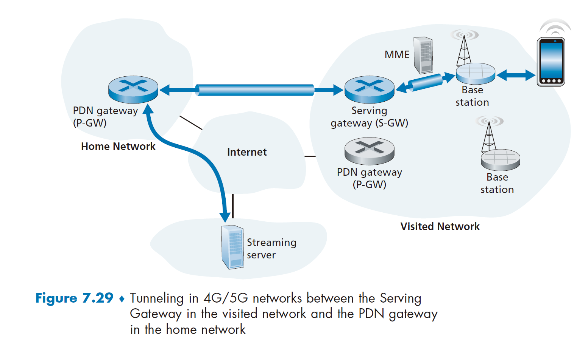

一旦隧道被配置和激活，移动设备现在可以通过其家庭网络中的 PDN 网关转发数据包到/来自互联网了

4. 交接管理。当移动设备从一个基站到另一个基站改变其关联时，就会发生交接。下面描述的切换过程是相同的，无论移动设备是驻留在其主网中，还是在被访网络中漫游。

如图 7-30 所示，最初（在交接前）通过一个基站（我们称之为源基站）转发到移动设备的数据报，交接后通过另一个基站（我们称之为目标基站）转发到移动设备。正如我们将看到的，基站之间的交接不仅导致移动设备向新的基站发送/接收信息，而且还导致图 7.29 中服务网关到基站隧道的基站端发生变化。在最简单的交接情况下，当两个基站相互靠近并在同一网络中时，由于交接而发生的所有变化都是相对局部的。特别是，被服务网关使用的 PDN 网关仍然对设备的移动性一无所知。当然，更复杂的交接场景将需要使用更复杂的机制[Sauter 2014; GSMA 2019a]。

发生交接的原因可能有几个。例如，当前基站和移动设备之间的信号可能已经恶化到严重影响通信的程度。或者一个小区可能已经过载，处理了大量的流量；将移动设备移交给附近不那么拥挤的小区可能会缓解这种拥堵。移动设备定期测量来自其当前基站的信标信号以及它能 "听到 "的附近基站的信号的特性。这些测量结果每秒一次或两次报告给移动设备的当前（源）基站。根据这些测量结果、附近小区的移动设备的当前负载以及其他因素，源基站可以选择启动移交。4G/5G 标准并没有规定基站在确定是否进行交接或选择哪个目标基站时要使用的具体算法；这是一个活跃的研究领域[Zheng 2008; Alexandris 2016]。

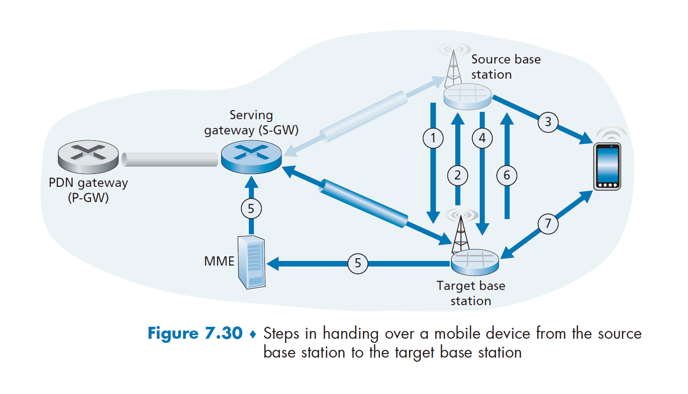

图 7-30 说明了源基站决定将移动设备移交给目标基站时的步骤。

1. 当前（源）基站选择目标基站，并向目标基站发送一个移交请求信息。
2. 目标基站检查其是否有资源支持移动设备及其服务质量要求。如果有，它就在其无线接入网络上预先分配信道资源（如时隙）和其他资源给该设备。这种预先分配资源的做法使移动设备不必通过前面讨论的耗时的基站关联协议，从而使移交工作尽可能快地执行。目标基站向源基站回复一个移交请求确认消息，其中包含移动设备与新基站关联所需的目标基站的所有信息。
3. 源基站收到移交请求确认消息后，将目标基站的身份和信道接入信息通知移动设备。这时，移动设备可以开始向新的目标基站发送/接收数据报。从移动设备的角度来看，移交工作已经完成。然而，在网络内仍有一些工作要做。
4. 源基站也将停止向移动设备转发数据报，而是将其收到的任何隧道数据报转发给目标基站，目标基站随后将这些数据报转发给移动设备。
5. 目标基站通知 MME，它（目标基站）将成为为移动设备服务的新基站。反过来，MME 向服务网关和目标基站发出信号，重新配置服务网关到基站的隧道，使其终止于目标基站，而不是源基站。
6. 目标基站向源基站确认隧道已被重新配置，允许源基站释放与该移动设备相关的资源。
7. 此时，目标基站也可以开始向移动设备传送数据报，包括源基站在移交期间转发到目标基站的数据报，以及从服务网关重新配置的隧道上新到达的数据报。它还可以将从移动设备收到的出站数据报转发到服务网关的隧道内。

今天的 4G LTE 网络中的漫游配置，如上面讨论的，也将用于未来新兴的 5G 网络[GSMA 2019c]。然而，从我们在第 7.4-6 节的讨论中可以看出，5G 网络将更加密集，小区规模明显缩小。这将使交接成为更重要的网络功能。此外，低切换延迟对于许多实时的 5G 应用是至关重要的。我们在第五章[GSMA 2018b; Condoluci 2018]中研究的蜂窝网络控制平面向 SDN 框架的迁移，有望实现更高容量、更低延迟的 5G 蜂窝网络控制平面。SDN 在 5G 背景下的应用是大量研究的主题[Giust 2015 Ordonez-Lucena 2017; Nguyen 2016]。

### 7.6.2. 移动 IP

今天的互联网没有任何广泛部署的基础设施，为 “在路上”的移动用户提供我们遇到的 4G/5G 蜂窝网络的那种服务。但是，这当然不是因为缺乏在互联网环境中提供这种服务的技术解决方案！事实上，移动 IP 架构和协议[RFC 59]。事实上，我们将在下面简要讨论的移动 IP 架构和协议[RFC 5944]已经被互联网 RFC 标准化了 20 多年，而且对新的、更安全和更通用的移动解决方案的研究也在继续[Venkataramani 2014]。

相反，也许是缺乏激励性的商业和使用案例[Arkko 2012]，以及蜂窝网络中替代移动性解决方案的及时开发和部署，阻碍了移动 IP 的部署。回顾 20 年前，2G 蜂窝网络已经为移动语音服务（移动用户的 "杀手级应用"）提供了解决方案；此外，支持语音和数据的下一代 3G 网络也即将面世。也许双技术解决方案--当我们真正移动和 "在路上 "时通过蜂窝网络提供移动服务（即图 7.24 中移动性频谱的最右边），当我们静止或局部移动时通过 802.11 网络或有线网络提供互联网服务（即图 7-24 中移动性频谱的最左边）：我们在 20 年前拥有，今天仍然拥有，这将持续到未来。

尽管如此，在此简要介绍一下移动 IP 标准还是很有意义的，因为它提供了许多与蜂窝网络相同的服务，并实现了许多相同的基本移动性原则。本教科书的早期版本对移动 IP 的研究比我们在这里提供的更加深入；感兴趣的读者可以在本教科书的网站上找到这些退役的材料。支持移动性的互联网架构和协议，统称为移动 IP，主要在 RFC 5944 中为 IPv4 定义。移动 IP，像 4G/5G 一样，是一个复杂的标准，需要一整本书来详细描述；事实上，这样的一本书就是[Perkins 1998b]。我们在这里的适度目标是对移动 IP 的最重要方面进行概述。

移动 IP 的整体结构和元素与蜂窝电话供应商网络的结构和元素惊人地相似。有一个很强的家庭网络的概念，在这个网络中，移动设备有一个永久的 IP 地址，而被访问的网络（在移动 IP 中被称为 "外国 "网络），移动设备将被分配一个关心地址。移动 IP 中的主代理具有与 LTE HSS 类似的功能：它通过接收移动设备所访问的外国网络中的外国代理的更新来跟踪移动设备的位置，就像 HSS 接收 4G 移动设备所在的访问网络中的移动性管理实体（MMEs）的更新一样。而且，4G/5G 和移动 IP 都使用间接路由到移动节点，使用隧道来连接本地和被访/国外网络的网关路由器。下表总结了移动 IP 架构的要素，以及与 4G/5G 网络中类似要素的比较。

| 4G/5G 基本组成                                                                             | 移动 IP 基本组成                                                 | 讨论                             |
| ------------------------------------------------------------------------------------------ | ---------------------------------------------------------------- | -------------------------------- |
| 家庭网络                                                                                   | 家庭网络                                                         |                                  |
| 被访网络                                                                                   | 外部网络                                                         |                                  |
| IMSI 标识符                                                                                | 永久 IP 地址                                                     | 全球唯一可路由地址信息           |
| 家庭用户服务(HSS)                                                                          | 家庭代理                                                         |                                  |
| 移动性管理实体(MME)                                                                        | 外部代理                                                         |                                  |
| 数据平面：通过家庭网络间接转发，在家庭和被访网络之间有隧道，在移动设备所在的网络内有隧道。 | 数据平面：通过家庭网络间接转发，在家庭网络和被访网络之间有隧道。 |                                  |
| 基站                                                                                       | 接入点(AP)                                                       | 移动 IP 中未规定具体的接入点技术 |
| 无线电接入网络                                                                             | WLAN                                                             | 移动 IP 中未规定具体的 WLAN 技术 |

移动 IP 标准由三个主要部分组成：

- 代理发现。移动 IP 定义了外国代理用来向希望加入其网络的移动设备宣传其移动服务的协议。这些服务将包括向移动设备提供一个用于外国网络的地址，在移动设备的主网络中向主代理注册移动设备，以及转发进出移动设备的数据报，以及其他服务。
- 与主代理的注册。移动 IP 定义了由移动设备和/或外国代理使用的协议，以便在移动设备的主代理处注册和取消注册地址的照顾。
- 数据报的间接路由。移动 IP 还定义了数据报被主代理转发给移动设备的方式，包括转发数据报和处理错误条件的规则，以及几种形式的隧道[RFC 2003, RFC 2004]。

同样，我们在这里对移动 IP 的报道也是有意的简短。有兴趣的读者应该参考本节中的参考文献，或者在本教科书的早期版本中对移动 IP 进行更详细的讨论。

## 7.7. 无线和移动性：对高层协议的冲击

在本章中，我们看到无线网络与有线网络在链路层（由于无线信道特性，如衰减、多径和隐藏终端）和网络层（由于移动用户会改变他们对网络的附着点）都有很大的区别。但在传输层和应用层是否存在重要的差异？我们很容易认为这些差异会很微小，因为网络层为有线和无线网络的上层提供相同的尽力交付服务模型。同样地，如果 TCP 或 UDP 等协议被用来为有线和无线网络中的应用提供传输层服务，那么应用层也应该保持不变。在某种意义上，我们的直觉是正确的--TCP 和 UDP 可以（而且确实）在有无线链路的网络中运行。另一方面，一般的传输协议，特别是 TCP，在有线和无线网络中有时会有非常不同的性能，而正是在这里，就性能而言，差异是体现出来的。让我们来看看原因。

回顾一下，TCP 重发一个在发送方和接收方之间的路径上丢失或损坏的段。在移动用户的情况下，丢失可能是由于网络拥堵（路由器缓冲区溢出）或切换（例如，在将网段重新路由到移动用户的新连接点时的延迟）造成的。在所有情况下，TCP 的接收方到发送方的 ACK 只表明没有完整地收到一个网段；发送方不知道该网段是由于拥堵、切换期间还是由于检测到的比特错误而丢失的。在所有情况下，发送方的响应都是一样的，即重新发送该段。TCP 的拥塞控制响应在所有情况下也是一样的--TCP 减少其拥塞窗口，如第 3-7 节所述。通过无条件地减少其拥塞窗口，TCP 隐含地假定网段丢失是由拥塞而不是由损坏或移交引起的。我们在第 7-2 节中看到，无线网络中的比特错误比有线网络中更常见。当发生这样的比特错误或发生交接损失时，TCP 发送方确实没有理由减少其拥塞窗口（并因此减少它的发送速率）。) 事实上，很可能是路由器的缓冲区是空的，数据包在端到端的路径上流动，没有受到拥塞的阻碍。

研究人员在 20 世纪 90 年代初至中期意识到，鉴于无线链路上的高误码率和交接损失的可能性，TCP 的拥塞控制响应在无线环境中可能会出现问题。有三大类方法可以用来处理这个问题。

本地恢复。本地恢复协议在比特错误发生的时间和地点（例如，在无线链路上）进行恢复，例如，我们在第 7-3 节中研究的 802.11 ARQ 协议，或者我们在第 7-4-2 节中看到的同时使用 ARQ 和 FEC[Ayanoglu 1995]的更复杂的方法，在 4G/5G 网络中使用。

TCP 发送器对无线链路的认识。在本地恢复方法中，TCP 发送方完全不知道它的段正在穿越无线链路。另一种方法是让 TCP 发送方和接收方意识到无线链路的存在，区分有线网络中发生的拥塞损失和无线链路中发生的损坏/损失，并仅在应对拥塞的有线网络损失时调用拥塞控制。[Liu 2003]研究了区分端到端路径的有线和无线段的损失的技术。[Huang 2013]提供了关于开发对 LTE 更友好的传输协议机制和应用的见解。

分离式连接方法。在分割连接方法中[Bakre 1995]，移动用户和其他端点之间的端到端连接被分解成两个传输层连接：一个从移动主机到无线接入点，一个从无线接入点到其他通信端点（我们在这里假设是一个有线主机）。因此，端到端的连接是由无线部分和有线部分连接而成的。无线部分的传输层可以是标准的 TCP 连接[Bakre 1995]，也可以是在 UDP 之上专门定制的错误恢复协议。[Yavatkar 1994]研究了在无线连接上使用传输层的选择性重复协议。[Wei 2006]中报告的测量结果表明，分裂的 TCP 连接已经在蜂窝数据网络中被广泛使用，而且通过使用分裂的 TCP 连接确实可以获得显著的改善。

我们在这里对无线链路上的 TCP 的处理必然是简单的。对无线网络中的 TCP 挑战和解决方案的深入调查可以在[Hanabali 2005; Leung 2006]中找到。我们鼓励你查阅参考文献，以了解这个正在进行的研究领域的细节。

在考虑了传输层协议之后，让我们接下来考虑无线和移动性对应用层协议的影响。由于无线频谱的共享性，在无线链路上运行的应用，特别是在蜂窝式无线链路上运行的应用，必须把带宽作为一种稀缺商品。例如，为在 4G 智能手机上执行的网络浏览器提供内容的网络服务器，很可能无法提供与在有线连接上运行的浏览器相同的图像丰富的内容。尽管无线链接确实在应用层提供了挑战，但它们所带来的移动性也使丰富的位置感知和环境感知应用成为可能[Baldauf 2007]。更广泛地说，无线和移动网络将继续在实现未来的泛在计算环境中发挥关键作用[Weiser 1991]。可以说，当谈到无线和移动网络对网络化应用及其协议的影响时，我们只看到了冰山一角！

## 7.8. 通过 wireshark 观察 802.11(WiFi)

