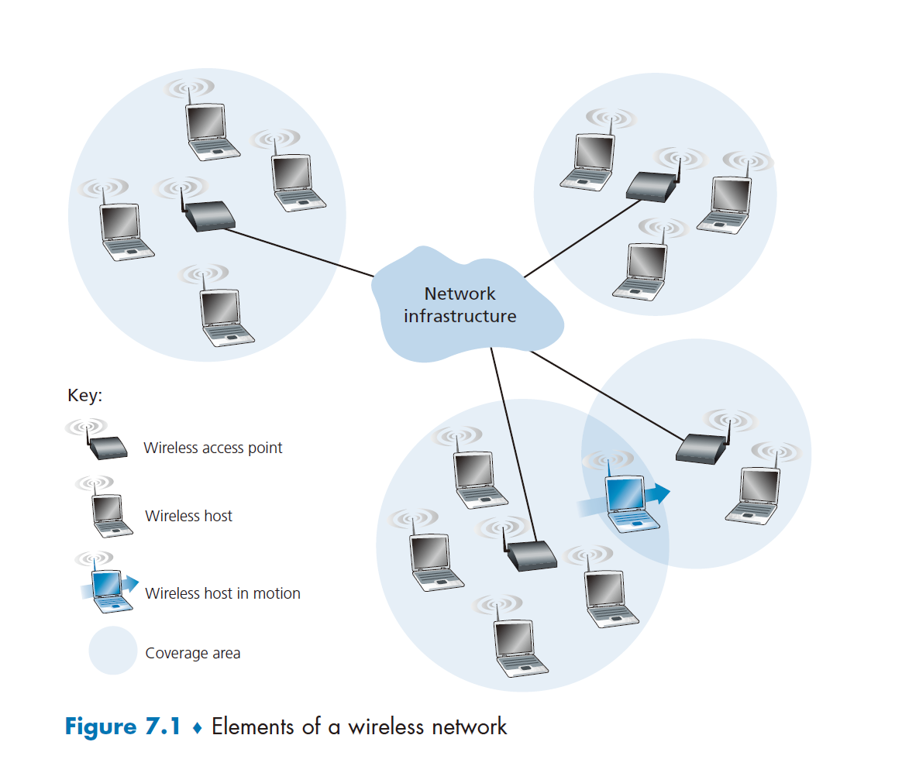

**目录：**

- [7. 无线和移动网络](#7-无线和移动网络)
  - [7.1. 介绍](#71-介绍)
  - [7.2. 无线链路和网络特征](#72-无线链路和网络特征)
    - [7.2.1. 码分多址(CDMA)](#721-码分多址cdma)

# 7. 无线和移动网络

在电话通讯的世界，过去的 25 年是蜂窝电话通讯的黄金时代。在世界范围上，使用移动蜂窝网络的用户从 1993 的 240 万增加到 2019 年的 83 亿。这个数字甚至超过了世界总人口数（2019 年为 76.74 亿）。移动电话的优势是显而易见的：任何地点，任何时间，不受约束地通过一个高度轻便的设备接入全球电话网。近来，智能手机，平板电脑，和笔记本已经通过蜂窝网络或 WiFi 网络无线地接入 Internet。并且，类似于游戏手柄，温度控制器，家庭安保系统，家用智能电器，智能手表，智能眼睛，汽车，交通控制系统等正逐渐无线接入 Internet。

从计算机网络的观点来看，这些无线和移动设备引发的挑战，特别是在数据链路层和网络层，与传统的有线网络的差别非常大，适合用单独一章（即本章）的篇幅来专门讨论无线网络和移动网络。

我们这章将以讨论移动用户，无线链路及网络和他们所连接的更大的有线网络之间的关系开始。我们将明确区分无线网络的无线性和移动性。分清这两个特性将有助于我们隔离，识别，和掌握在这两个区域的关键概念。

我们将以对无线基础设施和相关术语的概览开始。之后，我们将考虑 7-2 节中无线链路的特征。我们在这一节涉及一个简短的对 **码分多址接入技术(Code Division Multiple Access, CDMA)** 的介绍，这是一种常被用于无线网络的共享媒体的接入技术。在 7-3 节，我们深度学习 IEEE 802.11(WiFi) 无线局域网标准的链路层的一些方面。同时我们还将对蓝牙和其他无线个人域网络做简要描述。在 7-4 节，我们提供一个对蜂窝网络接入，包扩 4G 和兴起的 5G 蜂窝网络技术的一个概览，5G 蜂窝网络技术同时提供语音和高速的 Internet 接入。在 7-5 节，我们将注意力转向移动性，关注于移动用户的定位问题、对移动用户的路由选择以及“切换”（handing over）移动用户（即在网络中从一个接入点动态地移动到另一点的用户）等问题。在 7-6 节和 7-7 节中，我们将分别考察如何在企业 802.11 网络和 LTE 蜂窝网络中用移动 IP 标准实现这些移动服务。最后，我们将在 7-8 节中考虑无线链路和移动性对运输层协议和网络应用程序的影响。

## 7.1. 介绍

图 7-1 显示了我们将要讨论无线数据通信和移动性主题的环境。为使讨论具有一般性以覆盖各种各样的网络，将包括像 IEEE 802.11 这样的无线局域网和像 4G，5G 网络这样的蜂窝网络来开始我们的讨论；然后在后续各节中，我们将对特定的无线体系结构进行更加详细的讨论。我们能够看到无线网络的下列要素：

- 无线主机。如同在有线网络中一样，主机是运行应用程序的端系统设备。**无线主机(wireless host)** 可以是智能手机，平板电脑，或笔记本，或者它可能是类似于传感器，智能家电，自动驾驶汽车，或者其他接入互联网的混合设备。 主机本身可能移动，也可能不移动。
- 无线链路。主机通过 **无线通信链路(wireless communication link)** 连接到一个基站（定义见下文）或者另一台无线主机。不同的无线链路技术具有不同的传输速率和能够传输不同的距离。图 7-2 显示了较为流行的无线链路标准的两种主要特性（覆盖区域和链路速率）。（该图仅表示了提供这些特性的大致概念。例如，这些类型中的某些网络现在只是在部署，某些链路速率取决于距离、信道条件和在无线网络中的用户数量，能够比显 示的值更高或更低些。）我们将在本章的前半部分讨论这些标准。在 7-2 节中，我们也考虑其他无线链路特性（如它们的比特差错率及其原因）。

在图 7-1 中，无线链路将位于网络边缘的主机连接到更大的网络基础设施中。我们要马上补充的是，无线链路有时同样应用在一个网络中以连接路由器、交换机和其他网络设备。然而，在本章中我们关注的焦点是无线通信在网络边缘的应用，因为许多最为振奋人心的技术挑战和多数增长就发生在这里。

- 基站。**基站(base station)** 是无线网络基础设施的一个关键部分。与无线主机和无线链路不同，基站在有线网络中没有明确的对应设备。它负责向与之关联的无线主机发送数据和从主机那里接收数据（例如分组）。基站通常负责协调与之相关联的多个无线主机的传输。当我们说一台无线主机与某基站“相关联”时，则是指：1. 该主机位于该基站的无线通信覆盖范围内；2. 该主机使用该基站中继它（该主机）和更大网络之间的数据。蜂窝网络中的 **蜂窝塔(cell tower)** 和 802.11 无线 LAN 中的 **接入点(access point)** 都是基站的例子。

在图 7-1 中，基站与更大网络相连（如因特网、公司或家庭网、电话网），因此这种连接在无线主机和与之通信的其他部分之间起着链路层中继的作用。

与基站关联的主机通常被称为以 **基础设施模式(infrastructure mode)** 运行，因为所有传统的网络服务（如地址分配和路由选择）都由网络向通过基站相连的主机提供。在 **自组织网络(ad hoc network)** 中，无线主机没有这样的基础设施与之相连。在没有这样的基础设施的情况下，主机本身必须提供诸如路由选择、地址分配、类似于 DNS 的名字转换等服务。

当一台移动主机的移动超出一个基站的覆盖范围而到达另一个基站的覆盖范围后，它将改变其接入到更大网络的连接点（即改变与之相关联的基站），这一过程称作 **切换(handoff，或 handover)**。这种移动性引发了许多具有挑战性的问题。如果一台主机可以移动，那么如何找到它在网络中的当前位置，从而使得数据可以向该移动主机转发？如果一台主机可以位于许多可能位置中的一个，那么如何进行编址？如果主机在一个 TCP 连接或者电话呼叫期间移动，数据如何路由选择而使连接保持不中断？这些以及许多（许多！）其他问题使得 无线网络和移动网络成为一个让人振奋的网络研究领域。

- 网络基础设施。这是无线主机希望与之进行通信的更大网络。

在讨论完无线网络的构件以后，我们注意到这些构件能够以多种不同方式组合以形成不同类型的无线网络。当阅读本章，或阅读/学习本书之外的更多有关无线网络的内容时, 你可能发现对这些无线网络类型进行分类的方法是有用的。在最高层次，我们能够根据两个准则来对无线网络分类：1. 在该无线网络中的分组是否跨越了一个无线跳或多个无线跳；2. 网络中是否有诸如基站这样的基础设施。

- 单跳，基于基础设施。这些网络具有与较大的有线网络（如因特网）连接的基站。此外，该基站与无线主机之间的所有通信都经过一个无线跳。你在教室、咖啡屋 或图书馆中所使用的 802.11 网络，以及我们将很快学习的 4G LTE 数据网络都属于这种类型。我们日常的绝大部分时间是在与单跳、基于基础设施的无线网络打交道。
- 单跳，无基础设施。在这些网络中，不存在与无线网络相连的基站。然而，如我们将要见到的那样，在这种单跳网络中的一个节点可以协调其他节点的传输。蓝牙网络（该网络连接诸如键盘、扬声器和戴在头上的耳机等小型无线设备，我们将在 7-3-6 节中学习）和具有自组织模式的 802.11 网络是单跳、无基础设施的网络。
- 多跳，基于基础设施。在这些网络中，一个基站表现为以有线方式与较大网络相连。然而，某种无线节点为了经该基站通信，可能不得不通过其他无线节点中继它们的通信。某些无线传感网络和所谓 **无线网状网络(wireless mesh network)** 就属于这种类型。
- 多跳，无基础设施。在这些网络中没有基站，并且节点为了到达目的地可能必须在几个其他无线节点之间中继报文。节点也可能是移动的，在多个节点中改变连接关系，一类网络被称为 **移动自组织网络(mobile ad hoc network, MANET)**。如果该移动节点是车载的，该网络是 **车载自组织网络(vehicular ad hoc network, VANET)**。如你可能想象的那样，为这种网络开发协议是一种挑战，这是许多进行中的研究主题。

在本章中，我们将把主要学习内容限制在单跳网络，并且大多数是基于基础设施的网络。

现在我们更深一步地研究无线网络和移动网络面对的挑战。我们将首先讨论单独的无线链路，而在本章稍后部分讨论移动性。

## 7.2. 无线链路和网络特征

无线链路在多个方面不同于有线链路：

- 递减的信号强度。电磁波在穿过物体（如无线电信号穿过墙壁）时强度将减弱。即使在自由空间中，信号仍将扩散，这使得信号强度随着发送方和接收方距离的增加而减弱（有时称其为 **路径损耗(path loss)** ）。
- 来自其他源的干扰。在同一个频段发送信号的电波源将相互干扰。例如，2.4GHz 无线电话和 802.11b 无线 LAN 在相同的频段中传输。因此，802.11b 无线 LAN 用户若同时利用 2.4GHz 无线电话通信，将会导致网络和电话都不会工作得特别好。除了来自发送源的干扰，环境中的电磁噪声（如附近的电动机、微波）也能形成干扰。
- 多径传播。当电磁波的一部分受物体和地面反射，在发送方和接收方之间走了不同长度的路径，则会出现 **多径传播(multipath propagation)**。这使得接收方收到的信号变得模糊。位于发送方和接收方之间的移动物体可导致多径传播随时间而改变。

对于无线信道特征、模型和测量的详细讨论请参见[Anderson 1995; Almers 2007]。

上述讨论表明，无线链路中的比特差错将比有线链路中更为常见。因此，无线链路协议（如我们将在下面一节中讨论的 802.11 协议）不仅采用有效的 CRC 错误检测码，还采用了链路层 ARQ 协议来重传受损的帧。

考虑了在无线信道上可能出现的损伤后，我们将注意力转向接收无线信号的主机。该主机接收到一个电磁信号，而该信号是发送方传输的初始信号的退化形式和环境中的背景噪声的结合，其中的信号退化是由于衰减和我们前面讨论过的多路径传播以及其他一些因素所引起的。**信噪比(Signal-to-Noise Ratio, SNR)** 是所收到的信号（如被传输的信息）和噪声强度的相对测量。SNR 的度量单位通常是分贝（dB），有人认为这个主要由电气工程师所使用的度量单位会使计算机科学家迷惑不解。以 dB 度量的 SNR 是下列比值的 20 倍，即接收到的信号的振幅与噪声的振幅的以 10 为底的对数的比值。就我 们的讨论目的而言，我们仅需要知道较大的 SNR 使接收方更容易从背景噪声中提取传输的信号。

图 7-3（该图选自［Holland 2001］）显示了三种不同的调制技术的 **比特差错率(BER)**（大致说来，BER 是在接收方收到的有错传输比特的概率）与 SNR 之比，这些调制技术用于 对信息进行编码以在理想信道上传输。调制和 编码理论以及信号提取和 BER 都超出了本书的范围（对这些主题的讨论参见［Schwar 1980］）。尽管如此，图 7-3 显示了几种物理层的特征，这些特征对于理解较高层无线通信协议是重要的:

- 对于给定的调制方案，SNR 越高，BER 越低。由于发送方通过增加它的传输功率就能够增加 SNR，因此发送方能够通过增加它的传输功率来降低接收到差错帧的概率。然而，注意到当该功率超过某个阈值时，如 BER 从 10^-12 降低到 10^-13，可证明几乎不会有实际增益。增加传输功率也会伴随着一些缺点：发送方必须消耗更多的能量（对于用电池供电的移动用户，这一点非常重要），并且发送方的传输更可能干扰另一个发送方的传输（参见图 7-4b）。
- 对于给定的 SNR，图 7-4 隐藏终端问题和衰减具有较高比特传输率的调制技术（无论差错与否）将具有较高的 BER。例如在图 7-3 中，对于 10dB 的 SNR,具有 1Mbps 传输速率的 BPSK 调制具有小于 10^-7 的 BER，而具有 4Mbps 传输速率的 QAM 16 调制，BER 是 10^-1，该值太高而没有实际用处。然而，具有 20dB 的 SNR, QAM 16 调制具有 4Mbps 的传输速率和 10^-7 的 BER，而 BPSK 调制具有仅 1Mbps 的传输速率和一个低得“无法在图上表示”的 BER。如果人们能够容忍 10^-7 的 BER，在这种情况下由 QAM 16 提供的较高的传输速率将使它成为首选的调制技术。这些考虑引出了我们下面描述的最后一个特征。
- 物理层调制技术的动态选择能用于适配对信道条件的调制技术。SNR （因此 BER）可能因移动性或由于环境中的改变而变化。在蜂窝数据系统中以及在 802.11 WiFi，4G，5G 蜂窝数据网络中（我们将在 7-3 节和 7-4 节中学习）使用了自适应调制和编码。例如，这使得对于给定的信道特征选择一种调制技术，在受制于 BER 约束的前提下提供最高的可能传输速率。

有线和无线链路之间的差异并非仅仅只有较高的、时变的误比特率这一项。前面讲 过在有线广播链路中所有节点能够接收到所有其他节点的传输。而在无线链路中，情况 并非如此简单。如图 7-4 所示，假设站点 A 正在向站点 B 发送，同时假定站点 C 也在向站点 B 传输。由于所谓的 **隐藏终端问题(hidden terminal problem)**，即使 A 和 C 的传输确实是在目的地 B 发生干扰，环境的物理阻挡（例如，一座大山或者一座建筑）也可能会妨碍 A 和 C 互相听到对方的传输。这种情况如图 7-4a 所示。第二种导致在接收方无法检测的碰撞情况是，当通过无线媒体传播时信号强度的 **衰减(fading)**。图 7-4b 图 示了这种情况，A 和 C 所处的位置使得它们的信号强度不足以使它们相互检测到对方的传输，然而它们的传输足以强到在站点 B 处相互干扰。正如我们将在 7-3 节看到的那样，隐藏终端问题和衰减使得多路访问在无线网络中的复杂性远高于在有线网络中的情况。

### 7.2.1. 码分多址(CDMA)

在第 6 章讲过，当不同主机使用一个共享媒体通信时，需要有一个协议来保证多个发送方发送的信号不在接收方互相干扰。在第 6 章中，我们描述了 3 类媒体访问协议：信道划分、随机访问和轮流。**码分多址(Code Division Multiple Access, CDMA)** 属于信道划分 协议族。它在无线 LAN 和蜂窝技术中应用很广泛。由于 CDMA 对无线领域十分重要，在后面小节中对具体的无线接入技术进行探讨以前，我们首先对其快速地浏览一下。

在 CDMA 协议中，要发送的每个比特都通过乘以一个信号(编码)的比特来进行编码，这个信号的变化速率(通常称为 **码片速率**，chipping rate)比初始数据比特序列的变化速率快得多。图 7-5 表示一个简单的、理想化的 CDMA 编码/解码情形。假设初始数据比特到达 CDMA 编码器的速率定义了时间单元；也就是说，每个要发送的初始数据比特需要 1 比特时隙时间。设第 $d_i$ 为第 i 个比特时隙中的数据比特值。为了数学上便利，我们把具有 0 值的数据比特表示为-1。每个比特时隙又进一步细分为 M 个微时隙；在图 7-5 中，M = 8，不过在实际中 M 的值要大得多。发送方使用的 CDMA 编码由 M 个值的一个序列 c(m) 组成，m = 1, ..., M, 每个取值为+1 或者-1。在图 7-5 的例子中，被发送方使用的 M 比特的 CDMA 码是 (1, 1, 1, -1, 1, -1, -1, -1)。

为了说明 CDMA 的工作原理，我们关注第 i 个数据比特 $d_i$。对于 $d_i$ 比特传输时间的第 m 个微时隙，CDMA 编码器的输出 $Z_{i,m}$ 是 $d_i$ 乘以分配的 CDMA 编码的第 m 比特 $c_m$：

$$Z_{i,m} = {d_i \cdot c_m} \tag{7-1式}$$

简单地说，对没有干扰的发送方，接收方将收到编码的比特 $Z_{i,m}$，并且恢复初始的数据比特 $d_i$，计算如下：

$$d_i = {{1 \over M} {\displaystyle \sum_{m=1}^{M} Z_{i,m}} \cdot c_m} \tag{7-2式}$$

读者可能想通过推敲图 7-5 所示例子的细节，来明白使用(7-2 式)在接收方确实正确恢复了初始数据比特。

然而，这个世界远不是理想化的，如上面所述，CDMA 必须在存在干扰发送方的情况下工作，这些发送方用分配的不同编码来编码和传输它们的数据。但是当一个发送方的数据比特和其他发送方发送的比特混在一起时，一个 CDMA 接收方怎样恢复该发送方的初始数据比特呢？ CDMA 的工作有一种假设，即对干扰的传输比特信号是加性的，这意味着, 例如在同一个微时隙中，如果 3 个发送端都发送 1，第 4 个发送端发送 -1，那么在那个微时隙中所有的接收方接收的信号都是 2 (因为 1+1+1-1 = 2)。在存在多个发送方时，发送方 s 计算它编码后的传输 $Z_{i,m}^s$ ，计算方式与上面式子中的第一个完全相同。然而在第 i 个比特时隙的第 m 个微时隙期间，接收方现在收到的值是在那个微时隙中从所有 N 个发送方传输的比特的总和：

$$Z_{i,m}^* = {\displaystyle \sum_{s=1}^{N} Z_{i,m}^s}$$

令人吃惊的是，如果仔细地选择发送方的编码，每个接收方只通过(7-2 式)中的同样的方式使用发送方的编码，就能够从聚合的信号中恢复一个给定的发送方发送的数据：

$$d_i = {{1 \over M} {\displaystyle \sum_{m=1}^M {Z_{i,m}^*} \cdot c_m}} \tag{7-3式}$$

如在图 7-6 中所示，描述了两个发送方的 CDMA 例子。上部的发送方使用的 M 比特 CDMA 编码是(1, 1, 1, -1, 1, -1, -1, -1)，而下部的发送方使用的 CDMA 编码是(1, -1, 1, 1, 1, -1, 1, 1)。图 7-6 描述了一个接收方恢复从上部发送方发送的初始数据比特的情况。注意到这个接收方能够提取来自发送方 1 的数据，而不管来自发送方 2 的干扰传输。

再回到我们第 6 章中鸡尾酒会的类比，一个 CDMA 协议类似于让聚会客人使用多种语言来谈论；在这种情况下，人们实际上非常善于锁定他们能听懂的语言的谈话，而过滤了其余的谈话。我们这里看到 CDMA 是一个划分协议，因为它划分编码空间(与时间或频 率相对)，并且给每个节点分配一段专用的代码空间。

我们这里对 CDMA 的讨论是简要的；实践中还必须处理大量的困难问题。首先，为了使 CDMA 接收方能够提取一个特定的发送方的信号，必须仔细地选择 CDMA 编码。其次，我们的讨论假设在接收方接收到的来自从不同发送方的信号强度是相同的；这可能在实际中很难获得。有大量的文章讨论了有关 CDMA 的这些和其他问题；详细内容见[Pickholtz 1982； Viterbi 1995] 。

