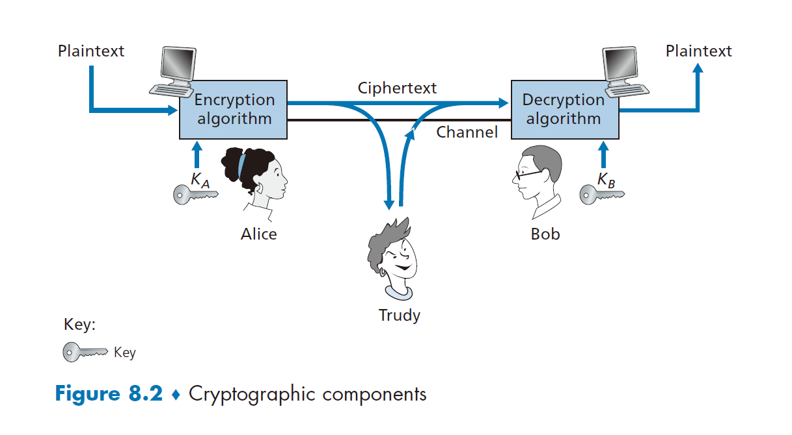
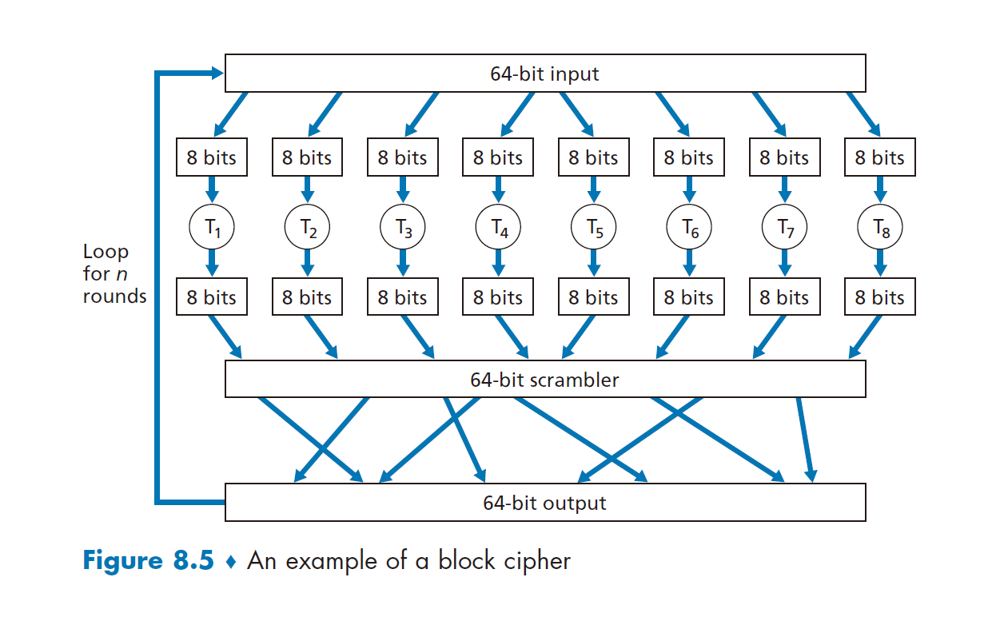
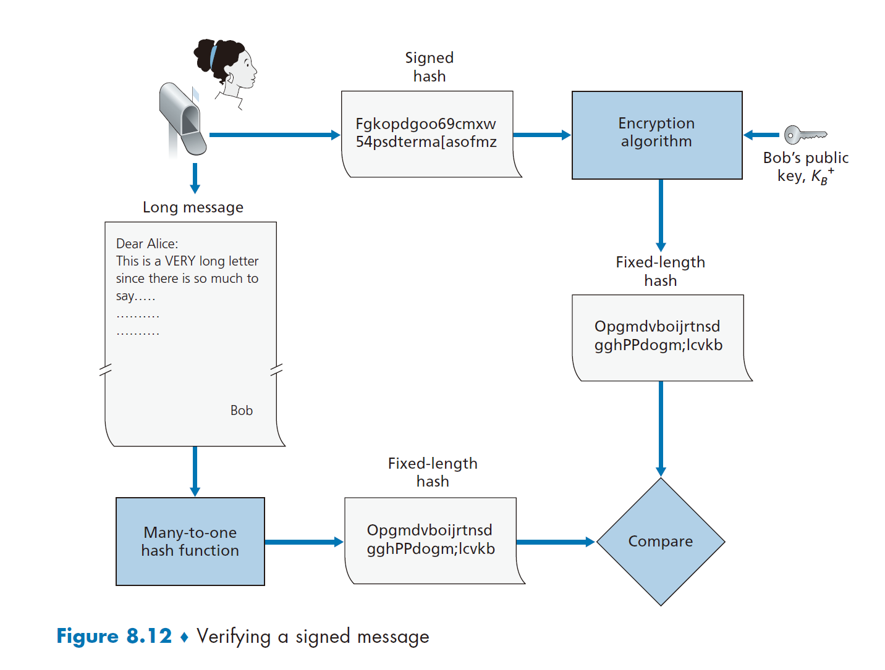
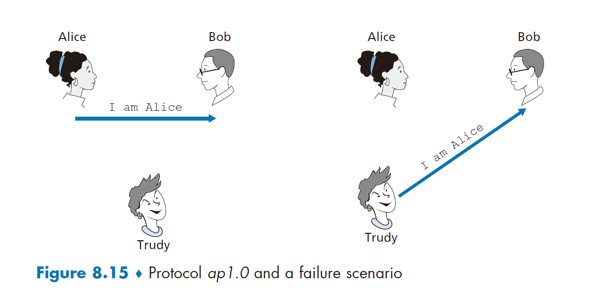
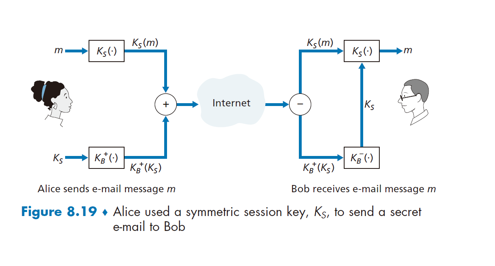
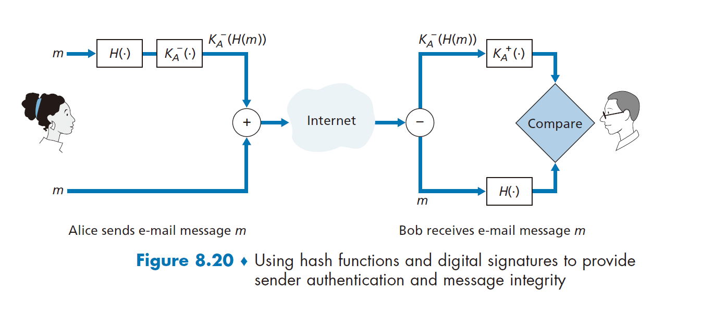
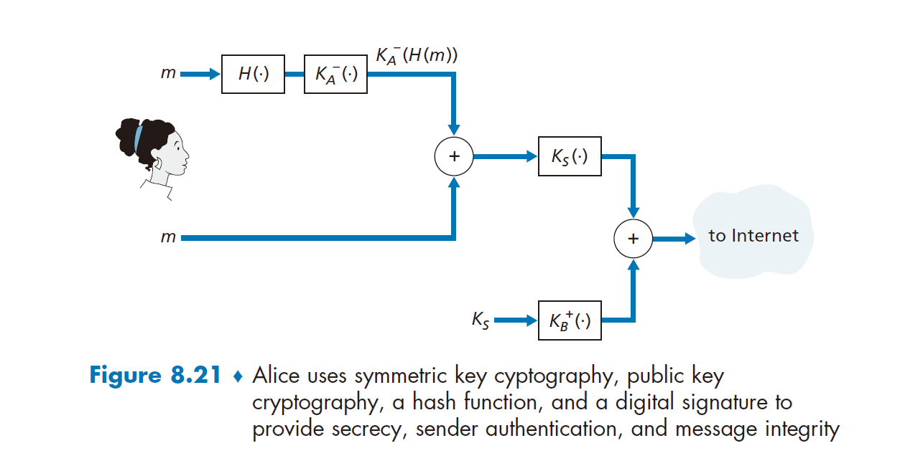
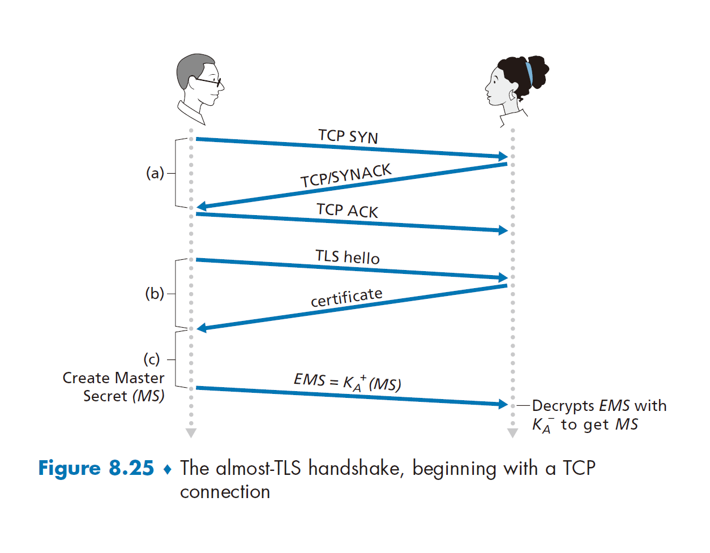
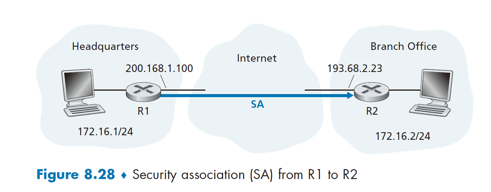

**目录：**

- [8. 计算机网络中的安全](#8-计算机网络中的安全)
  - [8.1. 什么是网络安全](#81-什么是网络安全)
  - [8.2. 密码学的原则](#82-密码学的原则)
    - [8.2.1. 对称密钥密码学](#821-对称密钥密码学)
    - [8.2.2. 公开密钥加密](#822-公开密钥加密)
  - [8.3. 报文完整性和数字签名](#83-报文完整性和数字签名)
    - [8.3.1. 密码散列函数](#831-密码散列函数)
    - [8.3.2. 报文鉴别码](#832-报文鉴别码)
    - [8.3.3. 数字签名](#833-数字签名)
  - [8.4. 端点鉴别](#84-端点鉴别)
  - [8.5. 安全电子邮件](#85-安全电子邮件)
    - [8.5.1. 安全电子邮件](#851-安全电子邮件)
    - [8.5.2. PGP](#852-pgp)
  - [8.6. 安全 TCP 连接：TLS](#86-安全-tcp-连接tls)
    - [8.6.1. 宏观描述](#861-宏观描述)
    - [8.6.2. 一个更完整的描述](#862-一个更完整的描述)
  - [8.7. 网络层安全：IPsec 和虚拟专用网](#87-网络层安全ipsec-和虚拟专用网)
    - [8.7.1. IPsec 和虚拟专用网(VPN)](#871-ipsec-和虚拟专用网vpn)
    - [8.7.2. AH 协议和 ESP 协议](#872-ah-协议和-esp-协议)
    - [8.7.3. 安全关联](#873-安全关联)
    - [8.7.4. IPsec 数据报](#874-ipsec-数据报)
    - [8.7.5. IKE：IPsec 中的密钥管理](#875-ikeipsec-中的密钥管理)
  - [8.8. 安全无线 LAN 和 4/5G 蜂窝网络](#88-安全无线-lan-和-45g-蜂窝网络)
    - [8.8.1. 802.11 无线 LAN 中的认证和密钥协议](#881-80211-无线-lan-中的认证和密钥协议)
    - [8.8.2. 4G/5G 蜂窝网络中的认证和密钥协议](#882-4g5g-蜂窝网络中的认证和密钥协议)
  - [8.9. 运行安全：防火墙和入侵检测系统](#89-运行安全防火墙和入侵检测系统)
    - [8.9.1. 防火墙](#891-防火墙)
    - [8.9.2. 入侵检测系统](#892-入侵检测系统)
  - [8.10. 实验 11：通过 wireshark 观察 SSL](#810-实验-11通过-wireshark-观察-ssl)

**time : 07-15**

# 8. 计算机网络中的安全

早在 1-6 节我们就描述了某些非常盛行和危险的 Internet 攻击，包括恶意软件攻击、拒绝服务、嗅探、源伪装以及报文修改和删除。尽管我们已经学习了有关计算机网络的大量知识，但仍然没有考察如何使网络安全，使其免受那些攻击的威胁。在获得了新的计算机网络和 Internet 协议的专业知识后，我们现在将深入学习安全通信，特别是计算机网络能够防御那些令人厌恶的坏家伙的原理。

我们首先介绍一下 Alice 和 Bob，这俩人要进行通信，并希望该通信过程是“安全”的。由于本书是一本网络教科书，因此 Alice 和 Bob 可以是两台需要安全地交换路由表的路由器，也可以是希望建立一个安全传输连接的客户和服务器，或者是两个交换安全电子邮件的电子邮件应用程序，所有这些学习案例都是在本章后面我们要考虑的。总之，Alice 和 Bob 是安全领域中两个众所周知的固定设备，也许因为使用 Alice 和 Bob 更为有趣，这与命名为“A”的普通实体需要安全地与命名为“B”的普通实体进行通信的作用是一样的。需要安全通信的例子通常包括不正当的情人关系、战时通信和商业事务往来。我们宁愿用第一个例子而不用后两个例子，并使用 Alice 和 Bob 作为发送方和接收方，以第一种情况为背景来讨论问题。

我们说过 Alice 和 Bob 要进行通信并希望做到“安全”，那么此处的安全其确切含义是什么呢？如我们将看到的那样，安全性（像爱一样）是多姿多彩的东西；也就是说，安全性有许多方面。毫无疑问，Alice 和 Bob 希望他们之间的通信内容对于窃听者是保密的。他们可能也想要确保当他们进行通信时，确实是在和对方通信，还希望如果他们之间的通信被窃听者篡改，他们能够检测到该通信已被篡改破坏。在本章的第一部分，我们将讨论能够加密通信的密码技术，鉴别正在与之通信的对方并确保报文完整性。

在本章的第二部分，我们将研究基本的密码学原则怎样用于生成安全的网络协议。我们再次采用自顶向下方法，从应用层开始，逐层（上面四层）研究安全协议。我们将研究如何加密电子邮件，如何加密一条 TCP 连接，如何在网络层提供覆盖式安全性，以及如何使无线 LAN 安全。在本章的第三部分，我们将考虑运行的安全性，这与保护机构网络免受攻击有关。特别是，我们将仔细观察防火墙和入侵检测系统是怎样加强机构网络的安全性的。

## 8.1. 什么是网络安全

我们还是以要进行“安全”通信的情人 Alice 和 Bob 为例，开始网络安全的研究。这确切地意味着什么呢？显然，Alice 希望即使他们在一个不安全的媒体上进行通信，也只有 Bob 能够理解她所发送的报文，其中入侵者（入侵者名叫 Trudy）能够在该媒体上截获 从 Alice 向 Bob 传输的报文。Bob 也需要确保从 Alice 接收到的报文确实是由 Alice 所发送的，并且 Alice 要确保和她进行通信的人的确就是 Bob。Alice 和 Bob 还要确保他们报文的内容在传输过程中没有被篡改。他们首先要确信能够通信（即无人拒绝他们接入通信所需的资源)。考虑了这些问题后，我们能够指出 **安全通信(secure communication)** 具有下列所需要的特性。

- **机密性(confidentiality)**。仅有发送方和希望的接收方能够理解传输报文的内容。因为窃听者可以截获报文，这必须要求报文在一定程度上进行 **加密(encrypted)**，使截取的报文无法被截获者所理解。机密性的这个方面大概就是通常意义上对于术语安全通信的理解。我们将在 8-2 节中学习数据加密和解密的密码学技术。
- **报文完整性(message integrity)**。Alice 和 Bob 希望确保其通信的内容在传输过程中未被改变——或者恶意篡改或者意外改动。我们在可靠传输和数据链路协议中遇到的检验和技术在扩展后能够用于提供这种报文完整性，我们将在 8-3 节中研究该主题。
- **端点鉴别(end-point authentication)**。发送方和接收方都应该能证实通信过程所涉及的另一方，以确信通信的另一方确实具有其所声称的身份。人类的面对面通信可以通过视觉识别轻易地解决这个问题。当通信实体在不能看到对方的媒体上交换报文时，鉴别就不是那么简单了。当某用户要访问一个邮箱时，邮件服务器如何证实该用户就是他所声称的那个人呢？我们将在 8-4 节中学习端点鉴别技术。
- **运行安全性(operational security)**。几乎所有的机构(公司、大学等)今天都有了与公共 Internet 相连接的网络。这些网络都因此潜在地能够被危及安全。攻击者能够试图在网络主机中安放蠕虫，获取公司秘密，勘察内部网络配置并发起 DoS 攻击。我们将在 8-9 节中看到诸如防火墙和入侵检测系统等运行设备正被用于反制对机构网络的攻击。防火墙位于机构网络和公共网络之间，控制接入和来自网络的分组。入侵检测系统执行“深度分组检查”任务，向网络管理员发岀有关可疑活动的警告。
 
明确了我们所指的网络安全的具体含义后，接下来考虑入侵者可能要访问的到底是哪些信息，以及入侵者可能采取哪些行动。图 8-1 阐述了一种情况。Alice (发送方)想要发 送数据给 Bob (接收方)。为了安全地交换数据，即在满足机密性、端点鉴别和报文完整性要求的情况下，Alice 和 Bob 交换控制报文和数据报文(以非常类似于 TCP 发送方和接收方双方交换控制报文和数据报文的方式进行)。通常将这些报文全部或部分加密。如在 1-6 节所讨论的那样，入侵者能够潜在地执行下列行为：

- 窃听：监听并记录信道上传输的控制报文和数据报文。
- 修改、插入或删除报文或报文内容。


如我们将看到的那样，除非采取适当的措施，否则上述能力使入侵者可以用多种方式发动各种各样的安全攻击：窃听通信内容（可能窃取口令和数据），假冒另一个实体，“劫持” 一个正在进行的会话，通过使系统资源过载拒绝合法网络用户的服务请求等等。CERT 协调中心对已报道的攻击进行了总结［CERT 2016]。

已经知道在 Internet 中某处的确存在真实的威胁，则 Alice 和 Bob （两个需要安全通信的朋友）在 Internet 上的对应实体是什么呢？当然，Alice 和 Bob 可以是位于两个端系统的人类用户，例如，真实的 Alice 和真实的 Bob 真的需要交换安全电子邮件。他们也可以参与电子商务事务。例如，真实的 Bob 希望安全地向一台 Web 服务器传输他的信用卡号码，以在线购买商品。类似地，真实的 Alice 要与银行在线交互。需要安全通信的各方自身也可能是网络基础设施的一部分。前面讲过，域名系统（DNS，参见 2-4 节）或交换路由选 择信息的路由选择守护程序（参见第 5 章）需要在两方之间安全通信。对于网络管理应用也有相同的情况，第 5 章讨论了该主题。主动干扰 DNS 查找和更新（如在 2-4 节中讨论的 那样）、路由选择计算［RFC 4272］或网络管理功能［RFC 3414］的入侵者能够给 Internet 造成不可估量的破坏。

建立了上述框架，明确了一些重要定义以及网络安全需求之后，我们将深入学习密码学。应用密码学来提供机密性是不言而喻的，同时我们很快将看到它对于提供端点鉴别、报文完整性也起到了核心作用，这使得密码学成为网络安全的基石。

## 8.2. 密码学的原则

尽管密码学的漫长历史可以追溯到朱利叶斯・凯撒（Julius Caesar）时代，但现代密码技术（包括今天的 Internet 中正在应用的许多技术）基于过去 30 年所取得的进展。Kahn 的著作《破译者（Tlie Codebreakers）》（［Kahn 1967］和 Singh 的著作《编码技术：保密的科学-从古埃及到量子密码（The Code Book: The Science of Secrecy from Ancient Egypt to Quantum Cryptography》［Singh 1999］回顾了引人入胜的密码学的悠久历史。对密码学的全面讨论需要一本完整的书［Kaufman 1995； Schneier 1995］，所以我们只能初步了解密码学的基本方面，特别是因为这些东西正在今天的 Internet 上发挥作用。我们也注意到，尽管本节的重点是密码学在机密性方面的应用，但我们将很快看到密码学技术与鉴别、报文完整性和不可否认性等是紧密相关的。

密码技术使得发送方可以伪装数据，使入侵者不能从截取到的数据中获得任何信息。当然，接收方必须能够从伪装的数据中恢复出初始数据。图 8-2 说明了一些重要的术语。



现在假设 Alice 要向 Bob 发送一个报文。Alice 报文的最初形式(例如，“Bob, I love you. Alicen”)被称为 **明文(plaintext, cleartext)**。Alice 使用 **加密算法(encryption algorithm)** 加密其明文报文，生成的加密报文被称为 **密文(ciphertext)**，该密文对任何入侵者看起来是不可懂的。有趣的是在许多现代密码系统中，包括 Internet 上所使用的那些，加密技术本身是已知的，即公开发行的、标准化的和任何人都可使用的(例如[RFC 1321； RFC 3447； RFC 2420； NIST 2001])，即使对潜在的入侵者也是如此！显然，如果任何人都知道数据编码的方法，则一定有一些秘密信息可以阻止入侵者解密被传输的数据。这些秘密信息就是密钥。

在图中，Alice 提供了一个 **密钥(key)** $K_A$，它是一串数字或字符，作为加密算法的输入。加密算法以密钥和明文报文 m 为输入，生成的密文作为输出。用符号$K_A(m)$表示(使用密钥$K_A$加密的)明文报文加的密文形式。使用密钥心的实际加密算法显然与上下文有关。类似地，Bob 将为 **解密算法(decryption algorithm)** 提供密钥$K_B$将密文和 Bob 的密钥作为输入，输出初始明文。也就是说，如果 Bob 接收到一个加密的报文$K_A(m)$，他可通过计算 $K_B(K_A(m)) = m$进行解密。在 **对称密钥系统(symmetric key system)** 中，Alice 和 Bob 的密钥是相同的并且是秘密的。在 **公开密钥系统(public key system)** 中，使用一对密钥：一个密钥为 Bob 和 Alice 俩人所知(实际上为全世界所知)，另一个密钥只有 Bob 或 Alice 知道(而不是双方都知道)。在下面两小节中，我们将更为详细地考虑对称密钥系统和公钥系统。

### 8.2.1. 对称密钥密码学

所有密码算法都涉及用一种东西替换另一种东西的思想，例如，取明文的一部分进行计算，替换适当的密文以生成加密的报文。在分析现代基于密钥的密码系统之前，我们首先学习一下 **凯撒密码(Caesar cipher)** 找找感觉，这是一种加密数据的方法。这种非常古老而简单的对称密钥算法由 Julius Caesar 发明。

凯撒密码用于英语文本时，将明文报文中的每个字母用字母表中该字母后第 k 个字母进行替换(允许回绕，即把字母 a 排在字母 z 之后)。例如，如果 k=3，则明文中的字母变成密文中的字母“d”；明文中的字母“b”变成密文中的字母“e”，依此类推。因此，k 的值就作为密钥。举一个例子，明文报文“bob, i love you. alice”在密文中变成“ere, l oryh brx. dolfh”。尽管密文看起来像乱码，但如果你知道使用了凯撒密码加密，因为密钥值只有 25 个，所以用不了多久就可以破解它。

凯撒密码的一种改进方法是 **单码代替密码(monoalphabetic cipher)**，也是使用字母表中的一个字母替换该字母表中的另一个字母。然而，并非按照规则的模式进行替换(例如，明文中的所有字母都用偏移量为 k 的字母进行替换)，只要每个字母都有一个唯一的替换字母，任一字母都可用另一字母替换，反之亦然。图为加密明文的一种可行替换规则。


明文报文"bob, i love you. alice"变成"nkn, s gktc wky. mgsbc”。因此，与用凯撒密码情况一样，这看起来像乱码。单码代替密码的性能看来要比凯撒密码的性能好得多，可能的字母配对为 26!(10^26 数量级)种，而不是 25 种。尝试所有 10^26 种可能配对的蛮力法要求的工作量太大，不是一种破解加密算法和解密报文的可行方式。但是，通过对明文语言进行统计分析，例如，在典型的英语文本中，由于已知字母“e”和字母“t”出现的频率较高（这些字母岀现的频率分别为 13%和 9%），并且常见的两三个字母的组合通常一起出现（例如，“in” “it” “the” “ion” “ing”等等），这就使得破解该密文变得相对容易。如果入侵者具有某些该报文的可能内容的知识，则破解该密码就会更为容易。例如，如果入侵者 Trudy 是 Bob 的妻子，怀疑 Bob 和 Alice 有暧昧关系，则她猜想“bob”和“alice”这些名字可能会出现在密文中。如果 Trudy 确信这两个名字出现在密文中，并有了上述报文的密文副本，则她能够立即决定这 26 个字母配对中的 7 个，比蛮力法少检查 10^9 种可能性。如果 Trudy 的确怀疑 Bob 有不正当的男女关系，她可能也非常期待从该报文中找到某些其他选择的词汇。

当考虑 Trudy 破解 Bob 和 Alice 之间加密方案的难易程度时，可以根据入侵者所拥有的信息分为三种不同的情况。

- **唯密文攻击**。有些情况下，入侵者只能得到截取的密文，也不了解明文报文的内容。我们已经看到，统计分析有助于对加密方案的 **唯密文攻击(ciphertext-only attack)**。
- **已知明文攻击**。前面已经看到，如果 Trudy 以某种方式确信在密文报文中会出现"bob”和"alice"，她就可以确定字母 a、l、i、c、e、b 和 o 的（明文，密文）匹配关系。Trudy 也可能会幸运地记录到传输的所有密文，然后在一张纸上找到 Bob 写下的已解密的明文。当入侵者知道（明文，密文）的一些匹配时，我们将其称为对加密方案的 **已知明文攻击(known-plaintext attack)**。
- **选择明文攻击**。在 **选择明文攻击(chosen-plaintext attack)** 中，入侵者能够选择某一明文报文并得到该明文报文对应的密文形式。对于我们前面所说的简单加密算法来说，如果 Trudy 能让 Alice 发送报文"The quick brown fox jumps over the lazy dog”，则 Trudy 就能够完全破解 Alice 和 Bob 所使用的加密方案。但是随后我们将看到，对于更为复杂的加密技术来说，使用选择明文攻击不一定意味着能够攻破该加密机制。

500 年前，发明了 **多码代替密码(polyalphabetic encryption)**，这种技术是对单码代替密码的改进。多码代替密码的基本思想是使用多个单码代替密码，一个单码代替密码用于加密某明文报文中一个特定位置的字母。因此，在某明文报文中不同位置出现的相同字母可能以不同的方式编码。图 8-4 中显示了多码代替密码机制的一个例子。它使用两个凯撒密码（其中 k=5 和 k=19），如图中不同的行所示。我们可以选择使用这两个凯撒密码 C1 和 C2，加密时采用以 C1，C2，C2，C1，C2 的次序循环的模式，即明文的第一个字母用 C1 编码，第二和第三个字母用 C2 编码，第四个字母用 C1 编码，第五个字母用 C2 编码，然后循环重复该模式，即第六个字母用 C1 编码，第七个字母用 C2 编码，依此类推。这样一来，明文报文“bob, i love you.”加密后成为“ghu, n etox dhz.”。注意到明文报文中的第一个“b”用加密为“g”，第二个“b”用 C2 加密为“u”。在这个例子中，加密和解密“密钥”是两个凯撒密码密钥（k=5 和 k=19）和 C1, C2, C2, C1, C2 的次序模式的知识。


1. **块密码**

我们现在回到现代社会中，考察对称密钥加密今天的工作方式。对称加密技术有两种宽泛的类型：**流密码(stream cipher)** 和 **块密码(block cipher)**。当我们研究无线 LAN 的安全性时，将在 8-7 节中简要地研究流密码。在本节中，我们关注块密码，该密码用在多种 Internet 协议的加密中，包括 PGP（用于安全电子邮件）、SSL（用于使 TCP 连接更安全）和 IPsec（用于使网络层传输更安全）。

在块密码中，要加密的报文被处理为 k 比特的块。例如，如果 k = 64，则报文被划分为 64 比特的块，每块被独立加密。为了加密一个块，该密码采用了一对一映射，将力 k 特块的明文映射为 k 比特块的密文。我们来看一个例子。假设 k=3，因此块密码将 3 比特输入（明文）映射为 3 比特输出（密文）。下表给出了一种可能的映射。注意到这是一个一对一的映射，即对每种输入有不同的输出。这种块密码将报文划分成 3 比特的块并根据映射关系进行加密。可以验证，报文 010110001111 被加密成了 101000111001。

| 输入 | 输出 |
| ---- | ---- |
| 000  | 110  |
| 001  | 111  |
| 010  | 101  |
| 011  | 100  |
| 100  | 011  |
| 101  | 010  |
| 110  | 000  |
| 111  | 001  |

继续这个 3 比特块的例子，注意到上述映射只是许多可能映射中的一种。有多少种可能的映射呢？要回答这个问题，观察到一个映射只不过是所有可能输入的排列。共有 2^3=8）种可能的输入（排列在“输入”栏中）。这 8 种输入能够排列为 8! =40320 种不同方式。因为这些排列的每种都定义了一种映射，共有 40320 种可能的映射。我们能够将这些映射的每种视为一个密钥，即如果 Alice 和 Bob 都知道该映射（密钥），他们能够加密和解密在他们之间发送的报文。

对这种密码的蛮力攻击即通过使用所有映射来尝试解密密文。仅使用 40320 种映射（当 k = 3），这能够在一台桌面 PC 上迅速完成。为了挫败蛮力攻击，块密码通常使用大得多的块，由 64 比特甚至更多比特组成。注意到对于通常的 k 比特块密码，可能映射数量是 2^k!，对于即使不大的 k 值（如 k = 64），这也是一个天文数字。

如刚才所述，尽管全表块密码对于不大的 k 值能够产生健壮的对称密钥加密方案，但不幸的是它们难以实现。对于 k =64 和给定的映射，将要求 Alice 和 Bob 维护一张具有 2^64 个输入值的表，这是一个难以实现的任务。此外，如果 Alice 和 Bob 要改变密钥，他们将不得不每人重新生成该表。因此，全表块密码在所有输入和输出之间提供了预先决定的映射（如在上述例子中那样），这简直是不可能实现的事。

取而代之的是，块密码通常使用函数模拟随机排列表。在图 8-5 中显示了当 k=64 时 这种函数的一个例子（引自［Kaufman 1995］）。该函数首先将 64 比特块划分为 8 个块，每个块由 8 比特组成。每个 8 比特块由一个“8 比特到 8 比特”表处理，这是个可管理的长度。例如，第一个块由标志为$T_1$的表来处理。接下来，这 8 个输出块被重新装配成一个 64 比特的块。该输出被回馈到 64 比特的输入，开始了第二次循环。经几次这样的循环后，该函数提供了一个 64 比特的密文块。这种循环的目的是使得每个输入比特影响最后输出比特的大部分（即使不是全部）。（如果仅使用一次循环，一个给定的输入比特将仅影响 64 输岀比特中的 8 比特。）这种块密码算法的密钥将是 8 张排列表(假定置乱函数是公共已知的)。



目前有一些流行的块密码，包括 DES(Data Encryption Standard, 数据加密标准)，3DES 和 AES(Advanced Encryption Standard, 高级加密标准)。这些标准都使用了函数(而不是预先决定的表)，连同图 8-5 的线(虽然对每种密码来说更为复杂和具体)。这些算法也都使用了比特串作为密钥。例如，DES 使用了具有 56 比特密钥的 64 比特块。AES 使用 128 比特块，能够使用 128、192 和 256 比特长的密钥进行操作。一个算法的密钥决定了特定“小型表”映射和该算法内部的排列。对这些密码进行蛮力攻击要循环通过所有密钥，用每个密钥应用解密算法。观察到采用长度为 n 的密钥，有 2^n 可能的密钥。NIST ［NIST2001］估计，如果用 1 秒破解 56 比特 DES 的计算机(就是说，每秒尝试所有 2^56 个密钥)来破解一个 128 比特的 AES 密钥，要用大约 149 万亿年的时间才有可能成功。

2. **密码块链接**

在计算机网络应用中，通常需要加密长报文(或长数据流)。如果使用前面描述的块密码，通过直接将报文切割成 k 比特块并独立地加密每块，将出现一个微妙而重要的问题。为了理解这个问题，注意到两个或更多个明文块可能是相同的。例如，两个或更多块 中的明文可能是“HTTP/1.1”。对于这些相同的块，块密码当然将产生相同的密文。当攻击者看到相同的密文块时，它可能潜在地猜出其明文，并且通过识别相同的密文块和利用支撑协议结构的知识，甚至能够解密整个报文［Kaufman 1995］。

为了解决这个问题，可以在密文中混合某些随机性，使得相同的明文块产生不同的密文块。为了解释这个想法，令 m(i)表示第 i 个明文块，c(i)表示第 i 个密文块，并且 a㊉b 表示两个比特串 a 和 b 的异或(XOR)。(前面讲过 0㊉0=1㊉1=0 和 0㊉1=1㊉0=1，并且两个比特串的异或是逐位进行的。例如 10101010㊉11110000=01011010。) 另外，将具有密钥 S 的块密码加密算法表示为$K_S$。其基本思想如下：发送方为第 i 块生成一个随机的 k 比特数 r(i)，并且计算 $c(i) = K_S(m(i)㊉r(i))$。注意到每块选择一个新的 k 比特随机数。则发送方发送 c(1)、r(1)、c(2)、r(2)、c(3)和 r(3)等等。因为接收方 接收到 c(i)和 r(i)，它能够通过计算$m(i) =K_S(c(i)㊉r(i))$而恢复每个明文块。重要的是注意到下列事实：尽管 r(i)是以明文发送的，并且因此能被 Trudy 嗅探到，但她无法获得明文 m(i)，因为她不知道密钥 $K_S$。同时注意到如果两个明文块 m(i)和 m(j)是相同的，对应的密文块 c(i)和 c(j)将是不同的(只要随机数 r(i)和 r(i)不同，这种情况出现的概率将很高)。

举例来说，考虑表中的 3 比特块密码。假设明文是 010010010。如果 Alice 直接对此加密，没有包括随机性，得到的密文变为 101101101 如果 Trudy 嗅探到该密文，因为这三个密文块都是相同的，她能够正确地推断出这三个明文块都是相同的。现在假设 Alice 产生了随机块 r(1)=001，r(2)=111 和 r(3) =100，并且使用了上述技术来生成密文 c(1)=100、c(2) = 010 和 c(3)=000。注意到即使明文块相同，三个密文块也是不同的。Alice 则发送 c(1)、r(1)、c(2)和 r(2)。读者可证实 Bob 能够使用共享的密钥$K_S$获得初始的明文。

精明的读者将注意到，引入随机性解决了一个问题而产生了另一个问题：Alice 必 须传输以前两倍的比特。实际上，对每个加密比特，她现在必须再发送一个随机比特，使需要的带宽加倍。为了有效利用该技术，块密码通常使用了一种称为 **密码块链接(Cipher Block Chaining, CBC)** 的技术。其基本思想是仅随第一个报文发送一个随机值，然后让发送方和接收方使用计算的编码块代替后继的随机数。具体而言，CBC 运行过程如下：

(1) 在加密报文(或数据流)之前，发送方生成一个随机的 k 比特串，称为 **初始向量(Initialization Vector, IV)**。将该初始向量表示为 c(0)。发送方以明文方式将 IV 发送给接收方。
(2) 对第一个块，发送方计算 m(1)㊉c(0)，即计算第一块明文与 IV 的异或。然后通过块密码算法运行得到的结果以得到对应的密文块，即$c(1)=K_S(m(1)㊉c(0))$。发送方 向接收方发送加密块 c(1)。
(3) 对于第 i 个块，发送方根据$c(i)=K_S(m(1)㊉c(i-1))$生成第 i 个密文块。

我们现在来考察这种方法的某些后果。首先，接收方将仍能够恢复初始报文。毫无疑问，当接收方接收到 c(i) 时，它用$K_S$解密之以获得$s(i) =m(i)㊉c(i-1)$，因为接收方已经知道 c(i-1)，则从$m(i)=s(i)㊉c(i-1)$获得明文块。第二，即使两个明文块是相同的，相应的密文块也(几乎)总是不同的。第三，虽然发送方以明文发送 IV，入侵者将仍不能解密密文块，因为该入侵者不知道秘密密钥 S。最后，发送方仅发送一个最前的块(即 IV),因此对(由数百块组成的)长报文而言增加的带宽用量微不足道。

举例来说，对上面表中的 3 比特块密码，明文为 010010010 和 IV=c(0)=001，我们现在来确定其密文。发送方首先使用 IV 来计算 $c(1)=K_S(m(1)㊉c(0)) = 100$。发送方然后计算 $c(2)=K_S(m(2)㊉c(1)) = K_S(010 ㊉ 100) = 000$，并且 $c(3) =K_S(m(3)㊉c(2)) = K_S(010㊉000) = 101$。读者可证实接收方若知道了 IV 和 $K_S$，将能够恢复初始的明文。

当设计安全网络协议时，CBC 有一种重要的后果：需要在协议中提供一种机制，以从发送方向接收方分发 IV。在本章稍后我们将看到几个协议是如何这样做的。

### 8.2.2. 公开密钥加密

从凯撒密码时代直到 20 世纪 70 年代的两千多年以来，加密通信都需要通信双方共享一个共同秘密，即用于加密和解密的对称密钥。这种方法的一个困难是两方必须就共享密钥达成一致，但是这样做的前提是需要通信(可假定是安全的)！可能是双方首先会面，人为协商确定密钥（例如，凯撒的两个百夫长在罗马浴室碰头），此后才能进行加密通信。但是，在网络世界中，通信各方之间可能从未见过面，也不会在网络以外的任何地方交谈。此时通信双方能够在没有预先商定的共享密钥的条件下进行加密通信吗？ 1976 年，Diffie 和 Hellman [Diffie 1976］论证了一个解决这个问题的算法（现在称为 Diffie-Hellman 密钥交换），这是个完全不同、极为优雅的安全通信算法，开创了如今的公开密钥密码系统的发展之路。我们很快就会看到公开密钥密码系统也有许多很好的特性，使得它不仅可以用于加密，还可以用于鉴别和数字签名。有趣的是，最近发现 20 世纪 70 年代早期由英国通信电子安全团体的研究人员独立研究的一系列秘密报告中的思想，与［Diffie 1976］ 和［RSA 1978］中的思想类似［Ellis 1987］。事实常常如此，伟大的想法通常会在许多地方独立地闪现；幸运的是，公钥的进展不仅秘密地发生，而且也在公众视野中发生。

公开密钥密码的使用在概念上相当简单。假设 Alice 要和 Bob 通信。如图 8-6 所示，这时 Alice 和 Bob 并未共享一个密钥（如同在对称密钥系统情况下），而 Bob（Alice 报文的接收方）则有两个密钥，一个是世界上任何人（包括入侵者 Trudy）都可得到的 **公钥(public key)**，另一个是只有 Bob 知道的 **私钥(private key)**。我们使用符号$K_B^+$和$K_B^-$来分别表示 Bob 的公钥和私钥。为了与 Bob 通信，Alice 首先取得 Bob 的公钥，然后用这个公钥和一个众所周知的（例如，已标准化的）加密算法，加密她要传递给 Bob 的报文 m，即 Alice 计算$K_B^+(m)$。Bob 接收到 Alice 的加密报文后，用其私钥和一个众所周知的（例如，已标准化的）解密算法解密 Alice 的加密报文，即 Bob 计算$K_B^-(K_B^+(m))$。后面我们将看到，存在着可以选择公钥和私钥的加密/解密算法和技术，使得$K_B^-(K_B^+(m)) = m$。也就是说，用 Bob 的公钥$K_B^+$加密报文 m（得到$K_B^+(m)$），然后再用 Bob 的私钥$K_B^-$解密报文的密文形式（就是计算$K_B^-(K_B^+(m))$）就能得到最初的明文 m。这是个不寻常的结果！用这种办法，Alice 可以使用 Bob 公开可用的密钥给 Bob 发送机密信息，而他们任一方都无须分发任何密钥！我们很快能够看到，公钥和私钥加密相互交换同样能够得到不寻常的结果，即$K_B^-(K_B^+(m)) = K_B^+(K_B^-(m)) = m$。


因此公开密钥密码体制的使用在概念上是简单的。但是有两点必须要注意。首先应关注的是，尽管入侵者截取到 Alice 的加密报文时看到的只是乱码，但是入侵者知道公钥（显然 Bob 的公钥是全世界都可以使用的）和 Alice 加密所用的算法。Trudy 可以据此发起选择明文攻击，使用已知的标准加密算法和 Bob 的公开可用的加密密钥对她所选择的任意报文编码！例如，Trudy 可以尝试对她怀疑 Alice 可能发送的全部报文或部分报文编码。很明显，要使公开密钥密码能工作，密钥选择和加密/解密算法必须保证任意入侵者都不能（至少要困难得几乎不可能）确定出 Bob 的私钥或者以某种方式解密或猜出 Alice 发给 Bob 的报文。第二个值得关注的问题是，既然 Bob 的加密密钥是公开的，任何人（包括 Alice 和其他声称自己是 Alice 的人）都可能向 Bob 发送一个已加密的报文。在单一共享密钥情况下，发送方知道共享秘密密钥的事实就已经向接收方隐含地证实了发送方的身份。然而在公钥体制中，这点就行不通了，因为任何一个人都可向 Bob 发送使用 Bob 的公开可用密钥加密的报文。这就需要用数字签名把发送方和报文绑定起来，数字签名是我们在 8-3 节中讨论的主题。

1. **RSA**

尽管可能有许多算法处理这些关注的问题，但 **RSA 算法**（RSA algorithm, 取算法创立人 Ron Rivest, Adi Shamir 和 Leonard Adleman 的首字母命名）几乎已经成了公开密钥密码的代名词。我们首先来理解 RSA 是如何工作的，然后再考察 RSA 的工作原理。

RSA 广泛地使用了模 n 算术的算术运算。故我们简要地回顾一下模算术。前面讲过 x mod n 只是表示被 n 除时 x 的余数；因此如 19 mod 5 = 4。在模算术中，人们执行通常的加法、乘法和指数运算。然而，每个运算的结果由整数余数代替，该余数是被 n 除后留下的数。对于模算术的加法和乘法可由下列便于施用的事实所简化：

$[(a \: mod \: n) + (b \: mod \: n)] \: mod \: n = (a+b) \: mod \: n$
$[(a \: mod \: n) - (b \: mod \: n)] \: mod \: n = (a-b) \: mod \: n$
$[(a \: mod \: n) \cdot (b \: mod \: n)] \: mod \: n = (a \cdot b) \: mod \: n$

从第三个事实推出$(a \: mod \: n)^d \: mod \: n = a^d \: mod \: n$，我们很快将会发现这个恒等式是非常有用的。

现在假设 Alice 要向 Bob 发送一个 RSA 加密的报文，如图 8-6 所示。在我们的讨论中，心中永远要记住一个报文只不过是一种比特模式，并且所有比特模式能唯一地被一个整数 （连同该比特模式的长度）表示。例如，假设一个报文是比特模式 1001；这个报文能由十进制整数 9 来表示。所以，当用 RSA 加密一个报文时，等价于加密表示该报文的这个唯一的整数。

RSA 有两个互相关联的部分：

- 公钥和私钥的选择。
- 加密和解密算法。

为了生成 RSA 的公钥和私钥，Bob 执行如下步骤：

(1) 选择两个大素数 p 和 q。那么 p 和 q 应该多大呢？该值越大，破解 RSA 越困难，而执行加密和解密所用的时间也越长。RSA 实验室推荐，公司使用时，p 和 q 的乘积为 1024 比特的数量级。对于选择大素数的方法的讨论，参见[Caldwell 2012]。
(2) 计算 n=pq 和 z = (p - 1) (q - 1)。
(3) 选择小于 n 的一个数 e，且使 e 和 z 没有（非 1 的）公因数。（这时称 e 与 z 互素。）使用字母 e 表示是因为这个值将被用于加密。
(4) 求一个数 d，使得 ed-1 可以被 z 整除（就是说，没有余数）。使用字母 d 表示是因为这个值将用于解密。换句话说，给定 e 我们选择 d，使得：

$$ed \: mod \: z = 1$$

(5) Bob 使外界可用的公钥$K_B^+$是一对数 (n, e) ，其私钥$K_B^-$是一对数 (n, d)。

Alice 执行的加密和 Bob 进行的解密过程如下：

- 假设 Alice 要给 Bob 发送一个由整数 m 表示的比特组合，且 m < n。为了进行编码，Alice 执行指数运算 m^e，然后计算 m^e 被 n 除的整数余数。换言之，Alice 的明文报文 m 的加密值 c 就是：

$$c = m^e \: mod \: n$$

对应于这个密文 c 的比特模式发送给 Bob。

- 为了对收到的密文报文 c 解密，Bob 计算：

$$m = c^d \: mod \: n$$

这要求使用他的私钥 (n, d)。

举一个简单的 RSA 例子，假设 Bob 选择 p=5 和 q=7。（坦率地讲，这样小的值无法保证安全。）则 n=35 和 z=24。因为 5 和 24 没有公因数，所以 Bob 选择 e=5。最后，因为 5x29-1（即 ed-1）可以被 24 整除，所以 Bob 选择 d=29。Bob 公开了 n = 35 和 e = 5 这两个值，并秘密保存了 d = 29。观察公开的这两个值，假定 Alice 要发送字母 “I” “o” “v”和“e”给 Bob。用 1〜26 之间的每个数表示一个字母，其中 1 表示“a”, ..., 26 表示“z”，Alice 和 Bob 分别执行如下面两个表所示的加密和解密运算。注意到在这个例子中，我们认为每四个字母作为一个不同报文。一个更为真实的例子是把这四个字母转换成它们的 8 比特 ASCII 表示形式，然后加密与得到的 32 比特的比特模式对应的整数。（这样一个真实的例子产生了一些长得难以在教科书中打印出来的数！）

**加密：**

| 明文字母 | m: 数字表示 | $m^e$   | 密文 $c = m^e \: mod \: n$ |
| -------- | ----------- | ------- | -------------------------- |
| l        | 12          | 248832  | 17                         |
| o        | 15          | 759375  | 15                         |
| v        | 22          | 5153632 | 22                         |
| e        | 5           | 3125    | 10                         |

**解密：**

| 密文 c | $c^d$                                   | $m = c^d \: mod \: n$ | 明文字母 |
| ------ | --------------------------------------- | --------------------- | -------- |
| 17     | 481968572106750915091411825223071697    | 12                    | l        |
| 15     | 12783403948858939111232757568359375     | 15                    | o        |
| 22     | 851643319086537701956194499721106030592 | 22                    | v        |
| 10     | ]00000000000000000000000000000          | 5                     | e        |

假定上面两个表中的简单示例已经产生了某些极大的数，并且假定我们前面看到 p 和 q 都是数百比特长的数，这些都是实际使用 RSA 时必须要牢记的。如何选择大素数? 如何选择 e 和 d？如何对大数进行指数运算？对这些重要问题的详细讨论超出了本书的范围，详情请参见［Kaufman 1995］以及其中的参考文献。

2. **会话密钥**

这里我们注意到，RSA 所要求的指数运算是相当耗费时间的过程。形成对比的是，DES 用软件实现要比 RSA 快 100 倍，用硬件实现则要快 1000 ~ 10 000 倍[RSA Fast 2012]。所以，在实际应用中，RSA 通常与对称密钥密码结合起来使用。例如，如果 Alice 要向 Bob 发送大量的加密数据，她可以用下述方式来做。首先，Alice 选择一个用于加密数据本身的密钥，这个密钥有时称为 **会话密钥(session key)**，该会话密钥表示为$K_S$。Alice 必须把这个会话密钥告知 Bob，因为这是他们在对称密钥密码（如 DES 或 AES）中所使用的共享对称密钥。Alice 可以使用 Bob 的 RSA 公钥来加密该会话密钥，即计算$c = (K_S)^e \: mod \: n$。Bob 收到了该 RSA 加密的会话密钥 c 后，解密得到会话密钥$K_S$。Bob 此时已经知道 Alice 将要用于加密数据传输的会话密钥了。

3. **RSA 的工作原理**

RSA 加密/解密看起来相当神奇。为什么那样应用加密算法，然后再运行解密算法，就能恢复出初始报文呢？要理解 RSA 的工作原理，我们仍将记 n=pq，其中 p 和 q 是 RSA 算法中的大素数。

前面讲过，在 RSA 加密过程中，一个报文 m（唯一地表示为整数）使用模 n 算术做 e 次幕运算，即：

$$c = m^e \: mod \: n$$

解密则先对该值执行 d 次幕运算，再做模 n 运算。因此先加密再解密的结果是$(m^e \: mod \: n)^d \: mod \: n$。下面我们来看关于这个量能够得到什么。正如前面提到的，模算术的一个重要性质是对于任意值 a，b 和 d 都有$(a \: mod \: n)^d \: mod \: n = a^d \: mod \: n$。因此，在这个性质中使用$a = m^e$则有：

$$(m^e \: mod \: n)^d \: mod \: n = m^{ed} \: mod \: n$$

因此剩下证明$m^{ed} \: mod \: n = m$。尽管我们正试图揭开 RSA 工作原理的神秘面纱，但为了做到这一点，我们还需要用到数论中一个相当神奇的结果。具体而言，就是要用到数论中这样的结论：如果 p 和 q 是素数，且有 n = pq 和 z = (p - 1)(q - 1)，则 $x^y \: mod \: n$与$x^{y \: mod \: z} \: mod \: n$是等同的[Kaufman 1995]。应用这个结论，对于 x = m 和 y = ed 可得：

$$m^{ed} \: mod \: n = m ^{ed \: mod \: z} \: mod \: n$$

但是要记住，我们是这样选择 e 和 d 的，即$ed \: mod \:  z = 1$。这告诉我们：

$$m^{ed} \: mod \: n = m ^1 \: mod \: n = m$$

这正是我们希望得到的结果！先对 m 做 e 次幕运算（加密）再做 d 次幕运算（解密），然后做模 m 的算术运算，就可得到初始的 m。甚至更为奇妙之处是这样一个事实，如果我们先对 m 做 d 次幕运算（加密）再做 e 次幕运算，即颠倒加密和解密的次序，先执行解密操作再执行加密操作，也能得到初始值 m。这个奇妙的结果完全遵循下列模算术：

$$(m^d \: mod \: n)^e \: mod \: n = m ^de \: mod \: n = m^ed \: mod \: n = (m^e \: mod \: n)^d \: mod \: n$$

RSA 的安全性依赖于这样的事实：目前没有已知的算法可以快速进行一个数的因数分解，这种情况下公开值 n 无法快速分解成素数 p 和 q。如果已知 p 和 q，则给定公开值 e 就很容易计算出密钥 d。另一方面，不确定是否存在因数分解一个数的快速算法，从这种意义上来说，RSA 的安全性也不是确保的。另一种流行的公钥加密算法是 Diffie-Hellman，我们将在课后习题中简要探讨它。 Diffie-Hellman 并不像 RSA 那样多功能，即它不能用于加密任意长度的报文。然而，它能够用来创建一个对称的会话密钥，该密钥再被用于加密长报文。

## 8.3. 报文完整性和数字签名

在前面一节中我们看到了能够使用加密为两个通信实体提供机密性。在本节中我们转向提供 **报文完整性(message integrity)** 这个同等重要的主题。报文完整性也称为报文鉴别。连同报文完整性，在本节中我们将讨论两个相关的主题：数字签名和端点鉴别。

我们再次使用 Alice 和 Bob 来定义报文完整性问题。假定 Bob 接收到一个报文（这可能已经加密或可能是明文），并且他认为这个报文是由 Alice 发送的。为了鉴别这个报文，Bob 需要证实:

1. 该报文的确源自 Aliceo
2. 该报文在到 Bob 的途中没有被篡改。

我们将在 8-4~8-7 节中看到，报文完整性这个问题在所有安全网络协议中都是至关重要的。

举一个特定的例子，考虑一个使用链路状态路由选择算法（例如 OSPF）的计算机网络，在该网络中决定每对路由器之间的路由（参见第 5 章）。在一个链路状态算法中，每 台路由器需要向该网络中的所有其他路由器广播一个链路状态报文。路由器的链路状态报文包括邻接节点的列表以及到这些邻居的直接费用。一旦某台路由器从其他所有路由器收到了链路状态报文，它能够生成该网络的全图，运行它的最小费用路由选择算法并配置它的转发表。对路由选择算法的一个相对容易的攻击是，Trudy 分发具有不正确状态信息的虚假链路状态报文。因此产生了报文完整性的需求：当路由器 B 收到来自路由器 A 的链路状态报文时，路由器 B 应当证实路由器 A 实际生成了该报文，并且进一步证实在传输过程中该报文没有被篡改。

在本节中，我们描述一种由许多安全网络协议所使用的流行报文完整性技术。但在做此事之前，我们需要涉及密码学中的另一个重要主题，即密码散列函数。

### 8.3.1. 密码散列函数

如图所示，散列函数以机为输入，并计算得到一个称为散列的固定长度的字符串 H(m)。Internet 检验和（第 3 章）和 CRC（第 6 章）都满足这个定义。**密码散列函数(cryptographic hash function)** 要求具有下列附加的性质：

- 找到任意两个不同的报文 x 和 y 使得 H(x) = H(y)，在计算上是不可能的。

不严格地说，这种性质就意味着入侵者在计算上不可能用其他报文替换由散列函数保护的报文。这就是说，如果(m, H(m))是报文和由发送方生成的报文散列的话，则入侵者不可能伪造另一个报文 y 的内容，使得该报文具有与原报文相同的散列值。


我们来证实一个简单的检验和（如 Internet 检验和）只能算作劣质的密码散列函数。不像在 Internet 检验和中执行反码运算那样，我们把每个字符看作一个字节，并把这些字节加到一起，一次用 4 字节的块来进行计算。假定 Bob 欠 Alice 100.99 美元并且向 Alice 发送一张借据，这个借据包含文本字符串“IOU100.99BOB”。这些字符的 ASCII 表示(以十六进制形式)为 49, 4F, 55, 31, 30, 30, 2E, 39, 39, 42, 4F, 42。

图 8-8 上半部分显示了这个报文的 4 字节检验和是 B2 C1 D2 AC。图 8-8 下半部分显示了一条稍微不同的报文(但是 Bob 要付的钱却多了许多)。报文“IOU100.99BOB”和“IOU900.19BOB”有相同的检验和。因此，这种简单的检验和算法违反了上述要求。给定初始数据，很容易找到有相同检验和的另一组数据。很明显，为了安全起见，我们需要比检验和更为强有力的散列函数。


Ron Rivest [RFC 1321]的 MD5 散列算法 如今正在广泛使用。这个算法通过 4 步过程计算得到 128 比特的散列。这 4 步过程由下列步骤组成：1. 填充：先填 1，然后填足够多的 0，直到报文长度满足一定的条件；2. 添加：在填充前添加一个用 64 比特表示的报文长度；3. 初始化累加器；4. 循环：在最后的循环步骤中，对报文的 16 字块进行 4 轮处理。MD5 的描述(包括一个 C 源代码实现)可参见[RFC 1321]。

目前正使用的第二个主要散列算法是安全散列算法 SHA-1(Security Hash Algorithm) [FIPS 1995]。这个算法的原理类似于 MD4[RFC 1320]设计中所使用的原理，而 MD4 是 MD5 的前身。SHA-1 是美国联邦政府的标准，任何联邦政府的应用程序如果需要使用密码散列算法的话，都要求使用 SHA-1。SHA-1 生成一个 160 比特的报文摘要。较长的输出长度可使 SHA-1 更安全。

### 8.3.2. 报文鉴别码

我们现在再回到报文完整性的问题。既然我们理解了散列函数，就先来看一下将如何执行报文完整性：

(1) Alice 生成报文 m 并计算散列 H(m)(例如使用 SHA-1)。
(2) 然后 Alice 将 H(m)附加到报文 m 上，生成一个扩展报文(m, H(m))叫并将该扩展报文发给 Bob。
(3) Bob 接收到一个扩展报文(m, h)并计算 H(m)。如果 H(m) = h，Bob 得到结论：一切正常。

这种方法存在明显缺陷。Trudy 能够生成虚假报文 m'，在其中声称她就是 Alice，计算 H(m') 并发送给 Bob (m', H(m'))。当 Bob 接收到该报文，一切将在步骤 3 中核对通过，并且 Bob 无法猜岀这种不轨的行为。

为了执行报文完整性，除了使用密码散列函数外，Alice 和 Bob 将需要共享秘密 s。这个共享的秘密只不过是一个比特串，它被称为 **鉴别密钥(authentication key)**。使用这个共享秘密，报文完整性能够执行如下：

(1) Alice 生成报文 m，用 s 级联 m 以生成 m + s，并计算散列 H(m + s)(例如使用 SHA-1)。H(m + s)被称为 **报文鉴别码(Message Authentication Code, MAC)**。
(2) 然后 Alice 将 MAC 附加到报文 m 上，生成扩展报文 (m, H(m + s))，并将该扩展报文发送给 Bob。
(3) Bob 接收到一个扩展报文(m, h)，由于知道 s，计算出报文鉴别码 H(m + s)。如果 H(m + s) = h，Bob 得到结论：一切正常。

图 8-9 中总结了上述过程。读者应当注意到这里的 MAC（表示“报文鉴别码”）与用于数据链路层中的 MAC （表示“媒体访问控制”）是不一样的！


MAC 的一个优良特点是它不要求一种加密算法。的确，在许多应用中，包括前面讨论的链路状态路由选择算法，通信实体仅关心报文完整性，并不关心报文机密性。使用 MAC，实体能够鉴别它们相互发送的报文，而不必在完整性过程中综合进复杂的加密过程。

如你所猜测，多年来已经提出了若干种对 MAC 的不同标准。目前最为流行的标准是 HMAC，它能够与 MD5 或 SHA-1 一道使用。HMAC 实际上通过散列函数运行数据和鉴别密钥两次[Kaufman 1995; RFC 2104]。

这里还遗留下一个重要问题。怎样向通信实体分发这个共享的鉴别密钥呢？例如，在链路状态路由选择算法中，在某种程度上需要向自治系统中的每台路由器分发该秘密鉴别密钥。（注意到所有路由器都能够使用相同的鉴别密钥。）一名网络管理员能够通过物理上访问每台路由器来实际完成这项工作。或者，如果这名网络管理员不够勤快，并且每台路由器都有它自己的公钥，那么该网络管理员能够用路由器的公钥加密鉴别密钥并分发给任何一台路由器，从而通过网络向路由器发送加密的密钥。

### 8.3.3. 数字签名

回想在过去的一周中你在纸上已经签过多少次你的名字。你可能经常会在支票、信用卡收据、法律文件和信件上签名。你的签名证明你（而不是其他人）承认和/或同意这些文件的内容。在数字领域，人们通常需要指出一个文件的所有者或创作者，或者表明某人认可一个文件内容。**数字签名(digital signature)** 就是一种在数字领域实现这些目标的密码技术。

正如手工签字一样，数字签名也应当以可鉴别的、不可伪造的方式进行。这就是说，必须能够证明由某个人在一个文件上的签名确实是由该人签署的（该签名必须是可证实的），且只有那个人能够签署那个文件（该签名无法伪造）。

我们现在来考虑怎样设计一个数字签名方案。当 Bob 签署一个报文时，可以观察到 Bob 必须将某些对他独特的东西放置在该报文上。Bob 可以考虑附加一个 MAC 用作签名，其中 MAC 是由他的密钥（对他是独特的）作用到该报文上而生成的，然后得到该散列值。 而 Alice 为了验证该签名，她必须也具有该密钥的副本，在这种情况下该密钥对 Bob 将不是唯一的。因此，此时 MAC 是无法胜任这项工作的。

前面讲过使用公钥密码，Bob 具有公钥和私钥，这两种密钥对 Bob 均为独特的。因此，公钥密钥是一种提供数字签名的优秀候选者。我们现在来研究一下这是怎样完成的。

假设 Bob 要以数字方式签署一个文档叫 我们能够想象这个文档是 Bob 打算签署并发送的一个文件或一个报文。如图 8-10 所示，为了签署这个文档，Bob 直接使用他的私钥$K_B^-$计算$K_B^-(m)$。乍一看，会感觉很奇怪，Bob 怎么会用他的私钥（在 8-2 节中，我们用私钥解密用其公钥加密的报文）签署文档！但是回想加密和解密都只不过是数学运算（RSA 中所做的 e 或 d 指数幕运算；参见 8-2 节），并且 Bob 的目的不是弄乱或掩盖文档的内容，而只是以可鉴别、不可伪造的方式签署这个文档。Bob 对文档 m 签名之后所得的文档就是$K_B^-(m)$。


数字签名$K_B^-(m)$是否满足了可鉴别、不可伪造的需求？假设 Alice 有 m 和$K_B^-(m)$。她要在法庭上证明（进行诉讼）Bob 确实签署过这个文档，他就是唯一能够签署该文档的人。Alice 持有 Bob 的公钥$K_B^+$，并把它用于 Bob 的数字签名$K_B^-(m)$，从而得到了文档 m。也就是说，Alice 计算$K_B^+(K_B^-(m))$。瞧！在 Alice 经历了令人注目的慌乱后得到了 m，它与初始文档完全一致。然后，Alice 就可以论证仅有 Bob 能够签署这个文档，基于如下理由：

- 无论是谁签署这个报文，都必定在计算签名$K_B^-(m)$过程中使用了$K_B^-$这个私钥，使$K_B^+(K_B^-(m)) = m$。
- 知道$K_B^-$这个私钥的唯一人只有 Bob。从 8-2 节我们对 RSA 的讨论中可知，知道公钥无助于得知私钥的信息。因此，知道私钥$K_B^-$的人才是生成密钥对$(K_B^+, K_B^-)$的人，而这个人首当其冲就是 Bob。（注意到此处假设 Bob 没有把陷泄露给任何人，也没有人从 Bob 处窃取到$K_B^-$。

注意到下列问题是重要的：如果源文档肌被修改过，比如改成了另一个文档 m'，则 Bob 对 m 生成的签名对 m'无效，因为$K_B^+(K_B^-(m))$不等于 m'。因此我们看到数字签名也提供完整性，使得接收方验证该报文未被篡改，同时也验证了该报文的源。

对用加密进行数据签名的担心是，加密和解密的计算代价昂贵。给定加解密的开销，通过完全加密/解密对数据签名是杀鸡用牛刀。更有效的方法是将散列函数引入数字签名。8-3-2 节中讲过，一种散列算法取一个任意长的报文 m，计算生成该报文的一个固定长度的数据“指纹”，表示为 H(m)。使用散列函数，Bob 对报文的散列签名而不是对报文本身签名，即 Bob 计算$K_B^-(H(m))$。因为 H(m)通常比报文 m 小得多，所以生成数字签名所需要的计算量大为降低。

在 Bob 向 Alice 发送一个报文的情况下，图 8-11 提供了生成数字签名的操作过程的概览。Bob 让他的初始长报文通过一个散列函数。然后他用自己的私钥对得到的散列进行数字签名。明文形式的初始报文连同已经数字签名的报文摘要（从此以后可称为数字签名） 一道被发送给 Aliceo 图 8-12 提供了鉴别报文完整性的操作过程的概览。Alice 先把发送方的公钥应用于报文获得一个散列结果。然后她再把该散列函数应用于明文报文以得到第二个散列结果。如果这两个散列匹配，则 Alice 可以确信报文的完整性及其发送方。




在继续学习之前，我们简要地将数字签名与 MAC 进行比较，尽管它们有类似之处，但也有重要的微妙差异。数字签名和 MAC 都以一个报文（或一个文档）开始。为了从 该报文中生成一个 MAC，我们为该报文附加一个鉴别密钥，然后取得该结果的散列。注意到在生成 MAC 过程中既不涉及公开密钥加密，也不涉及对称密钥加密。为了生成一个数字签名，我们首先取得该报文的散列，然后用我们的私钥加密该报文（使用公钥密码）。因此，数字签名是一种“技术含量更高”的技术，因为它需要一个如后面描述的、具有认证中心支撑的公钥基础设施（PKI）。我们将在 8-4 节中看到，PGP 是一种流行的安全电子邮件系统，为了报文完整性而使用数字签名。我们已经看到了 OSPF 为了报文完整性而使用 MAC。我们将在 8-5 节和 8-6 节中看到 MAC 也能用于流行的运输层和网络层安全协议。

**公钥认证**

数字签名的一个重要应用是 **公钥认证(public key certification)**，即证实一个公钥属于某个特定的实体。公钥认证用在许多流行的安全网络协议中，包括 IPsec 和 SSL。

为了深入理解这个问题，我们考虑一个因特网商务版本的经典的“比萨恶作剧”。假定 Alice 正在从事比萨派送业务，从因特网上接受订单。Bob 是一个爱吃比萨的人，他向 Alice 发送了一份包含其家庭地址和他希望的比萨类型的明文报文。Bob 在这个报文中也包含一个数字签名（即对原始明文报文的签名的散列），以向 Alice 证实他是该报文的真正来源。为了验证这个数字签名，Alice 获得了 Bob 的公钥（也许从公钥服务器或通过电子邮件报文）并核对该数字签名。通过这种方式，Alice 确信是 Bob 而不是某些青少年恶作剧者下的比萨订单。

在聪明的 Trudy 出现之前，这一切看起来进行得相当好。如图 8-13 中所示，Trudy 沉溺于一场恶作剧中。Trudy 向 Alice 发送一个报文，在这个报文中她说她是 Bob,给出了 Bob 家的地址并订购了一个比萨。在这个报文中，她也包括了她（Trudy）的公钥，虽然 Alice 自然地假定它就是 Bob 的公钥。Trudy 也附加了一个签名，但这是用她自己（Trudy） 的私钥生成的。在收到该报文后，Alice 就会用 Trudy 的公钥（Alice 认为它是 Bob 的公钥） 来解密该数字签名，并得到结论：这个明文报文确实是由 Bob 生成的。而当外送人员带着具有意大利辣香肠和凤尾鱼的比萨到达 Bob 家时，他会感到非常惊讶！


从这个例子我们看到，要使公钥密码有用，需要能够证实你具有的公钥实际上就是与你要进行通信的实体（人员、路由器、浏览器等）的公钥。例如，当 Alice 与 Bob 使用公钥密码通信时，她需要证实她假定是 Bob 的那个公钥确实就是 Bob 的公钥。

将公钥与特定实体绑定通常是由 **认证中心(Certification Authority, CA)** 完成的，CA 的职责就是使识别和发行证书合法化。CA 具有下列作用：

(1) CA 证实一个实体(一个人、一台路由器等)的真实身份。如何进行认证并没有强制的过程。当与一个 CA 打交道时，一方必须信任这个 CA 能够执行适当的严格身份验 证。例如，如果 Trudy 走进名为 Fly-by-Night 的认证中心并只是宣称“我是 Alice”，就可以 得到该机构颁发的与 Alice 的身份相关联的证书的话，则人们不会对 Fly-by-Night 认证中心所签发的公钥证书有太多的信任。另一方面，人们可能愿意(或不愿意！)信任某个 CA，如果这个 CA 是联邦或州计划的一部分的话。你对与公钥相关联的身份的信任程度，仅能 达到你对 CA 及其身份验证技术的信任程度。我们编织了多么混乱的信任关系网啊！
(2) 一旦 CA 验证了某个实体的身份，这个 CA 会生成一个将其身份和实体的公钥绑定起来的 **证书(certificate)**。这个证书包含这个公钥和公钥所有者全局唯一的身份标识信息 (例如，一个人的名字或一个 IP 地址)。由 CA 对这个证书进行数字签名。这些步骤显示在图 8-14 中。


我们现在来看怎样使用认证来对抗“比萨订购”中的恶作剧者(如 Trudy) 和其他意外情况。Bob 下订单的同时，他也发送了其 CA 签署的证书。Alice 使用 CA 的公钥来核对 Bob 证书的合法性并提取 Bob 的公钥。

**国际电信联盟(International Telecommunication Union, ITU)** 和 IETF 都研发了用于 CA 的系列标准。ITU X.509 ［ITU 2005a］规定了证书的鉴别服务以 及特定语法。［RFC 1422］描述了安全因特网电子邮件所用的基于 CA 的密钥管理。它和 X.509 兼容，但比 X.509 增加了密钥管理体系结构的创建过程和约定内容。下表显示了一份证书中的某些重要字段。

| 字段名                       | 描述                                                       |
| ---------------------------- | ---------------------------------------------------------- |
| 版本(Version)                | X.509 规范的版本号                                         |
| 序列号(Serial number)        | CA 发布的证书的独特标识符                                  |
| 签名(Signature)              | 规定了由 CA 所用的对该证书签名的算法                       |
| 颁发者名称(Issuer name)      | 发行该证书的 CA 的标识符，用的是区别名（DN）格式[RFC 4514] |
| 有效期(Validity period)      | 证书合法性开始和结束的时间范围                             |
| 主题名(Subject name)         | 其公钥与该证书相联系的实体标识符，用 DN 格式               |
| 主题公钥(Subject public key) | 该主题的公钥以及该公钥使用的公钥算法（及其参数）的指示     |

## 8.4. 端点鉴别

**端点鉴别(end-point authentication)** 就是一个实体经过计算机网络向另一个实体证明其身份的过程，例如一个人向某个电子邮件服务器证明其身份。作为人类，我们通过多种方式互相鉴别：见面时我们互相识别对方的面容，打电话时我们分辨对方的声音，海关的检查官员通过护照上的照片对我们进行鉴别。

在本节中，我们讨论经网络通信的双方如何能够鉴别彼此。此处我们重点关注当通信实际发生时鉴别“活动的”实体。一个具体的例子是一个用户向某电子邮件服务器鉴别他或她自己。这与证明在过去的某点接收到的报文确实来自声称的发送方稍有不同，如 8-3 节所述。

当经网络进行鉴别时，通信各方不能依靠生物信息比如外表、声波纹等进行身份鉴别。的确，我们会在后面的实例研究中看到，诸如路由器、客户/服务器进程等网络元素通常必须相互鉴别。此处，鉴别应当在报文和数据交换的基础上，作为某 **鉴别协议(authentication protocol)** 的一部分独立完成。鉴别协议通常在两个通信实体运行其他协议（例如，可靠数据传输协议、路由选择信息交换协议或电子邮件协议）之前运行。鉴别协议首先建立相互满意的各方的标识；仅当鉴别完成之后，各方才继续下面的工作。

同第 3 章中我们阐释可靠数据传输协议(rdt)的情况类似，我们发现阐释各种版本的鉴别协议：我们将称为 ap(authentication protocol)是有启发的，并随着我们学习的深入指出各个版本的漏洞。（如果你喜欢这种逐步式的设计演化，你也许喜欢看 [Bryant 1988]，这本书虚构了开放网络鉴别系统的设计者间的故事，奇妙问题的发现。）

1. **鉴别协议 ap1.0**

也许我们能够想象岀的最简单的鉴别协议就是：Alice 直接发送一个报文给 Bob，说她就是 AIiceo 这个协议如图 8-15 所示。这个协议的缺陷是明显的，即 Bob 无法判断发送报文“我是 Alice”的人确实就是 Alice。例如，Trudy（入侵者）也可以发送这样的报文。



2. **鉴别协议 ap2.0**

如果 Alice 有一个总是用于通信的周知网络地址（如一个 IP 地址），则 Bob 能够试图通过验证携带鉴别报文的 IP 数据报的源地址是否与 Alice 的周知 IP 地址相匹配来进行鉴别。在这种情况下，Alice 就可被鉴别了。这可能阻止对网络一无所知的人假冒 Alice，但是它却不能阻止决定学习本书的学生或许多其他人！

根据我们学习的网络层和数据链路层的知识，我们就会知道做下列事情并不困难（例如，如果一个人能够访问操作系统代码并能构建自己的操作系统内核，比如 Linux 和许多其他免费可用的操作系统）：生成一个 IP 数据报，并在 IP 数据报中填入我们希望的任意源地址（比如 Alice 的周知 IP 地址），再通过链路层协议把生成的数据报发送到第一跳路由器。此后，具有不正确源地址的数据报就会忠实地向 Bob 转发。这种方法显示在图 8-16 中，它是 IP 哄骗的一种形式。如果 Trudy 的第一跳路由器被设置为只转发包含 Trudy 的 IP 源地址的数据报，就可以避免 IP 哄骗［RFC 2827］。然而，这一措施并未得到广泛采用或强制实施。Bob 可能因为假定 Trudy 的网络管理员（这个管理员可能就是 Trudy 自己）已经配置 Trudy 的第一跳路由器，使之只能转发适当地址的数据报而被欺骗。


3. **鉴别协议 ap3.0**

进行鉴别的一种经典方法是使用秘密口令。口令是鉴别者和被鉴别者之间的一个共享秘密。Gmail, Telnet, FTP 和许多其他服务使用口令鉴别。在协议 ap 3.0 中，Alice 因此向 Bob 发送其秘密口令，如图 8-17 所示。


由于口令的广泛使用，我们也许猜想协议 ap3.0 相当安全。如果这样想，我们就错了！这里的安全性缺陷相当明显：如果 Trudy 窃听了 Alice 的通信，则可得到 Alice 的口令。为了使你认识到这种可能性，考虑这样的事实，当你 Telnel 到另一个机器上并登录时，登录口令未加密就发送到了 Telnet 服务器。连接到 Telnet 客户或服务器 LAN 的某个人都可能嗅探 （sniff）（读并存储）在局域网上传输的所有数据分组，并因此窃取到该注册口令。实际上，这是一种窃取口令的周知方法（例如，参见［Jimenez 1997］）。这样的威胁显然是真实存在的，所以协议 ap 3.0 明显也不可行。

4. **鉴别协议 ap3.1**

我们完善协议 ap 3.0 的下一个想法自然就是加密口令了。通过加密口令，我们能够防止 Trudy 得知 Alice 的口令。如果我们假定 Alice 和 Bob 共享一个对称秘密密钥$K_{A-B}$则 Alice 可以加密口令，并向 Bob 发送其识别报文“我是 Alice”和加密的口令。Bob 则解密口令，如果口令正确则鉴别了 Alice。因为 Alice 不仅知道口令，而且知道用于加密口令的共享秘密密钥值，Bob 才可以轻松地鉴别 Alice 的身份。我们称这个协议为 ap 3.1。

尽管协议 ap3.1 确实防止了 Trudy 得知 Alice 的口令，此处使用密码术并不能解决鉴别问题。Bob 受制于 **回放攻击(playback attack)**: Trudy 只需窃听 Alice 的通信，并记录下该口令的加密版本，并向 Bob 回放该口令的加密版本，以假装她就是 Aliceo 协议 ap 3.l 中加密口令的使用，并未使它比图 8-17 中的协议 ap3.0 的局面有明显改观。

5. **鉴别协议 ap4.0**

图 8-17 中的失败的情况是因为 Bob 不能区分 Alice 的初始鉴别报文和后来入侵者回放的 Alice 的初始鉴别报文所致。也就是说，Bob 无法判断 Alice 是否还活跃（即当前是否还在连接的另一端），或他接收到的报文是否就是前面鉴别 Alice 时录制的回放。观察力极强的读者会记起 TCP 的三次握手协议需要处理相同的问题，如果接收的 SYN 报文段来自较早连接的一个 SYN 报文段的旧副本（重新传输）的话，TCP 连接的服务器一侧不会接受该连接。TCP 服务器一侧如何解决“判断客户是否真正还活跃"的问题呢？它选择一个很长时间内都不会再次使用的初始序号，然后把这个序号发给客户，然后等待客户以包含这个序号的 ACK 报文段来响应。此处我们能够为鉴别目的采用同样的思路。

**不重数(nonce)** 是在一个协议的生存期中只使用一次的数。也就是说，一旦某协议使用了一个不重数，就永远不会再使用那个数字了。协议 ap 4.0 以如下方式使用一个不重数：

(1) Alice 向 Bob 发送报文“我是 Alice”。
(2) Bob 选择一个不重数 R，然后把这个值发送给 Alice。
(3) Alice 使用她与 Bob 共享的对称秘密密钥来加密这个不重数，然后把加密的不重数$K_{A-B}(R)$发回给 Bob。与在协议 ap 3.1 中一样，由于 Alice 知道$K_{A-B}$并用它加密一个值，就使得 Bob 知道收到的报文是由 Alice 产生的。这个不重数用于确定 Alice 是活跃的。
(4) Bob 解密接收到的报文。如果解密得到的不重数等于他发送给 Alice 的那个不重数，则可鉴别 Alice 的身份。

协议 ap 4.0 如图 8-18 所示。通过使用这个在生存期中只出现一次的值 R，然后核对返回的值$K_{A-B}(R)$，Bob 能够确定两点：Alice 是她所声称的那个人（因为她知道加密所需的秘密密钥），Alice 是活跃的（因为她已经加密了 Bob 刚刚产生的不重数 R）。


不重数和对称密钥密码体制的使用形成了 ap 4.0 的基础。一个自然的问题是，我们是否能够使用不重数和公开密钥密码体制（而不是对称密钥密码体制）来解决鉴别问题？这个问题将在本章后面的习题中进行探讨。

## 8.5. 安全电子邮件

在前面的各节中，我们分析了网络安全中的基本问题，包括对称密钥密码体制和公开密钥密码体制、端点鉴别、密钥分发、报文完整性和数字签名。我们现在着手研究如何使用这些工具在因特网中提供安全性。

有趣的是，为因特网协议栈上面 4 层的任一层提供安全性服务是可能的。当为某一特定的应用层协议提供安全性时，则使用这一协议的应用程序将能得到一种或多种安全服务，诸如机密性、鉴别或完整性。为某一运输层协议提供安全性时，则所有使用这一协议的应用程序都可以得到该运输层协议所提供安全性服务。在基于主机到主机的网络层提供安全性时，则所有运输层报文段（当然也包括所有应用层数据）都可以得到该网络层所提 供的安全服务。当基于一条链路提供安全性时，则经过这个链路传输的所有帧中的数据都得到了该链路提供的安全性服务。

在 8.5~8-8 节中，我们考察了如何在应用层、运输层、网络层和数据链路层中使用这些安全性工具。为了与本书的整体框架保持一致，我们从协议栈的顶层开始，讨论在应用层的安全性。我们的方法是使用特定的应用程序如电子邮件，作为应用层安全性的一个 学习案例。然后我们沿协议栈向下，分析 SSL 协议（它在运输层提供安全性），IPsec 协议 （它在网络层提供安全性），以及 IEEE 802.11 无线局域网协议的安全性。

你可能会感到奇怪：为什么要在因特网的多个层次上提供安全性功能呢？仅在网络层 提供安全性功能并加以实施还不足够吗？对这个问题有两个答案。首先，尽管可以通过加密数据报中的所有数据（即所有的运输层报文段），以及通过鉴别所有数据报的源 IP 地址，在网络层能够提供“地毯式覆盖”安全性，但是却并不能提供用户级的安全性。例如，一个商业站点不能依赖 IP 层安全性来鉴别一个在该站点购买商品的顾客。因此，此处除了较低层的地毯式覆盖安全性外，还需要更高层的安全性功能。第二，在协议栈的较高层上部署新的因特网服务（包括安全性服务）通常较为容易。而等待在网络层上广泛地部署安全性，可能还需要未来若干年才能解决，许多应用程序的开发者“着手做起来”，并在他们中意的应用程序中引入安全性功能。一个典型的例子就是 **PGP(Pretty Good Privacy)**，它提供了安全电子邮件（将在本节后面讨论）。由于只需要客户和服务器应用程序代码，PGP 是第一个在因特网上得到广泛应用的安全性技术。

### 8.5.1. 安全电子邮件

我们现在使用 8-2 节和 8-3 节的密码学原则来生成一个安全电子邮件系统。我们以递进的方式来产生这个高层设计，每一步引入一些新安全性服务。当设计安全电子邮件系统时，我们需要记住最初在 8-1 节中所介绍的那个有趣的例子，即 Alice 和 Bob 之间的风流韵事。设想一下 Alice 发送一个电子邮件报文给 Bob，而 Trudy 试图入侵的情况。

在做出为 Alice 和 Bob 设计一个安全电子邮件系统的努力之前，我们应当首先考虑他们最为希望的安全特性是什么。重中之重是机密性。正如 8-1 节讨论的那样，Alice 或 Bob 都不希望 Trudy 阅读到 Alice 所发送的电子邮件报文。Alice 和 Bob 最希望在该电子邮件系 统中看到的第二种特性是具备发送方鉴别。特别是，当 Bob 收到这样的报文“I don't love you anymore. I never want to see you again. Formerly yours, Alice（我不再爱你了。我再也不想看到你了。Alice）”时，Bob 自然而然地要确定这个报文确实来自 Alice，而非 Trudy 发送的。另外，这两个情人欣赏的另一种特性是报文完整性，也就是说，确保 Alice 所发的 报文在发送给 Bob 的过程中没有被改变。最后，电子邮件系统应当提供接收方鉴别；即 Alice 希望确定她的确正在向 Bob 发信，而不是向假冒 Bob 的其他人（如 Trudy）发信。

因此我们从处理最为关注的机密性开始。提供机密性的最直接方式是 Alice 使用对称密钥技术（如 DES 或 AES）加密所要传输的报文，而 Bob 则在接收时对报文解密。如 8-2 节讨论的那样，如果对称密钥足够长，且仅有 Alice 和 Bob 拥有该密钥，则其他人（包括 Trudy）要想读懂这条报文极为困难。尽管这种方法直截了当，但因为仅有 Alice 和 Bob 具有该密钥的副本，这使得分发对称密钥非常困难（我们在 8-2 节中讨论过）。因此我们自然就考虑用其他方法:公开密钥密码（例如使用 RSA）。在公开密钥方法中，Bob 使得他的公钥为公众所用（例如，从一台公钥服务器或其个人网页上得到），Alice 用 Bob 的公钥加密她的报文，然后向 Bob 的电子邮件地址发送该加密报文。当 Bob 接收到这个报文时，只需用他的私钥即可解密之。假定 Alice 确定得到的公钥是 Bob 的公钥，这种方法是提供所希望的机密性的极好方法。然而，存在的一个问题是公开密钥加密的效率相对低下，尤其对于长报文更是如此。

为了克服效率问题，我们利用了会话密钥（在 8-2-2 节中讨论过）。具体来说: 1. Alice 选择一个随机对称会话密钥$K_S$；2. 用这个对称密钥加密她的报文 m；3. 用 Bob 的公钥$K_B^+$加密这个对称密钥；4. 级联该加密的报文和加密的对称密钥以形成一个“包”；5. 向 Bob 的电子邮件地址发送这个包。这些过程显示在图 8-19 中（在这张图和下一张图中，带圈的“+”表示级联，带圈的“-”表示级联的分解）。当 Bob 接收到这个包时: 1. 他使用其私钥$K_B^-$得到对称密钥$K_S$；2. 使用这个对称密钥$K_S$解密报文 m。



设计完提供机密性的安全电子邮件系统后，现在我们设计另一个可以提供发送方鉴别和报文完整性的系统。我们暂且假设 Alice 和 Bob 目前不关心机密性（他们要和其他人分享他们的爱情！），只关心发送方鉴别和报文完整性。为了完成这个任务，我们使用如 8-3 节所描述的数字签名和报文摘要。具体说来：1. Alice 对她要发送的报文 m 应用一个散列函数 H（例如 MD5），从而得到一个报文摘要；2. 用她的私钥$K_A^-$对散列函数的结果进行签名，从而得到一个数字签名；3. 把初始报文（未加密）和该数字签名级联起来生成一个包；4. 向 Bob 的电子邮件地址发送这个包。当 Bob 接收到这个包时：1. 他将 Alice 的公钥$K_A^+$；应用到被签名的报文摘要上；2. 将该操作的结果与他自己对该报的散列 H 进行比较。在图 8-20 中阐述了这些步骤。如 8-3 节中所讨论，如果这两个结果相同，则 Bob 完全可以确信这个报文来自 Alice 且未被篡改。



现在我们考虑设计一个提供机密性、发送方鉴别和报文完整性的电子邮件系统。这可以通过把图 8-19 和图 8-20 中的过程结合起来而实现。Alice 首先生成一个预备包，它与图 8-20 中的包完全相同，其中包含她的初始报文和该报文数字签名过的散列。然后 Alice 把这个预备包看作一个报文，再用图 8-19 中的发送方的步骤发送这个新报文，即生成一个新包发给 Bob。Alice 所做的这些步骤如图 8-21 所示。当 Bob 接收到这个包后，他首先应用图 8-19 中他这一侧的步骤，然后再应用图 8-20 中他这一侧的步骤。应当明确这一设计的目标是提供机密性、发送方鉴别和报文完整性。注意到在这一方案中，Alice 两次使用了公开密钥密码：一次用了她的私钥，另一次用了 Bob 的公钥。类似地，Bob 也两次使用了公开密钥密码：一次用了他的私钥，一次用了 Alice 的公钥。



图 8-21 所示的安全电子邮件系统可能在大多数情况下都能为大多数电子邮件用户提供满意的安全性。但是仍有一个重要的问题没有解决。图 8-21 中的设计要求 Alice 获得 Bob 的公钥，也要求 Bob 获得 Alice 的公钥。但这些公钥的分发并不是一个小问题。例如，Trudy 可能假冒 Bob，发给 Alice 她自己的公钥，并告诉 Alice 这个公钥是 Bob 的公钥，使得 Trudy 就能接收到 Alice 发给 Bob 的报文。如我们在 8-3 节所学，安全地分发公钥的一种常用方法是通过 CA 验证该公钥。

### 8.5.2. PGP

Philip Zimmermann 于 1991 年所写的 **PGP (Pretty Good Privacy)** 是电子邮件加密方案的一个范例[PGPI 2016]。在公共领域中有各种版本的 PGP 可供使用；例如，你能够在国际 PGP 的主页上为你喜爱的平台找到 PGP 软件以及许多有趣的读物［PGPI2016］。PGP 的设计在本质上和图 8-21 中所示的设计相同。PGP 软件的不同版本使用 MD5 或使用 SHA 来计算报文摘要；使用 CAST、三重 DES 或 IDEA 进行对称密钥加密；使用 RSA 进行公开密钥加密。

安装 PGP 时，软件为用户产生一个公开密钥对。该公钥能被张贴到用户的网站上或放置在某台公钥服务器上。私钥则使用用 户口令进行保护。用户每次访问私钥时都要输入这个口令。PGP 允许用户选择是否对报文进行数字签名、加密报文，或同时进行数字签名和加密。 图 8-22 显示了一个 PGP 签名的报文。这个报文在 MIME 首部之后出现。报文中的加密数据为$K_A^-(H(m))$即数字签名的报文摘要。如我们上述讨论，Bob 为了验证报文的完整性，需要得到 Alice 的公钥。


图 8-23 显示了一个秘密 PGP 报文。这个报文也出现在 MIME 首部之后。当然，明文报文不包括在这个秘密电子邮件报文中。当一个发送方（例如 Alice）要确保机密性和完整性时，PGP 在如图 8-23 所示的报文中包含一个类似于图 8-22 中的报文。


PGP 也提供了一种公钥认证机制，但是这种机制与更为传统的 CA 差异很大。PGP 公 钥由一个可信 Web 验证。当 Alice 相信一个密钥/用户名对确实匹配时，她自己就可以验证这一密钥/用户名对。此外，PGP 允许 Alice 为她所信任的用户鉴别更多密钥提供担保。一些 PGP 用户通过保持密钥签署方（key-signing party）互相签署对方的密钥。用户实际走到一起，交换公钥，并用自己的私钥对对方的公钥签名来互相验证密钥。

## 8.6. 安全 TCP 连接：TLS

在上一节中，我们看到了加密技术如何为一个特定的应用，即电子邮件，提供机密性、数据完整性和端点鉴别。在这一节中，我们将在协议栈中下降一层，研究加密技术如何增强 TCP 的安全服务，包括机密性、数据完整性和端点鉴别。这种 TCP 的增强版本通常被称为 **传输层安全(Transport Layer Security, TLS)**，它已经被 IETF [RFC 4346]标准化。该协议的早期和类似版本是 SSL 版本 3。

SSL 协议最初是由网景公司设计的，但保障 TCP 安全的基本思想早于网景公司的工作（例如，见 Woo [Woo 1994]）。自成立以来，SSL 和它的后继者 TLS 已经得到了广泛的应用。所有流行的网络浏览器和网络服务器都支持 TLS，Gmail 和基本上所有的互联网商业网站（包括亚马逊、易趣和淘宝）都在使用它。每年通过 TLS 花费的资金达数千亿美元。事实上，如果你曾经用你的信用卡在互联网上购买过任何东西，你的浏览器和服务器之间的通信几乎肯定是通过 TLS 进行的。(当 URL 以 https 而不是 http 开头时，你可以确定你的浏览器正在使用 TLS。)

为了理解对 TLS 的需求，让我们走过一个典型的互联网商务场景。Bob 在网上冲浪，来到了爱丽丝公司的网站，该网站正在销售香水。Alice 公司网站显示了一个表格，Bob 应该在其中输入所需的香水类型和数量、他的地址和他的支付卡号。Bob 输入这些信息，点击提交，并期望收到（通过普通邮件）购买的香水；他还期望在他的下一张支付卡账单中收到他的订单费用。这一切听起来不错，但如果不采取安全措施，Bob 可能会遇到一些意外。

- 如果不使用机密性（加密），入侵者可以截获 Bob 的订单并获得他的支付卡信息。然后，入侵者可以用 Bob 的钱进行购买。
- 如果不使用数据完整性，入侵者可以修改 Bob 的订单，让他购买比期望多十倍的香水。
- 最后，如果不使用服务器认证，服务器可以显示 Alice 公司的著名标志，而实际上该网站是由 Trudy 维护的，她假扮成 Alice 公司。在收到 Bob 的订单后，Trudy 可以拿了 Bob 的钱就跑。或者 Trudy 可以通过收集 Bob 的姓名、地址和信用卡号码来进行身份盗窃。

TLS 通过增强 TCP 的机密性、数据完整性、服务器认证和客户端认证来解决这些问题。

TLS 经常被用来为通过 HTTP 进行的交易提供安全保障。然而，由于 TLS 保证了 TCP 的安全，它可以被任何通过 TCP 运行的应用程序所采用。TLS 提供了一个简单的应用编程接口（API），它与 TCP 的 API 类似。当一个应用程序想采用 TLS 时，该应用程序包括 SSL 类/库。如图 8-24 所示，尽管 TLS 在技术上位于应用层，但从开发者的角度来看，它是一个传输协议，提供了 TCP 的服务和安全服务的增强。


### 8.6.1. 宏观描述

我们首先描述了一个简化版的 TLS，它可以让我们对 TLS 的原因和方式有一个大的了解。我们将把这个简化版的 TLS 称为 “类 TLS”。在描述了类 TLS 之后，在下一小节中，我们将描述真正的 TLS，填补细节。类 TLS（和 TLS）有三个阶段：握手，密钥导出，和数据传输。我们现在描述一下客户（Bob）和服务器（Alice）之间的通信会话的这三个阶段，Alice 有一个私钥/公钥对和一个将她的身份与她的公钥绑定的证书。

**握手**

在握手阶段，Bob 需要(a)与 Alice 建立一个 TCP 连接，(b)验证 Alice 确实是 Alice，以及(c)向 Alice 发送一个主密匙，Alice 和 Bob 都将使用这个密匙来生成他们在 TLS 会话中需要的所有对称密钥。这三个步骤如图 8-25 所示。请注意，一旦 TCP 连接建立，Bob 就向 Alice 发送一个 hello 消息。然后 Alice 用她的证书进行回应，其中包含她的公钥。正如第 8.3 节所讨论的，由于该证书已经由 CA 认证，Bob 肯定知道证书中的公钥属于 Alice。然后，Bob 生成一个主密钥（MS）（只用于这个 TLS 会话），用 Alice 的公钥对 MS 进行加密，以创建加密的主密钥（EMS），并将 EMS 发送给 Alice。Alice 用她的私钥对 EMS 进行解密，以获得 MS。在这个阶段之后，Bob 和 Alice（没有其他人）都知道这个 TLS 会话的主密钥。



**密钥导出**

原则上，现在由 Bob 和 Alice 共享的 MS 可以被用作所有后续加密和数据完整性检查的对称会话密钥。然而，一般认为 Alice 和 Bob 各自使用不同的加密密钥，以及使用不同的密钥进行加密和完整性检查更安全。因此，Alice 和 Bob 都使用 MS 来生成四个密钥。

- $E_B$ = 会话加密密钥，用于从 Bob 发送至 Alice 的数据
- $M_B$ = 会话 HMAC 密钥，用于从 Bob 发送到 Alice 的数据，其中 HMAC [RFC 2104] 是一个标准化的散列消息认证码（MAC），我们在第 8.3.2 节中遇到过。
- $E_A$ = 用于从 Alice 发送到 Bob 的数据的会话加密密钥
- $M_A$ = 会话 HMAC 密钥，用于从 Alice 发送给 Bob 的数据

Alice 和 Bob 各自从 MS 中生成四个密钥。这可以通过简单地将 MS 切成四个密钥来完成。(但在现实中 TLS 要复杂一些，我们会看到。) 在密钥导出阶段结束时，Alice 和 Bob 都有所有四个密钥。两个加密密钥将被用来加密数据；两个 HMAC 密钥将被用来验证数据的完整性。

**数据传输**

现在，Alice 和 Bob 共享相同的四个会话密钥（$E_B$、$M_B$、$E_A$ 和 $M_A$），他们可以开始通过 TCP 连接向对方发送安全数据。由于 TCP 是一个字节流协议，一个自然的方法是由 TLS 对应用数据进行实时加密，然后将加密后的数据实时传递给 TCP。但是，如果我们这样做，我们要把用于完整性检查的 HMAC 放在哪里？我们当然不希望等到 TCP 会话结束时才去验证 Bob 在整个会话中发送的所有数据的完整性。为了解决这个问题，TLS 将数据流分成记录，在每条记录上附加一个 HMAC 进行完整性检查，然后对记录 + HMAC 进行加密。为了创建 HMAC，Bob 将记录数据与密钥 MB 一起输入一个散列函数，如第 8-3 节所述。为了加密记录 + HMAC 的包，Bob 使用他的会话加密密钥 $E_B$。然后，这个加密包被传递给 TCP，在互联网上传输。

尽管这种方法有很大的作用，但在为整个消息流提供数据完整性方面，它仍然不是无懈可击的。特别是，假设 Trudy 是一个中间人，有能力在 Alice 和 Bob 之间发送的 TCP 段流中插入、删除和替换段。例如，Trudy 可以捕获 Bob 发送的两个段，颠倒段的顺序，调整 TCP 序列号（未加密），然后将这两个颠倒顺序的段发送给 Alice。假设每个 TCP 段正好封装了一条记录，现在让我们来看看 Alice 将如何处理这些段。

1. 在 Alice 中运行的 TCP 会认为一切正常，并将这两条记录传递给 TLS 子层。
2. Alice 中的 TLS 将解密这两条记录。
3. Alice 中的 TLS 将使用每条记录中的 HMAC 来验证这两条记录的数据完整性。
4. 然后，TLS 将把这两条记录的解密字节流传递给应用层；但由于记录的颠倒，Alice 收到的完整字节流的顺序并不正确。

解决这个问题的方法，你可能已经猜到了，就是使用序列号。TLS 是这样做的。Bob 维护着一个序列号计数器，它从 0 开始，每发送一条 TLS 记录就会增加一个。鲍勃实际上并没有在记录本身中包含一个序列号，但是当他计算 HMAC 时，他将序列号包含在 HMAC 的计算中。因此，HMAC 现在是数据的哈希值加上 HMAC 密钥 MB 加上当前的序列号。Alice 跟踪 Bob 的序列号，允许她通过在 HMAC 计算中包括适当的序列号来验证记录的数据完整性。这种对 TLS 序列号的使用防止了 Trudy 进行中间人攻击，例如重新排序或报文段片段。(为什么？)

**TLS 记录**

TLS 记录（以及几乎 TLS 记录）如图 8-26 所示。该记录由一个类型字段、版本字段、长度字段、数据字段和 HMAC 字段组成。请注意，前三个字段没有被加密。类型字段表明该记录是握手信息还是包含应用数据的信息。它也被用来关闭 TLS 连接，如下文所述。在接收端的 TLS 使用长度字段来从输入的 TCP 字节流中提取 TLS 记录。版本字段是不言自明的。


### 8.6.2. 一个更完整的描述

前面的小节涵盖了类 TLS 协议；它的作用是让我们对 TLS 的原因和方式有一个基本的了解。现在我们有了一个基本的了解，我们可以再深入一点，研究一下实际的 TLS 协议的要点。在阅读这个关于 TLS 协议的描述的同时，我们鼓励你完成 Wireshark TLS 实验，可以在教科书的网站上找到。

**TLS 握手**

SSL 并不强制要求 Alice 和 Bob 使用特定的对称密钥算法或特定的公钥算法。相反，TLS 允许 Alice 和 Bob 在 TLS 会话开始时，在握手阶段商定加密算法。此外，在握手阶段，Alice 和 Bob 互相发送 nonces，用于创建会话密钥（$E_B$、$M_B$、$E_A$ 和 $M_A$）。真正的 TLS 握手的步骤如下。

1. 客户端发送一个它所支持的加密算法的列表，以及一个客户端的 nonce。
2. 服务器从列表中选择一种对称算法（例如 AES）和一种公钥算法（例如具有特定密钥长度的 RSA），以及 HMAC 算法（MD5 或 SHA-1）和 HMAC 密钥。它将其选择以及证书和服务器 nonce 发回给客户。
3. 客户端验证证书，提取服务器的公钥，生成一个主密钥（PMS），用服务器的公钥对 PMS 进行加密，并将加密的 PMS 发送给服务器。
4. 使用相同的密钥导出函数（如 TLS 标准所规定的），客户端和服务器独立地从 PMS 和 nonces 计算出主密钥（MS）。然后，MS 被切成片状，以生成两个加密和两个 HMAC 密钥。此外，当选择的对称密码采用 CBC（如 3DES 或 AES）时，那么两个初始化矢量（IV）--连接的每一方都有一个--也从 MS 中获得。因此，客户端和服务器之间发送的所有信息都是经过加密和验证的（用 HMAC）。
5. 客户端发送所有握手信息的 HMAC。
6. 服务器发送所有握手信息的 HMAC。

最后两个步骤可以保护握手信息不被篡改。要看到这一点，请注意，在步骤 1 中，客户通常提供一个算法列表--一些强的，一些弱的。这个算法列表是以明文形式发送的，因为加密算法和密钥还没有达成一致。Trudy，作为中间人，可以从列表中删除较强的算法，迫使客户选择一个弱的算法。为了防止这种篡改攻击，在步骤 5 中，客户端发送它发送和接收的所有握手信息的串联的 HMAC。服务器可以将这个 HMAC 与它收到和发送的握手信息的 HMAC 进行比较。如果有不一致的地方，服务器可以终止连接。同样地，服务器发送它所看到的握手信息的 HMAC，允许客户端检查不一致的地方。

你可能想知道为什么在步骤 1 和 2 中有 nonces 的存在。难道序列号不足以防止分段重放攻击吗？答案是肯定的，但它们并不能单独防止 “连接重放攻击”。考虑一下下面的连接重放攻击。假设 Trudy 嗅到了 Alice 和 Bob 之间的所有信息。第二天，Trudy 伪装成 Bob，向 Alice 发送了与 Bob 在前一天发送给 Alice 的信息序列完全相同的信息。如果 Alice 不使用 nonces，她会用她前一天发送的完全相同的信息序列来回应。爱丽丝不会怀疑任何有趣的事情，因为她收到的每个消息都会通过完整性检查。如果 Alice 是一个电子商务服务器，她会认为 Bob 正在下第二个订单（完全相同的东西）。另一方面，通过在协议中加入 nonce，Alice 将为每个 TCP 会话发送不同的 nonce，导致这两天的加密密钥是不同的。因此，当 Alice 收到来自 Trudy 的回放的 TLS 记录时，这些记录将无法通过完整性检查，假的电子商务交易将不会成功。总之，在 TLS 中，nonces 被用来防御 “连接重放攻击”，序列号被用来防御在一个正在进行的会话中重放单个分组。

**连接关闭**

在某些时候，Bob 或 Alice 会想结束 TLS 会话。一种方法是让 Bob 通过简单地终止底层的 TCP 连接来结束 TLS 会话，也就是让 Bob 向 Alice 发送一个 TCP FIN 段。但是这种天真的设计为截断攻击创造了条件，即 Trudy 再次进入正在进行的 TLS 会话中间，用一个 TCP FIN 提前结束会话。如果 Trudy 这样做，Alice 会认为她收到了 Bob 的所有数据，而实际上她只收到了其中的一部分。解决这个问题的方法是在类型字段中指出该记录是否用于终止 TLS 会话。(尽管 TLS 类型是以透明方式发送的，但它在接收方是通过记录的 HMAC 来验证的）。) 通过包括这样一个字段，如果 Alice 在收到一个关闭的 TLS 记录之前收到一个 TCP FIN，她就会知道发生了一些有趣的事情。

至此，我们完成了对 TLS 的介绍。我们已经看到它使用了许多在第 8-2 和 8-3 节中讨论的密码学原理。如果读者想更深入地了解 TLS，可以阅读 Rescorla 关于 SSL/TLS 的可读性很强的书 [Rescorla 2001]。

## 8.7. 网络层安全：IPsec 和虚拟专用网

**IP 安全(IP Security)** 协议更常被称为 IPsec，它为网络层提供了安全性。IPsec 为任意两个网络层实体（包括主机和路由器）之间的 IP 数据报提供了安全。如我们很快要描述的那样，许多机构（公司、政府部门、非营利组织等等）使用 IPsec 创建了运行在公共因特网之上的 **虚拟专用网(Virtual Private Network, VPN)**。

在学习 IPsec 细节之前，我们后退一步来考虑为网络层提供机密性所包含的意义。在网络实体对之间（例如，两台路由器之间，两台主机之间，或者路由器和主机之间）具有网络层机密性，发送实体加密它发送给接收实体的所有数据报的载荷。这种载荷可以是一 个 TCP 报文段、一个 UDP 报文段、一个 ICMP 报文等等。如果这样的网络层服务适当的话，从一个实体向其他实体发送的所有数据报将隐形于任何可能嗅探该网络的第三方，发送的数据报包括电子邮件、Web 网页、TCP 握手报文和管理报文（例如 ICMP 和 SNMP）。正因为如此，网络层安全性被认为提供了 “地毯覆盖”。

除了机密性，网络层安全协议潜在地能够提供其他安全性服务。例如，它能提供源鉴别，使得接收实体能够验证安全数据报的源。网络层安全协议能够提供数据完整性，使得接收实体能够核对在数据报传输过程中可能岀现的任何篡改。网络层安全服务也能提供防止重放攻击功能，这意味着 Bob 能够检测任何攻击者可能插入的任何冗余数据报。我们将很快看到 IPsec 的确提供了用于这些安全服务的机制，即机密性、源鉴别、数据完整性和 重放攻击防护。

### 8.7.1. IPsec 和虚拟专用网(VPN)

跨越在多个地理区域上的某机构常常希望有自己的 IP 网络，使它的主机和服务器能够以一种安全和机密的方式彼此发送数据。为了达到这个目标，该机构能够实际部署一个单独的物理网络，该网络包括路由器、链路和 DNS 基础设施且与公共因特网完全分离。 这样一种为特定的机构专用的分立网络被称为 **专用网络(private network)**。毫不奇怪，专用网络可能耗资巨大，因为该机构需要购买、安装和维护它自己的物理网络基础设施。

不同于部署和维护一个专用网络，如今许多机构在现有的公共因特网上创建 VPN。使用 VPN,机构办公室之间的流量经公共因特网而不是经物理上独立的网络发送。而为了提供机密性，办公室之间的流量在进入公共因特网之前进行加密。图 8-27 中显示了 VPN 的一个简单例子。这里的机构由一个总部、一个分支机构和旅行中的销售员组成，销售员通常从他们的旅馆房间接入因特网。（在该图中仅显示了一名销售员。）在这个 VPN 中，无论何时，位于总部的两台主机相互发送 IP 数据报或位于分支机构的两台主机要通信，它们都使用经典的 IPv4 （即无 IPsec 服务）。然而，当两台机构的主机经过跨越公共因特网的路径时，这些流量在进入因特网之前进行加密。

为了感受 VPN 的工作过程，我们浏览图 8-27 场景中的一个简单例子。当总部中的一台主机向某旅馆中的某销售员发送一个 IP 数据报时，总部中的网关路由器将经典的 IPv4 转换成为 IPsec 数据报，然后将该 IPsec 数据报转发进因特网。该 IPsec 数据报实际上具有传统的 IPv4 首部，因此在公共因特网中的路由器处理该数据报，仿佛它对路由器而言是一个普通的 IPv4 数据报。但是如图 8-27 所示，IPsec 数据报的载荷包括了一个 IPsec 首部，该首部被用于 IPsec 处理；此外，IPsec 数据报的载荷是被加密的。当该 IPsec 数据报到达销售员的便携机时，便携机的操作系统解密载荷（并提供其他安全服务，如验证数据完整性），并将解密的载荷传递给上层协议（例如，给 TCP 或 UDP）。


我们刚刚给岀了某机构能够应用 IPsec 生成一个 VPN 的高层面的展望。为了通过局部看全局，我们已经去掉了许多重要的细节。现在我们来进行更深入的学习。

### 8.7.2. AH 协议和 ESP 协议

IPsec 是一个相当复杂的整体，即它被定义为 10 多个 RFC 文档。两个重要的文档是 RFC 4301 和 RFC 6071,前者描述了总体 IP 安全体系结构，后者提供了一个 IPsec 协议集的概述。在本教科书中我们的目标与往常一样，并不只是一味重复枯燥和晦涩难解的 RFC 文档，而是采用一种更具可操作性和易于教学的方法来描述协议。

在 IPsec 协议族中，有两个主要协议：**鉴别首部(Autlientication Header, AH)** 协议和 **封装安全性载荷(Encapsulation Security Payload, ESP)**协议。当某源 IPsec 实体（通常是 一台主机或路由器）向一个目的实体（通常也是一台主机或路由器）发送安全数据报时，它可以使用 AH 协议或 ESP 协议来做到。AH 协议提供源鉴别和数据完整性服务，但不提供机密性服务。ESP 协议提供了源鉴别、数据完整性和机密性服务。因为机密性通常对 VPN 和其他 IPsec 应用是至关重要的，所以 ESP 协议的使用比 AH 协议要广泛得多。为了讲清 IPsec 并且避免许多难题，我们将此后专门关注 ESP 协议。鼓励还想学习 AH 协议的读者研讨相关的 RFC 和其他在线资源。

### 8.7.3. 安全关联

IPsec 数据报在网络实体对之间发送，例如两台主机之间、两台路由器之间或一台主机和一台路由器之间。在从源实体向目的实体发送 IPsec 数据报之前，源和目的实体创建了一个网络层的逻辑连接。这个逻辑连接称为 **安全关联(Security Association, SA)**。一个 SA 是一个单工逻辑连接；也就是说，它是从源到目的地单向的。如果两个实体要互相发送安全数据报，则需创建两个 SA，每个方向一个。

例如，再次考虑图 8-27 中那个机构的 VPN。该机构由一个总部、一个分支机构和几个旅行销售员组成。为了举例的缘故，我们假设在总部和分支机构之间有双向 IPsec 流量，并且总部和销售员之间也有双向 IPsec 流量。在这个 VPN 中，有多少个 SA 呢？为了回答这个问题，注意到在总部网关路由器和分支机构网关路由器之间有两个 SA （—个方向一 个）；对每个销售员的便携机而言，在总部网关和便携机之间有两个 SA （仍是一个方向一 个）。因此，总计为（2+2n）个 SA。然而记住，并非从网关路由器或便携机发送进因特 网的所有流量都将是 IPsec 安全的。例如，总部中的一台主机可能要访问公共因特网中的 某 Web 服务器（例如 Amazon 或谷歌）。因此，该网关路由器（或该便携机）将发送经典 的 IPv4 数据报和安全的 IPsec 数据报进入因特网。

我们现在观察 SA 的“内部”。为了使讨论明确和具体，我们在图中的一个从路由器 R1 到路由器 R2 的 SA 场景下进行观察。
（你能够认为路由器 R1 是图 8-27 中的总部网关路由器，而路由器 R2 是图 8-27 中的分支机构网关路由器。）路由器 R1 将维护有关该 SA 的状态信息，这将包括：



- SA 的 32 比特的标识符，称为 **安全参数索引(Security Parameter Index, SPI)**。
- SA 的初始接口（在此例中为 200.168.1.100）和 SA 的目的接口（在此例中为 193.68.2.23）。
- 将使用的加密类型（例如，具有 CBC 的 3DES）。
- 加密密钥。
- 完整性检查的类型（例如，具有 MD5 的 HMAC）。
- 鉴别密钥。

无论何时路由器 R1 需要构建一个 IPsec 数据报经过这个 SA 转发，它访问该状态信息以决定它应当如何鉴别和加密该数据报。类似地，路由器 R2 将维护对此 SA 的相同的状态信息，并将使用该信息鉴别和加密任何从该 SA 到达的 IPsec 数据报。

一个 IPsec 实体（路由器或主机）经常维护许多 SA 的状态信息。例如，在图 8-27 中具有 n 个销售员的 VPN 例子中，总部网关路由器维护（2+2n 个 SA 的状态信息。一个 IPsec 实体在它的 **安全关联数据库(Security Association Database, SAD)** 中存储其所有 SA 的状态信息，SAD 是实体操作系统内核中的一个数据结构。

### 8.7.4. IPsec 数据报

在描述了 SA 后，我们现在能够描述实际的 IPsec 数据报了。IPsec 有两种不同的分组形式，一种用于所谓 **隧道模式(tunnel mode)**，另一种用于所谓 **运输模式(transport mode)**.更为适合 VPN 的隧道模式比运输模式部署得更为广泛。为了进一步讲清 IPsec 和避免许多难题，我们因此专门关注隧道模式。一旦已经牢牢地掌握了隧道模式，应当能够
容易地自学运输模式。

IPsec 数据报的分组格式显示在图 8-29 中。你也许认为分组格式是枯燥乏味的，但我们将很快看到 IPsec 数据报实际上尝起来像美式墨西哥风味（Tex-Mex）美食！我们考察图 8-28 的场景中的 IPsec 字段。假设路由器 R1 接收到一个来自主机 172.16.1.17 （在总部网络中）的普通 IPv4 数据报，该分组的目的地是主机 172.16.2.48 （在分支机构网络中）。路由器 R1 使用下列方法将这个“普通 IPv4 数据报”转换成一个 IPsec 数据报：

- 在初始 IPv4 数据报（它包括初始首部字段！）后面附上一个“ESP 尾部”字段。
- 使用算法和由 SA 规定的密钥加密该结果。
- 在这个加密量的前面附加上一个称为“ESP 首部”的字段，得到的包称为“emhilada”（以辣椒调味的一种墨西哥菜。译者注）。
- 使用算法和由 SA 规定的密钥生成一个覆盖整个 enchilada 的鉴别 MAC。
- 该 MAC 附加到 enchilada 的后面形成载荷。
- 最后，生成一个具有所有经典 IPv4 首部字段（通常共 20 字节长）的全新 IP 首部，该新首部附加到载荷之前。

注意到得到的 IPsec 数据报是一个货真价实的 IPv4 数据报，它具有传统的 IPv4 首部字 段后跟一个载荷。但在这个场合，该载荷包含一个 ESP 首部、初始 IP 数据报、一个 ESP 尾部和一个 ESP 鉴别字段（具有加密的初始数据报和 ESP 尾部）。初始的 IP 数据报具有源 IP 地址 172.16.1.17 和目的地址 172.16.2.48。因为 IPsec 数据报包括了该初始 IP 数据 报，这些地址被包含和被加密作为 IPsec 分组负载的组成部分。但是在新 IP 首部中的源和目的地 IP 地址，即在 IPsec 数据报的最左侧首部又该如何处理呢？如你所猜测，它们被设置为位于隧道两个端点的源和目的地路由器接口，也就是 200.168.1.100 和 193.68.2.23。同时，这个新 IPv4 首部字段中的协议号不被设置为 TCP、UDP 或 SMTP，而是设置为 50，指示这是一个使用 ESP 协议的 IPsec 数据报。

在 R1 将 IPsec 数据报发送进公共因特网之后，它在到达 R2 之前将通过许多路由器。这些路由器中的每个将处理该数据报，就像它是一个普通数据报一样，即它们被完全忘记这样的事实：该数据报正在承载 IPsec 加密的数据。对于这些公共因特网路由器，因为在外面首部中的目的 IP 地址是 R2，所以该数据报的最终目的地是 R2。

在考察了如何构造一个 IPsec 数据报的例子后，我们现在更仔细地观察 enchilada 的组成。我们看到在图 8-29 中的 ESP 尾部由三个字段组成：填充、填充长度和下一个首部。


前面讲过块密码要求被加密的报文必须为块长度的整数倍。使用填充（由无意义的字节组 成），使得当其加上初始数据报（连同填充长度字段和下一个首部字段）形成的“报文” 是块的整数倍。填充长度字段指示接收实体插入的填充是多少（并且需要被删除）。下一 个首部字段指示包含在载荷数据字段中数据的类型（例如 UDP）。载荷数据（通常是初始
IP 数据报）和 ESP 尾部级联起来并被加密。

附加到这个加密单元前面的是 ESP 首部，该首部以明文发送，它由两个字段组成: SPI 字段和序号字段。SPI 字段指示接收实体该数据报属于哪个 SA；接收实体则能够用该 SPI 索引其 SAD 以确定适当的鉴别/解密算法和密钥。序号字段用于防御重放攻击。

发送实体也附加一个鉴别 MAC。如前所述，发送实体跨越整个 enchilada （由 ESP 首部、初始 IP 数据报和 ESP 尾部组成，即具有加密的数据报和尾部）计算一个 MAC。前面 讲过为了计算一个 MAC，发送方附加一个秘密 MAC 密钥到该 enchilada，进而计算该结果的一个固定长度散列。

当 R2 接收到 IPsec 数据报时，R2 看到该数据报的目的 IP 地址是 R2 自身。R2 因此处 理该数据报。因为协议字段（位于 IP 首部最左侧）是 50，R2 明白应当对该数据报施加 IPsec ESP 处理。第一，针对 enchilada, R2 使用 SPI 以确定该数据报属于哪个 SA。第二，它计算该 enchilada 的 MAC 并且验证该 MAC 与在 ESP MAC 字段中的值一致。如果两者一致，它知道该 enchilada 来自 R1 并且未被篡改。第三，它检查序号字段以验证该数据报是新的（并且不是重放的数据报）。第四，它使用与 SA 关联的解密算法和密钥解密该加密单元。第五，它删除填充并抽取初始的普通 IP 报文。最后，它朝着其最终目的地将该初始数据报转发进分支机构网络。这个一种多么复杂的秘诀呀！还未曾有人声称准备并破解 enchilada 是一件容易的事！

实际上还有另一个重要的细微差别需要处理。它以下列问题为中心：当 R1 从位于总部网络中的一台主机收到一个（未加密的）数据报时，并且该数据报目的地为总部以外的某个目的 IP 地址，R2 怎样才能知道它应当将其转换为一个 IPsec 数据报呢？并且如果它由 IPsec 处理，R1 如何知道它应当使用（在其 SAD 中的许多 SA 中）哪个 SA 来构造这个 IPsec 数据报呢？该问题以如下方式解决。除了 SAD 外，IPsec 实体也维护另一个数据结构，它称为 **安全策略库(Security Policy Database, SPD)**。该 SPD 指示哪些类型的数据报（作为源 IP 地址、目的 IP 地址和协议类型的函数）将被 IPsec 处理；并且对这些将被 IPsec 处理的数据报应当使用哪个 SA。从某种意义上讲，在 SPD 中的信息指示对于一个到 达的数据报做“什么”；在 SAD 中的信息指示“怎样”去做。

**IPsec 服务的小结**

IPsec 究竟提供什么样的服务呢？我们从某攻击者 Trudy 的角度来考察这些服务，Trudy 是一个中间人，位于图 8-28 中 R1 和 R2 之间路径上的某处。假设通过这些讨论，Trudy 不知道 SA 所使用的鉴别和加密密钥。Trudy 能够做些什么和不能够做些什么呢？第一，Trudy 不能看到初始数据报。如果事实如此，不仅 Trudy 看不到在初始数据报中的数据，而且也看不到协议号、源 IP 地址和目的 IP 地址。对于经该 SA 发送的数据报，Trudy 仅知道该数据报源于 172.16.0/24 的某台主机以及目的地为 172.16.2.0/24 的某台主机。她不知道它是否携带 TCP、UDP 或 ICMP 数据；她不知道它是否携带了 HTTP、SMTP 或某 些其他类型的应用程序数据。因此这种机密性比 SSL 范围更为宽广。第二，Trudy 试图用 反转数据报的某些比特来篡改在 SA 中的某个数据报，当该篡改的数据报到达 R2 时，它将难以通过完整性核查（使用 MAC），再次挫败了 Trudy 的恶意尝试。第三，假设 Trudy 试图假冒 R1，生成一个源为 200.168.1.100 和目的地为 193.68.2.23 的 IPsec 数据报。Trudy 的攻击将是无效的，因为这个数据报将再次通不过在 R2 的完整性核査。最后，因为 IPsec 包含序号，Trudy 将不能够生成一个成功的重放攻击。总而言之，正如本节开始所言，IPsec 在任何通过网络层处理分组的设备对之间，提供了机密性、源鉴别、数据完整性和重放攻击防护。

### 8.7.5. IKE：IPsec 中的密钥管理

当某 VPN 具有少量的端点时（例如，图 8-28 中只有两台路由器），网络管理员能够 在该端点的 SAD 中人工键入 SA 信息（加密/鉴别算法和密钥及 SPI）。这样的“人工密钥法”对于一个大型 VPN 显然是不切实际的，因为大型 VPN 可能由成百甚至上千台 IPsec 路由器和主机组成。大型的、地理上分散的部署要求一个自动的机制来生成 SA。IPsec 使用 **因特网密钥交换(Internet Key Exchange, IKE)** 协议来从事这项工作，IKE 由 RFC 5996 定义。

IKE 与 SSL （参见 8-6 节）中的握手具有某些类似。每个 IPsec 实体具有一个证书，该证书包括了该实体的公开密钥。如同使用 SSL 一样，IKE 协议让两个实体交换证书，协商鉴别和加密算法，并安全地交换用于在 IPsec SA 中生成会话密钥的密钥材料。与 SSL 不同的是，IKE 应用两个阶段来执行这些任务。

我们来研究图 8-28 中两台路由器 R1 和 R2 场景下的这两个阶段。第一个阶段由 R1 和 R2 之间报文对的两次交换组成：

- 在报文的第一次交换期间，两侧使用 Diffie-Hellman 在路由器之间生成一个双向的 IKE SA。为了防止混淆，这个双向 IKE SA 完全不同于 8-6-3 节和 8-6-4 节所讨论的 IPsec SA。该 IKE SA 在这两台路由器之间提供了一个鉴别的和加密的信道。在首个报文对交换期间，创建用于 IKE SA 的加密和鉴别的密钥。还创建了将用于计算后期在阶段 2 使用的 IPsec SA 密钥的一个主密钥。观察在第一步骤期间，没有使用 RSA 公钥和私钥。特别是，R1 或 R2 都没有通过用它们的私钥对报文签字而泄露其身份。
- 在报文的第二次交换期间，两侧通过对其报文签名而透漏了它们的身份。然而，这些身份并未透漏给被动的嗅探者，因为这些报文是经过安全的 IKE SA 信道发送的。同时在这个阶段期间，两侧协商由 IPsec SA 应用的 IPsec 加密和鉴别算法。

在 IKE 的第二个阶段，两侧生成在每个方向的一个 SA。在阶段 2 结束时，对这两个 SA 的每一侧都建立了加密和鉴别会话密钥。然后这两侧都能使用 SA 来发送安全的数据报，如同 8-7-3 节和 8-7-4 节描述的那样。在 IKE 中有两个阶段的基本动机是计算成本，即因为第二阶段并不涉及任何公钥密码，IKE 能够以相对低的计算成本在两个 IPsec 实体之间生成大量 SA。

## 8.8. 安全无线 LAN 和 4/5G 蜂窝网络

在无线网络中，安全是一个特别重要的问题，攻击者只需将接收设备放在发送方传输范围内的任何地方，就可以嗅到帧。这在 802.11 无线局域网以及 4G/5G 蜂窝网络中都是如此。在这两种情况下，我们将看到广泛使用我们在本章前面所研究的基本安全技术，包括使用 nonce 进行认证，使用加密散列法进行信息完整性，推导共享对称密钥来加密用户会话数据，以及广泛使用 AES 加密标准。我们还将看到，正如在有线互联网环境中一样，随着研究人员和黑客发现现有安全协议的弱点和缺陷，无线安全协议也经历了不断的演变。

在本节中，我们简要介绍了 802.11（WiFi）和 4G/5G 环境中的无线安全。关于更深入的处理，请参见可读性很强的 802.11 安全书籍[Edney 2003; Wright 2015]，[Sauter 2014]中关于 3G/4G/5G 安全的出色报道，以及最近的调查[Zou 2016; Kohlios 2018]。

### 8.8.1. 802.11 无线 LAN 中的认证和密钥协议

让我们开始讨论 802.11 的安全性，确定两个（许多[Zou 2016]）关键的安全问题，我们将希望 802.11 网络能够处理。

- **相互认证**。在移动设备被允许完全连接到接入点并向远程主机发送数据报之前，网络通常希望首先对设备进行认证--以验证连接到网络的移动设备的身份，并检查该设备的访问权限。同样地，移动设备也想验证它所连接的网络，以确保它所加入的网络确实是它想连接的网络。这种双向认证被称为 **相互认证(mutual authentication)**。

- **加密**。由于 802.11 帧将在无线信道上交换，可以被潜在的不法分子窃听和操纵，因此必须对移动设备和接入点（AP）之间交换的携带用户级数据的链路级帧进行加密。由于加密和解密必须以高速进行，因此在实践中使用了对称密钥加密法。移动设备和接入点将需要得出要使用的对称加密和解密密钥。

图 8-30 说明了一个希望连接到 802.11 网络的移动设备的情况。我们看到两个通常的网络组件，我们在第 7-3 节中对 802.11 网络的研究中遇到过，即移动设备和 AP。我们还看到了一个新的结构组件，认证服务器（AS），它将负责验证移动设备。认证服务器可能位于接入点中，但更典型的是，如图 8-30 所示，它被实现为一个单独的服务器，提供认证服务。对于认证，AP 作为一个直通设备，在移动设备和认证服务器之间转发认证和密钥导出信息。这种认证服务器通常为其网络内的所有 AP 提供认证服务。


我们可以在图 8-30 中确定相互认证和加密密钥的推导和使用过程的四个不同阶段：

1. **发现**。在发现阶段，接入点宣传其存在以及可提供给移动设备的认证和加密形式。然后，移动设备请求它所需要的特定形式的认证和加密。尽管设备和接入点已经在交换信息，但设备还没有被认证，也没有通过无线链路传输帧的加密密钥，因此在设备能够通过接入点进行安全通信之前，还需要几个步骤。

2. **相互认证和共享对称密钥的推导**。这是 “确保” 802.11 信道安全的最关键步骤。正如我们将看到的，假设（在 802.11 和 4G/5G 网络的实践中都是如此）认证服务器和移动设备在开始相互认证之前已经有一个 **共享的共同秘密(shared common secret)**，这一步将得到极大的促进。在这一步骤中，设备和认证服务器将使用这个共享的秘密以及 nonce（以防止中继攻击）和加密散列（以确保消息的完整性）来认证对方。他们还将得出共享会话密钥，由移动设备和 AP 使用，以加密在 802.11 无线链路上传输的帧。

3. **共享的对称会话密钥的分配**。由于对称加密密钥是在移动设备和认证服务器上产生的，因此需要一个协议，让认证服务器通知接入点共享对称会话密钥。虽然这是相当直接的，但它仍然是一个必要的步骤。

4. **移动设备和远程主机之间通过 AP 进行加密通信**。这种通信就像我们前面在第 7-3-2 节看到的那样，移动设备和 AP 之间发送的链路层帧使用步骤 2 和 3 创建和分发的共享会话密钥进行加密。我们在前面第 8-2-1 节中介绍的 AES 对称密钥加密技术，在实践中通常用于 802.11 帧数据的加密/解密。

**相互认证和共享对称会话密钥导出**

相互认证和共享对称会话密钥导出的主题是 802.11 安全的核心组成部分。因为正是在这里发现了 802.11 安全的各种早期版本的安全缺陷，让我们首先解决这些挑战。

802.11 安全问题在技术界和媒体上都引起了相当的关注。虽然有相当多的讨论，但几乎没有争论：人们普遍认为，最初的 802.11 安全规范被统称为 **有线等效隐私(Wired Equivalent Privacy, WEP)**，包含了许多严重的安全缺陷[Fluhrer 2001; Stubblefield 2002]。一旦这些缺陷被发现，公共领域的软件很快就可以利用这些漏洞，使得使用 WEP 安全的 802.11 无线局域网的用户和没有使用任何安全功能的用户一样，容易受到安全攻击。对学习 WEP 感兴趣的读者可以参考参考资料，以及本教材的早期版本，其中包括 WEP。一如既往，本书的退休材料可在配套网站上找到。

WiFi 保护接入（WPA1）由 WiFi 联盟[WiFi 2020]于 2003 年开发，以克服 WEP 的安全缺陷。WPA1 的最初版本在 WEP 的基础上进行了改进，引入了信息完整性检查，并避免了允许用户在观察一段时间的加密信息流后推断出加密密钥的攻击。WPA1 很快让位于 WPA2，后者强制要求使用 AES 对称密钥加密。

WPA 的核心是一个四次握手协议，该协议执行相互认证和共享对称会话密钥的推导。握手协议以简化形式显示在图 8-31 中。请注意，移动设备（M）和认证服务器（AS）开始时都知道一个共享秘钥$K_{AS-M}$（例如，一个密码）。他们的任务之一将是得出一个共享的对称会话密钥$K_{M-AP}$，它将被用来加密/解密以后在移动设备（M）和接入点之间传输的帧。


相互认证和共享对称会话密钥的推导是在图 8-31 所示的四路握手的前两步 a 和 b 中完成的。步骤 c 和 d 用于推导出用于群组通信的第二个密钥；详见[Kohlios 2018；Zou 2016]。

a. 在这第一步中，认证服务器（AS）生成一个 nonce，NonceAS，并将其发送给移动设备。回顾第 8.4 节，nonce 被用来避免回放攻击，并证明被认证的另一方的 "有效性"。

b. 移动设备，M，从 AS 收到$Nonce_{AS}$，并生成它自己的$Nonce_M$。然后，移动设备使用$Nonce_{AS}$、$Nonce_M$、初始共享秘钥$K_{AS-M}$、其 MAC 地址和 AS 的 MAC 地址生成对称共享会话密钥$K_{M-AP}$。然后它发送它的 Nonce、$Nonce_M$和一个 HMAC 签名的值（见图 8.9），该值对$Nonce_{AS}$和原始共享秘密进行编码。

通过查看它最近发送的$Nonce_{AS}$的 HMAC 签名版本，认证服务器知道该移动设备是活的；由于该移动设备能够使用共享秘密密钥$K_{AS-M}$进行加密，AS 也知道该移动设备确实是它声称的那个人（即，知道共享初始秘密的设备）。因此，AS 已经验证了移动设备的身份! AS 现在也可以执行与移动设备完全相同的计算，用它收到的$Nonce_M$、$Nonce_{AS}$、初始共享密匙$K_{AS-M}$、它的 MAC 地址和移动设备的 MAC 地址，得出共享对称会话密钥 KM-AP。在这一点上，移动设备和认证服务器都计算出了相同的共享对称密钥$K_{M-AP}$，它将被用来加密/解密移动设备和 AP 之间传输的帧。AS 在图 8-30 的步骤 3 中通知 AP 这个密钥值。

WPA3 于 2018 年 6 月发布，作为 WPA2 的更新。该更新解决了对四次握手协议的攻击，该攻击可能诱发重复使用以前使用的 nonce [Vanhoef 2017]，但仍然允许将四向握手作为传统协议使用，并包括更长的密钥长度，以及其他变化[WiFi 2019]。

**802.11 安全报文协议**

图 8-32 显示了用于实现上述 802.11 安全框架的协议。可扩展认证协议（EAP）[RFC 3748]定义了移动设备和认证服务器之间的简单请求/响应互动模式中使用的端到端消息格式，并在 WPA2 下得到认证。如图 8-32 所示，EAP 消息使用 EAPoL（EAP over LAN）进行封装，并通过 802.11 无线链接发送。然后，这些 EAP 消息在接入点被解压缩，然后使用 RADIUS 协议重新压缩，通过 UDP/IP 传输到认证服务器。虽然 RADIUS 服务器和协议[RFC 2865]并不是必须的，但它们是事实上的标准组件。最近标准化的 DIAMETER 协议 [RFC 3588] 预计将在未来最终取代 RADIUS。


### 8.8.2. 4G/5G 蜂窝网络中的认证和密钥协议

在本节中，我们将描述 4G/5G 网络中的相互认证和密钥生成机制。我们在这里遇到的许多方法与我们刚才在 802.11 网络中研究的方法相似，但值得注意的是，在 4G/5G 网络中，移动设备可能连接到他们的家庭网络（即他们订阅的蜂窝运营商网络），也可能在被访网络上漫游。在后一种情况下，在验证移动设备和生成加密密钥时，被访网络和家庭网络将需要互动。在继续之前，你可能想通过重读第 7-4 和 7-7-1 节来重新熟悉 4G/5G 网络架构。

在 4G/5G 设置中，相互认证和密钥生成的目标与 802.11 设置中的目标相同。为了加密在无线信道上传输的帧的内容，移动设备和基站将需要得出一个共享的对称加密密钥。此外，移动设备所连接的网络将需要验证设备的身份并检查其访问权限。同样地，移动设备也要验证它所连接的网络。虽然网络需要认证移动设备可能是显而易见的，但反向认证的需要可能不是那么明确。然而，有记录显示，一些不法分子操作流氓蜂窝基站，诱使毫无戒心的移动设备连接到流氓网络，使设备暴露在一系列的攻击之下[Li 2017]。因此，与 802.11 无线局域网的情况一样，移动设备在连接到蜂窝网络时应该非常谨慎。

图 8-33 说明了移动设备连接到 4G 蜂窝网络的情况。在图 8.33 的顶部，我们看到了许多我们在第 7-4 节中遇到的 4G 组成部分：移动设备（M）、基站（BS）、移动设备想要连接的网络中的移动性管理实体（MME），以及移动设备的家庭网络中的家庭用户服务（HSS）。图 8-30 和 8-33 的比较显示了 802.11 和 4G 安全设置的相似和不同。我们再次看到一个移动设备和一个基站；在网络连接过程中得出的用户会话密钥$K_{BS-M}$将被用于加密/解密通过其无线链路传输的帧。4G 的 MME 和 HSS 将一起扮演类似于 802.11 环境中的认证服务器的角色。请注意，HSS 和移动设备还共享一个共同的秘密，即$K_{HSS-M}$，在认证开始前两个实体都知道。这个密钥存储在移动设备的 SIM 卡中，以及移动设备家庭网络中的 HSS 数据库中。


4G 认证和密钥协议（AKA）协议由以下步骤组成：

a. **向 HSS 发出认证请求**。当移动设备首次通过基站请求附加到网络时，它将发送一个包含其国际移动用户身份（IMSI）的附加信息，该信息将被转发到移动管理实体（MME）。然后，MME 将发送 IMSI 和关于所访问网络的信息（在图 8-33 中显示为 "VN 信息"）到设备家庭网络的家庭用户服务（HSS）。在第 7-4 节中，我们描述了 MME 如何通过互连蜂窝网络的全 IP 全球网络与 HSS 通信。

b. **来自 HSS 的认证响应**。HSS 使用预先共享的秘钥$K_{HSS-M}$进行加密操作，以得出认证令牌 auth*token 和预期的认证响应令牌$xres*{HSS}$。auth_token包含由HSS使用KHSS-M加密的信息，这将使移动设备知道计算auth_token的人知道该秘钥。例如，假设HSS计算出$K*{HSS-M}(IMSI)$，即用$K*{HSS-M}$加密设备的IMSI，并将该值作为auth_token发送。当移动设备收到该加密值并使用其秘密密钥解密该值，即计算$K*{HSS-M}(K*{HSS-M}(IMSI)) = IMSI$时，它知道生成 auth_token 的 HSS 知道其秘密密钥。因此，移动设备可以对 HSS 进行认证。

预期的认证响应令牌$xres_{HSS}$包含一个移动设备需要能够计算（使用$K_{HSS-M}$）并返回给 MME 以证明它（移动设备）知道秘密密钥的值，从而将移动设备认证给 MME。

请注意，MME 在这里只扮演一个中间人的角色，接收认证响应消息，保留$xres_{HSS}$供以后使用，提取认证令牌并将其转发给移动设备。特别是它不需要知道，也不会学习秘密密钥$K_{HSS-M}$。

c. **来自移动设备的认证响应**。移动设备收到 auth*token 并计算$K*{HSS-M}(K*{HSS-M}(IMSI)) = IMSI$，从而对HSS进行认证。然后，移动设备计算出一个值$res*{M}$：使用其秘密密钥进行与HSS计算$xres*{HSS}$完全相同的加密计算，并将该值发送给HSS。计算$xres*{HSS}$，并将此值发送给 MME。

d. **移动设备认证**。MMS 将移动设备计算的$res_M$值与 HSS 计算的$xres_{HSS}$值进行比较。如果两者匹配，移动设备就被认证了，因为移动设备已经向 MME 证明它和 HSS 都知道共同的秘钥。MMS 通知基站和移动设备，相互认证已经完成，并发送将在步骤 e 中使用的基站密钥。

e. **数据平面和控制平面的密钥导出**。移动设备和基站将各自确定用于在无线信道上加密/解密其帧传输的密钥。数据面和控制面的帧传输将使用单独的密钥。我们看到在 802.11 网络中使用的 AES 加密算法也被用于 4G/5G 网络。

我们上面的讨论集中在 4G 网络的认证和密钥协议上。尽管许多 4G 的安全性被延续到了 5G 中，但也有一些重要的变化：

- 首先，请注意，在我们上面的讨论中，是被访网络中的 MME 做出了认证决定。5G 网络安全正在发生的一个重大变化是允许认证服务由家庭网络提供，而被访网络则扮演更小的中间人角色。虽然被访网络仍然可以拒绝来自移动设备的认证，但在这个新的 5G 场景中，由家庭网络来接受认证请求。

- 5G 网络将支持上述的认证和密钥协议（AKA）协议，以及两个新的认证和密钥协议的附加协议。其中一个被称为 AKA，与 4G 的 AKA 协议密切相关。它也使用预先共享的秘钥，即$K_{HSS-M}$。然而，由于它使用了我们在图 8-33 中遇到的 802.11 认证的 EAP 协议，5G AKA 的信息流与 4G AKA 的不同。第二个新的 5G 协议是为物联网环境设计的，不需要预先共享的秘钥。

- 5G 的另一个变化是使用公钥加密技术对设备的永久身份（即其 IMSI）进行加密，这样它就不会以明文形式传输。

在本节中，我们只简要介绍了 4G/5G 网络的相互认证和密钥协议。正如我们所看到的，它们广泛使用了我们在本章前面研究的安全技术。关于 4G/5G 安全的更多细节可以在[3GPP SAE 2019; Cable Labs 2019; Cichonski 2017]中找到。

## 8.9. 运行安全：防火墙和入侵检测系统

我们在本章中已经看到，互联网并不是一个非常安全的地方：坏人就在那里，造成了各种破坏。鉴于互联网的敌对性质，现在让我们考虑一个组织的网络和管理网络的网络管理员。从网络管理员的角度来看，世界很整齐地分为两个阵营--好人（属于组织的网络，他们应该能够以相对不受限制的方式访问组织网络内的资源）和坏人（其他所有人，他们对网络资源的访问必须受到仔细审查）。在许多组织中，从中世纪的城堡到现代企业的办公楼，都有一个单一的入口/出口，好人和坏人进入和离开组织都要接受安全检查。在城堡里，这是在吊桥一端的门上进行的；在公司大楼里，这是在保安台进行的。在计算机网络中，当进入/离开网络的流量被安全检查、记录、放弃或转发时，是由被称为 **防火墙(firewall)**、**入侵检测系统(intrusion detection system, IDS)** 和 **入侵防御系统(intrusion prevention systems, IPS)** 的操作设备完成的。

### 8.9.1. 防火墙

**防火墙(firewall)** 是一种硬件和软件的组合，它将一个组织的内部网络与整个互联网隔离开来，允许一些分组通过并阻止其他分组。防火墙允许网络管理员通过管理进出这些资源的流量来控制外部世界和所管理网络内的资源之间的访问。防火墙有三个目标。

- 所有从外部到内部的流量都要通过防火墙，反之亦然。图 8-34 显示了一个防火墙，它正处于管理网络和互联网其他部分之间的边界。虽然大型组织可能使用多级防火墙或分布式防火墙[Skoudis 2006]，但如图 8-34 所示，将防火墙设在网络的单一接入点上，更容易管理和执行安全接入策略。

- 只有本地安全策略所定义的授权流量才会被允许通过。由于进入和离开机构网络的所有流量都要经过防火墙，防火墙可以限制对授权流量的访问。

- 防火墙本身对渗透是免疫的。防火墙本身是一个连接到网络的设备。如果设计或安装不当，它可能被破坏，在这种情况下，它只能提供一种虚假的安全感（这比没有防火墙更糟糕！）。


思科和 Check Point 是当今两个主要的防火墙供应商。你也可以使用 iptables（通常随 Linux 提供的公共域名软件）从 Linux 盒子上轻松创建一个防火墙（分组过滤器）。此外，正如第 4 章和第 5 章所讨论的，防火墙现在经常在路由器中实现，并使用 SDN 进行远程控制。

防火墙可以分为三类：**传统分组过滤器(traditional packet filter)**、**有状态过滤器(stateful filter)** 和 **应用程序网关(application gateway)**。我们将在下面的小节中逐一介绍。

**传统分组过滤器**

如图 8-34 所示，一个组织通常有一个网关路由器，将其内部网络与 ISP 相连（从而与更大的公共互联网相连）。所有离开和进入内部网络的流量都要经过这个路由器，**分组过滤(packet filtering)** 就在这个路由器上进行。分组过滤器独立地检查每个数据报，根据管理员特定的规则决定是否允许数据报通过或应被放弃。过滤决定通常是基于：

- IP 源地址或目标地址
- IP 数据报领域的协议类型。TCP、UDP、ICMP、OSPF，等等
- TCP 或 UDP 源和目的端口
- TCP 标志位。SYN, ACK, 等等
- ICMP 报文类型
- 对离开和进入网络的数据报的不同规则
- 不同路由器接口的不同规则

网络管理员根据组织的政策来配置防火墙。该政策可能会考虑到用户的生产力和带宽的使用，以及组织的安全问题。表 8.5 列出了一个组织可能有的一些政策，以及如何用分组过滤器来处理这些政策。例如，如果该组织不希望有任何传入的 TCP 连接，除了其公共 Web 服务器的连接，它可以阻止所有传入的 TCP SYN 段，除了目标端口为 80、目标 IP 地址与 Web 服务器对应的 TCP SYN 段。如果该组织不希望其用户用互联网广播应用垄断访问带宽，它可以阻止所有非关键的 UDP 流量（因为互联网广播经常通过 UDP 发送）。如果组织不希望其内部网络被外部人员映射（tracerouted），它可以阻止所有离开组织网络的 ICMP TTL 过期消息。

**一个组织的网络 130.207/16 的政策和相应的过滤规则，网络服务器在 130.207.244.203**

| 策略                                                      | 防火墙设置                                                               |
| --------------------------------------------------------- | ------------------------------------------------------------------------ |
| 没有外部网络访问                                          | 丢弃所有发往任何 IP 地址，80 端口的分组                                  |
| 没有向内的 TCP 连接，除了仅用于组织的公共网络服务器的连接 | 丢弃所有传入的 TCP SYN 分组，除了 130.207.244.203，端口 80 以外的任何 IP |
| 防止网络无线电占用可用带宽                                | 丢弃所有传入的 UDP 分组--除 DNS 分组外                                   |
| 防止你的网络被用来进行蓝精灵 DoS 攻击                     | 丢弃所有向 "广播 "地址（如 130.207.255.255）的 ICMP ping 分组            |
| 防止你的网络被追踪到                                      | 丢弃所有传出的 ICMP TTL 超出的流量                                       |

过滤策略可以基于地址和端口号的组合。例如，一个过滤路由器可以转发所有的 Telnet 数据报（端口号为 23 的数据报），除了那些进入和来自特定 IP 地址列表的数据报。这个策略允许与允许列表中的主机进行 Telnet 连接。不幸的是，以外部地址为基础的策略没有提供对源地址被欺骗的数据报的保护。

过滤也可以基于 TCP ACK 位是否被设置。如果一个组织想让其内部客户连接到外部服务器，但又想防止外部客户连接到内部服务器，那么这个技巧就相当有用。回顾第 3-5 节，每个 TCP 连接中的第一个网段的 ACK 位设置为 0，而连接中的所有其他网段的 ACK 位设置为 1。 因此，如果一个组织想防止外部客户启动对内部服务器的连接，它只需过滤所有 ACK 位设置为 0 的传入网段。 这个策略杀死了所有来自外部的 TCP 连接，但允许来自内部的连接.

防火墙规则是通过访问控制列表在路由器中实现的，每个路由器接口都有自己的列表。表 8-6 显示了一个组织 222.22/16 的访问控制列表的例子。这个访问控制列表是针对连接路由器和该组织外部 ISP 的接口。规则从上到下应用于通过该接口的每个数据报。前两条规则一起允许内部用户上网。第一条规则允许任何目标端口为 80 的 TCP 分组离开组织的网络；第二条规则允许任何源端口为 80 并设置了 ACK 位的 TCP 分组进入组织的网络。请注意，如果一个外部来源试图与内部主机建立 TCP 连接，即使源端口或目的端口是 80，该连接也会被阻止。后两个规则一起允许 DNS 分组进入和离开组织的网络。总之，这个相当限制性的访问控制列表阻止了所有流量，除了从组织内部发起的网络流量和 DNS 流量。[CERT 过滤 2012]提供了一个推荐的端口/协议分组过滤列表，以避免现有网络应用中一些著名的安全漏洞。

**表 8-6**

| 动作 | 源 IP          | 目的 IP        | 协议 | 源端口 | 目的端口 | 标志位 |
| ---- | -------------- | -------------- | ---- | ------ | -------- | ------ |
| 允许 | 222.22/16      | 222.22/16 之外 | TCP  | > 1023 | 80       | 任何   |
| 允许 | 222.22/16 之外 | 222.22/16      | TCP  | 80     | > 1023   | ACK    |
| 允许 | 222.22/16      | 222.22/16 之外 | UDP  | > 1023 | 53       | —      |
| 允许 | 222.22/16 之外 | 222.22/16      | UDP  | 53     | > 1023   | —      |
| 拒绝 | 所有           | 所有           | 所有 | 所有   | 所有     | 所有   |

记忆力敏锐的读者可能记得，我们在第四章第 4-4-3 节研究广义转发时，遇到了类似于上表的访问控制列表。事实上，我们在那里提供了一个例子，说明广义转发规则如何被用来建立一个分组过滤防火墙。

**有状态分组过滤器**

在传统的分组过滤器中，过滤决定是在每个分组上孤立地作出的。有状态的过滤器实际上是跟踪 TCP 连接，并利用这些知识来做出过滤决定。

为了理解有状态过滤器，让我们重新审视一下表 8-6 中的访问控制列表。尽管限制性很强，但表 8-6 中的访问控制列表还是允许任何从外部来的、ACK=1、源端口为 80 的分组通过过滤器。这样的分组可以被攻击者用来试图用畸形的分组破坏内部系统，进行拒绝服务攻击，或者映射内部网络。天真的解决方案是同时阻止 TCP ACK 分组，但这种方法会使组织的内部用户无法上网。

有状态的过滤器通过在连接表中跟踪所有正在进行的 TCP 连接来解决这个问题。这是可能的，因为防火墙可以通过观察三方握手（SYN、SYNACK 和 ACK）来观察一个新连接的开始；当它看到一个连接的 FIN 包时，它可以观察一个连接的结束。防火墙还可以（保守地）假定，当它在 60 秒内没有看到任何连接活动时，该连接就结束了。表 8-7 显示了一个防火墙的连接表示例。这个连接表表明，目前有三个正在进行的 TCP 连接，都是由组织内部发起的。此外，如表 8-8 所示，有状态过滤器在其访问控制列表中包括一个新的列 "检查连接"。请注意，表 8-8 与表 8-6 中的访问控制列表相同，只是现在它表示应该对其中的两条规则进行检查连接。

**表 8-7**

| 源 IP         | 目的 IP       | 源端口 | 目的端口 |
| ------------- | ------------- | ------ | -------- |
| 222.22.1.7    | 37.96.87.123  | 12699  | 80       |
| 222.22.93.2   | 199.1.205.23  | 37654  | 80       |
| 222.22.65.143 | 203.77.240.43 | 48712  | 80       |

**表 8-8**

| 动作 | 源 IP          | 目的 IP        | 协议 | 源端口 | 目的端口 | 标志位 | 检查连接 |
| ---- | -------------- | -------------- | ---- | ------ | -------- | ------ | -------- |
| 允许 | 222.22/16      | 222.22/16 之外 | TCP  | > 1023 | 80       | 任何   |          |
| 允许 | 222.22/16 之外 | 222.22/16      | TCP  | 80     | > 1023   | ACK    | X        |
| 允许 | 222.22/16      | 222.22/16 之外 | UDP  | > 1023 | 53       | —      |          |
| 允许 | 222.22/16 之外 | 222.22/16      | UDP  | 53     | > 1023   | —      | X        |
| 拒绝 | 所有           | 所有           | 所有 | 所有   | 所有     | 所有   |          |

让我们通过一些例子来看看连接表和扩展的访问控制列表是如何携手合作的。假设一个攻击者试图通过发送一个 TCP 源端口为 80 的数据报，并设置 ACK 标志，向组织的网络发送一个畸形的分组。进一步假设这个分组的源端口号为 12543，源 IP 地址为 150.23.23.155。当这个分组到达防火墙时，防火墙会检查表 8-7 中的访问控制列表，这表明在允许这个分组进入该组织的网络之前还必须检查连接表。防火墙适当地检查了连接表，发现这个分组不是正在进行的 TCP 连接的一部分，并拒绝了这个分组。作为第二个例子，假设一个内部用户想浏览一个外部网站。因为这个用户首先发送了一个 TCP SYN 段，这个用户的 TCP 连接被记录在连接表中。当 Web 服务器发回分组时（ACK 位一定要设置），防火墙会检查该表并看到一个相应的连接正在进行中。因此，防火墙将让这些分组通过，从而不干扰内部用户的网络冲浪活动。

**应用程序网关**

在上面的例子中，我们看到包级过滤允许一个组织根据 IP 和 TCP/UDP 头的内容进行粗粒度过滤，包括 IP 地址、端口号和确认位。但是，如果一个组织想为一组受限制的内部用户（相对于 IP 地址）提供 Telnet 服务呢？如果该组织希望这些有特权的用户在被允许创建通往外部世界的 Telnet 会话之前，首先对自己进行认证呢？这些任务超出了传统的和有状态的过滤器的能力。事实上，关于内部用户身份的信息是应用层数据，不包括在 IP/TCP/UDP 头中。

为了拥有更精细的安全，防火墙必须把分组过滤器和应用程序网关结合起来。应用程序网关超越 IP/TCP/UDP 头，并根据应用数据做出策略决定。**应用程序网关(application gateway)** 是一个特定的应用服务器，所有的应用数据（入站和出站）都必须通过它。多个应用程序网关可以在同一台主机上运行，但每个网关是一个独立的服务器，有自己的进程。

为了深入了解应用程序网关，让我们设计一个防火墙，只允许一组受限制的内部用户向外 Telnet，并阻止所有外部客户向内 Telnet。如图 8-35 所示，这种策略可以通过实现包过滤器（在路由器中）和 Telnet 应用程序网关的组合来实现。路由器的过滤器被配置为阻止所有的 Telnet 连接，除了那些来自应用程序网关的 IP 地址的连接。这样的过滤器配置迫使所有出站的 Telnet 连接都要通过应用程序网关。现在考虑一个想要 Telnet 到外部世界的内部用户。该用户必须首先与应用程序网关建立一个 Telnet 会话。在网关中运行的一个应用程序，它监听传入的 Telnet 会话，提示用户提供一个用户 ID 和密码。当用户提供这些信息时，应用程序网关会检查用户是否有权限 Telnet 到外部世界。如果没有，网关将终止从内部用户到网关的 Telnet 连接。如果用户有权限，那么网关（1）提示用户想连接的外部主机的主机名，（2）在网关和外部主机之间建立 Telnet 会话，（3）向外部主机转发所有来自用户的数据，并向用户转发所有来自外部主机的数据。因此，Telnet 应用程序网关不仅执行用户授权，而且还充当 Telnet 服务器和 Telnet 客户端，在用户和远程 Telnet 服务器之间转发信息。请注意，过滤器将允许步骤 2，因为网关启动了与外界的 Telnet 连接。


内部网络通常有多个应用程序网关，例如，Telnet、HTTP、FTP 和电子邮件的网关。事实上，一个组织的邮件服务器（见第 2-3 节）和网络缓存就是应用程序网关。

应用程序网关并不是没有缺点的。首先，每个应用程序需要一个不同的应用程序网关。其次，由于所有的数据都将通过网关转发，因此需要支付性能上的损失。特别是当多个用户或应用程序使用同一台网关机器时，这将成为一个问题。最后，当用户提出请求时，客户端软件必须知道如何联系网关，并且必须知道如何告诉应用程序网关连接到什么外部服务器。

### 8.9.2. 入侵检测系统

我们刚刚看到，分组过滤器（传统的和有状态的）在决定让哪些分组通过防火墙时，会检查 IP、TCP、UDP 和 ICMP 头域。然而，为了检测许多攻击类型，我们需要进行 **深入的分组检查(deep packet inspection)**，也就是说，超越头字段，查看分组携带的实际应用数据。正如我们在第 8-9-1 节中所看到的，应用程序网关经常进行深度分组检查。但应用程序网关只为特定的应用做这个。

显然，另一个设备有其独特之处--这个设备不仅检查通过它的所有分组的标题（像分组过滤器），而且还执行深度分组检查（与分组过滤器不同）。当这种设备观察到一个可疑的分组，或一系列可疑的分组时，它可以阻止这些分组进入组织网络。或者，由于该活动仅被认为是可疑的，该设备可以让分组通过，但向网络管理员发送警报，后者可以仔细查看该流量并采取适当的行动。当观察到潜在的恶意流量时产生警报的设备被称为 **入侵检测系统(intrusion detection system，IDS)**。过滤掉可疑流量的设备被称为 **入侵防御系统(intrusion prevention system, IPS)**。在本节中，我们将这两个系统--IDS 和 IPS--放在一起研究，因为这些系统最有趣的技术方面是它们如何检测可疑的流量（而不是它们是否发送警报或丢弃分组）。此后，我们将 IDS 系统和 IPS 系统统称为 IDS 系统。

IDS 可以用来检测广泛的攻击，包括网络映射（例如来自 nmap 的）、端口扫描、TCP 堆栈扫描、DoS 带宽泛滥攻击、蠕虫和病毒、操作系统漏洞攻击和应用漏洞攻击。(见第 1-6 节对网络攻击的调查。) 今天，成千上万的组织采用 IDS 系统。这些部署的系统中有许多是专有的，由 Cisco、Check Point 和其他安全设备供应商销售。但是，许多部署的 IDS 系统是公共领域的系统，如非常流行的 Snort IDS 系统（我们将很快讨论）。

一个组织可以在其组织网络中部署一个或多个 IDS 传感器。图 8-37 显示了一个拥有三个 IDS 传感器的组织。当部署多个传感器时，它们通常协同工作，将可疑流量活动的信息发送到中央 IDS 处理器，该处理器收集和整合信息，并在认为适当时向网络管理员发出警报。在图 8-37 中，该组织将其网络划分为两个区域：一个是高安全区域，由分组过滤器和应用程序网关保护，并由 IDS 传感器监控；另一个是低安全区域，称为非军事区（DMZ），仅由分组过滤器保护，但也由 IDS 传感器监控。请注意，DMZ 包括该组织需要与外部世界通信的服务器，如其公共网络服务器和权威 DNS 服务器。


在这个阶段，你可能会想，为什么要有多个 IDS 传感器？为什么不直接在图 8-37 中的分组过滤器后面放置一个 IDS 传感器（甚至与分组过滤器集成）？我们很快就会看到，IDS 不仅需要进行深度分组检查，还必须将每个通过的分组与数以万计的“签名”进行比较；这可能是一个相当大的处理量，特别是如果该组织从互联网接收千兆比特/秒的流量。通过将 IDS 传感器放置在更远的下游，每个传感器只看到该组织流量的一小部分，可以更容易地跟上。然而，今天有高性能的 IDS 和 IPS 系统，许多组织实际上只需在其接入路由器附近放置一个传感器就可以了。

IDS 系统大致分为基于签名的系统和基于异常的系统。基于签名的 IDS 维护一个广泛的攻击签名数据库。每个签名是一组与入侵活动有关的规则。一个签名可能只是一个单一数据包的特征列表（例如，源和目的端口号，协议类型，以及数据包有效载荷中的特定位串），或者可能与一系列数据包有关。签名通常是由熟练的网络安全工程师创建的，他们研究已知的攻击。一个组织的网络管理员可以定制签名或将自己的签名添加到数据库中。

在操作上，基于签名的 IDS 嗅探每一个经过它的数据包，将每个嗅探到的数据包与数据库中的签名进行比较。如果一个数据包（或一系列数据包）与数据库中的一个签名相匹配，IDS 就会产生一个警报。该警报可以以电子邮件的形式发送给网络管理员，也可以发送到网络管理系统，或者简单地记录下来供将来检查。

基于签名的 IDS 系统，虽然被广泛部署，但有一些限制。最重要的是，它们需要先前对攻击的了解来产生一个准确的签名。换句话说，基于签名的 IDS 对尚未被记录的新攻击是完全盲目的。另一个缺点是，即使签名被匹配，也可能不是攻击的结果，这样就会产生一个错误的警报。最后，由于每一个数据包都必须与大量的签名集合进行比较，IDS 可能会因处理而变得不堪重负，实际上无法检测到许多恶意数据包。

基于异常的 IDS 在观察正常运行的流量时创建了一个流量配置文件。然后，它寻找在统计学上不寻常的数据包流，例如，ICMP 数据包的比例过高或端口扫描和 PING 扫描的突然指数式增长。基于异常的 IDS 系统的伟大之处在于，它们不依赖于以前关于现有攻击的知识，也就是说，它们有可能检测到新的、没有记录的攻击。另一方面，要区分正常流量和统计学上的异常流量是一个极具挑战性的问题。到目前为止，大多数 IDS 的部署主要是基于签名的，尽管有些包括一些基于异常的功能。

**Snort**

Snort 是一个公共领域的开源 IDS，现有数十万的部署[Snort 2012; Koziol 2003]。它可以在 Linux、UNIX 和 Windows 平台上运行。它使用通用嗅探接口 libpcap，Wireshark 和许多其他数据包嗅探器也使用该接口。它可以轻松地处理 100Mbps 的流量；对于具有吉比特/秒流量的安装，可能需要多个 Snort 传感器。

为了对 Snort 有一些了解，让我们看一下 Snort 签名的例子。

```
alert icmp $EXTERNAL_NET any -> $HOME_NET any
(msg: "ICMP PING NMAP"; dsize: 0; itype: 8;)
```

这个签名被任何从外部(\$EXTERNAL_NET)进入组织的网络(\$HOME_NET)、类型为 8(ICMP ping)、并且有一个空有效载荷(dsize = 0)的 ICMP 数据包所匹配。由于 nmap（见第 1-6 节）产生具有这些特定特征的 ping 数据包，这个签名被设计用来检测 nmap ping 扫频。当一个数据包符合这个签名时，Snort 会产生一个警报，包括 "ICMP PING NMAP "的信息。

也许 Snort 最令人印象深刻的是维护其签名数据库的广大用户和安全专家的社区。通常在一个新的攻击发生的几个小时内，Snort 社区就会编写并发布一个攻击签名，然后由分布在世界各地的数十万个 Snort 部署下载。此外，使用 Snort 签名语法，网络管理员可以通过修改现有的签名或创建全新的签名，根据自己组织的需要定制签名。

## 8.10. 实验 11：通过 wireshark 观察 SSL
