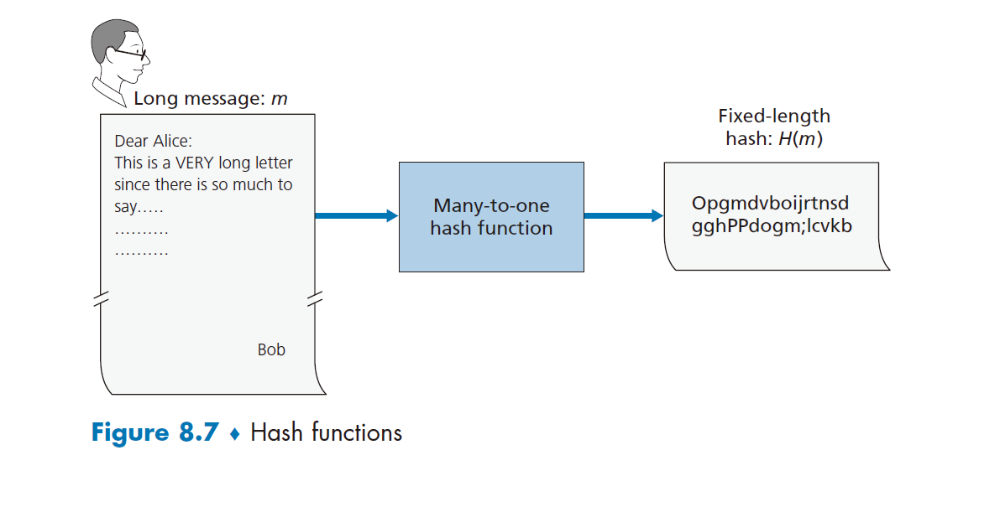
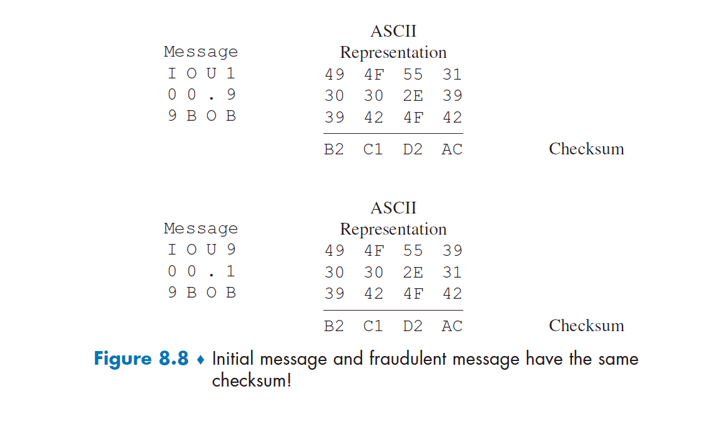
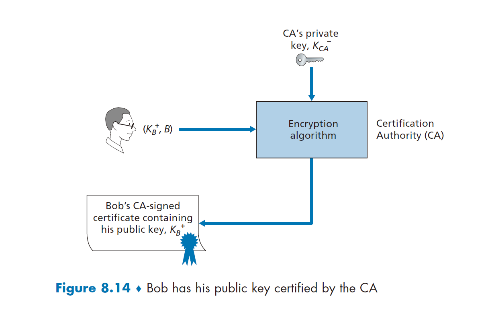
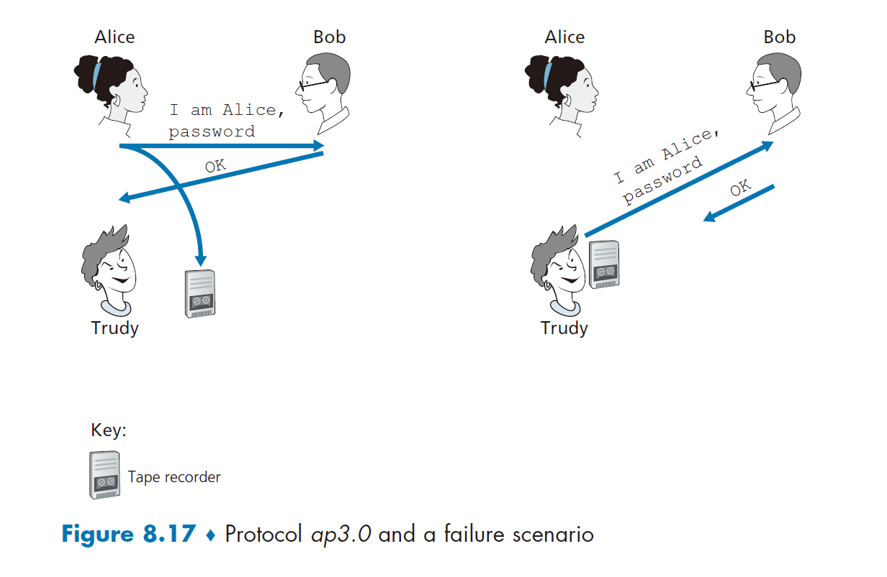

**目录：**

- [8. 计算机网络中的安全](#8-计算机网络中的安全)
  - [8.1. 什么是网络安全](#81-什么是网络安全)
  - [8.2. 密码学的原则](#82-密码学的原则)
    - [8.2.1. 对称密钥密码学](#821-对称密钥密码学)
    - [8.2.2. 公开密钥加密](#822-公开密钥加密)
  - [8.3. 报文完整性和数字签名](#83-报文完整性和数字签名)
    - [8.3.1. 密码散列函数](#831-密码散列函数)
    - [8.3.2. 报文鉴别码](#832-报文鉴别码)
    - [8.3.3. 数字签名](#833-数字签名)
  - [8.4. 端点鉴别](#84-端点鉴别)
  - [8.5. 安全电子邮件](#85-安全电子邮件)
    - [8.5.1. 安全电子邮件](#851-安全电子邮件)

**time : 07-15**

# 8. 计算机网络中的安全

早在 1-6 节我们就描述了某些非常盛行和危险的 Internet 攻击，包括恶意软件攻击、拒绝服务、嗅探、源伪装以及报文修改和删除。尽管我们已经学习了有关计算机网络的大量知识，但仍然没有考察如何使网络安全，使其免受那些攻击的威胁。在获得了新的计算机网络和 Internet 协议的专业知识后，我们现在将深入学习安全通信，特别是计算机网络能够防御那些令人厌恶的坏家伙的原理。

我们首先介绍一下 Alice 和 Bob，这俩人要进行通信，并希望该通信过程是“安全”的。由于本书是一本网络教科书，因此 Alice 和 Bob 可以是两台需要安全地交换路由表的路由器，也可以是希望建立一个安全传输连接的客户和服务器，或者是两个交换安全电子邮件的电子邮件应用程序，所有这些学习案例都是在本章后面我们要考虑的。总之，Alice 和 Bob 是安全领域中两个众所周知的固定设备，也许因为使用 Alice 和 Bob 更为有趣，这与命名为“A”的普通实体需要安全地与命名为“B”的普通实体进行通信的作用是一样的。需要安全通信的例子通常包括不正当的情人关系、战时通信和商业事务往来。我们宁愿用第一个例子而不用后两个例子，并使用 Alice 和 Bob 作为发送方和接收方，以第一种情况为背景来讨论问题。

我们说过 Alice 和 Bob 要进行通信并希望做到“安全”，那么此处的安全其确切含义是什么呢？如我们将看到的那样，安全性（像爱一样）是多姿多彩的东西；也就是说，安全性有许多方面。毫无疑问，Alice 和 Bob 希望他们之间的通信内容对于窃听者是保密的。他们可能也想要确保当他们进行通信时，确实是在和对方通信，还希望如果他们之间的通信被窃听者篡改，他们能够检测到该通信已被篡改破坏。在本章的第一部分，我们将讨论能够加密通信的密码技术，鉴别正在与之通信的对方并确保报文完整性。

在本章的第二部分，我们将研究基本的密码学原则怎样用于生成安全的网络协议。我们再次采用自顶向下方法，从应用层开始，逐层（上面四层）研究安全协议。我们将研究如何加密电子邮件，如何加密一条 TCP 连接，如何在网络层提供覆盖式安全性，以及如何使无线 LAN 安全。在本章的第三部分，我们将考虑运行的安全性，这与保护机构网络免受攻击有关。特别是，我们将仔细观察防火墙和入侵检测系统是怎样加强机构网络的安全性的。

## 8.1. 什么是网络安全

我们还是以要进行“安全”通信的情人 Alice 和 Bob 为例，开始网络安全的研究。这确切地意味着什么呢？显然，Alice 希望即使他们在一个不安全的媒体上进行通信，也只有 Bob 能够理解她所发送的报文，其中入侵者（入侵者名叫 Trudy）能够在该媒体上截获 从 Alice 向 Bob 传输的报文。Bob 也需要确保从 Alice 接收到的报文确实是由 Alice 所发送 的，并且 Alice 要确保和她进行通信的人的确就是 Bob。Alice 和 Bob 还要确保他们报文的内容在传输过程中没有被篡改。他们首先要确信能够通信（即无人拒绝他们接入通信所需的资源)。考虑了这些问题后，我们能够指出 **安全通信(secure communication)** 具有下列所需要的特性。

- **机密性(confidentiality)**。仅有发送方和希望的接收方能够理解传输报文的内容。 因为窃听者可以截获报文，这必须要求报文在一定程度上进行 **加密(encrypted)**，使截取的报文无法被截获者所理解。机密性的这个方面大概就是通常意义上对于 术语安全通信的理解。我们将在 8-2 节中学习数据加密和解密的密码学技术。
- **报文完整性(message integrity)**。Alice 和 Bob 希望确保其通信的内容在传输过程中未被改变——或者恶意篡改或者意外改动。我们在可靠传输和数据链路协议中 遇到的检验和技术在扩展后能够用于提供这种报文完整性，我们将在 8-3 节中研究该主题。
- **端点鉴别(end-point authentication)**。发送方和接收方都应该能证实通信过程所涉及的另一方，以确信通信的另一方确实具有其所声称的身份。人类的面对面通信可以通过视觉识别轻易地解决这个问题。当通信实体在不能看到对方的媒体上交换报文时，鉴别就不是那么简单了。当某用户要访问一个邮箱时，邮件服务器如何证实该用户就是他所声称的那个人呢？我们将在 8-4 节中学习端点鉴别技术。
- **运行安全性(operational security)**。几乎所有的机构(公司、大学等)今天都有了与公共 Internet 相连接的网络。这些网络都因此潜在地能够被危及安全。攻击者能够试图在网络主机中安放蠕虫，获取公司秘密，勘察内部网络配置并发起 DoS 攻击。我们将在 8-9 节中看到诸如防火墙和入侵检测系统等运行设备正被用于反制 对机构网络的攻击。防火墙位于机构网络和公共网络之间，控制接入和来自网络的分组。入侵检测系统执行“深度分组检查”任务，向网络管理员发岀有关可疑活动的警告。

明确了我们所指的网络安全的具体含义后，接下来考虑入侵者可能要访问的到底是哪些信息，以及入侵者可能采取哪些行动。图 8-1 阐述了一种情况。Alice (发送方)想要发 送数据给 Bob (接收方)。为了安全地交换数据，即在满足机密性、端点鉴别和报文完整性要求的情况下，Alice 和 Bob 交换控制报文和数据报文(以非常类似于 TCP 发送方和接收方双方交换控制报文和数据报文的方式进行)。通常将这些报文全部或部分加密。如在 1-6 节所讨论的那样，入侵者能够潜在地执行下列行为：

- **窃听**：监听并记录信道上传输的控制报文和数据报文。
- 修改、插入或删除报文或报文内容。

如我们将看到的那样，除非采取适当的措施，否则上述能力使入侵者可以用多种方式发动各种各样的安全攻击：窃听通信内容（可能窃取口令和数据），假冒另一个实体，“劫持” 一个正在进行的会话，通过使系统资源过载拒绝合法网络用户的服务请求等等。CERT 协调中心对已报道的攻击进行了总结［CERT 2016]。

已经知道在 Internet 中某处的确存在真实的威胁，则 Alice 和 Bob （两个需要安全通信的朋友）在 Internet 上的对应实体是什么呢？当然，Alice 和 Bob 可以是位于两个端系统的人类用户，例如，真实的 Alice 和真实的 Bob 真的需要交换安全电子邮件。他们也可以参与电子商务事务。例如，真实的 Bob 希望安全地向一台 Web 服务器传输他的信用卡号码，以在线购买商品。类似地，真实的 Alice 要与银行在线交互。需要安全通信的各方自身也可能是网络基础设施的一部分。前面讲过，域名系统（DNS，参见 2-4 节）或交换路由选 择信息的路由选择守护程序（参见第 5 章）需要在两方之间安全通信。对于网络管理应用也有相同的情况，第 5 章讨论了该主题。主动干扰 DNS 查找和更新（如在 2-4 节中讨论的 那样）、路由选择计算［RFC 4272］或网络管理功能［RFC 3414］的入侵者能够给 Internet 造成不可估量的破坏。

建立了上述框架，明确了一些重要定义以及网络安全需求之后，我们将深入学习密码学。应用密码学来提供机密性是不言而喻的，同时我们很快将看到它对于提供端点鉴别、报文完整性也起到了核心作用，这使得密码学成为网络安全的基石。

## 8.2. 密码学的原则

尽管密码学的漫长历史可以追溯到朱利叶斯・凯撒（Julius Caesar）时代，但现代密码技术（包括今天的 Internet 中正在应用的许多技术）基于过去 30 年所取得的进展。Kahn 的著作《破译者（Tlie Codebreakers）》（［Kahn 1967］和 Singh 的著作《编码技术：保密的科学-从古埃及到量子密码（The Code Book: The Science of Secrecy from Ancient Egypt to Quantum Cryptography》［Singh 1999］回顾了引人入胜的密码学的悠久历史。对密码学的全面讨论需要一本完整的书［Kaufman 1995； Schneier 1995］，所以我们只能初步了解密码学的基本方面，特别是因为这些东西正在今天的 Internet 上发挥作用。我们也注意到，尽管本节的重点是密码学在机密性方面的应用，但我们将很快看到密码学技术与鉴别、报文完整性和不可否认性等是紧密相关的。

密码技术使得发送方可以伪装数据，使入侵者不能从截取到的数据中获得任何信息。当然，接收方必须能够从伪装的数据中恢复出初始数据。图 8-2 说明了一些重要的术语。

现在假设 Alice 要向 Bob 发送一个报文。Alice 报文的最初形式(例如，“Bob, I love you. Alicen”)被称为 **明文(plaintext, cleartext)**。Alice 使用 **加密算法(encryption algorithm)** 加密其明文报文，生成的加密报文被称为 **密文(ciphertext)**，该密文对任何入侵者看起来是不可懂的。有趣的是在许多现代密码系统中，包括 Internet 上所使用的那些，加密技术本身是已知的，即公开发行的、标准化的和任何人都可使用的(例如[RFC 1321； RFC 3447； RFC 2420； NIST 2001])，即使对潜在的入侵者也是如此！显然，如果任何人都知道数据编码的方法，则一定有一些秘密信息可以阻止入侵者解密被传输的数据。这些秘密信息就是密钥。

在图中，Alice 提供了一个 **密钥(key)** $K_A$，它是一串数字或字符，作为加密算法的输入。加密算法以密钥和明文报文 m 为输入，生成的密文作为输出。用符号$K_A(m)$表示(使用密钥$K_A$加密的)明文报文加的密文形式。使用密钥心的实际加密算法显然与上下文有关。类似地，Bob 将为 **解密算法(decryption algorithm)** 提供密钥$K_B$将密文和 Bob 的密钥作为输入，输出初始明文。也就是说，如果 Bob 接收到一个加密的报文$K_A(m)$，他可通过计算 $K_B(K_A(m)) = m$进行解密。在 **对称密钥系统(symmetric key system)** 中，Alice 和 Bob 的密钥是相同的并且是秘密的。在 **公开密钥系统(public key system)**中，使用一对密钥：一个密钥为 Bob 和 Alice 俩人所知(实际上为全世界所知)，另一个密钥只有 Bob 或 Alice 知道(而不是双方都知道)。在下面两小节中，我们将更为详细地考虑对称密钥系统和公钥系统。

### 8.2.1. 对称密钥密码学

所有密码算法都涉及用一种东西替换另一种东西的思想，例如，取明文的一部分进行计算，替换适当的密文以生成加密的报文。在分析现代基于密钥的密码系统之前，我们首先学习一下 **凯撒密码(Caesar cipher)** 找找感觉，这是一种加密数据的方法。这种非常古老而简单的对称密钥算法由 Julius Caesar 发明。

凯撒密码用于英语文本时，将明文报文中的每个字母用字母表中该字母后第 k 个字母进行替换(允许回绕，即把字母 a 排在字母 z 之后)。例如，如果 k=3，则明文中的字母变成密文中的字母“d”；明文中的字母“b”变成密文中的字母“e”，依此类推。因此，k 的值就作为密钥。举一个例子，明文报文“bob, i love you. alice”在密文中变成“ere, l oryh brx. dolfh”。尽管密文看起来像乱码，但如果你知道使用了凯撒密码加密，因为密钥值只有 25 个，所以用不了多久就可以破解它。

凯撒密码的一种改进方法是 **单码代替密码(monoalphabetic cipher)**，也是使用字母表中的一个字母替换该字母表中的另一个字母。然而，并非按照规则的模式进行替换(例如，明文中的所有字母都用偏移量为 k 的字母进行替换)，只要每个字母都有一个唯一的替换字母，任一字母都可用另一字母替换，反之亦然。图为加密明文的一种可行替换规则。

明文报文"bob, i love you. alice"变成"nkn, s gktc wky. mgsbc”。因此，与用凯撒密码情况一样，这看起来像乱码。单码代替密码的性能看来要比凯撒密码的性能好得多，可能的字母配对为 26!(10^26 数量级)种，而不是 25 种。尝试所有 10^26 种可能配对的蛮力法要求的工作量太大，不是一种破解加密算法和解密报文的可行方式。但是，通过对明文语言进行统计分析，例如，在典型的英语文本中，由于已知字母“e”和字母“t”出现的频率较高（这些字母岀现的频率分别为 13%和 9%），并且常见的两三个字母的组合通常一起出现（例如，“in” “it” “the” “ion” “ing”等等），这就使得破解该密文变得相对容易。如果入侵者具有某些该报文的可能内容的知识，则破解该密码就会更为容易。例如，如果入侵者 Trudy 是 Bob 的妻子，怀疑 Bob 和 Alice 有暧昧关系，则她猜想“bob”和“alice”这些名字可能会出现在密文中。如果 Trudy 确信这两个名字出现在密文中，并有了上述报文的密文副本，则她能够立即决定这 26 个字母配对中的 7 个，比蛮力法少检查 10^9 种可能性。如果 Trudy 的确怀疑 Bob 有不正当的男女关系，她可能也非常期待从该报文中找到某些其他选择的词汇。

当考虑 Trudy 破解 Bob 和 Alice 之间加密方案的难易程度时，可以根据入侵者所拥有的信息分为三种不同的情况。

- **唯密文攻击**。有些情况下，入侵者只能得到截取的密文，也不了解明文报文的内容。我们已经看到，统计分析有助于对加密方案的 **唯密文攻击(ciphertext-only attack)**。
- **已知明文攻击**。前面已经看到，如果 Trudy 以某种方式确信在密文报文中会出现"bob”和"alice"，她就可以确定字母 a、l、i、c、e、b 和 o 的（明文，密文）匹配关系。Trudy 也可能会幸运地记录到传输的所有密文，然后在一张纸上找到 Bob 写下的已解密的明文。当入侵者知道（明文，密文）的一些匹配时，我们将其称为对加密方案的 **已知明文攻击(known-plaintext attack)**。
- **选择明文攻击**。在 **选择明文攻击(chosen-plaintext attack)** 中，入侵者能够选择某一明文报文并得到该明文报文对应的密文形式。对于我们前面所说的简单加密算法来说，如果 Trudy 能让 Alice 发送报文"The quick brown fox jumps over the lazy dog”，则 Trudy 就能够完全破解 Alice 和 Bob 所使用的加密方案。但是随后我们将看到，对于更为复杂的加密技术来说，使用选择明文攻击不一定意味着能够攻破该加密机制。

500 年前，发明了 **多码代替密码(polyalphabetic encryption)**，这种技术是对单码代替密码的改进。多码代替密码的基本思想是使用多个单码代替密码，一个单码代替密码用于加密某明文报文中一个特定位置的字母。因此，在某明文报文中不同位置出现的相同字母可能以不同的方式编码。图 8-4 中显示了多码代替密码机制的一个例子。它使用两个凯撒密码（其中 k=5 和 k=19），如图中不同的行所示。我们可以选择使用这两个凯撒密码 C1 和 C2，加密时采用以 C1，C2，C2，C1，C2 的次序循环的模式，即明文的第一个字母用 C1 编码，第二和第三个字母用 C2 编码，第四个字母用 C1 编码，第五个字母用 C2 编码，然后循环重复该模式，即第六个字母用 C1 编码，第七个字母用 C2 编码，依此类推。这样一来，明文报文“bob, i love you.”加密后成为“ghu, n etox dhz.”。注意到明文报文中的第一个“b”用加密为“g”，第二个“b”用 C2 加密为“u”。在这个例子中，加密和解密“密钥”是两个凯撒密码密钥（k=5 和 k=19）和 C1, C2, C2, C1, C2 的次序模式的知识。

1. **块密码**

我们现在回到现代社会中，考察对称密钥加密今天的工作方式。对称加密技术有两种宽泛的类型：**流密码(stream cipher)** 和 **块密码(block cipher)**。当我们研究无线 LAN 的安全性时，将在 8-7 节中简要地研究流密码。在本节中，我们关注块密码，该密码用在多种 Internet 协议的加密中，包括 PGP（用于安全电子邮件）、SSL（用于使 TCP 连接更安全）和 IPsec（用于使网络层传输更安全）。

在块密码中，要加密的报文被处理为 k 比特的块。例如，如果 k = 64，则报文被划分为 64 比特的块，每块被独立加密。为了加密一个块，该密码采用了一对一映射，将力 k 特块的明文映射为 k 比特块的密文。我们来看一个例子。假设 k=3，因此块密码将 3 比特输入（明文）映射为 3 比特输出（密文）。下表给出了一种可能的映射。注意到这是一个一对一的映射，即对每种输入有不同的输出。这种块密码将报文划分成 3 比特的块并根据映射关系进行加密。可以验证，报文 010110001111 被加密成了 101000111001。

| 输入 | 输出 |
| ---- | ---- |
| 000  | 110  |
| 001  | 111  |
| 010  | 101  |
| 011  | 100  |
| 100  | 011  |
| 101  | 010  |
| 110  | 000  |
| 111  | 001  |

继续这个 3 比特块的例子，注意到上述映射只是许多可能映射中的一种。有多少种可能的映射呢？要回答这个问题，观察到一个映射只不过是所有可能输入的排列。共有 2^3=8）种可能的输入（排列在“输入”栏中）。这 8 种输入能够排列为 8! =40320 种不同方式。因为这些排列的每种都定义了一种映射，共有 40320 种可能的映射。我们能够将这些映射的每种视为一个密钥，即如果 Alice 和 Bob 都知道该映射（密钥），他们能够加密和解密在他们之间发送的报文。

对这种密码的蛮力攻击即通过使用所有映射来尝试解密密文。仅使用 40320 种映射（当 k = 3），这能够在一台桌面 PC 上迅速完成。为了挫败蛮力攻击，块密码通常使用大得多的块，由 64 比特甚至更多比特组成。注意到对于通常的 k 比特块密码，可能映射数量是 2^k!，对于即使不大的 k 值（如 k = 64），这也是一个天文数字。

如刚才所述，尽管全表块密码对于不大的 k 值能够产生健壮的对称密钥加密方案，但不幸的是它们难以实现。对于 k =64 和给定的映射，将要求 Alice 和 Bob 维护一张具有 2^64 个输入值的表，这是一个难以实现的任务。此外，如果 Alice 和 Bob 要改变密钥，他们将不得不每人重新生成该表。因此，全表块密码在所有输入和输出之间提供了预先决定的映射（如在上述例子中那样），这简直是不可能实现的事。

取而代之的是，块密码通常使用函数模拟随机排列表。在图 8-5 中显示了当 k=64 时 这种函数的一个例子（引自［Kaufman 1995］）。该函数首先将 64 比特块划分为 8 个块，每个块由 8 比特组成。每个 8 比特块由一个“8 比特到 8 比特”表处理，这是个可管理的长度。例如，第一个块由标志为$T_1$的表来处理。接下来，这 8 个输出块被重新装配成一个 64 比特的块。该输出被回馈到 64 比特的输入，开始了第二次循环。经几次这样的循环后，该函数提供了一个 64 比特的密文块。这种循环的目的是使得每个输入比特影响最后输出比特的大部分（即使不是全部）。（如果仅使用一次循环，一个给定的输入比特将仅影响 64 输岀比特中的 8 比特。）这种块密码算法的密钥将是 8 张排列表(假定置乱函数是公共已知的)。

目前有一些流行的块密码，包括 DES(Data Encryption Standard, 数据加密标准)，3DES 和 AES(Advanced Encryption Standard, 高级加密标准)。这些标准都使用了函数(而不是预先决定的表)，连同图 8-5 的线(虽然对每种密码来说更为复杂和具体)。这些算法也都使用了比特串作为密钥。例如，DES 使用了具有 56 比特密钥的 64 比特块。AES 使用 128 比特块，能够使用 128、192 和 256 比特长的密钥进行操作。一个算法的密钥决定了特定“小型表”映射和该算法内部的排列。对这些密码进行蛮力攻击要循环通过所有密钥，用每个密钥应用解密算法。观察到采用长度为 n 的密钥，有 2^n 可能的密钥。NIST ［NIST2001］估计，如果用 1 秒破解 56 比特 DES 的计算机(就是说，每秒尝试所有 2^56 个密钥)来破解一个 128 比特的 AES 密钥，要用大约 149 万亿年的时间才有可能成功。

2. **密码块链接**

在计算机网络应用中，通常需要加密长报文(或长数据流)。如果使用前面描述的块密码，通过直接将报文切割成 k 比特块并独立地加密每块，将出现一个微妙而重要的问题。为了理解这个问题，注意到两个或更多个明文块可能是相同的。例如，两个或更多块 中的明文可能是“HTTP/1.1”。对于这些相同的块，块密码当然将产生相同的密文。当攻击者看到相同的密文块时，它可能潜在地猜出其明文，并且通过识别相同的密文块和利用支撑协议结构的知识，甚至能够解密整个报文［Kaufman 1995］。

为了解决这个问题，可以在密文中混合某些随机性，使得相同的明文块产生不同的密文块。为了解释这个想法，令 m(i)表示第 i 个明文块，c(i)表示第 i 个密文块，并且 a㊉b 表示两个比特串 a 和 b 的异或(XOR)。(前面讲过 0㊉0=1㊉1=0 和 0㊉1=1㊉0=1，并且两个比特串的异或是逐位进行的。例如 10101010㊉11110000=01011010。) 另外，将具有密钥 S 的块密码加密算法表示为$K_S$。其基本思想如下：发送方为第 i 块生成一个随机的 k 比特数 r(i)，并且计算 $c(i) = K_S(m(i)㊉r(i))$。注意到每块选择一个新的 k 比特随机数。则发送方发送 c(1)、r(1)、c(2)、r(2)、c(3)和 r(3)等等。因为接收方 接收到 c(i)和 r(i)，它能够通过计算$m(i) =K_S(c(i)㊉r(i))$而恢复每个明文块。重要的是注意到下列事实：尽管 r(i)是以明文发送的，并且因此能被 Trudy 嗅探到，但她无法获得明文 m(i)，因为她不知道密钥 $K_S$。同时注意到如果两个明文块 m(i)和 m(j)是相同的，对应的密文块 c(i)和 c(j)将是不同的(只要随机数 r(i)和 r(i)不同，这种情况出现的概率将很高)。

举例来说，考虑表中的 3 比特块密码。假设明文是 010010010。如果 Alice 直接对此加密，没有包括随机性，得到的密文变为 101101101 如果 Trudy 嗅探到该密文，因为这三个密文块都是相同的，她能够正确地推断出这三个明文块都是相同的。现在假设 Alice 产生了随机块 r(1)=001，r(2)=111 和 r(3) =100，并且使用了上述技术来生成密文 c(1)=100、c(2) = 010 和 c(3)=000。注意到即使明文块相同，三个密文块也是不同的。Alice 则发送 c(1)、r(1)、c(2)和 r(2)。读者可证实 Bob 能够使用共享的密钥$K_S$获得初始的明文。

精明的读者将注意到，引入随机性解决了一个问题而产生了另一个问题：Alice 必 须传输以前两倍的比特。实际上，对每个加密比特，她现在必须再发送一个随机比特，使需要的带宽加倍。为了有效利用该技术，块密码通常使用了一种称为 **密码块链接(Cipher Block Chaining, CBC)** 的技术。其基本思想是仅随第一个报文发送一个随机值，然后让发送方和接收方使用计算的编码块代替后继的随机数。具体而言，CBC 运行过程如下：

(1) 在加密报文(或数据流)之前，发送方生成一个随机的 k 比特串，称为 **初始向量(Initialization Vector, IV)**。将该初始向量表示为 c(0)。发送方以明文方式将 IV 发送给接收方。
(2) 对第一个块，发送方计算 m(1)㊉c(0)，即计算第一块明文与 IV 的异或。然后通过块密码算法运行得到的结果以得到对应的密文块，即$c(1)=K_S(m(1)㊉c(0))$。发送方 向接收方发送加密块 c(1)。
(3) 对于第 i 个块，发送方根据$c(i)=K_S(m(1)㊉c(i-1))$生成第 i 个密文块。

我们现在来考察这种方法的某些后果。首先，接收方将仍能够恢复初始报文。毫无疑问，当接收方接收到 c(i) 时，它用$K_S$解密之以获得$s(i) =m(i)㊉c(i-1)$，因为接收方已经知道 c(i-1)，则从$m(i)=s(i)㊉c(i-1)$获得明文块。第二，即使两个明文块是相同的，相应的密文块也(几乎)总是不同的。第三，虽然发送方以明文发送 IV，入侵者将仍不能解密密文块，因为该入侵者不知道秘密密钥 S。最后，发送方仅发送一个最前的块(即 IV),因此对(由数百块组成的)长报文而言增加的带宽用量微不足道。

举例来说，对上面表中的 3 比特块密码，明文为 010010010 和 IV=c(0)=001，我们现在来确定其密文。发送方首先使用 IV 来计算 $c(1)=K_S(m(1)㊉c(0)) = 100$。发送方然后计算 $c(2)=K_S(m(2)㊉c(1)) = K_S(010 ㊉ 100) = 000$，并且 $c(3) =K_S(m(3)㊉c(2)) = K_S(010㊉000) = 101$。读者可证实接收方若知道了 IV 和 $K_S$，将能够恢复初始的明文。

当设计安全网络协议时，CBC 有一种重要的后果：需要在协议中提供一种机制，以从发送方向接收方分发 IV。在本章稍后我们将看到几个协议是如何这样做的。

### 8.2.2. 公开密钥加密

从凯撒密码时代直到 20 世纪 70 年代的两千多年以来，加密通信都需要通信双方共享一个共同秘密，即用于加密和解密的对称密钥。这种方法的一个困难是两方必须就共享密钥达成一致，但是这样做的前提是需要通信(可假定是安全的)！可能是双方首先会面，人为协商确定密钥（例如，凯撒的两个百夫长在罗马浴室碰头），此后才能进行加密通信。但是，在网络世界中，通信各方之间可能从未见过面，也不会在网络以外的任何地方交谈。此时通信双方能够在没有预先商定的共享密钥的条件下进行加密通信吗？ 1976 年，Diffie 和 Hellman [Diffie 1976］论证了一个解决这个问题的算法（现在称为 Diffie-Hellman 密钥交换），这是个完全不同、极为优雅的安全通信算法，开创了如今的公开密钥密码系统的发展之路。我们很快就会看到公开密钥密码系统也有许多很好的特性，使得它不仅可以用于加密，还可以用于鉴别和数字签名。有趣的是，最近发现 20 世纪 70 年代早期由英国通信电子安全团体的研究人员独立研究的一系列秘密报告中的思想，与［Diffie 1976］ 和［RSA 1978］中的思想类似［Ellis 1987］。事实常常如此，伟大的想法通常会在许多地方独立地闪现；幸运的是，公钥的进展不仅秘密地发生，而且也在公众视野中发生。

公开密钥密码的使用在概念上相当简单。假设 Alice 要和 Bob 通信。如图 8-6 所示，这时 Alice 和 Bob 并未共享一个密钥（如同在对称密钥系统情况下），而 Bob（Alice 报文的接收方）则有两个密钥，一个是世界上任何人（包括入侵者 Trudy）都可得到的 **公钥(public key)**，另一个是只有 Bob 知道的 **私钥(private key)**。我们使用符号$K_B^+$和$K_B^-$来分别表示 Bob 的公钥和私钥。为了与 Bob 通信，Alice 首先取得 Bob 的公钥，然后用这个公钥和一个众所周知的（例如，已标准化的）加密算法，加密她要传递给 Bob 的报文 m，即 Alice 计算$K_B^+(m)$。Bob 接收到 Alice 的加密报文后，用其私钥和一个众所周知的（例如，已标准化的）解密算法解密 Alice 的加密报文，即 Bob 计算$K_B^-(K_B^+(m))$。后面我们将看到，存在着可以选择公钥和私钥的加密/解密算法和技术，使得$K_B^-(K_B^+(m)) = m$。也就是说，用 Bob 的公钥$K_B^+$加密报文 m（得到$K_B^+(m)$），然后再用 Bob 的私钥$K_B^-$解密报文的密文形式（就是计算$K_B^-(K_B^+(m))$）就能得到最初的明文 m。这是个不寻常的结果！用这种办法，Alice 可以使用 Bob 公开可用的密钥给 Bob 发送机密信息，而他们任一方都无须分发任何密钥！我们很快能够看到，公钥和私钥加密相互交换同样能够得到不寻常的结果，即$K_B^-(K_B^+(m)) = K_B^+(K_B^-(m)) = m$。

因此公开密钥密码体制的使用在概念上是简单的。但是有两点必须要注意。首先应关注的是，尽管入侵者截取到 Alice 的加密报文时看到的只是乱码，但是入侵者知道公钥（显然 Bob 的公钥是全世界都可以使用的）和 Alice 加密所用的算法。Trudy 可以据此发起选择明文攻击，使用已知的标准加密算法和 Bob 的公开可用的加密密钥对她所选择的任意报文编码！例如，Trudy 可以尝试对她怀疑 Alice 可能发送的全部报文或部分报文编码。很明显，要使公开密钥密码能工作，密钥选择和加密/解密算法必须保证任意入侵者都不能（至少要困难得几乎不可能）确定出 Bob 的私钥或者以某种方式解密或猜出 Alice 发给 Bob 的报文。第二个值得关注的问题是，既然 Bob 的加密密钥是公开的，任何人（包括 Alice 和其他声称自己是 Alice 的人）都可能向 Bob 发送一个已加密的报文。在单一共享密钥情况下，发送方知道共享秘密密钥的事实就已经向接收方隐含地证实了发送方的身份。然而在公钥体制中，这点就行不通了，因为任何一个人都可向 Bob 发送使用 Bob 的公开可用密钥加密的报文。这就需要用数字签名把发送方和报文绑定起来，数字签名是我们在 8-3 节中讨论的主题。

1. **RSA**

尽管可能有许多算法处理这些关注的问题，但 **RSA 算法**（RSA algorithm, 取算法创立人 Ron Rivest, Adi Shamir 和 Leonard Adleman 的首字母命名）几乎已经成了公开密钥密码的代名词。我们首先来理解 RSA 是如何工作的，然后再考察 RSA 的工作原理。

RSA 广泛地使用了模 n 算术的算术运算。故我们简要地回顾一下模算术。前面讲过 x mod n 只是表示被 n 除时 x 的余数；因此如 19 mod 5 = 4。在模算术中，人们执行通常的加法、乘法和指数运算。然而，每个运算的结果由整数余数代替，该余数是被 n 除后留下的数。对于模算术的加法和乘法可由下列便于施用的事实所简化：

$[(a \: mod \: n) + (b \: mod \: n)] \: mod \: n = (a+b) \: mod \: n$
$[(a \: mod \: n) - (b \: mod \: n)] \: mod \: n = (a-b) \: mod \: n$
$[(a \: mod \: n) \cdot (b \: mod \: n)] \: mod \: n = (a \cdot b) \: mod \: n$

从第三个事实推出$(a \: mod \: n)^d \: mod \: n = a^d \: mod \: n$，我们很快将会发现这个恒等式是非常有用的。

现在假设 Alice 要向 Bob 发送一个 RSA 加密的报文，如图 8-6 所示。在我们的讨论中，心中永远要记住一个报文只不过是一种比特模式，并且所有比特模式能唯一地被一个整数 （连同该比特模式的长度）表示。例如，假设一个报文是比特模式 1001；这个报文能由十进制整数 9 来表示。所以，当用 RSA 加密一个报文时，等价于加密表示该报文的这个唯一的整数。

RSA 有两个互相关联的部分：

- 公钥和私钥的选择。
- 加密和解密算法。

为了生成 RSA 的公钥和私钥，Bob 执行如下步骤：

(1) 选择两个大素数 p 和 q。那么 p 和 q 应该多大呢？该值越大，破解 RSA 越困难，而执行加密和解密所用的时间也越长。RSA 实验室推荐，公司使用时，p 和 q 的乘积为 1024 比特的数量级。对于选择大素数的方法的讨论，参见[Caldwell 2012]。
(2) 计算 n=pq 和 z = (p - 1) (q - 1)。
(3) 选择小于 n 的一个数 e，且使 e 和 z 没有（非 1 的）公因数。（这时称 e 与 z 互素。）使用字母 e 表示是因为这个值将被用于加密。
(4) 求一个数 d，使得 ed-1 可以被 z 整除（就是说，没有余数）。使用字母 d 表示是因为这个值将用于解密。换句话说，给定 e 我们选择 d，使得：

$$ed \: mod \: z = 1$$

(5) Bob 使外界可用的公钥$K_B^+$是一对数 (n, e) ，其私钥$K_B^-$是一对数 (n, d)。

Alice 执行的加密和 Bob 进行的解密过程如下：

- 假设 Alice 要给 Bob 发送一个由整数 m 表示的比特组合，且 m < n。为了进行编码，Alice 执行指数运算 m^e，然后计算 m^e 被 n 除的整数余数。换言之，Alice 的明文报文 m 的加密值 c 就是：

$$c = m^e \: mod \: n$$

对应于这个密文 c 的比特模式发送给 Bob。

- 为了对收到的密文报文 c 解密，Bob 计算：

$$m = c^d \: mod \: n$$

这要求使用他的私钥 (n, d)。

举一个简单的 RSA 例子，假设 Bob 选择 p=5 和 q=7。（坦率地讲，这样小的值无法保证安全。）则 n=35 和 z=24。因为 5 和 24 没有公因数，所以 Bob 选择 e=5。最后，因为 5x29-1（即 ed-1）可以被 24 整除，所以 Bob 选择 d=29。Bob 公开了 n = 35 和 e = 5 这两个值，并秘密保存了 d = 29。观察公开的这两个值，假定 Alice 要发送字母 “I” “o” “v”和“e”给 Bob。用 1〜26 之间的每个数表示一个字母，其中 1 表示“a”, ..., 26 表示“z”，Alice 和 Bob 分别执行如下面两个表所示的加密和解密运算。注意到在这个例子中，我们认为每四个字母作为一个不同报文。一个更为真实的例子是把这四个字母转换成它们的 8 比特 ASCII 表示形式，然后加密与得到的 32 比特的比特模式对应的整数。（这样一个真实的例子产生了一些长得难以在教科书中打印出来的数！）

**加密：**

| 明文字母 | m: 数字表示 | $m^e$   | 密文 $c = m^e \: mod \: n$ |
| -------- | ----------- | ------- | -------------------------- |
| l        | 12          | 248832  | 17                         |
| o        | 15          | 759375  | 15                         |
| v        | 22          | 5153632 | 22                         |
| e        | 5           | 3125    | 10                         |

**解密：**

| 密文 c | $c^d$                                   | $m = c^d \: mod \: n$ | 明文字母 |
| ------ | --------------------------------------- | --------------------- | -------- |
| 17     | 481968572106750915091411825223071697    | 12                    | l        |
| 15     | 12783403948858939111232757568359375     | 15                    | o        |
| 22     | 851643319086537701956194499721106030592 | 22                    | v        |
| 10     | ]00000000000000000000000000000          | 5                     | e        |

假定上面两个表中的简单示例已经产生了某些极大的数，并且假定我们前面看到 p 和 q 都是数百比特长的数，这些都是实际使用 RSA 时必须要牢记的。如何选择大素数? 如何选择 e 和 d？如何对大数进行指数运算？对这些重要问题的详细讨论超出了本书的范围，详情请参见［Kaufman 1995］以及其中的参考文献。

2. **会话密钥**

这里我们注意到，RSA 所要求的指数运算是相当耗费时间的过程。形成对比的是，DES 用软件实现要比 RSA 快 100 倍，用硬件实现则要快 1000 ~ 10 000 倍[RSA Fast 2012]。所以，在实际应用中，RSA 通常与对称密钥密码结合起来使用。例如，如果 Alice 要向 Bob 发送大量的加密数据，她可以用下述方式来做。首先，Alice 选择一个用于加密数据本身的密钥，这个密钥有时称为 **会话密钥(session key)**，该会话密钥表示为$K_S$。Alice 必须把这个会话密钥告知 Bob，因为这是他们在对称密钥密码（如 DES 或 AES）中所使用的共享对称密钥。Alice 可以使用 Bob 的 RSA 公钥来加密该会话密钥，即计算$c = (K_S)^e \: mod \: n$。Bob 收到了该 RSA 加密的会话密钥 c 后，解密得到会话密钥$K_S$。Bob 此时已经知道 Alice 将要用于加密数据传输的会话密钥了。

3. **RSA 的工作原理**

RSA 加密/解密看起来相当神奇。为什么那样应用加密算法，然后再运行解密算法，就能恢复出初始报文呢？要理解 RSA 的工作原理，我们仍将记 n=pq，其中 p 和 q 是 RSA 算法中的大素数。

前面讲过，在 RSA 加密过程中，一个报文 m（唯一地表示为整数）使用模 n 算术做 e 次幕运算，即：

$$c = m^e \: mod \: n$$

解密则先对该值执行 d 次幕运算，再做模 n 运算。因此先加密再解密的结果是$(m^e \: mod \: n)^d \: mod \: n$。下面我们来看关于这个量能够得到什么。正如前面提到的，模算术的一个重要性质是对于任意值 a，b 和 d 都有$(a \: mod \: n)^d \: mod \: n = a^d \: mod \: n$。因此，在这个性质中使用$a = m^e$则有：

$$(m^e \: mod \: n)^d \: mod \: n = m^{ed} \: mod \: n$$

因此剩下证明$m^{ed} \: mod \: n = m$。尽管我们正试图揭开 RSA 工作原理的神秘面纱，但为了做到这一点，我们还需要用到数论中一个相当神奇的结果。具体而言，就是要用到数论中这样的结论：如果 p 和 q 是素数，且有 n = pq 和 z = (p - 1)(q - 1)，则 $x^y \: mod \: n$与$x^{y \: mod \: z} \: mod \: n$是等同的[Kaufman 1995]。应用这个结论，对于 x = m 和 y = ed 可得：

$$m^{ed} \: mod \: n = m ^{ed \: mod \: z} \: mod \: n$$

但是要记住，我们是这样选择 e 和 d 的，即$ed \: mod \:  z = 1$。这告诉我们：

$$m^{ed} \: mod \: n = m ^1 \: mod \: n = m$$

这正是我们希望得到的结果！先对 m 做 e 次幕运算（加密）再做 d 次幕运算（解密），然后做模 m 的算术运算，就可得到初始的 m。甚至更为奇妙之处是这样一个事实，如果我们先对 m 做 d 次幕运算（加密）再做 e 次幕运算，即颠倒加密和解密的次序，先执行解密操作再执行加密操作，也能得到初始值 m。这个奇妙的结果完全遵循下列模算术：

$$(m^d \: mod \: n)^e \: mod \: n = m ^de \: mod \: n = m^ed \: mod \: n = (m^e \: mod \: n)^d \: mod \: n$$

RSA 的安全性依赖于这样的事实：目前没有已知的算法可以快速进行一个数的因数分解，这种情况下公开值 n 无法快速分解成素数 p 和 q。如果已知 p 和 q，则给定公开值 e 就很容易计算出密钥 d。另一方面，不确定是否存在因数分解一个数的快速算法，从这种意义上来说，RSA 的安全性也不是确保的。另一种流行的公钥加密算法是 Diffie-Hellman，我们将在课后习题中简要探讨它。 Diffie-Hellman 并不像 RSA 那样多功能，即它不能用于加密任意长度的报文。然而，它能够用来创建一个对称的会话密钥，该密钥再被用于加密长报文。

## 8.3. 报文完整性和数字签名

在前面一节中我们看到了能够使用加密为两个通信实体提供机密性。在本节中我们转向提供 **报文完整性(message integrity)** 这个同等重要的主题。报文完整性也称为报文鉴别。连同报文完整性，在本节中我们将讨论两个相关的主题：数字签名和端点鉴别。

我们再次使用 Alice 和 Bob 来定义报文完整性问题。假定 Bob 接收到一个报文（这可能已经加密或可能是明文），并且他认为这个报文是由 Alice 发送的。为了鉴别这个报文，Bob 需要证实:

1. 该报文的确源自 Aliceo
2. 该报文在到 Bob 的途中没有被篡改。

我们将在 8-4~8-7 节中看到，报文完整性这个问题在所有安全网络协议中都是至关重要的。

举一个特定的例子，考虑一个使用链路状态路由选择算法（例如 OSPF）的计算机网络，在该网络中决定每对路由器之间的路由（参见第 5 章）。在一个链路状态算法中，每 台路由器需要向该网络中的所有其他路由器广播一个链路状态报文。路由器的链路状态报文包括邻接节点的列表以及到这些邻居的直接费用。一旦某台路由器从其他所有路由器收到了链路状态报文，它能够生成该网络的全图，运行它的最小费用路由选择算法并配置它的转发表。对路由选择算法的一个相对容易的攻击是，Trudy 分发具有不正确状态信息的虚假链路状态报文。因此产生了报文完整性的需求：当路由器 B 收到来自路由器 A 的链路状态报文时，路由器 B 应当证实路由器 A 实际生成了该报文，并且进一步证实在传输过程中该报文没有被篡改。

在本节中，我们描述一种由许多安全网络协议所使用的流行报文完整性技术。但在做此事之前，我们需要涉及密码学中的另一个重要主题，即密码散列函数。

### 8.3.1. 密码散列函数

如图所示，散列函数以机为输入，并计算得到一个称为散列的固定长度的字符串 H(m)。Internet 检验和（第 3 章）和 CRC（第 6 章）都满足这个定义。**密码散列函数(cryptographic hash function)** 要求具有下列附加的性质：

- 找到任意两个不同的报文 x 和 y 使得 H(x) = H(y)，在计算上是不可能的。

不严格地说，这种性质就意味着入侵者在计算上不可能用其他报文替换由散列函数保护的报文。这就是说，如果(m, H(m))是报文和由发送方生成的报文散列的话，则入侵者不可能伪造另一个报文 y 的内容，使得该报文具有与原报文相同的散列值。

我们来证实一个简单的检验和（如 Internet 检验和）只能算作劣质的密码散列函数。不像在 Internet 检验和中执行反码运算那样，我们把每个字符看作一个字节，并把这些字节加到一起，一次用 4 字节的块来进行计算。假定 Bob 欠 Alice 100.99 美元并且向 Alice 发送一张借据，这个借据包含文本字符串“IOU100.99BOB”。这些字符的 ASCII 表示(以十六进制形式)为 49, 4F, 55, 31, 30, 30, 2E, 39, 39, 42, 4F, 42。

图 8-8 上半部分显示了这个报文的 4 字节检验和是 B2 C1 D2 AC。图 8-8 下半部分显示了一条稍微不同的报文(但是 Bob 要付的钱却多了许多)。报文“IOU100.99BOB”和“IOU900.19BOB”有相同的检验和。因此，这种简单的检验和算法违反了上述要求。给定初始数据，很容易找到有相同检验和的另一组数据。很明显，为了安全起见，我们需要比检验和更为强有力的散列函数。

Ron Rivest [RFC 1321]的 MD5 散列算法 如今正在广泛使用。这个算法通过 4 步过程计算得到 128 比特的散列。这 4 步过程由下列步骤组成：1. 填充：先填 1，然后填足够多的 0，直到报文长度满足一定的条件；2. 添加：在填充前添加一个用 64 比特表示的报文长度；3. 初始化累加器；4. 循环：在最后的循环步骤中，对报文的 16 字块进行 4 轮处理。MD5 的描述(包括一个 C 源代码实现)可参见[RFC 1321]。

目前正使用的第二个主要散列算法是安全散列算法 SHA-1(Security Hash Algorithm) [FIPS 1995]。这个算法的原理类似于 MD4[RFC 1320]设计中所使用的原理，而 MD4 是 MD5 的前身。SHA-1 是美国联邦政府的标准，任何联邦政府的应用程序如果需要使用密码散列算法的话，都要求使用 SHA-1。SHA-1 生成一个 160 比特的报文摘要。较长的输出长度可使 SHA-1 更安全。

### 8.3.2. 报文鉴别码

我们现在再回到报文完整性的问题。既然我们理解了散列函数，就先来看一下将如何执行报文完整性：

(1) Alice 生成报文 m 并计算散列 H(m)(例如使用 SHA-1)。
(2) 然后 Alice 将 H(m)附加到报文 m 上，生成一个扩展报文(m, H(m))叫并将该扩展报文发给 Bob。
(3) Bob 接收到一个扩展报文(m, h)并计算 H(m)。如果 H(m) = h，Bob 得到结论：一切正常。

这种方法存在明显缺陷。Trudy 能够生成虚假报文 m'，在其中声称她就是 Alice，计算 H(m') 并发送给 Bob (m', H(m'))。当 Bob 接收到该报文，一切将在步骤 3 中核对通过，并且 Bob 无法猜岀这种不轨的行为。

为了执行报文完整性，除了使用密码散列函数外，Alice 和 Bob 将需要共享秘密 s。这个共享的秘密只不过是一个比特串，它被称为 **鉴别密钥(authentication key)**。使用这个共享秘密，报文完整性能够执行如下：

(1) Alice 生成报文 m，用 s 级联 m 以生成 m + s，并计算散列 H(m + s)(例如使用 SHA-1)。H(m + s)被称为 **报文鉴别码(Message Authentication Code, MAC)**。
(2) 然后 Alice 将 MAC 附加到报文 m 上，生成扩展报文 (m, H(m + s))，并将该扩展报文发送给 Bob。
(3) Bob 接收到一个扩展报文(m, h)，由于知道 s，计算出报文鉴别码 H(m + s)。如果 H(m + s) = h，Bob 得到结论：一切正常。

图 8-9 中总结了上述过程。读者应当注意到这里的 MAC（表示“报文鉴别码”）与用于数据链路层中的 MAC （表示“媒体访问控制”）是不一样的！

MAC 的一个优良特点是它不要求一种加密算法。的确，在许多应用中，包括前面讨论的链路状态路由选择算法，通信实体仅关心报文完整性，并不关心报文机密性。使用 MAC，实体能够鉴别它们相互发送的报文，而不必在完整性过程中综合进复杂的加密过程。

如你所猜测，多年来已经提出了若干种对 MAC 的不同标准。目前最为流行的标准是 HMAC，它能够与 MD5 或 SHA-1 一道使用。HMAC 实际上通过散列函数运行数据和鉴别密钥两次[Kaufman 1995; RFC 2104]。

这里还遗留下一个重要问题。怎样向通信实体分发这个共享的鉴别密钥呢？例如，在链路状态路由选择算法中，在某种程度上需要向自治系统中的每台路由器分发该秘密鉴别密钥。（注意到所有路由器都能够使用相同的鉴别密钥。）一名网络管理员能够通过物理上访问每台路由器来实际完成这项工作。或者，如果这名网络管理员不够勤快，并且每台路由器都有它自己的公钥，那么该网络管理员能够用路由器的公钥加密鉴别密钥并分发给任何一台路由器，从而通过网络向路由器发送加密的密钥。

### 8.3.3. 数字签名

回想在过去的一周中你在纸上已经签过多少次你的名字。你可能经常会在支票、信用卡收据、法律文件和信件上签名。你的签名证明你（而不是其他人）承认和/或同意这些文件的内容。在数字领域，人们通常需要指出一个文件的所有者或创作者，或者表明某人认可一个文件内容。**数字签名(digital signature)** 就是一种在数字领域实现这些目标的密码技术。

正如手工签字一样，数字签名也应当以可鉴别的、不可伪造的方式进行。这就是说，必须能够证明由某个人在一个文件上的签名确实是由该人签署的（该签名必须是可证实的），且只有那个人能够签署那个文件（该签名无法伪造）。

我们现在来考虑怎样设计一个数字签名方案。当 Bob 签署一个报文时，可以观察到 Bob 必须将某些对他独特的东西放置在该报文上。Bob 可以考虑附加一个 MAC 用作签名，其中 MAC 是由他的密钥（对他是独特的）作用到该报文上而生成的，然后得到该散列值。 而 Alice 为了验证该签名，她必须也具有该密钥的副本，在这种情况下该密钥对 Bob 将不是唯一的。因此，此时 MAC 是无法胜任这项工作的。

前面讲过使用公钥密码，Bob 具有公钥和私钥，这两种密钥对 Bob 均为独特的。因此，公钥密钥是一种提供数字签名的优秀候选者。我们现在来研究一下这是怎样完成的。

假设 Bob 要以数字方式签署一个文档叫 我们能够想象这个文档是 Bob 打算签署并发送的一个文件或一个报文。如图 8-10 所示，为了签署这个文档，Bob 直接使用他的私钥$K_B^-$计算$K_B^-(m)$。乍一看，会感觉很奇怪，Bob 怎么会用他的私钥（在 8-2 节中，我们用私钥解密用其公钥加密的报文）签署文档！但是回想加密和解密都只不过是数学运算（RSA 中所做的 e 或 d 指数幕运算；参见 8-2 节），并且 Bob 的目的不是弄乱或掩盖文档的内容，而只是以可鉴别、不可伪造的方式签署这个文档。Bob 对文档 m 签名之后所得的文档就是$K_B^-(m)$。

数字签名$K_B^-(m)$是否满足了可鉴别、不可伪造的需求？假设 Alice 有 m 和$K_B^-(m)$。她要在法庭上证明（进行诉讼）Bob 确实签署过这个文档，他就是唯一能够签署该文档的人。Alice 持有 Bob 的公钥$K_B^+$，并把它用于 Bob 的数字签名$K_B^-(m)$，从而得到了文档 m。也就是说，Alice 计算$K_B^+(K_B^-(m))$。瞧！在 Alice 经历了令人注目的慌乱后得到了 m，它与初始文档完全一致。然后，Alice 就可以论证仅有 Bob 能够签署这个文档，基于如下理由：

- 无论是谁签署这个报文，都必定在计算签名$K_B^-(m)$过程中使用了$K_B^-$这个私钥，使$K_B^+(K_B^-(m)) = m$。
- 知道$K_B^-$这个私钥的唯一人只有 Bob。从 8-2 节我们对 RSA 的讨论中可知，知道公钥无助于得知私钥的信息。因此，知道私钥$K_B^-$的人才是生成密钥对$(K_B^+, K_B^-)$的人，而这个人首当其冲就是 Bob。（注意到此处假设 Bob 没有把陷泄露给任何人，也没有人从 Bob 处窃取到$K_B^-$。

注意到下列问题是重要的：如果源文档肌被修改过，比如改成了另一个文档 m'，则 Bob 对 m 生成的签名对 m'无效，因为$K_B^+(K_B^-(m))$不等于 m'。因此我们看到数字签名也提供完整性，使得接收方验证该报文未被篡改，同时也验证了该报文的源。

对用加密进行数据签名的担心是，加密和解密的计算代价昂贵。给定加解密的开销，通过完全加密/解密对数据签名是杀鸡用牛刀。更有效的方法是将散列函数引入数字签名。8-3-2 节中讲过，一种散列算法取一个任意长的报文 m，计算生成该报文的一个固定长度的数据“指纹”，表示为 H(m)。使用散列函数，Bob 对报文的散列签名而不是对报文本身签名，即 Bob 计算$K_B^-(H(m))$。因为 H(m)通常比报文 m 小得多，所以生成数字签名所需要的计算量大为降低。

在 Bob 向 Alice 发送一个报文的情况下，图 8-11 提供了生成数字签名的操作过程的概览。Bob 让他的初始长报文通过一个散列函数。然后他用自己的私钥对得到的散列进行数字签名。明文形式的初始报文连同已经数字签名的报文摘要（从此以后可称为数字签名） 一道被发送给 Aliceo 图 8-12 提供了鉴别报文完整性的操作过程的概览。Alice 先把发送方的公钥应用于报文获得一个散列结果。然后她再把该散列函数应用于明文报文以得到第二个散列结果。如果这两个散列匹配，则 Alice 可以确信报文的完整性及其发送方。

在继续学习之前，我们简要地将数字签名与 MAC 进行比较，尽管它们有类似之处，但也有重要的微妙差异。数字签名和 MAC 都以一个报文（或一个文档）开始。为了从 该报文中生成一个 MAC，我们为该报文附加一个鉴别密钥，然后取得该结果的散列。注意到在生成 MAC 过程中既不涉及公开密钥加密，也不涉及对称密钥加密。为了生成一个数字签名，我们首先取得该报文的散列，然后用我们的私钥加密该报文（使用公钥密码）。因此，数字签名是一种“技术含量更高”的技术，因为它需要一个如后面描述的、具有认证中心支撑的公钥基础设施（PKI）。我们将在 8-4 节中看到，PGP 是一种流行的安全电子邮件系统，为了报文完整性而使用数字签名。我们已经看到了 OSPF 为了报文完整性而使用 MAC。我们将在 8-5 节和 8-6 节中看到 MAC 也能用于流行的运输层和网络层安全协议。

**公钥认证**

数字签名的一个重要应用是 **公钥认证(public key certification)**，即证实一个公钥属于某个特定的实体。公钥认证用在许多流行的安全网络协议中，包括 IPsec 和 SSL。

为了深入理解这个问题，我们考虑一个因特网商务版本的经典的“比萨恶作剧”。假定 Alice 正在从事比萨派送业务，从因特网上接受订单。Bob 是一个爱吃比萨的人，他向 Alice 发送了一份包含其家庭地址和他希望的比萨类型的明文报文。Bob 在这个报文中也包含一个数字签名（即对原始明文报文的签名的散列），以向 Alice 证实他是该报文的真正来源。为了验证这个数字签名，Alice 获得了 Bob 的公钥（也许从公钥服务器或通过电子邮件报文）并核对该数字签名。通过这种方式，Alice 确信是 Bob 而不是某些青少年恶作剧者下的比萨订单。

在聪明的 Trudy 出现之前，这一切看起来进行得相当好。如图 8-13 中所示，Trudy 沉溺于一场恶作剧中。Trudy 向 Alice 发送一个报文，在这个报文中她说她是 Bob,给出了 Bob 家的地址并订购了一个比萨。在这个报文中，她也包括了她（Trudy）的公钥，虽然 Alice 自然地假定它就是 Bob 的公钥。Trudy 也附加了一个签名，但这是用她自己（Trudy） 的私钥生成的。在收到该报文后，Alice 就会用 Trudy 的公钥（Alice 认为它是 Bob 的公钥） 来解密该数字签名，并得到结论：这个明文报文确实是由 Bob 生成的。而当外送人员带着具有意大利辣香肠和凤尾鱼的比萨到达 Bob 家时，他会感到非常惊讶！

从这个例子我们看到，要使公钥密码有用，需要能够证实你具有的公钥实际上就是与你要进行通信的实体（人员、路由器、浏览器等）的公钥。例如，当 Alice 与 Bob 使用公钥密码通信时，她需要证实她假定是 Bob 的那个公钥确实就是 Bob 的公钥。

将公钥与特定实体绑定通常是由 **认证中心(Certification Authority, CA)** 完成的，CA 的职责就是使识别和发行证书合法化。CA 具有下列作用：

(1) CA 证实一个实体(一个人、一台路由器等)的真实身份。如何进行认证并没有强制的过程。当与一个 CA 打交道时，一方必须信任这个 CA 能够执行适当的严格身份验 证。例如，如果 Trudy 走进名为 Fly-by-Night 的认证中心并只是宣称“我是 Alice”，就可以 得到该机构颁发的与 Alice 的身份相关联的证书的话，则人们不会对 Fly-by-Night 认证中心所签发的公钥证书有太多的信任。另一方面，人们可能愿意(或不愿意！)信任某个 CA，如果这个 CA 是联邦或州计划的一部分的话。你对与公钥相关联的身份的信任程度，仅能 达到你对 CA 及其身份验证技术的信任程度。我们编织了多么混乱的信任关系网啊！
(2) 一旦 CA 验证了某个实体的身份，这个 CA 会生成一个将其身份和实体的公钥绑定起来的 **证书(certificate)**。这个证书包含这个公钥和公钥所有者全局唯一的身份标识信息 (例如，一个人的名字或一个 IP 地址)。由 CA 对这个证书进行数字签名。这些步骤显示在图 8-14 中。

我们现在来看怎样使用认证来对抗“比萨订购”中的恶作剧者(如 Trudy) 和其他意外情况。Bob 下订单的同时，他也发送了其 CA 签署的证书。Alice 使用 CA 的公钥来核对 Bob 证书的合法性并提取 Bob 的公钥。

**国际电信联盟(International Telecommunication Union, ITU)** 和 IETF 都研发了用于 CA 的系列标准。ITU X.509 ［ITU 2005a］规定了证书的鉴别服务以 及特定语法。［RFC 1422］描述了安全因特网电子邮件所用的基于 CA 的密钥管理。它和 X.509 兼容，但比 X.509 增加了密钥管理体系结构的创建过程和约定内容。下表显示了一份证书中的某些重要字段。

| 字段名                       | 描述                                                       |
| ---------------------------- | ---------------------------------------------------------- |
| 版本(Version)                | X.509 规范的版本号                                         |
| 序列号(Serial number)        | CA 发布的证书的独特标识符                                  |
| 签名(Signature)              | 规定了由 CA 所用的对该证书签名的算法                       |
| 颁发者名称(Issuer name)      | 发行该证书的 CA 的标识符，用的是区别名（DN）格式[RFC 4514] |
| 有效期(Validity period)      | 证书合法性开始和结束的时间范围                             |
| 主题名(Subject name)         | 其公钥与该证书相联系的实体标识符，用 DN 格式               |
| 主题公钥(Subject public key) | 该主题的公钥以及该公钥使用的公钥算法（及其参数）的指示     |

## 8.4. 端点鉴别

**端点鉴别(end-point authentication)** 就是一个实体经过计算机网络向另一个实体证明其身份的过程，例如一个人向某个电子邮件服务器证明其身份。作为人类，我们通过多种方式互相鉴别：见面时我们互相识别对方的面容，打电话时我们分辨对方的声音，海关的检查官员通过护照上的照片对我们进行鉴别。

在本节中，我们讨论经网络通信的双方如何能够鉴别彼此。此处我们重点关注当通信实际发生时鉴别“活动的”实体。一个具体的例子是一个用户向某电子邮件服务器鉴别他或她自己。这与证明在过去的某点接收到的报文确实来自声称的发送方稍有不同，如 8-3 节所述。

当经网络进行鉴别时，通信各方不能依靠生物信息比如外表、声波纹等进行身份鉴别。的确，我们会在后面的实例研究中看到，诸如路由器、客户/服务器进程等网络元素通常必须相互鉴别。此处，鉴别应当在报文和数据交换的基础上，作为某 **鉴别协议(authentication protocol)** 的一部分独立完成。鉴别协议通常在两个通信实体运行其他协议（例如，可靠数据传输协议、路由选择信息交换协议或电子邮件协议）之前运行。鉴别协议首先建立相互满意的各方的标识；仅当鉴别完成之后，各方才继续下面的工作。

同第 3 章中我们阐释可靠数据传输协议(rdt)的情况类似，我们发现阐释各种版本的鉴别协议：我们将称为 ap(authentication protocol)是有启发的，并随着我们学习的深入指出各个版本的漏洞。（如果你喜欢这种逐步式的设计演化，你也许喜欢看 [Bryant 1988]，这本书虚构了开放网络鉴别系统的设计者间的故事，奇妙问题的发现。）

1. **鉴别协议 ap1.0**

也许我们能够想象岀的最简单的鉴别协议就是：Alice 直接发送一个报文给 Bob，说她就是 AIiceo 这个协议如图 8-15 所示。这个协议的缺陷是明显的，即 Bob 无法判断发送报文“我是 Alice”的人确实就是 Alice。例如，Trudy（入侵者）也可以发送这样的报文。

2. **鉴别协议 ap2.0**

如果 Alice 有一个总是用于通信的周知网络地址（如一个 IP 地址），则 Bob 能够试图通过验证携带鉴别报文的 IP 数据报的源地址是否与 Alice 的周知 IP 地址相匹配来进行鉴别。在这种情况下，Alice 就可被鉴别了。这可能阻止对网络一无所知的人假冒 Alice，但是它却不能阻止决定学习本书的学生或许多其他人！

根据我们学习的网络层和数据链路层的知识，我们就会知道做下列事情并不困难（例如，如果一个人能够访问操作系统代码并能构建自己的操作系统内核，比如 Linux 和许多其他免费可用的操作系统）：生成一个 IP 数据报，并在 IP 数据报中填入我们希望的任意源地址（比如 Alice 的周知 IP 地址），再通过链路层协议把生成的数据报发送到第一跳路由器。此后，具有不正确源地址的数据报就会忠实地向 Bob 转发。这种方法显示在图 8-16 中，它是 IP 哄骗的一种形式。如果 Trudy 的第一跳路由器被设置为只转发包含 Trudy 的 IP 源地址的数据报，就可以避免 IP 哄骗［RFC 2827］。然而，这一措施并未得到广泛采用或强制实施。Bob 可能因为假定 Trudy 的网络管理员（这个管理员可能就是 Trudy 自己）已经配置 Trudy 的第一跳路由器，使之只能转发适当地址的数据报而被欺骗。

3. **鉴别协议 ap3.0**

进行鉴别的一种经典方法是使用秘密口令。口令是鉴别者和被鉴别者之间的一个共享秘密。Gmail, Telnet, FTP 和许多其他服务使用口令鉴别。在协议 ap 3.0 中，Alice 因此向 Bob 发送其秘密口令，如图 8-17 所示。

由于口令的广泛使用，我们也许猜想协议 ap3.0 相当安全。如果这样想，我们就错了！这里的安全性缺陷相当明显：如果 Trudy 窃听了 Alice 的通信，则可得到 Alice 的口令。为了使你认识到这种可能性，考虑这样的事实，当你 Telnel 到另一个机器上并登录时，登录口令未加密就发送到了 Telnet 服务器。连接到 Telnet 客户或服务器 LAN 的某个人都可能嗅探 （sniff）（读并存储）在局域网上传输的所有数据分组，并因此窃取到该注册口令。实际上，这是一种窃取口令的周知方法（例如，参见［Jimenez 1997］）。这样的威胁显然是真实存在的，所以协议 ap 3.0 明显也不可行。

4. **鉴别协议 ap3.1**

我们完善协议 ap 3.0 的下一个想法自然就是加密口令了。通过加密口令，我们能够防止 Trudy 得知 Alice 的口令。如果我们假定 Alice 和 Bob 共享一个对称秘密密钥$K_{A-B}$则 Alice 可以加密口令，并向 Bob 发送其识别报文“我是 Alice”和加密的口令。Bob 则解密口令，如果口令正确则鉴别了 Alice。因为 Alice 不仅知道口令，而且知道用于加密口令的共享秘密密钥值，Bob 才可以轻松地鉴别 Alice 的身份。我们称这个协议为 ap 3.1。

尽管协议 ap3.1 确实防止了 Trudy 得知 Alice 的口令，此处使用密码术并不能解决鉴别问题。Bob 受制于 **回放攻击(playback attack)**: Trudy 只需窃听 Alice 的通信，并记录下该口令的加密版本，并向 Bob 回放该口令的加密版本，以假装她就是 Aliceo 协议 ap 3.l 中加密口令的使用，并未使它比图 8-17 中的协议 ap3.0 的局面有明显改观。

5. **鉴别协议 ap4.0**

图 8-17 中的失败的情况是因为 Bob 不能区分 Alice 的初始鉴别报文和后来入侵者回放的 Alice 的初始鉴别报文所致。也就是说，Bob 无法判断 Alice 是否还活跃（即当前是否还在连接的另一端），或他接收到的报文是否就是前面鉴别 Alice 时录制的回放。观察力极强的读者会记起 TCP 的三次握手协议需要处理相同的问题，如果接收的 SYN 报文段来自较早连接的一个 SYN 报文段的旧副本（重新传输）的话，TCP 连接的服务器一侧不会接受该连接。TCP 服务器一侧如何解决“判断客户是否真正还活跃"的问题呢？它选择一个很长时间内都不会再次使用的初始序号，然后把这个序号发给客户，然后等待客户以包含这个序号的 ACK 报文段来响应。此处我们能够为鉴别目的采用同样的思路。

**不重数(nonce)** 是在一个协议的生存期中只使用一次的数。也就是说，一旦某协议使用了一个不重数，就永远不会再使用那个数字了。协议 ap 4.0 以如下方式使用一个不重数：

(1) Alice 向 Bob 发送报文“我是 Alice”。
(2) Bob 选择一个不重数 R，然后把这个值发送给 Alice。
(3) Alice 使用她与 Bob 共享的对称秘密密钥来加密这个不重数，然后把加密的不重数$K_{A-B}(R)$发回给 Bob。与在协议 ap 3.1 中一样，由于 Alice 知道$K_{A-B}$并用它加密一个值，就使得 Bob 知道收到的报文是由 Alice 产生的。这个不重数用于确定 Alice 是活跃的。
(4) Bob 解密接收到的报文。如果解密得到的不重数等于他发送给 Alice 的那个不重数，则可鉴别 Alice 的身份。

协议 ap 4.0 如图 8-18 所示。通过使用这个在生存期中只出现一次的值 R，然后核对返回的值$K_{A-B}(R)$，Bob 能够确定两点：Alice 是她所声称的那个人（因为她知道加密所需的秘密密钥），Alice 是活跃的（因为她已经加密了 Bob 刚刚产生的不重数 R）。

不重数和对称密钥密码体制的使用形成了 ap 4.0 的基础。一个自然的问题是，我们是否能够使用不重数和公开密钥密码体制（而不是对称密钥密码体制）来解决鉴别问题？这个问题将在本章后面的习题中进行探讨。

## 8.5. 安全电子邮件

在前面的各节中，我们分析了网络安全中的基本问题，包括对称密钥密码体制和公开密钥密码体制、端点鉴别、密钥分发、报文完整性和数字签名。我们现在着手研究如何使用这些工具在因特网中提供安全性。

有趣的是，为因特网协议栈上面4层的任一层提供安全性服务是可能的。当为某一特定的应用层协议提供安全性时，则使用这一协议的应用程序将能得到一种或多种安全服务，诸如机密性、鉴别或完整性。为某一运输层协议提供安全性时，则所有使用这一协议的应用程序都可以得到该运输层协议所提供安全性服务。在基于主机到主机的网络层提供安全性时，则所有运输层报文段（当然也包括所有应用层数据）都可以得到该网络层所提 供的安全服务。当基于一条链路提供安全性时，则经过这个链路传输的所有帧中的数据都得到了该链路提供的安全性服务。

在8.5~8-8节中，我们考察了如何在应用层、运输层、网络层和数据链路层中使用这些安全性工具。为了与本书的整体框架保持一致，我们从协议栈的顶层开始，讨论在应用层的安全性。我们的方法是使用特定的应用程序如电子邮件，作为应用层安全性的一个 学习案例。然后我们沿协议栈向下，分析SSL协议（它在运输层提供安全性），IPsec协议 （它在网络层提供安全性），以及IEEE 802.11无线局域网协议的安全性。

你可能会感到奇怪：为什么要在因特网的多个层次上提供安全性功能呢？仅在网络层 提供安全性功能并加以实施还不足够吗？对这个问题有两个答案。首先，尽管可以通过加密数据报中的所有数据（即所有的运输层报文段），以及通过鉴别所有数据报的源IP地址，在网络层能够提供“地毯式覆盖”安全性，但是却并不能提供用户级的安全性。例如，一个商业站点不能依赖IP层安全性来鉴别一个在该站点购买商品的顾客。因此，此处除了较低层的地毯式覆盖安全性外，还需要更高层的安全性功能。第二，在协议栈的较高层上部署新的因特网服务（包括安全性服务）通常较为容易。而等待在网络层上广泛地部署安全性，可能还需要未来若干年才能解决，许多应用程序的开发者“着手做起来”，并在他们中意的应用程序中引入安全性功能。一个典型的例子就是 **PGP(Pretty Good Privacy)**，它提供了安全电子邮件（将在本节后面讨论）。由于只需要客户和服务器应用程序代码，PGP是第一个在因特网上得到广泛应用的安全性技术。

### 8.5.1. 安全电子邮件

我们现在使用8-2节和8-3节的密码学原则来生成一个安全电子邮件系统。我们以递进的方式来产生这个高层设计，每一步引入一些新安全性服务。当设计安全电子邮件系统时，我们需要记住最初在8-1节中所介绍的那个有趣的例子，即Alice和Bob之间的风流韵事。设想一下Alice发送一个电子邮件报文给Bob，而Trudy试图入侵的情况。

在做出为Alice和Bob设计一个安全电子邮件系统的努力之前，我们应当首先考虑他们最为希望的安全特性是什么。重中之重是机密性。正如8-1节讨论的那样，Alice或Bob 都不希望Trudy阅读到Alice所发送的电子邮件报文。Alice和Bob最希望在该电子邮件系 统中看到的第二种特性是具备发送方鉴别。特别是，当Bob收到这样的报文“I don't love you anymore. I never want to see you again. Formerly yours, Alice（我不再爱你了。我再也不想看到你了。Alice）”时，Bob自然而然地要确定这个报文确实来自Alice，而非Trudy发送的。另外，这两个情人欣赏的另一种特性是报文完整性，也就是说，确保Alice所发的 报文在发送给Bob的过程中没有被改变。最后，电子邮件系统应当提供接收方鉴别；即 Alice希望确定她的确正在向Bob发信，而不是向假冒Bob的其他人（如Trudy）发信。

因此我们从处理最为关注的机密性开始。提供机密性的最直接方式是Alice使用对称密钥技术（如DES或AES）加密所要传输的报文，而Bob则在接收时对报文解密。如8-2节讨论的那样，如果对称密钥足够长，且仅有Alice和Bob拥有该密钥，则其他人（包括 Trudy）要想读懂这条报文极为困难。尽管这种方法直截了当，但因为仅有Alice和Bob具有该密钥的副本，这使得分发对称密钥非常困难（我们在8-2节中讨论过）。因此我们自然就考虑用其他方法——公开密钥密码（例如使用RSA）。在公开密钥方法中，Bob使得他的公钥为公众所用（例如，从一台公钥服务器或其个人网页上得到），Alice用Bob的公钥加密她的报文，然后向Bob的电子邮件地址发送该加密报文。当Bob接收到这个报文时，只需用他的私钥即可解密之。假定Alice确定得到的公钥是Bob的公钥，这种方法是提供所希望的机密性的极好方法。然而，存在的一个问题是公开密钥加密的效率相对低下，尤其对于长报文更是如此。
