```json
item : 计算机网络
priority: 1
span : 3 months
plan : 1 chapter / week
```

**参考**:

1. 《计算机网络：自顶向下方法》第 7 版 中文版
2. 《计算机网络：自顶向下方法》第 8 版 英文版
3. 哈尔滨工业大学《计算机网络》
4. 其他

**目录：**

- [1. 计算机网络和 Internet](#1-计算机网络和-internet)
  - [1.1. Internet 的组成](#11-internet-的组成)
    - [1.1.1. 端系统](#111-端系统)
    - [1.1.2. 通信链路](#112-通信链路)
    - [1.1.3. 分组交换机](#113-分组交换机)
    - [1.1.4. 网络协议](#114-网络协议)
    - [1.1.5. Internet 标准](#115-internet-标准)
  - [1.2. Internet 提供的服务](#12-internet-提供的服务)
    - [1.2.1. 分布式应用程序](#121-分布式应用程序)
    - [1.2.2. 套接字](#122-套接字)
  - [1.3. Internet 的结构](#13-internet-的结构)
    - [1.3.1. 接入 ISP 网络](#131-接入-isp-网络)
    - [1.3.2. Internet 核心](#132-internet-核心)
  - [1.4. Internet 分层模型](#14-internet-分层模型)
    - [1.4.1. 分层的体系结构](#141-分层的体系结构)
    - [1.4.2. 封装](#142-封装)
  - [1.5. 计算机网络的性能](#15-计算机网络的性能)
    - [1.5.1. 节点总时延](#151-节点总时延)
    - [1.5.2. 丢包](#152-丢包)
    - [1.5.3. 端到端时延](#153-端到端时延)
    - [1.5.4. 吞吐量](#154-吞吐量)
  - [1.6. 计算机网络的安全性](#16-计算机网络的安全性)
    - [1.6.1. 恶意软件](#161-恶意软件)
    - [1.6.2. 拒绝服务(DoS)](#162-拒绝服务dos)
    - [1.6.3. 嗅探分组](#163-嗅探分组)
    - [1.6.4. 信任伪装](#164-信任伪装)
  - [1.7. 计算机网络的历史](#17-计算机网络的历史)
  - [1.8. 实验 1：熟悉 wireshark](#18-实验-1熟悉-wireshark)
    - [1.8.1. 分组嗅探器](#181-分组嗅探器)
    - [1.8.2. wireshark](#182-wireshark)
- [2. 应用层](#2-应用层)
  - [2.1. 应用层协议原理](#21-应用层协议原理)
    - [2.1.1. 进程通信](#211-进程通信)
    - [2.1.2. 可供应用程序使用的运输层服务](#212-可供应用程序使用的运输层服务)
    - [2.1.3. Internet 提供的运输层服务](#213-internet-提供的运输层服务)
    - [2.1.4. 应用层协议](#214-应用层协议)
    - [2.1.5. 本书涉及的网络应用](#215-本书涉及的网络应用)
  - [2.2. Web 和 HTTP](#22-web-和-http)
    - [2.2.1. HTTP 概述](#221-http-概述)
    - [2.2.2. 持续连接和非持续连接](#222-持续连接和非持续连接)
    - [2.2.3. HTTP 报文格式](#223-http-报文格式)
    - [2.2.4. Cookie](#224-cookie)
    - [2.2.5. 代理服务器](#225-代理服务器)
    - [2.2.6. 条件 GET 方法](#226-条件-get-方法)
  - [2.3. 电子邮件](#23-电子邮件)
    - [2.3.1. SMTP](#231-smtp)
    - [2.3.2. SMTP VS HTTP](#232-smtp-vs-http)
    - [2.3.3. SMTP 报文格式](#233-smtp-报文格式)
    - [2.3.4. 邮件访问协议](#234-邮件访问协议)
  - [2.4. DNS](#24-dns)
    - [2.4.1. DNS 提供的服务](#241-dns-提供的服务)
    - [2.4.2. DNS 运作原理概述](#242-dns-运作原理概述)
    - [2.4.3. DNS 记录和报文](#243-dns-记录和报文)
  - [2.5. P2P 文件分发](#25-p2p-文件分发)
  - [2.6. 视频流和内容分发网络(CDN)](#26-视频流和内容分发网络cdn)
    - [2.6.1. Internet 视频](#261-internet-视频)
    - [2.6.2. HTTP 流和 DASH](#262-http-流和-dash)
    - [2.6.3. 内容分发网络](#263-内容分发网络)
  - [2.7. 套接字编程](#27-套接字编程)
    - [2.7.1. UDP 套接字编程](#271-udp-套接字编程)
    - [2.7.2. TCP 套接字编程](#272-tcp-套接字编程)
  - [2.8. 实验 2：编写简单的 Web 服务器](#28-实验-2编写简单的-web-服务器)
    - [2.8.1. OrignWebServer.py](#281-orignwebserverpy)
    - [2.8.2. WebServer.py](#282-webserverpy)
    - [2.8.3. 运行 Web 服务器](#283-运行-web-服务器)
  - [2.9. 实验 3：用 wireshark 观察 HTTP](#29-实验-3用-wireshark-观察-http)
    - [2.9.1. 基本的 GET 请求及对应的响应交互](#291-基本的-get-请求及对应的响应交互)
    - [2.9.2. 条件 GET 请求报文及对应的响应报文交互](#292-条件-get-请求报文及对应的响应报文交互)
    - [2.9.3. 获取长的文档](#293-获取长的文档)
    - [2.9.4. 嵌入对象的 HTML 文档](#294-嵌入对象的-html-文档)
  - [2.10. 实验 4：用 wireshark 观察 DNS](#210-实验-4用-wireshark-观察-dns)
    - [2.10.1. nslookup](#2101-nslookup)
    - [2.10.2. ipconfig](#2102-ipconfig)
    - [2.10.3. 用 wireshark 跟踪 DNS 解析](#2103-用-wireshark-跟踪-dns-解析)
- [3. 运输层](#3-运输层)
  - [3.1. 概述和运输层提供的服务](#31-概述和运输层提供的服务)
    - [3.1.1. 运输层和网络层的关系](#311-运输层和网络层的关系)
    - [3.1.2. Internet 运输层概述](#312-internet-运输层概述)
  - [3.2. 多路复用与多路分解](#32-多路复用与多路分解)
  - [3.3. 无连接运输：UDP](#33-无连接运输udp)
    - [3.3.1. UDP 报文结构](#331-udp-报文结构)
    - [3.3.2. UDP 检验和](#332-udp-检验和)
  - [3.4. 可靠数据传输原理](#34-可靠数据传输原理)
    - [3.4.1. 构造可靠数据传输协议](#341-构造可靠数据传输协议)
    - [3.4.2. 流水线可靠数据传输协议](#342-流水线可靠数据传输协议)
    - [3.4.3. 回退 N 步](#343-回退-n-步)
    - [3.4.4. 选择重传](#344-选择重传)
  - [3.5. 面向连接的运输：TCP](#35-面向连接的运输tcp)
    - [3.5.1. TCP 连接](#351-tcp-连接)
    - [3.5.2. TCP 报文段结构](#352-tcp-报文段结构)
    - [3.5.3. 往返时间的估计与超时](#353-往返时间的估计与超时)
    - [3.5.4. 可靠数据传输](#354-可靠数据传输)
    - [3.5.5. 流量控制](#355-流量控制)
    - [3.5.6. TCP 连接管理](#356-tcp-连接管理)
  - [3.6. 拥塞控制原理](#36-拥塞控制原理)
    - [3.6.1. 拥塞原因与代价](#361-拥塞原因与代价)
    - [3.6.2. 拥塞控制方法](#362-拥塞控制方法)
  - [3.7. 公平性](#37-公平性)
    - [3.7.1. 公平性](#371-公平性)
    - [3.7.2. 网络辅助拥塞控制](#372-网络辅助拥塞控制)
  - [3.8. 实验 5：用 wireshark 观察 TCP](#38-实验-5用-wireshark-观察-tcp)
  - [3.9. 实验 6：用 wireshark 观察 UDP](#39-实验-6用-wireshark-观察-udp)

# 1. 计算机网络和 Internet

**time : 2021-06-03**

计算机网络是通信技术和计算机技术结合的产物。

在狭义的计算机网络中，通信主体为传统的计算设备，如：台式计算机，服务器等等，这些计算设备在计算机网络中称为主机。主机间通信的信息为数字化的信息。因此计算机网络是一种特殊的通信网络。

当主机在地理位置上的分布较近时，主机间可以直接相连。但距离较远时，考虑到费用，计算机网络引入了分组交换网络。

分组交换网络是一种计算机网络，只不过主机和主机之间不直接相连。而是通过分组交换机或分组交换机互联形成的网络间接相连。

如今，我们日常使用的 Internet 是最大的分组交换网络。

本书我们以 Internet 作为讨论计算机网络的主要载体。

第 1 节将讨论 Internet 的组成，解释 Internet 是什么的问题。我们将了解到端系统，通信链路，分组交换机以及网络协议。

第 2 节将讨论 Internet 提供的服务。我们每天都在享受 Internet 提供的服务。在这一节，我们会了解到分布式应用程序和套接字。

第 3 节将讨论 Internet 的结构。Internet 是最大的分组交换网络，那么它是怎么组织的呢？第 3 节我们将回答这个问题。我们会了解到 Internet 是由 ISP 网络互联形成的复杂结构。

第 4 节将引入 Internet 分层模型。我们将了解到分层组织 Internet 的好处。我们将知道 Internet 分层模型自顶向下依次为：应用层，运输层，网络层，链路层，物理层。本书就是依据分层模型所组织。

第 5 节将介绍一些抽象但常用的概念，这些概念和计算机网络的性能相关。我们将了解到时延，丢包，吞吐量。

第 6 节将介绍网络的安全性。我们会了解 Internet 并不是一个绝对安全的系统。

第 7 节我们以计算机网络的历史结束本章的理论叙述。

第 8 节我们将介绍 wireshark 分组嗅探器，这为我们以后的实验打好基础。在本书中我们有多个实验，通过亲自做这些实验，我们会加深对计算机网络的理解。

## 1.1. Internet 的组成

**Internet 是端系统通过通信链路和分组交换机相连形成的最大的通信网络，端系统和分组交换机以及其他一些部件上运行着许多网络协议以便端系统正常交换信息。**

图 1-1 描述了一个典型的 Internet。下面我们结合图 1-1 说明 Internet 的各个组成部分。


### 1.1.1. 端系统

不久前，Internet 是一个连接着全世界范围内计算设备，如桌面 PC，Linux 工作站，以及服务器的网络。但如今，计算设备已经发生了巨大的变化，如智能手机，平板电脑，电视，游戏机，智能家用电器，汽车，这些非传统计算设备已经接入了 Internet。这些与 Internet 相连的计算设备，称为 **端系统(end system)** 或 **主机(host)** 。

### 1.1.2. 通信链路

**通信链路(communication link)** 分为不同的 **物理媒体(physical medium)**，如电缆，铜线，光纤，和无线信道。不同物理媒体的通信链路有不同的 **传输速率(transmission rate)**，传输速率以 bit/s(bps) 度量。

这些物理媒体分为 2 类：**导引型媒体(guided media)** 和 **非导引型媒体(unguided media)**。

导引型媒体中，信号沿着固定的路线传播。如光纤，同轴电缆，双绞铜线。

非导引型媒体中，信号在空气或太空中传播。如无线局域网。

1. **双绞铜线**

最便宜并且最常用的导引型传输媒体是双绞铜线。一百多年来，它一直用于电话网。事实上，从电话机到本地电话交换机的连线超过 99% 使用的是双绞铜线。我们多数人在自己家中和工作环境中已经看到过双绞线。双绞线由两根绝缘的铜线组成，每根大约 1 mm 粗，以规则的螺旋状排列着。这两根线被绞合起来，以减少邻近类似的双绞线的电气干扰。通常许多双绞线捆扎在一起形成一根电缆，并在这些双绞线外面覆盖上保护性防护层。一对电线构成了一个通信链路。**无屏蔽双绞线(Unshielded Twisted Pair, UTP)** 常用在建筑物内的计算机网络中，即用于局域网(LAN)中。目前局域网中的双绞线的数据速率从 10Mbps 到 10Gbps。所能达到的数据传输速率取决于线的粗细以及传输方和接收方之间的距离。

2. **同轴电缆**

与双绞线类似，同轴电缆由两个铜导体组成，但是这两个导体是同心的而不是并行的。借助于这种结构及特殊的绝缘体和保护层，同轴电缆能够达到较高的数据传输速率。同轴电缆在电缆电视系统中相当普遍。电缆电视系统最近与电缆调制解调器结合起来，为住宅用户提供数十 Mbp 速率的 Internet 接入。在电缆电视和电缆 Internet 接入中，发送设备将数字信号调制到某个特定的频段，产生的模拟信号从发送设备传送到一个或多个接收方。同轴电缆能被用作导引型共享媒体。特别是，许多端系统能够直接与该电缆相连，每个端系统都能接收由其他端系统发送的内容。

3. **光纤**

光纤是一种细而柔软的、能够导引光脉冲的媒体，每个脉冲表示一个比特。一根光纤能够支持极高的比特速率，高达数十甚至数百 Gbps。它们不受电磁干扰，长达 100km 的光缆信号衰减极低，并且很难窃听。这些特征使得光纤成为长途导引型传输媒体，特别是跨海链路。在美国和别的地方，许多长途电话网络现在全面使用光纤。光纤也广泛用于 Internet 的主干。然而，高成本的光设备，如发射器、接收器和交换机，阻碍光纤在短途传输中的应用，如在 LAN 或家庭接入网中就不使用它们。

4. **陆地无线电信道**

无线电信道承载电磁频谱中的信号。它不需要安装物理线路，并具有穿透墙壁、提供与移动用户的连接以及长距离承载信号的能力，因而成为一种有吸引力的媒体。无线电信道的特性极大地依赖于传播环境和信号传输的距离。环境上的考虑取决于路径损耗和遮挡衰落（即当信号跨距离传播和绕过/通过阻碍物体时信号强度降低）、多径衰落（由于干扰对象的信号反射）以及干扰（由于其他传输或电磁信号）。

陆地无线电信道能够大致划分为三类：一类运行在很短距离（如 1 米或 2 米）；另一类运行在局域，通常跨越数十到几百米；第三类运行在广域，跨越数万米。个人设备如无线头戴式耳机、键盘和医疗设备跨短距离运行；无线 LAN 技术使用了局域无线电信道；蜂窝接入技术使用了广域无线电信道。我们将在第 7 章中详细讨论无线电信道。

5. **卫星无线电信道**

一颗通信卫星连接地球上的两个或多个微波发射器/接收器，它们被称为地面站。该卫星在一个频段上接收传输，使用一个转发器（下面讨论）再生信号，并在另一个频率上发射信号。通信中常使用两类卫星：同步卫星和近地轨道（LEO）卫星。

同步卫星永久地停留在地球上方的相同点上。这种静止性是通过将卫星置于地球表面上方 36 000km 的轨道上而取得的。从地面站到卫星再回到地面站的巨大距离引入了可观的 280ms 信号传播时延。不过，能以数百 Mbps 速率运行的卫星链路通常用于那些无法使用 DSL 或电缆 Internet 接入的区域。

近地轨道卫星放置得非常靠近地球，并且不是永久地停留在地球上方的一个点。它们围绕地球旋转，就像月亮围绕地球旋转那样，并且彼此之间可进行通信，也可以与地面站通信。为了提供对一个区域的连续覆盖，需要在轨道上放置许多卫星。当前有许多低轨道通信系统在研制中。LEO 卫星技术未来也许能够用于 Internet 接入。

### 1.1.3. 分组交换机

当一个端系统向另外一个端系统发送数据时，发送端系统将数据分段，每一个数据段被加上了首部字节。这种数据段被称为 **分组(packet)**。这些分组通过网络发送到目的端系统，在目的端系统被组装为初始数据。

分组交换机从它的一条入通信链路接收到达的分组，并从它的一条出通信链路转发该分组。在当今的 Internet 中，有 2 种典型的分组交换机：**路由器(router)** 和 **链路层交换机(link-layer switch)**。这两种类型的交换机朝着最终目的地转发分组。链路层交换机通常用于接入网，路由器通常用于网络核心。从发送端系统到接收端系统，一个分组所经历的一系列通信链路和分组交换机称为该网络的 **路径(route)**。

用于传送分组的分组交换网络在许多方面类似于承载运输车辆的运输网络，该网络包括了高速公路、公路和交叉口。例如，考虑下列情况，一个工厂需要将大量货物搬运到数千公里以外的某个目的地仓库。在工厂中，货物要分开并装上卡车车队。然后，每辆卡车独立地通过高速公路、公路和立交桥组成的网络向仓库运送货物。在目的地仓库，卸下这些货物，并且与一起装载的同一批货物的其余部分堆放在一起。因此，在许多方面，分组类似于卡车，通信链路类似于高速公路和公路，分组交换机类似于交叉口，而端系统类似于建筑物。就像卡车选取运输网络的一条路径前行一样，分组则选取计算机网络的一条路径前行。

- **存储转发传输**

存储转发传输是指一个分组交换机在从输入链路接收到一个分组时，首先做的是接收该分组，然后再转发给出链路。这样造成的时延称为 **存储转发时延**。

- **排队时延和分组丢失**

每台分组交换机具有一个 **输出缓存** 。与一个分组交换机相连的出链路有多条。如果到达的分组需要传输到某条链路，却发现该链路正忙于传输其他分组。那么该分组必须在输出缓存中等待。因此除了存储转发时延外分组还要承受 **排队时延**。如果输出缓存完全充满，那么一个到达的分组就会 **丢失**。

- **转发表和路由转发协议**

前面说过一个分组需要分组交换机转发到一条出通信链路上，那么分组交换机是怎么决定转发到哪一条出链路呢？

在 Internet 中，每一个端系统都有一个称为 IP 地址的地址。当源主机向目的端发送一个分组时，源在该分组的首部包含了目的端的 IP 地址。该地址具有一个等级结构。分组交换机会检查目的端 IP 地址的一部分，并向相邻的一台分组交换机转发该分组。具体来说，每台分组交换机会有一个转发表，用于将 IP 地址映射为出链路。

那么转发表是怎么设置的呢？其实这是由 **路由转发协议** 生成的。

- **电路交换**

通过通信链路和交换机转发数据的方式有 2 种：**电路交换** 和 **分组交换**。前面已经讨论过分组交换，现在讨论一下电路交换。

在电路交换网络中，在端系统会话期间，预留了端系统间沿路径通信所需要的资源，如：缓存和链路传输速度。在分组交换网络中，这些资源是不预留的。会话的报文按需使用这些资源，其后果是不得不等待接入通信链路。

传统的电话网络是电路交换网络的一个例子。在发送方能够发送信息之前，该网络必须在发送方和接收方之间建立一条连接。这是一个名副其实的连接，因为此时沿着发送方和接收方之间 路径上的交换机都将为该连接维护连接状态。用电话的术语来说，该连接被称为一条电路。当网络创建这种电路时，它也在连接期间在该网络链路上预留了恒定的传输速率（表示为每条链路传输容量的一部分）。既然已经为该发送方-接收方连接预留了带宽,则发送方能够以确保的恒定速率向接收方传送数据。

图 1-13 实现了一个电路交换网络。在这个网络中，用 4 条链路互联了 4 台电路交换机。这些链路中每条都有 4 条电路，因此每条链路支持 4 个并行的连接。每台主机都与一台交换机直接相连。当两台主机要通信时，该网络在两台主机之间创建一条专用的**端到端连接**。

因此，主机 A 为了向主机 B 发送报文，网络必须在两方链路的每条上先预留一条链路。在这个例子中，这条专用的端到端连接使用用第一条链路中的第二条电路和第二条链路中的第四条电路。


与此相反，考虑一台主机要经过分组交换网络（如 Internet）向另一台主机发送分组所发生的情况。与使用电路交换相同，该分组经过一系列通信链路传输。但与电路交换不同的是，该分组被发送进网络，而不预留任何链路资源之类的东西。如果因为此时其他分组也需要经该链路进行传输而使链路之一出现拥塞，则该分组将不得不在传输链路发送侧的缓存中等待而产生时延。Internet 尽最大努力以实时方式交付分组，但它不做任何保证。

- **电路交换网络中的复用**

电路交换网络中的复用有 2 类：**频分复用** 或 **时分复用**。

- **分组交换和电路交换的对比**

分组交换的性能能够优于电路交换的性能。电路交换不考虑需求，而预先分配了传输链路的使用，这使得已分配而并不需要的链路时间未被利用。另一方面，分组交换按需分配链路使用。链路传输能力将在所有需要在链路上传输分组的用户之间逐分组地被共享。

虽然分组交换和电路交换在今天的电信网络中都是普遍采用的方式，但趋势无疑是朝着分组交换方向发展。

### 1.1.4. 网络协议

端系统和分组交换机以及其他 Internet 部件都运行着一系列 **协议(protocol)**。这些协议控制 Internet 中信息的发送和接收。**TCP(Transmission Control Protocol, 传输控制协议)** 和 **IP(Internet Protocol, 网际协议)** 是 Internet 协议中最重要的 2 个协议。

下面我们围绕这 2 个问题，深入介绍网络协议。

什么是协议？协议可以做什么？

1. **人类活动的类别**

也许理解计算机网络协议这一概念的一个最容易办法是，先与某些人类活动进行类比，因为我们人类无时无刻不在执行协议。考虑当你想要向某人询问时间时将要怎样做。 图 1-2 中显示了一种典型的交互过程。人类协议(至少是好的行为方式)要求一方首先进行问候(图 1-2 中的第一个“你好”)，以开始与另一个人的通信。对“你好”的典型响应是返回一个“你好”报文。此人用一个热情的“你好”进行响应，隐含着一种指示，表明能够继续向那人询问时间了。对最初的“你好”的不同响应(例如“不要烦我!”，或“我不会说英语”，或某些不合时宜的回答)也许表明了一个勉强的或不能进行的通信。在此情况下，按照人类协议，发话者就不能询问时间了。有时，问的问题根本得不到任何回答，在此情况下，发话者通常会放弃向这个人询问时间。注意在我们人类协议中, 有我们发送的特定报文，也有我们根据接收到的应答报文或其他事件(例如在某个给定的时间内没有回答)采取的动作。显然，发送和接收的报文，以及这些报文发送和接收或其他事件出现时所采取的动作，这些在一个人类协议中起到了核心作用。如果人们使用不同的协议(例如，如果一个人讲礼貌，而另一人不讲礼貌，或一个人明白时间的概念，而另一人却不理解)，这些协议就不能交互，因而不能完成有用的工作。在网络中这个道理同样成立。即为了完成一项工作，要求两个(或多个)通信实体运行相同的协议。

我们再考虑第二个人类类比的例子。假定你正在大学课堂里上课(例如上的是计算机网络课程)。教师正在唠唠叨叨地讲述协议，而你迷惑不解。这名教师停下来问: “同学们有什么问题吗？”(教师发送出一个报文，该报文被所有没有睡觉的学生接收到了。)你举起了手(向教师发送了一个隐含的报文)。这位教师面带微笑地示意你说: “请讲……”(教师发出的这个报文鼓励你提出问题，教师喜欢被问问题。)接着你就问了问题(向该教师传输了你的报文)。教师听取了你的问题(接收了你的问题报文)并加以回答(向你传输了回答报文)。我们再一次看到了报文的发送和接收，以及这些报文发送和接收时所采取的一系列约定俗成的动作，这些是这个“提问与回答”协议的关键所在。

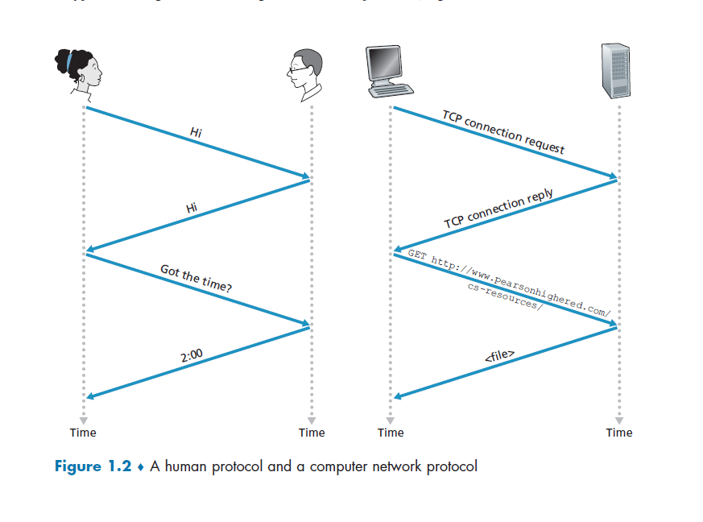

2. **网络协议**

网络协议类似于人类协议，除了交换报文和采取动作的实体是某些设备(可以是计算机、智能手机、平板电脑、路由器或其他具有网络能力的设备)的硬件或软件组件。在 Internet 中，涉及两个或多个远程通信实体的所有活动都受协议的制约。例如，在两台物理上 连接的计算机中，硬件实现的协议控制了在两块网络接口卡间的“线上”的比特流；在端系统中，拥塞控制协议控制了在发送方和接收方之间传输的分组发送的速率；路由器中的协议决定了分组从源到目的地的路径。在 Internet 中协议运行无处不在，因此本书的大量篇幅都与计算机网络协议有关。

以大家可能熟悉的一个计算机网络协议为例，考虑当你向一个 Web 服务器发出请求(即你在 Web 浏览器中键入一个 Web 网页的 URL)时所发生的情况。图 1-2 右半部分显示了这种情形。首先，你的计算机将向该 Web 服务器发送一条连接请求报文，并等待回答。 该 Web 服务器将最终能接收到连接请求报文，并返回一条连接响应报文。得知请求该 Web 文档正常以后，计算机则在一条 GET 报文中发送要从这台 Web 服务器上取回的网页名字。最后，Web 服务器向计算机返回该 Web 网页(文件)。

从上述的人类活动和网络例子中可见，报文的交换以及发送和接收这些报文时所采取的动作是定义一个协议的关键元素:

**协议定义了在两个或多个通信实体之间交换报文的格式和顺序，发送报文和接收报文以及其他事件所采取的动作。**

Internet(更一般地说是计算机网络)广泛地使用了协议。不同的协议用于完成不同的通信任务。当你阅读完这本书后将会知道，某些协议简单而直截了当，而某些协议则复杂且晦涩难懂。掌握计算机网络领域知识的过程就是理解网络协议的构成、原理和工作方式的过程。

### 1.1.5. Internet 标准

**Internet 标准(Internet standard)** 由 Internet 工程任务组(Internet Engineering Task Forse 或 IETF)。IETF 的标准文档称为请求评论(Request For Comment 或 RFC)。RFC 最初只是普通的请求评论(因此得名)，目的是解决 Internet 先驱者们面临的网络和协议问题。RFC 往往是技术性很强并相当详细的。它们定义了 TCP，IP，HTTP 和 SMTP 等协议。其他组织也在制定用于网络部件的标准，最引人注目的是针对网络链路的标准。例如 IEEE 802 LAN/MAN 标准委员会 [IEEE 802 2016] 制定了以太网和 WiFi 的标准。

## 1.2. Internet 提供的服务

### 1.2.1. 分布式应用程序

端系统上运行着应用程序，因此端系统也称为主机。主机上的大部分应用程序涉及在多个主机之间交换信息。因此这类应用程序被称为 **分布式应用程序**。

端系统上运行的分布式应用程序之间有着组织方式，我们称这种组织方式为分布式应用程序的体系结构。现有 2 种流行的体系结构：**客户-服务器体系结构(client-server architecture)** 和 **对等体系结构(P2P architecture)**。

- **客户-服务器体系结构**

在这种体系结构中，有一个总是打开的主机，称为**服务器**，它服务于许多个其他主机的请求，这些主机称为**客户**。

举个例子。常见的 Web 应用程序就是客户-服务器体系结构。其中，服务器为 Web 服务器，客户为运行在客户机上的浏览器。当一个客户发起请求时，Web 服务器向它响应。

这种体系结构具有以下特点：

1. 客户之间不直接通信
2. 服务器具有公开的，固定的地址，该地址称为 IP 地址

- **对等体系结构**

在这种体系结构中，主机几乎对专用服务器没有依赖，端系统之间直接通信。

常见的应用有：BitTorrent，迅雷，Skype，QQ。

### 1.2.2. 套接字

与 Internet 相连的端系统提供了一个 **套接字接口(socket interface)**，该接口规定了运行在一个端系统上的程序请求 Internet 基础设施向运行在另一个端系统上的特定目的地程序交 付数据的方式。Internet 套接字接口是一套发送程序必须遵循的规则集合，因此 Internet 能够将数据交付给目的地。我们将在第 2 章详细讨论 Internet 套接字接口。此时，我们做一个简单的类比，在本书中我们将经常使用这个类比。假定 Alice 使用邮政服务向 Bob 发一封信。 当然，Alice 不能只是写了这封信(相关数据)然后把该信丢出窗外。相反，邮政服务要求 Alice 将信放入一个信封中；在信封的中间写上 Bob 的全名、地址和邮政编码；封上信封；在信封的右上角贴上邮票；最后将该信封丢进一个邮局的邮政服务信箱中。因此，该邮政服务有自己的“邮政服务接口”或一套规则，这是 Alice 必须遵循的，这样邮政服务才能将她的信件交付给 Bob。同理，Internet 也有一个发送数据的程序必须遵循的套接字接口，使 Internet 向接收数据的程序交付数据。

当然，邮政服务向顾客提供了多种服务，如特快专递、挂号、普通服务等。同样，Internet 向应用程序提供了多种服务。当你研发一种 Internet 应用程序时，也必须为你的应用程序选择其中的一种 Internet 服务。我们将在第 2 章中描述 Internet 服务。

我们已经给出了 Internet 的两种描述方法：一种是根据它的硬件和软件成来描述，另一种是根据基础设施向分布式应用程序提供的服务来描述。但是，你也许还是对什么是 Internet 感到困惑，请不要担心。这本书除了向你介绍 Internet 的具体构成外，还要介绍支配 Internet 的工作原理以及它工作的来龙去脉。我们将在后续章节中解释这些重要的术语和问题。

## 1.3. Internet 的结构

### 1.3.1. 接入 ISP 网络

**接入 ISP 网络是指将端系统接入 Internet 核心的 ISP 网络。**

端系统通过 **Internet 服务提供商(Internet Service Provider, ISP)** 接入 Internet。ISP 包括如本地电缆或电话公司那样的住宅区 ISP、公司 ISP、大学 ISP，在机场、旅馆、咖啡店和其他公共场所提供 WiFi 接入的 ISP，以及为智能手机和其他设备提供移动接入的蜂窝数据 ISP(基站)。每个 ISP 自身就是一个由多台分组交换机和多段通信链路组成的网络。各 ISP 为端系统提供了各种不同类型的网络接入，包括如线缆调制解调器或 DSL 那样的住宅宽带接入，高速局域网接入和移动无线接入。ISP 也为内容提供者提供 Internet 接入服务，将 Web 站点和视频服务器直接连入 Internet。

Internet 要将端系统彼此互联，因此为端系统提供接入的 ISP 也必须互联。较低层的 ISP 通过国家的或国际的较高层 ISP 互联起来。较高层 ISP 是由通过高速光纤链路互联的高速路由器组成的。我们将在 1-2-2 节深入地讨论 ISP 的互联结构。

图 1-4 用粗的、带阴影的线高亮显示了几种类型接入 ISP 网络。


1. **家庭接入：DSL 接入，电缆接入，光纤接入，拨号和卫星接入**

- **DSL 接入**

住户通常从本地的电话公司处获得 DSL Internet 接入。这种情况下，ISP 就是用户的本地电话公司。

如图 1-5 所示，每个用户的 DSL 调制解调器使用现有的电话线（即双绞铜线，将在 1.2.2 节中讨论它）与位于电话公司的本地中心局（CO）中的数字用户线接入复用器（DSLAM）交换数据。家庭的 DSL 调制解 调器得到数字数据后将其转换高频音，以通过电话线传输给本地中心局；来自许多家庭的模拟信号在 DSLAM 处被转换回数字形式。


DSL 标准定义了多个传输速率，包括 12 Mbps 下行和 1.8Mbps 上行以及 55mbps 下行和 15Mbps 上行。

因为这些上行速率和下行速率是不同的，所以这种接入被称为是不对称的。

- **电缆接入**

住宅从提供有线电视的公司获得了电缆 Internet 接入。这种情况下，ISP 就是用户的有线电视公司。

如图 1-6 所示，光缆将电缆头端连接到地区枢纽，从这里使用传统的同轴电缆到达各家各户和公寓。每个地区枢纽通常支持 500 -5000 个家庭。因为在这个系统中应用了光纤和同轴电缆，所它经常被称为混合光纤同轴(HFC)系统。

电缆 Internet 接入需要特殊的调制解调器，这种调制解调器称为电缆调制解调器，如同 DSL 调制解调器，电缆调制解调器通常是一个外部设备，通过一个以太网端口连接到家庭 PC。在电缆头端，电缆调制解调器端接系统与 DSL 网络的 DSLAM 具有类似的功能，即将来自许多下行家庭中的电缆调制解调器发送的模拟信号转换回数字形式。


电缆调制解调器将 HFC 网络划分为下行和上行两个信道。如同 DSL,接入通常是不对称的，下行信道分配的传输速率通常比上行信道的高。DOCSIS 2.0 标准定义了高达 42.8Mbps 的下行速率和高达 30.7Mbps 的上行速率。

- **光纤接入**

光纤接入就是从本地中心局直接到家庭提供一个光纤路径。从本地中心局到家庭有几种有竞争的光纤布局方案。一种是直接光纤，从本地中心局到每个用户直接设置一根光纤。还有一种较为一般，从中心局出来一根光纤，到临近家庭的位置，才分给每个用户一个光纤。这种方案有两种类型：主动光纤网络(AOT)和被动光纤网络(PON)。

这里简要介绍 PON。如图 1-7 所示，每个家庭具有一个光纤网络端接器(ONT),它由专门的光纤连接到邻近的分配器(splitter)，该分配器把一些家庭(通常少于 100 个)集结到一根共享的光纤，该光纤再连接到本地电话和公司的中心局中的光纤线路端接器(OLT)，该 OLT 提供了光信号和电信号之间的转换，经过本地电话公司路由器与 Internet 相连。在家庭中，用户将一台家庭路由器(通常是无线路由器)与 ONT 相连，并经过这台家庭路由器接入 Internet。在 PON 体系结构中，所有从 OLT 发送到分配器的分组在分配器(类似于一个电缆头端)处复制。

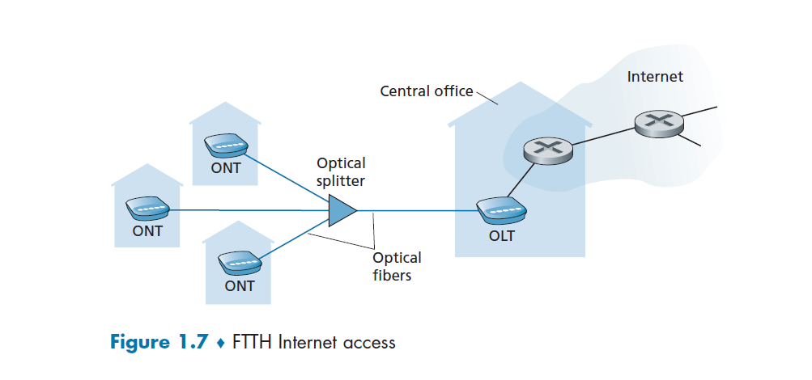

- **拨号和卫星接入**

还可采用另外两种接入网技术为家庭提供 Internet 接入。在无法提供 DSL、电缆和 FTTH 的地方（例如在某些乡村环境），能够使用卫星链路将住宅以超过 1Mbps 的速率与 Internet 相连。StarBand 和 HughesNet 是两家这样的卫星接入提供商。使用传统电话线的拨号接入与 DSL 基于相同的模式：家庭的调制解调器经过电话线连接到 ISP 的调制解调器。与 DSL 和其他宽带接入网相比，拨号接入 56kbps 的慢速率是令人痛苦的。

2. **机构接入：以太网和 WiFi**

- **以太网**

在公司和大学校园以及越来越多的家庭环境中，使用 **局域网(LAN)** 将端系统连接到边缘路由器。尽管有许多不同类型的局域网技术，但是 **以太网** 到目前为止是公司、大学和家庭网络中最为流行的接入技术。

如图 1-8 中所示，以太网用户使用双绞铜线与一台以太网交换机相连，第 6 章中将详细讨论该技术。 以太网交换机或这样相连的交换机网络，则再与更大的 Internet 相连。


使用以太网接入，用户通常以 100Mbps 或 1Gbps 速率接入以太网交换机，而服务器可能具有 1Gbps 甚至 10Gbps 的接入速率。

- **WiFi(无线 LAN)**

如今，越来越多的人通过移动 PC，智能手机，平板电脑和其他设备接入 Internet。在无线 LAN 环境中，无线用户从/到一个接入点发送/接收分组，该接入点与企业网连接（很可能使用了有线以太网），企业网再与有线 Internet 相连。

一个无线 LAN 用户通常必须位于接入点的几十米范围内。基于 IEEE 802.11 技术的无线 LAN 接入,更通俗地称为 WiFi,目前几乎无所不在，如大学、商业办公室、咖啡厅、 机场、家庭，甚至在飞机上。

IEEE 802.11 今天提供了高达 100Mbps 的共享传输速率。

虽然以太网和 WiFi 接入网最初是设置在企业（公司或大学）环境中的，但它们近来已经成为家庭网络中相当常见的部件。今天许多家庭将宽带住宅接入（即电缆调制解调器 或 DSL）与廉价的无线局域网技术结合起来，以产生强大的家用网络。图 1-9 显示了典型的家庭网络。这个家庭网络组成如下：一台漫游的便携机和一台有线 PC； — 个与无线 PC 和家中其他无线设备通信的基站（无线接入点）；一个提供与 Internet 宽带接入的 电缆调制解调器；一台互联了基站及带有电缆调制解调器的固定 PC 的路由器。该网络允许 家庭成员经宽带接入 Internet，其中任何一个家庭成员都可以在厨房、院子或卧室漫游上网。


3. **广域无线接入：4G 和 5G**

我们可以使用 iPhone 和安卓等移动设备发信息、在社交网络中分享照片、观看视频和放音乐。这些设备应用了与蜂窝移动电话相同的无线基础设施，通过蜂窝网提供商运营的基站来发送和接收分组。与 WiFi 不同的是，一个用户仅需要位于基站的数万米(而不是几十米)范围内。

电信公司在第 4 代移动通信技术(4G)上做了巨大的投资。4G 移动通信技术可以提供 60Mbps 的下载速度。但是更高速度的广域无线接入技术，第五移动通信技术(5G)已经投入了部署。我们将在第 7 章详细地讨论 WiFi，4G，5G 等技术。

### 1.3.2. Internet 核心

上一节谈到，接入 ISP 网络将端系统接入 Internet 核心。

**Internet 核心是指互联了接入 ISP 网络的核心网络。Internet 核心本身由更高层次的 ISP 网络，内容提供商网络，以及其他一些部件互联形成。**

图 1-10 以加粗和带阴影的线高亮显示了 Internet 核心。


可是各层次 ISP 网络到底是怎么样互联的呢？

为了理解今天的 ISP 互联结构，我们将逐步地构建一系列 ISP 互联结构，每一个结构都更接近如今的 Internet。

回顾前面的互联接入 ISP 的目标：使所有的端系统能够交换分组。

最简单的方法就是将每一个 ISP 直接与其他的 ISP 相连。当然这是不可行的，这样的设计费用太高，因为这种设计要求每一个 ISP 要与世界上数十万个其他接入 ISP 有一条单独的通信链路。

我们的第一个 ISP 互联结构，用单一的全球传输 ISP 互联所有的 ISP，我们假想的全球传输 ISP 是一个由路由器和通信链路构成的网络，该网络跨越全球，而且至少有一个路由器靠近数十万个接入 ISP 的每一个。为了有利可图，自然要向每个连接的接入 ISP 收费，其价格反映（并不一定正比于）一个接入 ISP 经过全球 ISP 交换的流量大小。因为接入 ISP 向全球传输 ISP 付费，故接入 ISP 被认为是 **客户(customer)**，而全球传输 ISP 被认为是 **提供商(provider)**。

如果某个公司建立并运营一个可赢利的全球传输 ISP，其他公司建立自己的全球传输 ISP 并与最初的全球传输 ISP 竞争则是一件自然的事。这导致了 ISP 互联结构 2。

ISP 互联结构 2 由数十万接入 ISP 和多个全球传输 ISP 组成。接入 ISP 无疑更喜欢 ISP 互联结构 2,因为 它们现在能够根据价格和服务因素在多个竞争的全球传输提供商之间进行选择。然而，值得注意的是，这些全球传输 ISP 之间必须是互联的；不然的话，与某个全球传输 ISP 连接的接入 ISP 将不能与连接到其他全球传输 ISP 的接入 ISP 进行通信。

刚才描述的网络结构 2 是种两层的等级结构，其中全球传输提供商位于顶层，而接入 ISP 位于底层。这假设了全球传输 ISP 不仅能够接近每个接入 ISP,而且费用上也是可行的。现实中，尽管某些 ISP 确实具有令人印象深刻的全球覆盖，并且确实直接与许多接入 ISP 连接，但世界上没有哪个 ISP 是无处不在的。相反，在任何给定的区域，可能有一个 **区域 ISP(regional ISP)**，区域中的接入 ISP 与之连接。每个区域 ISP 则与 **第一层 ISP(tier-1 ISP)** 连接。第一层 ISP 类似于我们假想的全球传输 ISP，尽管它不是在世界上每个城市中都存在，但它确实存在。有大约十几个第一层 ISP，包括 Level 3 Communications，AT&T，Sprint 和 NTT。

再来讨论这个网络的网络，不仅有多个竞争的第一层 ISP,而且在一个区域可能有多 个竞争的区域 ISP。在这样的等级结构中，每个接入 ISP 向其连接的区域 ISP 支付费用，并且每个区域 ISP 向它连接的第一层 ISP 支付费用。(一个接入 ISP 也能直接与第一层 ISP 连接，这样它就向第一层 ISP 付费。)因此，在这个等级结构的每一层，都有客户-提供 商关系。值得注意的是，第一层 ISP 不向任何人付费，因为它们位于该等级结构的顶部。 更为复杂的情况是，在某些区域，可能有较大的区域 ISP (可能跨越整个国家)，该区域 中较小的区域 ISP 与之相连，较大的区域 ISP 则与第一层 ISP 连接。例如，在中国，每个城市有接入 ISP,它们与省级 ISP 连接，省级 ISP 又与国家级 ISP 连接，国家级 ISP 最终与第一层 ISP 连接［Tian 2012］。这个多层等级结构仍然仅仅是今天因特网的粗略近似，我们称它为 ISP 互联结构 3。

为了建造一个与今天的因特网更为相似的网络，我们必须在等级化网络结构 3 上增加 **存在点(Point of Presence, PoP)** 、多宿、对等和因特网交换点。PoP 存在于等级结构的所 有层次，但底层(接入 ISP)等级除外。一个 POP 只是提供商网络中的一台或多台路由器 (在相同位置)群组，其中客户 ISP 能够与提供商 ISP 连接。对于要与提供商 PoP 连接的 客户网络，它能从第三方电信提供商租用高速链路将它的路由器之一直接连接到位于该 PoP 的一台路由器。任何 ISP (除了第一层 ISP)可以选择 **多宿(multi-home)**，即可以与 两个或更多提供商 ISP 连接。例如，一个接入 ISP 可能与两个区域 ISP 多宿，既可以与两个区域 ISP 多宿，也可以与一个第一层 ISP 多宿。当一个 ISP 多宿时，即使它的提供商之一出现故障，它仍然能够继续发送和接收分组。

正如我们刚才学习的，客户 ISP 向它们的提供商 ISP 付费以获得全球因特网互联能力。客户 ISP 支付给提供商 ISP 的费用数额反映了它通过提供商交换的通信流量。为了减少这些费用，位于相同等级结构层次的邻近一对 ISP 能够 **对等(peer)**，也就是说，能够直接将它们的网络连到一起，使它们之间的所有流量经直接连接而不是通过上游的中间 ISP 传输。当两个 ISP 对等时，通常不进行结算，即任一个 ISP 不向其对等付费。如前面提到的那样，第一层 ISP 也与另一个第一层 ISP 对等，它们之间无结算。对于对等和客户-提供商关系的讨论，［Van der Berg 2008］是一本不错的读物。沿着这些相同路线，第三方公司能够创建一个 **因特网交换点(Internet Exchange Point, IXP)**, IXP 是一个汇合点，多个 ISP 能够在这里一起对等。IXP 通常位于一个有自己的交换机的独立建筑物中［Ager 2012］, 在今天的因特网中有 600 多个 IXP ［IXP List 2016 ］。我们称这个生态系统为 ISP 互联结构 4：由接入 ISP、区域 ISP、第一层 ISP、PoP、多宿、对等和 IXP 组成。

我们现在最终到达了 ISP 互联结构 5，它描述了现今的因特网。在图 1-15 中显示了 ISP 互联结构 5，它通过在 ISP 互联结构 4 顶部增加 **内容提供商网络(content provider network)** 构建而成。谷歌是当前这样的内容提供商网络的一个突岀例子。在本书写作之时，谷歌估计有 19 个主要的数据中心分布于北美、欧洲、亚洲、南美和澳大利亚。其中每一个数据中心都有数万到数十万的服务器。此外谷歌也有较小的数据中心，每一个有几百个服务器，这些小型数据中心常常位于 IXP 内。谷歌数据中心都 经过专用的 TCP/IP 网络互联，该网络跨越全球，不过独立于公共因特网。重要的是，谷歌专用网络仅承载岀入谷歌服务器的流量。如图 1-15 所示，谷歌专用网络通过与较低层 ISP 对等（无结算），尝试“绕过”因特网的较高层，采用的方式可以是直接与它们连接，或者在 IXP 处与它们连接［Labovitz2010］。然而，因为许多接入 ISP 仍然仅能通过第一层网络的传输到达，所以谷歌网络也外第一层 ISP 连接，并就与这些 ISP 交换的流量向它们付费。通过创建自己的网络，内容提供商不仅减少了向顶层 ISP 支付的费用，而且对其服务最终如何交付给端用户有了更多的控制。谷歌的网络基础设施在 2-6 节中进行了详细描述。

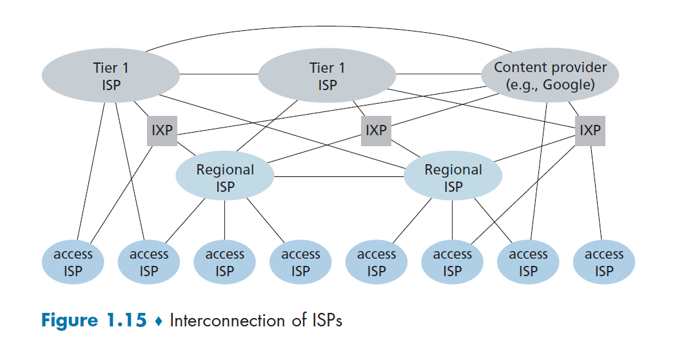

## 1.4. Internet 分层模型

### 1.4.1. 分层的体系结构

前几节的讨论中，我们了解到 Internet 是个非常复杂的结构。各种分布式应用程序运行在端系统上，各种的网络协议控制着不同的分组发送规则，各种物理媒体的通信链路，等等。

为了使维护，管理，使用 Internet 更加方便，必须有一种良好的组织 Internet 的方式。这个方式就是 Internet 分层模型。

在 Internet 分层模型中，下一层向上一层提供 **服务(service)**，而上一层不必关注下一层的实现细节。当下一层的实现方式更换后，也不影响上一层的运作。不同的层负责不同的职能。

Internet 分层模型具有概念化和结构化的优点［RFC 3439］。如我们看到的那样，分层提供了一种结构化方式来讨论系统组件。模块化使更新系统组件更为容易。然而，需要提及的是，某些研究人员和联网工程师激烈地反对分层［WMenian 1992］。分层的一个潜在缺点是一层可能冗余较低层的功能。例如，许多协议栈在基于每段链路和基于端到端两种情况下，都提供了差错恢复。第二种潜在的缺点是某层的功能可能需要仅在其他某层才出现的信息（如时间戳值），这违反了层次分离的目标。

一个协议层能够用软件或硬件或两者的结合来实现。应用层和运输层几乎使用软件来实现。物理层和数据链路层通常在网络接口卡（例如以太网 或 WiFi 接口卡）中实现。网络层用软硬件结合的方式来实现。

所有各层的协议称为 **协议栈(protocol stack)**。

Internet 的协议栈由 5 个层组成：**物理层**、**链路层**、**网络层**、**运输层**和**应用层**。如图 1-23 所示。


本书的结构采用了 **自顶向下方法(top-down approach)**，先处理应用层，然后向下处理。

- **应用层**

应用层由运行在端系统上的分布式应用程序及它们的应用层协议组成。Internet 的应用层包括许多协议，例如 HTTP （它提供了 Web 文档的请求和传送）、SMTP （它提供了电子邮件报文的传输）和 FTP （它提供两个端系统之间的文件传送）。我们将看到，某些网络功能，如将像 www.ietf.org 这样对人友好的端系统名字转换为 32 比特的网络地址，也是借助于特定的应用层协议即域名系统（DNS）完成的。我们将在第 2 章中看到，创建并部署我们自己的新应用层协议是非常容易的。

应用层协议分布在多个端系统上，而一个端系统中的应用程序使用协议与另一个端系统中的应用程序交换信息分组。我们把这种位于应用层的信息分组称为 **报文（message）**。

- **运输层**

Internet 的运输层负责在应用程序端点之间传送应用层报文。在 Internet 中，有两种运输协议，即 TCP 和 UDP,利用其中的任一个都能运输应用层报文。TCP 向它的应用程序提供了面向连接的服务。这种服务包括了应用层报文向目的地的确保传递和流量控制（即发送方/接收方速率匹配）。TCP 也将长报文划分为短报文，并提供拥塞控制机制，因此当网络拥塞时，源抑制其传输速率。UDP 协议向它的应用程序提供无连接服务。这是一种不提供不必要服务的服务，没有可靠性，没有流量控制，也没有拥塞控制。在本书中，我们把运输层的分组称为 **报文段(segment)**。

- **网络层**

Internet 的网络层负责将称为 **数据报（datagram）** 的网络层分组从一台主机移动到另一台主机。在一台源主机中的 Internet 运输层协议（TCP 或 UDP）向网络层递交运输层报文段和目的地址。Internet 的网络层包括著名的网际协议 IP，该协议定义了在数据报中的各个字段以及端系统和路由器如何作用于这些字段。IP 仅有一个，所有具有网络层的 Internet 组件必须运行 IP。 Internet 的网络层也包括决定路由的路由选择协议，它根据该路由将数据报从源传输到目的地。Internet 具有许多路由选择协议。

- **链路层**

Internet 的网络层通过源和目的地之间的一系列路由器路由数据报。为了将分组从一个节点（主机或路由器）移动到路径上的下一个节点，网络层必须依靠该链路层的服务。特别是在每个节点，网络层将数据报下传给链路层，链路层沿着路径将数据报传递给下一个节点。在该下一个节点，链路层将数据报上传给网络层。由链路层提供的服务取决于应用于该链路的特定链路层协议。例如，某些协议基于链路提供可靠传递，从传输节点跨越一条链路到接收节点。值得注意的是，这种可靠的传递服务不同于 TCP 的可靠传递服务，TCP 提供从一个端系统到另一个端系统的可靠交付。链路层的例子包括以太网、WiFi 和电缆接入网的 DOCSIS 协议。因为数据报从源到目的地传送通常需要经过几条链路，一个数据报可能被沿途不同链路上的不同链路层协议处理。例如，一个数据报可能被一段链路上的以太网和下一段链路上的 PPP 所处理。网络层将受到 来自每个不同的链路层协议的不同服务。在本书中，我们把链路层分组称为 **帧(frame)**。

- **物理层**

虽然链路层的任务是将整个帧从一个网络元素移动到邻近的网络元素，而物理层的任务是将该帧中的一个个比特从一个节点移动到下一个节点。在这层中的协议仍然是链路相关 的，并且进一步与该链路（例如，双绞铜线、单模光纤）的实际传输媒体相关。例如，以太 网具有许多物理层协议：一个是关于双绞铜线的，另一个是关于同轴电缆的，还有一个是关于光纤的，等等。在每种场合中，跨越这些链路移动一个比特是以不同的方式进行的。

### 1.4.2. 封装

本节我们来仔细观察一下来自发送端系统的分布式应用程序产生的数据是怎么通过 Internet 分层模型一步步到达目的端系统的。

如图 1-24 所示。

数据从发送端的协议栈向下，通过链路层交换机和路由器的协议栈，然后向上通过接收端的协议栈。

在实现的网络协议上，尽管链路层交换机和路由器都是分组交换机，但是链路层交换机只实现了第一层和第二层，路由器实现了第一层到第三层。这表示路由器可以实现 IP 协议而链路层交换机不能。

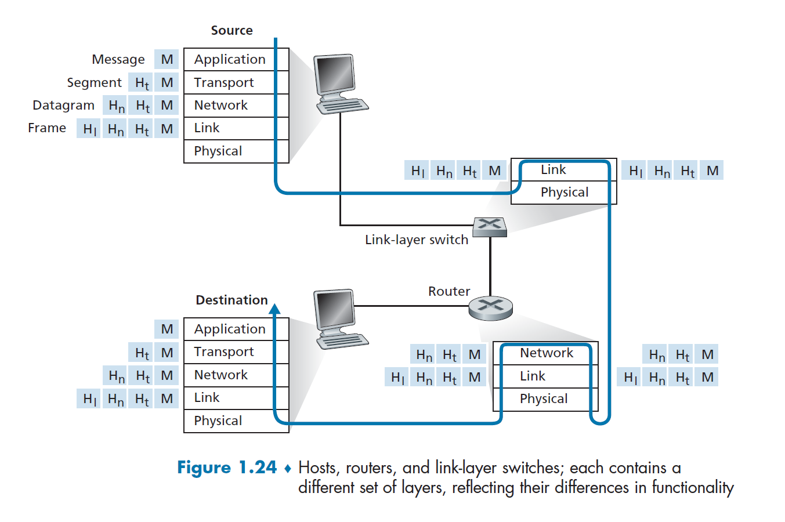

在发送主机端，一个应用层报文(M)被传送到运输层，运输层收到报文并加上首部字节(Ht)，Ht 在接收端运输层会被用到。Ht 和 M 共同构成运输层报文段。Ht 可能会涉及以下信息：允许接收端运输层向上向适当的应用程序交付报文的信息；差错检测位信息，该信息让接收方能够判断报文中的比特是否在途中已被改变。报文段被传输到网络层，网络层会附加给报文段一些信息(Hn)，如：发送端和接收端地址等网络层信息。Hn 和报文段构成了网络层数据报。数据报被传输到链路层，链路层给数据报附加上所需信息 Hl，构成链路层帧。这就是封装。

## 1.5. 计算机网络的性能

### 1.5.1. 节点总时延

前面讲过，分组从一台主机（源）出发，通过一系列路由器传输，在另一台主机(目的地)中结束它的历程。当分组从一个节点(主机或路由器)沿着这条路径到后继节点(主机或路由器)，该分组在沿途的每个节点经受了几种不同类型的时延。这些时延最为重要的是 **节点处理时延(nodal processing delay)**，**排队时延(queuing delay)**、**传输时延(transmission delay)** 和 **传播时延(propagation delay)**，这些时延总体累加起来是 **节点总时延(tolal nodal delay)**。许多因特网应用，如搜索、Web 浏览、电子邮件、地图、即时通讯和 IP 语音，它们的性能受网络时延的影响很大。为了深入理解分组交换和计算机网络，我们必须理解这些时延的性质和重要性。

- **时延的类型**

请看图 1-16 所示的例子。

当分组从上游节点到达路由器 A 时，路由器 A 检查该分组的首部以决定它的出链路。这个例子中只有通向 B。当 A 的出链路不是占用状态时，才会立即传输该分组。如果出链路是占用状态，那么该分组会进入 A 的输出缓存排队。

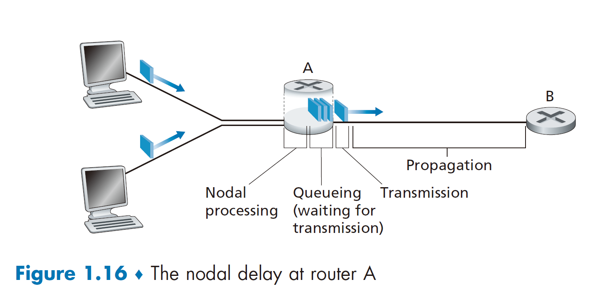

1. **处理时延**

路由器检查一个分组的首部字节和决定将该分组导向何处是 **处理时延** 的一部分。处理时延还包括检查比特级别的差错所需要的时间。在这种节点处理之后，路由器将该分组引向通往路由器 B 链路之前的队列。

处理时延通常是微妙或更低的数量级。

2. **排队时延**

在队列中，当分组在链路上等待传输时，它经受排队时延。一个特定分组的排队时延长度将取决于先期到达的正在排队等待向链路传输的分组数量。如果该队列是空的，并且当前没有其他分组正在传输，则该分组的排队时延为 0。另一方面，如果流量很大，并且许多其 他分组也在等待传输，该排队时延将很长。我们将很快看到，到达分组期待发现的分组数量是到达该队列的流量的强度和性质的函数。

实际上的排队时延通常是毫秒到微妙量级。

3. **传输时延**

假定分组以先到先服务方式传输——这在分组交换网中是常见的方式，仅当所有已经到达的分组被传输后，才能传输刚到达的分组。用 L 比特表示该分组的长度，用 R bps (即 b/s)表示从路由器 A 到路由器 B 的链路传输速率。例如，对于一条 10Mbps 的以太网链路，速率 R = 10Mbps；对于 100Mbps 的以太网链路，速率 R = 100Mbps。 传输时延是 L/R。这是将所有分组的比特推向链路(即传输，或者说发射)所需要的时间。

实际的传输时延通常在毫秒到微秒量级。

4. **传播时延**

一旦一个比特被推向链路，该比特需要向路由器 B 传播。从该链路的起点到路由器 B 传播所需要的时间是传播时延。该比特以该链路的传播速率传播。该传播速率取决于该链路的物理媒体（即光纤、双绞铜线等），其速率范围是 2x10^8-3x10^8 m/s，这等于或略小于光速。该传播时延等于两台路由器之间的距离除以传播速率。即传播时延是 d/s。其中 d 是路由器 A 和路由器 B 之间的距离，s 是该链路的传播速率。一旦该分组的最后一个比特传播到节点 B，该比特及前面的所有比特被存储于路由器 B。整个过程将随着路由器 B 执行转发而持续下去。

在广域网中，传播时延为毫秒量级。

如果令 d(proc)，d(queue)，d(trans)，d(prop)分别表示处理时延、排队时延、传输时延和传播时延，则节点的总时延由下式给定：

```
d(nodal) = d(proc) + d(queue) + d(trans) + d(prop)
```

这些时延成分所起的作用可能会有很大的不同。例如，对于连接两台位于同一个大学校园的路由器的链路而言，d(prop) 可能是微不足道的（例如，几微秒）；然而，对于由同步卫星链路互联的两台路由器来说 d(prop) 是几百毫秒，能够成为 d(nodal) 中的主要成分。类似地，d(trans) 的影响可能是微不足道的，也可能是很大的。通常对于 10Mbps 和更高的传输速率（例如，对于 LAN）的信道而言，它的影响是微不足道的；然而，对于通过低速拨号调制解调器链路发送的长因特网分组而言，可能是数百毫秒。处理时延 d(proc)通常是微不足道的；然而，它对一台路由器的最大吞吐量有重要影响，最大吞吐量是一台路由器能够转发分组的最大速率。

### 1.5.2. 丢包

节点总时延的最为复杂和有趣的成分是排队时延 d(queue)。与其他 3 项时延（即 d(proc)，d(trans)和 d(prop)）不同的是，排队时延对不同的分组可能是不同的。例如，如果 10 个分组同时到达空队列，传输的第一个分组没有排队时延，而传输的最后一个分组将经受相对大的排队时延（这时它要等待其他 9 个分组被传输）。因此，当表征排队时延时，人们通常使用统计量来度量，如平均排队时延、排队时延的方差和排队时延超过某些特定值的概率。

什么时候排队时延大，什么时候又不大呢？该问题的答案很大程度取决于流量到达该队列的速率、链路的传输速率和到达流量的性质，即流量是周期性到达还是以突发形式到达。为了更深入地领会某些要点，令 a 表示分组到达队列的平均速率（a 的单位是分组/秒，即 pkt/s）。 前面讲过 R 是传输速率，即从队列中推出比特的速率（以 bps 即 b/s 为单位）。为了简单起见，也假定所有分组都是由 L 比特组成的。则比特到达队列的平均速率是 La bps。最后，假定该队列非常大，因此它基本能容纳无限数量的比特。比率 La/R 被称为 **流量强度(traffic intensity)**，它在估计排队时延的范围方面经常起着重要的作用。如果 La/R > 1，则比特到达队列的平均速率超过从该队列传输岀去的速率。在这种不幸的情况下，该队列趋向于无限增加，并且排队时延将趋向无穷大！因此，流量工程中的一条金科玉律是：设计系统时流量强度不能大于 1。

现在考虑 La/R <= 1 时的情况。这时，到达流量的性质影响排队时延。例如，如果分组周期性到达，即每 L/R 秒到达一个分组，则每个分组将到达一个空队列中，不会有排队时延。另一方面，如果分组以突发形式到达而不是周期性到达，则可能会有很大的平均排队时延。例如，假定每 (L/R)N 秒同时到达 N 个分组。则传输的第一个分组没有排队时延; 传输的第二个分组就有 L/R 秒的排队时延；更为一般地，第几个传输的分组具有(n-1)L/R 的排队时延。我们将该例子中的计算平均排队时延的问题留给读者作为练习。

以上描述周期性到达的两个例子有些学术味。通常，到达队列的过程是随机的，即到达并不遵循任何模式，分组之间的时间间隔是随机的。在这种更为真实的情况下，量 L/R 通常不足以全面地表征时延的统计量。不过，直观地理解排队时延的范围很有用。特别是，如果流量强度接近于 0，则几乎没有分组到达并且到达间隔很大，那么到达的分组将不可能在队列中发现别的分组。因此，平均排队时延将接近 0。另一方面，当流量强度接近 1 时，当到达速率超过传输能力(由于分组到达速率的波动)时将存在时间间隔，在这些时段中将形成队列。当到达速率小于传输能力时，队列的长度将缩短。无论如何，随着流量强度接近，平均排队长度变得越来越长。平均排队时延与流量强度的定性关系如图 1-18 所示。


图 1-18 的一个重要方面是这样一个事实：随着流量强度接近于 1，平均排队时延迅速增加。该强度的少量增加将导致时延大比例增加。也许你在公路上 经历过这种事。如果在经常拥塞的公路上像平时一样驾驶，这条路经常拥塞的事实意味着它的流量强度接近于 1,如果某些事件引起一个即便是稍微大于平常量的流量，经受的时延就可能很大。

为了实际感受一下排队时延的情况，我们再次鼓励你访问本书的 Web 网站([进入动画](https://media.pearsoncmg.com/ph/esm/ecs_kurose_compnetwork_8/cw/content/interactiveanimations/queuing-loss-applet/index.html))。如果你将分组到达速率设置得足够大，使流量强度超过 1，那么将看到经过一段时间后，队列慢慢地建立起来。

在上述讨论中，我们已经假设队列能够容纳无穷多的分组。在现实中，一条链路前的队列只有有限的容量，尽管排队容量极大地依赖于路由器设计和成本。因为该排队容量是 有限的，随着流量强度接近 1，排队时延并不真正趋向无穷大。相反，到达的分组将发现一个满的队列。由于没有地方存储这个分组，路由器将丢弃该分组，即该分组将会 **丢包(lost)**。当流量强度大于 1 时，队列中的这种溢出也能够在配套 web 网站的动画中看到。

从端系统的角度看，上述丢包现象看起来是一个分组已经传输到网络核心，但它绝不会从网络发送到目的地。分组丢失的比例随着流量强度增加而增加。因此，一个节点的性能常常不仅根据时延来度量，而且根据丢包的概率来度量。正如我们将在后面各章中讨论的那样，丢失的分组可能基于端到端的原则重传，以确保所有的数据最终从源传送到了目的地。

### 1.5.3. 端到端时延

前面的讨论一直集中在节点时延上，即在单台路由器上的时延。我们现在考虑从源到目的地的总时延。为了能够理解这个概念，假定在源主机和目的主机之间有 N-1 台路由器。我们还要假设该网络此时是无拥塞的(因此排队时延是微不足道的)，在每台路由器和源主机上的处理时延是 d(proc)，每台路由器和源主机的输出速率是 R bps，每条链路的传播时延是 d(trans)。节点时延累加起来，得到端到端时延：

```
d(end-end) = N(d(proc) + d(trans) + d(prop))
```

其中，d(trans) = L / R，L 为分组的长度。

在各节点具有不同的时延和每个节点存在平均排队时延的情况下，需要对上式进行一般化处理。我们将有关工作留给读者。

- **Traceroute**

为了对计算机网络中的端到端时延有第一手认识，我们可以利用 Traceroute 程序。 Traceroute 是一个简单的程序，它能够在任何因特网主机上运行。当用户指定一个目的主机名字时，源主机中的该程序朝着目的地发送多个特殊的分组。当这些分组向着目的地传送时，它们通过一系列路由器。当路由器接收到这些特殊分组之一时，它向源回送一个短报文。该短报文包括路由器的名字和地址。

更具体的是，假定在源和目的地之间有 N-1 台路由器。源将向网络发送 N 个特殊的分组，其中每个分组地址指向最终目的地。这 N 个特殊分组标识为从 1 到 N，第一个分组标识为 1,最后的分组标识为 N。当第 n 台路由器接收到标识为 n 的第 n 个分组时，该路由器不是向它的目的地转发该分组，而是向源回送一个报文。当目的主机接收第 N 个分组 时，它也会向源返回一个报文。该源记录了从它发送一个分组到它接收到对应返回报文所经历的时间；它也记录了返回该报文的路由器（或目的主机）的名字和地址。以这种方式，源能够重建分组从源到目的地所采用的路由，并且该源能够确定到所有中间路由器的往返时延。Traceroute 实际上对刚才描述的实验重复了 3 次，因此该源实际上向目的地发送了 3\*N 个分组。RFC 1393 详细地描述了 Traceroute。

这里我们提供了一个了一个追踪本地主机到 www.baidu.com 的一个例子。

```bat
tracert www.baidu.com

通过最多 30 个跃点跟踪
到 www.a.shifen.com [110.242.68.3] 的路由:

  1     2 ms     2 ms     2 ms  bogon [192.168.43.141]
  2     *        *        *     请求超时。
  3     *        *        *     请求超时。
  4    22 ms    35 ms    33 ms  123.139.0.221
  5     *       62 ms    27 ms  gi0-0-rtr1-xgx-man.169cnc.net [221.11.0.1]
  6    64 ms    48 ms    40 ms  gi3-0-rtr1-dwl-man.169cnc.net [221.11.0.53]
  7    77 ms    44 ms    49 ms  219.158.111.233
  8    82 ms    76 ms    51 ms  110.242.66.178
  9     *        *        *     请求超时。
 10     *        *        *     请求超时。
 11     *        *        *     请求超时。
 12     *        *        *     请求超时。
 13    43 ms    58 ms    61 ms  110.242.68.3

跟踪完成。
```

- **其他时延**

除了处理时延、传输时延和传播时延，端系统中还有其他一些重要时延。例如，希望向共享媒体（例如在 WiFi 或电缆调制解调器情况下）传输分组的端系统可能有意地延迟它的传输，把这作为它与其他端系统共享媒体的协议的一部分；我们将在第 6 章中详细地考虑这样的协议。另一个重要的时延是媒体分组化时延，这种时延出现在 IP 语音（VoIP） 应用中。在 VoIP 中，发送方在向因特网传递分组之前必须首先用编码的数字化语音填充一个分组。这种填充一个分组的时间称为分组化时延，它可能较大，并能够影响用户感受到的 VoIP 呼叫的质量。这个问题将在本章结束的课后作业中进一步探讨。

### 1.5.4. 吞吐量

除了时延和丢包，计算机网络中另一个至关重要的性能测度是端到端吞吐量。为了定义吞吐量，考虑从主机 A 到主机 B 跨越计算机网络传送一个大文件。例如，也许是从一个 P2P 文件共享系统中的一个对等方向另一个对等方传送一个大视频片段。在任何时间瞬间的 **瞬时吞吐量(instantaneous throughput)** 是主机 B 接收到该文件的速率（以 bps 计）。（许多应用程序包括许多 P2P 文件共享系统，其用户界面显示了下载期间的瞬时吞吐量，也许你以前已经观察过它！）如果该文件由 F 比特组成，主机 B 接收到所有 F 比特用去 T 秒，则文件传送的 **平均吞吐量(average throughput)** 是 F/T bps。 对于某些应用程序如因特网电话，希望具有低时延和在某个阈值之上（例如，对某些因特网电话是超过 24kbps，对某些实时视频应用程序是超过 256kbps）的一致的瞬时吞吐量。对于其他应用程序，包括涉及文件传送的那些应用程序，时延不是决定性的，但是希望具有尽可能高的吞吐量。

为了进一步深入理解吞吐量这个重要概念，我们考虑几个例子。图 1-19a 显示了服务器和客户这两个端系统，它们由两条通信链路和一台路由器相连。考虑从服务器传送一个文件到客户的吞吐量。令 Rs 表示服务器与路由器之间的链路速率；Rc 表示路由器与客户之间的链路速率。假定在整个网络中只有从该服务器到客户的比特在传送。在这种理想的情况下，我们要问该服务器到客户的吞吐量是多少？为了回答这个问题，我们可以想象比特是流体，通信链路是管道。显然，这台服务器不能以快于 Rs bps 的速率通过其链路注入比特；这台路由器也不能以快于 Rcbps 的速率转发比特。如果 Rs < Rc，则在给定的吞吐量 Rs bps 的情况下，由该服务器注入的比特将顺畅地通过路由器“流动”，并以速率 Rs bps 到达客户。另一方面，如果 Rc < Rs，则该路由器将不能像接收速率那样快地转发比特。在这种情况下，比特将以速率 Rc 离开该路由器，从而得到端到端吞吐量 Rc。（还要注意的是，如果比特继续以速率 Rs 到达路由器，继续以 Rc 离开路由器的话，在该路由器中等待传输给客户的积压比特将不断增加，这是一种最不希望的情况！）因此，对于这种简单的两链路网络，其吞吐量是 min {Rc, Rs}。这就是说，它是 **瓶颈链路(bottleneck link)** 的传输速率。在决定了吞吐量之后，我们现在近似地得到从服务器到客户传输一个 F 比特的大文件所需要的时间是 F / min{Rc, Rs}。举一个特定的例子，假你正在下载一个 F = 32 X 10^6 比特的 MP3 文件，服务器具有 Rs = 2 Mbps 的传输速率，并且你有一条 Rc = 1 Mbps 的接入链路。则传输该文件所需的时间是 32 秒。当然，这些吞吐量和传输时间的表达式仅是近似的，因为它们并没有考虑存储转发、处理时延和协议等问题。


图 1-19b 此时显示了一个在服务器和客户之间具有 N 条链路的网络，这 N 条链路的传输速率分别是 R1, R2, ..., Rn。应用对两条链路网络的分析方法，我们发现从服务器到客户的文件传输吞吐量是 min｛R1, R2, ..., Rn}，这同样仍是沿着服务器和客户之间路径的瓶颈链路的速率。

现在考虑由当前因特网所引发的另一个例子。图 1-20a 显示了与一个计算机网络相连的两个端系统：一台服务器和一个客户。考虑从服务器向客户传送一个文件的吞吐量。服务器以速率为 Rs 的接入链路与网络相连，且客户以速率为 Rc 的接入链路与网络相连。现在假定在通信网络核心中的所有链路具有非常高的传输速率，即该速率比 Rs 和 Rc 要高得多。目前因特网的核心的确超量配置了高速率的链路，从而很少出现拥塞。同时假定在整个网络中发送的比特都是从该服务器到该客户。在这个例子中，因为计算机网络的核心就像一个粗大的管子，所以比特从源向目的地的流动速率仍是 Rs 和 Rc 中的最小者，即吞吐量 = min {Rs, Rc}。因此，在今天因特网中对吞吐量的限制因素通常是接入网。

作为最后一个例子，考虑图 1-20b,其中有 10 台服务器和 10 个客户与某计算机网络 核心相连。在这个例子中，同时发生 10 个下载，涉及 10 个客户-服务器对。假定这 10 个下载是网络中当时的唯一流量。如该图所示，在核心中有一条所有 10 个下载通过的链路。将这条链路的传输速率表示为 R。假定所有服务器接入链路具有相同的速率 Rs，所有客户接入链路具有相同的速率 Rc，并且核心中除了速率为 R 的一条共同链路之外的所有链路，它们的传输速率都比 R、Rs 和 Rc 大得多。现在我们要问，这种下载的吞吐量是多少？显然，如果该公共链路的速率 R 很大，比如说比 Rs 和 Rc 大 100 倍，则每个下载的吞吐量将仍然是 min｛Rs, Rc}。 但是如果该公共链路的速率与 Rs 和 Rc 有相同量级会怎样呢？在这种情况下其吞吐量将是多少呢？让我们观察一个特定的例子。假定 Rs = 2Mbps, Rc = 1 Mbps, R = 5Mbps,并且公共链路为 10 个下载平等划分它的传输速率。这时每个下载的瓶颈不再位于接入网中，而是位于核心中的共享链路了，该瓶颈仅能为每个下载提供 500 kbps 的吞吐量。因此每个下载的端到端吞吐量现在减少到 500 kbps。


图 1-19 和图 1-20 中的例子说明吞吐量取决于数据流过的链路的传输速率。我们看到当没有其他干扰流量时，其吞吐量能够近似为沿着源和目的地之间路径的最小传输速率。图 1-20b 中的例子更一般地说明了吞吐量不仅取决于沿着路径的传输速率，而且取决于干扰流量。特别是，如果许多其他的数据流也通过这条链路流动，一条具有高传输速率的链路仍然可能成为文件传输的瓶颈链路。我们将在课后习题中和后继章节中更仔细地研究计算机网络中的吞吐量。

## 1.6. 计算机网络的安全性

对于今天的许多机构（包括大大小小的公司、大学和政府机关）而言，因特网已经成为与其使命密切相关的一部分了。许多人也依赖因特网从事各种职业、社会和个人活动。目前，数以亿计的物品（包括可穿戴设备和家用设备）与因特网相连。但是在所有这一切背后，存在着一个阴暗面，其中的“坏家伙”试图对我们的日常生活进行破坏，如损坏我们与因特网相连的计算机，侵犯我们的隐私以及使我们依赖的因特网服务无法运行。

网络安全领域主要探讨以下问题：坏家伙如何攻击计算机网络，以及我们（即将成为计算机网络的专家）如何防御以免受他们的攻击，或者更好的是设计能够事先免除这样的攻击的新型体系结构。面对经常发生的各种各样的现有攻击以及新型和更具摧毁性的未来攻击的威胁，网络安全已经成为近年来计算机网络领域的中心主题。本书的特色之一是将网络安全问题放在中心位置。

因为我们在计算机网络和因特网协议方面还没有专业知识，所以这里我们将从审视某 些今天最为流行的与安全性相关的问题开始。这将刺激我们的胃口，以便我们在后续章节中进行更为充实的讨论。我们在这里以提岀问题开始：什么会出现问题？计算机网络是如何受到攻击的？今天一些最为流行的攻击类型是什么？

### 1.6.1. 恶意软件

因为我们要从/向因特网接收/发送数据，所以我们将设备与因特网相连。这包括各种好东西，例如 Instagram 帖子、因特网搜索结果、流式音乐、视频会议、流式电影等。但不幸的是，伴随好的东西而来的还有恶意的东西，这些恶意的东西可统称为 **恶意软件(malware)**，它们能够进入并感染我们的设备。一旦恶意软件感染我们的设备，就能够做各种不正当的事情，包括删除我们的文件，安装间谍软件来收集我们的隐私信息，如社会保险号、口令和击键，然后将这些（当然经因特网）发送给坏家伙。我们的受害主机也可能成为数以千计的类似受害设备网络中的一员，它们被统称为 **僵尸网络(botnet)**，坏家伙利用僵尸网络控制并有效地对目标主机展开垃圾邮件分发或分布式拒绝服务攻击（很快将讨论）。

至今为止的多数恶意软件是 **自我复制(self-replicating)** 的：一旦它感染了一台主机，就会从那台主机寻求进人因特网上的其他主机，从而形成新的感染主机，再寻求进入更多的主机。以这种方式，自我复制的恶意软件能够指数式地快速扩散。恶意软件能够以病毒或蠕虫的形式扩散。**病毒(virus)** 是一种需要某种形式的用户交互来感染用户设备的恶意软件。典型的例子是包含恶意可执行代码的电子邮件附件。如果用户接收并打开这样的附件，不经意间就在其设备上运行了该恶意软件。通常，这种电子邮件病毒是自我复制的: 例如，一旦执行，该病毒可能向用户地址簿上的每个接收方发送一个具有相同恶意附件的相同报文。**蠕虫(worm)** 是一种无须任何明显用户交互就能进入设备的恶意软件。例如，用户也许运行了一个攻击者能够发送恶意软件的脆弱网络应用程序。在某些情况下，没有用户的任何干预，该应用程序可能从因特网接收恶意软件并运行它，生成了蠕虫。新近感染设备中的蠕虫则能扫描因特网，搜索其他运行相同网络应用程序的易受感染的主机。当它发现其他易受感染的主机时，便向这些主机发送一个它自身的副本。今天，恶意软件无所不在且防范成本高。当你用这本书学习时，我们鼓励你思考下列问题：计算机网络设计者能够采取什么防御措施，以使与因特网连接的设备免受恶意软件的攻击？

### 1.6.2. 拒绝服务(DoS)

另一种宽泛类型的安全性威胁称为 **拒绝服务攻击(Denial-of-Service (DoS) attack)**。 顾名思义，DoS 攻击使得网络、主机或其他基础设施部分不能由合法用户使用。Web 服务器、电子邮件服务器、DNS 服务器（在第 2 章中讨论）和机构网络都能够成为 DoS 攻击的目标。因特网 DoS 攻击极为常见，每年会出现数以千计的 DoS 攻击［Moore 2001］。访问数字攻击图（Digital Attack Map）站点可以可视化了世界范围内每天最厉害的 DoS 攻击［DAM 2020］。大多数因特网 DoS 攻击属于下列三种类型之一：

- 弱点攻击。这涉及向一台目标主机上运行的易受攻击的应用程序或操作系统发送精心制作的报文。如果适当顺序的多个分组发送给一个易受攻击的应用程序或操作系统，该服务器可能停止运行，或者更糟糕的是主机可能崩溃。
- 带宽洪泛。攻击者向目标主机发送大量的分组，分组数量之多使得目标的接入链路变得拥塞，使得合法的分组无法到达服务器。
- 连接洪泛。攻击者在目标主机中创建大量的半开或全开 TCP 连接(将在第 3 章中讨论 TCP 连接)。该主机因这些伪造的连接而陷入困境，并停止接受合法的连接。

我们现在更详细地研究这种带宽洪泛攻击。回顾 1-4-2 节中讨论的时延和丢包问题，显然，如果某服务器的接入速率为 R bps，则攻击者将需要以大约 R bps 的速率来产生危害。如果 R 非常大的话，单一攻击源可能无法产生足够大的流量来伤害该服务器。此外，如果从单一源发岀所有流量的话，某上游路由器就能够检测出该攻击并在该流量靠近服务器之前就将其阻挡下来。在图 1-25 中显示的 **分布式 DoS(Distributed DoS, DDoS)** 中，攻击者控制多个源并让每个源向目标猛烈发送流量。使用这种方法，遍及所有受控源的聚合流量速率需要大约 R 的能力来使该服务陷入瘫痪。DDoS 攻击充分利用由数以千计的受害主机组成的僵尸网络，这在今天是屡见不鲜的［DAM 2020］。相比于来自单一主机的 DoS 攻击，DDoS 攻击更加难以检测和防范。

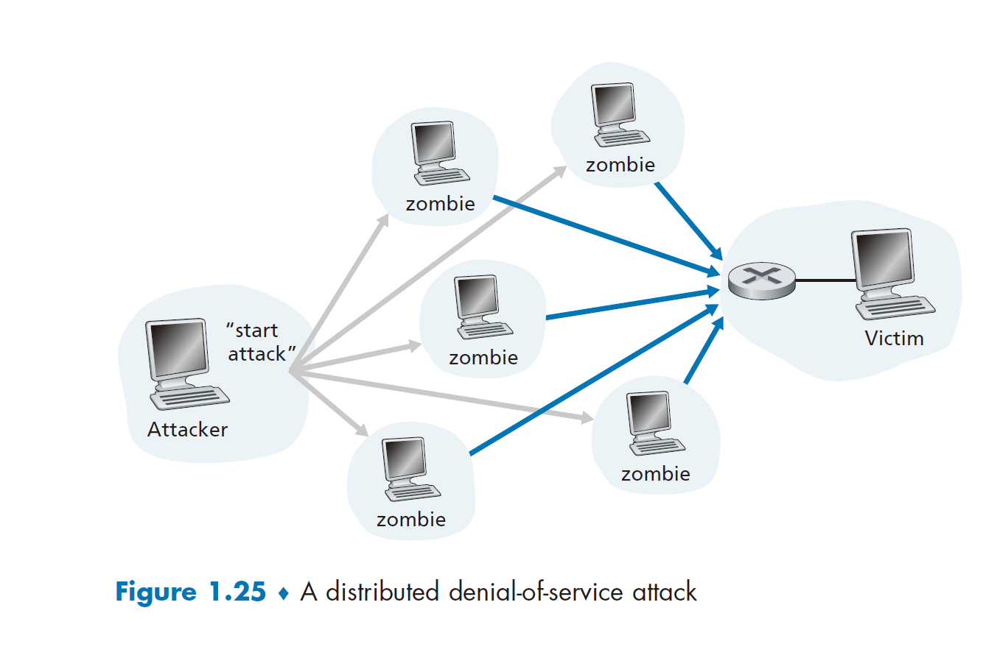

当学习这本书时，我们鼓励你考虑下列问题：计算机网络设计者能够采取哪些措施防止 DoS 攻击？我们将看到，对于 3 种不同类型的 DoS 攻击需要采用不同的防御方法。

### 1.6.3. 嗅探分组

今天的许多用户经无线设备接入因特网，如 WiFi 连接的膝上计算机或使用蜂窝因特网连接的手持设备(在第 7 章中讨论)。无所不在的因特网接入极为便利并让移动用户方便地使用令人惊奇的新应用程序的同时，也产生了严重的安全脆弱性：在无线传输设备的附近放置一台被动的接收机，该接收机就能得到传输的每个分组的副本！这些分组包含了各种敏感信息，包括口令、社会保险号、商业秘密和隐秘的个人信息。记录每个流经的分组副本的被动接收机被称为 **分组嗅探器(packet sniffer)**。

嗅探器也能够部署在有线环境中。在有线的广播环境中，如在许多以太网 LAN 中，分组嗅探器能够获得经该 LAN 发送的所有分组。如在前面描述的那样，电缆接入技术也广播分组，因此易于受到嗅探攻击。此外，获得某机构与因特网连接的接入路由器或接入链路访问权的坏家伙能够放置一台嗅探器以产生从该机构出入的每个分组的副本，再对嗅探到的分组进行离线分析，就能得出敏感信息。

分组嗅探软件在各种 Web 站点上可免费得到，这类软件也有商用的产品。教网络课程的教授布置的实验作业就涉及写一个分组嗅探器和应用层数据重构程序。与本书相关联的 Wireshark [Wireshark 2020］实验（参见本章结尾处的 Wireshark 实验介绍）使用的正是这样一种分组嗅探器！

因为分组嗅探器是被动的，也就是说它们不向信道中注入分组，所以难以检测到它们。因此，当我们向无线信道发送分组时，我们必须接受这样的可能性，即某些坏家伙可能记录了我们的分组的副本。如你已经猜想的那样，最好的防御嗅探的方法基本上都与密码学有关。我们将在第 8 章研究密码学应用于网络安全的有关内容。

### 1.6.4. 信任伪装

生成具有任意源地址、分组内容和目的地址的分组，然后将这个人工制作的分组传输到因特网中，因特网将忠实地将该分组转发到目的地，这一切都极为容易（当你学完这本教科书后，你将很快具有这方面的知识了！）。想象某个接收到这样一个分组的不会猜疑的 接收方（比如说一台因特网路由器），将该（虚假的）源地址作为真实的，进而执行某些嵌入在该分组内容中的命令（比如说修改它的转发表）。将具有虚假源地址的分组注入因特网的能力被称为 **IP 哄骗(IP spoofing)**，而它只是一个用户能够冒充另一个用户的许多方式中的一种。

为了解决这个问题，我们需要采用端点鉴别，即一种使我们能够确信一个报文源自我们认为它应当来自的地方的机制。当你继续学习本书各章时，再次建议你思考怎样为网络应用程序和协议做这件事。我们将在第 8 章探讨端点鉴别机制。

在本节结束时，值得思考一下因特网是如何从一开始就落入这样一种不安全的境地的。大体上讲，答案是：因特网最初就是基于“一群相互信任的用户连接到一个透明的网 络上”这样的模型［Blumenthal 2001］进行设计的，在这样的模型中，安全性是没有必要的。初始的因特网体系结构在许多方面都深刻地反映了这种相互信任的理念。例如，一个用户向任何其他用户发送分组的能力是默认的，而不是一种请求/准予的能力，还有用户身份取自所宣称的表面价值，而不是默认地需要鉴别。

但是今天的因特网无疑并不涉及“相互信任的用户”。但是，今天的用户仍然需要通信，当他们不必相互信任时，他们也许希望匿名通信，也许间接地通过第三方通信（例如我们将在第 2 章中学习的 Web 代理，我们将在第 7 章学习的移动性协助代理），也许不信任他们通信时使用的硬件、软件甚至空气。随着我们进一步学习本书，会面临许多安全性相关的挑战：我们应当寻求对嗅探、端点假冒、中间人攻击、DDoS 攻击、恶意软件等的防护办法。我们应当记住：在相互信任的用户之间的通信是一种例外而不是规则。欢迎你到现代计算机网络世界！

## 1.7. 计算机网络的历史

1. 分组交换的发展(1961-1972)
2. 专用网络和网络互联(1972-1980)
3. 网络的激增(1980-1990)
4. Internet 的爆炸(1990-2000)
5. 最新发展(2000 至今)

- 家庭接入网的普及和更迭
- LTE(4G)的发展和 WiFi 的普及
- 在线社交网络的发展
- 在线服务提供商部署了自己的专属网络
- 云技术的发展

## 1.8. 实验 1：熟悉 wireshark

### 1.8.1. 分组嗅探器

用来观察执行协议实体之间交换的报文的基本工具称为**分组嗅探器（packet sniffer）**。

顾名思义，一个分组嗅探器被动地拷贝（嗅探）由你的计算机发送和接收的报文；它也能显示出这些被捕获报文的各个协议字段的内容。

图 1-28 中显示了一个常见的分组嗅探器： Wireshark 的截图。


下图描述了分组嗅探器的工作原理。


观察上图，在图的右边是分布式应用(如 Web 浏览器)，下面是支撑应用的网络协议层：传输层(TCP/IP)，网络层(IP)，数据链路层(以太网协议，802.11 WiFi 协议)，最后是物理层。图片左边是分组嗅探器，它由 2 部分构成：**分组分析器(packet analyzer)** 和 **分组捕获器(packet capturer)**。

分组捕获器被动地复制来自链路层的分组，回忆一下我们在第 1.5 节讨论到的内容。这些分组称为帧。帧封装了来自网络层的首部字节 Hn，以及来自运输层的首部字节 Ht，当然还有应用层报文 M。

分组分析器可以分析出分组的结构，以便展示出一个应用层报文的内容的字段。比如，我们现在对 HTTP 报文的字段比较感兴趣。分组分析器首先要理解来自数据链路层的帧(以太网帧或 WiFi 帧)的格式，以便它识别出来自网络层的数据报。它也要理解数据报的格式，以便它识别出来自运输层的报文段(TCP 报文段)。最终，分组分析器理解了 TCP 报文段的格式，识别出来自应用层的 HTTP 报文。接着，分组分析器提取出了 HTTP 报文的字段(如 HTTP 请求报文中请求行的请求方法字段，它的值可以为 GET，POST，或 HEAD)，参考图 2.8。

### 1.8.2. wireshark

我们将使用 wireshark 分组嗅探器来实验。wireshark 是一个多平台，免费的分组嗅探器。wireshark 拥有大量的用户，完善的指导文档(你可以在 http://www.wireshark.org/ wireshark 的官网找到)和 FAQ。此外，wireshark 拥有丰富的功能和设计良好的用户界面。

1. **获取 wireshark**

你可以在[这里](https://www.wireshark.org/download.html)下载 wireshark。

2. **运行 wireshark**

第一次运行 wireshark 后，你将会看到类似下面的屏幕截图。

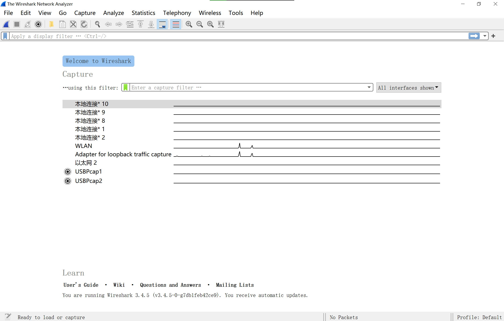

不同的平台，如 windows 和 macos，不同的语言设置和 wireshark 版本都会影响第一次运行后的界面。不过 wireshark 提供的功能大部分是相同的。这张屏幕截图在 windows 10，wireshark v3.4.5 环境。

在这张图中，注意到在 Capture 下面的列表中有许多所谓的接口。其中 WLAN 表示这台电脑的 WiFi 接入。双击其中一个接口，可以捕获来自这个接口的帧。本电脑使用了 WiFi 接入，所以我们双击 WLAN，就可以开始捕获来自 WLAN 的帧。

下图展示了捕获分组时的界面。


这个界面包含了从上到下的 5 个部分：

- **命令菜单**

命令菜单包含了常见的 wireshark 命令。其中的 **File** 下拉菜单项用于打开以及保存捕获的分组信息文件。**Capture** 下拉菜单项用于选择一项网络接口进行捕获。下面的一栏包含了常用的操作，第 1 个蓝色的鲨鱼图标按钮为捕获操作，第 2 个红色的(没有处于捕获期间为灰色，不可点击)按钮为停止捕获操作，第 3 个绿色的鲨鱼图标按钮用于重启当前的捕获。接着的 4 个按钮为用于捕获文件上的操作。第 1 个按钮用于打开捕获的文件，第 2 个按钮用于保存捕获文件，第 3 个按钮关闭当前的捕获文件，第 4 个按钮用于重载捕获文件。剩下的按钮以后再讨论。

- **过滤框**

过滤框用于过滤分组列表中的信息。如，输入 http 可以只保留协议为 HTTP 的分组。

- **分组列表**

分组列表显示了捕获到的每一个分组的摘要，包含了分组的序号(由 wireshark 指定的序号)，分组捕获时的时间，源地址和目的地址，协议类型，以及协议中的简要内容信息。

- **已选分组信息窗**

这个窗口提供了选择的分组(高亮)的详细信息。这些信息包含了以太网帧(或 WLAN 帧)，IP 数据报，TCP(或 UDP)报文段，以及应用层的报文(如果使用了应用层协议)。这些信息可以点击箭头展开和收起。

- **分组详细内容窗**

这个窗口提供了帧的内容。有 2 种方式：16 进制以及 ASCII 方式。

3. **用 wireshark 做一次测试**

现在我们使用 wireshark 做一次测试。我们假设你的电脑使用了以太网接入或 WiFi 接入。

执行以下的步骤：

- 打开你的浏览器，新建一个 Tab。
- 打开 wireshark，选择你电脑的网络接口开始捕获。
- 此时，切换到浏览器的 Tab，键入 http://gaia.cs.umass.edu/wireshark-labs/INTRO-wireshark-file1.html 等待网页加载完成。
- 在 wireshark 中，使用过滤框，键入 http，就可以发现我们刚才的浏览器活动。

- 选择 HTTP 请求分组，在已选分组信息窗，找到 HTTP 协议，其中就有请求行中的 GET 方法字段。

如下图所示：


# 2. 应用层

**time : 2021-05-05**

## 2.1. 应用层协议原理

分布式应用程序需要应用开发者在不同的端系统上开发对应的应用程序。

网络核心设备如分组交换机等没有实现网络层以上的协议，因此不需要开发者在网络核心设备上开发程序。

### 2.1.1. 进程通信

分布式应用程序之间的通信具体上是**进程**之间的通信。一个进程可以理解为运行在端系统上的一个程序。当多个进程运行在同一个操作系统时，他们使用进程间通信机制进行通信，这个机制由操作系统确定。在本书中，我们关注的时运行在不同端系统上进程之间的通信。

1. **客户和服务器进程**

网络应用程序由成对的进程组成，这些进程通过网络相互发送报文。例如，在 Web 应用程序中，一个客户浏览器进程与一台 Web 服务器进程交换报文。在一个 P2P 文件共享系统中，文件从一个对等方中的进程传输到另一个对等方中的进程。对每对通信进程, 我们通常将这两个进程之一标识为客户,而另一个进程标识为服务器。 对于 Web 而言，浏览器是一个客户进程，Web 服务器是一台服务器进程。对于 P2P 文件 共享，下载文件的对等方标识为客户，上载文件的对等方标识为服务器。

2. **进程与计算机网络之间的接口**

如上所述，多数应用程序是由通信进程对组成，每对中的两个进程互相发送报文。从一个进程向另一个进程发送的报文必须通过下面的网络。进程通过一个称为 **套接字(socket)** 的软件接口向网络发送报文和从网络接收报文。

图 2-3 显示了两个经过 Internet 通信的进程之间的套接字通信（图 2-3 中假定由该进程使用的下面运输层协议是 Internet 的 TCP 协议）。如该图所示，套接字是同一台主机内应用层与运输层之间的接口。由于该套接字是建立网络应用程序的可编程接口，因此套接字也称为应用程序和网络之间的**应用程序编程接口(Application Programming Interface, API)**。 应用程序开发者可以控制套接字在应用层端的一切，但是对该套接字的运输层端几乎没有控制权。应用程序开发者对于运输层的控制仅限于：1.选择运输层协议；2.也许能设定几个运输层参数，如最大缓存和最大报文段长度等（将在第 3 章中涉及）。一旦应用程序开发者选择了一个运输层协议（如果可供选择的话），则应用程序就建立在由该协议提供的 运输层服务之上。我们将在 2-7 节中对套接字进行更为详细的探讨。

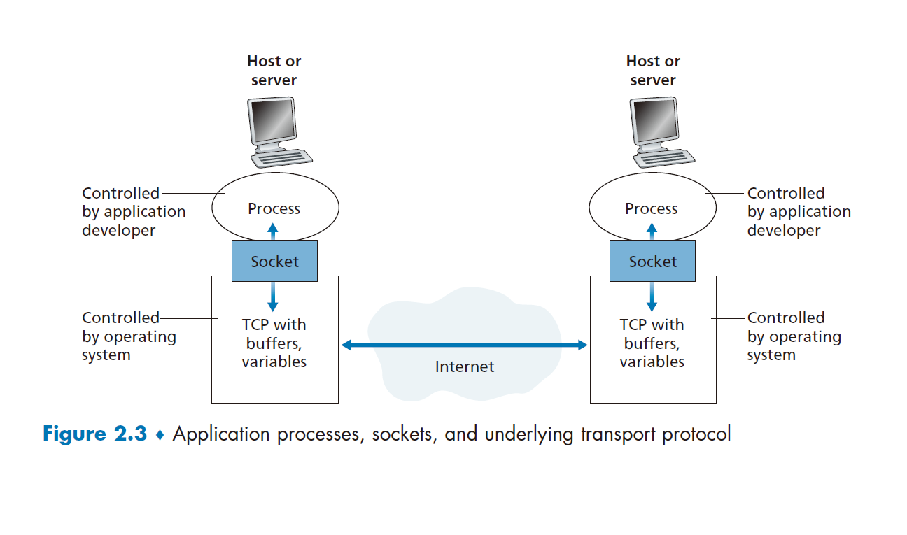

3. **进程寻址**

为了向特定目的地发送邮政邮件，目的地需要有一个地址。类似地，在一台主机上运行的进程为了向在另一台主机上运行的进程发送分组，接收进程需要有一个地址。为了标识该接收进程，需要定义两种信息：1. 主机的地址；2. 在目的主机中指定接收进程的标识符。其中主机地址由**IP 地址标识**。进程由**端口号**标识。例如，Web 服务器进程默认用 80 端口标识，邮件服务器进程默认用 25 标识。常见的端口号可以在[这里](https://zh.wikipedia.org/wiki/TCP/UDP%E7%AB%AF%E5%8F%A3%E5%88%97%E8%A1%A8)找到。我们将在第三章详细学习。

### 2.1.2. 可供应用程序使用的运输层服务

前面讲过套接字是应用程序进程和运输层协议之间的接口。

一个运输层协议能够为调用它的应用程序提供什么样的服务呢？我们大体能够从四个方面对应用程序服务要求进行分类：**可靠数据传输**、**吞吐量**、**时延** 和 **安全性**。

1. **可靠数据传输**

如第 1 章讨论的那样，分组在计算机网络中可能丢失。例如，分组能够使路由器中的缓存溢岀，或者当分组中的某些比特损坏后可能被丢弃。像电子邮件、文件传输、远程主机访问、Web 文档传输以及金融应用等这样的应用，数据丢失可能会造成灾难性的后果(在后一种情况下，无论对银行或对顾客都是如此！)

因此，为了支持这些应用，必须做一些工作以确保由应用程序的一端发送的数据正确、完全地交付给该应用程序的另一端。如果一个协议提供了这样的确保数据交付服务，就认为提供了**可靠数据传输**。

当一个运输层协议不提供可靠数据传输时，由发送进程发送的某些数据可能到达不了接收进程。这可能能被**容忍丢失**的应用所接受，最值得注意的 是多媒体应用，如交谈式音频/视频，它们能够承受一定量的数据丢失。在这些多媒体应用中，丢失的数据引起播放的音频/视频出现小干扰，而不是致命的损伤。

2. **吞吐量**

在第 1 章中我们引入了可用吞吐量的概念，在沿着一条网络路径上的两个进程之间的通信会话场景中，可用吞吐量就是发送进程能够向接收进程交付比特的速率。因为其他会话将共享沿着该网络路径的带宽，并且因为这些会话将会到达和离开，该可用吞吐量将随时间波动。

这样的确保吞吐量的服务将对许多应用程序有吸引力。例如，如果 Internet 电话应用程序对语音以 32kbps 的速率进行编码， 那么它需要以这个速率向网络发送数据，并以该速率向接收应用程序交付数据。如果运输 协议不能提供这种吞吐量，该应用程序或以较低速率进行编码（并且接收足够的吞吐量以 维持这种较低的编码速率），或它可能必须放弃发送.这是因为对于这种 Internet 电话应用 而言，接收所需吞吐量的一半是几乎没有或根本没有用处的。具有吞吐量要求的应用程序 被称为**带宽敏感的应用**。许多当前的多媒体应用是带宽敏感的，尽管某些多媒体应用程序可能采用自适应编码技术对数字语音或视频以与当前可用 带宽相匹配的速率进行编码。

带宽敏感的应用具有特定的吞吐量要求，而弹性应用能够根据当时可用的带宽或多或少地利用可供使用的吞吐量。电子邮件、文件传输以及 Web 传送 都属于**弹性应用**。当然，吞吐量是越多越好。

3. **时延**

运输层协议也能提供定时保证。如同具有吞吐量保证那样，定时保证能够以多种形式实现。一个保证的例子如：发送方注入进套接字中的每个比特到达接收方的套接字不迟于 100ms。这种服务将对交互式实时应用程序有吸引力，如 Internet 电话、虚拟环境、电话会 议和多方游戏，所有这些服务为了有效性而要求数据交付有严格的时间限制。例如，在 Internet 电话中，较长的时延会导致会话中出现不自然的停顿；在多方游戏和虚拟互动环境中，在做出动作并看到来自环境（如来自位于端到端连接中另一端点的玩家）的响应之间，较长的时延使得它失去真实感。对于非实时的应用，较低的时延总比较高的时延好，但对端到端的时延没有严格的约束。

4. **安全性**

最后，运输协议能够为应用程序提供一种或多种安全性服务。例如，在发送主机中，运输协议能够加密由发送进程传输的所有数据，在接收主机中，运输层协议能够在将数据交付给接收进程之前解密这些数据。这种服务将在发送和接收进程之间提供机密性，以防该数据以某种方式在这两个进程之间被观察到。运输协议还能提供除了机密性以外的其他安全性服务，包括数据完整性和端点鉴别，我们将在第 8 章中详细讨论这些主题。

### 2.1.3. Internet 提供的运输层服务

至此，我们已经考虑了计算机网络能够提供的通用运输服务。现在我们要更为具体地考察由 Internet 提供的运输服务类型。Internet（更一般的是 TCP/IP 网络）为应用程序提供两个运输层协议，即 UDP 和 TCP。当你（作为一个软件开发者）为 Internet 创建一个新的应用时，首先要做出的决定是，选择 UDP 还是选择 TCP。每个协议为调用它们的应用程序 提供了不同的服务集合。图 2-4 显示了某些所选的应用程序的服务要求。


1. **TCP 服务**

TCP 服务模型包括面向连接服务和可靠数据传输服务。当某个应用程序调用 TCP 作为其运输协议时，该应用程序就能获得来自 TCP 的这两种服务。

- 面向连接的服务：在应用层数据报文开始流动之前，TCP 让客户和服务器互相交换运输层控制信息。这个所谓的握手过程提醒客户和服务器，让它们为大量分组的到来做好准备。在握手阶段后，一个 **TCP 连接(TCP connection)** 就在两个进程的套接字之间建立了。这条连接是全双工的，即连接双方的进程可以在此连接上同时进行报文收发。当应用程序结束报文发送时，必须拆除该连接。在第 3 章中我们将详细讨论面向连接的服务，并分析它是如何实现的。

- 可靠的数据传送服务：通信进程能够依靠 TCP,无差错、按适当顺序交付所有发送的数据。当应用程序的一端将字节流传进套接字时，它能够依靠 TCP 将相同的字节流交付给接收方的套接字，而没有字节的丢失和冗余。

TCP 协议还具有拥塞控制机制，这种服务不一定能为通信进程带来直接好处，但能为 Internet 带来整体好处。当发送方和接收方之间的网络出现拥塞时，TCP 的拥塞控制机制会抑制发送进程（客户或服务器）。如我们将在第 3 章中所见，TCP 拥塞控制也试图限制每个 TCP 连接，使它们达到公平共享网络带宽的目的。

2. **UDP 服务**

UDP 是一种不提供不必要服务的轻量级运输协议，它仅提供最小服务。UDP 是无连接的，因此在两个进程通信前没有握手过程。UDP 协议提供一种不可靠数据传送服务，也就是说，当进程将一个报文发送进 UDP 套接字时，UDP 协议并不保证该报文将到达接收进程。不仅如此，到达接收进程的报文也可能是乱序到达的。

UDP 没有包括拥塞控制机制，所以 UDP 的发送端可以用它选定的任何速率向其下层（网络层）注入数据。（然而，值得注意的是实际端到端吞吐量可能小于该速率，这可能是因为中间链路的带宽受限或因为拥塞而造成的。

流行 Internet 应用的应用层协议和运输层协议如图 2-5 所示。


### 2.1.4. 应用层协议

我们刚刚学习了通过把报文发送进套接字实现网络进程间的相互通信。但是如何构造这些报文？在这些报文中的各个字段的含义是什么？进程何时发送这些报文？这些问题将我们带进应用层协议的范围。应用层协议定义了运行在不同端系统上的应用程序进程如何相互传递报文。特别是应用层协议定义了：

- 交换的报文类型，例如请求报文和响应报文。
- 各种报文类型的语法，如报文中的各个字段及这些字段是如何描述的。
- 字段的语义，即这些字段中的信息的含义。
- 确定一个进程何时以及如何发送报文，对报文进行响应的规则。

有些应用层协议是由 RFC 文档定义的，因此它们位于公共域中。例如，Web 的应用层协议 HTTP （超文本传输协议［RFC 2616］）就作为一个 RFC 可供使用。如果浏览器开发者遵从 HTTP RFC 规则，所开发出的浏览器就能访问任何遵从该文档标准的 Web 服务器并获取相应 Web 页面。还有很多别的应用层协议是专用的，有意不为公共域使用。例如, Skype 使用了专用的应用层协议。

区分网络应用和应用层协议是很重要的。应用层协议只是网络应用的一部分。我们来看一些例子。Web 是一种客户-服务器应用，它允许客户按照需求从 Web 服务器获得文档。该 Web 应用有很多组成部分,包括文档格式的标准（即 HTML）、Web 浏览器、 Web 服务器，以及一个应用层协议。Web 的应用层协议是 HTTP,它定义了在浏览器和 Web 服务器之间传输的报文格式和序列。因此，HTTP 只是 Web 应用的一个部分（尽管是重要部分）。举另外一个例子，Internet 电子邮件应用也有很多组成部分，包括能容纳用户邮箱的邮件服务器、允许用户读取和生成邮件的邮件客 户程序（如 Microsoft Outlook） 定义电子邮件报文结构的标准、定义报文如何在服务器之 间以及如何在服务器与邮件客户程序之间传递的应用层协议、定义如何对报文首部的内容进行解释的应用层协议。用于电子邮件的主要应用层协议就是 SMTP （简单邮件传输协议 ［RFC5321］）。因此，电子邮件的首要应用层协议 SMTP 也只是电子邮件应用的一个部分。

### 2.1.5. 本书涉及的网络应用

在本书中，我们会讨论 5 种流行的网络应用程序，包括：Web，电子邮件，DNS，流式视频和 P2P。

## 2.2. Web 和 HTTP

**time : 2021-05-06**

### 2.2.1. HTTP 概述

Web 的应用层协议为**超文本传输协议(HTTP)**。HTTP 由 2 个程序实现，一个客户程序和一个服务器程序，他们运行在不同的端系统，互相交换 HTTP 报文。

先来看一下 Web 方面的术语。

Web 页面也叫 Web 文档。一个 Web 页面，由多个对象组成。一个对象就是一个文件，这些文件可以是图片，视频，javascript 脚本或者 HTML 文件，并且可以由唯一的 URL 来定位。大部分 Web 页面含有一个 HTML 基本文件以及若干个引用对象。例如，
一个 Web 页面包含基本的 HTML 文件和 5 个图片。那么这个 Web 页面有 6 个对象：一个 HTML 基本文件和 5 个图片。HTML 基本文件通过对象的 URL 地址引用页面中的其他对象。每个 URL 地址有 2 部分组成：主机名和路径名。**Web 浏览器**如 Google chrome 和 Firefox 实现了 HTTP 客户程序。**Web 服务器**如 Apache 和 ngnix 实现了 HTTP 服务端。

HTTP 定义了 Web 客户向 Web 服务器请求 Web 页面的方式，以及 Web 服务器向 Web 客户响应的方式。HTTP 使用 TCP 作为它的支撑运输协议。HTTP 客户首先发起一个与服务器的 TCP 连接。一旦连接建立，该浏览器和服务器就可以通过套接字访问 TCP。客户向他的套接字接口发送 HTTP 请求报文并从它的套接字接口接收 HTTP 响应报文。类似地，服务器从它的套接字 接口接收 HTTP 请求报文和向它的套接字接口发送 HTTP 响应报文。一旦客户向他的套接字接口发送了一个请求报文，该报文就脱离了客户控制，进入了 TCP 的控制。

注意到下列现象很重要：服务器向客户发送被请求的文件，而不存储任何关于该客户的状态信息。假如某个特定的客户在短短的几秒内两次请求同一个对象，服务器并不会因为刚刚为该客户提供了该对象就不再做出反应，而是重新发送该象，就像服务器已经完全忘记不久之前所做过的事一样。因为 HTTP 服务器并不保存关于客户的任何信息，所以我们说 HTTP 是一个**无状态协议**(stateless protocol)。我们同时也注意到 Web 使用了客户-服务器应用程序体系结构(如 2.1 节所述)。Web 服务器总是打开的，具有一个固定的 IP 地址，且它服务于可能来自数以百万计的不同浏览器的请求。

### 2.2.2. 持续连接和非持续连接

在许多 Internet 应用程序中，客户和服务器在一个相当长的时间范围内通信，其中客户发出一系列请求并且服务器对每个请求进行响应。依据应用程序以及该应用程序的使用方式，这一系列请求可以以规则的间隔周期性地或者间断性地一个接一个发出。当这种客户-服务器的交互是经 TCP 进行的，应用程序的研制者就需要做一个重要决定，即每个请求/响应对是经一个单独的 TCP 连接发送，还是所有的请求及其响应经相同的 TCP 连接发送呢？采用前一种方法，该应用程序被称为使用**非持续连接**(non-persistent connection)； 采用后一种方法，该应用程序被称为使用**持续连接**(persistent connection)。尽管 HTTP 在其默认方式下使用持续连接，HTTP 客户和服务器也能配置成使用非持续连接。

1. **采用非持续连接的 HTTP**

我们看看在非持续连接情况下，从服务器向客户传送一个 Web 页面的步骤。假设该页面含有一个 HTML 基本文件和 10 个 JPEG 图形，并且这 11 个对象位于同一台服务器上。进一步假设该 HTML 文件的 URL 为：http://www.someSchool.edu/someDepartment/index.html

我们看看发生了什么情况：

1） HTTP 客户进程在端口号 80 发起一个到服务器 www.someSchool.edu 的 TCP 连接， 该端口号是 HTTP 的默认端口。在客户和服务器上分别有一个套接字与该连接相关联。
2） HTTP 客户经它的套接字向该服务器发送一个 HTTP 请求报文。请求报文中包含了路径名 /someDepartment/index.html （后面我们会详细讨论 HTTP 报文）。
3） HTTP 服务器进程经它的套接字接收该请求报文，从其存储器（RAM 或磁盘）中检索出对象 www.someSchool.edu/someDepartment/index.html， 并在一个 HTTP 响应报文中封装对象，并通过其套接字向客户发送响应报文。
4） HTTP 服务器进程通知 TCP 断开该 TCP 连接。（但是直到 TCP 确认客户已经完整地收到响应报文为止，它才会实际中断连接。）
5） HTTP 客户接收响应报文，TCP 连接关闭。该报文指岀封装的对象是一个 HTML 文件，客户从响应报文中提取出该文件，检査该 HTML 文件，得到对 10 个 JPEG 图形的引用。
6） 对每个引用的 JPEG 图形对象重复前 4 个步骤。

当浏览器收到 Web 页面后，向用户显示该页面。两个不同的浏览器也许会以不同的方式解释（即向用户显示）该页面。HTTP 与客户如何解释一个 Web 页面毫无关系。 HTTP 规范（［RFC 1945］和［RFC2616］）仅定义了在 HTTP 客户程序与 HTTP 服务器程 序之间的通信协议。

上面的步骤举例说明了非持续连接的使用，其中每个 TCP 连接在服务器发送一个对象后关闭，即该连接并不为其他的对象而持续下来。值得注意的是每个 TCP 连接只传输一个请求报文和一个响应报文。因此在本例中，当用户请求该 Web 页面时，要产生 11 个 TCP 连接。

在上面描述的步骤中，我们有意没有明确客户获得这 10 个 JPEG 图形对象是使用 10 个串 行的 TCP 连接，还是某些 JPEG 对象使用了一些并行的 TCP 连接。事实上，用户能够配置现代浏览器来控制连接的并行度。在默认方式下，大部分浏览器打开 5 ~ 10 个并行的 TCP 连接，而每条连接处理一个请求响应事务。如果用户愿意，最大并行连接数可以设置为 1，这样 10 条连接就会串行建立。我们在下一章会看到，使用并行连接可以缩短响应时间。

在继续讨论之前，我们估算一下从客户请求 HTML 基本文件起到该客户收到整个文件所花费的时间。为此，我们给出**往返时间(Round-Trip Time RTT)**的定义，该时间是一个短分组从客户到服务器然后再返回客户所花费的时间。RTT 包括传播时延，排队时延和分组时延。

如图 2-7 所示。当用户再浏览器中点击一个超链接时，浏览器向 Web 服务器发起一个 TCP 连接请求。涉及一次“三次握手”：浏览器向 Web 服务器发送一个小的 TCP 报文段，服务器用一个小 TCP 报文段做出响应。最后浏览器向服务器返回确认。三次握手中前两个部分所耗费的时间占用了一个 RTT。完成了三次握手的前两个部分后，客户结合三次握手的第三部分（确认）向该 TCP 连接发送一个 HTTP 请求报文。一旦该请求报文到达服务器，服务器就在该 TCP 连接上发送 HTML 文件。该 HTTP 请求/响应用去了另一个 RTT。因此，粗略地讲，总的响应时间就是两个 RTT 加上服务器传输 HTML 文件的时间。


2. **采用持续连接的 HTTP**

非持续连接有一些缺点。第一，必须为每一个请求的对象建立和维护一个全新的连接。对于每个这样的连接，在客户和服务器中都要分配 TCP 的缓冲区和保持 TCP 变量, 这给 Web 服务器带来了严重的负担，因为一台 Web 服务器可能同时服务于数以百计不同的客户的请求。第二，就像我们刚描述的那样，每一个对象经受两倍 RTT 的交付时延, 即一个 RTT 用于创建 TCP,另一个 RTT 用于请求和接收一个对象。

在采用 HTTP 1.1 持续连接的情况下，服务器在发送响应后保持该 TCP 连接打开。在相同的客户与服务器之间，后续的请求和响应报文能够通过相同的连接进行传送。特别是，一个完整的 Web 页面（上例中的 HTML 基本文件加上 10 个图形）可以用单个持续 TCP 连接进行传送。更有甚者，位于同一台服务器的多个 Web 页面在从该服务器发送给同一个客户时，可以在单个持续 TCP 连接上进行。对对象的这些请求可以一个接一个地发出，而不必等待对未决请求（流水线）的回答。一般来说，如果一条连接经过一定时间间隔（一个可配置的超时间隔）仍未被使用，HTTP 服务器就关闭该连接。HTTP 的默认模式是使用带流水线的持续连接。最近，HTTP/2 ［RFC 7540］是在 HTTP 1.1 基础上构建的，它允许在相同连接中多个请求和回答交错，并增加了在该连接中优化 HTTP 报文请求和回答的机制。我们把量化比较持续连接和非持续连接性能的任务留作第 2、3 章的课后 习题。鼓励读者阅读文献［Heidemann 1997； Nielsen 1997； RFC 7540］。

### 2.2.3. HTTP 报文格式

HTTP 规范［RFC 1945； RFC 2616； RFC 7540:包含了对 HTTP 报文格式的定义。HTTP 报文有两种：请求报文和响应报文。下面讨论这两种报文。

1. **HTTP 请求报文**

下面时一个典型的 HTTP 请求报文

```
GET /somedir/page.html HTTP/1.1
Host: www.someschool.edu
Connection: close
User-agent: Mozilla/5.0
Accept-language: fr
```

该报文由不同的 ASCII 文本书写。
每行都有由一个换行符。最后一行再附加一个空行。
虽然这个特定的报文仅有 5 行，但一个请求报文能够具有更多的行或者至少为一行。

HTTP 请求报文的第一行是**请求行**，后继的行是**首部行**。

- **请求行**
  请求行由 3 个字段：方法字段，URL 字段和 HTTP 版本字段。方法字段可以取不同的值：GET，POST，HEAD，PUT 和 DELETE。绝大部分 HTTP 请求报文使用的是 GET 方法字段。后面的 URL 字段是请求对象的地址。版本字段是自动解释的，在这个例子中是 HTTP 1.1 版本。

- **首部行**

首先是主机地址。之后的 `Connection: close` 表示再服务器发送完成对象之后就关闭该连接。`User-agent: Mozilla/5.0` 表示用户浏览器的类型。最后 `Accept-language: fr` 表示用户想得到的对象语言版本为法语。

如图 2-8 所示，这是 HTTP 请求报文的通用格式。


- **实体体**

你可能注意到了由实体体的存在。
使用 GET 方 法时实体体为空，而使用 POST 方法时 才使用该实体体。当用户提交表单时， HTTP 客户常常使用 POST 方法，例如 当用户向搜索引擎提供搜索关键词时。 使用 POST 报文时，用户仍可以向服务 器请求一个 Web 页面，但 Web 页面的 特定内容依赖于用户在表单字段中输入 的内容。如果方法字段的值为 POST 时，
则实体体中包含的就是用户在表单字段中的输入值。

2. **HTTP 响应报文**

下面的响应报文是上面请求报文的响应。

```
HTTP/1.1 200 OK
Connection: close
Date: Tue, 18 Aug 2015 15:44:04 GMT
Server: Apache/2.2.3 (CentOS)
Last-Modified: Tuer 18 Aug 2015 15:11:03 GMT
Content-Length: 6821
Content-Type: text/html

(data data data data data ...)
```

该响应有 3 个部分：第一行为**状态行**，6 个**首部行**，然后是**实体体**。

- **状态行**

状态行有 3 个字段：协议版本字段，状态码，和相应的状态信息。再这个例子中，状态行表示 Web 服务器使用的 HTTP 版本为 1.1，并且一切正常(服务器已经找到请求对象并成功发送)。

常用的状态码包括：
200 0K：请求成功，信息在返回的响应报文中。
301 Moved Permanently：请求的对象已经被永久转移了，新的 URL 定义在响应报 文的 Location:首部行中。客户软件将自动获取新的 URL。
400 Bad Request: 一个通用差错代码，指示该请求不能被服务器理解。
404 Not Found:被请求的文档不在服务器上。
505 HTTP Version Not Supported:服务器不支持请求报文使用的 HTTP 协议版本。

- **首部行**

`Connection: close` 表示发送这条报文后会关闭该连接。
`Date: Tue, 18 Aug 2015 15:44:04 GMT` 表示发送这条报文的日期。
`Server: Apache/2.2.3 (CentOS)` 表示该报文是由一台 Apache web 服务器产生的。
`Last-Modified: Tuer 18 Aug 2015 15:11:03 GMT` 表示发送对象最后的修改时间。
`Content-Length: 6821` 表示发送对象的字节数。
`Content-Type: text/html` 表示发送对象的类型为 html 文本。

如图 2-9 所示，这是 HTTP 响应报文的通用格式。


3. **使用 Google Chrome 开发者工具查看真实的报文**

浏览器是如何决定在一个请求报文中包含哪些首部行的呢？ Web 服务器又是如何决定在一个响应报文中包含哪些首部行呢？浏览器产生的首部行与很多因素有关，包括浏览器的类型和协议版本（例如，HTTP/1.0 浏览器将不会产生任何 1.1 版本的首部行）、浏览器的用户配置（如喜好的语言）、浏览器当前是否有一个缓存的但是可能超期的对象版本。Web 服务器的表现也类似：在产品、版本和配置上都有差异，所有这些都会影响响应报文中包含的首部行。

下面我们通过 Chrome 开发者工具来查看真实的 HTTP 报文。

现代浏览器都提供了开发者工具以便开发者进行调试。

本书中，我们使用 Google Chrome Windows 版进行演示。

在 Chrome 中打开一个新的 Tab。右击鼠标可以发现菜单选项。选择“查看”选项。即可打开开发者工具。(或者使用快捷键 F12)。

在开发者工具的面板上，由“Elements”切换到“Network”。此时，在搜索框中键入需要请求的 URL 地址。

我们会发现，Network 面板的左侧栏会依次列出 HTML 基本文件中所有的引用对象。选择一个对象，在右侧栏可以查看对这个对象请求的详细信息。

在“General”中可以查看该对象的地址，请求的方法，响应的状态码，发出请求的端系统的地址和端口等信息。

在“Response Header”中可以查看响应报文的首部行。在“Request Header”中可以查看请求报文的首部行。

如图 2-10 所示，请求的地址为 http://www.baidu.com/index.html


### 2.2.4. Cookie

我们前面提到了 HTTP 服务器是无状态的。这简化了服务器的设计，并且允许工程师们去开发可以同时处理数以千计的 TCP 连接的高性能 Web 服务器。然而一个 Web 站点通常希望能够识别用户，可能是因为服务器希望限制用户的访问，或者因为它希望把内容与用户身份联系起来。为此，HTTP 使用了 cookie。cookie 在［RFC 6265 ］中定义，它允许站点对用户进行跟踪。目前大多数商务 Web 站点都使用了 cookie。

cookie 技术有 4 个部分：

1. 在 HTTP 响应报文中首部行的 cookie。
2. 在 HTTP 请求报文中首部行的 cookie。
3. 在用户端系统中保留有一个 cookie 文件，并由对应浏览器进行管理。
4. 位于 Web 服务器的一个后端数据库。

如图 2-11 所示。


假设 Susan 总是从家中 PC 使用 Internet Explorer 上网，她首次与 Amazon.com 联系。我们假定过去她已经访问过 eBay 站点。当请求报文到达该 Amazon Web 服务器时，该 Web 站点将产生一个唯一识别码，并以此作为索引在它的后端数据库中产生一个表项。接下来 Amazon Web 服务器用一个包含 `Set-cookie:` 首部的 HTTP 响应报文对 Susan 的浏览器进行响应，其中 Set-cookie：首部含有该识别码。例如，该首部行可能是

```
Set-cookie: 1678
```

当 Susan 的浏览器收到了该 HTTP 响应报文时，它会看到该 `Set-cookie:` 首部。该浏览器在它管理的特定 cookie 文件中添加一行，该行包含服务器的主机名和在 `Set-cookie:` 首部中的识别码。值得注意的是该 cookie 文件已经有了用于 eBay 的表项，因为 Susan 过去访问过该站点。当 Susan 继续浏览 Amazon 网站时，每请求一个 Web 页面，其浏览器就会查询该 cookie 文件并抽取她对这个网站的识别码，并放到 HTTP 请求报文中包括识别码的 cookie 首部行中。特别是，发往该 Amazon 服务器的每个 HTTP 请求报文都包括以下首部行:

```
Cookie: 1678
```

在这种方式下，Amazon 服务器可以跟踪 Susan 在 Amazon 站点的活动。尽管 AmazonWeb 站点不必知道 Susan 的名字，但它确切地知道用户 1678 按照什么顺序、在什么时间、访问了哪些页面！ Amazon 使用 cookie 来提供它的购物车服务，即 Amazon 能够维护 Susan 希望购买的物品列表，这样在 Susan 结束会话时可以一起为它们付费。

如果 Susan 再次访问 Amazon 站点，比如说一个星期后，她的浏览器会在其请求报文中继续放入首部行 `cookie: 1678`。 Amazon 将根据 Susan 过去在 Amazon 访问的网页向她推荐产品。如果 Susan 也在 Amazon 注册过，即提供了她的全名、电子邮件地址、邮政地址和信用卡账号，则 Amazon 能在其数据库中包括这些信息，将 Susan 的名字与识别码相关联（以及她在过去访问过的本站点的所有页面）。这就解释了 Amazon 和其他一些电子商务网站实现"点击购物（one-click shopping）的道理，即当 Susan 在后继的访问中选择购买某个物品时，她不必重新输入姓名、信用卡账号或者地址等信息了。

从上述讨论中我们看到，cookie 可以用于标识一个用户。用户首次访问一个站点时，可能需要提供一个用户标识（可能是名字）。在后继会话中，浏览器向服务器传递一个 cookie 首部，从而向该服务器标识了用户。因此 cookie 可以在无状态的 HTTP 之上建立一个用户会话层。例如，当用户向一个基于 Web 的电子邮件系统（如 Hotmail）注册时，浏览器向服务器发送 cookie 信息，允许该服务器在用户与应用程序会话的过程中标识该用户。

尽管 cookie 常常能简化用户的 Internet 购物活动，但是它的使用仍具有争议，因为它们被认为是对用户隐私的一种侵害。如我们刚才所见，结合 cookie 和用户提供的账户信息，Web 站点可以知道许多有关用户的信息，并可能将这些信息卖给第三方。Cookie Central [Cookie Central 2016]包括了对 cookie 争论的广泛信息。

### 2.2.5. 代理服务器

**代理服务器**可以代表初始 Web 服务器来响应 HTTP 请求。

举例来说，假如用户使用浏览器请求 https://www.google.com/index.html 将会发生以下情况：

1）浏览器创建一个到代理服务器的 TCP 连接，并向代理服务器中的对象发送 HTTP 请求。
2）代理服务器进行检查，查看本地是否存储了该对象的副本，如果有，代理服务器就向客户浏览器发送包含该对象的 HTTP 响应报文。
3）如果代理服务器中没有这个对象，那么代理服务器会创建一个到 www.google.com 的 TCP 连接，并请求该对象，www.google.com 服务器会向代理服务器发送包含该对象的响应报文。
4）代理服务器接收到该对象后，他会在本地存储一份副本，并利用(1)中建立的 TCP 连接向客户浏览器发送包含该对象的响应报文。

使用代理的其中一个重要的作用是可以减少访问的时延。

通过使用内容分发网络（Content Distribution Network, CDN） , 代理服务器正在 Internet 中发挥着越来越重要的作用。CDN 公司在 Internet 上安装了许多地理上分散的代理服务器，因而使大量流量实现了本地化。有多个共享的 CDN （例如 Akamai 和 Limelight）和专用的 CDN （例如谷歌和 Netflix）。我们将在 2.6 节中更为详细地讨论 CDN。

### 2.2.6. 条件 GET 方法

web 代理可以减少用户感受到的响应时间，但也引入了一个新的问题，存放在 web 代理服务器上的文件的副本可能是陈旧的。换句话说，保存在服务器中的对象自该副本缓存在客户 上以后可能已经被修改了。幸运的是，HTTP 协议有一种机制，允许缓存器证实它的对象是最新的。这种机制就是 **条件 GET(conditional GET)方法**。如果：1. 请求报文使用 GET 方法；并且 2. 请求报文中包含一个“If-Modified-Since:”首部行。那么，这个 HTTP 请求报文就是一个条件 GET 请求报文。

为了说明 GET 方法的操作方式，我们看一个例子。首先，一个代理缓存器（proxy cache）代表一个请求浏览器，向某 Web 服务器发送一个请求报文:

```
GET /fruit/kiwi.gif HTTP/1.1
Host: www.exotiquecuisine.com
```

之后，该 Web 服务器向缓存器发送具有被请求的对象的响应报文:

```
HTTP/1.1 200 OK
Date: Sat, 3 Oct 2015 15:39:29
Server: Apache/1.3.0 (Unix)
Last-Modified: Wed, 9 Sep 2015 09:23:24
Content-Type: image/gif

(data data data data data ...)
```

该缓存器在将对象转发到请求的浏览器的同时，也在本地缓存了该对象。重要的是, 缓存器在存储该对象时也存储了最后修改日期。最后，一个星期后，另一个用户经过该缓 存器请求同一个对象，该对象仍在这个缓存器中。由于在过去的一个星期中位于 Web 服务器上的该对象可能已经被修改了，该缓存器通过发送一个条件 GET 执行最新检查。具体来说，该缓存器发送:

```
GET /fruit/kiwi.gif HTTP/1.1
Host: www.exotiquecuisine.com
If-modified-since: Wed, 9 Sep 2015 09:23:24
```

值得注意的是 `If-Modified-Since:` 首部行的值正好等于一星期前服务器发送的响应报文中的 `Last-Modified:` 首部行的值。该条件 GET 报文告诉服务器，仅当自指定日期之后该对象被修改过，才发送该对象。假设该对象自 2015 年 9 月 9 日 09: 23: 24 后没有被修改。接下来的第四步，Web 服务器向该缓存器发送一个响应报文:

```
HTTP/1.1 304 Not Modified
Date: Satf Oct 2015 15:39:29
Server: Apache/1.3.0 (Unix)

(empty entity body)
```

我们看到，作为对该条件 GET 方法的响应，该 Web 服务器仍发送一个响应报文，但 并没有在该响应报文中包含所请求的对象。包含该对象只会浪费带宽，并增加用户感受到的响应时间，特别是如果该对象很大的时候更是如此。值得注意的是在最后的响应报文中，状态行中为 304 Not Modified,它告诉缓存器可以使用该对象，能向请求的浏览器转发它（该代理缓存器）缓存的该对象副本。

我们现在完成了对 HTTP 的讨论，这是我们详细学习的第一个 Internet 协议（应用层协议）。我们已经学习了 HTTP 报文的格式，学习了当发送和接收这些报文时 Web 客户和服务器所采取的动作。我们还学习了一点 Web 应用程序基础设施，包括缓存、cookie 和后端数据库，所有这些都以某种方式与 HTTP 协议有关。

## 2.3. 电子邮件

**time : 2021-05-07**

电子邮件系统有 3 个重要的组成部分：**用户代理**，**邮件服务器**和**简单邮件传输协议(SMTP)**。

下面我们结合发送方 Alice 发电子邮件给 接收方 Bob 的场景，对每个组成部分进行描述。用户代理允许用户阅读、回复、转发、保存和撰写报文。微软的 Outlook 和 Apple Mail 是电子邮件用户代理的例子。当 Alice 完成邮件撰写时，她的邮件代理向其邮件服务器发送邮件，此时邮件放在邮件服务器的外出报文队列中。当 Bob 要阅读报文时，他的用户代理在其邮件服务器的邮箱中取得该报文。

邮件服务器是电子邮件系统的核心。每个接收方(如 Bob)在其中的某个邮件服务器上有一个**邮箱**。Bob 的邮箱管理和维护着发送给他的报文。一个典型 的邮件发送过程是：从发送方的用户代理开始，传输到发送方的邮件服务器，再传输到接 收方的邮件服务器，然后在这里被分发到接收方的邮箱中。当 Bob 要在他的邮箱中读取该报文时，包含他邮箱的邮件服务器（使用用户名和口令）来鉴别 Bob。如果 Alice 的服务器不能将邮件交付给 Bob 的服务器,Alice 的邮件服务器在一个报文队列（message queue）中保持该报文并在以后尝试再次发 送。通常每 30 分钟左右进行一次尝试；如果几天后仍不能成功，服务器就删除该报文并以电子邮件的形式通知发送方（Alice）。

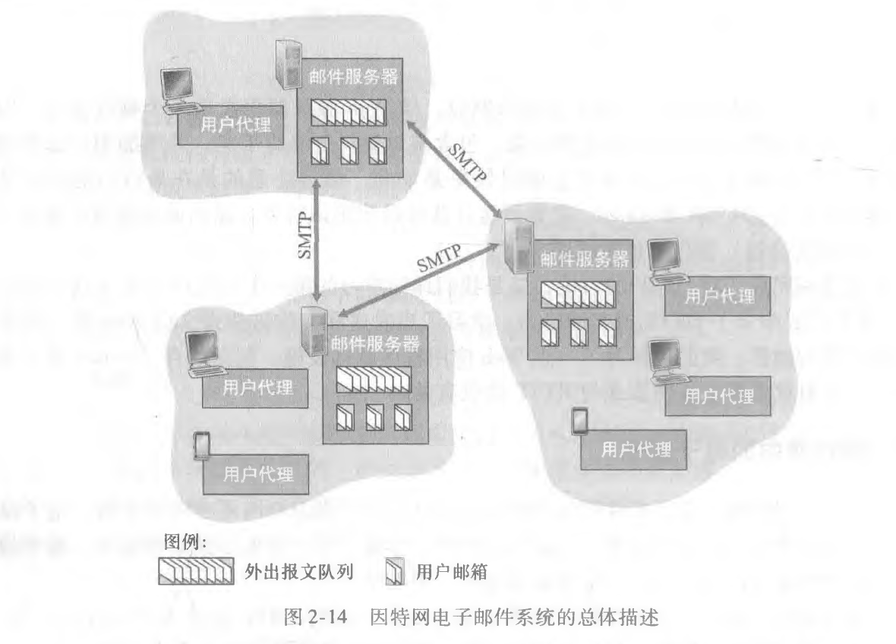

SMTP 是 Internet 电子邮件中主要的应用层协议。它使用 TCP 可靠数据传输服务，从发 送方的邮件服务器向接收方的邮件服务器发送邮件。像大多数应用层协议一样，SMTP 也 有两个部分：运行在发送方邮件服务器的客户端和运行在接收方邮件服务器的服务器端。 每台邮件服务器上既运行 SMTP 的客户端也运行 SMTP 的服务器端。当一个邮件服务器向 其他邮件服务器发送邮件时，它就表现为 SMTP 的客户；当邮件服务器从其他邮件服务器上接收邮件时，它就表现为一个 SMTP 的服务器。

### 2.3.1. SMTP

RFC 5321 给出了 SMTP 的定义。SMTP 是 Internet 电子邮件的核心。如前所述, SMTP 用于从发送方的邮件服务器发送报文到接收方的邮件服务器。

为了描述 SMTP 的基本操作，我们观察一种常见的情景。假设 Alice 想给 Bob 发送一封简单的 ASCII 报文。
1） Alice 调用她的邮件代理程序并提供 Bob 的邮件地址（例如 bob® someschool. edu）, 撰写报文，然后指示用户代理发送该报文。
2） Alice 的用户代理把报文发给她的邮件服务器，在那里该报文被放在报文队列中。
3） 运行在 Alice 的邮件服务器上的 SMTP 客户端发现了报文队列中的这个报文，它就创建一个到运行在 Bob 的邮件服务器上的 SMTP 服务器的 TCP 连接。
4） 在经过一些初始 SMTP 握手后，SMTP 客户通过该 TCP 连接发送 Alice 的报文。
5） 在 Bob 的邮件服务器上，SMTP 的服务器端接收该报文。Bob 的邮件服务器然后将该报文放入 Bob 的邮箱中。
6） 在 Bob 方便的时候，他调用用户代理阅读该报文。

接下来我们分析一个在 SMTP 客户（C）和 SMTP 服务器（S）之间交换报文文本的例子。客户的主机名为 crepes.fr，服务器的主机名为 hamburger.edu。 以 C：开头的 ASCII 码 文本行正是客户交给其 TCP 套接字的那些行，以 S：开头的 ASCII 码则是服务器发送给其 TCP 套接字的那些行。一旦创建了 TCP 连接，就开始了下列过程：

```
S: 200 hamburger.edu
C: HELO crepes.fr
S: 250 Hello crepes.fr, pleased to meet you
C: MAIL FROM: <alice@crepes.fr>
S: 250 alice@crepes.fr ... Sender ok
C: RCPT TO: <bob@hamburger.edu>
S: 250 bob@hamburger.edu ... Recipient ok
C: DATA
S: 354 Enter mail, end with "." on a line by itself
C: Do you like ketchup?
C: How about pickles?
C: .
S: 250 Message accepted for delivery
C: QUIT
S: 221 hamburger.edu closing connection
```

在上例中，客户从邮件服务器 crepes, fr 向邮件服务器 hamburger, edu 发送了一个报文 （"Do you like ketchup? How about pickles?" ） o 作为对话的一部分，该客户发送了 5 条命 令：HELO （是 HELLO 的缩写）、MAIL FROM. RCPTTO、DATA 以及 QUIT。这些命令都 是自解释的。该客户通过发送一个只包含一个句点的行，向服务器指示该报文结束了。 （按照 ASCII 码的表示方法，每个报文以 CRLF. CRLF 结束，其中的 CR 和 LF 分别表示回 车和换行。）服务器对每条命令做出回答，其中每个回答含有一个回答码和一些（可选 的）英文解释。我们在这里指出 SMTP 用的是持续连接：如果发送邮件服务器有几个报文发往同一个接收邮件服务器，它可以通过同一个 TCP 连接发送这些所有的报文。对每个报文，该客户用一个新的 MAIL FROM: crepes, fr 始，用一个独立的句点指示该邮件的结 束，并且仅当所有邮件发送完后才发送 QUIT。

### 2.3.2. SMTP VS HTTP

我们简要地比较一下 SMTP 和 HTTP。这两个协议都用于从一台主机向另一台主机传送文件：HTTP 从 Web 服务器向 Web 客户（通常是一个浏览器）传送文件（也称为对象）；SMTP 从一个邮件服务器向另一个邮件服务器传送文件（即电子邮件报文）。当进行文件传送时，持续的 HTTP 和 SMTP 都使用持续连接。因此，这两个协议有一些共同特征。

然而，两者之间也有一些重要的区别。

1. 首先，HTTP 主要是一个**拉协议**（pull protocol）, 即在方便的时候，某些人在 Web 服务器上装载信息，用户使用 HTTP 从该服务器拉取这些信息。特别是 TCP 连接是由想接收文件的机器发起的。另一方面，SMTP 基本上是一个**推协议**（push protocol）,即发送邮件服务器把文件推向接收邮件服务器。特别是，这个 TCP 连接是由要发送该文件的机器发起的。

2. 第二个区别就是我们前面间接地提到过的，SMTP 要求每个报文（包括它们的体）采 用 7 比特 ASCII 码格式。如果某报文包含了非 7 比特 ASCII 字符（如具有重音的法文字符）或二进制数据（如图形文件），则该报文必须按照 7 比特 ASCII 码进行编码。HTTP 数据则不受这种限制。

3. 第三个重要区别是如何处理一个既包含文本又包含图形（也可能是其他媒体类型）的文档。如我们在 2.2 节知道的那样，HTTP 把每个对象封装到它自己的 HTTP 响应报文中, 而 SMTP 则把所有报文对象放在一个报文之中。

### 2.3.3. SMTP 报文格式

当 Alice 给 Bob 写一封邮寄时间很长的普通信件时，她可能要在信的上部包含各种各 样的环境首部信息，如 Bob 的地址、她自己的回复地址以及日期等。同样，当一个人给另 一个人发送电子邮件时，一个包含环境信息的首部位于报文体前面。这些环境信息包括在 一系列首部行中，这些行由 RFC 5322 定义。首部行和该报文的体用空行（即回车换行） 进行分隔。RFC 5322 定义了邮件首部行和它们的语义解释的精确格式。如同 HTTP 协议,
每个首部行包含了可读的文本，是由关键词后跟冒号及其值组成的。某些关键词是必需 的，另一些则是可选的。每个首部必须含有一个 From：首部行和一个 To：首部行；一个 首部也许包含一个 Subject：首部行以及其他可选的首部行。重要的是注意到下列事实：这 些首部行不同于我们在 2.3.1 节所学到的 SMTP 命令（即使那里包含了某些相同的词汇,如 from 和 to）。那节中的命令是 SMTP 握手协议的一部分；本节中考察的首部行则是邮件报文自身的一部分。

```
From: alice@crepes.fr
To: bob@hamburger.edu
Subject: Searching for the meaning of life.
```

在报文首部之后，紧接着一个空白行，然后是以 ACSII 格式表示的报文体.

### 2.3.4. 邮件访问协议

一旦 SMTP 将邮件报文从 Alice 的邮件服务器交付给 Bob 的邮件服务器，该报文就被 放入了 Bob 的邮箱中。在此讨论中，我们按惯例假定 Bob 是通过登录到服务器主机，并直 接在该主机上运行一个邮件阅读程序来阅读他的邮件的。直到 20 世纪 90 年代早期，这都 是一种标准方式。而在今天，邮件访问使用了一种客户-服务器体系结构，即典型的用户 通过在用户端系统上运行的客户程序来阅读电子邮件，这里的端系统可能是办公室的 PC、 便携机或者是智能手机。通过在本地主机上运行邮件客户程序，用户享受一系列丰富的特 性，包括查看多媒体报文和附件的能力。

假设 Bob （接收方）在其本地 PC 运行用户代理程序，考虑在他的本地 PC 也放置一个邮件服务器是自然而然的事。在这种情况下，Alice 的邮件服务器就能直接与 Bob 的 PC 进行对话了。然而这种方法会有一个问题。前面讲过邮件服务器管理用户的邮箱，并且运行 SMTP 的客户端和服务器端。如果 Bob 的邮件服务器位于他的 PC 上，那么为了能够及时接收可能在任何时候到达的新邮件，他的 PC 必须总是不间断 地运行着并一直保持在线。这对于许多 Internet 用户而言是不现实的。相反，典型的用户通常在本地 PC 上运行一个用户代理程序，而它访问存储在总是保持开机的共享邮件服务器上的邮箱。该邮件服务器与其他用户共享，并且通常由用户的 ISP 进行维护（如大学或公司）。

现在我们考虑当从 Alice 向 Bob 发送一个电子邮件报文时所取的路径。我们刚才已经 知道，在沿着该路径的某些点上，需要将电子邮件报文存放在 Bob 的邮件服务器上。通过 让 Alice 的用户代理直接向 Bob 的邮件服务器发送报文，就能够做到这一点。这能够由
SMTP 来完成：实际上，SMTP 被设计成将电子邮件从一台主机推到另一台主机。然而 j 常 Alice 的用户代理和 Bob 的邮件服务器之间并没有一个直接的 SMTP 对话。相反，如图 2-16 所示，Alice 的用户代理用 SMTP 将电子邮件报文推入她的邮件服务器，接着她的 邮件服务器（作为一个 SMTP 客户）再用 SMTP 将该邮件中继到 Bob 的邮件服务器。为什 么该过程要分成两步呢？主要是因为不通过 Alice 的邮件服务器进行中继，Alice 的用户代 理将没有任何办法到达一个不可达的目的地接收服务器。通过首先将邮件存放在自己的邮件服务器中，Alice 的邮件服务器可以重复地尝试向 Bob 的邮件服务器发送该报文，如每 30 分钟一次，直到 Bob 的邮件服务器变得运行为止。（并且如果 Alice 的邮件服务器关机,她则能向系统管理员进行申告！）SMTP RFC 文档定义了如何使用 SMTP 命令经过多个 SMTP 服务器进行报文中继。


但是对于该难题仍然有一个疏漏的环节！像 Bob 这样的接收方，是如何通过运行其本 地 PC 上的用户代理，获得位于他的某 ISP 的邮件服务器上的邮件呢？值得注意的是 Bob 的用户代理不能使用 SMTP 得到报文，因为取报文是一个拉操作，而 SMTP 协议是一个推 协议。通过引入一个特殊的邮件访问协议来解决这个难题，该协议将 Bob 邮件服务器上的 报文传送给他的本地 PC。目前有一些流行的邮件访问协议，包括**第三版的邮局协议（Post Office Protocol—Version 3 , POP3）、Internet 邮件访问协议（Internet Mail Access Protocol, IMAP）以及 HTTP。**

1. **POP3**

POP3 是一个极为简单的邮件访问协议，由 RFC 1939 进行定义。文档 RFC 1939 简短 且可读性强。因为该协议非常简单，故其功能相当有限。当用户代理（客户）打开了一个 到邮件服务器（服务器）端口 110 上的 TCP 连接后，POP3 就开始工作了。随着建立 TCP 连接，POP3 按照三个阶段进行工作：特许（authorization）、事务处理以及更新。在第一个 阶段即特许阶段，用户代理发送（以明文形式）用户名和口令以鉴别用户。在第二个阶段 即事务处理阶段，用户代理取回报文；同时在这个阶段用户代理还能进行如下操作，对报 文做删除标记，取消报文删除标记，以及获取邮件的统计信息。在第三个阶段即更新阶段，它出现在客户发出了 quit 命令之后，目的是结束该 POP3 会话；这时，该邮件服务器删除那些被标记为删除的报文。

2. **IMAP**

使用 POP3 访问时，一旦 Bob 将邮件下载到本地主机后，他就能建立邮件文件夹,并将下载的邮件放入该文件夹中。然后 Bob 可以删除报文，在文件夹之间移动报文,并查询报文（通过发送方的名字或报文主题）。但是这种文件夹和报文存放在本地主机上的方式，会给移动用户带来问题，因为他更喜欢使用一个在远程服务器上的层次 文件夹，这样他可以从任何一台机器上对所有报文进行访问。使用 POP3 是不可能做 到这一点的，POP3 协议没有给用户提供任何创建远程文件夹并为报文指派文件夹的方法。

为了解决这个或其他一些问题，由 RFC 3501 定义的 Internet 邮件访问协议 （IMAP）应运而生。和 POP3 —样，IMAP 是一个邮件访问协议，但是它比 POP3 具有 更多的特色，不过也比 POP3 复杂得多。（因此客户和服务器端的实现也都复杂得多。）
IMAP 服务器把每个报文与一个文件夹联系起来；当报文第一次到达服务器时，它与收件人的 INBOX 文件夹相关联。收件人则能够把邮件移到一个新的、用户创建的文件夹中，阅读邮件，删除邮件等。IMAP 协议为用户提供了创建文件夹以及将邮件从一个文件夹移动到另一个文件夹的命令。IMAP 还为用户提供了在远程文件夹中查询邮件的命令，按指定条件去查询匹配的邮件。值得注意的是，与 POP3 不同，IMAP 服务器 维护了 IMAP 会话的用户状态信息，例如，文件夹的名字以及哪些报文与哪些文件夹相关联。

IMAP 的另一个重要特性是它具有允许用户代理获取报文某些部分的命令。例如，一 个用户代理可以只读取一个报文的报文首部，或只是一个多部分 MIME 报文的一部分。 用户代理和其邮件服务器之间使用低带宽连接（如一个低速调制解调器链路）的时候， 个特性非常有用。使用这种低带宽连接时，用户可能并不想取回他邮箱中的所有邮件， 其要避免可能包含如音频或视频片断的大邮件。

3. **HTTP**

今天越来越多的用户使用他们的 Web 浏览器收发电子邮件。20 世纪 90 年代中期 Hotmail 引入了基于 Web 的接入。今天,谷歌、雅虎以及几乎所有重要的大学或者公司也提供了基于 Web 的电子邮件。使用这种服务，用户代理就是普通的浏览器，用 户和他远程邮箱之间的通信则通过 HTTP 进行。当一个收件人（如 Bob）,想从他的 邮箱中访问一个报文时，该电子邮件报文从 Bob 的邮件服务器发送到他的浏览器，使 用的是 HTTP 而不是 POP3 或者 IMAP 协议。当发件人（如 Alice）要发送一封电子邮 件报文时，该电子邮件报文从 Alice 的浏览器发送到她的邮件服务器，使用的是 HTTP 而不是 SMTP。然而，Alice 的邮件服务器在与其他的邮件服务器之间发送和接收邮件时，仍然使用的是 SMTP。

## 2.4. DNS

**time : 2021-05-14**

Internet 上的主机可以用 **主机名(hostname)** 的方式进行标识。如：www.google.com，www.youtube.com 等等。这种标识方法的优点是便于人们接收和记忆。然而，以这种方式标识，路由器无法辨识主机在 Internet 中的位置信息。由于这个原因，主机也可以用 **IP 地址(IP address)** 的方式进行标识。

我们将在第 4 章更为详细地介绍 IP 地址，现在就先简单地介绍一下。一个常见的 IP 地址由 4 个字节组成，并具有层次结构。例如 121.7.106.83 这样一个地址，其中每个字节都用十进制的 0-255 的数字表示，并用句点分隔开。我们说 IP 地址具有层次结构，是因为我们从左至右扫描它时，我们会得到越来越具体的主机位置信息。这类似于邮寄地址。

### 2.4.1. DNS 提供的服务

我们刚刚看到了识别主机有两种方式，通过主机名或者 IP 地址。人们喜欢便于记忆的主机名标识方式，而路由器则喜欢定长的、有着层次结构的 IP 地址。

为了折中这些不同的偏好，我们需要一种能进行主机名到 IP 地址转换的目录服务。这就是 **域名系统(Domain Name System, DNS)** 的主要任务。DNS 是：

1. 一个由分层的 DNS 服务器实现的分布式数据库
2. 一个方便主机查询分布式数据库的应用层协议

DNS 服务器通常是运行 BIND(Berkeley Internet Name Domain)软件［BIND 2012 ］的 UNIX 机器。DNS 协议运行在 UDP 之上，使用 53 号端口。

DNS 通常是由其他应用层协议所使用的，包括 HTTP、SMTP 和 FTP，将用户提供的主机名解析为 IP 地址。举一个例子，考虑运行在某用户主机上的一个浏览器（即一个 HTTP 客户）请求 URL www.someschool.edu/index.html 页面时会发生什么现象。为了使用户的一 主机能够将一个 HTTP 请求报文发送到 Web 服务器 www.someschool.edu，该用户主机必须获得 www.someschool.edu 的 IP 地址。其做法如下：

1. 用户主机运行着 DNS 客户端
2. 浏览器从上述 URL 中抽取主机名 www.someschool.edu，并将这个主机名传输给DNS客户端
3. DNS 客户端向 DNS 服务端发送一个包含这个主机名的请求
4. DNS 客户端最终会收到响应报文，其中包含主机名对应的 IP 地址
5. 一旦浏览器接收到来自 DNS 客户端发来的 IP 地址，它就可以向位于该 IP 地址 80 端口的 HTTP 服务器进程建立起一个 TCP 连接

从这个例子中，我们可以看到 DNS 给使用它的 Internet 应用带来了额外的时延。幸运的是，如我们下面讨论的那样，想获得的 IP 地址通常就缓存在一个附近的 DNS 服务器中，这有助于减少 DNS 的网络流量和 DNS 的平均时延。

除了主机名到 IP 地址的服务外，DNS 还提供了一些重要的服务：

- **主机别名(host aliasing)**

如果一个主机的主机名比较复杂，那么这台主机可以拥有一个或者多个别名。女口，一台名为 relay1.west-coast.enterprise.com 的主机，可能还有两个别名为 enterprise.com 和 www.enterprise.com。在这种情况下，relay1.west-coast.enterprise.com 也称为 **规范主机名(canonical hostname)**。主机别名（当存在时）比主机规范名更 加容易记忆。应用程序可以调用 DNS 来获得主机别名对应的规范主机名以及主机的 IP 地址。

- **邮件服务器别名(mail server aliasing)**

显而易见，人们也非常希望电子邮件地址好记忆。例如，如果 Bob 在雅虎邮件上有一个账户，Bob 的邮件地址就像 bob@yahoo.com 这样简单。然而，雅虎邮件服务器的主机名可能更为复杂，不像 yahoo.com 那样简单好记（例如，规范主机名可能像 relay1.west-coast.hotmail.com 那样）。电子邮件应用程序可以调用 DNS，对提供的主机名别名进行解析，以获得该主机的规范主机名及其 IP 地址。事实上，MX 记录（参见后面）允许一个公司的邮件服务器和 Web 服务器使用相同（别名化的）的主机名；例如，一个公司的 Web 服务器和邮件服务器都能叫作 enterprise.com。

- **负载分配(load distribution)**

DNS 也用于在冗余的服务器（如冗余的 Web 服务器等）之间进行负载分配。繁忙的站点（如 cnn.com）被冗余分布在多台服务器上, 每台服务器均运行在不同的端系统上，每个都有着不同的 IP 地址。由于这些冗余的 Web 服务器，一个 IP 地址集合因此与同一个规范主机名相联系。DNS 数据库中存储着这些 IP 地址集合。当客户对映射到某地址集合的名字发出一个 DNS 请求时，该服务器用 IP 地址的整个集合进行响应，但在每个回答中循环这些地址次序。因为客户通常总是向 IP 地址排在最前面的服务器发送 HTTP 请求报文，所以 DNS 就在所有这些冗余的 Web 服务器之间循环分配了负载。DNS 的循环同样可以用于邮件服务器，因此，多个邮件服务器可以具有相同的别名。一些内容分发公 司如 Akamai 也以更加复杂的方式使用 DNS ［ Dilley 2002］，以提供 Web 内容分发 （参见 2.6.3 节）。

DNS 由 RFC 1034 和 RFC 1035 定义，并且在几个附加的 RFC 中进行了更新。DNS 是 一个复杂的系统，我们在这里只是就其运行的主要方面进行学习。感兴趣的读者可以参考 这些 RFC 文档和 Albitz 和 Liu 写的书［Albitz 1993 ］；亦可参阅文章［Mockapetris 1998 ］ 和［Mockapetris 2005］,其中［Mockapetris 1998］是回顾性的文章，它提供了 DNS 组成和工作原理的精细的描述。

### 2.4.2. DNS 运作原理概述

下面给岀一个 DNS 工作过程的总体概括，我们的讨论将集中在主机名到 IP 地址转换服务方面。

假设运行在用户主机上的某些应用程序（如 Web 浏览器或邮件阅读器）需要将主机名转换为 IP 地址。这些应用程序将调用 DNS 的客户端，并指明需要被转换的主机名（在很多基于 UNIX 的机器上，应用程序为了执行这种转换需要调用函数 `gethostbyname()` ）。 用户主机上的 DNS 接收到后，向网络中发送一个 DNS 查询报文。所有的 DNS 请求和回答报文使用 UDP 数据报经端口 53 发送。经过若干毫秒到若干秒的时延后，用户主机上的 DNS 接收到一个提供所希望映射的 DNS 回答报文。这个映射结果则被传递到调用 DNS 的应用程序。因此，从用户主机上调用应用程序的角度看，DNS 是一个提供简单、直接的转换服务的黑盒子。但事实上，实现这个服务的黑盒子非常复杂，它由分布于全球的大量 DNS 服务器以及定义了 DNS 服务器与查询主机通信方式的应用层协议组成。

DNS 的一种简单设计是在 Internet 上只使用一个 DNS 服务器，该服务器包含所有的映射。在这种集中式设计中，客户直接将所有查询直接发往单一的 DNS 服务器，同时该 DNS 服务器直接对所有的查询客户做出响应。尽管这种设计的简单性非常具有吸引力，但它不适用于当今的 Internet，因为 Internet 有着数量巨大（并持续增长）的主机。这种集中式设计的问题包括:

- **单点故障（a single point of failure）**

如果该 DNS 服务器崩溃，整个 Internet 随之瘫痪！

- **通信容量(traffic volume)**

单个 DNS 服务器不得不处理所有的 DNS 査询（用于为上亿台主机产生的所有 HTTP 请求报文和电子邮件报文服务）。

- **距离的集中式数据库(distant centralized database)**

单个 DNS 服务器不可能邻近所有查询客户。如果我们将单台 DNS 服务器放在纽约市，那么所有来自 澳大利亚的查询必须传播到地球的另一边，中间也许还要经过低速和拥塞的链路。这将导致严重的时延。

- **维护(maintenance)**

单个 DNS 服务器将不得不为所有的 Internet 主机保留记录。这不仅将使这个中央数据库庞大，而且它还不得不为解决每个新添加的主机而频繁更新。

总的来说，在单一 DNS 服务器上运行集中式数据库完全没有可扩展能力。因此，DNS 采用了分布式的设计方案。事实上，DNS 是一个在 Internet 上实现分布式数据库的典型范例。

1. **分布式、层次数据库**

为了处理扩展性问题，DNS 使用了大量的 DNS 服务器，它们以层次方式组织，并且分布在全世界范围内。没有一台 DNS 服务器拥有 Internet 上所有主机的映射。相反， 这些映射分布在所有的 DNS 服务器上。大致说来，有 3 种类型的 DNS 服务器：**根 DNS 服务器**、**顶级域(Top Level Domain, TLD)服务器** 和 **权威 DNS 服务器**。这些服务器以图 2-17 中所示的层次结构组织起来。为了理解这 3 种类型的 DNS 服务器交互的方式，假定一个 DNS 客户要决定主机名 www.amazon.com 的 IP 地址。粗略说来，将发生下列事件。客户首先与根服务器之一联系，它将返回顶级域名 com 的 TLD 服务器的 IP 地址。该客户则与这些 TLD 服务器之一联系，它将为 amazon.com 返回权威服务器的 IP 地址。最后，该客户与 amazon.com 权威服务器之一联系，它为主机名 www.amazon.com 返回其 IP 地址。我们将很快更为详细地考察 DNS 查找过程。不过我们先仔细看一下这 3 种类型的 DNS 服务器。


- **根 DNS 服务器**

有 1300 多个根 DNS 服务器实例分布在全世界，如图 2-18 所示。


这 1300 多个根 DNS 服务器实例是 13 个根 DNS 服务器的复制，由 12 个独立的组织运作。你可以在[这里](https://root-servers.org/)找到详细信息。

根 DNS 服务器提供了顶级域(TLD)服务器的 IP 地址。

- **顶级域(TLD)服务器**

对于每个顶级域(如 com、org、net、edu 和 gov)和所有国家的顶级域(如 uk、fr、ca 和 jp)，都有 TLD 服务器(或服务器集群)。Verisign Global Registry Services 公司维护 com 顶级域的 TLD 服务器，Educause 公司维护 edu 顶级域的 TLD 服务器。你可以在[这里](https://data.iana.org/TLD/tlds-alpha-by-domain.txt)找到顶级域名列表。

TLD 服务器提供了权威 DNS 服务器的 IP 地址。

- **权威 DNS 服务器**

在 Internet 上具有公共可访问主机（如 Web 服务器和邮件服务器）的每个组织机构必须提供公共可访问的 DNS 记录，这些记录将这些主机的名 字映射为 IP 地址。一个组织机构的权威 DNS 服务器收藏了这些 DNS 记录。一个组织机构能够选择实现它自己的权威 DNS 服务器以保存这些记录；另一种方法是，该组织能够支付费用，让这些记录存储在某个服务提供商的一个权威 DNS 服务器中。多数大学和大公司实现和维护它们自己基本和辅助（备份）的权威 DNS 服务器。

- **本地服务器**

根、TLD 和权威 DNS 服务器都处在该 DNS 服务器的层次结构中。还有另一类重要的 DNS 服务器，称为本地 DNS 服务器（local DNS server）。严格说来，一个 本地 DNS 服务器并不属于该服务器的层次结构，但它对 DNS 层次结构是至关重要的。每个 ISP （如一个居民区的 ISP 或一个机构的 ISP）都有一台本地 DNS 服务器（也叫默认名字服务器）。当主机与某个 ISP 连接时，该 ISP 提供一台主机的 IP 地址，该主机具有一台或多台其本地 DNS 服务器的 IP 地址（通常通过 DHCP，将在第 4 章中讨论）。通过访问 Windows 或 UNIX 的网络状态窗口，用户能够容易地确定他的本地 DNS 服务器的 IP 地址。 主机的本地 DNS 服务器通常邻近本主机。对某机构 ISP 而言，本地 DNS 服务器可能就与主机在同一个局域网中；对于某居民区 ISP 来说，本地 DNS 服务器通常与主机相隔不超过几台路由器。当主机发岀 DNS 请求时，该请求被发往本地 DNS 服务器，它起着代理的作用，并将该请求转发到 DNS 服务器层次结构中，我们下面将更为详细地讨论。

我们来讨论一个简单的例子，假设主机 cse.nyu.edu 想知道主机 gaia.cs.umass.edu 的 IP 地址。同时假设纽约大学(NYU)的 cse.nyu.edu 主机的本地 DNS 服务器为 dns.nyu.edu，并且 gaia.cs.umass.edu 的权威 DNS 服务器为 dns.umass.edu。如图 2-19 所示。


主机 cse.nyu.edu 首先向它的本地 DNS 服务器 dns.nyu.edu 发送一个 DNS 查询报文。该查询报文含有被转换的主机名 gaia.cs.umass.edu。本地 DNS 服务器将该报文转发到根 DNS 服务器。该根 DNS 服务器注意到其 edu 前缀并向本地 DNS 服务器返回负责 edu 的 TLD 的 IP 地址列表。该本地 DNS 服务器则再次向这些 TLD 服务器之一发送查询报文。该 TLD 服务器注意到 umass.edu 前缀，并用权威 DNS 服务器的 IP 地址进行响应，该权威 DNS 服务器是负责马萨诸塞大学的 dns.umass.edu。最后，本地 DNS 服务器直接向 dns.umass.edu 重发查询报文，dns.umass.edu 用 gaia.cs.umass.edu 的 IP 地址进行响应。注意到在本例中，为了获得一台主机名的映射，共发送了 8 份 DNS 报文：4 份查询报文和 4 份回答报文！我们将很快明白利用 DNS 缓存减少这种査询流量的方法。

我们前面的例子假设了 TLD 服务器知道用于主机的权威 DNS 服务器的 IP 地址。一般而言，这种假设并不总是正确的。相反，TLD 服务器只是知道中间的某个 DNS 服务器，该中间 DNS 服务器依次才能知道用于该主机的权威 DNS 服务器。例如，再次假设马萨诸塞大学有一台用于本大学的 DNS 服务器，它称为 dns.umass.edu。 同时假设该大学的每个系都有自己的 DNS 服务器，每个系的 DNS 服务器是本系所有主机的权威服务器。在这种情况下，当中间 DNS 服务器 dns.umass.edu 收到了对某主机的请求时，该主机名是以 cs.umass.edu 结尾，它向 dns.nyu.edu 返回 dns.cs.umass.edu 的 IP 地址，后者是所有以 cs.umass.edu 结尾的主机的权威服务器。本地 DNS 服务器 dns.nyu.edu 则向权威 DNS 服务器发送查询，该权威 DNS 服务器向本地 DNS 服务器返回所希望的映射，该本地服务器依次向请求主机返回该映射。在这个例子中，共发送了 10 份 DNS 报文！

图 2-20 所示的例子利用了 **递归查询(recursive query)** 和 **迭代查询(iterative query)**。从 cse.nyu.edu 到 dns.nyu.edu 发出的查询是递归查询，因为该查询以自己的名义请求 dns.nyu.edu 来获得该映射。而后继的 3 个查询是迭代查询，因为所有的回答都是直接返回给 dns.nyu.edu。从理论上讲，任何 DNS 查询既可以是迭代的也能是递归的。例如，图 2-20 显示了一条 DNS 查询链，其中的所有查询都是递归的。实践中，查询通常遵循图 2-19 中的模式：从请求主机到本地 DNS 服务器的查询是递归的，其余的查询是迭代的。


2. **DNS 缓存**

至此我们的讨论一直忽略了 DNS 系统的一个非常重要特色：DNS 缓存(DNS caching)。实际上，为了改善时延性能并减少在 Internet 上到处传输的 DNS 报文数量， DNS 广泛使用了缓存技术。DNS 缓存的原理非常简单。在一个请求链中，当某 DNS 服务器接收一个 DNS 回答(例如，包含某主机名到 IP 地址的映射)时，它能将映射缓存在本地存储器中。例如，在图 2-19 中，每当本地 DNS 服务器 dns.nyu.edu 从某个 DNS 服务器接收到一个回答，它能够缓存包含在该回答中的任何信息。如果在 DNS 服务器中缓存了一台主机名/IP 地址对，另一个对相同主机名的查询到达该 DNS 服务器时，该 DNS 服务器就能够提供所要求的 IP 地址，即使它不是该主机名的权威服务器。由于主机和主机名与 IP 地址间的映射并不是永久的，DNS 服务器在一段时间后(通常设置为两天)将丢弃缓存的信息。

举一个例子，假定主机 apricot.nyu.edu 向 dns.nyu.edu 查询主机名 cnn.com 的 IP 地址。此后，假定过了几个小时，纽约大学的另外一台主机如 kiwi.nyu.edu 也向 dns.nyu.edu 查询相同的主机名。因为有了缓存，该本地 DNS 服务器可以立即返回 cnn.com 的 IP 地址，而不必查询任何其他 DNS 服务器。本地 DNS 服务器也能够缓存 TLD 服务器的 IP 地址，因而允许本地 DNS 绕过查询链中的根 DNS 服务器。事实上，因为缓存，除了少数 DNS 查询以外，根服务器被绕过了。

### 2.4.3. DNS 记录和报文

共同实现 DNS 分布式数据库的所有 DNS 服务器存储了 **资源记录(Resource Record, RR)**， RR 提供了主机名到 IP 地址的映射。每个 DNS 回答报文包含了一条或多条资源记录。在本小节以及后续小节中，我们概要地介绍 DNS 资源记录和报文，更详细的信息可以在 [Albitz 1993] 或有关 DNS 的 RFC 文档 [RFC1034; RFC 1035] 中找到。

资源记录是一个包含了下列字段的 4 元组:

`(Name, Value, Type, TTL)`

TTL 是该记录的生存时间，它决定了资源记录应当从缓存中删除的时间。在下面给岀的记录例子中，我们忽略掉 TTL 字段。Name 和 Value 的值取决于 Type：

- 如果 Type = A，则 Name 是主机名，Value 是该主机名对应的 IP 地址。因此，一条类型为 A 的资源记录提供了标准的主机名到 IP 地址的映射。例如(Tayl.bar.foo.com, 145.37.93.126, A)就是一条类型 A 记录。

- 如果 Type = NS，则 Name 是个域(如 foo.com)，而 Value 是个知道如何获得该域中主机 IP 地址的权威 DNS 服务器的主机名。这个记录用于沿着查询链来路由 DNS 查询。例如(fgcom.cins.foo.com, NS)就是一条类型为 NS 的记录。

- 如果 Type = CNAME，则 Value 是别名为 Name 的主机对应的规范主机名。该记录能够向査询的主机提供一个主机名对应的规范主机名，例如(foo.com, relay 1.bar.foo.com, CNAME)就是一条 CNAME 类型的记录。

- 如果 Type = MX，则 Value 是个别名为 Name 的邮件服务器的规范主机名。举例来说，(foo.com, mail.bar.foo.com, MX)就是一条 MX 记录。MX 记录允许邮件服务器主机名具有简单的别名。值得注意的是，通过使用 MX 记录，一个公司的邮件服务器和其他服务器(如它的 Web 服务器)可以使用相同的别名。为了获得邮件服务器的规范主机名，DNS 客户应当请求一条 MX 记录；而为了获得其他服务器的规范主机名，DNS 客户应当请求 CNAME 记录。

如果一台 DNS 服务器是用于某特定主机名的权威 DNS 服务器，那么该 DNS 服务器会有一条包含用于该主机名的类型 A 记录(即使该 DNS 服务器不是其权威 DNS 服务器，它也可能在缓存中包含有一条类型 A 记录)。如果服务器不是用于某主机名的权威服务器，那么该服务器将包含一条类型 NS 记录，该记录对应于包含主机名的域；它还将包括一条类型 A 记录，该记录提供了在 NS 记录的 Value 字段中的 DNS 服务器的 IP 地址。举例来说，假设一台 edu TLD 服务器不是主机 gaia.cs.umass.edu 的权威 DNS 服务器，则该服务器将包含一条包括主机 cs.umass.edu 的域记录，如 (umass.edu, dns.umass.edu, NS)；该 edu TLD 服务器还将包含一条类型 A 记录，如(dns.umass.edu, 128.119.40.111 A)，该记录将名字 dns.umass.edu 映射为一个 IP 地址。

1. **DNS 报文**

在本节前面，我们提到了 DNS 查询和回答报文。DNS 只有这两种报文，并且，查询和回答报文有着相同的格式，如图 2-21 所示。DNS 报文中各字段的语义如下：


- 前 12 个字节是**首部区域**，其中有几个字段。第一个字段，标识符，是一个 16 比特的数，用于标识该查询。这个标识符会被复制到回答报文中，以便匹配。标志位用于标识该报文为查询报文(0)还是回答报文(1)。后面的 4 个字段，指出了首部后面的各个数据的数量。
- 问题区域包含正在查询的信息，该区域包括 1.域名字段。2.类型字段，指出被查询的问题的类型。，例如主机地址是与一个名字相关联（类型 A）还是与某个名字的邮件服务器相关联（类型 MX）。
- 回答区域包含了对最初请求域名的名字的资源记录。前面讲过每个资源记录中有 Type （如 A、NS、CNAME 和 MX）字段、Value 字段和 TTL 字段。在回答报文的回答区域中可以包含多条 RR,因此一个主机名能够有多个 IP 地址（例如，就像本节前面讨论的冗余 Web 服务器）。
- 权威区域包含了其他权威服务器的记录。
- 附加区域包含了其他有帮助的记录。例如，对于一个 MX 请求的回答报文的回答区域包含了一条资源记录，该记录提供了邮件服务器的规范主机名。该附加区域包含一个类型 A 记录，该记录提供了用于该邮件服务器的规范主机名的 IP 地址。

2. **nslookup**

windows cmd 提供了 nslookup 命令，可以显示出查询的回答。

```bat
nslookup www.baidu.com

服务器:  UnKnown
Address:  192.168.43.33

非权威应答:
名称:    www.a.shifen.com
Addresses:  36.152.44.96
          36.152.44.95
Aliases:  www.baidu.com
```

3. **DNS 数据库的插入**

上面的讨论只是关注如何从 DNS 数据库中取数据。你可能想知道这些数据最初是怎么进入数据库中的。我们在一个特定的例子中看看这是如何完成的。假定你刚刚创建一个称为网络乌托邦（Network Utopia）的令人兴奋的新创业公司。你必定要做的第一件事是在 **注册登记机构** 注册域名 networkutopia.com。注册登记机构（registrar）是一个商业实体，它验证该域名的唯一性，将该域名输入 DNS 数据库（如下面所讨论的那样），对提供的服务收取少量费用。

当你向某些注册登记机构注册域名 networkutopia.com 时，需要向该机构提供你的基本和辅助权威 DNS 服务器的名字和 IP 地址。假定该名字和 1P 地址是 dnsl.networkutopia.com 和 dns2. networkutopia.com 及 212.212.212.1 和 212.212.212.2O 对这两个权威 DNS 服务器 的每一个，该注册登记机构确保将一个类型 NS 和一个类型 A 的记录输入 TLD com 服务器。特别是对于用于 networkutopia.om 的基本权威服务器，该注册登记机构将下列两条资源记录插入该 DNS 系统中：

```
(networkutopia.com, dnsl.networkutopia.com, NS)
(dnsl.networkutopia.com, 212.212.212.1, A)
```

你还必须确保用于 Web 服务器www.networkutopia.com的类型A资源记录和用于邮件 服务器 mail.networkutopia.com 的类型 MX 资源记录被输入你的权威 DNS 服务器中。（直到最近，每台 DNS 服务器中的内容都是静态配置的，例如来自系统管理员的配置文件。
）

一旦完成所有这些步骤，人们将能够访问你的 Web 站点，并向你公司的雇员发送电子邮件。我们通过验证该说法的正确性来总结 DNS 的讨论。这种验证也有助于充实我们已经学到的 DNS 知识。假定在澳大利亚的 Alice 要观看 www.networkutopia.com 的 Web 页 面。如前面所讨论，她的主机将首先向其本地 DNS 服务器发送请求。该本地服务器接着则联系一个 TLD com 服务器。（如果 TLD com 服务器的地址没有被缓存，该本地 DNS 服务器也将必须与根 DNS 服务器相联系。）该 TLD 服务器包含前面列出的类型 NS 和类型 A 资源记录，因为注册登记机构将这些资源记录插入所有的 TLD com 服务器。该 TLD com 服务器向 Alice 的本地 DNS 服务器发送一个回答，该回答包含了这两条资源记录。该本地 DNS 服务器则向 212.212.212.1 发送一个 DNS 査询,请求对应于 www.networkutopia.com 的类型 A 记录。该记录提供了所希望的 Web 服务器的 IP 地址，如 212.212.71.4,本地 DNS 服务器将该地址回传给 Alice 的主机。Alice 的浏览器此时能够向主机 212. 212. 71. 4 发起一个 TCP 连接，并在该连接上发送一个 HTTP 请求。当一个人在网上冲浪时，有比满足眼球更多的事情在进行!

## 2.5. P2P 文件分发

**time : 2020-05-15**

在目前为止本章中描述的应用（包括 Web、电子邮件和 DNS）都采用了客户-服务器体系结构，极大地依赖于总是打开的基础设施服务器。2.1.1 节讲过，使用 P2P 体系结构，对总是打开的基础设施服务器有最小的（或者没有）依赖。与之相反，成对间歇连接的主机（称为对等方）彼此直接通信。这些对等方并不为服务提供商所拥有，而是受用户控制的桌面计算机和膝上计算机。

在本节中我们将研究一个非常自然的 P2P 应用，即从单一服务器向大量主机（称为对等方）分发一个大文件。该文件也许是一个新版的 Linux 操作系统，对于现有操作系统或应用程序的一个软件补丁，一个 MP3 音乐文件，或一个 MPEG 视频文件。在客户-服务器文件分发中，该服务器必须向每个对等方发送该文件的一个副本，即服务器承受了极大的负担，并且消耗了大量的服务器带宽。在 P2P 文件分发中，每个对等方能够向任何其他对等方重新分发它已经收到的该文件的任何部分，从而在分发过程中协助该服务器。到 2020 年止，最为流行的 P2P 文件分发协议是 BitTorrent。 该应用程序最初由 Bram Cohen 所研发，现在有许多不同的独立且符合 BitTorrent 协议的 BitTorrent 客户，就像有许多符合 HTTP 协议的 Web 浏览器客户一样。在下面的小节中，我们首先考察在文件分发环境中的 P2P 体系结构的自扩展性。然后我们更为详细地描述 BitTorrent,突出它的最为重要的特性和特色。

1. **P2P 体系结构的扩展性**

P2P 文件分发的描述如图 2-22 所示。


**分发时间(distribution time)** 是所有 N 个对等方得到该文件的副本所需要的时间。

如图 2-23 所示，P2P 体系结构的分发时间在对等方数量非常多时，客户-服务器体系结构和它的差距非常大。

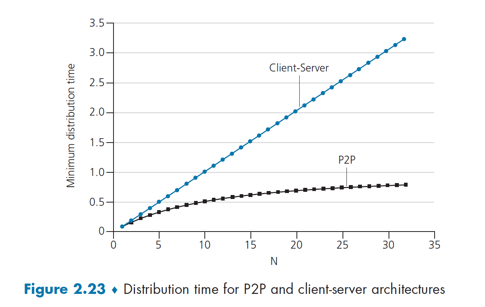

我们从图 2-23 中看到，对于客户-服务器体系结构，随着对等方数量的增加，分发时间呈线性增长并且没有界。然而，对于 P2P 体系结构， 最小分发时间不仅总是小于客户-服务器体系结构的分发时间，并且对于任意的对等方数量 N，总是小于 1 小时。因此，具有 P2P 体系结构的应用程序能够是自扩展的。这种扩展性的直接成因是: 对等方除了是比特的消费者外还是它们的重新分发者。

2. **BitTorrent**

BitTorrent 是一种用于文件分发的流行 P2P 协议[Chao 2011] 。 用 BitTorrent 的术语来讲，参与一个特定文件分发的所有对等方的集合被称为一个**洪流(torrent)**。在一个洪流中的对等方彼此下载等长度的**文件块(chunk)**，典型的块长度为 256KB。当一个对等方首次加入一个洪流时，它没有块。随着时间的流逝，它累积了越来越多的块。当它下载块时，也为其他对等方上载了多个块。一旦某对等方获得了整个文件，它也许（自私地）离开洪流，或（大公无私地）留在该洪流中并继续向其他对等方上载块。同时，任何对等方可能在任何时候仅具有块的子集就离开该洪流，并在以后重新加入该洪流中。

我们现在更为仔细地观察 BitTorrent 运行的过程。因为 BitTorrent 是一个相当复杂的协议，所以我们将仅描述它最重要的机制，而对某些细节视而不见；这将使得我们能够通过树木看森林。每个洪流具有一个基础设施节点，称为**追踪器(tracker)**。当一个对等方加入某洪流时，它向追踪器注册自己，并周期性地通知追踪器它仍在该洪流中。以这种方式，追踪器跟踪参与在洪流中的对等方。一个给定的洪流可能在任何时刻具有数以百计或数以千计的对等方。

如图 2-24 所示，当一个新的对等方 Alice 加入该洪流时，追踪器随机地从参与对等 的集合中选择对等方的一个子集（为了具体起见，设有 50 个对等方），并将这 50 个对等方的 IP 地址发送给 Aliceo Alice 持有对等方的这张列表，试图与该列表上的所有对等方创建并行的 TCP 连接。我们称所有这样与 Alice 成功地创建一个 TCP 连接的对等方为“邻近对等方”（在图 2-23 中，Alice 显示了仅有三个邻近对等方。通常，她应当有更多的对等方）。随着时间的流逝，这些对等方中的某些可能离开，其他对等方（最初 50 个以外的）可能试图与 Alice 创建 TCP 连接。因此一个对等方的邻近对等方将随时间而波动。


在任何给定的时间，每个对等方将具有来自该文件的块的子集，并且不同的对等方具有不同的子集。Alice 周期性地（经 TCP 连接）询问每个邻近对等方它们所具有的块列表。 如果 Alice 具有 L 个不同的邻居，她将获得 L 个块列表。有了这个信息，Alice 将对她当前还没有的块发出请求（仍通过 TCP 连接）。

因此在任何给定的时刻，Alice 将具有块的子集并知道它的邻居具有哪些块。利用这 些信息，Alice 将做出两个重要决定。第一，她应当从她的邻居请求哪些块呢？第二，她应当向哪些向她请求块的邻居发送块？在决定请求哪些块的过程中，Alice 使用一种称为 **最稀缺优先（rarest first）** 的技术。这种技术的思路是，针对她没有的块在她的邻居中决定最稀缺的块（最稀缺的块就是那些在她的邻居中副本数量最少的块），并首先请求那些最稀缺的块。这样，最稀缺块得到更为迅速的重新分发，其目标是（大致地）均衡每个块在洪流中的副本数量。

为了决定她响应哪个请求，BitTorrent 使用了一种机灵的对换算法。其基本想法是，Alice 根据当前能够以最高速率向她提供数据的邻居，给出其优先权。特别是，Alice 对于她的每个邻居都持续地测量接收到比特的速率，并确定以最高速率流入的 4 个邻居。每过 10 秒，她重新计算该速率并可能修改这 4 个对等方的集合。用 BitTorrent 术语来说，这 4 个对等方被称为 **疏通(unchoked)**。重要的是，每过 30 秒，她也要随机地选择另外一个邻居并向其发送块。我们将这个被随机选择的对等方称为 Bob。因为 Alice 正在向 Bob 发送数据，她可能成为 Bob 前 4 位上载者之一，这样的话 Bob 将开始向 Alice 发送数据。如果 Bob 向 Alice 发送数据的速率足够高，Bob 接下来也能成为 Alice 的前 4 位上载者。换言之, 每过 30 秒 Alice 将随机地选择一名新的对换伴侣并开始与那位伴侣进行对换。如果这两名对等方都满足此对换，它们将对方放入其前 4 位列表中并继续与对方进行对换，直到该对 等方之一发现了一个更好的伴侣为止。这种效果是对等方能够以趋向于找到彼此的协调的速率上载。随机选择邻居也允许新的对等方得到块，因此它们能够具有对换的东西。除了这 5 个对等方（“前” 4 个对等方和一个试探的对等方）的所有其他相邻对等方均被“阻塞”，即它们不能从 Alice 接收到任何块。BitTorrent 有一些有趣的机制没有在这里讨论, 包括片（小块）、流水线、随机优先选择、残局模型和反怠慢[Cohen 2003]。

刚刚描述的关于交换的激励机制常被称为“一报还一报”（tit-for-tat） [Cohen 2003]。已证实这种激励方案能被回避[Liogkas 2006; Locher 2006； Piatek 2007]。无论如何,
BitTorrent “生态系统”取得了广泛成功，数以百万计的并发对等方在数十万条洪流中积极地共享文件。如果 BitTorrent 被设计为不采用一报还一报（或一种变种），然而在别的方面却完全相同的协议，BitTorrent 现在将很可能不复存在了，因为大多数用户将成为白嫖者了。[Sarouiu 2002]。

## 2.6. 视频流和内容分发网络(CDN)

据多方估计，流式视频包含 Netflix，Youtube 和 Amazon 占据了 80% 的 Internet 流量[Cisco 2020]。在本节中，我们将对如何在今天的 Internet 中实现流行的视频流服务进行概述。我们将看到它们的实现方式是使用应用层协议和以像高速缓存那样方式运行的服务器。

### 2.6.1. Internet 视频

在流式存储视频应用中，基础的媒体是预先录制的视频，例如电影、电视节目、录制好的体育事件或录制好的用户生成的视频（如通常在 YouTube 上可见的那些）。这些预先录制好的视频放置在服务器上，用户按需向这些服务器发送请求来观看视频。许多 Internet
公司现在提供流式视频，这些公司包括 Netflix、YouTube(谷歌)、Amazon 和抖音(TicTok)。

但在开始讨论视频流之前，我们先迅速感受一下视频媒体自身。视频是一系列的图像， 通常以一种恒定的速率（如每秒 24 或 30 张图像）来展现。一幅未压缩、数字编码的图像由像素阵列组成，其中每个像素是由一些比特编码来表示亮度和颜色。视频的一个重要特征是它能够被压缩，因而可用比特率来权衡视频质量。今天现成的压缩算法能够将一个视频压缩成所希望的任何比特率。当然，比特率越高，图像质量越好，用户的总体视觉感受越好。

从网络的观点看，也许视频最为突出的特征是它的高比特率。压缩的 Internet 视频的比特率范围通常从用于低质量视频的 100kbps,到用于流式高分辨率电影的超过 3Mbps,再到用于 4K 流式展望的超过 10Mbps。这能够转换为巨大的流量和存储，特别是对高端视频。例如，单一 2Mbps 视频在 67 分钟期间将耗费 1GB 的存储和流量。到目前为止，对流式视频的最为重要的性能度量是平均端到端吞吐量。为了提供连续不断的布局，网络必须为流式应用提供平均吞吐量，这个流式应用至少与压缩视频的比特率一样大。

我们也能使用压缩生成相同视频的多个版本，每个版本有不同的质量等级。例如，我们能够使用压缩生成相同视频的 3 个版本，比特率分别为 300kbps、1Mbps 和 3Mbps。用户则能够根据他们当前可用带宽来决定观看哪个版本。具有高速 Internet 连接的用户也许选择 3Mbps 版本，使用智能手机通过 4G 观看视频的用户可能选择 1Mbps 版本。

### 2.6.2. HTTP 流和 DASH

在 HTTP 流中，视频只是存储在 HTTP 服务器中作为一个普通的文件，每个文件有一 个特定的 URL。当用户要看该视频时，客户与服务器创建一个 TCP 连接并发送对该 URL 的 HTTP GET 请求。服务器则以底层网络协议和流量条件允许的尽可能快的速率，在一个 HTTP 响应报文中发送该视频文件。在客户一侧，字节被收集在客户应用缓存中。一旦该缓存中的字节数量超过预先设定的门限，客户应用程序就开始播放，特别是，流式视频应 用程序周期性地从客户应用程序缓存中抓取帧，对这些帧解压缩并且在用户屏幕上展现。 因此，流式视频应用接收到视频就进行播放，同时缓存该视频后面部分的帧。

如前一小节所述，尽管 HTTP 流在实践中已经得到广泛部署(例如，自 YouTube 发展初期开始)，但它具有严重缺陷，即所有客户接收到相同编码的视频，尽管对不同的客户或者对于相同客户的不同时间而言，客户可用的带宽大小有很大不同。这导致了一种新型基于 HTTP 的流的研发，它常常被称为经 HTTP 的 **动态适应性流(Dynamic Adaptive Streaming over HTTP, DASH)**。在 DASH 中，视频编码为几个不同的版本，其中每个版本具有不同的比特率，对应于不同的质量水平。客户动态地请求来自不同版本且长度为几秒的视频段数据块。当可用带宽量较高时，客户自然地选择来自高速率版本的块；当可用带宽量较低时，客户自然地选择来自低速率版本的块。客户用 HTTP GET 请求报文一次选择一个不同的块[Akhshabi 2011]。

DASH 允许客户使用不同的以太网接入速率流式播放具有不同编码速率的视频。使用低速连接的客户能够接收一个低比特率(和低质量)的版本，使用光纤连接的客户能够接收高质量的版本。如果端到端带宽在会话过程中改变的话，DASH 允许客户适应可用带宽。这种特色对于移动用户特别重要，当移动用户相对于基站移动时，通常他们能感受到其可用带宽的波动。

使用 DASH 后，每个视频版本存储在 HTTP 服务器中，每个版本都有一个不同的 URL。HTTP 服务器也有一个 **告示文件(manifest file)**，为每个版本提供了一个 URL 及其比特率。客户首先请求该告示文件并且得知各种各样的版本。然后客户通过在 HTTP GET 请求报文中对每块指定一个 URL 和一个字节范围，一次选择一块。在下载块的同时，客户也测量接收带宽并运行一个速率决定算法来选择下次请求的块。自然地，如果客户缓存 的视频很多，并且测量的接收带宽较高，它将选择一个高速率的版本。同样，如果客户缓存的视频很少，并且测量的接收带宽较低，它将选择一个低速率的版本。因此 DASH 允许客户自由地在不同的质量等级之间切换。

### 2.6.3. 内容分发网络

今天，许多 Internet 视频公司日复一日地向数以百万计的用户按需分发每秒数兆比特的 流。例如，YouTube 的视频库藏有几亿个，每天向全世界的用户分发几亿条流。向位于全世 界的所有用户流式传输所有流量同时提供连续播放和高交互性显然是一项有挑战性的任务。

对于一个 Internet 视频公司，或许提供流式视频服务最为直接的方法是建立单一的大规 模数据中心，在数据中心中存储其所有视频，并直接从该数据中心向世界范围的客户传输 流式视频。但是这种方法存在三个问题。首先，如果客户远离数据中心，服务器到客户的分组将跨越许多通信链路并很可能通过许多 ISP,其中某些 ISP 可能位于不同的大洲。如果这些链路之一提供的吞吐量小于视频消耗速率，端到端吞吐量也将小于该消耗速率，给用户带来恼人的停滞时延。（第 1 章讲过，一条流的端到端吞吐量由瓶颈链路的吞吐量所决定。）出现这种事件的可能性随着端到端路径中链路数量的增加而增加。第二个缺陷是 流行的视频很可能经过相同的通信链路发送许多次。这不仅浪费了网络带宽，Internet 视频公司自己也将为向 Internet 反复发送相同的字节而向其 ISP 运营商（连接到数据中心）支付 费用。这种解决方案的第三个问题是单个数据中心代表一个单点故障，如果数据中心或其 通向 Internet 的链路崩溃，它将不能够分发任何视频流了。

为了应对向分布于全世界的用户分发巨量视频数据的挑战，几乎所有主要的视频流公司都利用 **内容分发网（Content Distribution Network, CDN）**。 CDN 管理分布在多个地理位置上的服务器，在它的服务器中存储视频（和其他类型的 Web 内容，包括文档、图片和音频）的副本，并且所有试图将每个用户请求定向到一个将提供最好的用户体验的 CDN 位 置。CDN 可以是专用 CDN （private CDN），即它由内容提供商自己所拥有；例如，谷歌的 CDN 分发 YouTube 视频和其他类型的内容。另一种 CDN 可以是第三方 CDN （third- party CDN），它代表多个内容提供商分发内容；Akamai, Limelight 和 Level-3 都运行第三方 CDN。现代 CDN 的一个可读性强的展望见[Leighton 2009; Nygren 2010]。

CDN 通常采用两种不同的服务器安置原则［Huang 2008]：

- 深入。第一个原则由 Akamai 首创，该原则是通过在遍及全球的接入 ISP 中部署服 务器集群来深入到 ISP 的接入网中。（在 1.3 节中描述了接入网。）Akamai 在大约 1700 个位置采用这种方法部署集群。其目标是靠近端用户，通过减少端用户和 CDN 集群之间（内容从这里收到）链路和路由器的数量，从而改善了用户感受的时延和吞吐量。因为这种高度分布式设计，维护和管理集群的任务成为挑战。
- 邀请做客。第二个设计原则由 Limelight 和许多其他 CDN 公司所采用，该原则是通过在少量（例如 10 个）关键位置建造大集群来邀请到 ISP 做客。不是将集群放在接入 ISP 中，这些 CDN 通常将它们的集群放置在 Internet 交换点（IXP）。与深入设计原则相比，邀请做客设计通常产生较低的维护和管理开销，可能 以对端用户的较高时延和较低吞吐量为代价。

一旦 CDN 的集群准备就绪，它就可以跨集群复制内容。CDN 可能不希望将每个视频的副本放置在每个集群中，因为某些视频很少观看或仅在某些国家中流行。事实上，许多 CDN 没有将视频推入它们的集群，而是使用一种简单的拉策略：如果客户向一个未存储该视频的集群请求某视频，则该集群检索该视频（从某中心仓库或者从另一个集群），向客户流式传输视频时的同时在本地存储一个副本。类似于代理（参见 2.2.5 节），当某集群存储器变满时，它删除不经常请求的视频。

1. **CDN 操作**

在讨论过这两种部署 CDN 的重要方法后，我们现在深入看看 CDN 操作的细节。当用户主机中的一个浏览器指令检索一个特定的视频（由 URL 标识）时，CDN 必须截获该请 求，以便能够：1.确定此时适合用于该客户的 CDN 服务器集群；2.将客户的请求重定向到该集群的某台服务器。我们很快将讨论 CDN 是如何能够确定一个适当的集群的。但是我们首先考察截获和重定向请求所依赖的机制。

大多数 CDN 利用 DNS 来截获和重定向请求。这种使用 DNS 的一个有趣 讨论见［Vixie2009］。举个例子，假定一个内容提供商 NetCinema，雇佣了第三方 CDN 公司 KingCDN 来向客户分发视频。在 NetCinema 的 Web 网页上，它的每一个视频都被指定了一个 URL，该 URL 包含了 video 和视频的 id 标识符，例如《变形金刚 7》可以被表示为 http://video.netcinema.com/6Y7B23V。接下来的步骤如图2-25所示：

- 用户访问位于 NetCinema 的 Web 网页。
- 当用户点击 http://video.netcinema.com/6Y7B23V 时，该用户发送了一个对 video.netcinema.com 的 DNS 请求。
- 用户的本地 DNS 服务器(LDNS)将该 DNS 请求中继到一台用于 NetCinema 的权威 DNS 服务器，该服务器观察到主机名 video.netcinema.com 中的字符串“video”。为了将该 DNS 请求移交给 KingCDN, NetCinema 权威 DNS 服务器并不返回一个 IP 地址，而是向 LDNS 返回一个 KingCDN 域的主机名，如 a1105.kingcdn.com。
- 从这时起，DNS 请求进入了 KingCDN 专用 DNS 基础设施。用户的 LDNS 则发送第二个请求，此时是对 a1105.kingcdn.com 的 DNS 请求，KingCDN 的 DNS 系统最终向 LDNS 返回 KingCDN 内容服务器的 IP 地址。所以正是在这里，在 KingCDN 的 DNS 系统中，指定了 CDN 服务器.客户将能够从这台服务器接收到它的内容。
- LDNS 向用户主机转发内容服务 CDN 节点的 IP 地址。
- 一旦客户收到 KingCDN 内容服务器的 IP 地址，它与具有该 IP 地址的服务器创建了一条直接的 TCP 连接，并且发出对该视频的 HTTP GET 请求。如果使用了 DASH，服务器将首先向客户发送具有 URL 列表的告示文件，每个 URL 对应视频的每个版本，并且客户将动态地选择来自不同版本的块。

2. **集群选择策略**

任何 CDN 部署，其核心是**集群选择策略(cluster selection strategy)**，即动态地将客户定向到 CDN 中的某个服务器集群或数据中心的机制。如我们刚才所见，经过客户的 DNS 查找，CDN 得知了该客户的 LDNS 服务器的 IP 地址。在得知该 IP 地址之后，CDN 需要基 于该 IP 地址选择一个适当的集群。CDN —般采用专用的集群选择策略。我们现在简单地介绍一些策略，每种策略都有其优点和缺点。

一种简单的策略是指派客户到地理上最为邻近(geographically closest)的集群。使用 商用地理位置数据库(例如 Quova [Quova 2016]和 Max-Mind [MaxMind 2016]),每个 LDNS IP 地址都映射到一个地理位置。当从一个特殊的 LDNS 接收到一个 DNS 请求时,CDN 选择地理上最为接近的集群，即离 LDNS 最少几千米远的集群，“就像鸟飞一样”。这 样的解决方案对于众多用户来说能够工作得相当好[Agarwal 2009]。但对于某些客户，该解决方案可能执行的效果差，因为就网络路径的长度或跳数而言，地理最邻近的集群可能并不是最近的集群。此外，种所有基于 DNS 的方法都内在具有的问题是，某些端用户配置使用位于远地的 LDNS [Shaikh 2001； Mao 2002],在这种情况下，LDNS 位置可能远离客户的位置。此外，这种简单的策略忽略了时延和可用带宽随 Internet 路径时间而变化，总是为特定的客户指派相同的集群。

为了基于当前流量条件为客户决定最好的集群，CDN 能够对其集群和客户之间的时延和丢包性能执行周期性的 **实时测量(real-time measurement)**。 例如，CDN 能够让它的每个集群周期性地向位于全世界的所有 LDNS 发送探测分组(例如，ping 报文或 DNS 请求)。 这种方法的一个缺点是许多 LDNS 被配置为不会响应这些探测。

## 2.7. 套接字编程

**time : 2021-06-04**

我们已经看到了一些重要的网络应用，下面探讨一下网络应用程序是如何实际编写的。在 2.1 节讲过，典型的网络应用是由一对程序（即客户程序和服务器程序）组成的, 它们位于两个不同的端系统中。当运行这两个程序时，创建了一个客户进程和一个服务器 进程，同时它们通过从套接字读出和写入数据在彼此之间进行通信。开发者创建一个网络应用时，其主要任务就是编写客户程序和服务器程序的代码。

网络应用程序有两类。一类是由协议标准（如一个 RFC 或某种其他标准文档）中所定义的操作的实现；这样的应用程序有时称为“开放”的，因为定义其操作的这些规则为 人们所共知。对于这样的实现，客户程序和服务器程序必须遵守由该 RFC 所规定的规则。 例如，某客户程序可能是 HTTP 协议客户端的一种实现，如在 2. 2 节所描述，该协议由 RFC 2616 明确定义；类似地，其服务器程序能够是 HTTP 服务器协议的一种实现，也由 RFC 2616 明确定义。如果一个开发者编写客户程序的代码，另一个开发者编写服务器程序的代码，并且两者都完全遵从该 RFC 的各种规则，那么这两个程序将能够交互操作。 实际上，今天许多网络应用程序涉及客户和服务器程序间的通信，这些程序都是由独立的 程序员开发的。例如，谷歌 Chrome 浏览器与 Apache Web 服务器通信，BitTorrent 客户与 BitTorrent 跟踪器通信。

另一类网络应用程序是专用的网络应用程序。在这种情况下，由客户和服务器程序应用的应用层协议没有公开发布在某 RFC 中或其他地方。某单独的开发者（或开发团队） 产生了客户和服务器程序，并且该开发者用他的代码完全控制该代码的功能。但是因为这些代码并没有实现一个开放的协议，其他独立的开发者将不能开发出和该应用程序交互的代码。

在本节中，我们将考察研发一个客户-服务器应用程序中的关键问题，我们将“亲力亲为”来实现一个非常简单的客户-服务器应用程序代码。在研发阶段，开发者必须 最先做的一个决定是，应用程序是运行在 TCP 还是运行在 UDP 上。前面讲过 TCP 是面向连接的，并且为两个端系统之间的数据流动提供可靠的字节流通道。UDP 是无连接的，从一个端系统向另一个端系统发送独立的数据分组，不对交付提供任何保证。前面也讲过当客户或服务器程序实现了一个由某 RFC 定义的协议时，它应当使用与该协议 关联的周知端口号；与之相反，当研发一个专用应用程序时，研发者必须注意避免使用这些周知端口号。（端口号已在 2.1 节简要讨论过。它们将在第 3 章中更为详细地涉及。）

我们通过一个简单的 UDP 应用程序和一个简单的 TCP 应用程序来介绍 UDP 和 TCP 套接字编程。我们用 Python 3 来呈现这些简单的 TCP 和 UDP 程序。也可以用 Java、C 或 C++来编写这些程序，而我们选择用 Python 最主要原因是 Python 清楚地揭示了关键的套接字概念。使用 Python,代码的行数更少，并且向新编程人员解释每一行代码不会有困难。如果你不熟悉 Python,也用不着担心，只要你有过一些用 Java. C 或 C++编程的经验，就应该很容易看懂下面的代码。

如果读者对用 java 进行客户-服务器编程感兴趣，建议你去查看与本书配套的 Web 网站。事实上，能够在那里找到用 Java 编写的本节中的所有例子（和相关的实验）。如 果读者对用 C 进行客户-服务器编程感兴趣，有一些优秀参考资料可供使用[Donah 2001 ； Stevens 1997； Frost 1994 ； Kurose 1996 ]。 我们 面的 Python 例子具有类似于 C 的外观和感觉。

### 2.7.1. UDP 套接字编程

在本小节中，我们将编写使用 UDP 的简单客户-服务器程序；在下一小节中，我们 将编写使用 TCP 的简单程序。

2.1 节讲过，运行在不同机器上的进程彼此通过向套接字发送报文来进行通信。我们说过每个进程好比是一座房子，该进程的套接字则好比是一扇门。应用程序位于房子中门的一侧；运输层位于该门朝外的另一侧。应用程序开发者在套接字的应用层一侧可以控制 所有东西；然而，它几乎无法控制运输层一侧。

现在我们仔细观察使用 UDP 套接字的两个通信进程之间的交互。在发送进程能够将 数据分组推出套接字之门之前，当使用 UDP 时，必须先将目的地址附在该分组之上。在 该分组传过发送方的套接字之后，Internet 将使用该目的地址通过 Internet 为该分组选路到接收进程的套接字。当分组到达接收套接字时，接收进程将通过该套接字取回分组，然后检查分组的内容并采取适当的动作。

因此你可能现在想知道，附在分组上的目的地址包含了什么？如你所期待的那样，目的主机的 IP 地址是目的地址的一部分。通过在分组中包括目的地的 IP 地址，Internet 中的路由器将能够通过 Internet 将分组选路到目的主机。但是因为一台主机可能运行许多网络应用进程，每个进程具有一个或多个套接字，所以在目的主机指定特定的套接字也是必要的。当生成一个套接字时，就为它分配一个称为 **端口号(port number)** 的标识符。因此, 如你所期待的，分组的目的地址也包括该套接字的端口号。总的来说，发送进程为分组附上目的地址，该目的地址是由目的主机的 IP 地址和目的地套接字的端口号组成的。此外, 如我们很快将看到的那样，发送方的源地址也是由源主机的 IP 地址和源套接字的端口号组成，该源地址也要附在分组之上。然而，将源地址附在分组之上通常并不是由 UDP 应用程序代码所为，而是由底层操作系统自动完成的。

我们将使用下列简单的客户-服务器应用程序来演示对于 UDP 和 TCP 的套接字编程:

1. 客户从其键盘读取一行字符(数据)并将该数据向服务器发送。
2. 服务器接收该数据并将这些字符转换为大写。
3. 服务器将修改的数据发送给客户。
4. 客户接收修改的数据并在其监视器上将该行显示出来。

图 2-27 着重显示了客户和服务器的主要与套接字相关的活动，两者通过 UDP 运输服务进行通信。


现在我们自己动手来查看用 UDP 实现这个简单应用程序的一对客户-服务器程序。 我们在每个程序后也提供一个详细、逐行的分析。我们将以 UDP 客户开始，该程序将向 服务器发送一个简单的应用级报文。服务器为了能够接收并回答该客户的报文，它必须准备好并已经在运行，这就是说，在客户发送其报文之前，服务器必须作为一个进程正在运行。

客户程序被称为 UDPClient.py,服务器程序被称为 UDPServer.py。 为了强调关键问题，我们有意提供最少的代码。“好代码”无疑将具有更多辅助性的代码行，特别是用于处理岀现差错的情况。对于本应用程序，我们任意选择了 12000 作为服务器的端口号。

1. **UDPClient.py**

下面是该应用程序客户端的代码：

```py
from socket import *

serverName = 'localhost' # 服务器为本地主机

serverPort = 12000 # 端口号

clientSocket = socket(AF_INET, SOCK_DGRAM) # 新建 UDP 客户套接字

message = input('输入一个全是小写的句子：')

clientSocket.sendto(message.encode(), (serverName, serverPort)) # 发送消息

rcvMessage, serverAddress = clientSocket.recvfrom(2048)

print(rcvMessage.decode ())

clientSocket.close()
```

2. **UDPServer.py**

```py
from socket import *

serverPort = 12000 # 服务端端口

serverSocket = socket(AF_INET, SOCK_DGRAM) # 新建 UDP socket

serverSocket.bind(('', serverPort)) # 绑定 12000 端口

print('服务器已经准备好接收了！')

while True:
  rcvMessage, clientAddress = serverSocket.recvfrom(2048) # 储存客户端发来的信息

  sendMessage  = rcvMessage.decode().upper() # 大写信息

  serverSocket.sendto(sendMessage.encode(), clientAddress) # 发送信息
```

在运行时，先启动 UDP 服务器程序：


然后启动 UDP 客户程序，输入一个小写的句子：


### 2.7.2. TCP 套接字编程

与 UDP 不同，TCP 是一个面向连接的协议。这意味着在客户和服务器能够开始互相发送数据之前，它们先要握手和创建一个 TCP 连接。TCP 连接的一端与客户套接字相联系，另一端与服务器套接字相联系。当创建该 TCP 连接时，我们将其与客户套接字地址 （ IP 地址和端口号）和服务器套接字地址（IP 地址和端口号）关联起来。使用创建的 TCP 连接，当一侧要向另一侧发送数据时，它只需经过其套接字将数据丢进 TCP 连接。这与 UDP 不同，UDP 服务器在将分组丢进套接字之前必须为其附上一个目的地地址。

现在我们仔细观察一下 TCP 中客户程序和服务器程序的交互。客户具有向服务器发起 接触的任务。服务器为了能够对客户的初始接触做岀反应，服务器必须已经准备好。这意味着两件事。第一，与在 UDP 中的情况一样，TCP 服务器在客户试图发起接触前必须作为进程运行起来。第二，服务器程序必须具有一扇特殊的门，更精确地说是一个特殊的套接字，该门欢迎来自运行在任意主机上的客户进程的某种初始接触。使用房子与门来比喻进程与套接字，有时我们将客户的初始接触称为“敲欢迎之门”。

随着服务器进程的运行，客户进程能够向服务器发起一个 TCP 连接。这是由客户程序通过创建一个 TCP 套接字完成的。当该客户生成其 TCP 套接字时，它指定了服务器中的欢迎套接字的地址，即服务器主机的 IP 地址及其套接字的端口号。生成其套接字后，该客户发起了一个三次握手并创建与服务器的一个 TCP 连接。发生在运输层的三次握手，对于客户和服务器程序是完全透明的。

在三次握手期间，客户进程敲服务器进程的欢迎之门。当该服务器“听”到敲门声时，它将生成一扇新门（更精确地讲是一个新套接字），它专门用于特定的客户。在我们下面的例子中，欢迎之门是一个我们称为 serverSocket 的 TCP 套接字对象；它是专门对客户进行连接的新生成的套接字，称为 **连接套接字（cormectionSocket）**。初次遇到 TCP 套接字的学生有时会混淆欢迎套接字（这是所有要与服务器通信的客户的起始接触点）和每个新生成的服务器侧的连接套接字（这是随后为与每个客户通信而生成的套接字）。

从应用程序的观点来看，客户套接字和服务器连接套接字直接通过一根管道连接。如图 2-28 所示，客户进程可以向它的套接字发送任意字节，并且 TCP 保证服务器进程能够按发送的顺序接收（通过连接套接字）每个字节。TCP 因此在客户和服务器进程之间提供了可靠服务。此外，就像人们可以从同一扇门进和出一样，客户进程不仅能向它的套接字发送字节，也能从中接收字节；类似地，服务器进程不仅从它的连接套接字接收字节，也能向其发送字节。

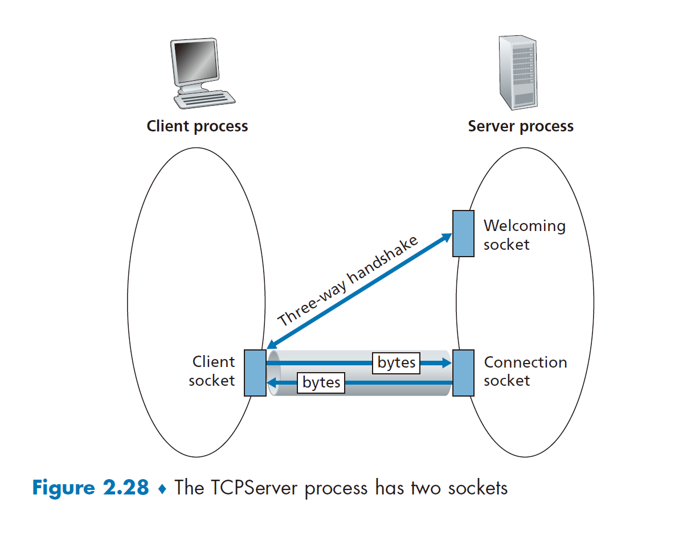

我们使用同样简单的客户-服务器 应用程序来展示 TCP 套接字编程：客主机进程服务器进程图 2-28 TCPServer 进程有两个套接字户向服务器发送一行数据，服务器将这行改为大写并回送给客户。图 2-29 着重显示了客户和服务器的主要与套接字相关的活动,两者通过 TCP 运输服务进行通信。


1. **TCPClient.py**

```py
from socket import *

serverName = 'localhost'

serverPort = 12000

clientSocket = socket(AF_INET, SOCK_STREAM) # 新建客户TCP套接字

clientSocket.connect((serverName, serverPort)) # 连接服务端套接字

sentence = input('输入一个全是小写的句子：')

clientSocket.send(sentence.encode())

rcvSentence = clientSocket.recv(1024)

print('来自服务器的消息：', rcvSentence.decode())

clientSocket.close()
```

2. **TCPServer.py**

```py
from socket import *

serverPort = 12000

serverSocket = socket(AF_INET, SOCK_STREAM)

serverSocket.bind(('', serverPort))

serverSocket.listen(1)

print('服务器已经准备好接收了！')

while True:
    connectionSocket, addr = serverSocket.accept()
    sentenceInput = connectionSocket.recv(1024).decode()
    sentenceOutput = sentenceInput.upper()
    connectionSocket.send(sentenceOutput.encode())
    connectionSocket.close()
```

在运行时，先启动 TCP 服务器程序：


然后启动 TCP 客户程序，输入一个小写的句子：


我们现在完成了 TCP 套接字编程的讨论。
你应当将前面两个 UDP 程序与这两个 TCP 程序进行比较，观察它们的不同之处。

## 2.8. 实验 2：编写简单的 Web 服务器

在本次实验中，你将用 Python 语言开发一个简单的 Web 服务器，它仅能处理一个请求。你的 Web 服务器将：1. 当一个客户（浏览器）联系时创建一个连接套接字；2. 从这个连接接收 HTTP 请求；3. 解释该请求以确定所请求的特定文件；4. 从服务器的文件系统获得请求的文件; 5. 创建一个由请求的文件组成的 HTTP 响应报文，报文前面有首部行；6. 经 TCP 连接向请求的浏览器发送响应。如果浏览器请求一个在该服务器中不存在的文件，服务器应当返回一个“404 Not Found”差错报文。

我们提供了这个 Web 服务器程序的一些关键代码，你所做的事情就是将他们补全。需要补全的位置，我们用 `# 开始补全` 和 `# 结束补全` 标出。

这是我们提供的代码，你可以在目录 `socket_programming/web_server/` 下找到 OrignWebServer.py

### 2.8.1. OrignWebServer.py

```py
from socket import * # 导入 socket 模块
import sys # 为了退出服务器程序

serverSocket = socket(AF_INET, SOCK_STREAM)
# 准备一个欢迎套接字
# 开始补全
# 结束补全

statusLineFor200 = 'HTTP/1.1 200 OK\n' # 构造 HTTP 响应报文中请求成功状态行
statusLineFor404 = # 开始补全 # 结束补全 # 构造 HTTP 响应报文中找不到请求对象状态行
newLine = '\n' # 空行

while True:
    print('服务器已启动！\n')
    connectionSocket, addr = # 开始补全 # 结束补全 # 建立连接
    try:
        message = # 开始补全 # 结束补全
        filename = message.split()[1] # 使用空格将 HTTP 请求报文分隔，并提取出请求对象 URL
        print('请求行：' + message.split('\n')[0] + '\n') # 打印出 HTTP 请求报文中的请求行
        content = open(filename[1:]).read() # 读取文件，构造 HTTP 响应报文实体体
        outputdata = # 开始补全 # 结束补全 # 构造 HTTP 响应报文
        print('HTTP响应报文：' + outputdata + '\n')
        connectionSocket.send(outputdata.encode())
        connectionSocket.close()
        print('连接已关闭！\n')

    except IOError:
        notFound = statusLineFor404 + newLine + open('404.html').read() # 构造 HTTP 响应报文
        print('HTTP响应报文：' + notFound + '\n')
         # 开始补全 # 结束补全 # 发送 404 响应报文
        # 开始补全 # 结束补全 # 关闭连接
        print('连接已关闭！\n')

    serverSocket.close() # 关闭欢迎套接字
    print('服务器已关闭！\n')
    sys.exit() # 退出控制台
```

下面我们给出这个代码的补全，你可以在目录 `socket_programming/web_server/` 下找到 WebServer.py

### 2.8.2. WebServer.py

```py
from socket import * # 导入 socket 模块
import sys  # 为了退出服务器程序

serverSocket = socket(AF_INET, SOCK_STREAM)
# 准备一个欢迎套接字
serverSocket.bind(('', 6789))
serverSocket.listen(1)

statusLineFor200 = 'HTTP/1.1 200 OK\n' # 构造 HTTP 响应报文中请求成功状态行
statusLineFor404 = 'HTTP/1.1 404 Not Found\n' # 构造 HTTP 响应报文中找不到请求对象状态行
newLine = '\n' # 空行

while True:
    print('服务器已启动！\n')
    connectionSocket, addr = serverSocket.accept() # 建立连接
    try:
        message =  connectionSocket.recv(1024).decode()
        filename = message.split()[1] # 使用空格将 HTTP 请求报文分隔，并提取出请求对象 URL
        print('请求行：' + message.split('\n')[0] + '\n') # 打印出 HTTP 请求报文中的请求行
        content = open(filename[1:]).read() # 读取文件，构造 HTTP 响应报文实体体
        outputdata = statusLineFor200 + newLine + content # 构造 HTTP 响应报文
        print('HTTP响应报文：' + outputdata + '\n')
        connectionSocket.send(outputdata.encode())
        connectionSocket.close()
        print('连接已关闭！\n')

    except IOError:
        notFound = statusLineFor404 + newLine + open('404.html').read() # 构造 HTTP 响应报文
        print('HTTP响应报文：' + notFound + '\n')
        connectionSocket.send(notFound.encode()) # 发送 404 响应报文
        connectionSocket.close() # 关闭连接
        print('连接已关闭！\n')

    serverSocket.close() # 关闭欢迎套接字
    print('服务器已关闭！\n')
    sys.exit() # 退出控制台
```

### 2.8.3. 运行 Web 服务器

在 WebServer.py 的同一个目录下面，放入 2 个 HTML 文件，其中将 404 文件命名为“404”。你可以在目录 `socket_programming/web_server/` 下找到我们提供的 2 个 HTML 文件。

首先运行我们的 WebServer.py 程序：


不要关闭服务器程序，在浏览器中访问 `http://localhost:6789/HelloWorld.html`。你将会看到下面的结果：

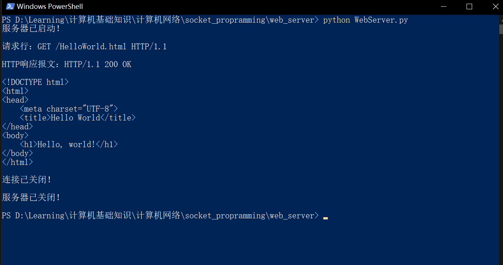


最后，可以测试我们编写的 404 页面是否起效了。在浏览器中访问 `http://localhost:6789/somethingelse.html`。你可以不必遵循我们的命名，随便什么都可以，只要不是 HelloWorld.html。你将会看到下面的结果：


## 2.9. 实验 3：用 wireshark 观察 HTTP

在上一个 wireshark 实验中，我们已经熟悉了 wireshark 的基本操作。在这一次实验中，我们会更为深入地通过 wireshark 理解 HTTP。这一次实验的主要内容有：基本的 GET 请求及对应的响应交互活动，HTTP 报文格式，获取长的 HTML 文档，等等。

### 2.9.1. 基本的 GET 请求及对应的响应交互

执行以下的步骤：

1. 启动你的浏览器和 wireshark
2. 在 wireshark 中开始捕获
3. 在浏览器中键入 http://gaia.cs.umass.edu/wireshark-labs/HTTP-wireshark-file1.html ，等待网页加载结束
4. 停止捕获

你会看到下图的情况：


观察 GET 请求报文和对应的响应报文，回答以下问题：

1.  你的浏览器运行的 HTTP 版本时多少？服务器运行的 HTTP 版本时多少？
    HTTP 1.1，HTTP 1.1
2.  浏览器指出它接收的回应的语言是什么？
    英文和中文
3.  你电脑的 IP 地址是多少？服务器的 IP 地址是多少？
    192.168.43.27，128.119.245.12
4.  响应报文的状态码是多少？
    200
5.  这个 HTML 文件上一次的修改时间是多少？
    Wed, 19 May 2021 10:46:22 GMT
6.  多少个字节的内容被返回给你的浏览器？
    128

---

### 2.9.2. 条件 GET 请求报文及对应的响应报文交互

继续上一次实验，重新加载网页。

你会看到下图的情况：


1. 观察第 1 次和第 2 次请求报文的首部行里是否有 `IF-MODIFIED-SINCE`
   第 1 次没有，第 2 次有
2. 观察第 2 次响应报文中的实体体是否有内容
   没有内容
3. 观察第 2 次响应报文的状态码
   第 2 次响应的状态码为 304 Not Modified

---

### 2.9.3. 获取长的文档

截至到目前的实验，获取到的文档是简单，短小的。这次让我们看看请求对象为长的文档的时候，会发生什么？

执行以下步骤：

1. 启动浏览器和 wireshark
2. 在 wireshark 中开始捕获
3. 在浏览器中键入 http://gaia.cs.umass.edu/wireshark-labs/HTTP-wireshark-file3.html ，浏览器会显示很长的 《THE BILL OF RIGHTS》
4. 停止 wireshark 捕获

如下图所示。在分组信息列表你可以看到 GET 请求后面跟有一个多分组 TCP 回应。这是因为响应报文的实体体过长，不能全部放置一个 TCP 分组中。单个的 HTTP 响应报文会被 TCP 分成若干个部分，每个部分被包含在一个独立的 TCP 报文段中。


回答以下问题：

1. 哪些帧携带了 HTTP 响应报文？
   1092, 1093, 1095, 1096
2. 哪个帧携带了 HTTP 响应状态行？
   1096
3. 多少个 TCP 报文段完成了 HTTP 响应报文？
   4 个

---

### 2.9.4. 嵌入对象的 HTML 文档

现在我们来请求带有引用对象(图片，脚本等等)的 HTML 文档。

执行以下步骤：

1. 启动你的浏览器，清除浏览器缓存。启动 wireshark，开始捕获。
2. 在浏览器中键入 http://gaia.cs.umass.edu/wireshark-labs/HTTP-wireshark-file4.html ，你的浏览器将会展示一个带有 2 张图片的 HTML 文档。如下图所示。
3. 停止捕获，在过滤框中键入 http。


wireshark 捕获结果如下：


回答以下问题：

1. 你的浏览器发出了多少个 GET 请求？每次请求对应的 IP 地址是多少？
   4 个，第 1 次请求：128.119.245.12， 第 2 次请求：128.119.245.12，第 3 次请求：178.79.137.164，第 4 次请求：128.119.245.12。

## 2.10. 实验 4：用 wireshark 观察 DNS

这次实验之前，你可以复习我们在第 2.4 节讲过的内容。

### 2.10.1. nslookup

windows cmd 提供了 nslookup 命令。nslookup 命令可以向任何一个特定的 DNS 服务器查询 DNS 记录。查询的 DNS 服务器可以是一个根 DNS 服务器，一个顶级域 DNS 服务器，一个权威 DNS 服务器。


上图显示了 3 个独立的 nslookup 命令。当不提供一个具体的 NDS 服务器的时候。nslookup 命令使用默认的本地 DNS 服务器。

考虑第一条命令：

```bat
nslookup www.tsinghua.edu.cn
```

这个命令查询的是 www.tsinghua.edu.cn 的 IP 地址。
截图的回应显示出了：1. 提供结果的服务器名称和 IP 地址 2. 要查询的服务器名称和 IP 地址，这里的 IP 地址以 IPv4 和 IPv6 显示。

考虑第 2 条命令：

```bat
nslookup -type=NS tsinghua.edu.cn
```

这个命令多出了一个选项 `-type=NS`，这相当于查询域 tsinghua.edu.cn 的权威服务器的主机名。

截图显示出了 4 个权威服务器的主机名。

考虑第 3 条命令：

```bat
nslookup www.tsinghua.edu.cn dns.tsinghua.edu.cn
```

这里具体指定了要发出查询的 DNS 服务器，而不是默认的本地 DNS 服务器。
截图显示出了由 dns.tsinghua.edu.cn 回答的 www.tsinghua.edu.cn 的 IP 地址。

nslookup 的语法格式为：

```bat
nslookup -option1? -option2? 要查找的主机名 指定的DNS服务器?
```

带着问号的选项为可选。

### 2.10.2. ipconfig

ipconfig 是 windows cmd 提供的最有用的命令之一。ipconfig 用来显示你当前的 TCP/IP 信息，包括你的 IP 地址，DNS 服务器地址，设配器类型等。如果你想获取所有这些信息，键入以下命令：

```bat
ipconfig /all
```

键入以下命令可以获取本机缓存的 DNS 资源记录：

```bat
ipconfig /displaydns
```

键入以下命令以清除本机的 DNS 记录缓存：

```bat
ipconfig /flushdns
```

### 2.10.3. 用 wireshark 跟踪 DNS 解析

现在我们已经熟悉了 nslookup 和 ipconfig 命令。现在我们来捕获由 web 冲浪生成的 DNS 分组。

执行以下步骤:

1. 使用 `ipconfig /flushdns` 清空本地 DNS 缓存
2. 启动浏览器，并清除缓存
3. 打开 wirehark，在过滤框中输入 `ip.addr == your_ip_address`，你可以使用 ipconfig 查看本机的 ip 地址。这个过滤掉了发送端和接收端不是你的 ip 地址的分组
4. 在 wireshark 中启动捕获
5. 在浏览器中访问 http://www.ietf.org
6. 停止捕获

回答以下问题：

1. 定位查询和响应报文，它们是通过 UDP 还是 TCP 发送的？
   UDP
2. DNS 查询报文的目的地端口是多少？DNS 响应报文的源端口是多少？
   53， 53
3. DNS 查询报文发送给哪个 IP 地址了？使用 ipconfig 确定你本地 DNS 服务器。两个 ip 地址相同吗？
   192.168.43.27，相同
4. 查看 DNS 查询报文。这个 DNS 查询报文的类型是什么？
   A
5. 查看 DNS 响应报文。它提供了多少“答案”？每一个答案包含了什么？
   3 个，分别如下：
   - www.ietf.org: type CNAME, class IN, cname www.ietf.org.cdn.cloudflare.net
   - www.ietf.org.cdn.cloudflare.net: type A, class IN, addr 104.16.44.99
   - www.ietf.org.cdn.cloudflare.net: type A, class IN, addr 104.16.45.99

现在，我们来用 nslookup 实验一下。

执行以下步骤：

1. 开始捕获
2. 在一个 cmd 键入 nslookup www.tsinghua.edu.cn
3. 停止捕获

结果如下图所示：


回答以下问题：

1. DNS 查询报文发送给哪个 IP 地址了？确定是你的本地 DNS 服务器吗？
   192.168.43.27，是
2. 查看 DNS 查询报文。这个 DNS 查询报文的类型是什么？
   A
3. 查看 DNS 响应报文。它提供了多少“答案”？每一个答案包含了什么？
   1 个，如下所示：
   - www.tsinghua.edu.cn: type A, class IN, addr 166.111.4.100

现在重复 `nslookup -type=NS tsinghua.edu.cn` 命令实验。

结果如下图所示：


回答以下问题：

1.  DNS 查询报文发送给哪个 IP 地址了？确定是你的本地 DNS 服务器吗？
    192.168.43.27，是
2.  查看 DNS 查询报文。这个 DNS 查询报文的类型是什么？
    NS
3.  查看 DNS 响应报文。它提供的 tsinghua.edu.cn 的权威服务器是什么？
    如下所示：
    - tsinghua.edu.cn: type NS, class IN, ns ns2.cuhk.hk
    - tsinghua.edu.cn: type NS, class IN, ns dns2.edu.cn
    - tsinghua.edu.cn: type NS, class IN, ns dns2.tsinghua.edu.cn
    - tsinghua.edu.cn: type NS, class IN, ns dns.tsinghua.edu.cn

现在重复 `nslookup www.tsinghua.edu.cn dns.tsinghua.edu.cn` 命令实验。

![2-36-nslookup捕获截图3]

回答以下问题：

1. DNS 查询报文发送给哪个 IP 地址了？确定是你的本地 DNS 服务器吗？如果不是，那么是哪个 DNS 服务器？
   166.111.8.30，dns.tsinghua.edu.cn
2. 查看 DNS 查询报文。这个 DNS 查询报文的类型是什么？
   A
3. 查看 DNS 响应报文。它提供了多少“答案”？每一个答案包含了什么？
   1 个，如下：
   - www.tsinghua.edu.cn: type A, class IN, addr 166.111.4.100

# 3. 运输层

**time : 2021-05-23**
**3 section/day**

运输层位于网络层和应用层之间。运输层负责在不同端系统上应用程序进程间的通信。在本章我们深入讨论 TCP 和 UDP 协议。

## 3.1. 概述和运输层提供的服务

在前两章中，我们已经了解过运输层提供的服务，现在回顾一下。

运输层协议为运行在不同主机上的应用进程之间提供 **逻辑通信(logic communication)** 功能。从应用程序的角度看，通过逻辑通信，运行在不同主机上的应用进程好像直接相连一样。实际上，这些主机也许位于地球的两侧，通过很多路由器及多种不同类型的链路相连。应用进程使用运输层提供的逻辑通信功能彼此发送报文，而不必考虑承载这些报文的设施的细节。

如图 3-1 所示，运输层协议是在端系统而不是在路由器中实现的。在发送端，运输层将从发送应用程序进程接收到的报文转换成运输层分组，用 Internet 术语来讲该分组称为运输层 **报文段(segment)** 。实现的方法（可能）是将应用报文划分为较小的块，并为每块加上一个运输层首部以生成运输层报文段。然后，在发送端系统中，运输层将这些报文段传递给网络层，网路层将其封装成网络层分组（即数据报）并向目的地发送。注意到下列事实是重要的：网络路由器仅作用于该数据报的网络层字段；即它们不检查封装在该数据报的运输层报文段的字段。在接收端，网络层从数据报中提取运输层报文段，并将该报文段向上交给运输层。运输层则处理接收到的报文段，使该报文段中的数据为接收应用进程使用。


网络应用程序可以使用多种的运输层协议。例如，Internet 有两种协议，即 TCP 和 UDP。每种协议都能为调用的应用程序提供一组不同的运输层服务。

### 3.1.1. 运输层和网络层的关系

前面讲过，在协议栈中，运输层刚好位于网络层之上。网络层提供了主机之间的逻辑通信，而运输层为运行在不同主机上的进程之间提供了逻辑通信。这种差别虽然细微但很重要。我们用一个家庭类比来帮助分析这种差别。

考虑有两个家庭，一家位于美国东海岸，一家位于美国西海岸，每家有 12 个孩子。 东海岸家庭的孩子们是西海岸家庭孩子们的堂兄弟姐妹。这两个家庭的孩子们喜欢彼此通信，每个人每星期要互相写一封信，每封信都用单独的信封通过传统的邮政服务传送。因此，每个家庭每星期向另一家发送 144 封信。（如果他们有电子邮件的话，这些孩子可以省不少钱！）每一个家庭有个孩子负责收发邮件，西海岸家庭是 Ann 而东海岸家庭是 Bill。 每星期 Ann 去她的所有兄弟姐妹那里收集信件，并将这些信件交到每天到家门口来的邮政服务的邮车上。当信件到达西海岸家庭时，Ann 也负责将信件分发到她的兄弟姐妹手上。 在东海岸家庭中的 Bill 也负责类似的工作。

在这个例子中，邮政服务为两个家庭间提供逻辑通信，邮政服务将信件从一家送往另 一家，而不是从一个人送往另一个人。在另一方面，Ann 和 Bill 为堂兄弟姐妹之间提供了 逻辑通信，Arm 和 Bill 从兄弟姐妹那里收取信件或到兄弟姐妹那里交付信件。注意到从堂 兄弟姐妹们的角度来看，Ann 和 Bill 就是邮件服务，尽管他们只是端到端交付过程的一部分（即端系统部分）。在解释运输层和网络层之间的关系时，这个家庭的例子是一个非常好的类比。

```
应用层报文=信封上的字符
进程 = 堂兄弟姐妹
主机（又称为端系统）= 家庭
运输层协议 = Ann和Bill
网络层协议 = 邮政服务（包括邮车）
```

我们继续观察这个类比。值得注意的是，Ann 和 Bill 都是在各自家里进行工作的；例如，他们并没有参与任何一个中间邮件中心对邮件进行分拣，或者将邮件从一个邮件中心送到另一个邮件中心之类的工作。类似地，运输层协议只工作在端系统中。在端系统中，运输层协议将来自应用进程的报文移动到网络边缘（即网络层），反过来也是一样，但对有关这些报文在网络核心如何移动并不作任何规定。事实上，如图 3-1 所示，中间路由器既不处理也不识别运输层加在应用层报文的任何信息。

我们还是继续讨论这两家的情况。现在假定 Ann 和 Bill 外出度假，另外一对堂兄妹 （如 Susan 和 Harvey）接替他们的工作，在家庭内部进行信件的收集和交付工作。不幸的是，Susan 和 Harvey 的收集和交付工作与 Ann 和 Bill 所做的并不完全一样。由于年龄更小，Susan 和 Harvey 收发邮件的次数更少，而且偶尔还会丢失邮件（有时是被家里的狗咬坏了）。因此，Susan 和 Harvey 这对堂兄妹并没有提供与 Ann 和 Bill 一样的服务集合（即相同的服务模型）。与此类似，计算机网络中可以安排多种运输层协议，每种协议为应用程序提供不同的服务模型。

Ann 和 Bill 所能提供的服务明显受制于邮政服务所能提供的服务。例如，如果邮政服务不能提供在两家之间传递邮件所需时间的最长期限（例如 3 天），那么 Ann 和 Bill 就不可能保证邮件在堂兄弟姐妹之间传递信件的最长期限。与此类似，运输协议能够提供的服务常常受制于底层网络层协议的服务模型。如果网络层协议无法为主机之间发送的运输层报文段提供时延或带宽保证的话，运输层协议也就无法为进程之间发送的应用程序报文提供时延或带宽保证。

然而，即使底层网络协议不能在网络层提供相应的服务，运输层协议也能提供某些服务。例如，如我们将在本章所见，即使底层网络协议是不可靠的，也就是说网络层协议会使分组丢失、篡改和冗余，运输协议也能为应用程序提供可靠的数据传输服务。另一个例子是（我们在第 8 章讨论网络安全时将会研究到），即使网络层不能保证运输层报文段的机密性，运输协议也能使用加密来确保应用程序报文不被入侵者读取。

### 3.1.2. Internet 运输层概述

前面讲过 Internet 为应用层提供了两种截然不同的可用运输层协议。这些协议一种是 UDP（用户数据报协议），它为调用它的应用程序提供了一种不可靠、无连接的服务。另一种是 TCP （传输控制协议），它为调用它的应用程序提供了一种可靠的、面向连接的服务。当设计一个网络应用程序时，该应用程序的开发人员必须指定使用这两种运输协议中的哪一种。如我们在 2-7 节看到的那样，应用程序开发人员在生成套接字时必须指定是选择 UDP 还是选择 TCP。

为了简化术语，我们将运输层分组称为报文段(segment)。然而，Internet 文献(如 RFC 文档)也将 TCP 的运输层分组称为报文段，而常将 UDP 的分组称为数据报(data-gram)。而这类 Internet 文献也将网络层分组称为数据报！本书作为一本计算机网络的入门书籍，我们认为将 TCP 和 UDP 的分组统称为报文段，而将数据报名称保留给网络层分组不容易混淆。

在对 UDP 和 TCP 进行简要介绍之前，简单介绍一下 Internet 的网络层(我们将在第 4 和 5 章中详细地学习网络层)是有用的。Internet 网络层协议有一个名字叫 IP，即网际协议。IP 为主机之间提供了逻辑通信。IP 的服务模型是 **尽力而为交付服务(best-effort delivery service)** 。 这意味着 IP 尽它“最大的努力”在通信的主机之间交付报文段，但它并不做任何确保。特别是，它不确保报文段的交付，不保证报文段的按序交付，不保证报文段中数据的完整性。由于这些原因，IP 被称为 **不可靠服务(unreliable service)**。在此还要指出的是, 每台主机至少有一个网络层地址，即所谓的 IP 地址。我们在第 4 和 5 章将详细讨论 IP 地 址；在这一章中，我们只需要记住每台主机有一个 IP 地址

在对 IP 服务模型有了初步了解后，我们总结一下 UDP 和 TCP 所提供的服务模型。 UDP 和 TCP 最基本的责任是，将两个端系统间 IP 的交付服务扩展为运行在端系统上的两个进程之间的交付服务。将主机间交付扩展到进程间交付被称为 **运输层的多路复用 (transport-layer multiplexing)** 与 **多路分解(demultiplexing)**。 我们将在下一节讨论运输层的多路复用与多路分解。UDP 和 TCP 还可以通过在其报文段首部中包括差错检查字段而提供完整性检查。进程到进程的数据交付和差错检查是两种最低限度的运输层服务，也是 UDP 所能提供的仅有的两种服务。特别是，与 IP 一样，UDP 也是一种不可靠的服务，即不能保证一个进程所发送的数据能够完整无缺地(或全部！)到达目的进程。在 3-3 节中将更详细地讨论 UDP。

另一方面，TCP 为应用程序提供了几种附加服务。首先，它提供 **可靠数据传输(reliable data transfer)**。通过使用流量控制、序号、确认和定时器(本章将详细介绍这些技术)， TCP 确保正确地、按序地将数据从发送进程交付给接收进程。这样，TCP 就将两个端系统间的不可靠 IP 服务转换成了一种进程间的可靠数据传输服务。TCP 还提供 **拥塞控制(congestion control)**。拥塞控制与其说是一种提供给调用它的应用程序的服务，不如说是一种提供给整个 Internet 的服务，这是一种带来通用好处的服务。不太严格地说，TCP 拥塞控制防止任何一条 TCP 连接用过多流量来淹没通信主机之间的链路和交换设备。TCP 力求为每个通过一条拥塞网络链路的连接平等地共享网络链路带宽。这可以通过调节 TCP 连接的发 送端发送进网络的流量速率来做到。在另一方面，UDP 流量是不可调节的。使用 UDP 传输的应用程序可以根据其需要以其愿意的任何速率发送数据。

一个能提供可靠数据传输和拥塞控制的协议必定是复杂的。我们将用几节的篇幅来介 绍可靠数据传输和拥塞控制的原理，用另外几节介绍 TCP 协议本身。3-4 到 3-8 节将研究这些主题。本章采取基本原理和 TCP 协议交替介绍的方法。例如，我们首先在一般环境下讨论可靠数据传输，然后讨论 TCP 是怎样具体提供可靠数据传输的。类似地，先在一般环境下讨论拥塞控制，然后讨论 TCP 是怎样实现拥塞控制的。但在全面介绍这些内容之前, 我们先学习运输层的多路复用与多路分解。

## 3.2. 多路复用与多路分解

在本节中，我们讨论运输层的多路复用与多路分解，也就是将由网络层提供的主机到主机交付服务延伸到为运行在主机上的应用程序提供进程到进程的交付服务。为了使讨论 具体起见，我们将在 Internet 环境中讨论这种基本的运输层服务。然而，需要强调的是，多路复用与多路分解服务是所有计算机网络都需要的。

在目的主机，运输层从紧邻其下的网络层接收报文段。运输层负责将这些报文段中的数据交付给在主机上运行的适当应用程序进程。我们来看一个例子。假定你正坐在计算机前下载 Web 页面，同时还在运行一个 FTP 会话和两个 Telnet 会话。这样你就有 4 个网络应用进程在运行，即两个 Telnet 进程，一个 FTP 进程和一个 HTTP 进程。当你的计算机中的运输层从底层的网络层接收数据时，它需要将所接收到的数据定向到这 4 个进程中的一个。现在我们来研究这是怎样完成的。

首先回想 2-7 节的内容，一个进程(作为网络应用的一部分)有一个或多个套接字 (socket),它相当于从网络向进程传递数据和从进程向网络传递数据的门户。因此，如图 3-2 所示，在接收主机中的运输层实际上并没有直接将数据交付给进程，而是将数据交给了一个中间的套接字。由于在任一时刻，在接收主机上可能有不止一个套接字，所以每个套接字都有唯一的标识符。标识符的格式取决于它是 UDP 还是 TCP 套接字，我们将很快对它们进行讨论。


现在我们考虑接收主机怎样将一个到达的运输层报文段定向到适当的套接字。为此目的，每个运输层报文段中具有几个字段。在接收端，运输层检查这些字段，标识出接收套接字，进而将报文段定向到该套接字。将运输层报文段中的数据交付到正确的套接字的工作称为 **多路分解(demultiplexing)**。在源主机从不同套接字中收集数据块，并为每个数据块封装上首部信息(这将在以后用于分解)从而生成报文段，然后将报文段传递到网络层，所有这些工作称为 **多路复用(multiplexing)**。值得注意的是，图 3-2 中的中间那台主机的运输层必须将从其下的网络层收到的报文段分解后交给其上的 P1 或 P2 进程；这一过程是通过将到达的报文段数据定向到对应进程的套接字来完成的。中间主机中的运输层也必须收集从这些套接字输出的数据，形成运输层报文段，然后将其向下传递给网络层。尽管我们在 Internet 运输层协议的环境下引入了多路复用和多路分解，认识到下列事实是重要的：它们与在某层(在运输层或别处)的单一协议何时被位于接下来的较高层的多个协议使用有关。

为了说明分解的工作过程，再回顾一下前面一节的家庭类比。每一个孩子通过他们的名字来标识。当 Bill 从邮递员处收到一批信件，并通过查看收信人名字而将信件亲手交付给他的兄弟姐妹们时，他执行的就是一个分解操作。当 Ann 从兄弟姐妹们那里收集信件并将它们交给邮递员时，她执行的就是一个多路复用操作。

既然我们理解了运输层多路复用与多路分解的作用，那就再来看看在主机中它们实际是怎样工作的。通过上述讨论，我们知道运输层多路复用要求：1. 套接字有唯一标识符； 2. 每个报文段有特殊字段来指示该报文段所要交付到的套接字。如图 3-3 所示，这些特殊字段是 **源端口号字段(source port number field)** 和 **目的端口号字段(destination port number field)**。 ( UDP 报文段和 TCP ［ 报文段还有其他的一些字段，这些将在本章后继几节中进行讨论。)端口号是一个 16 比特的数，其大小在 0 ~ 65535 之间。0 ~ 1023 范围的端口号称为 **周知端口号(well-known port number)**,是受限制的，这是指它们保留给诸如 HTTP (它使 用端口号 80)和 FTP (它使用端口号 21)之类的周知应用层协议来使用。周知端口的列表在 RFC 1700 中给岀，同时在 http://www.iana.org 有更新文档［RFC 3232］。当我们开发一个新的应用程序时(如在 2-7 节中开发的一个简单应用程序)，必须为其分配一个端口号。


现在应该清楚运输层是怎样能够实现分解服务的了：在主机上的每个套接字能够分配一个端口号，当报文段到达主机时，运输层检査报文段中的目的端口号，并将其定向到相应的套接字。然后报文段中的数据通过套接字进入其所连接的进程。如我们将看到的那样，UDP 大体上是这样做的。然而，也将如我们所见，TCP 中的多路复用与多路分解更为复杂。

1. **无连接的多路复用与多路分解**

2.7.1 节讲过，在主机上运行的 Python 程序使用下面一行代码创建了一个 UDP 套接字：

```py
clientSocket = socket(AF_INET, SOCK_DGRAM)
```

当用这种方式创建一个 UDP 套接字时，运输层自动地为该套接字分配一个端口号。 特别是，运输层从范围 1024-65535 内分配一个端口号，该端口号是当前未被该主机中任何其他 UDP 端口使用的号。另外一种方法是，在创建一个套接字后，我们能够在 Python 程序中增加一行代码，通过套接字 `bind()` 方法为这个 UDP 套接字关联一个特定的端口号 (如 19157)：

```py
clientSocket.bind(('', 19157))
```

如果应用程序开发者所编写的代码实现的是一个“周知协议”的服务器端，那么开发者就必须为其分配一个相应的周知端口号。通常，应用程序的客户端让运输层自动地(并且是透明地)分配端口号，而服务器端则分配一个特定的端口号。

通过为 UDP 套接字分配端口号，我们现在能够精确地描述 UDP 的复用与分解了。假定在主机 A 中的一个进程具有 UDP 端口 19157,它要发送一个应用程序数据块给位于主机 B 中的另一进程，该进程具有 UDP 端口 46428。主机 A 中的运输层创建一个运输层报文段，其中包括应用程序数据、源端口号（19157）、目的端口号（46428）和两个其他值 （将在后面讨论，它对当前的讨论并不重要）。然后，运输层将得到的报文段传递到网络层。网络层将该报文段封装到一个 IP 数据报中，并尽力而为地将报文段交付给接收主机。 如果该报文段到达接收主机 B,接收主机运输层就检查该报文段中的目的端口号（46428） 并将该报文段交付给端口号 46428 所标识的套接字。值得注意的是，主机 B 可能运行多个进程，每个进程都具有其自己的 UDP 套接字和相联系的端口号。当 UDP 报文段从网络到达时，主机 B 通过检查该报文段中的目的端口号，将每个报文段定向（分解）到相应的套接字。

**time : 2021-05-24**

注意到下述事实是重要的：一个 UDP 套接字是由一个二元组全面标识的，该二元组包含一个目的 IP 地址和一个目的端口号。因此如果两个 UDP 报文段有不同的源 IP 地址和/或源端口号，但具有相同的目的 IP 地址和目的端口号，那么这两个报文段将通过相同的目的套接字被定向到相同的目的进程。

你也许现在想知道，源端口号的用途是什么呢？如图 3-4 所示，在 A 到 B 的报文段中, 源端口号用作“返回地址"的一部分，即当 B 需要回发一个报文段给 A 时，B 到 A 的报文段中的目的端口号便从 A 到 B 的报文段中的源端口号中取值。（完整的返回地址是 A 的 IP 地址和源端口号。）举一个例子，回想 2-7 节学习过的那个 UDP 服务器程序。在 UDPServer.py 中，服务器使用 `recvfrom()` 方法从其自客户接收到的报文段中提取出客户端（源）端口号,然后，它将所提取的源端口号作为目的端口号，向客户发送一个新的报文段。


2. **面向连接的多路分解和复用**

为了理解 TCP 多路分解，我们必须更为仔细地研究 TCP 套接字和 TCP 连接创建。TCP 套接字和 UDP 套接字之间的一个细微差别是，TCP 套接字是由一个四元组（源 IP 地址, 源端口号, 目的 IP 地址, 目的端口号）来标识的。因此，当一个 TCP 报文段从网络到达一台主机时，该主机使用全部 4 个值来将报文段定向（分解）到相应的套接字。特别与 UDP 不同的是，两个具有不同源 IP 地址或源端口号的到达 TCP 报文段将被定向到两个不同的套接字，除非 TCP 报文段携带了初始创建连接的请求。为了深入地理解这一点，我们再来重新考虑 2-7-2 节中的 TCP 客户-服务器编程的例子：

- TCP 服务器应用程序有一个“欢迎套接字”，它在 12000 号端口上等待来自 TCP 客户（见图 2-27）的连接建立请求。
- TCP 客户使用下面的代码创建一个套接字并发送一个连接建立请求报文段：

```py
clientSocket = socket(AF_INET, SOCK_STREAM)
clientSocket.connect((serverName, 12000))
```

- 一条连接建立请求只不过是一个目的端口号为 12000, TCP 首部的特定“连接建立位”置位的 TCP 报文段（在 3-5 节进行讨论）。这个报文段也包含一个由客户选择的源端口号。
- 当运行服务器进程的计算机的主机操作系统接收到具有目的端口 12000 的入连接请求报文段后，它就定位服务器进程，该进程正在端口号 12000 等待接受连接。该服务器进程则创建一个新的套接字:

```py
connectionSocket, addr = serversocket.accept()
```

- 该服务器的运输层还注意到连接请求报文段中的下列 4 个值：1.该报文段中的源端口号；2.源主机 IP 地址；3.该报文段中的目的端口号；4.自身的 IP 地址。新创建的连接套接字通过这 4 个值来标识。所有后续到达的报文段，如果它们的源端口号、源主机 IP 地址、目的端口号和目的 IP 地址都与这 4 个值匹配，则被分解到这个套接字。随着 TCP 连接完成，客户和服务器便可相互发送数据了。

服务器主机可以支持很多并行的 TCP 套接字，每个套接字与一个进程相联系，并由其四元组来标识每个套接字。当一个 TCP 报文段到达主机时，所有 4 个字段（源 IP 地址,源端口, 目的 IP 地址, 目的端口）被用来将报文段定向（分解）到相应的套接字。

图 3-5 图示了这种情况，图中主机 C 向服务器 B 发起了两个 HTTP 会话，主机 A 向服务器 B 发起了一个 HTTP 会话。主机 A 与主机 C 及服务器 B 都有自己唯一的 IP 地址，它们分别是 A、C、B。主机 C 为其两个 HTTP 连接分配了两个不同的源端口号（26145 和 7532）。因为主机 A 选择源端口号时与主机 C 互不相干，因此它也可以将源端口号 26145 分配给其 HTTP 连接。但这不是问题，即服务器 B 仍然能够正确地分解这两个具有相同源端口号的连接，因为这两条连接有不同的源 IP 地址。


3. **Web 服务器与 TCP**

在结束这个讨论之前，再多说几句 Web 服务器以及它们如何使用端口号是有益的。考虑一台运行 Web 服务器的主机，例如在端口 80 上运行一个 Apache Web 服务器。当客户 （如浏览器）向该服务器发送报文段时，所有报文段的目的端口都将为 80。特别是，初始连接建立报文段和承载 HTTP 请求的报文段都有 80 的目的端口。如我们刚才描述的那样,该服务器能够根据源 IP 地址和源端口号来区分来自不同客户的报文段。

图 3-5 显示了一台 Web 服务器为每条连接生成一个新进程。如图 3-5 所示，每个这样的进程都有自己的连接套接字，通过这些套接字可以收到 HTTP 请求和发送 HTTP 响应。

然而，我们要提及的是，连接套接字与进程之间并非总是有着一一对应的关系。事实上, 当今的高性能 Web 服务器通常只使用一个进程，但是为每个新的客户连接创建一个具有 新连接套接字的新线程。（线程可被看作是一个轻量级的子进程。）如果做了第 2 章的第一 个编程作业，你所构建的 Web 服务器就是这样工作的。对于这样一台服务器，在任意给 定的时间内都可能有（具有不同标识的）许多连接套接字连接到相同的进程。

如果客户与服务器使用持续 HTTP,则在整条连接持续期间，客户与服务器之间经由同一个服务器套接字交换 HTTP 报文。然而，如果客户与服务器使用非持续 HTTP,则对每一对请求/响应都创建一个新的 TCP 连接并在随后关闭，因此对每一对请求/响应创建一 个新的套接字并在随后关闭。这种套接字的频繁创建和关闭会严重地影响一个繁忙的 Web 服务器的性能（尽管有许多操作系统技巧可用来减轻这个问题的影响）。读者若对与持续和非持续 HTTP 有关的操作系统问题感兴趣的话，可参见［Nielsen 1997, Nahum 2002］。

既然我们已经讨论过了运输层多路复用与多路分解问题，下面我们就继续讨论 Internet 运输层协议之一，即 UDP。在下一节中，我们将看到 UDP 无非就是对网络层协议增加了 一点（多路）复用/（多路）分解服务而已。

## 3.3. 无连接运输：UDP

在本节中，我们要仔细地研究一下 UDP,看它是怎样工作的，能做些什么。我们鼓励你回过来看一下 2-1 节的内容，其中包括了 UDP 服务模型的概述，再看看 2-7-1 节，其中讨论了 UDP 上的套接字编程。

为了激发我们讨论 UDP 的热情，假如你对设计一个不提供不必要服务的最简化的运输层协议感兴趣。你将打算怎样做呢？你也许会首先考虑使用一个无所事事的运输层协议。特别是在发送方一侧，你可能会考虑将来自应用进程的数据直接交给网络层；在接收方一侧，你可能会考虑将从网络层到达的报文直接交给应用进程。而正如我们在前一节所学的，我们必须做一点点事，而不是什么都不做！运输层最低限度必须提供一种复用/分解服务，以便在网络层与正确的应用级进程之间传递数据。

由［RFC 768］定义的 UDP 只是做了运输协议能够做的最少工作。除了复用/分解功能及少量的差错检测外，它几乎没有对 IP 增加别的东西。实际上，如果应用程序开发人员选择 UDP 而不是 TCP,则该应用程序差不多就是直接与 IP 打交道。UDP 从应用进程得到数据，附加上用于多路复用/分解服务的源和目的端口号字段，以及两个其他的小字段, 然后将形成的报文段交给网络层。网络层将该运输层报文段封装到一个 IP 数据报中，然后尽力而为地尝试将此报文段交付给接收主机。如果该报文段到达接收主机，UDP 使用目的端口号将报文段中的数据交付给正确的应用进程。值得注意的是，使用 UDP 时，在发送报文段之前，发送方和接收方的运输层实体之间没有握手。正因为如此，UDP 被称为是无连接的。

DNS 是一个通常使用 UDP 的应用层协议的例子。当一台主机中的 DNS 应用程序想要进行一次查询时，它构造了一个 DNS 查询报文并将其交给 UDP。无须执行任何与运行在 目的端系统中的 UDP 实体之间的握手，主机端的 UDP 为此报文添加首部字段，然后将形成的报文段交给网络层。网络层将此 UDP 报文段封装进一个 IP 数据报中，然后将其发送给一个名字服务器。在查询主机中的 DNS 应用程序则等待对该查询的响应。如果它没有收到响应（可能是由于底层网络丢失了查询或响应），则要么试图向另一个名字服务器发送该査询，要么通知调用的应用程序它不能获得响应。

现在你也许想知道，为什么应用开发人员宁愿在 UDP 之上构建应用，而不选择在 TCP 上构建应用？既然 TCP 提供了可靠数据传输服务，而 UDP 不能提供，那么 TCP 是否总是 首选的呢？答案是否定的，因为有许多应用更适合用 UDP,原因主要以下几点：

- **关于发送什么数据以及何时发送的应用层控制更为精细。**
  采用 UDP 时，只要应用 进程将数据传递给 UDP, UDP 就会将此数据打包进 UDP 报文段并立即将其传递给 网络层。在另一方面，TCP 有一个拥塞控制机制，以便当源和目的主机间的一条 或多条链路变得极度拥塞时来遏制运输层 TCP 发送方。TCP 仍将继续重新发送数 据报文段直到目的主机收到此报文并加以确认，而不管可靠交付需要用多长时间。
  因为实时应用通常要求最小的发送速率，不希望过分地延迟报文段的传送，且能 容忍一些数据丢失，TCP 服务模型并不是特别适合这些应用的需要。如后面所讨 论的，这些应用可以使用 UDP,并作为应用的一部分来实现所需的、超出 UDP 的 不提供不必要的报文段交付服务之外的额外功能。
- **无须连接建立。**
  如我们后面所讨论的，TCP 在开始数据传输之前要经过三次握手。 UDP 却不需要任何准备即可进行数据传输。因此 UDP 不会引入建立连接的时延。 这可能是 DNS 运行在 UDP 之上而不是运行在 TCP 之上的主要原因（如果运行在 TCP 上，则 DNS 会慢得多）。HTTP 使用 TCP 而不是 UDP,因为对于具有文本数据 的 Web 网页来说，可靠性是至关重要的。但是，如我们在 2-2 节中简要讨论的那 样，HTTP 中的 TCP 连接建立时延对于与下载 Web 文档相关的时延来说是一个重要因素。用于谷歌的 Chrome 浏览器中的 QULC 协议（快速 UDP Internet 连接［Iyen-gar 2015］）将 UDP 作为其支撑运输协议并在 UDP 之上的应用层协议中实现可靠性。
- **无连接状态。**
  TCP 需要在端系统中维护连接状态。此连接状态包括接收和发送缓存、 拥塞控制参数以及序号与确认号的参数。我们将在 3- 5 节看到，要实现 TCP 的可靠 数据传输服务并提供拥塞控制，这些状态信息是必要的。另一方面，UDP 不维护连 接状态，也不跟踪这些参数。因此，某些专门用于某种特定应用的服务器当应用程 序运行在 UDP 之上而不是运行在 TCP 上时，一般都能支持更多的活跃客户。
- **分组首部开销小。**
  每个 TCP 报文段都有 20 字节的首部开销，而 UDP 仅有 8 字节的开销。

### 3.3.1. UDP 报文结构

UDP 报文段结构如图 3-7 所示，它由 RFC 768 定义。应用层数据占用 UDP 报文段的数据字段。例如，对于 DNS 应用，数据字段要么包含一个查询报文，要么包含一个响应报文。对于流式音频应用，音频抽样数据填充到数据字段。 UDP 首部只有 4 个字段，每个字段由两个字节组成。如前一节所讨论的，通过端口号可以使目的主机将应用数据交给运 行在目的端系统中的相应进程（即执行分解功能）。长度字段指示了在 UDP 报文段中的字节数（首部加数据）。因为数据字段的长度在一个 UDP 段中不同于在另一个段中，故需要一个明确的长度。接收方使用检验和来检查在该报文段中是否出现了差错。实际上，计算检验和时，除了 UDP 报文段以外还包括了 IP 首部的一些字段。但是我们忽略这些细节，以便能从整体上看问题。下面我们将讨论检验和的计算。在 6-2 节中将描述差错检测的基本原理。长度字段指明了包括首部在内的 UDP 报文段长度（以字节为单位）。


### 3.3.2. UDP 检验和

UDP 检验和提供了差错检测功能。这就是说，检验和用于确定当 UDP 报文段从源到达目的地移动时，其中的比特是否发生了改变（例如，由于链路中的噪声干扰或者存储在路由器中时引入问题）。发送方的 UDP 对报文段中的所有 16 比特字的和进行反码运算, 求和时遇到的任何溢出都被回卷。得到的结果被放在 UDP 报文段中的检验和字段。下面 给出一个计算检验和的简单例子。在 RFC 1071 中可以找到有效实现的细节，还可在 [Stone 1998； Stone 2000]中找到它处理真实数据的性能。举例来说，假定我们有下面 3 个 16 比特的字:

```
0110011001100000
0101010101010101
1000111100001100
```

这些 16 比特字的前两个之和是：

```
0110011001100000
0101010101010101
----------------
1011101110110101
```

再将上面的和与第三个字相加，得出:

```
1011101110110101
1000111100001100
----------------
0100101011000010
```

注意到最后一次加法有溢出，它要被回卷。反码运算就是将所有的 0 换成 1,所有的 1 转换成 0。因此,该和 0100101011000010 的反码运算结果是 1011010100111101，这就变为了检验和。在接收方，全部的 4 个 16 比特字（包括检验和）加在一起。如果该分组中没有引入差错，则显然在接收方处该和将是 llllllllllllllll。如果这些比特之一是 0, 那么我们就知道该分组中已经出现了差错。

你可能想知道为什么 UDP 首先提供了检验和，就像许多链路层协议（包括流行的以太网协议）也提供了差错检测那样。其原因是不能保证源和目的之间的所有链路都提供差 错检测；这就是说，也许这些链路中的一条可能使用没有差错检测的协议。此外，即使报 文段经链路正确地传输，当报文段存储在某台路由器的内存中时，也可能引入比特差错。 在既无法确保逐链路的可靠性，又无法确保内存中的差错检测的情况下，如果端到端数据传输服务要提供差错检测，UDP 就必须在端到端基础上在运输层提供差错检测。这是一个在系统设计中被称颂的端到端原则（end-encl principle）的例子[Saltzer 1984],该原则表 述为因为某种功能（在此时为差错检测）必须基于端到端实现：“与在较高级别提供这些功能的代价相比，在较低级别上设置的功能可能是冗余的或几乎没有价值的。”

因为假定 IP 是可以运行在任何第二层协议之上的，运输层提供差错检测作为一种保险措施是非常有用的。虽然 UDP 提供差错检测，但它对差错恢复无能为力。UDP 的某种实现只是丢弃受损的报文段；其他实现是将受损的报文段交给应用程序并给出警告。

至此结束了关于 UDP 的讨论。我们将很快看到 TCP 为应用提供了可靠数据传输及 UDP 所不能提供的其他服务。TCP 自然要比 UDP 复杂得多。然而，在讨论 TCP 之前，我们后退一步，先来讨论一下可靠数据传输的基本原理是有用的。

## 3.4. 可靠数据传输原理

**time : 2021-05-25**

在本节中，我们在一般场景下考虑可靠数据传输的问题。因为可靠数据传输的实现问题不仅在运输层出现，也会在链路层以及应用层出现，这时讨论它是恰当的。因此，一般性问题对网络来说更为重要。如果的确要将所有网络中最为重要的“前 10 个”问题排名的话，可靠数据传输将是名列榜首的候选者。在下一节中，我们将学习 TCP，尤其要说明 TCP 所采用的许多原理，而这些正是我们打算描述的内容。

图 3-8 说明了我们学习可靠数据传输的框架。为上层实体提供的服务抽象是：数据可以通过一条可靠的信道进行传输。借助于可靠信道，传输数据比特就不会受到损坏（由 0 变为 1,或者相反）或丢失，而且所有数据都是按照其发送顺序进行交付。这恰好就是 TCP 向调用它的 Internet 应用所提供的服务模型。


为方便起见，我们不妨把实现这种可靠数据传输服务的协议叫可靠数据传输协议(reliable data transfer protocol，简称 rdt)。在上图中，我们把网络层提供的数据传输服务看为不可靠的主机到主机信道。

在本节中，我们会应对不可靠底层信道产生的各种问题，如 1. 底层信道传输的比特会损坏；2. 丢包；逐渐打造我们的可靠信道传输协议。

图 3-8b 图示说明了用于数据传输协议的接口。通过调用 `rdt_send()` 函数，上层可以调用数据传输协议的发送方。它将要发送的数据交付给位于接收方的较高层。在接收端，当分组从信道的接收端到达时，将调用 `rdt_rcv()` 。 当 rdt 协议想要向较高层交付数据时，将通过调用`deliver_data()` 来完成。后面，我们将使用术语“分组”而不用运输层的“报文段”。因为本节研讨的理论适用于一般的计算机网络，而不只是用于 Internet 运输层，所以这时采用通用术语“分组”也许更为合适。

在本节中，我们仅考虑单向数据传输(unidirectional data transfer)的情况，即数据传输是从发送端到接收端的。可靠的双向数据传输(bidirectional data transfer)(即全双工数据传输)情况从概念上讲不会更难，但解释起来更为单调乏味。虽然我们只考虑单向数据传输，但我们的协议也需要在发送端和接收端两个方向上传输分组，如图 3-8 所示。我们很快会看到，除了交换含有待传送的数据的分组之外，rdt 的发送端和接收端还需往返交换控制分组。rdt 的发送端和接收端都要通过调用 `udt_send()` 发送分组给对方(其中 udt 表示不可靠数据传输)。

### 3.4.1. 构造可靠数据传输协议

我们先考虑最简单的情况：假设底层信道完全是可靠的。

1. **底层信道完全可靠：rdt 1.0**

我们称该协议为 rdt 1.0。图 3-9 显示了 rdt 1.0 发送方和接收方的有限状态机(Finite-State Machine, FSM)的定义。


图 3-9a 中的 FSM 定义了发送方的操作，图 3-9b 中的 FSM 定义了接收方的操作。注意到下列问题是重要的，发送方和接收方有各自的 FSM。图 3-9 中发送方和接收方的 FSM 每个都只有一个状态。FSM 描述图中的箭头指示了协议从一个状态变迁到另一个状态。(因为图 3-9 中的每个 FSM 都只有一个状态，因此变迁必定是从一个状态返回到自身；我们很快将看到更复杂的状态图。)引起变迁的事件显示在表示变迁的横线上方，事件发生时所采取的动作显示在横线下方。如果对一个事件没有动作,或没有就事件发生而采取了一个动作，我们将在横线上方或下方使用符号 A,以分别明确地表示缺少动作或事件。FSM 的初始状态用虚线表示。尽管图 3-9 中的 FSM 只有一个状态，但马上我们就将看到多状态的 FSM,因此 标识每个 FSM 的初始状态是非常重要的。

rdt 的发送端只通过 `rdt_send(data)` 事件接受来自较高层的数据，产生一个包含该数据的分组(经由`make-pkt(data)` 动作)，并将分组发送到信道中。实际上，`rdt_send(data)` 事件是由较高层应用的过程调用产生的(例如，`rdt_send()` )。

在接收端，rdt 通过 `rdt_rcv(packet)` 事件从底层信道接收一个分组，从分组中取岀数据 (经由 `extract(packet, data)` 动作)，并将数据上传给较高层(通过 `deliver_data(data)` 动作)。 实际上，`rdt_rcv(packet)` 事件是由较低层协议的过程调用产生的(例如，`rdt_rcv()`)。

在这个简单的协议中，一个单元数据与一个分组没差别。而且，所有分组是从发送方流向接收方；有了完全可靠的信道，接收端就不需要提供任何反馈信息给发送方，因为不必担心出现差错！注意到我们也已经假定了接收方接收数据的速率能够与发送方发送数据的速率一样快。因此，接收方没有必要请求发送方慢一点！

2. **应对比特差错问题：rdt 2.0**

在实际中，底层信道在传输的分组比特可能受损。在分组的传输、传播或缓存的过程中，这种比特差错通常会岀现在网络的物理部件中。我们眼下还将继续假定所有发送的分组(虽然有些比特可能受损)将按其发送的顺序被接收。

在研发一种经这种信道进行可靠通信的协议之前，首先考虑一下人们会怎样处理这类情形。考虑一下你自己是怎样通过电话口述一条长报文的。在通常情况下，报文接收者在听到、理解并记下每句话后可能会说“0K”。如果报文接收者听到一句含糊不清的话时,他可能要求你重复那句容易误解的话。这种口述报文协议使用了 **肯定确认(positive acknowledgment)** (“OK”)与 **否定确认(negative acknowledgment)** (“请重复一遍”)。这些控制报文使得接收方可以让发送方知道哪些内容被正确接收，哪些内容接收有误并因此需要重传。在计算机网络环境中，基于这样重传机制的可靠数据传输协议称为 **自动重传请求(Automatic Repeat reQuest, ARQ)** 协议。

重要的是，ARQ 协议中还需要另外三种协议功能来处理存在比特差错的情况：

- **差错检测。**
  首先，需要一种机制以使接收方检测到何时出现了比特差错。前一节讲到，UDP 使用 Internet 检验和字段正是为了这个目的。在第 5 章中，我们将更详细地学习差错检测和纠错技术。这些技术使接收方可以检测并可能纠正分组中的比特差错。此刻，我们只需知道这些技术要求有额外的比特(除了待发送的初始数据比特之外的比特)从发送方发送到接收方；这些比特将被汇集在 rdt 2.0 数据分组的分组检验和字段中。
- **接收方反馈。**
  因为发送方和接收方通常在不同端系统上执行，可能相隔数千英里, 发送方要了解接收方情况(此时为分组是否被正确接收)的唯一途径就是让接收方提供明确的反馈信息给发送方。在口述报文情况下回答的“肯定确认”(ACK)和“否定确认” (NAK)就是这种反馈的例子。类似地，我们的 rdt 2.0 协议将从接收方向发送方回送 ACK 与 NAK 分组。理论上，这些分组只需要一个比特，如用 0 表示 NAK,用 1 表示 ACK。
- **重传。**
  接收方收到有差错的分组时，发送方将重传该分组。

图 3-10 说明了表示 rdt 2.0 的 FSM,该数据传输协议采用了差错检测、肯定确认与否定确认。


rdt 2.0 的发送端有两个状态。在最左边的状态中，发送端协议正等待来自上层传下来的数据。当 `rdt_send(data)` 事件岀现时，发送方将产生一个包含待发送数据的分组(sndpkt),带有检验和(例如，就像在 3-3-2 节讨论的对 UDP 报文段使用的方法)，然后经由 `udt_send(sndpkt)` 操作发送该分组。在最右边的状态中，发送方协议等待来自接收方的 ACK 或 NAK 分组。如果收到一个 ACK 分组(图 3-10 中符号 `rdt_rcv(rcvpkt) && isACK(rcvpkt)` 对应该事件)，则发送方知道最近发送的分组已被正确接收，因此协议返回到等待来自上层的数据的状态。如果收到一个 NAK 分组，该协议重传上一个分组并等待接收方为响应重传分组而回送的 ACK 和 NAK。注意到下列事实很重要：当发送方处于等待 ACK 或 NAK 的状态时，它不能从上层获得更多的数据；这就是说，`rdt_send()` 事件不可能岀现；仅当接收到 ACK 并离开该状态时才能发生这样的事件。因此，发送方将不会发送新数据，除非发送方确信接收方已正确接收当前分组。由于这种行为，rdt 2.0 这样的协议被称为 **停等(stop-and-wait)** 协议。

rdt 2.0 接收方的 FSM 仍然只有单一状态。当分组到达时，接收方要么回答一个 ACK，要么回答一个 NAK，这取决于收到的分组是否受损。在图 3-10 中，符号 `rdt_rcv(rcvpkt) && corrupt(rcvpkt)` 对应于收到一个分组并发现有错的事件。

rdt 2.0 协议看起来似乎可以运行了，但遗憾的是，它存在一个致命的缺陷：我们没有考虑到 ACK 或 NAK 分组受损的情况!（在继续研究之前，你应该考虑怎样解决这个问题）遗憾的是，我们细小的疏忽并非像它看起来那么无关紧要。至少，我们需要在 ACK/NAK 分组中添加检验和比特以检测这样的差错。更难的问题是协议应该怎样纠正 ACK 或 NAK 分组中的差错。这里的难点在于，如果一个 ACK 或 NAK 分组受损，发送方无法知道接收方是否正确接收了上一块发送的数据。

考虑处理受损 ACK 和 NAK 时的 3 种可能性:

- 对于第一种可能性，考虑在口述报文情况下人可能的做法。如果说话者不理解来自接收方回答的“0K”或“请重复一遍”，说话者将可能问“你说什么?”（因此在我们的协议中引入了一种新型发送方到接收方的分组）。接收方则将复述其回答。但是如果说话者的“你说什么？”产生了差错，情况又会怎样呢？接收者不明白那句混淆的话是口述内容的一部分还是一个要求重复上次回答的请求，很可能回一句“你说什么？”。于是，该回答可能含糊不清了。显然，我们走上了一条困难重重之路。
- 第二种可能性是增加足够的检验和比特，使发送方不仅可以检测差错，还可恢复差错。对于会产生差错但不丢失分组的信道，这就可以直接解决问题。
- 第三种可能性是，当发送方收到含糊不清的 ACK 或 NAK 分组时，只需重传当前数据分组即可。然而，这种方法在发送方到接收方的信道中引入了冗余分组（duplicate packet）。冗余分组的根本困难在于接收方不知道它上次所发送的 ACK 或 NAK 是否被发送方正确地收到。因此它无法事先知道接收到的分组是新的还是一次重传!

解决这个新问题的一个简单方法（几乎所有现有的数据传输协议中，包括 TCP，都采用了这种方法）是在数据分组中添加一个新字段，让发送方对其数据分组编号，即将发送数据分组的 **序号(sequence number)** 放在该字段。于是，接收方只需要检查序号即可确定收到的分组是否是一次重传。对于停等协议这种简单情况，1 比特序号就足够了，因为它可让接收方知道发送方是否正在重传前一个发送分组（接收到的分组序号与最近收到的分组序号相同），或是一个新分组（序号变化了，用模 2 运算“向前”移动）。因为目前我们假定信道不丢分组，ACK 和 NAK 分组本身不需要指明它们要确认的分组序号。发送方知道所接收到的 ACK 和 NAK 分组（无论是否是含糊不清的）是为响应其最近发送的数据分组而生成的。

图 3-11 和图 3-12 给出了对 rdt 2.1 的 FSM 描述，这是 rdt 2.0 的修订版。rdt 2.1 的发送方和接收方 FSM 的状态数都是以前的两倍。这是因为协议状态此时必须反映出目前（由发送方）正发送的分组或（在接收方）希望接收的分组的序号是 0 还是 1。值得注意的是，发送或期望接收 0 号分组的状态中的动作与发送或期望接收 1 号分组的状态中的动作是相似的；唯一的不同是序号处理的方法不同。


协议 rdt 2.1 使用了从接收方到发送方的肯定确认和否定确认。当接收到失序的分组时，接收方对所接收的分组发送一个肯定确认。如果收到受损的分组，则接收方将发送一个否定确认。如果不发送 NAK，而是对上次正确接收的分组发送一个 ACK，我们也能实现与 NAK 一样的效果。发送方接收到对同一个分组的两个 ACK（即接收冗余 ACK（duplicate ACK））后，就知道接收方没有正确接收到跟在被确认两次的分组后面的分组。rdt 2.2 是在有比特差错信道上实现的一个无 NAK 的可靠数据传输协议，如图 3-13 和图 3-14 所示。rdt 2.1 和 rdt 2.2 之间的细微变化在于，接收方此时必须包括由一个 ACK 报文所确认的分组序号(这可以通过在接收方 FSM 中，在 `make_pkt()` 中包括参数 ACK 0 或 ACK 1 来实现)，发送方此时必须检查接收到的 ACK 报文中被确认的分组序号(这可通过在发送方 FSM 中，在 `isACK()` 中包括参数 0 或 1 来实现)。


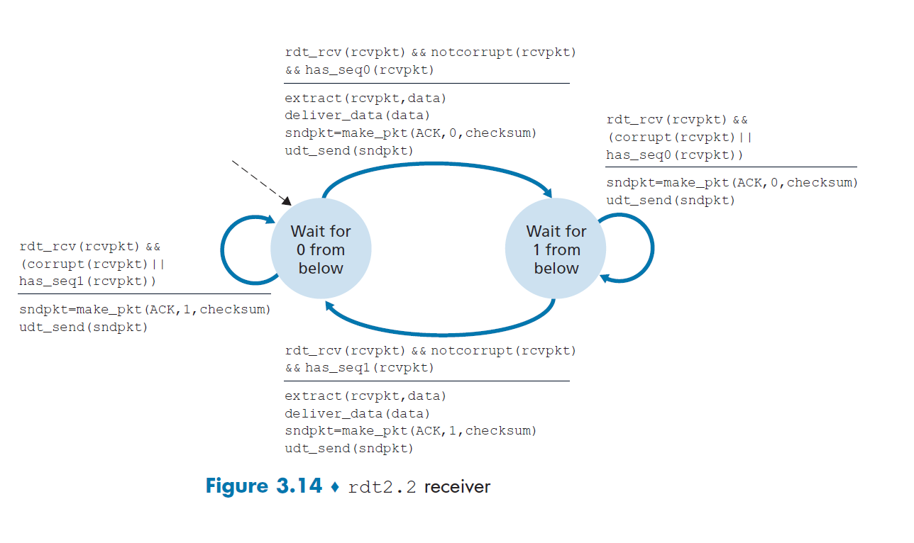

3. **应对丢包问题：rdt 3.0**

**time : 2021-05-31**

现在假定除了比特出错，底层信道还会丢包，这在今天的计算机网络中并不罕见。rdt 3.0 要处理 2 个问题：1. 怎么检测丢包？2. 在丢包时，做什么反应？在 rdt 2.2 中，我们通过重传等技术可以给出第 2 个问题的答案。但第 1 个问题要增加一种新的机制。

假定发送方传输一个数据分组，该分组或者接收方对该分组的 ACK 发生了丢失。在这两种情况下，发送方都收不到应当到来的接收方的响应。如果发送方愿意等待足够长的时间以便确定分组已丢失，则它只需重传该数据分组即可。

但是发送方需要等待多久才能确定丢包呢？很明显发送方至少需要等待这样长的时间：即发送方与接收方之间的一个往返时延（可能会包括在中间路由器的缓冲时延）加上接收方处理一个分组所需的时间。在很多网络中，最坏情况下的最大时延是很难估算的，确定的因素非常少。此外，理想的协议应尽可能快地从丢包中恢复出来；等待一个最坏情况的时延可能意味着要等待一段较长的时间，直到启动差错恢复为止。因此实践中采取的方法是发送方明智地选择一个时间值，以判定可能发生了丢包（尽管不能确保）。如果在这个时间内没有收到 ACK,则重传该分组。注意到如果一个分组经历了一个 特别大的时延，发送方可能会重传该分组，即使该数据分组及其 ACK 都没有丢失。这就在发送方到接收方的信道中引入了冗余数据分组（duplicate data packet）的可能性。幸运的是，rdt 2.2 协议已经有足够的功能（即序号）来处理冗余分组情况。

从发送方的观点来看，重传是一种万能灵药。发送方不知道是一个数据分组丢失，还是一个 ACK 丢失，或者只是该分组或 ACK 过度延时。在所有这些情况下，动作是同样的：重传。为了实现基于时间的重传机制，需要一个 **倒计数定时器(countdown timer)**，在一个给定的时间过期后，可中断发送方。因此，发送方需要能做到：1. 每次发送一个分组（包括第一次分组和重传分组）时，便启动一个定时器。2. 响应定时器中断（采取适当的动作）。3. 终止定时器。

图 3-15 给出了 rdt 3.0 的有限状态机。

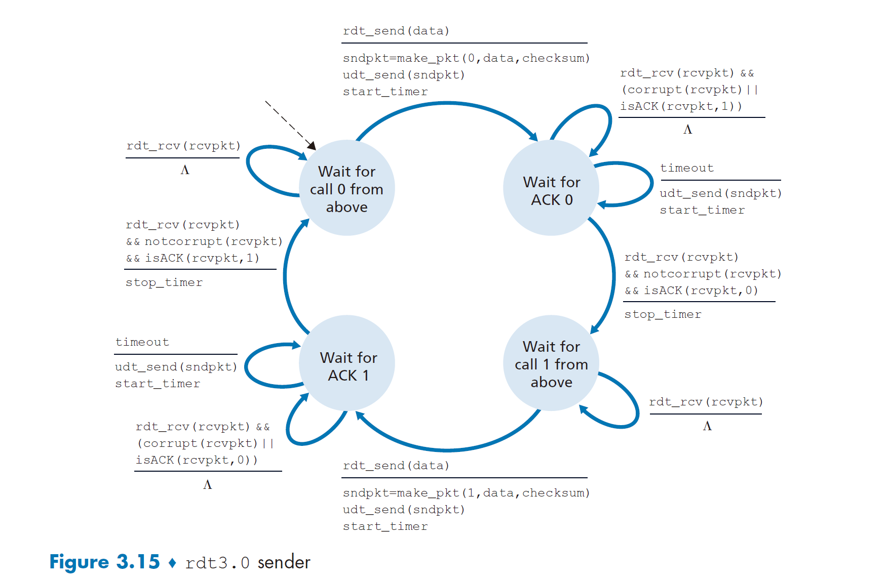

作为课后习题，请读者自行提供 rdt 3.0 的接收方有限状态机。

图 3-16 显示了在没有丢包和延迟分组情况下协议运作的情况，以及它是如何处理数据分组丢失的。在图 3-16 中，时间从图的顶部朝底部移动；注意到一个分组的接收时间必定迟于一个分 组的发送时间，这是因为发送时延与传播时延之故。在图 3-16 b 到 d 中，发送方括号部分表明了定时器的设置时刻以及随后的超时。本章后面的习题探讨了该协议几个更细微的方面。因为分组序号在 0 和 1 之间交替，因此 rdt 3.0 有时被称为 **比特交替协议（alternating-bit protocol)**。


现在我们归纳一下数据传输协议的要点。在检验和、序号、定时器、肯定和否定确认分组这些技术中，每种机制都在协议的运行中起到了必不可少的作用。至此，我们得到了一个可靠数据传输协议！

### 3.4.2. 流水线可靠数据传输协议

rdt 3.0 是一个功能正确的协议，但它的性能不是很好。这个问题在于它是一个停等协议。

为了评价该停等行为对性能的影响，可考虑一种具有两台主机的理想化场合，一台主 机位于美国西海岸，另一台位于美国东海岸，如图 3-17 所示。在这两个端系统之间的光速往返传播时延 RTT 大约为 30 毫秒。假定彼此通过一条发送速率 R 为 1 Gbps（每秒 10^9 比特）的信道相连。包括首部字段和数据的分组长 L 为 1000 字节（8000 比特），发送一个分组进入 1 Gbps 链路实际所需时间是：

```
L(trans) = L / R = (8000 bit/pkt)/(10^9 bit/s) = 0.008 ms
```

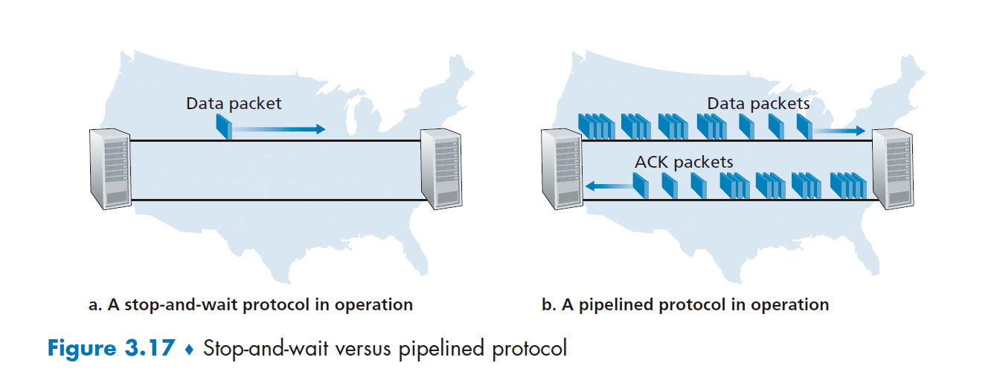

图 3-18a 显示了对于该停等协议，如果发送方在 t = 0 时刻开始发送分组，则在 L/R = 0.008 ms 后，最后 1 比特数据进入了发送端信道。该分组经过 15ms 的穿越国家的旅途后到达接收端，该分组的最后 1 比特在时刻 t = RTT/2 + L/R = 15.008 ms 时到达接收方。为了简化起见，假设 ACK 分组很小（以便我们可以忽略其发送时间），接收方一旦收到一个数据分组的最后 1 比特后立即发送 ACK, ACK 在时刻 t = RTT + L/R= 30. 008 ms 时在发送方出现。此时，发送方可以发送下一个报文。因此，在 30.008 ms 内，发送方的发送只用了 0.008 ms。如果我们定义发送方（或信道）的 **利用率(utilization)** 为：发送方实际忙于将发送比特送进信道的那部分时间与发送时间之比，图 3-18a 中的分析表明了停等协议有着非常低的发送方利用率 U(sender)：

```
U(sender) = (L/R)/(RTT + L/R) = 0.008/30.008 = 0.027 %
```

这就是说，发送方只有万分之 2.7 时间是忙的。从其他角度来看，发送方在 30. 008 ms 内只能发送 1000 字节，有效的吞吐量仅为 267kbps,即使有 1 Gbps 的链路可用也是如此! 想象一个不幸的网络经理购买了一条千兆比容量的链路，但他仅能得到 267kbps 吞吐量的情况！这是一个形象的网络协议限制底层网络硬件所提供的能力的图例。而且，我们还忽略了在发送方和接收方的底层协议处理时间，以及可能岀现在发送方与接收方之间的任何中间路由器上的处理与排队时延。考虑到这些因素，将进一步增加时延，使其性能更糟糕。

这种特殊的性能问题的一个简单解决方法是：不以停等方式运行，允许发送方发送多个分组而无须等待确认，如在图 3-17b 图示的那样。图 3-18b 显示了如果发送方可以在等待确认之前发送 3 个报文，其利用率也基本上提高 3 倍。因为许多从发送方向接收方输送的分组可以被看成是填充到一条流水线中，故这种技术被称为 **流水线(pipelining)**。流水线技术对可靠数据传输协议可带来如下影响：


- 必须增加序号范围，因为每个输送中的分组（不计算重传的）必须有一个唯一的序号，而且也许有多个在输送中的未确认报文。
- 协议的发送方和接收方两端也许不得不缓存多个分组。发送方最低限度应当能缓冲那些已发送但没有确认的分组。如下面讨论的那样，接收方或许也需要缓存那些已正确接收的分组。
- 所需序号范围和对缓冲的要求取决于数据传输协议如何处理丢失、损坏及延时过大的分组。解决流水线的差错恢复有两种基本方法是：**回退 N 步（Go-Back-N,GBN)** 和 **选择重传(Selective Repeat, SR)**。

### 3.4.3. 回退 N 步

**time : 2021-06-01**

在 **回退 N 步(GBN)协议** 中，允许发送方发送多个分组（当由多个分组可用时）而不需等待确认，但它也受限于在流水线中未确认的分组数不能超过某个最大允许数 N。在本节中我们较详细地描述 GBN。


图 3-19 显示了发送方看到的 GBN 协议的序号范围。如果我们将基序号(base)定义为最早未确认分组的序号，将下一个序号(nextseqnum)定义为最小的未使用序号（即下一个待发分组的序号），则可将序号范围分割成 4 段。在［0, base - 1］段内的序号对应于已经发送并被确认的分组。［base, nextseqnum - 1］段内对应已经发送但未被确认的分组。［nextseqnum, base + N - 1］段内的序号能用于那些要被立即发送的分组，如果有数据来自上层的话。最后，大于或等于 base + N 的序号是不能使用的，直到当前流水线中未被确认的分组（特别是序号为 base 的分组）已得到确认为止。

如图 3-19 所提示的那样，那些已被发送但还未被确认的分组的许可序号范围可以被看成是一个在序号范围内长度为 N 的窗口。随着协议的运行，该窗口在序号空间向前滑动。因此，N 常被称为 **窗口长度(window size)**，GBN 协议也常被称为 **滑动窗口协议(sliding-window protocol)**。你也许想知道，我们为什么先要限制这些被发送的、未被确认的分组的数目为 N 呢？为什么不允许这些分组为无限制的数目呢？我们将在 3-5 节看到, 流量控制是对发送方施加限制的原因之一。我们将在 3-7 节学习 TCP 拥塞控制时分析另一个原因。

在实践中，一个分组的序号承载在分组首部的一个固定长度的字段中。如果分组序号字段的比特数是 k 则该序号范围是［0, 2^k-1]。 在一个有限的序号范围内，所有涉及序号的运算必须使用模 2^k 运算。（即序号空间可被看作是一个长度为 2^k 的环，其中序号 2^k-1 紧接着序号 0。）前面讲过，rdt3.0 有一个 1 比特的序号，序号范围是［0, 1］。在本章末的几道习题中探讨了一个有限的序号范围所产生的结果。我们将在 3-5 节看到，TCP 有一个 32 比特的序号字段，其中的 TCP 序号是按字节流中的字节进行计数的，而不是按分组计数。

图 3-20 和图 3-21 给出了一个基于 ACK、无 NAK 的 GBN 协议的发送方和接收方这两端的扩展 FSM 描述。我们称该 FSM 描述为扩展 FSM,是因为我们已经增加了变量（类似于编程语言中的变量）base 和 nextseqnum，还增加了对这些变量的操作以及与这些变量有关的条件动作。注意到该扩展的 FSM 规约现在变得有点像编程语言规约。［Bochman 1984］对 FSM 扩展技术提供了一个很好的综述，也提供了用于定义协议的其他基于编程语言的技术。


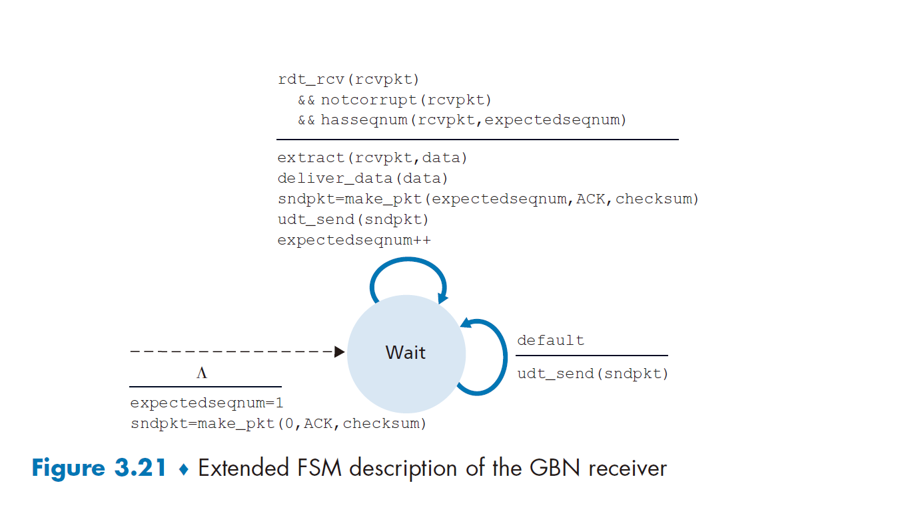

GBN 发送方必须响应三种类型的事件：

- **上层的调用**
  当上层调用 `rdt_send()` 时，发送方首先检查发送窗口是否已满，即是否有 N 个已发送但未被确认的分组。如果窗口未满，则产生一个分组并将其发送，并相应地更新变量。如果窗口已满，发送方只需将数据返回给上层，隐式地指示上层该窗口已满。然后上层可能会过一会儿再试。在实际实现中，发送方更可能缓存（并不立刻发送）这些数据，或者使用同步机制（如一个信号量或标志）允许上层在仅当窗口不满时才调用 `rdt_send()`。
- **收到一个 ACK**
  在 GBN 协议中，对序号为几的分组的确认采取 **累积确认(cumulative acknowledgment)** 的方式，表明接收方已正确接收到序号为 n 的以前且包括 n 在内的所有分组。稍后讨论 GBN 接收方一端时，我们将再次研究这个主题。
- **超时事件**
  协议的名字“回退 N 步”来源于出现丢失和时延过长分组时发送方的行为。就像在停等协议中那样，定时器将再次用于恢复数据或确认分组的丢失。
  如果出现超时，发送方重传所有已发送但还未被确认过的分组。图 3-20 中的发送方仅使用一个定时器，它可被当作是最早的已发送但未被确认的分组所使用的定时器。如果收到一个 ACK，但仍有已发送但未被确认的分组，则定时器被重新启动。如果没有已发送但未被确认的分组，停止该定时器。

在 GBN 中，接收方的动作也很简单。如果一个序号为〃的分组被正确接收到，并且 按序（即上次交付给上层的数据是序号为 n-1 的分组），则接收方为分组 n 发送一个 ACK,并将该分组中的数据部分交付到上层。在所有其他情况下，接收方丢弃该分组，并 为最近按序接收的分组重新发送 ACK。注意到因为一次交付给上层一个分组，如果分组 k 已接收并交付，则所有序号比 k 小的分组也已经交付。因此，使用累积确认是 GBN—个自然的选择。

在 GBN 协议中，接收方丢弃所有失序分组。尽管丢弃一个正确接收（但失序）的分组有点愚蠢和浪费，但这样做是有理由的。前面讲过，接收方必须按序将数据交付给上层。假定现在期望接收分组 n 而分组 n + 1 却到了。因为数据必须按序交付，接收方可能缓存（保存）分组 n + 1,然后，在它收到并交付分组 n 后，再将该分组交付到上层。然而，如果分组 n 丢失，则该分组及分组 n + 1 最终将在发送方根据 GBN 重传规则而被重传。因此，接收方只需丢弃分组 n+ 1 即可。不需要缓存任何失序分组。因此，虽然发送方必须维护窗口的上下边界及 nextseqnum 在该窗口中的位置，但是接收方需要维护的唯一信息就是下一个按序接收的分组的序号。该值保存在 expectedseqnum 变量中，如图 3-21 中接收方 FSM 所示。当然，丢弃一个正确接收的分组的缺点是随后对该分组的重传也 许会丢失或出错，因此甚至需要更多的重传。

图 3-22 给岀了窗口长度为 4 个分组 的 GBN 协议的运行情况。因为该窗口 长度的限制亍发送方发送分组 0~3,然 后在继续发送之前，必须等待直到一个 或多个分组被确认。当接收到每一个连 续的 ACK （例如 ACK 0 和 ACK 1）时, 该窗口便向前滑动，发送方便可以发送 新的分组（分别是分组 4 和分组 5）。在接收方，分组 2 丢失，因此分组 3、4 和 5 被发现是失序分组并被丢弃。

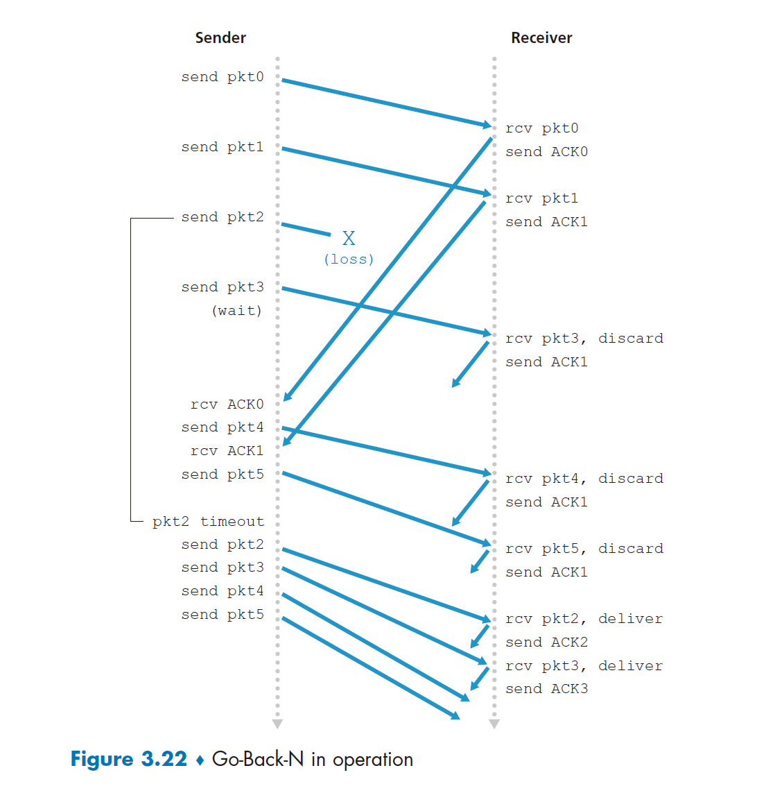

在结束对 GBN 的讨论之前，需要提请注意的是，在协议栈中实现该协议可能与图 3-20 中的扩展 FSM 有相似的这种方法的优点是接收缓存简单，即接收方结构。该实现也可能是以各种过程形式出现，每个过程实现了在响应各种可能岀现的事件时要采取的动作。在这种 **基于事件的编程(event-based programming)** 方式中，这些过程要么被协议栈中的其他过程调用，要么作为一次中断的结果。在发送方，这些事件包括: 1. 来自上层实体的调用去调用 `rdt_send()`；2. 定时器中断；3. 报文到达时，来自下层的调用去调用 `rdt_rcv()`。本章后面的编程作业会使你有机会在一个模拟网络环境中实际实现这些例程，但该环境却是真实的。

这里我们注意到，GBN 协议中综合了我们将在 3-5 节中学习 TCP 可靠数据传输协议时遇到的所有技术。这些技术包括使用序号、累积确认、检验和以及超时/重传操作。

### 3.4.4. 选择重传

在图 3-17 中，GBN 协议潜在地允许发送方用多个分组“填充流水线”，因此避免了停等协议中所提到的信道利用率问题。然而，GBN 本身也有一些情况存在着性能问题。尤其是当窗口长度和带宽时延积都很大时，在流水线中会有很多分组更是如此。单个分组的差 错就能够引起 GBN 重传大量分组，许多分组根本没有必要重传。随着信道差错率的增加, 流水线可能会被这些不必要重传的分组所充斥。想象一下，在我们口述消息的例子中，如果每次有一个单词含糊不清，其前后 1000 个单词（例如，窗口长度为 1000 个单词）不得不被重传的情况。此次口述会由于这些反复述说的单词而变慢。

顾名思义，选择重传（SR）协议通过让发送方仅重传那些它怀疑在接收方出错（即丢失或受损）的分组而避免了不必要的重传。这种个别的、按需的重传要求接收方逐个地确认正确接收的分组。再次用窗口长度 N 来限制流水线中未完成、未被确认的分组数。然而，与 GBN 不同的是，发送方已经收到了对窗口中某些分组的 ACK。图 3-23 显示了 SR 发送方看到的序号空间。图 3-24 详细描述了 SR 发送方所采取的动作。

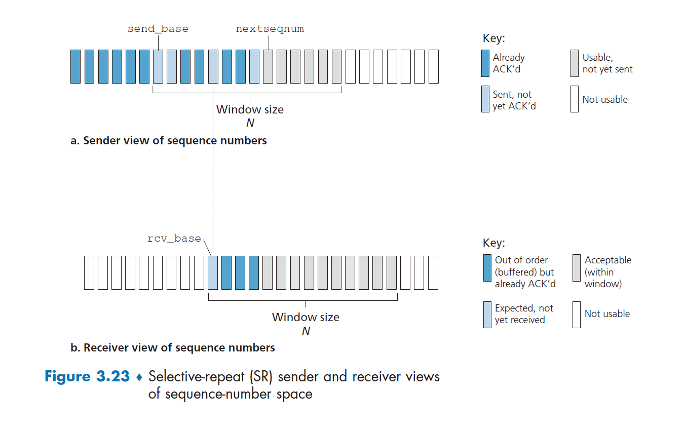

SR 接收方将确认一个正确接收的分组而不管其是否按序。失序的分组将被缓存直到 所有丢失分组（即序号更小的分组）皆被收到为止，这时才可以将一批分组按序交付给上 层。图 3-25 详细列出了 SR 接收方所采用的各种动作。图 3-26 给出了一个例子以说明出现丢包时 SR 的操作。值得注意的是，在图 3-26 中接收方初始时缓存了分组 3、4、5,并在最终收到分组 2 时.才将它们一并交付给上层。

注意到图 3-25 中的第二步很重要，接收方重新确认（而不是忽略）已收到过的那些 序号小于当前窗口基序号的分组。你应该理解这种重新确认确实是需要的。例如，给定在 图 3-23 中所示的发送方和接收方的序号空间，如果分组 send.base 的 ACK 没有从接收方传 播回发送方，则发送方最终将重传分组 send_base,即使显然（对我们而不是对发送方来说!）接收方已经收到了该分组。如果接收方不确认该分组，则发送方窗口将永远不能向 前滑动！这个例子说明了 SR 协议（和很多其他协议一样）的一个重要方面。对于哪些分组已经被正确接收，哪些没有，发送方和接收方并不总是能看到相同的结果。对 SR 协议 而言，这就意味着发送方和接收方的窗口并不总是一致。


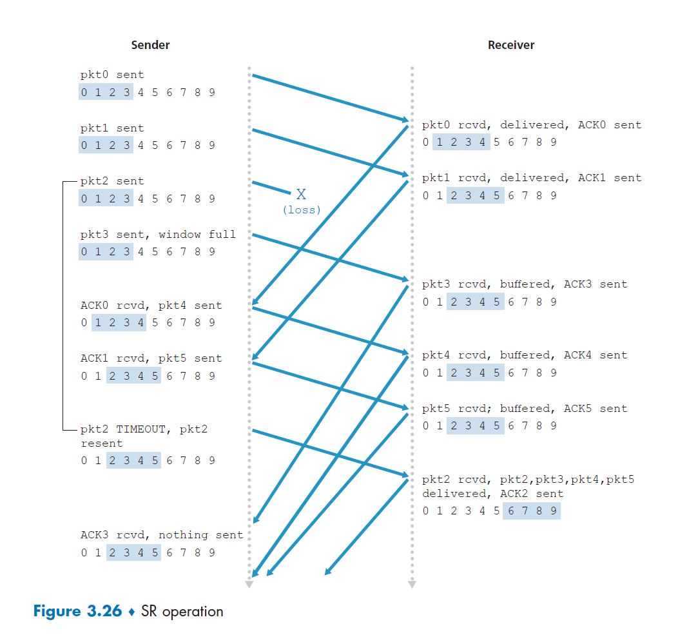

当我们面对有限序号范围的现实时，发送方和接收方窗口间缺乏同步会产生严重的后果。考虑下面例子中可能发生的情况，该例有包括 4 个分组序号 0、1、2、3 的有限序号 范围且窗口长度为 3。假定发送了分组 0 至 2,并在接收方被正确接收且确认了。此时, 接收方窗口落在第 4、5、6 个分组上，其序号分别为 3、0、1。现在考虑两种情况。在第 一种情况下，如图 3-27a 所示，对前 3 个分组的 ACK 丢失，因此发送方重传这些分组。因此，接收方下一步要接收序号为 0 的分组，即第一个发送分组的副本。

在第二种情况下，如图 3-27b 所示，对前 3 个分组的 ACK 都被正确交付。因此发送方 向前移动窗口并发送第 4、5、6 个分组，其序号分别为 3、0、10 序号为 3 的分组丢失， 但序号为 0 的分组到达（一个包含新数据的分组）。

现在考虑一下图 3-27 中接收方的观点，在发送方和接收方之间有一个假想的帘子, 因为接收方不能“看见”发送方采取的动作。接收方所能观察到的是它从信道中收到的以 及它向信道中发出报文序列。就其所关注的而言，图 3-27 中的两种情况是等同的。没有 办法区分是第 1 个分组的重传还是第 5 个分组的初次传输。显然，窗口长度比序号空间小 1 时协议无法工作。但窗口必须多小呢？本章后面的一道习题请你说明为何对于 SR 协议 而言，窗口长度必须小于或等于序号空间大小的一半。


至此我们结束了对可靠数据传输协议的讨论。我们已涵盖许多基础知识，并介绍了多种机制，这些机制可一起提供可靠数据传输。下面这张表总结这些机制。既然我们已经学习了 所有这些运行中的机制，并能看到“全景”，我们建议你再复习一遍本节内容，看看这些 机制是怎样逐步被添加进来，以涵盖复杂性渐增的（现实的）连接发送方与接收方的各种信道模型的，或者如何改善协议性能的。


我们通过考虑在底层信道模型中的一个遗留假设来结束对可靠数据传输协议的讨论。前面讲过，我们曾假定分组在发送方与接收方之间的信道中不能被重新排序。这在发送方与接收方由单段物理线路相连的情况下，通常是一个合理的假设。然而，当连接两端的 “信道”是一个网络时，分组重新排序是可能会发生的。分组重新排序的一个表现就是, 一个具有序号或确认号 x 的分组的旧副本可能会出现，即使发送方或接收方的窗口中都没有包含 x。对于分组重新排序，信道可被看成基本上是在缓存分组，并在将来任意时刻自然地释放岀这些分组。由于序号可以被重新使用，那么必须小心，以免出现这样的冗余分组。实际应用中采用的方法是，确保一个序号不被重新使用，直到发送方“确信”任何先前发送的序号为 x 的分组都不再在网络中为止。通过假定一个分组在网络中的“存活”时间不会超过某个固定最大时间量来做到这一点。在高速网络的 TCP 扩展中，最长的分组寿命被假定为大约 3 分钟[RFC 1323]。 [Sunshine 1978]描述了一种使用序号的方法，它能够完全避免重新排序问题。

## 3.5. 面向连接的运输：TCP

我们在上一节已经学习了可靠数据传输原理，现在就可以来学习 TCP 了。TCP 是因特网运输层的可靠运输协议。我们将在本节看到 TCP 使用了很多可靠数据传输原理，包括差错检测，重传，累计确认，定时器，以及确认号和序号。TCP 定义在 RFC 793、RFC 1122、RFC 1323、 RFC 2018 以及 RFC 2581 中。

### 3.5.1. TCP 连接

TCP 被称为是 **面向连接的(connection-oriented)**，这是因为在一个应用进程可以开始向另一个应用进程发送数据之前，这两个进程必须先相互“握手”，即它们必须相互发送某些预备报文段，以建立确保数据传输的参数。作为 TCP 连接建立的一部分，连接的双方都将初始化与 TCP 连接相关的许多 TCP 状态变量（其中的许多状态变量将在本节和 3-7 节中讨论）。

这种 TCP “连接”不是一条像在电路交换网络中的端到端 TDM 或 FDM 电路。相反, 该“连接”是一条逻辑连接，其共同状态仅保留在两个通信端系统的 TCP 程序中。前面讲过，由于 TCP 协议只在端系统中运行，而不在中间的网络设备（路由器和链路层交换机）中运行，所以中间的网络设备不会维持 TCP 连接状态。事实上，中间设备不关注 TCP 连接，他们看到的是数据报。

一台主机上的 A 进程于另一台主机上的进程 B 存在一条 TCP 连接，那么应用层数据就可在从进程 B 流向进程 A 的同时，也从进程 A 流向进程 B。TCP 连接也总是点对点（point-to-point）的，即在单个发送方与单个接收方之间的连接。所谓“多播”（参见本书的在线补充材料），即在一次发送操作中，从一个发送方将数据传送给多个接收方，这种情况对 TCP 来说是不可能的。

我们现在来看看 TCP 连接是怎样建立的。假设运行在某台主机上的一个进程想与另一台主机上的一个进程建立一条连接。前面讲过，发起连接的这个进程被称为客户进程，而另一个进程被称为服务器进程。该客户应用进程首先要通知客户运输层，它想与服务器上的一个进程建立一条连接。2-7-2 节讲过，一个 Python 客户程序通过发出下面的命令来实现此目的。

```py
clientSocket.connect((serverName,serverPort))
```

其中 serverName 是服务器的名字，serverPort 标识了服务器上的进程。客户上的 TCP 便开始与服务器上的 TCP 建立一条 TCP 连接。我们将在本节后面更为详细地讨论连接建 立的过程。现在知道下列事实就可以了 ：客户首先发送一个特殊的 TCP 报文段，服务器用 另一个特殊的 TCP 报文段来响应，最后，客户再用第三个特殊报文段作为响应。前两个报 文段不承载“有效载荷”，也就是不包含应用层数据；而第三个报文段可以承载应用层数据。由于在这两台主机之间发送了 3 个报文段，所以这种连接建立过程常被称为 **三次握手(three-way handshake)**。

一旦建立起一条 TCP 连接，两个应用进程之间就可以相互发送数据了。我们考虑一下 从客户进程向服务器进程发送数据的情况。如 2-7 节中所述，客户进程通过套接字（该进程之门）传递数据流。数据一旦通过该门，它就由客户中运行的 TCP 控制了。如图 3-28 所示，TCP 将这些数据引导到该连接的 **发送缓存(send buffer)** 里，发送缓存是发起三次握手期间设置的缓存之一。接下来 TCP 就会不时从发送缓存里取出一块数据，并将数据传递到网络层。有趣的是，在 TCP 规范［RFC 793］中却没提及 TCP 应何时实际发送缓存里的数据，只是描述为“TCP 应该在它方便的时候以报文段的形式发送数据"。TCP 可从缓存中取出并放入报文段中的数据数量受限于 **最大报文段长度(Maximum Segment Size, MSS）**。 MSS 通常根据最初确定的由本地发送主机发送的最大链路层帧长度（即所谓的 **最大传输单元(Maximum Transmission Unit, MTU)**）来设置。设置该 MSS 要保证一个 TCP 报文段（当封装在一个 IP 数据报中）加上 TCP/IP 首部长度（通常 40 字节）将适合单个链路层帧。以太网和 PPP 链路层协议都具有 1500 字节的 MTU,因此 MSS 的典型值为 1460 字节。已经提出了多种发现路径 MTU 的方法，并基于路径 MTU 值设置 MSS （路径 MTU 是指能在从源到目的地的所有链路上发送的最大链路层帧［RFC 1191］）。注意到 MSS 是指在报文段里应用层数据的最大长度，而不是指包括首部的 TCP 报文段的最大长度。（该术语很容易混淆，但是我们不得不采用它，因为它已经根深蒂固了。）

TCP 为每块客户数据配上一个 TCP 首部，从而形成多个 **TCP 报文段(TCP segment)**。 这些报文段被下传给网络层，网络层将其分别封装在网络层 IP 数据报中。然后这些 IP 数据报被发送到网络中。当 TCP 在另一端接收到一个报文段后，该报文段的数据就被放入该 TCP 连接的接收缓存中，如图 3-28 中所示。应用程序从此缓存中读取数据流。该连接的每一端都有各自的发送缓存和接收缓存。


从以上讨论中我们可以看出，TCP 连接的组成包括：一台主机上的缓存、变量和与进程连接的套接字，以及另一台主机上的另一组缓存、变量和与进程连接的套接字。如前面讲过的那样，在这两台主机之间的网络设备(路由器，交换机和中继器)中没有为该连接分配任何缓存和变量。

### 3.5.2. TCP 报文段结构

简要地了解了 TCP 连接后，我们研究一下 TCP 报文段结构。TCP 报文段由首部字段和一个数据字段组成。数据字段包含一块应用数据。如前所述，MSS 限制了报文段数据字段的最大长度。当 TCP 发送一个大文件，例如某 Web 页面上的一个图像时，TCP 通常是将该文件划分成长度为 MSS 的若干块(最后一块除外，它通常小于 MSS)。然而，交互式应用通常传送长度小于 MSS 的数据块。例如，对于像 Telnet 这样的远程登录应用，其中 TCP 报文段的数据字段经常只有一个字节。由于 TCP 的首部一般是 20 字节(比 UDP 首部多 12 字节)，所以 Telnet 发送的报文段也许只有 21 字节长。


图 3-29 显示了 TCP 报文段的结构。与 UDP —样，首部包括 **源端口号** 和 **目的端口号**，它被用于多路复用/分解来自或送到上层应用的数据。另外，同 UDP—样，TCP 首部也包括 **检验和字段(checksum field)**。TCP 报文段首部还包含下列字段:

- 32 比特的 **序号字段(sequence number field)** 和 32 比特的 **确认号字段(acknowledgment number field)**。这些字段被 TCP 发送方和接收方用来实现可靠数据传输服务，讨论见后。
- 16 比特的 **接收窗口字段(receive window field)**，该字段用于流量控制。我们很快就会看到，该字段用于指示接收方愿意接受的字节数量。
- 4 比特的 **首部长度字段(header length field)**,该字段指示了以 32 比特的字为单位的 TCP 首部长度。由于 TCP 选项字段的原因，TCP 首部的长度是可变的。(通常, 选项字段为空，所以 TCP 首部的典型长度是 20 字节。)
- 可选与变长的 **选项字段(options field)**,该字段用于发送方与接收方协商最大报文段长度(MSS)时，或在高速网络环境下用作窗口调节因子时使用。首部字段中还定义了一个时间戳选项。可参见 RFC 854 和 RFC 1323 了解其他细节。
- 6 比特的 **标志字段(flag field)**。ACK 比特用于指示确认字段中的值是有效的，即该报文段包括一个对已被成功接收报文段的确认。RST、SYN 和 FIN 比特用于连接建立和拆除，我们将在本节后面讨论该问题。在明确拥塞通告中使用了 CWR 和 ECE 比特，如 3-7-2 节中讨论的那样。当 PSH 比特被置位时，就指示接收方应立 即将数据交给上层。最后，URG 比特用来指示报文段里存在着被发送端的上层实体置为“紧急”的数据。紧急数据的最后一个字节由 16 比特的紧急数据指针字段(urgent data pointer field)指出。当紧急数据存在并给出指向紧急数据尾指针的时候，TCP 必须通知接收端的上层实体。(在实践中，PSH、URG 和紧急数据指针并没有使用。为了完整性起见，我们才提到这些字段。)

1. **序号与确认号**

TCP 报文段首部中两个最重要的字段是序号字段和确认号字段。这两个字段是 TCP 可靠传输服务的关键部分。但是在讨论这两个字段是如何用于提供可靠数据传输之前，我们首先来解释一下 TCP 在这两个字段中究竟放置了什么。

TCP 把数据看成一个无结构的、有序的字节流。我们从 TCP 对序号的使用上可以看出这一点，因为序号是建立在传送的字节流之上，而不是建立在传送的报文段的序列之上。一个 **报文段的序号(sequence number for a segment)** 因此是该报文段首字节的字节流编号。 举例来说，假设主机 A 上的一个进程想通过一条 TCP 连接向主机 B 上的一个进程发送一个数据流。主机 A 中的 TCP 将隐式地对数据流中的每一个字节编号。假定数据流由一个包含 500000 字节的文件组成，其 MSS 为 1000 字节，数据流的首字节编号是 0。如图 3-30 所示，该 TCP 将为该数据流构建 500 个报文段。给第一个报文段分配序号 0，第二个报文段分配序号 1000，第三个报文段分配序号 2000，以此类推。每一个序号被填入到相应 TCP 报文段首部的序号字段中。

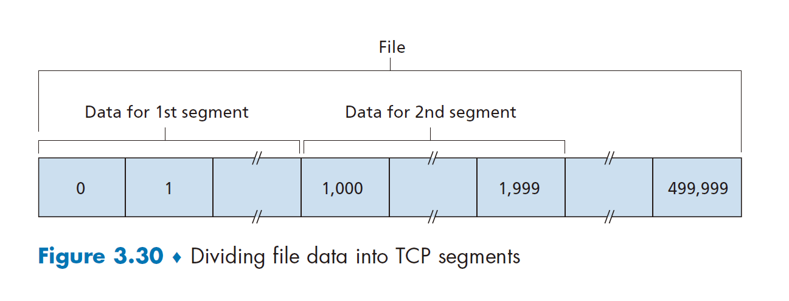

现在我们考虑一下确认号。确认号要比序号难处理一些。前面讲过，TCP 是全双工的, 因此主机 A 在向主机 B 发送数据的同时，也许也接收来自主机 B 的数据(都是同一条 TCP 连接的一部分)。从主机 B 到达的每个报文段中都有一个序号用于从 B 流向 A 的数据。主机 A 填充进报文段的确认号是主机 A 期望从主机 B 收到的下一字节的序号。看一些例子有助于理解实际发生的事情。假设主机 A 已收到了来自主机 B 的编号为 0 ~535 的所有字节，同时假设它打算发送一个报文段给主机 B。主机 A 等待主机 B 的数据流中字节 536 及之后的所有 字节。所以主机 A 就会在它发往主机 B 的报文段的确认号字段中填上 536。

再举一个例子，假设主机 A 已收到一个来自主机 B 的包含字节 0 ~535 的报文段，以及另一个包含字节 900〜1000 的报文段。由于某种原因，主机 A 还没有收到字节 536 - 899 的报文段。在这个例子中，主机 A 为了重新构建主机 B 的数据流，仍在等待字节 536 （和其后的字 节）。因此，A 到 B 的下一个报文段将在确认号字段中包含 536。因为 TCP 只确认该流中至第一个丢失字节为止的字节，所以 TCP 被称为提供累积确认（cumulative acknowledgment）。

最后一个例子也会引发一个重要而微妙的问题。主机 A 在收到第二个报文段（字节 536 ~899）之前收到第三个报文段（字节 900 ~ 1000）。因此，第三个报文段失序到达。该微妙的问题是：当主机在一条 TCP 连接中收到失序报文段时该怎么办？有趣的是，TCP RFC 并没有为此明确规定任何规则，而是把这一问题留给实现 TCP 的编程人员去处理。他们有两个基本的选择：1. 接收方立即丢弃失序报文段（如前所述，这可以简化接收方的设计）；2. 接收方保留失序的字节，并等待缺少的字节以填补该间隔。显然，后一种选择对网络带宽而言更为有效，是实践中采用的方法。

在图 3-30 中，我们假设初始序号为 0。事实上，一条 TCP 连接的双方均可随机地选择初始序号。这样做可以减少将那些仍在网络中存在的来自两台主机之间先前已终止的连接的报文段，误认为是后来这两台主机之间新建连接所产生的有效报文段的可能性（它碰巧与旧连接使用了相同的端口号）［Sunshine 1978］。

### 3.5.3. 往返时间的估计与超时

### 3.5.4. 可靠数据传输

### 3.5.5. 流量控制

### 3.5.6. TCP 连接管理

## 3.6. 拥塞控制原理

### 3.6.1. 拥塞原因与代价

### 3.6.2. 拥塞控制方法

## 3.7. 公平性

### 3.7.1. 公平性

### 3.7.2. 网络辅助拥塞控制

## 3.8. 实验 5：用 wireshark 观察 TCP

## 3.9. 实验 6：用 wireshark 观察 UDP
